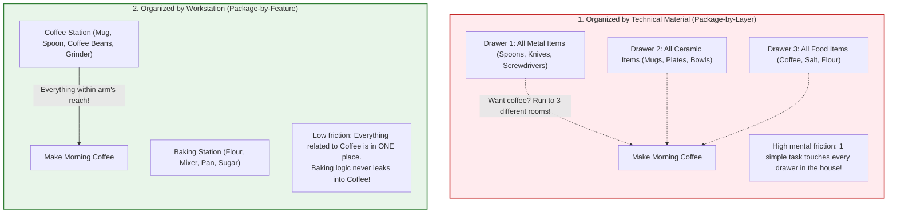
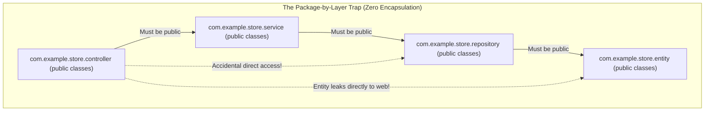
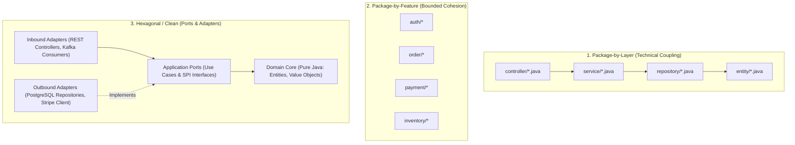
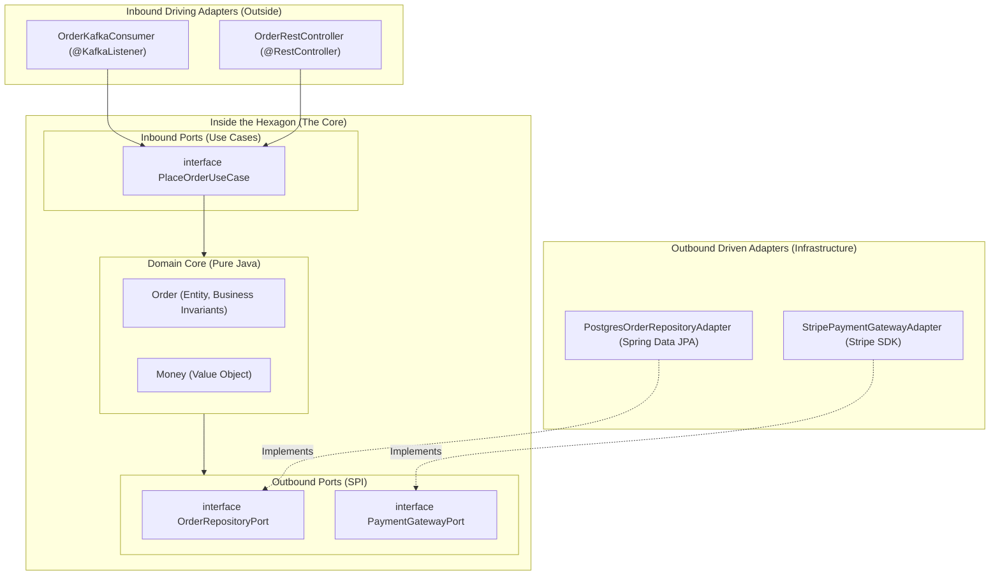

## Prerequisites: Before You Begin

Before studying enterprise architecture and package design, ensure you understand:
- **Java Access Modifiers**: The physical distinction between `public`, `protected`, `default` (package-private), and `private`.
- **Dependency Inversion Principle (DIP)**: High-level business policies should not depend on low-level infrastructure details; both should depend on abstractions.
- **Spring IoC & Classpath Scanning**: How `@ComponentScan` discovers beans by scanning base packages and their subpackages.

---

# Phase 1: Ground Floor (Everyday Mental Model)

## 1. The Everyday Analogy: The Kitchen Drawers vs. The Coffee Station

To understand why folder organization makes or breaks a software project, look at two ways to organize a kitchen:



### The "Organized by Material" Trap (Package-by-Layer)
- Imagine putting **all metal items** in one drawer, **all ceramic items** in a second drawer, and **all powders** in a third drawer.
- If you want to make a cup of coffee:
  1. You open the metal drawer to find a spoon.
  2. You open the ceramic drawer to find a mug.
  3. You open the powder drawer to find coffee grounds.
- To do one single task, you opened three separate drawers across the room.
- In software, this is **Package-by-Layer**: all controllers in one folder, all services in another folder, and all repositories in a third folder. To add a simple field to `Order`, you must open 5 folders and edit 5 distant files.

### The "Cooking Station" Solution (Package-by-Feature)
- Instead, you create a dedicated **Coffee Station**: the coffee machine, the coffee beans, the mugs, and the spoons are all clustered on the same countertop.
- When you want coffee, you stand at the Coffee Station and everything you need is right in front of you.
- In software, this is **Package-by-Feature**: `OrderController`, `OrderService`, `OrderRepository`, and `OrderDto` all live inside `package com.example.store.order`. Everything related to Orders is within arm's reach!

---

# Phase 2: The Physical Problems of Package-by-Layer

## 2. The Package-by-Layer Anti-Pattern (The "Big Ball of Mud")

When starting a new Spring Boot application, most beginners arrange code into technical folders: `controller`, `service`, `repository`, and `entity`.

```bash
com.example.store
├── controller/
│   ├── OrderController.java
│   └── PaymentController.java
├── service/
│   ├── OrderService.java
│   └── PaymentService.java
├── repository/
│   ├── OrderRepository.java
│   └── PaymentRepository.java
└── entity/
    ├── Order.java
    └── Payment.java
```

While simple for trivial 3-table CRUD prototypes, this **Package-by-Layer** pattern breaks down catastrophically in enterprise production backends:



### The 3 Structural Disasters of Package-by-Layer

1. **Zero Encapsulation**: In Java, packages define the physical boundary for `default` (package-private) visibility. Because `OrderController` in `com.example.store.controller` must call `OrderService` in `com.example.store.service`, **every single class, interface, and method must be declared `public`**! Once classes are public, any developer can call anything from anywhere, creating an unmaintainable "Big Ball of Mud".
2. **Entity Leaks to the Edge**: Controllers accept or return database JPA `@Entity` objects directly over HTTP. This exposes sensitive database columns (password hashes, internal IDs), breaks API contracts whenever database columns change, and triggers `LazyInitializationException` outside database transactions.
3. **Spaghetti Dependencies**: Nothing stops a developer in `PaymentService` from injecting `OrderRepository` directly, bypassing all order validation logic.

---

## 2. Architecture Evolution: Layers vs Feature vs Hexagonal



### Comparing Architectural Topologies

| Dimension | Package-by-Layer | Package-by-Feature | Hexagonal (Ports & Adapters) |
| :--- | :--- | :--- | :--- |
| **Encapsulation** | Very Weak (Everything `public`) | **Strong** (Package-private `default`) | **Very Strong** (Domain isolated from frameworks) |
| **Navigation** | Poor (Features scattered across 5 folders) | **High** (All related logic in 1 place) | **High** (Clear separation of intent vs infra) |
| **Framework Independence** | Zero (Domain tied to Spring & Hibernate) | Low (Spring annotations in domain) | **Complete** (Domain is pure Java without Spring) |
| **Best Used For** | Small prototypes (&lt; 5 entities) | Standard production microservices | Complex enterprise domains, financial ledgers |

---

# Phase 2: Package-by-Feature & Java Encapsulation

By packaging by business capability (feature), we leverage Java's **Package-Private (default)** access modifier. Only the classes meant to be called from the outside are marked `public`. All internal service helpers, entities, and repositories remain package-private:

```bash
com.example.store
├── order/
│   ├── OrderController.java         (public - exposed HTTP endpoint)
│   ├── OrderService.java            (public interface or class - module boundary)
│   ├── OrderServiceImpl.java       (package-private - hidden implementation)
│   ├── OrderRepository.java         (package-private - hidden from other packages!)
│   ├── Order.java                   (package-private - JPA entity hidden from web!)
│   ├── OrderLine.java               (package-private)
│   ├── CreateOrderRequest.java      (public record - API contract)
│   └── OrderResponse.java           (public record - API contract)
├── payment/
│   ├── PaymentController.java       (public)
│   ├── PaymentService.java          (public - order package calls this)
│   ├── PaymentClient.java           (package-private - Stripe HTTP calls)
│   └── PaymentRecord.java           (package-private)
└── common/
    ├── error/
    └── security/
```

<Tip>
**The Encapsulation Advantage**:
In the structure above, `com.example.store.payment` **cannot** inject or query `OrderRepository` directly because `OrderRepository` is package-private. The Java compiler physically rejects the import! The only way the payment module can interact with orders is through the public `OrderService` contract.
</Tip>

---

# Phase 3: Hexagonal Architecture (Ports & Adapters)

In core enterprise systems (banking, insurance, logistics), frameworks like Spring Boot and libraries like Hibernate change over time, but core business rules remain constant.

**Hexagonal Architecture** places the business domain at the center. The domain contains **zero Spring annotations**, **zero JPA imports**, and **zero external dependencies**.



---

## 1. The Pure Domain Core (Zero Framework Dependencies)

Notice: No `@Entity`, no `@Table`, no `@Id`, no `@Autowired`. Plain, pure Java:

```java
package com.example.domain.model;

import java.math.BigDecimal;
import java.util.Objects;
import java.util.UUID;

// Pure Java Domain Entity enforcing strict business invariants
public class Order {

    private final UUID id;
    private final UUID customerId;
    private BigDecimal totalAmount;
    private OrderStatus status;

    public Order(UUID id, UUID customerId, BigDecimal totalAmount) {
        if (totalAmount.compareTo(BigDecimal.ZERO) <= 0) {
            throw new IllegalArgumentException("Order total amount must be strictly positive!");
        }
        this.id = Objects.requireNonNull(id);
        this.customerId = Objects.requireNonNull(customerId);
        this.totalAmount = totalAmount;
        this.status = OrderStatus.PENDING;
    }

    public void markPaid() {
        if (this.status != OrderStatus.PENDING) {
            throw new IllegalStateException("Cannot pay an order in status: " + this.status);
        }
        this.status = OrderStatus.PAID;
    }

    public UUID getId() { return id; }
    public UUID getCustomerId() { return customerId; }
    public BigDecimal getTotalAmount() { return totalAmount; }
    public OrderStatus getStatus() { return status; }
}
```

---

## 2. Inbound & Outbound Ports (Contracts)

```java
package com.example.domain.port.inbound;

import com.example.domain.model.Order;
import java.math.BigDecimal;
import java.util.UUID;

// Inbound Port: What the outside world can request of the domain
public interface PlaceOrderUseCase {
    Order placeOrder(UUID customerId, BigDecimal amount);
}
```

```java
package com.example.domain.port.outbound;

import com.example.domain.model.Order;
import java.util.Optional;
import java.util.UUID;

// Outbound Port (SPI): What the domain requires from infrastructure
public interface OrderRepositoryPort {
    void save(Order order);
    Optional<Order> findById(UUID id);
}
```

---

## 3. The Outbound Adapter (Spring Data JPA)

The database adapter implements the domain's outbound port. It maps between the pure domain entity and the database JPA entity:

```java
package com.example.infrastructure.adapter.persistence;

import com.example.domain.model.Order;
import com.example.domain.port.outbound.OrderRepositoryPort;
import org.springframework.stereotype.Component;

import java.util.Optional;
import java.util.UUID;

@Component
public class PostgresOrderRepositoryAdapter implements OrderRepositoryPort {

    private final SpringDataOrderJpaRepository jpaRepository;

    public PostgresOrderRepositoryAdapter(SpringDataOrderJpaRepository jpaRepository) {
        this.jpaRepository = jpaRepository;
    }

    @Override
    public void save(Order order) {
        OrderJpaEntity entity = OrderJpaEntity.fromDomain(order);
        jpaRepository.save(entity);
    }

    @Override
    public Optional<Order> findById(UUID id) {
        return jpaRepository.findById(id).map(OrderJpaEntity::toDomain);
    }
}
```

---

# Phase 4: Spring Modulith (Modular Monolith Architecture)

For organizations that want the modular isolation of microservices without the operational overhead of running 50 Kubernetes deployments, **Spring Modulith** enforces architectural boundaries within a single Spring Boot application:

```xml
<dependency>
    <groupId>org.springframework.modulith</groupId>
    <artifactId>spring-modulith-starter-core</artifactId>
    <version>1.1.2</version>
</dependency>
<dependency>
    <groupId>org.springframework.modulith</groupId>
    <artifactId>spring-modulith-starter-test</artifactId>
    <version>1.1.2</version>
    <scope>test</scope>
</dependency>
```

### Module Discovery Rules in Spring Modulith

```bash
com.example.store
├── BackendApplication.java       (Main Spring Boot Application)
├── order/                        (MODULE 1: Named "order")
│   ├── OrderService.java         (PUBLIC: API exposed to other modules)
│   ├── internal/                 (INTERNAL: Hidden from all other modules!)
│   │   ├── OrderRepository.java
│   │   └── OrderEntity.java
├── payment/                      (MODULE 2: Named "payment")
│   ├── PaymentService.java
│   └── internal/
│       └── StripeClient.java
```

- Each top-level subpackage directly beneath the `@SpringBootApplication` root package is treated as an independent **Application Module**.
- Classes in `order/` (the root of the module) are public API contracts.
- Any subpackages like `order/internal/` are strictly private to that module.

### Automated Architecture Verification with Spring Modulith

```java
package com.example.store;

import org.junit.jupiter.api.Test;
import org.springframework.modulith.core.ApplicationModules;
import org.springframework.modulith.docs.Documenter;

class ModulithArchitectureTest {

    ApplicationModules modules = ApplicationModules.of(BackendApplication.class);

    @Test
    void verifyArchitecture() {
        // Automatically FAILS build if Module A accesses internal package of Module B!
        // Automatically FAILS build if circular module dependencies exist!
        modules.verify();
    }

    @Test
    void generateDocumentation() {
        // Automatically generates PlantUML and C4 architecture diagrams in target/modulith-docs!
        new Documenter(modules).writeDocumentation();
    }
}
```

---

# Phase 5: Automated Architectural Governance with ArchUnit

**ArchUnit** enables engineering teams to write unit tests in Java that inspect compiled JVM bytecode to enforce architectural governance rules in CI:

```xml
<dependency>
    <groupId>com.tngtech.archunit</groupId>
    <artifactId>archunit-junit5</artifactId>
    <version>1.2.1</version>
    <scope>test</scope>
</dependency>
```

### Comprehensive Production ArchUnit Test Suite

```java
package com.example.store;

import com.tngtech.archunit.core.importer.ImportOption;
import com.tngtech.archunit.junit.AnalyzeClasses;
import com.tngtech.archunit.junit.ArchTest;
import com.tngtech.archunit.lang.ArchRule;
import org.springframework.stereotype.Controller;
import org.springframework.stereotype.Repository;
import org.springframework.stereotype.Service;
import org.springframework.web.bind.annotation.RestController;

import static com.tngtech.archunit.lang.syntax.ArchRuleDefinition.classes;
import static com.tngtech.archunit.lang.syntax.ArchRuleDefinition.noClasses;
import static com.tngtech.archunit.library.Architectures.layeredArchitecture;
import static com.tngtech.archunit.library.dependencies.SlicesRuleDefinition.slices;

@AnalyzeClasses(packages = "com.example.store", importOptions = ImportOption.DoNotIncludeTests.class)
public class ArchitectureGovernanceTest {

    // Rule 1: Layered Isolation
    @ArchTest
    static final ArchRule controllers_must_not_access_repositories =
        noClasses().that().areAnnotatedWith(RestController.class)
            .or().areAnnotatedWith(Controller.class)
            .should().dependOnClassesThat().areAnnotatedWith(Repository.class)
            .because("Controllers must delegate all persistence operations through the Service layer");

    // Rule 2: Inbound Directionality
    @ArchTest
    static final ArchRule services_must_not_access_controllers =
        noClasses().that().areAnnotatedWith(Service.class)
            .should().dependOnClassesThat().areAnnotatedWith(RestController.class)
            .because("Lower business layers must never depend on HTTP web controllers");

    // Rule 3: Circular Package Dependency Ban
    @ArchTest
    static final ArchRule packages_must_be_free_of_cycles =
        slices().matching("com.example.store.(*)..")
            .should().beFreeOfCycles()
            .because("Circular package dependencies create spaghetti coupling and prevent modularity");

    // Rule 4: Standard Naming Conventions
    @ArchTest
    static final ArchRule service_naming_convention =
        classes().that().resideInAPackage("..service..")
            .and().areAnnotatedWith(Service.class)
            .should().haveSimpleNameEndingWith("Service")
            .because("Service beans must follow standard naming conventions for searchability");
}
```

---

# Phase 6: Senior Interview Ace & Verification

## The Senior Engineer vs Junior Engineer Mindset

| Scenario | Junior Engineer Answer | Staff / Senior Engineer Answer |
| :--- | :--- | :--- |
| **How do you organize packages in a new Spring Boot project?** | "I create controller, service, repository, and model packages because that's standard Spring layering." | "Package-by-layer violates encapsulation because all classes and repositories must be declared `public`. For microservices, I use Package-by-Feature to leverage Java's package-private modifier, hiding internal entities and repositories from external features. For complex domains, I use Hexagonal Architecture or Spring Modulith to decouple core business logic from frameworks." |
| **What is Hexagonal Architecture and why would you use it?** | "It's an architecture with ports and adapters that makes code cleaner." | "Hexagonal Architecture enforces the Dependency Inversion Principle around business logic. The domain core contains pure Java models and port interfaces with zero framework dependencies. Inbound adapters (REST/Kafka) drive the domain via Inbound Ports; infrastructure (PostgreSQL/Stripe) implements Outbound Ports. This isolates core business invariants from framework upgrades, ORM changes, and external SDK deprecations." |
| **How do you prevent circular dependencies between Spring beans?** | "You just add `@Lazy` to one of the constructor parameters." | "`@Lazy` is an architectural anti-pattern that masks circular coupling with a synthetic proxy. Circular dependencies indicate a violation of the Single Responsibility Principle. I eliminate them by either (1) extracting the shared concern into a third collaborator, or (2) decoupling the communication asynchronously using Spring Domain Events (`ApplicationEventPublisher`)." |

---

## Active Recall & Interview Mastery

<AccordionGroup>
  <Accordion title="1. Why does Package-by-Layer violate Java encapsulation in enterprise backends?">
    In Package-by-Layer, classes are grouped by technical concerns (`com.app.controller`, `com.app.service`, `com.app.repository`). Because Java packages form the encapsulation boundary for package-private (default) access, classes in `controller` cannot invoke classes in `service` unless those service classes, methods, and repositories are explicitly declared `public`. Consequently, every bean in the entire application becomes globally accessible, allowing any developer to bypass domain boundaries and inject arbitrary repositories anywhere.
  </Accordion>

  <Accordion title="2. What is the fundamental difference between Inbound and Outbound Ports in Hexagonal Architecture?">
    An **Inbound Port** (Driving Port) defines the use case interface that the core domain exposes to external drivers (e.g., `PlaceOrderUseCase` invoked by a REST controller or Kafka consumer). An **Outbound Port** (Driven Port / SPI) defines an interface that the domain *requires* from infrastructure to do its job (e.g., `OrderRepositoryPort` or `PaymentGatewayPort`). The domain owns both port interfaces; outbound adapters in infrastructure implement the outbound ports via the Dependency Inversion Principle.
  </Accordion>

  <Accordion title="3. Why is using @Lazy to fix circular dependencies considered a toxic anti-pattern?">
    `@Lazy` does not resolve the underlying architectural flaw: it simply instructs Spring to inject a synthetic dynamic proxy instead of initializing the bean immediately. The circular reference and tight coupling between the two components remain intact. This masks architectural rot, introduces subtle race conditions in multithreaded environments, and can cause unexpected runtime exceptions during late lazy proxy initialization.
  </Accordion>

  <Accordion title="4. How does Spring Modulith verify architectural boundaries at build time?">
    Spring Modulith inspects the package structure and bytecode of an application, modeling first-level subpackages as logical domain modules. By running `ApplicationModules.of(Application.class).verify()` inside a standard JUnit test, Modulith verifies that no internal (package-private or non-API) types from Module A are imported by Module B, failing the build if illegal cross-module dependencies or circular dependencies are introduced.
  </Accordion>

  <Accordion title="5. How does ArchUnit help maintain team discipline in enterprise codebases?">
    ArchUnit allows engineering teams to write unit tests that enforce architectural rules as code. Rules such as *"Controllers must never talk to Repositories"* or *"Domain entities must not import Spring packages"* execute in seconds during `mvn test`. If an engineer violates these rules, the build immediately fails in CI with a detailed line-by-line violation report, preventing architectural decay before pull requests can be merged.
  </Accordion>

  <Accordion title="6. What are the trade-offs between Hexagonal Architecture and Package-by-Feature?">
    Package-by-Feature is simpler, requires less boilerplate, and allows Spring/JPA annotations directly on entities, making it fast and pragmatic for standard CRUD microservices. Hexagonal Architecture introduces strict mapping layers (Domain Entity $\leftrightarrow$ JPA Entity $\leftrightarrow$ Web DTO) and port interfaces. While it requires more code, it provides complete isolation of domain logic from framework changes, database migrations, and transport protocols, making it essential for complex, mission-critical business domains.
  </Accordion>

  <Accordion title="7. How does Spring Modulith support isolated integration testing with @ApplicationModuleTest?">
    `@ApplicationModuleTest` allows developers to test an individual business module (e.g., the `order` module) without booting the entire application's bean graph. It automatically mocks or stubs out external module dependencies while initializing all internal components of the target module, enabling fast, isolated integration testing that runs in milliseconds rather than minutes.
  </Accordion>

  <Accordion title="8. How do you break a circular dependency between OrderService and PaymentService using Domain Events?">
    Instead of `PaymentService` directly injecting `OrderService` to call `orderService.markPaid()`, `PaymentService` publishes a lightweight domain event: `eventPublisher.publishEvent(new PaymentCompletedEvent(orderId))`. `OrderService` listens to the event using `@TransactionalEventListener(phase = AFTER_COMMIT)`. Both services now have zero direct dependencies on each other, breaking the circular reference while maintaining transaction safety.
  </Accordion>
</AccordionGroup>

---

## Done Checklist

<Check>
- [ ] Identify the 3 structural flaws of Package-by-Layer (public visibility bloat, entity leaks, spaghetti dependencies).
- [ ] Organize enterprise code by business capabilities using Package-by-Feature.
- [ ] Leverage Java's `default` (package-private) access modifier to hide repositories and entities.
- [ ] Explain the core principles of Hexagonal Architecture (Ports and Adapters).
- [ ] Author pure Java domain models completely free of Spring, Hibernate, or Jakarta annotations.
- [ ] Define Inbound Ports (Use Cases) and Outbound Ports (Driven SPIs).
- [ ] Implement Outbound Adapters that map between domain models and database JPA entities.
- [ ] Structure Spring Modulith modules beneath the `@SpringBootApplication` root package.
- [ ] Enforce module encapsulation using `ApplicationModules.of(App.class).verify()`.
- [ ] Automatically generate living architecture documentation (PlantUML, C4) via Modulith.
- [ ] Explain why `@Lazy` circular dependency workarounds are architectural code smells.
- [ ] Decouple bidirectional bean dependencies cleanly using Spring Domain Events.
- [ ] Write ArchUnit tests preventing controllers from directly accessing repositories.
- [ ] Write ArchUnit tests banning cyclic package dependencies across the codebase.
- [ ] Test individual domain modules in isolation using Spring Modulith's `@ApplicationModuleTest`.
</Check>
