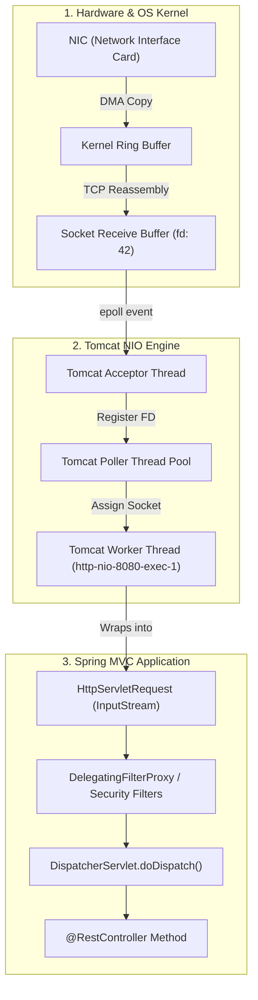
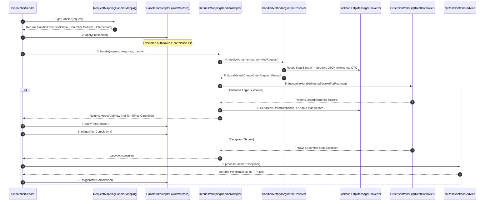
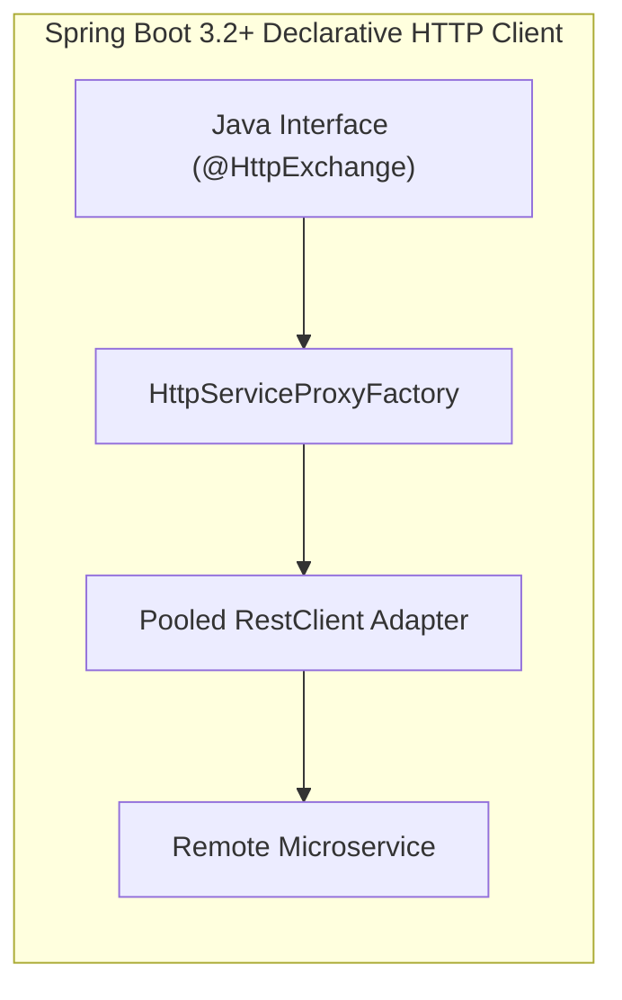
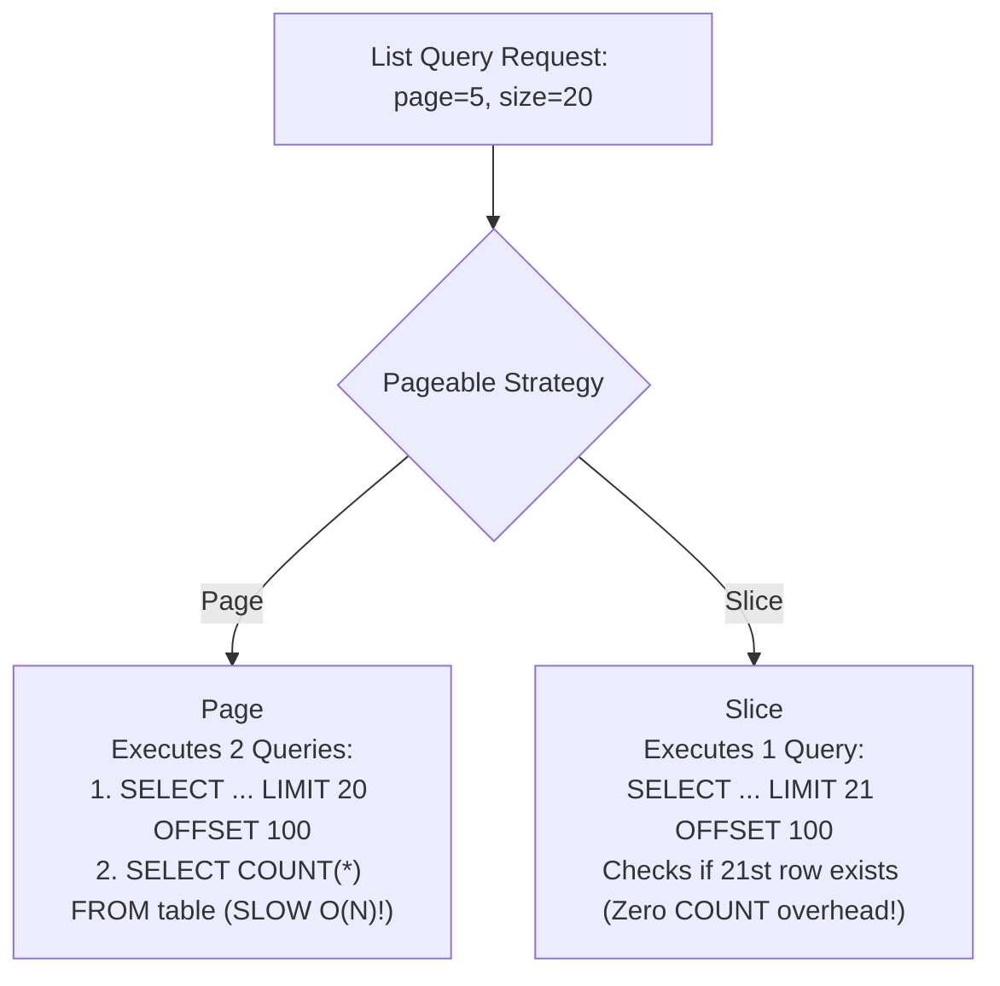
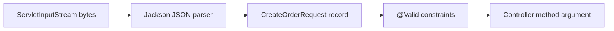

# Spring MVC REST Architecture: DispatcherServlet, Declarative Clients & Streaming

In Spring Boot, building a REST API is often taught simply as annotating a class with `@RestController` and `@GetMapping`. Beginners assume Spring Boot "magically" understands JSON, extracts URL parameters, and returns HTTP responses.

However, in high-throughput production backends, treating Spring MVC as magic annotations leads to catastrophic outages:
- **JVM OutOfMemoryError crashes** when returning unbounded collections or buffering 500,000-row CSV exports in memory.
- **Tomcat thread pool starvation** when external REST calls freeze all 200 worker threads due to missing connection and socket timeouts.
- **Severe database latency spikes** caused by returning `Page<T>`, which secretly triggers unindexed `COUNT(*)` queries on multi-million row tables.
- **Jackson infinite recursion and `LazyInitializationException` crashes** when JPA domain entities are leaked directly into HTTP responses.
- **Inconsistent, unstructured error payloads** that silently crash mobile applications and third-party API clients.

This masterclass provides an exhaustive, production-grade guide to Spring MVC web architecture—building from raw physical network sockets up to Staff-level performance tuning.

---

## Phase 1: Ground Floor (Physical First Principles)

To understand Spring MVC, we must discard all framework abstractions and observe what an HTTP request **physically** is.

### 1.1 The Physical Reality of an HTTP Request
An HTTP request is not a Java object. It is a sequence of plain ASCII and binary bytes transmitted over physical copper wires or fiber-optic cables as TCP packets:

```http
POST /api/v1/orders HTTP/1.1\r\n
Host: api.example.com\r\n
Authorization: Bearer eyJhbGciOi...\r\n
Content-Type: application/json\r\n
Content-Length: 42\r\n
\r\n
{"productId": 101, "quantity": 2}
```

When these bytes arrive at your server's Network Interface Card (NIC):
1. **NIC Interrupt**: The NIC raises a hardware interrupt and copies the raw bytes via Direct Memory Access (DMA) into an OS kernel ring buffer.
2. **OS TCP Stack**: The Linux kernel reassembles TCP packets, verifies checksums, strips TCP/IP headers, and writes the data into the **socket receive buffer** associated with a specific file descriptor (e.g., `fd: 42`).
3. **Servlet Container (Apache Tomcat)**: An embedded web server running inside the JVM reads these raw bytes from `fd: 42` using non-blocking I/O (`epoll` on Linux).



### 1.2 The Evolution: Why Spring Invented the `DispatcherServlet`
In the early days of Java web development (Java EE Servlets), every single endpoint required its own dedicated Servlet class registered in an XML deployment descriptor (`web.xml`):

```java
// The Old 1999 Way: A separate servlet for every single endpoint!
public class CreateOrderServlet extends HttpServlet {
    @Override
    protected void doPost(HttpServletRequest req, HttpServletResponse resp) throws IOException {
        // 1. Manually parse request URL parameters
        // 2. Manually read InputStream bytes
        // 3. Manually parse JSON or form data
        // 4. Manually validate input
        // 5. Manually invoke business logic
        // 6. Manually write HTTP headers and JSON byte output
    }
}
```

If an enterprise application had 300 endpoints, you needed 300 Servlets, 300 URL mapping definitions, and hundreds of repetitive lines parsing strings, casting types, and handling errors.

Spring solved this fundamental architectural problem by implementing the **Front Controller Design Pattern**:
- **A Single Front Controller (`DispatcherServlet`)**: Exactly **one** master servlet receives 100% of all incoming HTTP requests.
- **Dynamic Routing**: Instead of hardcoded servlet mappings, `DispatcherServlet` acts as a central traffic router. It consults an in-memory route registry (`HandlerMapping`) to identify which Spring bean method should process the request.
- **Dynamic Reflection & Deserialization**: An adapter (`HandlerAdapter`) automatically parses path variables, deserializes JSON byte streams into typed Java records, executes validation, and serializes the return value into the HTTP response stream.

---

## Phase 2: The Naive Code (The Production Crash)

Let's examine how a beginner instinctively writes a Spring Boot controller and the disastrous production outages that follow.

### The Naive Controller Implementation
```java
@RestController
@RequestMapping("/api/v1/reports")
public class NaiveReportController {

    @Autowired
    private OrderRepository orderRepository;

    @Autowired
    private RestTemplate restTemplate;

    // CRASH SCENARIO 1: Unbounded collection export
    @GetMapping("/orders/export")
    public List<Order> exportAllOrders() {
        // Loads every single order directly into memory!
        return orderRepository.findAll(); 
    }

    // CRASH SCENARIO 2: Synchronous unpooled HTTP call
    @PostMapping("/orders/{id}/fraud-check")
    public FraudResult checkFraud(@PathVariable Long id) {
        // Unconfigured RestTemplate has NO timeouts and NO connection pool!
        return restTemplate.getForObject("https://external-fraud-api.com/check/" + id, FraudResult.class);
    }
}
```

### Production Crash 1: Heap OutOfMemoryError from Unbounded Queries
- **What happens**: The company's database grows to 600,000 orders. A finance analyst clicks "Export All Orders".
- **The Crash**:
  1. Hibernate executes `SELECT * FROM orders` and instantiates 600,000 `Order` entity objects in JVM heap memory.
  2. Each entity references child collections (`List<OrderItem>`, `User`, `Address`). The heap allocation balloons to **3.2 GB**.
  3. Jackson begins serializing this 3.2 GB graph into a single giant JSON string.
  4. The JVM garbage collector triggers full-stop "Stop-The-World" pauses trying to free heap space.
  5. The application throws `java.lang.OutOfMemoryError: Java heap space` and crashes the entire Kubernetes pod, dropping all other user connections.

### Production Crash 2: Tomcat Thread Pool Starvation
- **What happens**: The external fraud API experiences network congestion and takes 45 seconds to respond instead of 100ms.
- **The Crash**:
  1. Standard `RestTemplate` by default has **no socket timeout** and **no connection pool**.
  2. Every incoming request to `/fraud-check` claims one of Tomcat's 200 worker threads (`http-nio-8080-exec-*`).
  3. The thread blocks on socket read: `socketRead0()`.
  4. At 50 requests per second, all 200 Tomcat worker threads are locked within **4 seconds**.
  5. Tomcat's OS accept queue fills up. The server begins rejecting all incoming traffic—including health checks (`/actuator/health`).
  6. Kubernetes liveness probes fail, Kubernetes restarts the pod, and upon restart, the traffic wave instantly overwhelms it again in a fatal crash loop.

### Production Crash 3: The Jackson Infinite Recursion Loop
- **What happens**: The naive developer returns an `Order` JPA entity directly from `@GetMapping`.
- **The Crash**:
  1. `Order` has a `@ManyToOne` relationship to `User`.
  2. `User` has a `@OneToMany` relationship to `List<Order>`.
  3. When Jackson serializes `Order`, it inspects `order.getUser()`. Inside `User`, it inspects `user.getOrders()`. Inside each `Order`, it inspects `user` again.
  4. Jackson enters an infinite recursive loop until the thread stack explodes with `java.lang.StackOverflowError`.
  5. Even if recursion is prevented, accessing uninitialized lazy relationships outside the transaction boundary throws `LazyInitializationException: could not initialize proxy - no Session`.

---

## Phase 3: Under the Hood (Mechanics & Bytecode)

Let's demystify the exact internal execution pipeline inside `DispatcherServlet`.

### 3.1 The `DispatcherServlet.doDispatch()` Execution Sequence

When Tomcat delegates an `HttpServletRequest` to `DispatcherServlet`, the core work occurs inside the `doDispatch()` method:



### 3.2 The 5 Critical Internal Components
1. **`RequestMappingHandlerMapping`**: On startup, Spring scans all beans for `@Controller` and `@RequestMapping`. It builds an in-memory prefix tree of routes mapping URLs to `HandlerMethod` references for $O(1)$ routing.
2. **`HandlerExecutionChain`**: Wraps the target `HandlerMethod` together with all matched `HandlerInterceptor` instances (e.g., `preHandle()`, `postHandle()`, `afterCompletion()`).
3. **`RequestMappingHandlerAdapter`**: The bridge between `DispatcherServlet` and your controller method. It manages parameter resolution and return value handling.
4. **`HandlerMethodArgumentResolver`**: Spring comes with 30+ built-in resolvers:
   - `RequestResponseBodyMethodProcessor`: Handles `@RequestBody` and `@ResponseBody` using Jackson.
   - `PathVariableMethodArgumentResolver`: Extracts variables from `{id}` in URI paths.
   - `RequestParamMethodArgumentResolver`: Parses query parameters (`?page=1&size=20`).
5. **`HttpMessageConverter`**: `MappingJackson2HttpMessageConverter` directly streams JSON tokens between HTTP network sockets and Java objects without buffering intermediate `String` payloads in the heap.
6. **`HandlerExceptionResolver`**: Intercepts unhandled exceptions thrown anywhere in the controller or service layers and routes them to `@RestControllerAdvice` methods.

---

## Controller Architectural Rules & Decoupling

A production `@RestController` is an **Inbound Adapter** whose single responsibility is HTTP transport translation:

```java
package com.example.user.adapter.in.web;

import com.example.user.adapter.in.web.dto.CreateUserRequest;
import com.example.user.adapter.in.web.dto.UserResponse;
import com.example.user.domain.port.in.CreateUserUseCase;
import com.example.user.domain.port.in.GetUserQuery;
import jakarta.validation.Valid;
import org.springframework.http.ResponseEntity;
import org.springframework.web.bind.annotation.*;
import org.springframework.web.servlet.support.ServletUriComponentsBuilder;

import java.net.URI;

@RestController
@RequestMapping("/api/v1/users")
public class UserController {

    private final CreateUserUseCase createUserUseCase;
    private final GetUserQuery getUserQuery;

    public UserController(CreateUserUseCase createUserUseCase, GetUserQuery getUserQuery) {
        this.createUserUseCase = createUserUseCase;
        this.getUserQuery = getUserQuery;
    }

    @PostMapping
    public ResponseEntity<UserResponse> createUser(@Valid @RequestBody CreateUserRequest request) {
        UserResponse response = createUserUseCase.createUser(request.toCommand());

        // Standard REST Contract: Return 201 Created with Location header pointing to new URI
        URI location = ServletUriComponentsBuilder.fromCurrentRequest()
                .path("/{id}")
                .buildAndExpand(response.id())
                .toUri();

        return ResponseEntity.created(location).body(response);
    }

    @GetMapping("/{id}")
    public ResponseEntity<UserResponse> getUserById(@PathVariable Long id) {
        return ResponseEntity.ok(getUserQuery.getUserById(id));
    }

    @DeleteMapping("/{id}")
    public ResponseEntity<Void> deleteUser(@PathVariable Long id) {
        createUserUseCase.deleteUser(id);
        return ResponseEntity.noContent().build(); // HTTP 204 No Content
    }
}
```

### Controller Line-By-Line

- `@RestController` combines `@Controller` and `@ResponseBody`, so return values are written to the HTTP response body instead of resolving a server-rendered view.
- `@RequestMapping("/api/v1/users")` gives every method a shared URL prefix and version boundary.
- `private final CreateUserUseCase createUserUseCase` depends on an application use case, not a database repository. The controller should not know persistence details.
- `private final GetUserQuery getUserQuery` separates read behavior from write behavior.
- The constructor makes both collaborators required at startup.
- `@PostMapping` handles `POST /api/v1/users`.
- `@Valid @RequestBody CreateUserRequest request` reads JSON, builds a DTO, and validates it before the method body continues.
- `request.toCommand()` converts HTTP input into an application command. That prevents web annotations from leaking into domain code.
- `ServletUriComponentsBuilder.fromCurrentRequest()` starts with the actual request URI, including scheme/host/path as seen by Spring.
- `.path("/{id}")` appends the new resource ID placeholder.
- `.buildAndExpand(response.id())` fills `{id}` with the server-generated ID.
- `ResponseEntity.created(location).body(response)` returns `201 Created`, sets `Location`, and serializes the response body.
- `@GetMapping("/{id}")` maps a path variable into `id`.
- `ResponseEntity.ok(...)` returns `200 OK`.
- `@DeleteMapping("/{id}")` maps delete intent to the HTTP method designed for deletion.
- `ResponseEntity.noContent().build()` returns `204 No Content`, which is the clean response when deletion succeeds and there is no body to return.

Proof tests:

```console
POST valid user -> 201 Created with Location header.
POST invalid email -> 400 and service is not called.
GET missing user -> documented 404.
DELETE existing user -> 204 with empty body.
```

### Controller Best Practices Matrix
- **Never inject Repositories directly into Controllers**: Always route data operations through domain Use Cases or Service beans.
- **Never return JPA Entities from Controllers**: Always map domain models to decoupled DTO records (`UserResponse`). Exposing entities leaks internal database columns, triggers lazy-loading crashes, and creates security vulnerabilities.
- **Return explicit `ResponseEntity` objects**: Explicitly control HTTP status codes (`201 Created`, `204 No Content`, `200 OK`) and response headers (`Location`, `ETag`).

---

## Custom Argument Resolvers: Clean Context Injection

Avoid polluting controllers with repetitive header extractions. Use a **`HandlerMethodArgumentResolver`** to inject custom domain records automatically:

```java
package com.example.common.web;

import java.lang.annotation.*;

@Target(ElementType.PARAMETER)
@Retention(RetentionPolicy.RUNTIME)
@Documented
public @interface CurrentUserContext {}
```

```java
package com.example.common.web;

import org.springframework.core.MethodParameter;
import org.springframework.security.core.Authentication;
import org.springframework.security.core.context.SecurityContextHolder;
import org.springframework.stereotype.Component;
import org.springframework.web.bind.support.WebDataBinderFactory;
import org.springframework.web.context.request.NativeWebRequest;
import org.springframework.web.method.support.HandlerMethodArgumentResolver;
import org.springframework.web.method.support.ModelAndViewContainer;

public record UserContext(Long userId, String tenantId, String email) {}

@Component
public class UserContextArgumentResolver implements HandlerMethodArgumentResolver {

    @Override
    public boolean supportsParameter(MethodParameter parameter) {
        return parameter.hasParameterAnnotation(CurrentUserContext.class) &&
               parameter.getParameterType().equals(UserContext.class);
    }

    @Override
    public Object resolveArgument(MethodParameter parameter,
                                  ModelAndViewContainer mavContainer,
                                  NativeWebRequest webRequest,
                                  WebDataBinderFactory binderFactory) {
        Authentication auth = SecurityContextHolder.getContext().getAuthentication();
        if (auth == null || !auth.isAuthenticated()) {
            throw new UnauthorizedException("No authenticated user present");
        }

        String tenantId = webRequest.getHeader("X-Tenant-ID");
        return new UserContext(Long.parseLong(auth.getName()), tenantId, "user@example.com");
    }
}
```

Now any controller method can declare `@CurrentUserContext UserContext context` as a parameter with zero boilerplate:
```java
@GetMapping("/me")
public ResponseEntity<UserProfile> getProfile(@CurrentUserContext UserContext context) {
    return ResponseEntity.ok(userService.getProfile(context.userId(), context.tenantId()));
}
```

---

## Declarative HTTP Interfaces in Spring Boot 3.2+ (`@HttpExchange`)

Rather than writing manual `RestClient` call templates, Spring Boot 3.2+ introduces **Declarative HTTP Interfaces** (inspired by OpenFeign):



### 1. Define the Client Interface
```java
package com.example.payment.client;

import org.springframework.web.bind.annotation.PathVariable;
import org.springframework.web.bind.annotation.RequestBody;
import org.springframework.web.bind.annotation.RequestHeader;
import org.springframework.web.service.annotation.GetExchange;
import org.springframework.web.service.annotation.HttpExchange;
import org.springframework.web.service.annotation.PostExchange;

@HttpExchange("/v1/payments")
public interface PaymentGatewayClient {

    @PostExchange("/charges")
    PaymentChargeResponse createCharge(
            @RequestHeader("Idempotency-Key") String idempotencyKey,
            @RequestBody PaymentChargeRequest request
    );

    @GetExchange("/charges/{id}")
    PaymentChargeResponse getChargeById(@PathVariable("id") String chargeId);
}
```

### 2. Configure the Dynamic Proxy Bean
```java
package com.example.payment.config;

import com.example.payment.client.PaymentGatewayClient;
import org.springframework.context.annotation.Bean;
import org.springframework.context.annotation.Configuration;
import org.springframework.web.client.RestClient;
import org.springframework.web.client.support.RestClientAdapter;
import org.springframework.web.service.invoker.HttpServiceProxyFactory;

@Configuration
public class PaymentClientConfig {

    @Bean
    public PaymentGatewayClient paymentGatewayClient(RestClient.Builder builder) {
        RestClient restClient = builder
                .baseUrl("https://api.stripe.com")
                .build();

        HttpServiceProxyFactory factory = HttpServiceProxyFactory
                .builderFor(RestClientAdapter.create(restClient))
                .build();

        return factory.createClient(PaymentGatewayClient.class);
    }
}
```

---

## High-Throughput Streaming & Server-Sent Events (SSE)

When pushing real-time notifications or streaming multi-gigabyte files, returning standard JSON buffers ties up memory.

### 1. Server-Sent Events (SSE) with `SseEmitter`
Server-Sent Events allow the server to push real-time updates to web clients over a single HTTP connection without WebSockets:

```java
package com.example.notification.web;

import org.springframework.http.MediaType;
import org.springframework.web.bind.annotation.GetMapping;
import org.springframework.web.bind.annotation.RequestMapping;
import org.springframework.web.bind.annotation.RestController;
import org.springframework.web.servlet.mvc.method.annotation.SseEmitter;

import java.io.IOException;
import java.util.Map;
import java.util.concurrent.ConcurrentHashMap;

@RestController
@RequestMapping("/api/notifications")
public class NotificationStreamController {

    private final Map<Long, SseEmitter> emitters = new ConcurrentHashMap<>();

    @GetMapping(value = "/stream", produces = MediaType.TEXT_EVENT_STREAM_VALUE)
    public SseEmitter subscribe(Long userId) {
        // 30-minute connection timeout
        SseEmitter emitter = new SseEmitter(1_800_000L);
        emitters.put(userId, emitter);

        emitter.onCompletion(() -> emitters.remove(userId));
        emitter.onTimeout(() -> emitters.remove(userId));
        emitter.onError(e -> emitters.remove(userId));

        return emitter;
    }

    public void pushNotification(Long userId, String message) {
        SseEmitter emitter = emitters.get(userId);
        if (emitter != null) {
            try {
                emitter.send(SseEmitter.event()
                        .name("order_update")
                        .data(Map.of("message", message, "timestamp", System.currentTimeMillis())));
            } catch (IOException e) {
                emitters.remove(userId);
            }
        }
    }
}
```

---

### 2. Large File Streaming with `StreamingResponseBody`
When exporting 500,000 orders as CSV, buffering the entire file in a `byte[]` crashes the JVM with an `OutOfMemoryError`.
Use **`StreamingResponseBody`** to stream rows directly from the database to the HTTP client socket:

```java
@GetMapping(value = "/export/csv", produces = "text/csv")
public ResponseEntity<StreamingResponseBody> exportOrdersCsv() {
    StreamingResponseBody responseBody = outputStream -> {
        try (PrintWriter writer = new PrintWriter(new OutputStreamWriter(outputStream, StandardCharsets.UTF_8))) {
            writer.println("order_id,customer_id,total_cents,status");

            // Streams rows chunk-by-chunk from database cursor
            orderRepository.streamAllOrders(order -> {
                writer.printf("%s,%s,%d,%s\n", 
                        order.getId(), order.getCustomerId(), order.getTotalCents(), order.getStatus());
                writer.flush();
            });
        }
    };

    return ResponseEntity.ok()
            .header(HttpHeaders.CONTENT_DISPOSITION, "attachment; filename=\"orders.csv\"")
            .body(responseBody);
}
```

---

## Pagination & High-Performance Data Slicing

Querying unbounded tables without pagination allows malicious or accidental requests to load millions of rows into memory.



### The Hidden Danger of `Page<T>`
When you return `Page<T>`, Spring Data executes **two separate SQL queries**:
1. The data slice query: `SELECT * FROM orders LIMIT 20 OFFSET 100;`
2. The total count query: `SELECT COUNT(*) FROM orders;`

On a table with 10 million rows, `SELECT COUNT(*)` requires a sequential scan or index scan across the entire table, turning a 5ms API call into a **3,000ms bottleneck**!

### The Production Solution: `Slice<T>`
For mobile apps and infinite scrolling feeds where total page count is not strictly required, use `Slice<T>`:

```java
public interface OrderRepository extends JpaRepository<Order, Long> {
    // Zero COUNT(*) overhead: Fetches size + 1 to detect if next page exists!
    Slice<Order> findByUserId(Long userId, Pageable pageable);
}
```

```java
@GetMapping
public ResponseEntity<Slice<OrderResponse>> getOrders(
        @AuthenticationPrincipal Long currentUserId,
        @PageableDefault(size = 20, sort = "createdAt", direction = Sort.Direction.DESC) Pageable pageable) {
    
    Slice<OrderResponse> orders = orderService.getOrders(currentUserId, pageable)
            .map(OrderResponse::from);
            
    return ResponseEntity.ok(orders);
}
```

---

## Production Pooled `RestClient` Configuration

Never instantiate `RestClient` with default settings. A production HTTP client must have an explicit **connection pool, connection timeout, socket read timeout, and correlation ID interceptor**:

```java
package com.example.common.client;

import org.apache.hc.client5.http.config.RequestConfig;
import org.apache.hc.client5.http.impl.classic.CloseableHttpClient;
import org.apache.hc.client5.http.impl.classic.HttpClients;
import org.apache.hc.client5.http.impl.io.PoolingHttpClientConnectionManager;
import org.slf4j.MDC;
import org.springframework.context.annotation.Bean;
import org.springframework.context.annotation.Configuration;
import org.springframework.http.client.ClientHttpRequestInterceptor;
import org.springframework.http.client.HttpComponentsClientHttpRequestFactory;
import org.springframework.web.client.RestClient;

import java.util.concurrent.TimeUnit;

@Configuration
public class RestClientConfig {

    @Bean
    public RestClient paymentRestClient(RestClient.Builder builder) {
        // 1. Configure Apache HttpClient 5 Connection Pool
        PoolingHttpClientConnectionManager connectionManager = new PoolingHttpClientConnectionManager();
        connectionManager.setMaxTotal(200);           // Max connections across all hosts
        connectionManager.setDefaultMaxPerRoute(50);   // Max concurrent connections per target host

        RequestConfig requestConfig = RequestConfig.custom()
                .setConnectTimeout(2000, TimeUnit.MILLISECONDS)      // 2s connection timeout
                .setResponseTimeout(5000, TimeUnit.MILLISECONDS)     // 5s read/socket timeout
                .build();

        CloseableHttpClient httpClient = HttpClients.custom()
                .setConnectionManager(connectionManager)
                .setDefaultRequestConfig(requestConfig)
                .evictExpiredConnections()
                .evictIdleConnections(30, TimeUnit.SECONDS)
                .build();

        // 2. Correlation ID & Header Interceptor
        ClientHttpRequestInterceptor tracingInterceptor = (request, body, execution) -> {
            String correlationId = MDC.get("correlationId");
            if (correlationId != null) {
                request.getHeaders().add("X-Correlation-ID", correlationId);
            }
            return execution.execute(request, body);
        };

        // 3. Build Fluent RestClient
        return builder
                .requestFactory(new HttpComponentsClientHttpRequestFactory(httpClient))
                .baseUrl("https://api.stripe.com/v1")
                .requestInterceptor(tracingInterceptor)
                .build();
    }
}
```

---

## Spring MVC Fundamentals Interview Map

Spring MVC questions test whether you understand the request pipeline, not just `@GetMapping`.

### 1. Controller vs Filter vs Interceptor

| Component | Runs When | Best For |
| :--- | :--- | :--- |
| Servlet Filter | Before Spring MVC routing | Security, CORS, request wrapping, low-level cross-cutting work |
| HandlerInterceptor | After handler is chosen, before controller | Correlation IDs, audit metadata, coarse rate checks |
| Controller | Endpoint adapter | Convert HTTP request into use-case call |
| Service | Business use case | Transactions, rules, orchestration |


**Senior answer:** "Filters are servlet-level and can stop a request before Spring MVC knows the handler. Interceptors are MVC-level and run after handler mapping. Controllers should stay thin and delegate use cases to services."

### 2. What does `@RequestBody` do?

`@RequestBody` tells Spring to read bytes from the HTTP request body and use an `HttpMessageConverter`, usually Jackson, to build a Java object.



Common failures:

- Missing no-arg constructor or incompatible record shape.
- Invalid JSON creates `HttpMessageNotReadableException`.
- Type mismatch creates a `400`, not a business exception.
- Missing `@Valid` means annotations are not enforced.

### 3. Path Variable vs Request Param vs Request Body

| Source | Example | Use For |
| :--- | :--- | :--- |
| Path variable | `/orders/{id}` | Resource identity |
| Request param | `/orders?status=PAID&page=0` | Filtering, sorting, pagination |
| Request body | JSON payload | Complex command data |
| Header | `Idempotency-Key` | Protocol metadata |

Bad:

```http
POST /api/orders?productId=42&quantity=2&shippingAddress=...
```

Good:

```http
POST /api/orders
Idempotency-Key: 8d2fd4a8-f9c7-48b6-97f1-c5d2e2f1a111
Content-Type: application/json

{"productId":42,"quantity":2,"shippingAddressId":9}
```

### 4. Why should controllers return `ResponseEntity` sometimes?

Use `ResponseEntity` when the response needs status, headers, or cache controls.

```java
@PostMapping
ResponseEntity<NoteResponse> create(@Valid @RequestBody CreateNoteRequest request) {
    NoteResponse response = service.create(request);
    URI location = URI.create("/api/notes/" + response.id());
    return ResponseEntity.created(location).body(response);
}
```

If every endpoint just returns objects, you will forget important HTTP semantics like `201 Created`, `204 No Content`, `Location`, `ETag`, and `Cache-Control`.

### Build-Break-Fix Lab

<Steps>
  <Step title="Build">
    Implement create, get, list, patch, and delete endpoints for notes using DTOs.
  </Step>
  <Step title="Break">
    Return JPA entities directly, omit `@Valid`, and return `200 OK` for every outcome.
  </Step>
  <Step title="Observe">
    Watch validation not run, lazy fields serialize unexpectedly, and clients lose error semantics.
  </Step>
  <Step title="Fix">
    Use DTOs, `ResponseEntity`, correct status codes, pagination, and `ProblemDetail`.
  </Step>
  <Step title="Prove">
    Write MockMvc tests for status, headers, body shape, validation errors, and missing resources.
  </Step>
</Steps>

---

## Phase 4: Senior Interview Ace (Junior vs Staff Phrasing)

When senior interviewers ask about Spring MVC and REST API design, they are testing whether you understand operating system sockets, thread lifecycles, and memory pressure, or if you merely memorize annotations.

| Topic | Junior Developer Answer | Senior / Staff Engineer Answer |
| :--- | :--- | :--- |
| **DispatcherServlet Lifecycle** | *"The request goes to the `@RestController` through `DispatcherServlet`, which maps the URL to the method and returns JSON using Jackson."* | *"At the OS layer, Tomcat's Acceptor thread accepts the TCP socket, and a Poller thread hands the file descriptor to a worker thread. The worker invokes `DispatcherServlet.doDispatch()`. `RequestMappingHandlerMapping` resolves the URL via an in-memory prefix tree to a `HandlerExecutionChain`. Configured `HandlerInterceptor.preHandle()` hooks run first. Then, `RequestMappingHandlerAdapter` invokes `HandlerMethodArgumentResolver` instances—like `RequestResponseBodyMethodProcessor`—which stream JSON tokens from the servlet `InputStream` directly into Java records via Jackson without intermediate String buffering. After controller execution, Jackson serializes the DTO to the response `OutputStream`, and `postHandle()` / `afterCompletion()` cleanup hooks fire."* |
| **Large Data Export (500k rows)** | *"I would query `repository.findAll()` and return a `List<Order>`, or increase the JVM heap memory with `-Xmx` if it throws an OutOfMemoryError."* | *"Loading 500,000 entities into the JVM heap causes severe memory ballooning, GC thrashing, and eventual OOMKill. Even streaming a `List` buffers the full JSON string in heap before flushing. I resolve this by returning `StreamingResponseBody` or `ResponseEntity<Resource>`. Using a scrolling database cursor (`Stream<Order>` or keyset chunking via `JdbcTemplate`), the worker reads chunks from PostgreSQL and writes CSV or JSON lines directly to the client's `OutputStream`. This maintains an $O(1)$ constant memory footprint ($\approx 8\text{ KB}$ network buffer) regardless of whether the dataset has 1,000 or 10,000,000 records."* |
| **Pageable Pagination Latency** | *"I use `Pageable` with `PageRequest.of(page, size)` and return `Page<Order>` because it provides total elements and total pages for the UI."* | *"`Page<T>` executes two SQL queries: the data slice query with `LIMIT/OFFSET` and an unindexed `SELECT COUNT(*)` to calculate total pages. On multi-million row tables in PostgreSQL, `COUNT(*)` forces expensive sequential or full index scans, turning a 5ms query into a 3-second bottleneck. In high-throughput production, I replace `Page<T>` with `Slice<T>`, which fetches `LIMIT size + 1` with zero `COUNT(*)` overhead to determine if a next page exists (ideal for mobile/infinite scroll). For deep scrolling, offset pagination itself degrades to $O(N)$ scanning; I enforce keyset/cursor pagination (`WHERE id > :lastSeenId ORDER BY id ASC LIMIT 20`) for true $O(1)$ constant-time page retrieval."* |
| **External API Call Resilience** | *"I inject `RestTemplate` or `RestClient` and call `getForObject()`."* | *"Never use default HTTP clients in production. Unconfigured clients lack connection timeouts, socket read timeouts, and connection pooling. If the downstream service suffers a latency spike, all 200 Tomcat worker threads block in `socketRead0()`, exhausting the thread pool and crashing the entire service. I configure a pooled `RestClient` backed by Apache HttpClient 5 with explicit connection timeouts (2s), socket timeouts (5s), route pool limits (50/host), and automated eviction of idle/expired connections. I also wrap the client in a Resilience4j circuit breaker and bulkhead to isolate failures."* |

---

## Active Recall & Interview Mastery

<AccordionGroup>
  <Accordion title="1. Walk through the internal lifecycle of an HTTP request inside Spring MVC DispatcherServlet.">
    1. Incoming HTTP request reaches `DispatcherServlet`.
    2. `HandlerMapping` matches the URL and HTTP method to a specific `@RestController` method, returning a `HandlerExecutionChain`.
    3. Configured `HandlerInterceptors` execute their `preHandle()` hooks (e.g., rate limiting, authentication verification).
    4. The `HandlerAdapter` executes `HandlerMethodArgumentResolvers` to deserialize the JSON body via `MappingJackson2HttpMessageConverter` and triggers validation (`@Valid`).
    5. The controller method executes business logic and returns a DTO.
    6. `HttpMessageConverter` serializes the DTO into an HTTP response body, and interceptors execute `postHandle()` and `afterCompletion()`.
  </Accordion>

  <Accordion title="2. What is the performance difference between Page<T> and Slice<T> in Spring Data JPA?">
    `Page<T>` executes two SQL queries: the data slice query using `LIMIT/OFFSET` and an additional `SELECT COUNT(*)` query to compute total pages. On large multi-million row tables, `COUNT(*)` forces expensive full table scans.
    
    In contrast, `Slice<T>` executes only a single query with `LIMIT size + 1`, inspecting whether an extra $(N+1)\text{th}$ row exists to determine if there is a next page, completely eliminating the expensive `COUNT(*)` overhead.
  </Accordion>

  <Accordion title="3. What are Declarative HTTP Interfaces (@HttpExchange) in Spring Boot 3.2+?">
    Declarative HTTP Interfaces allow developers to define client contracts as standard Java interfaces annotated with `@HttpExchange`, `@GetExchange`, and `@PostExchange`. Spring Boot's `HttpServiceProxyFactory` generates a dynamic proxy implementation at runtime backed by a pooled `RestClient`. This eliminates manual boilerplate HTTP client code while remaining fully synchronous and compatible with Java 21 Virtual Threads.
  </Accordion>

  <Accordion title="4. How does SseEmitter differ from WebSockets for real-time updates?">
    **Server-Sent Events (SSE)** via `SseEmitter` operates over standard HTTP/1.1 or HTTP/2 connections, streaming plain text (`text/event-stream`) unidirectional events from server to client. It is lightweight, works natively through existing corporate firewalls, and includes automatic client reconnection.
    
    **WebSockets** require a protocol handshake upgrade (`HTTP 101 Switching Protocols`) to establish a full-duplex, bidirectional TCP connection. WebSockets are necessary when the client needs to stream frequent updates back to the server (e.g., online gaming, collaborative drawing), whereas SSE is superior for unidirectional feeds (e.g., stock tickers, order status updates).
  </Accordion>

  <Accordion title="5. Why should StreamingResponseBody be used when exporting large datasets?">
    When exporting large datasets (e.g., a 500,000-row CSV file), building the entire output in memory as a `byte[]` or `String` consumes hundreds of megabytes of JVM heap memory, triggering heavy garbage collection pauses or `OutOfMemoryError`.
    
    `StreamingResponseBody` provides direct access to the HTTP client `OutputStream`. The application reads chunks from the database cursor and writes them directly to the network socket, maintaining a constant $O(1)$ memory footprint of only a few kilobytes regardless of dataset size.
  </Accordion>

  <Accordion title="6. What is the role of a HandlerMethodArgumentResolver in Spring MVC?">
    A `HandlerMethodArgumentResolver` intercepts controller method parameter evaluation. It allows developers to define custom parameter annotations (such as `@CurrentUserContext UserContext user`) and extract, validate, and construct domain objects from incoming HTTP requests (headers, cookies, security context) before the controller method executes, eliminating repetitive extraction boilerplate across controller classes.
  </Accordion>

  <Accordion title="7. Why is Keyset (Cursor) pagination superior to Offset pagination for deep scrolling?">
    Under offset pagination (`LIMIT 20 OFFSET 1000000`), PostgreSQL must read 1,000,020 rows off physical disk, sort them, and discard the first 1,000,000 rows, causing query latency to scale linearly ($O(N)$) into multiple seconds. In contrast, keyset pagination filters on indexed primary keys or timestamps (`WHERE id > :lastSeenId ORDER BY id ASC LIMIT 20`), allowing the B-Tree index to perform a direct $O(\log N)$ point seek directly to the 1,000,001st row, maintaining sub-millisecond execution regardless of table size.
  </Accordion>

  <Accordion title="8. How do you implement robust Idempotency-Key support for POST endpoints?">
    An HTTP client generates a unique UUID `Idempotency-Key` header with each mutating request. In an incoming Spring MVC interceptor or filter, the server checks Redis or PostgreSQL for that key. If present and completed, the cached response is returned immediately. If in-flight, concurrent requests block or return `409 Conflict`. If new, an atomic distributed lock or record is acquired, the business logic runs within a database transaction, and the final response payload is persisted with an expiration TTL (e.g. 24 hours).
  </Accordion>
</AccordionGroup>

---

## Done Checklist

<Check>
- [ ] Diagram physical TCP socket reception, Tomcat NIO engine (Acceptor, Poller, Worker), and `DispatcherServlet`.
- [ ] Trace `DispatcherServlet.doDispatch()` through `HandlerMapping`, `HandlerAdapter`, and interceptors.
- [ ] Understand Jackson deserialization and `MappingJackson2HttpMessageConverter`.
- [ ] Never return raw JPA entities from `@RestController` methods; always return immutable DTO records.
- [ ] Prevent N+1 serialization queries and lazy-loading crashes by eliminating entity traversal in JSON serialization.
- [ ] Differentiate `Page<T>` (requires expensive `COUNT(*)`) from `Slice<T>` (`LIMIT size + 1`, zero count overhead).
- [ ] Implement Keyset (Cursor) pagination (`WHERE id > :cursor LIMIT :size`) for constant $O(1)$ deep scroll performance.
- [ ] Export large datasets with $O(1)$ constant JVM heap memory using `StreamingResponseBody`.
- [ ] Implement real-time unidirectional event streaming using `SseEmitter` (Server-Sent Events).
- [ ] Configure declarative HTTP interfaces using `@HttpExchange` backed by a pooled `RestClient`.
- [ ] Configure production connection timeouts (2s), socket timeouts (5s), and connection pool limits on HTTP clients.
- [ ] Enforce idempotency on critical mutating POST endpoints using `Idempotency-Key` headers and Redis.
- [ ] Implement custom parameter resolvers using `HandlerMethodArgumentResolver`.
- [ ] Return appropriate HTTP status codes (`201 Created` with `Location` header, `204 No Content`, `400`, `404`, `409`).
- [ ] Write MockMvc slice tests verifying HTTP status codes, headers, and JSON responses.
</Check>
