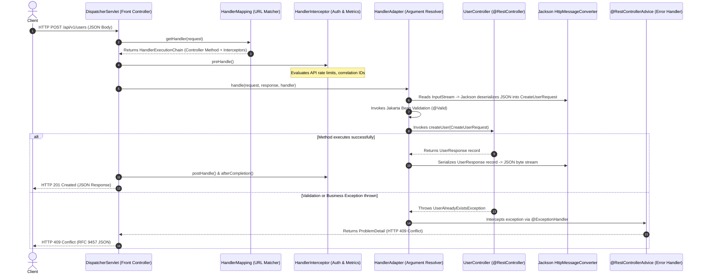
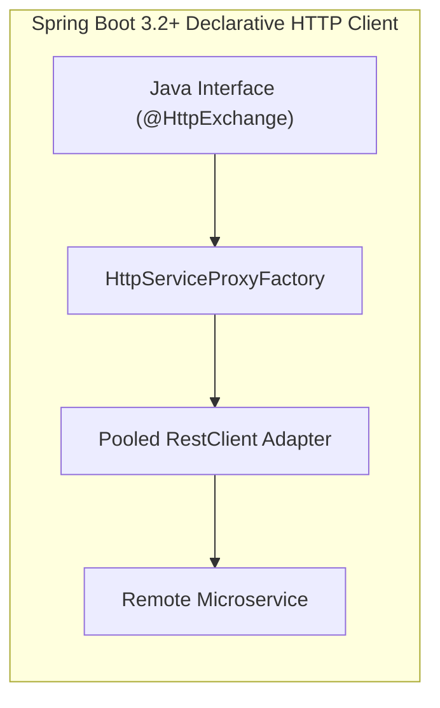
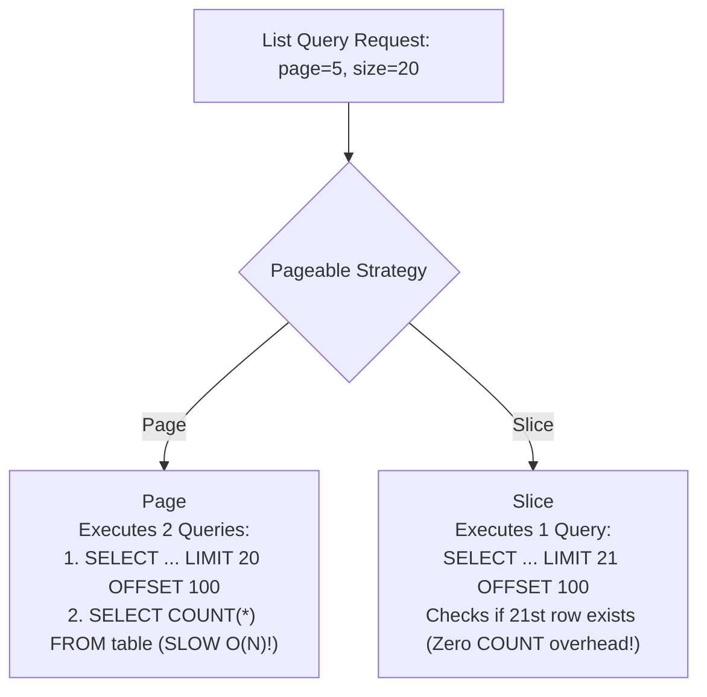

# Spring MVC REST Architecture: DispatcherServlet, Declarative Clients & Streaming

In Spring Boot, building a REST API is often taught simply as annotating a class with `@RestController` and `@GetMapping`.

However, in high-throughput production backends, treating Spring MVC as magic annotations leads to severe failures:
- Thread pool exhaustion caused by un-pooled HTTP clients making external calls without connection timeouts.
- Severe database latency spikes caused by returning `org.springframework.data.domain.Page` (which triggers unindexed `COUNT(*)` queries on multi-million row tables).
- LazyInitializationExceptions and Jackson infinite recursion crashes when JPA entities leak into HTTP responses.
- Inconsistent error formats that break mobile clients.
- Memory exhaustion when streaming large file exports or real-time event feeds.

This masterclass provides an exhaustive, production-grade manual for Spring MVC internal request routing, DispatcherServlet mechanics, declarative HTTP clients (`@HttpExchange`), Server-Sent Events streaming (`SseEmitter`), and high-performance pagination.

---

## Spring MVC Engine Internals: The `DispatcherServlet` Pipeline

Spring MVC implements the **Front Controller Design Pattern** centered around the `DispatcherServlet`. When an HTTP request reaches your server, it passes through a multi-stage pipeline before executing your controller:



### The 4 Key Pipeline Components
1. **`HandlerMapping`**: Scans the application context for `@RequestMapping` and `@GetMapping` annotations, indexing routes into an in-memory prefix tree for $O(1)$ URL matching.
2. **`HandlerMethodArgumentResolver`**: Dynamically resolves and extracts parameters for your controller methods (`@RequestBody`, `@PathVariable`, `@RequestParam`, `@RequestHeader`, `@AuthenticationPrincipal`).
3. **`HttpMessageConverter`**: Uses `MappingJackson2HttpMessageConverter` to stream JSON tokens between HTTP sockets and Java objects.
4. **`HandlerExceptionResolver`**: Intercepts unhandled exceptions thrown anywhere in the controller or service layers and routes them to `@RestControllerAdvice` methods.

---

## Controller Architectural Rules & Decoupling

A production `@RestController` is an **Inbound Adapter** whose single responsibility is HTTP transport translation:

```java
package com.example.user.adapter.in.web;

import com.example.user.adapter.in.web.dto.CreateUserRequest;
import com.example.user.adapter.in.web.dto.UserResponse;
import com.example.user.domain.port.in.CreateUserUseCase;
import com.example.user.domain.port.in.GetUserQuery;
import jakarta.validation.Valid;
import org.springframework.http.ResponseEntity;
import org.springframework.web.bind.annotation.*;
import org.springframework.web.servlet.support.ServletUriComponentsBuilder;

import java.net.URI;

@RestController
@RequestMapping("/api/v1/users")
public class UserController {

    private final CreateUserUseCase createUserUseCase;
    private final GetUserQuery getUserQuery;

    public UserController(CreateUserUseCase createUserUseCase, GetUserQuery getUserQuery) {
        this.createUserUseCase = createUserUseCase;
        this.getUserQuery = getUserQuery;
    }

    @PostMapping
    public ResponseEntity<UserResponse> createUser(@Valid @RequestBody CreateUserRequest request) {
        UserResponse response = createUserUseCase.createUser(request.toCommand());

        // Standard REST Contract: Return 201 Created with Location header pointing to new URI
        URI location = ServletUriComponentsBuilder.fromCurrentRequest()
                .path("/{id}")
                .buildAndExpand(response.id())
                .toUri();

        return ResponseEntity.created(location).body(response);
    }

    @GetMapping("/{id}")
    public ResponseEntity<UserResponse> getUserById(@PathVariable Long id) {
        return ResponseEntity.ok(getUserQuery.getUserById(id));
    }

    @DeleteMapping("/{id}")
    public ResponseEntity<Void> deleteUser(@PathVariable Long id) {
        createUserUseCase.deleteUser(id);
        return ResponseEntity.noContent().build(); // HTTP 204 No Content
    }
}
```

### Controller Best Practices Matrix
- **Never inject Repositories directly into Controllers**: Always route data operations through domain Use Cases or Service beans.
- **Never return JPA Entities from Controllers**: Always map domain models to decoupled DTO records (`UserResponse`). Exposing entities leaks internal database columns, triggers lazy-loading crashes, and creates security vulnerabilities.
- **Return explicit `ResponseEntity` objects**: Explicitly control HTTP status codes (`201 Created`, `204 No Content`, `200 OK`) and response headers (`Location`, `ETag`).

---

## Custom Argument Resolvers: Clean Context Injection

Avoid polluting controllers with repetitive header extractions. Use a **`HandlerMethodArgumentResolver`** to inject custom domain records automatically:

```java
package com.example.common.web;

import java.lang.annotation.*;

@Target(ElementType.PARAMETER)
@Retention(RetentionPolicy.RUNTIME)
@Documented
public @interface CurrentUserContext {}
```

```java
package com.example.common.web;

import org.springframework.core.MethodParameter;
import org.springframework.security.core.Authentication;
import org.springframework.security.core.context.SecurityContextHolder;
import org.springframework.stereotype.Component;
import org.springframework.web.bind.support.WebDataBinderFactory;
import org.springframework.web.context.request.NativeWebRequest;
import org.springframework.web.method.support.HandlerMethodArgumentResolver;
import org.springframework.web.method.support.ModelAndViewContainer;

public record UserContext(Long userId, String tenantId, String email) {}

@Component
public class UserContextArgumentResolver implements HandlerMethodArgumentResolver {

    @Override
    public boolean supportsParameter(MethodParameter parameter) {
        return parameter.hasParameterAnnotation(CurrentUserContext.class) &&
               parameter.getParameterType().equals(UserContext.class);
    }

    @Override
    public Object resolveArgument(MethodParameter parameter,
                                  ModelAndViewContainer mavContainer,
                                  NativeWebRequest webRequest,
                                  WebDataBinderFactory binderFactory) {
        Authentication auth = SecurityContextHolder.getContext().getAuthentication();
        if (auth == null || !auth.isAuthenticated()) {
            throw new UnauthorizedException("No authenticated user present");
        }

        String tenantId = webRequest.getHeader("X-Tenant-ID");
        return new UserContext(Long.parseLong(auth.getName()), tenantId, "user@example.com");
    }
}
```

Now any controller method can declare `@CurrentUserContext UserContext context` as a parameter with zero boilerplate:
```java
@GetMapping("/me")
public ResponseEntity<UserProfile> getProfile(@CurrentUserContext UserContext context) {
    return ResponseEntity.ok(userService.getProfile(context.userId(), context.tenantId()));
}
```

---

## Declarative HTTP Interfaces in Spring Boot 3.2+ (`@HttpExchange`)

Rather than writing manual `RestClient` call templates, Spring Boot 3.2+ introduces **Declarative HTTP Interfaces** (inspired by OpenFeign):



### 1. Define the Client Interface
```java
package com.example.payment.client;

import org.springframework.web.bind.annotation.PathVariable;
import org.springframework.web.bind.annotation.RequestBody;
import org.springframework.web.bind.annotation.RequestHeader;
import org.springframework.web.service.annotation.GetExchange;
import org.springframework.web.service.annotation.HttpExchange;
import org.springframework.web.service.annotation.PostExchange;

@HttpExchange("/v1/payments")
public interface PaymentGatewayClient {

    @PostExchange("/charges")
    PaymentChargeResponse createCharge(
            @RequestHeader("Idempotency-Key") String idempotencyKey,
            @RequestBody PaymentChargeRequest request
    );

    @GetExchange("/charges/{id}")
    PaymentChargeResponse getChargeById(@PathVariable("id") String chargeId);
}
```

### 2. Configure the Dynamic Proxy Bean
```java
package com.example.payment.config;

import com.example.payment.client.PaymentGatewayClient;
import org.springframework.context.annotation.Bean;
import org.springframework.context.annotation.Configuration;
import org.springframework.web.client.RestClient;
import org.springframework.web.client.support.RestClientAdapter;
import org.springframework.web.service.invoker.HttpServiceProxyFactory;

@Configuration
public class PaymentClientConfig {

    @Bean
    public PaymentGatewayClient paymentGatewayClient(RestClient.Builder builder) {
        RestClient restClient = builder
                .baseUrl("https://api.stripe.com")
                .build();

        HttpServiceProxyFactory factory = HttpServiceProxyFactory
                .builderFor(RestClientAdapter.create(restClient))
                .build();

        return factory.createClient(PaymentGatewayClient.class);
    }
}
```

---

## High-Throughput Streaming & Server-Sent Events (SSE)

When pushing real-time notifications or streaming multi-gigabyte files, returning standard JSON buffers ties up memory.

### 1. Server-Sent Events (SSE) with `SseEmitter`
Server-Sent Events allow the server to push real-time updates to web clients over a single HTTP connection without WebSockets:

```java
package com.example.notification.web;

import org.springframework.http.MediaType;
import org.springframework.web.bind.annotation.GetMapping;
import org.springframework.web.bind.annotation.RequestMapping;
import org.springframework.web.bind.annotation.RestController;
import org.springframework.web.servlet.mvc.method.annotation.SseEmitter;

import java.io.IOException;
import java.util.Map;
import java.util.concurrent.ConcurrentHashMap;

@RestController
@RequestMapping("/api/notifications")
public class NotificationStreamController {

    private final Map<Long, SseEmitter> emitters = new ConcurrentHashMap<>();

    @GetMapping(value = "/stream", produces = MediaType.TEXT_EVENT_STREAM_VALUE)
    public SseEmitter subscribe(Long userId) {
        // 30-minute connection timeout
        SseEmitter emitter = new SseEmitter(1_800_000L);
        emitters.put(userId, emitter);

        emitter.onCompletion(() -> emitters.remove(userId));
        emitter.onTimeout(() -> emitters.remove(userId));
        emitter.onError(e -> emitters.remove(userId));

        return emitter;
    }

    public void pushNotification(Long userId, String message) {
        SseEmitter emitter = emitters.get(userId);
        if (emitter != null) {
            try {
                emitter.send(SseEmitter.event()
                        .name("order_update")
                        .data(Map.of("message", message, "timestamp", System.currentTimeMillis())));
            } catch (IOException e) {
                emitters.remove(userId);
            }
        }
    }
}
```

---

### 2. Large File Streaming with `StreamingResponseBody`
When exporting 500,000 orders as CSV, buffering the entire file in a `byte[]` crashes the JVM with an `OutOfMemoryError`.
Use **`StreamingResponseBody`** to stream rows directly from the database to the HTTP client socket:

```java
@GetMapping(value = "/export/csv", produces = "text/csv")
public ResponseEntity<StreamingResponseBody> exportOrdersCsv() {
    StreamingResponseBody responseBody = outputStream -> {
        try (PrintWriter writer = new PrintWriter(new OutputStreamWriter(outputStream, StandardCharsets.UTF_8))) {
            writer.println("order_id,customer_id,total_cents,status");

            // Streams rows chunk-by-chunk from database cursor
            orderRepository.streamAllOrders(order -> {
                writer.printf("%s,%s,%d,%s\n", 
                        order.getId(), order.getCustomerId(), order.getTotalCents(), order.getStatus());
                writer.flush();
            });
        }
    };

    return ResponseEntity.ok()
            .header(HttpHeaders.CONTENT_DISPOSITION, "attachment; filename=\"orders.csv\"")
            .body(responseBody);
}
```

---

## Pagination & High-Performance Data Slicing

Querying unbounded tables without pagination allows malicious or accidental requests to load millions of rows into memory.



### The Hidden Danger of `Page<T>`
When you return `Page<T>`, Spring Data executes **two separate SQL queries**:
1. The data slice query: `SELECT * FROM orders LIMIT 20 OFFSET 100;`
2. The total count query: `SELECT COUNT(*) FROM orders;`

On a table with 10 million rows, `SELECT COUNT(*)` requires a sequential scan or index scan across the entire table, turning a 5ms API call into a **3,000ms bottleneck**!

### The Production Solution: `Slice<T>`
For mobile apps and infinite scrolling feeds where total page count is not strictly required, use `Slice<T>`:

```java
public interface OrderRepository extends JpaRepository<Order, Long> {
    // Zero COUNT(*) overhead: Fetches size + 1 to detect if next page exists!
    Slice<Order> findByUserId(Long userId, Pageable pageable);
}
```

```java
@GetMapping
public ResponseEntity<Slice<OrderResponse>> getOrders(
        @AuthenticationPrincipal Long currentUserId,
        @PageableDefault(size = 20, sort = "createdAt", direction = Sort.Direction.DESC) Pageable pageable) {
    
    Slice<OrderResponse> orders = orderService.getOrders(currentUserId, pageable)
            .map(OrderResponse::from);
            
    return ResponseEntity.ok(orders);
}
```

---

## Production Pooled `RestClient` Configuration

Never instantiate `RestClient` with default settings. A production HTTP client must have an explicit **connection pool, connection timeout, socket read timeout, and correlation ID interceptor**:

```java
package com.example.common.client;

import org.apache.hc.client5.http.config.RequestConfig;
import org.apache.hc.client5.http.impl.classic.CloseableHttpClient;
import org.apache.hc.client5.http.impl.classic.HttpClients;
import org.apache.hc.client5.http.impl.io.PoolingHttpClientConnectionManager;
import org.slf4j.MDC;
import org.springframework.context.annotation.Bean;
import org.springframework.context.annotation.Configuration;
import org.springframework.http.client.ClientHttpRequestInterceptor;
import org.springframework.http.client.HttpComponentsClientHttpRequestFactory;
import org.springframework.web.client.RestClient;

import java.util.concurrent.TimeUnit;

@Configuration
public class RestClientConfig {

    @Bean
    public RestClient paymentRestClient(RestClient.Builder builder) {
        // 1. Configure Apache HttpClient 5 Connection Pool
        PoolingHttpClientConnectionManager connectionManager = new PoolingHttpClientConnectionManager();
        connectionManager.setMaxTotal(200);           // Max connections across all hosts
        connectionManager.setDefaultMaxPerRoute(50);   // Max concurrent connections per target host

        RequestConfig requestConfig = RequestConfig.custom()
                .setConnectTimeout(2000, TimeUnit.MILLISECONDS)      // 2s connection timeout
                .setResponseTimeout(5000, TimeUnit.MILLISECONDS)     // 5s read/socket timeout
                .build();

        CloseableHttpClient httpClient = HttpClients.custom()
                .setConnectionManager(connectionManager)
                .setDefaultRequestConfig(requestConfig)
                .evictExpiredConnections()
                .evictIdleConnections(30, TimeUnit.SECONDS)
                .build();

        // 2. Correlation ID & Header Interceptor
        ClientHttpRequestInterceptor tracingInterceptor = (request, body, execution) -> {
            String correlationId = MDC.get("correlationId");
            if (correlationId != null) {
                request.getHeaders().add("X-Correlation-ID", correlationId);
            }
            return execution.execute(request, body);
        };

        // 3. Build Fluent RestClient
        return builder
                .requestFactory(new HttpComponentsClientHttpRequestFactory(httpClient))
                .baseUrl("https://api.stripe.com/v1")
                .requestInterceptor(tracingInterceptor)
                .build();
    }
}
```

---

## Active Recall & Interview Mastery

<AccordionGroup>
  <Accordion title="1. Walk through the internal lifecycle of an HTTP request inside Spring MVC DispatcherServlet.">
    1. Incoming HTTP request reaches `DispatcherServlet`.
    2. `HandlerMapping` matches the URL and HTTP method to a specific `@RestController` method, returning a `HandlerExecutionChain`.
    3. Configured `HandlerInterceptors` execute their `preHandle()` hooks (e.g., rate limiting, authentication verification).
    4. The `HandlerAdapter` executes `HandlerMethodArgumentResolvers` to deserialize the JSON body via `MappingJackson2HttpMessageConverter` and triggers validation (`@Valid`).
    5. The controller method executes business logic and returns a DTO.
    6. `HttpMessageConverter` serializes the DTO into an HTTP response body, and interceptors execute `postHandle()` and `afterCompletion()`.
  </Accordion>

  <Accordion title="2. What is the performance difference between Page<T> and Slice<T> in Spring Data JPA?">
    `Page<T>` executes two SQL queries: the data slice query using `LIMIT/OFFSET` and an additional `SELECT COUNT(*)` query to compute total pages. On large multi-million row tables, `COUNT(*)` forces expensive full table scans.
    
    In contrast, `Slice<T>` executes only a single query with `LIMIT size + 1`, inspecting whether an extra $(N+1)\text{th}$ row exists to determine if there is a next page, completely eliminating the expensive `COUNT(*)` overhead.
  </Accordion>

  <Accordion title="3. What are Declarative HTTP Interfaces (@HttpExchange) in Spring Boot 3.2+?">
    Declarative HTTP Interfaces allow developers to define client contracts as standard Java interfaces annotated with `@HttpExchange`, `@GetExchange`, and `@PostExchange`. Spring Boot's `HttpServiceProxyFactory` generates a dynamic proxy implementation at runtime backed by a pooled `RestClient`. This eliminates manual boilerplate HTTP client code while remaining fully synchronous and compatible with Java 21 Virtual Threads.
  </Accordion>

  <Accordion title="4. How does SseEmitter differ from WebSockets for real-time updates?">
    **Server-Sent Events (SSE)** via `SseEmitter` operates over standard HTTP/1.1 or HTTP/2 connections, streaming plain text (`text/event-stream`) unidirectional events from server to client. It is lightweight, works natively through existing corporate firewalls, and includes automatic client reconnection.
    
    **WebSockets** require a protocol handshake upgrade (`HTTP 101 Switching Protocols`) to establish a full-duplex, bidirectional TCP connection. WebSockets are necessary when the client needs to stream frequent updates back to the server (e.g., online gaming, collaborative drawing), whereas SSE is superior for unidirectional feeds (e.g., stock tickers, order status updates).
  </Accordion>

  <Accordion title="5. Why should StreamingResponseBody be used when exporting large datasets?">
    When exporting large datasets (e.g., a 500,000-row CSV file), building the entire output in memory as a `byte[]` or `String` consumes hundreds of megabytes of JVM heap memory, triggering heavy garbage collection pauses or `OutOfMemoryError`.
    
    `StreamingResponseBody` provides direct access to the HTTP client `OutputStream`. The application reads chunks from the database cursor and writes them directly to the network socket, maintaining a constant $O(1)$ memory footprint of only a few kilobytes regardless of dataset size.
  </Accordion>

  <Accordion title="6. What is the role of a HandlerMethodArgumentResolver in Spring MVC?">
    A `HandlerMethodArgumentResolver` intercepts controller method parameter evaluation. It allows developers to define custom parameter annotations (such as `@CurrentUserContext UserContext user`) and extract, validate, and construct domain objects from incoming HTTP requests (headers, cookies, security context) before the controller method executes, eliminating repetitive extraction boilerplate across controller classes.
  </Accordion>
</AccordionGroup>
