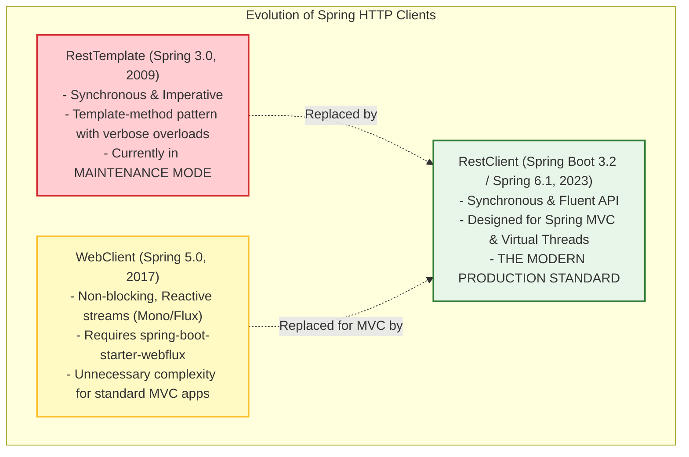
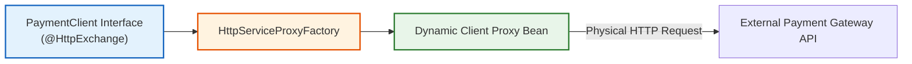
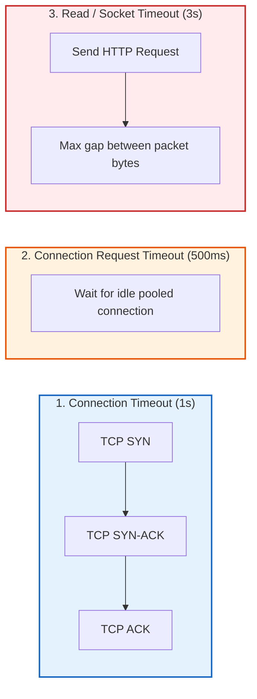

In modern backend engineering, very few services operate in isolation. Your service constantly calls external third-party APIs (Stripe, Twilio, SendGrid) and downstream microservices across the network.

For over a decade, Java developers used Spring's legacy **`RestTemplate`**. But in modern Spring Boot, `RestTemplate` is in maintenance mode. 

Spring Boot 3 introduces **`RestClient`**—a modern, synchronous, fluent HTTP client designed specifically for Spring MVC and Java 21 Virtual Threads—along with **Declarative HTTP Interfaces (`@HttpExchange`)**, which let you call external APIs through plain Java interfaces without writing boilerplate HTTP code.

However, calling remote APIs over a physical network introduces severe failure modes: connection leaks, thread starvation, and socket timeouts. In this chapter, we explore how to build resilient, pooled, and declarative HTTP clients in Spring Boot 3.

---

## 1. Physical Evolution: `RestTemplate` vs `WebClient` vs `RestClient`

To understand why `RestClient` was created, look at the timeline of Spring's HTTP clients:



`RestClient` combines the best of both worlds: the clean, readable fluent API of `WebClient` with the simple, synchronous mental model of `RestTemplate`.

---

## 2. Using `RestClient`: The Fluent API

Instead of passing 8 arguments into `restTemplate.exchange(...)`, `RestClient` uses a fluent chain:

```java
package com.backend.mastery.client;

import org.springframework.http.HttpStatusCode;
import org.springframework.http.MediaType;
import org.springframework.stereotype.Service;
import org.springframework.web.client.RestClient;

import java.util.List;

public record UserProfileDto(Long id, String username, String email) {}
public record CreateUserCommand(String username, String email) {}

@Service
public class ExternalUserService {

    private final RestClient restClient;

    // Inject a pre-configured RestClient.Builder
    public ExternalUserService(RestClient.Builder builder) {
        this.restClient = builder
                .baseUrl("https://api.userservice.internal/v1")
                .defaultHeader("Accept", MediaType.APPLICATION_JSON_VALUE)
                .build();
    }

    /**
     * GET Request: Fetching single object by ID
     */
    public UserProfileDto getUserById(Long userId) {
        return restClient.get()
                .uri("/users/{id}", userId)
                .retrieve()
                // Custom error handling for 4xx status codes
                .onStatus(HttpStatusCode::is4xxClientError, (request, response) -> {
                    throw new ResourceNotFoundException("External user not found with id: " + userId);
                })
                .body(UserProfileDto.class);
    }

    /**
     * POST Request: Sending JSON body and receiving created response
     */
    public UserProfileDto createUser(CreateUserCommand command) {
        return restClient.post()
                .uri("/users")
                .contentType(MediaType.APPLICATION_JSON)
                .body(command)
                .retrieve()
                .body(UserProfileDto.class);
    }
}
```

### Adding Interceptors (OAuth2 Tokens & Distributed Tracing)

In production microservices, every outbound HTTP request must carry authentication tokens (Bearer JWTs) and correlation IDs (`X-Correlation-ID` or W3C `traceparent`):

```java
@Bean
public RestClient paymentRestClient(RestClient.Builder builder) {
    return builder
            .baseUrl("https://api.payments.com")
            // Add custom client request interceptor
            .requestInterceptor((request, body, execution) -> {
                // Attach security token and trace ID
                request.getHeaders().setBearerAuth(fetchCurrentSecurityToken());
                request.getHeaders().set("X-Correlation-ID", MDC.get("correlationId"));
                return execution.execute(request, body);
            })
            .build();
}
```

---

## 3. Declarative HTTP Interfaces (`@HttpExchange`)

Writing client service classes with manual URLs and mappings can become repetitive. Spring Boot 3 introduces **Declarative HTTP Interfaces**. 

You write a plain Java interface annotated with `@HttpExchange`, and Spring generates the actual implementation proxy automatically at runtime!



### Step 1: Define the Client Interface

```java
package com.backend.mastery.client;

import org.springframework.web.bind.annotation.PathVariable;
import org.springframework.web.bind.annotation.RequestBody;
import org.springframework.web.bind.annotation.RequestParam;
import org.springframework.web.service.annotation.GetExchange;
import org.springframework.web.service.annotation.HttpExchange;
import org.springframework.web.service.annotation.PostExchange;

import java.math.BigDecimal;

public record ChargeRequest(String customerId, BigDecimal amount, String currency) {}
public record ChargeResponse(String transactionId, String status) {}

@HttpExchange("/api/v1/payments")
public interface PaymentGatewayClient {

    @PostExchange("/charges")
    ChargeResponse processCharge(@RequestBody ChargeRequest request);

    @GetExchange("/charges/{transactionId}")
    ChargeResponse getChargeDetails(@PathVariable("transactionId") String transactionId);
}
```

### Step 2: Register the Proxy Bean

```java
package com.backend.mastery.config;

import com.backend.mastery.client.PaymentGatewayClient;
import org.springframework.context.annotation.Bean;
import org.springframework.context.annotation.Configuration;
import org.springframework.web.client.RestClient;
import org.springframework.web.client.support.RestClientAdapter;
import org.springframework.web.service.invoker.HttpServiceProxyFactory;

@Configuration(proxyBeanMethods = false)
public class HttpClientConfig {

    @Bean
    public PaymentGatewayClient paymentGatewayClient(RestClient.Builder builder) {
        RestClient restClient = builder
                .baseUrl("https://api.stripe-simulation.com")
                .build();

        // Wrap RestClient in an HTTP adapter
        RestClientAdapter adapter = RestClientAdapter.create(restClient);
        
        // Create proxy factory
        HttpServiceProxyFactory factory = HttpServiceProxyFactory.builderFor(adapter).build();

        // Generate the proxy implementation!
        return factory.createClient(PaymentGatewayClient.class);
    }
}
```

### Step 3: Inject and Use Anywhere
```java
@Service
public class CheckoutService {

    private final PaymentGatewayClient paymentClient;

    public CheckoutService(PaymentGatewayClient paymentClient) {
        this.paymentClient = paymentClient;
    }

    public void checkout(String customerId, BigDecimal total) {
        // Looks like a normal local Java method call, but makes a real HTTP POST under the hood!
        ChargeResponse response = paymentClient.processCharge(new ChargeRequest(customerId, total, "USD"));
        System.out.println("Transaction confirmed: " + response.transactionId());
    }
}
```

<Tip>
**Say Goodbye to OpenFeign**:
Declarative HTTP interfaces replace Netflix OpenFeign natively, without requiring Spring Cloud or external dependencies.
</Tip>

---

## 4. Physical Network Mechanics: Connection Pooling & Timeouts

<Warning>
**The Default Client Hazard**:
By default, Spring Boot uses Java's built-in `SimpleClientHttpRequestFactory` (which wraps `HttpURLConnection`).
</Warning>

**Why the default client kills production throughput**:
1. It does **not** pool TCP connections effectively. For every request, it performs a full TCP 3-way handshake and TLS cryptographic key exchange, adding 20–100ms of latency per call.
2. It has **no default timeouts**. If a third-party payment provider experiences a server lockup, your worker threads will wait **forever**, eventually exhausting all 200 Tomcat worker threads and crashing your entire service!

### The Production Fix: Apache HttpClient 5 Connection Pooling

To achieve high throughput and protect your system, always back `RestClient` with a connection pool like **Apache HttpClient 5**:

```xml
<dependency>
    <groupId>org.apache.httpcomponents.client5</groupId>
    <artifactId>httpclient5</artifactId>
</dependency>
```

### The Timeout Triad Defined



1. **Connection Timeout (`connectTimeout`)**: Maximum time allowed to establish the physical TCP connection (and complete TLS handshake). Typically **1 to 2 seconds**.
2. **Connection Request Timeout (`connectionRequestTimeout`)**: Maximum time a thread is allowed to wait for an available connection from the pool before throwing `ConnectionPoolTimeoutException`. Typically **500 milliseconds**.
3. **Socket / Read Timeout (`readTimeout`)**: Maximum allowed silence between two incoming data packets after the connection is established. Typically **3 to 5 seconds**.

### Production Apache HttpClient 5 Configuration

```java
package com.backend.mastery.config;

import org.apache.hc.client5.http.config.ConnectionConfig;
import org.apache.hc.client5.http.config.RequestConfig;
import org.apache.hc.client5.http.impl.classic.CloseableHttpClient;
import org.apache.hc.client5.http.impl.classic.HttpClients;
import org.apache.hc.client5.http.impl.io.PoolingHttpClientConnectionManager;
import org.apache.hc.core5.util.Timeout;
import org.springframework.context.annotation.Bean;
import org.springframework.context.annotation.Configuration;
import org.springframework.http.client.HttpComponentsClientHttpRequestFactory;
import org.springframework.web.client.RestClient;

import java.util.concurrent.TimeUnit;

@Configuration
public class ProductionHttpClientConfig {

    @Bean
    public CloseableHttpClient apacheHttpClient() {
        // 1. Connection Pool Manager
        PoolingHttpClientConnectionManager connectionManager = new PoolingHttpClientConnectionManager();
        connectionManager.setMaxTotal(200); // Maximum 200 concurrent connections cluster-wide
        connectionManager.setDefaultMaxPerRoute(50); // Max 50 connections to any single domain

        // 2. Socket & Handshake Timeouts
        ConnectionConfig connectionConfig = ConnectionConfig.custom()
                .setConnectTimeout(Timeout.ofSeconds(2)) // 2s TCP handshake
                .setSocketTimeout(Timeout.ofSeconds(5))  // 5s Read timeout
                .build();
        connectionManager.setDefaultConnectionConfig(connectionConfig);

        // 3. Request-Level Config
        RequestConfig requestConfig = RequestConfig.custom()
                .setConnectionRequestTimeout(Timeout.ofMilliseconds(500)) // 500ms pool borrow
                .build();

        return HttpClients.custom()
                .setConnectionManager(connectionManager)
                .setDefaultRequestConfig(requestConfig)
                .evictExpiredConnections()
                .evictIdleConnections(Timeout.ofSeconds(30)) // Clean up dead TCP sockets
                .build();
    }

    @Bean
    public RestClient.Builder pooledRestClientBuilder(CloseableHttpClient apacheHttpClient) {
        HttpComponentsClientHttpRequestFactory requestFactory =
                new HttpComponentsClientHttpRequestFactory(apacheHttpClient);

        return RestClient.builder()
                .requestFactory(requestFactory);
    }
}
```

---

## 5. Active Recall & Interview Drills

<CardGroup cols={2}>
  <Card title="1. RestClient vs RestTemplate" icon="question">
    What architectural advantages does `RestClient` provide over `RestTemplate`, and why is `RestTemplate` in maintenance mode?
  </Card>
  <Card title="2. Declarative @HttpExchange" icon="question">
    How do declarative HTTP interfaces (`@HttpExchange`) eliminate the need for Netflix OpenFeign in Spring Boot 3?
  </Card>
  <Card title="3. The Default Factory Trap" icon="question">
    Why does using the default `SimpleClientHttpRequestFactory` in production cause connection exhaustion and high latency?
  </Card>
  <Card title="4. The Timeout Triad" icon="question">
    What is the difference between `connectTimeout`, `readTimeout`, and `connectionRequestTimeout`?
  </Card>
  <Card title="5. Connection Pool Sizing" icon="question">
    What is the difference between `maxTotal` and `defaultMaxPerRoute` in Apache HttpClient 5?
  </Card>
  <Card title="6. Client Interceptors" icon="question">
    How do you inject a dynamic OAuth2 Bearer token or `X-Correlation-ID` into every outbound HTTP request?
  </Card>
  <Card title="7. Virtual Threads & RestClient" icon="question">
    Why is `RestClient` (synchronous) the recommended choice over `WebClient` (reactive) when running on Java 21 Virtual Threads?
  </Card>
  <Card title="8. Testing with Mock Server" icon="question">
    Which test slice annotation and mock server are used to test outbound `RestClient` calls without hitting the internet?
  </Card>
</CardGroup>

---

## 6. Done Checklist

<Check>
- [ ] Understand the evolution and architectural trade-offs between `RestTemplate`, `WebClient`, and `RestClient`.
- [ ] Built an outbound HTTP service using `RestClient`'s fluent chain (`uri`, `retrieve`, `body`).
- [ ] Configured custom HTTP status error handling using `.onStatus(HttpStatusCode::is4xxClientError, ...)`.
- [ ] Implemented a client request interceptor to propagate authorization headers and correlation IDs.
- [ ] Created a declarative HTTP interface using `@HttpExchange`, `@GetExchange`, and `@PostExchange`.
- [ ] Registered an `@HttpExchange` proxy bean using `HttpServiceProxyFactory` and `RestClientAdapter`.
- [ ] Replaced legacy `SimpleClientHttpRequestFactory` with Apache HttpClient 5 connection pooling.
- [ ] Configured the Timeout Triad (`connectTimeout: 2s`, `socketTimeout: 5s`, `connectionRequestTimeout: 500ms`).
- [ ] Tuned connection pool thresholds (`maxTotal: 200`, `defaultMaxPerRoute: 50`) to prevent socket exhaustion.
- [ ] Configured idle and expired connection eviction to clean up zombie TCP sockets.
- [ ] Tested outbound clients in isolation using `@RestClientTest` and `MockRestServiceServer`.
- [ ] Successfully answered all 8 Active Recall interview questions without checking notes.
</Check>
