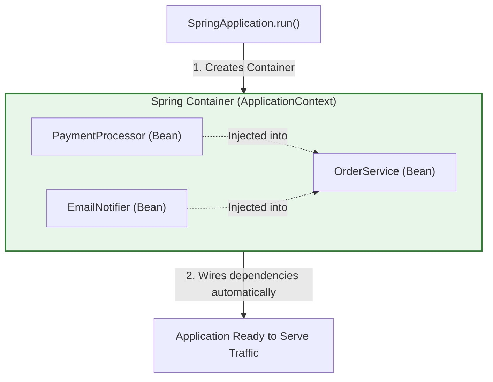
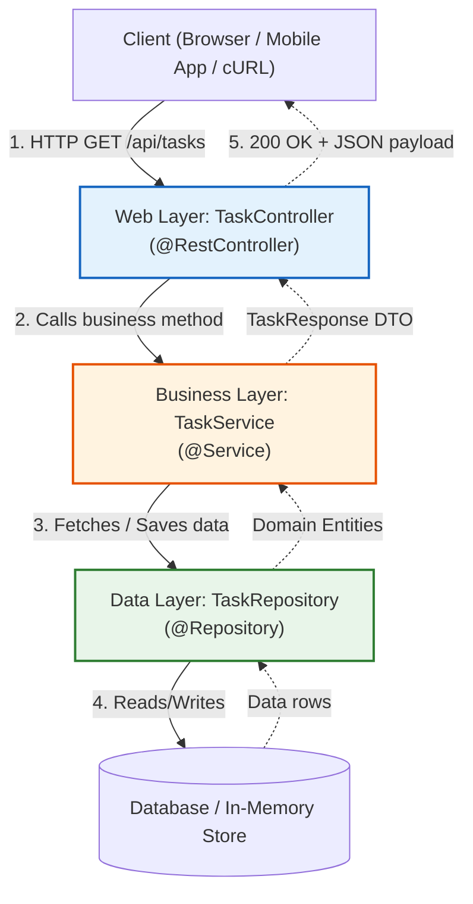

If you just learned core Java (classes, objects, loops, methods, and interfaces), jumping into Spring Boot can feel overwhelming. Tutorials throw words at you like **Dependency Injection**, **Inversion of Control**, **CGLIB Proxies**, **Beans**, and **Servlet Containers** without ever explaining what they mean in plain English.

You might wonder:
- *"I already know how to write Java classes and use `new`. Why do I need Spring?"*
- *"Why is an object called a 'Bean'?"*
- *"How does typing `@RestController` make an HTTP server listen on port 8080?"*
- *"Where is Apache Tomcat? I never installed it!"*

This chapter is the **Ground Floor**. We assume **zero** prior backend framework experience. We will start with plain Java, look at the problems that made developers tear their hair out in the early 2000s, explain why Spring and Spring Boot were invented, demystify all the core vocabulary, and build your very first production-clean REST API step by step.

---

## 1. Why Did Anyone Invent Spring? (The Pain Before Frameworks)

To understand Spring, you must understand what building a backend looked like in Java before Spring existed.

### The Problem: Tightly Coupled Code with `new`

Imagine you are building a simple e-commerce website in plain Java. You have an `OrderService` that needs to process payments and send email notifications.

In plain Java, you would write something like this:

```java
public class OrderService {
    // We manually instantiate our dependencies using 'new'
    private final StripePaymentProcessor paymentProcessor = new StripePaymentProcessor();
    private final SmtpEmailNotifier emailNotifier = new SmtpEmailNotifier();

    public void checkout(String customerEmail, double amount) {
        paymentProcessor.charge(amount);
        emailNotifier.send(customerEmail, "Order confirmed!");
    }
}
```

This looks simple, but in real software engineering, it creates three massive problems:

1. **Tight Coupling (Hardcoded Lock-in)**:
   What if your company switches from Stripe to PayPal? You have to open `OrderService.java`, delete `new StripePaymentProcessor()`, write `new PayPalProcessor()`, and recompile. What if 50 different classes use `StripePaymentProcessor`? You have to manually edit all 50 files.
2. **Impossible to Unit Test**:
   When writing a test for `OrderService`, you do **not** want to charge a real credit card or send a real email across the internet. You want to pass a "fake" (mock) payment processor. But because `OrderService` creates the `StripePaymentProcessor` internally with `new`, you cannot swap it out!
3. **Thread Safety & Memory Waste**:
   If 1,000 customers place orders simultaneously, does every customer request need to create a `new StripePaymentProcessor()` and `new SmtpEmailNotifier()`? Allocating thousands of identical objects wastes CPU cycles and fills up JVM heap memory, causing the Garbage Collector to freeze your app.

### The Solution: Don't Create Dependencies, Receive Them!

Instead of creating dependencies inside the class, what if the class simply **asks** for them through its constructor?

```java
public class OrderService {
    private final PaymentProcessor paymentProcessor;
    private final EmailNotifier emailNotifier;

    // The class does NOT instantiate anything. It receives them from the outside!
    public OrderService(PaymentProcessor paymentProcessor, EmailNotifier emailNotifier) {
        this.paymentProcessor = paymentProcessor;
        this.emailNotifier = emailNotifier;
    }

    public void checkout(String customerEmail, double amount) {
        paymentProcessor.charge(amount);
        emailNotifier.send(customerEmail, "Order confirmed!");
    }
}
```

Now `OrderService` doesn't care whether you pass Stripe, PayPal, or a fake test mock!

**But this creates a new question**: *If `OrderService` doesn't create these objects, who creates them, who wires them together, and who manages their lifecycle?*

**That is what Spring does.** Spring is a giant, smart container that creates your objects once, keeps them in memory, and injects them wherever they are needed.

---

## 2. Core Vocabulary Demystified (Plain English)

Before writing code, let us translate the four most common buzzwords into everyday English.



### 1. What is a "Bean"?
- **Scary Definition**: *"A bean is an object that is instantiated, assembled, and managed by a Spring IoC container."*
- **Plain English**: A **Bean** is literally just a normal Java object that Spring created and holds in its memory box (`ApplicationContext`) instead of you typing `new MyObject()`.
- *Why is it called a Bean?* In the 1990s, Sun Microsystems named reusable Java components "JavaBeans" (as in coffee beans). Spring kept the name.

### 2. What is Inversion of Control (IoC)?
- **Plain English**: Normally, **you** control when an object is created: you write `new OrderService()`. With Inversion of Control, **the framework** controls object creation. You tell Spring: *"Hey, here is what my class needs,"* and Spring creates it, wires it, and calls your methods when an HTTP request arrives.
- This is often called the **Hollywood Principle**: *"Don't call us, we'll call you."*

### 3. What is Dependency Injection (DI)?
- **Plain English**: It is the act of passing an object's dependencies into its constructor (or fields) instead of having the object construct them itself.
- Think of a smartphone and a SIM card. The smartphone doesn't solder a SIM card inside its motherboard. It has a slot where you *inject* the SIM card. You can swap SIM cards whenever you want.

### 4. What is an Annotation (`@...`)?
- **Plain English**: An annotation in Java is like a **sticky note** you place on top of a class or method.
- Java itself doesn't do anything with annotations. But when Spring starts up, it inspects your code (using a technique called **Reflection**) and looks for these sticky notes:
  - If it sees `@Component` or `@Service`, Spring says: *"Aha! I need to create a Bean out of this class!"*
  - If it sees `@RestController`, Spring says: *"Aha! This class contains web endpoints that listen to HTTP requests!"*
  - If it sees `@GetMapping("/orders")`, Spring says: *"When someone sends an HTTP GET request to `/orders`, execute this method!"*

---

## 3. What Was Spring Before Spring Boot? (Why Spring Boot Won)

In the 2000s, Spring Framework was revolutionary, but setting it up was painful:
1. You had to write hundreds of lines of complex **XML configuration files** to declare beans.
2. You had to manually install an external web server like Apache Tomcat on your computer or server.
3. You had to compile your code into a `.war` file (Web Application Archive) and manually copy it into Tomcat's `webapps/` folder.
4. You had to manually resolve dozens of third-party library version conflicts in Maven.

### What Spring Boot Changed (2014)

In 2014, the Spring team created **Spring Boot**. The philosophy was: *"Convention over Configuration"*.

Spring Boot introduced three massive superpowers:

1. **Embedded Apache Tomcat**:
   You do **not** need to install Tomcat on your computer. Tomcat is included directly inside your application as a regular Java library. When you run `public static void main`, Tomcat boots up inside the JVM in less than 2 seconds!
2. **Starter Dependencies (`spring-boot-starter-*`)**:
   Instead of hunting for 15 different libraries for web, JSON parsing, and validation, you add a single dependency: `spring-boot-starter-web`. Spring Boot guarantees that all underlying libraries are tested and compatible with each other.
3. **Auto-Configuration**:
   Spring Boot looks at your classpath. If it sees `spring-boot-starter-web`, it automatically configures Tomcat on port 8080, sets up Jackson for JSON formatting, and connects the request dispatching pipeline without you writing a single line of XML or setup code!

---

## 4. Anatomy of a Spring Boot Project

When you generate a project from [start.spring.io](https://start.spring.io) (Spring Initializr), you get this clean directory structure:

```text
my-backend-app/
├── pom.xml                                 <-- Project Object Model (Maven dependencies & build config)
├── src/
│   ├── main/
│   │   ├── java/
│   │   │   └── com/example/demo/
│   │   │       └── DemoApplication.java     <-- The entry point (where public static void main lives)
│   │   └── resources/
│   │       ├── application.properties      <-- Configuration (database passwords, server port, etc.)
│   │       ├── static/                     <-- Static assets (HTML, images, CSS if serving web pages)
│   │       └── templates/                  <-- Server-rendered templates (e.g. Thymeleaf)
│   └── test/
│       └── java/
│           └── com/example/demo/
│               └── DemoApplicationTests.java <-- Unit and integration tests
└── mvnw / mvnw.cmd                         <-- Maven Wrapper (runs Maven without installing it on your OS)
```

### Deconstructing `pom.xml`

Open `pom.xml`. The most important section is `<dependencies>`:

```xml
<dependencies>
    <!-- Web Starter: Gives you REST APIs, Embedded Tomcat, and Jackson JSON -->
    <dependency>
        <groupId>org.springframework.boot</groupId>
        <artifactId>spring-boot-starter-web</artifactId>
    </dependency>

    <!-- Test Starter: Gives you JUnit 5, Mockito, and Spring Test -->
    <dependency>
        <groupId>org.springframework.boot</groupId>
        <artifactId>spring-boot-starter-test</artifactId>
        <scope>test</scope>
    </dependency>
</dependencies>
```

Notice that you do **not** specify version numbers (like `<version>3.3.0</version>`) for these starters! The parent `spring-boot-starter-parent` automatically manages compatible versions for you.

---

## 5. Deconstructing the `main` Method

Every Spring Boot application starts from a single Java class with a `public static void main` method:

```java
package com.example.demo;

import org.springframework.boot.SpringApplication;
import org.springframework.boot.autoconfigure.SpringBootApplication;

@SpringBootApplication
public class DemoApplication {

    public static void main(String[] args) {
        SpringApplication.run(DemoApplication.class, args);
    }
}
```

Let us break down exactly what happens here:

### 1. What does `@SpringBootApplication` do?
`@SpringBootApplication` is actually a **3-in-1 combo annotation**:
- `@SpringBootConfiguration`: Marks this class as a source of bean definitions.
- `@EnableAutoConfiguration`: Tells Spring Boot to guess and configure beans you likely need (like embedded Tomcat, Jackson JSON, and error handlers).
- `@ComponentScan`: Tells Spring to scan the current package (`com.example.demo`) and all its subpackages to find any classes marked with `@Component`, `@Service`, `@Repository`, or `@RestController`, and turn them into Spring Beans.

<Warning>
**The Subpackage Golden Rule**:
Always put your controllers, services, and repositories in subpackages underneath your main application class (e.g. `com.example.demo.controller`, `com.example.demo.service`).
If you create a package *outside* (e.g. `com.otherpackage`), Spring's `@ComponentScan` will never look there, your beans will not be found, and your endpoints will return `404 Not Found`!
</Warning>

### 2. What does `SpringApplication.run()` do when you click Run?
In about 1.5 seconds, that single line performs a massive sequence of steps:
1. Starts an internal stopwatch.
2. Creates the Spring environment (reads `application.properties`).
3. Prints the ASCII Spring banner in your console.
4. Initializes the **ApplicationContext** (the bean container).
5. Starts the **Embedded Tomcat Web Server** bound to port `8080`.
6. Scans your packages, instantiates all your beans, and injects their dependencies.
7. Maps all HTTP routes (`@GetMapping`, `@PostMapping`) to their controller methods.
8. Logs `Started DemoApplication in 1.452 seconds (process running for 1.89)`.
9. The main thread pauses, and Tomcat worker threads begin listening for incoming network packets on port `8080`!

---

## 6. Building Your Very First REST API (Step-by-Step)

Let us build a real, working REST API for a **Task Management System**. We will start with a simple endpoint, then build a proper 3-tier architecture (Controller $\rightarrow$ Service $\rightarrow$ Repository).

### Step 1: The Simplest "Hello World" Controller

Create a new file: `src/main/java/com/example/demo/controller/HelloController.java`:

```java
package com.example.demo.controller;

import org.springframework.web.bind.annotation.GetMapping;
import org.springframework.web.bind.annotation.RequestParam;
import org.springframework.web.bind.annotation.RestController;

@RestController
public class HelloController {

    @GetMapping("/api/hello")
    public String sayHello(@RequestParam(defaultValue = "World") String name) {
        return "Hello, " + name + "!";
    }
}
```

#### Line-by-Line Breakdown:
- `@RestController`: Combines `@Controller` and `@ResponseBody`. It tells Spring: *"This class handles HTTP requests, and the value returned by each method should be written directly into the HTTP response body, not forwarded to an HTML template file."*
- `@GetMapping("/api/hello")`: Tells Spring to route any HTTP `GET` request sent to `http://localhost:8080/api/hello` to this method.
- `@RequestParam(defaultValue = "World")`: Extracts query parameters from the URL (e.g., `/api/hello?name=Alice`). If the user does not supply `?name=...`, it defaults to `"World"`.

#### Testing It:
Run your application, open your browser or terminal, and visit:
```bash
curl http://localhost:8080/api/hello?name=JavaDeveloper
```
**Output**:
```text
Hello, JavaDeveloper!
```

---

## 7. How JSON Serialization Works (Java Objects to JSON)

In modern backend engineering, APIs do not just return plain text strings; they return **JSON** (JavaScript Object Notation).

How does a Java class turn into a JSON string like `{"id":1,"title":"Learn Spring"}`?

Spring Boot includes a library called **Jackson**. When a `@RestController` method returns a Java object, Spring automatically hands that object to Jackson's `ObjectMapper`. Jackson uses reflection to read the getters or record components of the object and serializes them into a JSON byte stream.

### Modern DTOs with Java 21 Records

In modern Java, use **Records** for data transfer objects (DTOs). Records are immutable, concise, and generate constructors, getters, `equals`, `hashCode`, and `toString` in a single line!

Let us create our Task record:

```java
package com.example.demo.dto;

import java.time.LocalDateTime;

public record TaskResponse(
        Long id,
        String title,
        String description,
        boolean completed,
        LocalDateTime createdAt
) {}
```

Now let us build a complete 3-tier architecture around this record.

---

## 8. The 3-Tier Architecture: Controller $\rightarrow$ Service $\rightarrow$ Repository

Professional backend applications are never written in a single file. They are divided into three distinct layers:



1. **Controller (`@RestController`)**: The front door. Handles HTTP verbs (`GET`, `POST`, `PUT`, `DELETE`), parses path variables and request bodies, validates inputs, and returns HTTP status codes (`200 OK`, `201 Created`, `404 Not Found`). **Contains NO business logic.**
2. **Service (`@Service`)**: The brain. Contains business rules, validations, calculations, and orchestrates workflows between different repositories and external services.
3. **Repository (`@Repository`)**: The storage closet. Talks to the database, executes SQL queries, or manages in-memory data collections.

Let us build each layer:

### Layer 1: The Repository (Data Storage)

For now, we will store tasks in an in-memory thread-safe `ConcurrentHashMap` so you can run it without setting up a database:

```java
package com.example.demo.repository;

import com.example.demo.dto.TaskResponse;
import org.springframework.stereotype.Repository;

import java.time.LocalDateTime;
import java.util.*;
import java.util.concurrent.ConcurrentHashMap;
import java.util.concurrent.atomic.AtomicLong;

@Repository
public class TaskRepository {

    private final Map<Long, TaskResponse> storage = new ConcurrentHashMap<>();
    private final AtomicLong idGenerator = new AtomicLong(1);

    public TaskRepository() {
        // Pre-populate with two sample tasks
        save("Install Java 21", "Install OpenJDK and verify with java -version");
        save("Learn Spring Boot", "Understand Beans, Dependency Injection, and RestControllers");
    }

    public List<TaskResponse> findAll() {
        return new ArrayList<>(storage.values());
    }

    public Optional<TaskResponse> findById(Long id) {
        return Optional.ofNullable(storage.get(id));
    }

    public TaskResponse save(String title, String description) {
        Long id = idGenerator.getAndIncrement();
        TaskResponse task = new TaskResponse(id, title, description, false, LocalDateTime.now());
        storage.put(id, task);
        return task;
    }

    public boolean deleteById(Long id) {
        return storage.remove(id) != null;
    }
}
```

### Layer 2: The Service (Business Logic)

The service enforces business rules (for example: task titles cannot be blank, and titles cannot exceed 100 characters):

```java
package com.example.demo.service;

import com.example.demo.dto.TaskResponse;
import com.example.demo.repository.TaskRepository;
import org.springframework.stereotype.Service;

import java.util.List;

@Service
public class TaskService {

    private final TaskRepository taskRepository;

    // Spring automatically injects the TaskRepository bean here!
    public TaskService(TaskRepository taskRepository) {
        this.taskRepository = taskRepository;
    }

    public List<TaskResponse> getAllTasks() {
        return taskRepository.findAll();
    }

    public TaskResponse getTaskById(Long id) {
        return taskRepository.findById(id)
                .orElseThrow(() -> new IllegalArgumentException("Task not found with id: " + id));
    }

    public TaskResponse createTask(String title, String description) {
        if (title == null || title.trim().isEmpty()) {
            throw new IllegalArgumentException("Task title cannot be blank");
        }
        return taskRepository.save(title.trim(), description);
    }

    public void deleteTask(Long id) {
        boolean removed = taskRepository.deleteById(id);
        if (!removed) {
            throw new IllegalArgumentException("Cannot delete: Task not found with id: " + id);
        }
    }
}
```

### Layer 3: The Controller (HTTP Interface)

The controller exposes RESTful HTTP endpoints for listing, fetching, creating, and deleting tasks:

```java
package com.example.demo.controller;

import com.example.demo.dto.TaskResponse;
import com.example.demo.service.TaskService;
import org.springframework.http.HttpStatus;
import org.springframework.http.ResponseEntity;
import org.springframework.web.bind.annotation.*;

import java.net.URI;
import java.util.List;

@RestController
@RequestMapping("/api/tasks")
public class TaskController {

    private final TaskService taskService;

    // Constructor Injection: Spring injects the TaskService bean
    public TaskController(TaskService taskService) {
        this.taskService = taskService;
    }

    // 1. GET /api/tasks -> Returns all tasks
    @GetMapping
    public List<TaskResponse> getAllTasks() {
        return taskService.getAllTasks();
    }

    // 2. GET /api/tasks/{id} -> Returns a single task or 404
    @GetMapping("/{id}")
    public ResponseEntity<TaskResponse> getTaskById(@PathVariable Long id) {
        try {
            TaskResponse task = taskService.getTaskById(id);
            return ResponseEntity.ok(task); // HTTP 200 OK
        } catch (IllegalArgumentException ex) {
            return ResponseEntity.notFound().build(); // HTTP 404 Not Found
        }
    }

    // Request payload record for creating a task
    public record CreateTaskRequest(String title, String description) {}

    // 3. POST /api/tasks -> Creates a new task and returns 201 Created
    @PostMapping
    public ResponseEntity<TaskResponse> createTask(@RequestBody CreateTaskRequest request) {
        TaskResponse created = taskService.createTask(request.title(), request.description());
        URI location = URI.create("/api/tasks/" + created.id());
        return ResponseEntity.created(location).body(created); // HTTP 201 Created
    }

    // 4. DELETE /api/tasks/{id} -> Deletes a task and returns 204 No Content
    @DeleteMapping("/{id}")
    @ResponseStatus(HttpStatus.NO_CONTENT) // HTTP 204 No Content
    public void deleteTask(@PathVariable Long id) {
        taskService.deleteTask(id);
    }
}
```

---

## 9. Testing Your API with cURL / HTTP Requests

Run your application (`./mvnw spring-boot:run`). Now open a new terminal window and test each operation:

### 1. Fetch all tasks:
```bash
curl -X GET http://localhost:8080/api/tasks
```
**Response (`200 OK`)**:
```json
[
  {
    "id": 1,
    "title": "Install Java 21",
    "description": "Install OpenJDK and verify with java -version",
    "completed": false,
    "createdAt": "2026-09-12T10:15:30"
  },
  {
    "id": 2,
    "title": "Learn Spring Boot",
    "description": "Understand Beans, Dependency Injection, and RestControllers",
    "completed": false,
    "createdAt": "2026-09-12T10:15:30"
  }
]
```

### 2. Create a new task:
```bash
curl -X POST http://localhost:8080/api/tasks \
  -H "Content-Type: application/json" \
  -d '{"title": "Build a REST API", "description": "Connect Controller, Service, and Repository"}'
```
**Response (`201 Created`)**:
```json
{
  "id": 3,
  "title": "Build a REST API",
  "description": "Connect Controller, Service, and Repository",
  "completed": false,
  "createdAt": "2026-09-12T10:18:45"
}
```

### 3. Fetch task by ID:
```bash
curl -X GET http://localhost:8080/api/tasks/3
```
**Response (`200 OK`)**:
```json
{
  "id": 3,
  "title": "Build a REST API",
  "description": "Connect Controller, Service, and Repository",
  "completed": false,
  "createdAt": "2026-09-12T10:18:45"
}
```

### 4. Delete the task:
```bash
curl -i -X DELETE http://localhost:8080/api/tasks/3
```
**Response**:
```text
HTTP/1.1 204 No Content
```

---

## 10. Common Beginner Traps & How to Fix Them

### Trap 1: "Port 8080 is already in use"
This is the single most common error beginners encounter. It happens when you run your application, stop it improperly (or it's still running in the background), and try to run it again.

```text
APPLICATION FAILED TO START
***************************
Web server failed to start. Port 8080 was already in use.
```

**Two Ways to Fix It**:
1. **Change the port** in `src/main/resources/application.properties`:
   ```properties
   server.port=8081
   ```
2. **Kill the zombie process on Linux / macOS**:
   ```bash
   # Find the process ID (PID) listening on port 8080
   lsof -i :8080
   # Kill it
   kill -9 <PID>
   ```

### Trap 2: Missing `@RequestBody` on POST Requests
If you write:
```java
// WRONG:
@PostMapping("/tasks")
public TaskResponse createTask(CreateTaskRequest request) { ... }
```
Your `request` object will have `null` fields! Why? Because without `@RequestBody`, Spring expects form-data in the URL query string, not a JSON payload in the HTTP body. **Always include `@RequestBody` when accepting JSON!**

### Trap 3: Putting Classes in the Wrong Package
If your main class is in `com.example.demo`, but you put your controller in `com.controllers`, Spring Boot will **never find your controller**, and every request will return `404 Not Found`. Always put components in subpackages under the main class package.

---

## 11. Active Recall & Interview Drills

<CardGroup cols={2}>
  <Card title="1. What is a Bean?" icon="question">
    In plain English, what is a Spring Bean, and who is responsible for creating and destroying it?
  </Card>
  <Card title="2. The Problem with 'new'" icon="question">
    Why is using `new Service()` inside your classes considered bad software architecture for testing and maintenance?
  </Card>
  <Card title="3. Embedded Tomcat" icon="question">
    How does a Spring Boot application listen on port 8080 even if you never installed Apache Tomcat on your computer?
  </Card>
  <Card title="4. Constructor Injection" icon="question">
    Why is constructor injection preferred over field injection (`@Autowired private MyService myService;`)?
  </Card>
  <Card title="5. @RestController vs @Controller" icon="question">
    What does the `@RestController` annotation do that a traditional `@Controller` annotation does not?
  </Card>
  <Card title="6. The 3-Tier Rule" icon="question">
    Why should database queries never be written directly inside a `@RestController` class?
  </Card>
  <Card title="7. Port Collision Fix" icon="question">
    What causes the `Port 8080 was already in use` error, and what configuration property changes the port?
  </Card>
  <Card title="8. Package Scanning" icon="question">
    How does Spring's `@ComponentScan` know which folders on your hard drive to search for `@Service` and `@RestController` classes?
  </Card>
</CardGroup>

---

## 12. Done Checklist

<Check>
- [ ] Understand why manual `new` creates tight coupling and makes unit testing impossible.
- [ ] Master the definition of a Spring Bean (a managed Java object inside the `ApplicationContext`).
- [ ] Understand Inversion of Control (framework controls lifecycle) and Dependency Injection (passing dependencies in).
- [ ] Know the difference between traditional Spring (XML, WAR files, external Tomcat) and Spring Boot (opinionated starters, auto-config, embedded Tomcat).
- [ ] Understand the 3-in-1 combo inside `@SpringBootApplication` (`@SpringBootConfiguration`, `@EnableAutoConfiguration`, `@ComponentScan`).
- [ ] Created and ran a Spring Boot application using Java 21 and Maven.
- [ ] Implemented a simple `@RestController` with `@GetMapping` and query parameter extraction (`@RequestParam`).
- [ ] Created immutable DTOs using modern Java 21 `record` syntax.
- [ ] Understood how Jackson converts Java records into JSON response payloads.
- [ ] Implemented the 3-tier architecture: Controller (Web) $\rightarrow$ Service (Business) $\rightarrow$ Repository (Data).
- [ ] Handled HTTP status codes properly: `200 OK`, `201 Created` with `Location` header, `404 Not Found`, and `204 No Content`.
- [ ] Tested all endpoints (`GET`, `POST`, `DELETE`) using `curl` or browser.
- [ ] Solved the `Port 8080 was already in use` error by terminating zombie processes or changing `server.port`.
- [ ] Ensured all classes reside in subpackages under `@SpringBootApplication` for proper package scanning.
- [ ] Successfully answered all 8 Active Recall interview questions without checking notes.
</Check>
