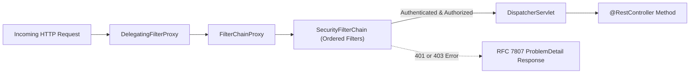
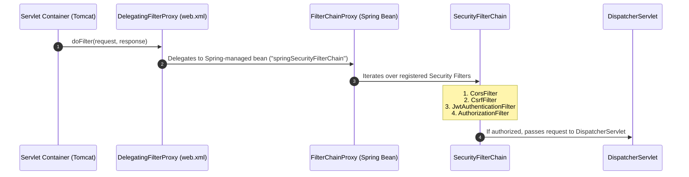
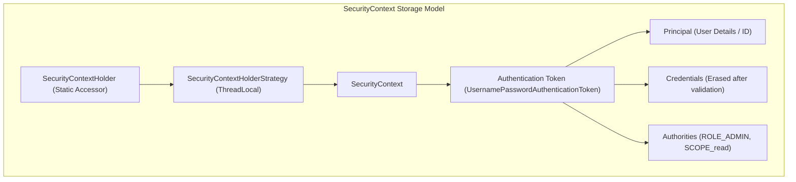

## 1. Mental Model: The Gatekeeper Pattern

In backend web applications, security must never be handled as an afterthought inside controller methods. If an unauthenticated request reaches business logic, developers risk leaking sensitive data, executing unauthorized state changes, and exposing Broken Object Level Authorization (BOLA/IDOR) vulnerabilities.

**Spring Security 6** operates as an intercepting gateway using the **Gatekeeper Pattern**:
- It intercepts every incoming HTTP request at the servlet container boundary **before** it ever reaches the Spring MVC `DispatcherServlet`.
- It evaluates authentication (identity verification) and authorization (role and permission checks).
- If validation fails, it short-circuits the pipeline immediately with an `HTTP 401 Unauthorized` or `HTTP 403 Forbidden` response.



---

## 2. Servlet Filter Architecture: `DelegatingFilterProxy` & `FilterChainProxy`

How does Spring Security—a Spring-managed dependency injection framework—hook into the standard Java Servlet container (Apache Tomcat)?

Tomcat is managed by the servlet engine, whereas Spring beans are managed by the Spring `ApplicationContext`. To bridge this gap, Spring provides **`DelegatingFilterProxy`**:



### The Standard Spring Security 6 Filter Ordering:
Spring Security executes filters in a strictly coordinated sequence:
1. `ChannelProcessingFilter`: Enforces HTTPS / TLS redirection.
2. `CorsFilter`: Evaluates cross-origin headers (`Access-Control-Allow-Origin`).
3. `CsrfFilter`: Validates CSRF tokens (disabled for stateless REST APIs).
4. `SecurityContextHolderFilter`: Loads previously saved security contexts or clears old thread-locals.
5. `HeaderWriterFilter`: Appends security headers (`X-Content-Type-Options`, `X-Frame-Options`).
6. **`JwtAuthenticationFilter` (Custom)**: Parses Bearer tokens and populates the `SecurityContext`.
7. `UsernamePasswordAuthenticationFilter`: Form-based login processing.
8. `ExceptionTranslationFilter`: Catches security exceptions and delegates to `AuthenticationEntryPoint` or `AccessDeniedHandler`.
9. `AuthorizationFilter`: Final access-control gatekeeper checking path rules (`hasRole('ADMIN')`).

---

## 3. The ThreadLocal SecurityContext & Virtual Thread Safety

Once a user is authenticated, Spring Security stores their identity inside the **`SecurityContextHolder`**:



### Accessing the Principal in Application Code:
```java
// Option 1: Direct programmatic access via static context
Authentication authentication = SecurityContextHolder.getContext().getAuthentication();
if (authentication != null && authentication.isAuthenticated()) {
    String username = authentication.getName();
}

// Option 2: Declarative injection in controller method (Recommended)
@GetMapping("/api/v1/profile")
public UserProfileResponse getProfile(@AuthenticationPrincipal AuthenticatedUser user) {
    return new UserProfileResponse(user.id(), user.email());
}
```

<Warning>
**Thread Pool Leaks & Cleanup**:
Because `SecurityContextHolder` defaults to `ThreadLocal`, in pooled thread servers (Tomcat), a thread will be reused for subsequent requests. If the context is not cleared upon request completion, User A's identity can bleed into User B's request! 
Spring Security 6 automates this cleanup via `SecurityContextHolderFilter` in its `finally` block.
</Warning>

---

## 4. Complete Production Working Code: `SecurityConfig` in Spring Boot 3.3

Below is a complete, production-grade Spring Boot 3.3 configuration leveraging the modern functional Lambda DSL, stateless sessions, custom CORS, and standardized RFC 7807 error handlers:

```java
package com.backend.mastery.security;

import com.fasterxml.jackson.databind.ObjectMapper;
import jakarta.servlet.http.HttpServletResponse;
import org.springframework.context.annotation.Bean;
import org.springframework.context.annotation.Configuration;
import org.springframework.http.HttpStatus;
import org.springframework.http.MediaType;
import org.springframework.http.ProblemDetail;
import org.springframework.security.authentication.AuthenticationManager;
import org.springframework.security.config.annotation.authentication.configuration.AuthenticationConfiguration;
import org.springframework.security.config.annotation.method.configuration.EnableMethodSecurity;
import org.springframework.security.config.annotation.web.builders.HttpSecurity;
import org.springframework.security.config.annotation.web.configuration.EnableWebSecurity;
import org.springframework.security.config.http.SessionCreationPolicy;
import org.springframework.security.crypto.bcrypt.BCryptPasswordEncoder;
import org.springframework.security.crypto.password.PasswordEncoder;
import org.springframework.security.web.AuthenticationEntryPoint;
import org.springframework.security.web.SecurityFilterChain;
import org.springframework.security.web.access.AccessDeniedHandler;
import org.springframework.security.web.authentication.UsernamePasswordAuthenticationFilter;
import org.springframework.web.cors.CorsConfiguration;
import org.springframework.web.cors.CorsConfigurationSource;
import org.springframework.web.cors.UrlBasedCorsConfigurationSource;

import java.net.URI;
import java.util.List;

@Configuration
@EnableWebSecurity
@EnableMethodSecurity // Enables @PreAuthorize with SpEL
public class ProductionSecurityConfig {

    private final JwtAuthenticationFilter jwtAuthenticationFilter;
    private final ObjectMapper objectMapper;

    public ProductionSecurityConfig(
            JwtAuthenticationFilter jwtAuthenticationFilter,
            ObjectMapper objectMapper) {
        this.jwtAuthenticationFilter = jwtAuthenticationFilter;
        this.objectMapper = objectMapper;
    }

    @Bean
    public SecurityFilterChain securityFilterChain(HttpSecurity http) throws Exception {
        return http
            // 1. Configure CORS
            .cors(cors -> cors.configurationSource(corsConfigurationSource()))

            // 2. Disable CSRF for stateless REST APIs (Tokens stored in headers, not cookies)
            .csrf(csrf -> csrf.disable())

            // 3. Enforce Stateless Sessions (No HttpSession created)
            .sessionManagement(session -> 
                session.sessionCreationPolicy(SessionCreationPolicy.STATELESS)
            )

            // 4. URL Authorization Matrix
            .authorizeHttpRequests(auth -> auth
                .requestMatchers("/actuator/health", "/actuator/info").permitAll()
                .requestMatchers("/api/v1/auth/**").permitAll()
                .requestMatchers("/api/v1/admin/**").hasRole("ADMIN")
                .anyRequest().authenticated()
            )

            // 5. Standardized RFC 7807 Error Handlers
            .exceptionHandling(exceptions -> exceptions
                .authenticationEntryPoint(customAuthenticationEntryPoint())
                .accessDeniedHandler(customAccessDeniedHandler())
            )

            // 6. Insert Custom JWT Filter before UsernamePasswordAuthenticationFilter
            .addFilterBefore(jwtAuthenticationFilter, UsernamePasswordAuthenticationFilter.class)
            .build();
    }

    @Bean
    public CorsConfigurationSource corsConfigurationSource() {
        CorsConfiguration config = new CorsConfiguration();
        config.setAllowedOrigins(List.of("https://app.example.com", "https://admin.example.com"));
        config.setAllowedMethods(List.of("GET", "POST", "PUT", "PATCH", "DELETE", "OPTIONS"));
        config.setAllowedHeaders(List.of("Authorization", "Content-Type", "X-Requested-With"));
        config.setAllowCredentials(true);
        config.setMaxAge(3600L);

        UrlBasedCorsConfigurationSource source = new UrlBasedCorsConfigurationSource();
        source.registerCorsConfiguration("/**", config);
        return source;
    }

    @Bean
    public AuthenticationEntryPoint customAuthenticationEntryPoint() {
        return (request, response, authException) -> {
            response.setStatus(HttpServletResponse.SC_UNAUTHORIZED);
            response.setContentType(MediaType.APPLICATION_PROBLEM_JSON_VALUE);

            ProblemDetail problem = ProblemDetail.forStatusAndDetail(
                HttpStatus.UNAUTHORIZED, 
                "Full authentication is required to access this resource."
            );
            problem.setTitle("Unauthorized");
            problem.setType(URI.create("https://api.example.com/errors/unauthorized"));
            response.getWriter().write(objectMapper.writeValueAsString(problem));
        };
    }

    @Bean
    public AccessDeniedHandler customAccessDeniedHandler() {
        return (request, response, accessDeniedException) -> {
            response.setStatus(HttpServletResponse.SC_FORBIDDEN);
            response.setContentType(MediaType.APPLICATION_PROBLEM_JSON_VALUE);

            ProblemDetail problem = ProblemDetail.forStatusAndDetail(
                HttpStatus.FORBIDDEN, 
                "You do not possess the required permissions or roles to perform this operation."
            );
            problem.setTitle("Forbidden");
            problem.setType(URI.create("https://api.example.com/errors/forbidden"));
            response.getWriter().write(objectMapper.writeValueAsString(problem));
        };
    }

    @Bean
    public PasswordEncoder passwordEncoder() {
        // BCrypt work factor 12 (balances hash security against CPU overhead)
        return new BCryptPasswordEncoder(12);
    }

    @Bean
    public AuthenticationManager authenticationManager(AuthenticationConfiguration config) throws Exception {
        return config.getAuthenticationManager();
    }
}
```

---

## 5. Complete Production `JwtAuthenticationFilter` (`OncePerRequestFilter`)

```java
package com.backend.mastery.security;

import jakarta.servlet.FilterChain;
import jakarta.servlet.ServletException;
import jakarta.servlet.http.HttpServletRequest;
import jakarta.servlet.http.HttpServletResponse;
import org.slf4j.Logger;
import org.slf4j.LoggerFactory;
import org.springframework.http.HttpHeaders;
import org.springframework.security.authentication.UsernamePasswordAuthenticationToken;
import org.springframework.security.core.authority.SimpleGrantedAuthority;
import org.springframework.security.core.context.SecurityContextHolder;
import org.springframework.security.web.authentication.WebAuthenticationDetailsSource;
import org.springframework.stereotype.Component;
import org.springframework.web.filter.OncePerRequestFilter;

import java.io.IOException;
import java.util.List;

@Component
public class JwtAuthenticationFilter extends OncePerRequestFilter {

    private static final Logger log = LoggerFactory.getLogger(JwtAuthenticationFilter.class);
    private final JwtTokenService jwtTokenService;

    public JwtAuthenticationFilter(JwtTokenService jwtTokenService) {
        this.jwtTokenService = jwtTokenService;
    }

    @Override
    protected void doFilterInternal(
            HttpServletRequest request,
            HttpServletResponse response,
            FilterChain filterChain) throws ServletException, IOException {

        String authHeader = request.getHeader(HttpHeaders.AUTHORIZATION);

        // 1. Check for Bearer token presence
        if (authHeader == null || !authHeader.startsWith("Bearer ")) {
            filterChain.doFilter(request, response);
            return;
        }

        String jwt = authHeader.substring(7);

        try {
            // 2. Validate cryptographic signature and expiration
            if (jwtTokenService.isTokenValid(jwt)) {
                AuthenticatedUser user = jwtTokenService.extractUser(jwt);

                List<SimpleGrantedAuthority> authorities = user.roles().stream()
                        .map(role -> new SimpleGrantedAuthority("ROLE_" + role))
                        .toList();

                // 3. Build Authentication Token
                UsernamePasswordAuthenticationToken authentication =
                        new UsernamePasswordAuthenticationToken(user, null, authorities);
                authentication.setDetails(new WebAuthenticationDetailsSource().buildDetails(request));

                // 4. Bind Authentication to SecurityContextHolder for the executing thread
                SecurityContextHolder.getContext().setAuthentication(authentication);
            }
        } catch (Exception ex) {
            log.warn("Failed to authenticate JWT token: {}", ex.getMessage());
            // Clear context to guarantee safety
            SecurityContextHolder.clearContext();
        }

        filterChain.doFilter(request, response);
    }
}
```

---

## 6. Method-Level Security: Defending Against BOLA / IDOR

URL-level authorization (`.hasRole("ADMIN")`) is insufficient. In multi-tenant systems, an attacker will change the URL path from `/api/v1/invoices/1001` to `/api/v1/invoices/1002` to view another user's private data (**Broken Object Level Authorization**).

To prevent this, enforce **Method-Level Security** using Spring Expression Language (SpEL):

```java
@RestController
@RequestMapping("/api/v1/users/{userId}/notes")
public class UserNoteController {

    private final NoteService noteService;

    public UserNoteController(NoteService noteService) {
        this.noteService = noteService;
    }

    // SpEL enforces that the caller must either be an ADMIN or own the requested resource ID!
    @GetMapping("/{noteId}")
    @PreAuthorize("hasRole('ADMIN') or #userId == authentication.principal.id")
    public NoteResponse getNote(
            @PathVariable Long userId,
            @PathVariable Long noteId) {
        return noteService.getNote(userId, noteId);
    }

    // Post-authorization: verify ownership after entity is loaded from database
    @GetMapping("/by-title")
    @PostAuthorize("returnObject.ownerId == authentication.principal.id")
    public NoteResponse getNoteByTitle(@RequestParam String title) {
        return noteService.findByTitle(title);
    }
}
```

---

## 7. Failure Modes & Edge Case Matrix

| Failure Mode | Root Cause | Impact | Production Defense |
| :--- | :--- | :--- | :--- |
| **CORS Pre-Flight 401** | Filter chain blocks `OPTIONS` pre-flight requests | Frontend web client blocked by browser | Configure `.cors()` before `.authorizeHttpRequests()`. |
| **ThreadLocal Identity Bleed** | Failing to clear `SecurityContext` after request | User A identity bleeds into User B in Tomcat | Handled automatically by `SecurityContextHolderFilter`. |
| **BOLA / IDOR Leak** | Checking only roles (`hasRole('USER')`) without owner checks | User A views User B's billing records | Enforce SpEL `@PreAuthorize("#userId == authentication.principal.id")`. |
| **BCrypt CPU Starvation** | Work factor set too high ($> 15$) | Login attempts freeze CPU cores | Tune BCrypt work factor to 10-12 (~100ms hash time). |
| **CSRF Redundant Token Block** | Enabling CSRF on stateless JWT REST APIs | Mobile and SPA clients fail with 403 Forbidden | Disable CSRF when auth tokens are stored in request headers. |

---

## 8. Senior Interview Questions & Active Recall

<AccordionGroup>
  <Accordion title="1. How does DelegatingFilterProxy bridge the Servlet container with Spring IoC?">
    The servlet container (Tomcat) manages standard `javax.servlet.Filter` instances defined in the servlet environment, whereas Spring beans are created and managed by the Spring `ApplicationContext`. `DelegatingFilterProxy` is a standard servlet filter registered with Tomcat that delegates all `doFilter()` invocations to a Spring-managed bean named `springSecurityFilterChain` (`FilterChainProxy`), allowing Spring to manage security filters as dependency-injected beans.
  </Accordion>

  <Accordion title="2. Why should CSRF protection be disabled for stateless REST APIs using JWTs?">
    Cross-Site Request Forgery (CSRF) attacks exploit the browser's automatic behavior of attaching ambient session cookies to cross-origin requests. In stateless REST APIs where authentication relies on JWTs transmitted via the `Authorization: Bearer <token>` header, the browser does not automatically attach headers to cross-origin links or form submissions. Therefore, stateless REST APIs using headers are inherently immune to CSRF, and disabling CSRF avoids unnecessary token validation overhead.
  </Accordion>

  <Accordion title="3. How do you defend against Broken Object Level Authorization (BOLA/IDOR) using Spring Security?">
    Role-based access control (RBAC) only verifies that a caller is an authenticated user, not that they own the requested resource. To prevent BOLA/IDOR, combine `@EnableMethodSecurity` with Spring Expression Language (SpEL): `@PreAuthorize("hasRole('ADMIN') or #userId == authentication.principal.id")`. This compares the URL path parameter `#userId` against the authenticated principal ID embedded in the security context before method execution begins.
  </Accordion>

  <Accordion title="4. What is the difference between AuthenticationEntryPoint and AccessDeniedHandler?">
    - **`AuthenticationEntryPoint`**: Invoked when an unauthenticated user (anonymous caller) attempts to access a protected resource. It handles missing or invalid authentication credentials, returning an `HTTP 401 Unauthorized` response.
    - **`AccessDeniedHandler`**: Invoked when an authenticated user attempts to access a resource for which they lack the necessary roles or permissions. It returns an `HTTP 403 Forbidden` response.
  </Accordion>
</AccordionGroup>

---

## 9. Done Checklist

<Check>
- [ ] Diagram the flow from Tomcat $\rightarrow$ `DelegatingFilterProxy` $\rightarrow$ `FilterChainProxy` $\rightarrow$ `SecurityFilterChain`.
- [ ] Configure Spring Security 6 using the modern functional Lambda DSL.
- [ ] Implement stateless REST security: disabled CSRF, stateless session creation policy, and custom CORS.
- [ ] Build a production `OncePerRequestFilter` that extracts and validates JWT tokens.
- [ ] Format 401 and 403 error responses using RFC 7807 `ProblemDetail`.
- [ ] Protect against BOLA/IDOR using SpEL method security: `@PreAuthorize("#userId == authentication.principal.id")`.
</Check>
