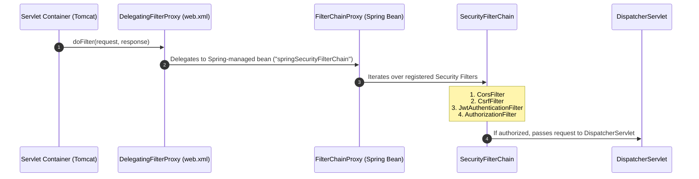
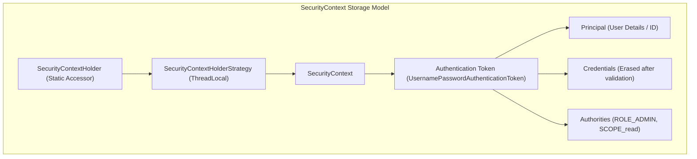
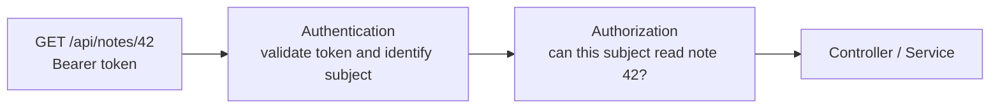
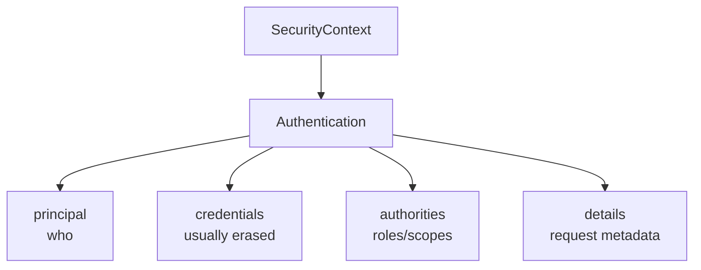
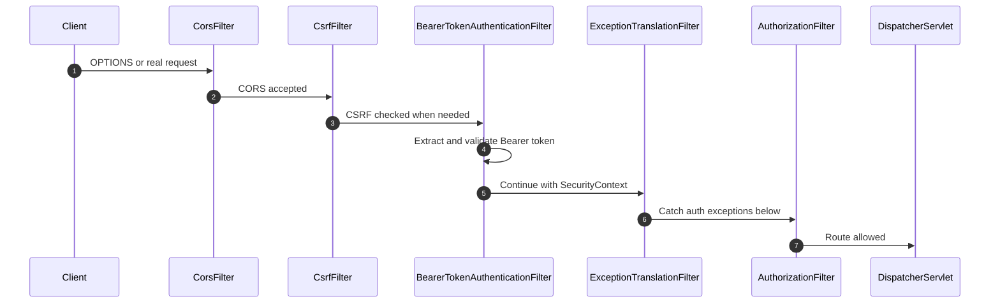
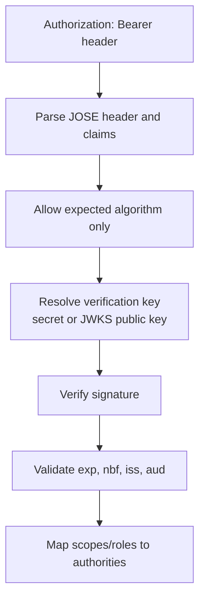
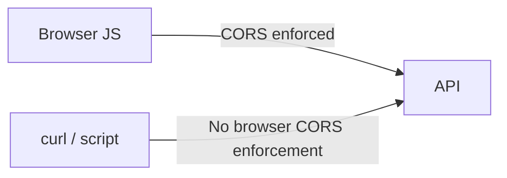

# Spring Security 6 Architecture & Filter Chain Deep Dive

In backend web development, security is frequently treated as an afterthought—developers slap an `@CrossOrigin` annotation on a controller, copy a StackOverflow JWT filter, and assume the application is protected.

However, in high-throughput enterprise systems, misunderstanding Spring Security leads to devastating production breaches:
- **ThreadLocal Identity Bleed**: A pooled Tomcat worker thread serves User A (an Admin), but fails to clear its security context. Two seconds later, the same thread handles User B (an anonymous visitor), granting them root administrative power.
- **Broken Object Level Authorization (BOLA / IDOR)**: Endpoints verify that the caller is logged in (`hasRole('USER')`), but fail to verify if the caller actually owns the resource ID in the URL path. Attackers iterate IDs to exfiltrate company databases.
- **CORS Pre-flight Lockouts**: Browsers reject cross-origin requests because the Spring Security filter chain intercepts and rejects the browser's unauthenticated HTTP `OPTIONS` pre-flight check before CORS processing can even evaluate headers.
- **BCrypt CPU Starvation**: An uncalibrated password hashing factor freezes all JVM CPU cores during a traffic burst, causing Kubernetes liveness probes to fail and killing the cluster.

This masterclass builds Spring Security from raw physical HTTP network packets up to Staff-level security engineering.

---

## Phase 1: Ground Floor (Physical First Principles)

To master Spring Security, you must first understand the hostile physical environment of network programming.

### 1.1 The Hostile Physical Network
An HTTP request is simply an incoming array of ASCII/binary bytes transmitted over a TCP socket from an untrusted remote machine. 

```http
GET /api/v1/users/42/bank-account HTTP/1.1\r\n
Host: api.example.com\r\n
Authorization: Bearer eyJhbGciOi...\r\n
X-Forwarded-For: 198.51.100.4\r\n
\r\n
```

**The Core Axiom of Backend Security**: *The client controls 100% of the bytes outside your server memory.*
- The client can forge any HTTP header (`X-Admin: true`, `X-User-Id: 1`).
- The client can forge or replay cookies.
- The client can alter URL path IDs (`/orders/101` $\rightarrow$ `/orders/102`).
- The client can send malformed JSON bodies designed to exhaust server CPU or RAM.

Therefore, security logic **cannot** live inside business domain services or be left as an optional check in controller methods. Security must act as a **Physical Fortress Perimeter** at the absolute boundary of the servlet container, evaluating every single byte before Java reflection ever dispatches the request to a controller.

### 1.2 The Architectural Dilemma: Tomcat vs Spring IoC
In a Spring Boot application, there are two distinct runtime worlds:
1. **The Servlet Container World (Apache Tomcat)**: Manages network sockets, worker threads (`http-nio-8080-exec-*`), and standard Java EE `Filter` instances. Tomcat knows nothing about Spring, `@Autowired`, or dependency injection.
2. **The Spring ApplicationContext World**: Manages Spring beans, repositories, database connection pools, password encoders, and security rules.

```mermaid
flowchart TD
    subgraph TomcatWorld["1. Tomcat Servlet Container (Native OS Threads)"]
        Req["HTTP Request over TCP Socket"] --> FilterChain["Standard Servlet Filter Chain"]
        FilterChain --> DFP["DelegatingFilterProxy (web.xml / Servlet Registration)"]
    end

    subgraph SpringWorld["2. Spring ApplicationContext (IoC Container)"]
        DFP -->|Delegates doFilter() call| FCP["FilterChainProxy (Spring Bean: 'springSecurityFilterChain')"]
        FCP --> SFC["SecurityFilterChain (List of Spring Security Filters)"]
        SFC --> DS["DispatcherServlet"]
        DS --> Controller["@RestController Method"]
    end
```

To bridge this physical divide, Spring provides **`DelegatingFilterProxy`**:
- A standard servlet filter registered with Tomcat.
- When Tomcat calls `doFilter(request, response)`, `DelegatingFilterProxy` does **not** process security itself. Instead, it looks up a Spring bean named `springSecurityFilterChain` inside the `ApplicationContext` and delegates the execution to it.
- This allows Spring Security to leverage full dependency injection (injecting databases, Redis clients, and configuration properties) while intercepting requests at the native Tomcat servlet boundary!

---

## Phase 2: The Naive Code (The Production Crash)

Let's observe what happens when a beginner attempts to implement security manually without understanding the filter architecture.

### The Naive Security Implementation
```java
@RestController
@RequestMapping("/api/v1/invoices")
public class NaiveInvoiceController {

    @Autowired
    private InvoiceRepository invoiceRepository;

    // CRASH SCENARIO 1: Manual In-Controller Auth & IDOR Breach
    @GetMapping("/{invoiceId}")
    public ResponseEntity<?> getInvoice(
            @PathVariable Long invoiceId,
            @RequestHeader(value = "Authorization", required = false) String token) {
        
        // Naive authentication check:
        if (token == null || !token.startsWith("Bearer valid-token")) {
            return ResponseEntity.status(401).body("Unauthorized");
        }

        // DISASTER: Checks if logged in, but NEVER checks if caller OWNS invoiceId!
        // Attacker loops invoiceId from 1 to 1,000,000 to download all invoices!
        return ResponseEntity.ok(invoiceRepository.findById(invoiceId));
    }
}
```

### Production Crash 1: ThreadLocal Identity Bleed Across Users
A developer writes a custom filter to store user identity in a `ThreadLocal`:

```java
// THE DEADLY ANTI-PATTERN
public class FlawedAuthFilter implements Filter {
    public static final ThreadLocal<User> CURRENT_USER = new ThreadLocal<>();

    @Override
    public void doFilter(ServletRequest req, ServletResponse res, FilterChain chain) throws IOException, ServletException {
        HttpServletRequest request = (HttpServletRequest) req;
        String token = request.getHeader("Authorization");
        
        if (token != null && token.equals("Bearer admin-secret")) {
            CURRENT_USER.set(new User("admin@corp.com", Role.ADMIN));
        }
        // BUG: Forgot try/finally to clear ThreadLocal!
        chain.doFilter(req, res); 
    }
}
```

- **The Disaster Sequence**:
  1. Tomcat worker thread `exec-1` processes a request from Alice (an Admin).
  2. `FlawedAuthFilter` sets `CURRENT_USER` on `exec-1` to `Admin`.
  3. The request completes, but `exec-1` is returned to Tomcat's thread pool **without clearing the ThreadLocal**.
  4. 200 milliseconds later, Bob (an anonymous user with no auth token) hits the server.
  5. Tomcat assigns `exec-1` to Bob's request.
  6. Bob's request has no `Authorization` header, so the `if` check is skipped.
  7. Downstream code checks `CURRENT_USER.get()`. It finds Alice's `Admin` object still pinned to `exec-1`!
  8. Bob now has full administrative access to delete the entire database.

### Production Crash 2: BCrypt Work Factor CPU Freeze
- **The Code**: `new BCryptPasswordEncoder(16);`
- **The Crash**:
  - BCrypt is deliberately designed to be computationally expensive to prevent brute-force attacks.
  - The work factor $N$ exponentially doubles hashing iterations ($2^N$).
  - At $N=10$, hashing takes $\approx 80\text{ ms}$. At $N=16$, hashing takes **5.2 seconds of 100% CPU time per password**!
  - A flash crowd of 50 users attempt to log in simultaneously.
  - All 8 CPU cores on the Kubernetes pod lock at 100% utilization running BCrypt math.
  - Kubernetes liveness probes time out, the pod is killed and restarted, creating a cascading restart loop that downs the company's login system.

---

## Phase 3: Under the Hood (Mechanics & Bytecode)

Let's examine how Spring Security 6 prevents these catastrophic failures through its internal filter pipeline.

### 3.1 The Servlet Filter Architecture: `DelegatingFilterProxy` & `FilterChainProxy`

How does Spring Security—a Spring-managed dependency injection framework—hook into the standard Java Servlet container (Apache Tomcat)?

Tomcat is managed by the servlet engine, whereas Spring beans are managed by the Spring `ApplicationContext`. To bridge this gap, Spring provides **`DelegatingFilterProxy`**:



### The Standard Spring Security 6 Filter Ordering:
Spring Security executes filters in a strictly coordinated sequence:
1. `ChannelProcessingFilter`: Enforces HTTPS / TLS redirection.
2. `CorsFilter`: Evaluates cross-origin headers (`Access-Control-Allow-Origin`).
3. `CsrfFilter`: Validates CSRF tokens (disabled for stateless REST APIs).
4. `SecurityContextHolderFilter`: Loads previously saved security contexts or clears old thread-locals.
5. `HeaderWriterFilter`: Appends security headers (`X-Content-Type-Options`, `X-Frame-Options`).
6. **`JwtAuthenticationFilter` (Custom)**: Parses Bearer tokens and populates the `SecurityContext`.
7. `UsernamePasswordAuthenticationFilter`: Form-based login processing.
8. `ExceptionTranslationFilter`: Catches security exceptions and delegates to `AuthenticationEntryPoint` or `AccessDeniedHandler`.
9. `AuthorizationFilter`: Final access-control gatekeeper checking path rules (`hasRole('ADMIN')`).

---

## 3. The ThreadLocal SecurityContext & Virtual Thread Safety

Once a user is authenticated, Spring Security stores their identity inside the **`SecurityContextHolder`**:



### Accessing the Principal in Application Code:
```java
// Option 1: Direct programmatic access via static context
Authentication authentication = SecurityContextHolder.getContext().getAuthentication();
if (authentication != null && authentication.isAuthenticated()) {
    String username = authentication.getName();
}

// Option 2: Declarative injection in controller method (Recommended)
@GetMapping("/api/v1/profile")
public UserProfileResponse getProfile(@AuthenticationPrincipal AuthenticatedUser user) {
    return new UserProfileResponse(user.id(), user.email());
}
```

<Warning>
**Thread Pool Leaks & Cleanup**:
Because `SecurityContextHolder` defaults to `ThreadLocal`, in pooled thread servers (Tomcat), a thread will be reused for subsequent requests. If the context is not cleared upon request completion, User A's identity can bleed into User B's request! 
Spring Security 6 automates this cleanup via `SecurityContextHolderFilter` in its `finally` block.
</Warning>

---

## 4. Complete Production Working Code: `SecurityConfig` in Spring Boot 3.3

Below is a complete, production-grade Spring Boot 3.3 configuration leveraging the modern functional Lambda DSL, stateless sessions, custom CORS, and standardized RFC 7807 error handlers:

```java
package com.backend.mastery.security;

import com.fasterxml.jackson.databind.ObjectMapper;
import jakarta.servlet.http.HttpServletResponse;
import org.springframework.context.annotation.Bean;
import org.springframework.context.annotation.Configuration;
import org.springframework.http.HttpStatus;
import org.springframework.http.MediaType;
import org.springframework.http.ProblemDetail;
import org.springframework.security.authentication.AuthenticationManager;
import org.springframework.security.config.annotation.authentication.configuration.AuthenticationConfiguration;
import org.springframework.security.config.annotation.method.configuration.EnableMethodSecurity;
import org.springframework.security.config.annotation.web.builders.HttpSecurity;
import org.springframework.security.config.annotation.web.configuration.EnableWebSecurity;
import org.springframework.security.config.http.SessionCreationPolicy;
import org.springframework.security.crypto.bcrypt.BCryptPasswordEncoder;
import org.springframework.security.crypto.password.PasswordEncoder;
import org.springframework.security.web.AuthenticationEntryPoint;
import org.springframework.security.web.SecurityFilterChain;
import org.springframework.security.web.access.AccessDeniedHandler;
import org.springframework.security.web.authentication.UsernamePasswordAuthenticationFilter;
import org.springframework.web.cors.CorsConfiguration;
import org.springframework.web.cors.CorsConfigurationSource;
import org.springframework.web.cors.UrlBasedCorsConfigurationSource;

import java.net.URI;
import java.util.List;

@Configuration
@EnableWebSecurity
@EnableMethodSecurity // Enables @PreAuthorize with SpEL
public class ProductionSecurityConfig {

    private final JwtAuthenticationFilter jwtAuthenticationFilter;
    private final ObjectMapper objectMapper;

    public ProductionSecurityConfig(
            JwtAuthenticationFilter jwtAuthenticationFilter,
            ObjectMapper objectMapper) {
        this.jwtAuthenticationFilter = jwtAuthenticationFilter;
        this.objectMapper = objectMapper;
    }

    @Bean
    public SecurityFilterChain securityFilterChain(HttpSecurity http) throws Exception {
        return http
            // 1. Configure CORS
            .cors(cors -> cors.configurationSource(corsConfigurationSource()))

            // 2. Disable CSRF for stateless REST APIs (Tokens stored in headers, not cookies)
            .csrf(csrf -> csrf.disable())

            // 3. Enforce Stateless Sessions (No HttpSession created)
            .sessionManagement(session -> 
                session.sessionCreationPolicy(SessionCreationPolicy.STATELESS)
            )

            // 4. URL Authorization Matrix
            .authorizeHttpRequests(auth -> auth
                .requestMatchers("/actuator/health", "/actuator/info").permitAll()
                .requestMatchers("/api/v1/auth/**").permitAll()
                .requestMatchers("/api/v1/admin/**").hasRole("ADMIN")
                .anyRequest().authenticated()
            )

            // 5. Standardized RFC 7807 Error Handlers
            .exceptionHandling(exceptions -> exceptions
                .authenticationEntryPoint(customAuthenticationEntryPoint())
                .accessDeniedHandler(customAccessDeniedHandler())
            )

            // 6. Insert Custom JWT Filter before UsernamePasswordAuthenticationFilter
            .addFilterBefore(jwtAuthenticationFilter, UsernamePasswordAuthenticationFilter.class)
            .build();
    }

    @Bean
    public CorsConfigurationSource corsConfigurationSource() {
        CorsConfiguration config = new CorsConfiguration();
        config.setAllowedOrigins(List.of("https://app.example.com", "https://admin.example.com"));
        config.setAllowedMethods(List.of("GET", "POST", "PUT", "PATCH", "DELETE", "OPTIONS"));
        config.setAllowedHeaders(List.of("Authorization", "Content-Type", "X-Requested-With"));
        config.setAllowCredentials(true);
        config.setMaxAge(3600L);

        UrlBasedCorsConfigurationSource source = new UrlBasedCorsConfigurationSource();
        source.registerCorsConfiguration("/**", config);
        return source;
    }

    @Bean
    public AuthenticationEntryPoint customAuthenticationEntryPoint() {
        return (request, response, authException) -> {
            response.setStatus(HttpServletResponse.SC_UNAUTHORIZED);
            response.setContentType(MediaType.APPLICATION_PROBLEM_JSON_VALUE);

            ProblemDetail problem = ProblemDetail.forStatusAndDetail(
                HttpStatus.UNAUTHORIZED, 
                "Full authentication is required to access this resource."
            );
            problem.setTitle("Unauthorized");
            problem.setType(URI.create("https://api.example.com/errors/unauthorized"));
            response.getWriter().write(objectMapper.writeValueAsString(problem));
        };
    }

    @Bean
    public AccessDeniedHandler customAccessDeniedHandler() {
        return (request, response, accessDeniedException) -> {
            response.setStatus(HttpServletResponse.SC_FORBIDDEN);
            response.setContentType(MediaType.APPLICATION_PROBLEM_JSON_VALUE);

            ProblemDetail problem = ProblemDetail.forStatusAndDetail(
                HttpStatus.FORBIDDEN, 
                "You do not possess the required permissions or roles to perform this operation."
            );
            problem.setTitle("Forbidden");
            problem.setType(URI.create("https://api.example.com/errors/forbidden"));
            response.getWriter().write(objectMapper.writeValueAsString(problem));
        };
    }

    @Bean
    public PasswordEncoder passwordEncoder() {
        // BCrypt work factor 12 (balances hash security against CPU overhead)
        return new BCryptPasswordEncoder(12);
    }

    @Bean
    public AuthenticationManager authenticationManager(AuthenticationConfiguration config) throws Exception {
        return config.getAuthenticationManager();
    }
}
```

---

## 5. Complete Production `JwtAuthenticationFilter` (`OncePerRequestFilter`)

```java
package com.backend.mastery.security;

import jakarta.servlet.FilterChain;
import jakarta.servlet.ServletException;
import jakarta.servlet.http.HttpServletRequest;
import jakarta.servlet.http.HttpServletResponse;
import org.slf4j.Logger;
import org.slf4j.LoggerFactory;
import org.springframework.http.HttpHeaders;
import org.springframework.security.authentication.UsernamePasswordAuthenticationToken;
import org.springframework.security.core.authority.SimpleGrantedAuthority;
import org.springframework.security.core.context.SecurityContextHolder;
import org.springframework.security.web.authentication.WebAuthenticationDetailsSource;
import org.springframework.stereotype.Component;
import org.springframework.web.filter.OncePerRequestFilter;

import java.io.IOException;
import java.util.List;

@Component
public class JwtAuthenticationFilter extends OncePerRequestFilter {

    private static final Logger log = LoggerFactory.getLogger(JwtAuthenticationFilter.class);
    private final JwtTokenService jwtTokenService;

    public JwtAuthenticationFilter(JwtTokenService jwtTokenService) {
        this.jwtTokenService = jwtTokenService;
    }

    @Override
    protected void doFilterInternal(
            HttpServletRequest request,
            HttpServletResponse response,
            FilterChain filterChain) throws ServletException, IOException {

        String authHeader = request.getHeader(HttpHeaders.AUTHORIZATION);

        // 1. Check for Bearer token presence
        if (authHeader == null || !authHeader.startsWith("Bearer ")) {
            filterChain.doFilter(request, response);
            return;
        }

        String jwt = authHeader.substring(7);

        try {
            // 2. Validate cryptographic signature and expiration
            if (jwtTokenService.isTokenValid(jwt)) {
                AuthenticatedUser user = jwtTokenService.extractUser(jwt);

                List<SimpleGrantedAuthority> authorities = user.roles().stream()
                        .map(role -> new SimpleGrantedAuthority("ROLE_" + role))
                        .toList();

                // 3. Build Authentication Token
                UsernamePasswordAuthenticationToken authentication =
                        new UsernamePasswordAuthenticationToken(user, null, authorities);
                authentication.setDetails(new WebAuthenticationDetailsSource().buildDetails(request));

                // 4. Bind Authentication to SecurityContextHolder for the executing thread
                SecurityContextHolder.getContext().setAuthentication(authentication);
            }
        } catch (Exception ex) {
            log.warn("Failed to authenticate JWT token: {}", ex.getMessage());
            // Clear context to guarantee safety
            SecurityContextHolder.clearContext();
        }

        filterChain.doFilter(request, response);
    }
}
```

---

## 6. Method-Level Security: Defending Against BOLA / IDOR

URL-level authorization (`.hasRole("ADMIN")`) is insufficient. In multi-tenant systems, an attacker will change the URL path from `/api/v1/invoices/1001` to `/api/v1/invoices/1002` to view another user's private data (**Broken Object Level Authorization**).

To prevent this, enforce **Method-Level Security** using Spring Expression Language (SpEL):

```java
@RestController
@RequestMapping("/api/v1/users/{userId}/notes")
public class UserNoteController {

    private final NoteService noteService;

    public UserNoteController(NoteService noteService) {
        this.noteService = noteService;
    }

    // SpEL enforces that the caller must either be an ADMIN or own the requested resource ID!
    @GetMapping("/{noteId}")
    @PreAuthorize("hasRole('ADMIN') or #userId == authentication.principal.id")
    public NoteResponse getNote(
            @PathVariable Long userId,
            @PathVariable Long noteId) {
        return noteService.getNote(userId, noteId);
    }

    // Post-authorization: verify ownership after entity is loaded from database
    @GetMapping("/by-title")
    @PostAuthorize("returnObject.ownerId == authentication.principal.id")
    public NoteResponse getNoteByTitle(@RequestParam String title) {
        return noteService.findByTitle(title);
    }
}
```

---

## 7. Failure Modes & Edge Case Matrix

| Failure Mode | Root Cause | Impact | Production Defense |
| :--- | :--- | :--- | :--- |
| **CORS Pre-Flight 401** | Filter chain blocks `OPTIONS` pre-flight requests | Frontend web client blocked by browser | Configure `.cors()` before `.authorizeHttpRequests()`. |
| **ThreadLocal Identity Bleed** | Failing to clear `SecurityContext` after request | User A identity bleeds into User B in Tomcat | Handled automatically by `SecurityContextHolderFilter`. |
| **BOLA / IDOR Leak** | Checking only roles (`hasRole('USER')`) without owner checks | User A views User B's billing records | Enforce SpEL `@PreAuthorize("#userId == authentication.principal.id")`. |
| **BCrypt CPU Starvation** | Work factor set too high ($> 15$) | Login attempts freeze CPU cores | Tune BCrypt work factor to 10-12 (~100ms hash time). |
| **CSRF Redundant Token Block** | Enabling CSRF on stateless JWT REST APIs | Mobile and SPA clients fail with 403 Forbidden | Disable CSRF when auth tokens are stored in request headers. |

---

## Phase 4: Senior Interview Ace (Junior vs Staff Phrasing)

When interviewers grill you on Spring Security, they want to see if you understand the underlying runtime mechanics (Servlet containers, thread locals, proxies, and web vulnerability models) or if you just memorize boilerplate config snippets.

| Topic | Junior Developer Answer | Senior / Staff Engineer Answer |
| :--- | :--- | :--- |
| **Servlet Filter vs Spring Security** | *"Spring Security is a filter you configure in Java that blocks requests if you are not logged in."* | *"Tomcat and Spring live in two different worlds. Tomcat manages native servlet filters outside the Spring IoC container, while security rules require Spring-managed beans like `PasswordEncoder` and `UserDetailsService`. To bridge this, Spring uses `DelegatingFilterProxy`—a native servlet filter registered in the container that delegates `doFilter()` to `FilterChainProxy` (`springSecurityFilterChain`). `FilterChainProxy` matches the request against multiple `SecurityFilterChain` instances and executes ordered Spring security filters before the request ever touches `DispatcherServlet`."* |
| **ThreadLocal Identity Leakage** | *"Spring Security stores the current user in `SecurityContextHolder`, and you can get it anywhere with `getContext().getAuthentication()`."* | *"`SecurityContextHolder` defaults to a `ThreadLocal` strategy. In multi-threaded servlet containers like Tomcat, worker threads are pooled and reused across thousands of requests. If User A logs in as an admin and the `ThreadLocal` is not explicitly cleared, User B's subsequent anonymous request assigned to the same worker thread will inherit User A's `SecurityContext`, causing a critical privilege escalation breach. Spring Security 6 handles this by having `SecurityContextHolderFilter` clear the context in a `finally` block on every single request. Furthermore, with Java 21 Virtual Threads, virtual threads are cheap and discarded after execution, but thread-local cleanup remains mandatory to avoid heap pinning."* |
| **BOLA / IDOR Defense** | *"I check if the user has `ROLE_USER` using `.requestMatchers().hasRole('USER')`."* | *"Role-based access control (RBAC) at the URL level only verifies that the caller is authenticated and holds a broad role. It does NOT verify resource ownership. An attacker with a valid account can change `/invoices/101` to `/invoices/102` and download another customer's data (OWASP #1 Broken Object Level Authorization). I defend against BOLA by combining `@EnableMethodSecurity` with SpEL method security: `@PreAuthorize("hasRole('ADMIN') or #userId == authentication.principal.id")`. This enforces that the executing principal's ID extracted from the cryptographically verified JWT matches the URL path parameter `#userId` before controller code execution."* |
| **CSRF in Stateless JWT REST APIs** | *"I always disable CSRF because tutorials say to write `.csrf(csrf -> csrf.disable())`."* | *"CSRF attacks exploit browsers automatically attaching ambient credentials (cookies) to cross-origin requests. When an API is strictly stateless and authenticates requests via the `Authorization: Bearer <jwt>` HTTP header, browsers NEVER automatically attach custom headers to cross-origin requests or form submissions. Thus, stateless header-based APIs are fundamentally immune to CSRF, making disabling CSRF safe and eliminating token generation overhead. However, if the JWT is stored in an `HttpOnly` cookie for XSS protection, CSRF is actively possible, and CSRF protection (via double-submit cookie or SameSite=Strict) must remain enabled."* |

---

## Spring Security Fundamentals Interview Map

Security fundamentals must be precise. A vague security answer usually hides a real vulnerability.

### 1. Authentication vs Authorization

Authentication answers: **Who is calling?**

Authorization answers: **Is this caller allowed to perform this action on this resource?**



Bad implementation:

```java
@GetMapping("/notes/{id}")
@PreAuthorize("hasRole('USER')")
public NoteResponse get(@PathVariable Long id) {
    return noteService.getById(id);
}
```

This proves the caller is a user. It does not prove the caller owns note `id`.

Correct implementation:

```java
@Transactional(readOnly = true)
public NoteResponse getOwnedNote(Long id, String subject) {
    Note note = noteRepository.findByIdAndOwnerSubject(id, subject)
            .orElseThrow(() -> new ResponseStatusException(HttpStatus.NOT_FOUND));
    return NoteResponse.from(note);
}
```

**Senior answer:** "Authentication creates a trusted principal from cryptographic or credential evidence. Authorization must then bind that principal to the exact resource and action, usually with ownership-scoped queries or method security."

### 2. What is in an `Authentication` object?

After authentication succeeds, Spring stores an `Authentication` inside `SecurityContext`.



Examples:

- Form login commonly uses `UsernamePasswordAuthenticationToken`.
- OAuth2 resource server commonly uses `JwtAuthenticationToken`.
- Anonymous requests may use `AnonymousAuthenticationToken`.

Do not assume `authentication.getPrincipal()` is always your custom user class. In JWT resource-server mode, it may be a `Jwt`.

### 3. What does the filter chain do before the controller?

The controller should not parse raw credentials. The filter chain does it first.



If authentication fails, the request never reaches `@RestControllerAdvice`. That is why `AuthenticationEntryPoint` and `AccessDeniedHandler` must write security error responses.

### 4. How should JWT validation be explained?

A JWT is not trusted because it has three base64 sections. It is trusted only after validation.



Validation checklist:

- Reject `alg: none`.
- Enforce the expected algorithm.
- Validate signature with the configured key.
- Validate issuer (`iss`).
- Validate audience (`aud`).
- Validate expiration (`exp`) and not-before (`nbf`).
- Map roles/scopes from trusted claims only.

**Senior answer:** "JWT validation is cryptographic verification plus claim validation. Signature alone only proves the token was signed by a key; it does not prove the token was intended for this API, issued by the expected issuer, or still valid."

### 5. When is CSRF required?

CSRF matters when the browser automatically attaches credentials.

| Credential Storage | Browser Sends Automatically? | CSRF Risk |
| :--- | :--- | :--- |
| Session cookie | Yes | Yes |
| `HttpOnly` refresh/access cookie | Yes | Yes |
| HTTP Basic cached by browser | Yes | Yes |
| `Authorization` header set by JavaScript | No | Usually no CSRF |

If your access token is in a bearer header and no cookies/session/basic auth are accepted on API routes, CSRF protection can be disabled for those routes.

If cookies authenticate the request, keep CSRF protection and configure `SameSite`, `Secure`, and token handling deliberately.

### 6. Why does CORS not secure your API?

CORS is a browser rule. It prevents browser JavaScript from reading blocked cross-origin responses. It does not stop curl, Postman, backend scripts, mobile apps, or direct attackers from sending requests.



**Senior answer:** "CORS is not authorization. It is a browser-enforced read protection mechanism. The API must still authenticate and authorize every request."

### Security Build-Break-Fix Lab

<Steps>
  <Step title="Build">
    Implement `GET /api/notes/{id}` using JWT authentication and a normal `ROLE_USER`.
  </Step>
  <Step title="Break">
    Create two users. Use User A's token to request User B's note ID.
  </Step>
  <Step title="Observe">
    If the endpoint checks only `hasRole('USER')`, the request leaks User B's data.
  </Step>
  <Step title="Fix">
    Scope the repository query by both note ID and authenticated subject.
  </Step>
  <Step title="Prove">
    Write MockMvc tests for missing token `401`, wrong owner `404` or `403`, correct owner `200`, and admin override if supported.
  </Step>
</Steps>

---

## 8. Senior Interview Questions & Active Recall

<AccordionGroup>
  <Accordion title="1. How does DelegatingFilterProxy bridge the Servlet container with Spring IoC?">
    The servlet container (Tomcat) manages standard `javax.servlet.Filter` instances defined in the servlet environment, whereas Spring beans are created and managed by the Spring `ApplicationContext`. `DelegatingFilterProxy` is a standard servlet filter registered with Tomcat that delegates all `doFilter()` invocations to a Spring-managed bean named `springSecurityFilterChain` (`FilterChainProxy`), allowing Spring to manage security filters as dependency-injected beans.
  </Accordion>

  <Accordion title="2. Why should CSRF protection be disabled for stateless REST APIs using JWTs?">
    Cross-Site Request Forgery (CSRF) attacks exploit the browser's automatic behavior of attaching ambient session cookies to cross-origin requests. In stateless REST APIs where authentication relies on JWTs transmitted via the `Authorization: Bearer <token>` header, the browser does not automatically attach headers to cross-origin links or form submissions. Therefore, stateless REST APIs using headers are inherently immune to CSRF, and disabling CSRF avoids unnecessary token validation overhead.
  </Accordion>

  <Accordion title="3. How do you defend against Broken Object Level Authorization (BOLA/IDOR) using Spring Security?">
    Role-based access control (RBAC) only verifies that a caller is an authenticated user, not that they own the requested resource. To prevent BOLA/IDOR, combine `@EnableMethodSecurity` with Spring Expression Language (SpEL): `@PreAuthorize("hasRole('ADMIN') or #userId == authentication.principal.id")`. This compares the URL path parameter `#userId` against the authenticated principal ID embedded in the security context before method execution begins.
  </Accordion>

  <Accordion title="4. What is the difference between AuthenticationEntryPoint and AccessDeniedHandler?">
    - **`AuthenticationEntryPoint`**: Invoked when an unauthenticated user (anonymous caller) attempts to access a protected resource. It handles missing or invalid authentication credentials, returning an `HTTP 401 Unauthorized` response.
    - **`AccessDeniedHandler`**: Invoked when an authenticated user attempts to access a resource for which they lack the necessary roles or permissions. It returns an `HTTP 403 Forbidden` response.
  </Accordion>
</AccordionGroup>

---

## 9. Done Checklist

<Check>
- [ ] Diagram the flow from Tomcat $\rightarrow$ `DelegatingFilterProxy` $\rightarrow$ `FilterChainProxy` $\rightarrow$ `SecurityFilterChain`.
- [ ] Configure Spring Security 6 using the modern functional Lambda DSL.
- [ ] Implement stateless REST security: disabled CSRF, stateless session creation policy, and custom CORS.
- [ ] Build a production `OncePerRequestFilter` that extracts and validates JWT tokens.
- [ ] Format 401 and 403 error responses using RFC 7807 `ProblemDetail`.
- [ ] Protect against BOLA/IDOR using SpEL method security: `@PreAuthorize("#userId == authentication.principal.id")`.
</Check>
