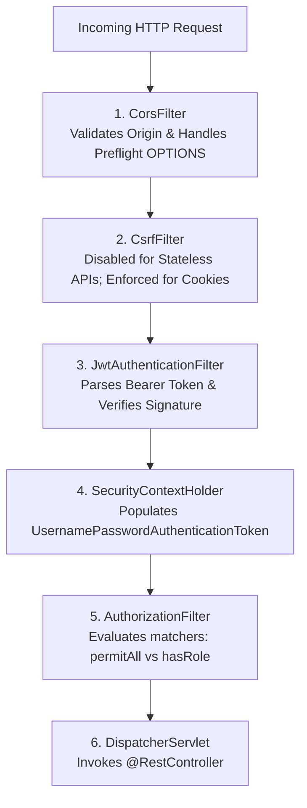

# Spring Security Production Guide

Spring Security protects backend applications at the outer perimeter before any controller logic executes.

In production systems, security is not just checking whether a user has logged in. A robust backend architecture enforces authentication, role-based authorization, granular resource ownership, strict CORS policies, and RFC 7807 error standardization.

---

## 1. Modern Spring Security 6 Architecture & Lambda DSL

Spring Boot 3 / Spring Security 6 completely retired legacy adapter classes (`WebSecurityConfigurerAdapter`). Configuration is now purely functional using component-based bean definitions and modern Lambda DSL.



### The Production SecurityConfig Bean

```java
package com.example.config;

import com.example.security.JwtAuthenticationFilter;
import org.springframework.context.annotation.Bean;
import org.springframework.context.annotation.Configuration;
import org.springframework.http.HttpMethod;
import org.springframework.security.config.annotation.method.configuration.EnableMethodSecurity;
import org.springframework.security.config.annotation.web.builders.HttpSecurity;
import org.springframework.security.config.annotation.web.configuration.EnableWebSecurity;
import org.springframework.security.config.annotation.web.configurers.AbstractHttpConfigurer;
import org.springframework.security.config.http.SessionCreationPolicy;
import org.springframework.security.web.AuthenticationEntryPoint;
import org.springframework.security.web.SecurityFilterChain;
import org.springframework.security.web.access.AccessDeniedHandler;
import org.springframework.security.web.authentication.UsernamePasswordAuthenticationFilter;
import org.springframework.web.cors.CorsConfigurationSource;

@Configuration
@EnableWebSecurity
@EnableMethodSecurity // Enables @PreAuthorize and @PostAuthorize
public class SecurityConfig {

    private final JwtAuthenticationFilter jwtFilter;
    private final AuthenticationEntryPoint authEntryPoint;
    private final AccessDeniedHandler accessDeniedHandler;
    private final CorsConfigurationSource corsConfigurationSource;

    public SecurityConfig(
        JwtAuthenticationFilter jwtFilter,
        AuthenticationEntryPoint authEntryPoint,
        AccessDeniedHandler accessDeniedHandler,
        CorsConfigurationSource corsConfigurationSource
    ) {
        this.jwtFilter = jwtFilter;
        this.authEntryPoint = authEntryPoint;
        this.accessDeniedHandler = accessDeniedHandler;
        this.corsConfigurationSource = corsConfigurationSource;
    }

    @Bean
    public SecurityFilterChain securityFilterChain(HttpSecurity http) throws Exception {
        return http
            .cors(cors -> cors.configurationSource(corsConfigurationSource))
            .csrf(AbstractHttpConfigurer::disable) // Safe for stateless JWT bearer tokens
            .sessionManagement(session -> 
                session.sessionCreationPolicy(SessionCreationPolicy.STATELESS)
            )
            .exceptionHandling(exceptions -> exceptions
                .authenticationEntryPoint(authEntryPoint) // 401 Handler
                .accessDeniedHandler(accessDeniedHandler)  // 403 Handler
            )
            .authorizeHttpRequests(auth -> auth
                // Public Endpoints
                .requestMatchers("/api/auth/**", "/api/public/**").permitAll()
                .requestMatchers(HttpMethod.GET, "/api/products/**").permitAll()
                .requestMatchers("/actuator/health", "/actuator/info").permitAll()
                
                // Role-Restricted Endpoints
                .requestMatchers("/api/admin/**").hasRole("ADMIN")
                
                // Everything else requires valid authentication
                .anyRequest().authenticated()
            )
            .addFilterBefore(jwtFilter, UsernamePasswordAuthenticationFilter.class)
            .build();
    }
}
```

---

## 2. Method-Level Security with SpEL (`@PreAuthorize`)

While URL pattern matching (`hasRole('ADMIN')`) handles broad routing boundaries, granular business authorization requires **Method Security** with Spring Expression Language (SpEL).

Enable method security with `@EnableMethodSecurity` on your configuration class.

### Enforcing Ownership at Method Invocation

```java
@Service
public class NoteService {

    private final NoteRepository noteRepository;

    public NoteService(NoteRepository noteRepository) {
        this.noteRepository = noteRepository;
    }

    // Only an ADMIN or the author of the note may delete it:
    @PreAuthorize("hasRole('ADMIN') or #authorId == authentication.principal.id")
    public void deleteNote(Long noteId, Long authorId) {
        noteRepository.deleteById(noteId);
    }

    // Dynamic checks using Spring Beans inside SpEL:
    @PreAuthorize("@securityService.canAccessProject(#projectId)")
    public ProjectDto getProject(Long projectId) {
        return projectService.load(projectId);
    }
}
```

---

## 3. Production CORS Configuration for Frontend SPAs

Cross-Origin Resource Sharing (CORS) is a browser security mechanism that blocks web applications running on one domain (e.g. `https://app.mydomain.com`) from calling APIs on another domain (e.g. `https://api.mydomain.com`) unless explicit headers are present.

### The Fatal CORS Trap
Setting `allowedOrigins("*")` while setting `allowCredentials(true)` causes modern browsers to immediately reject all requests.

### Production CORS Bean

```java
package com.example.config;

import org.springframework.context.annotation.Bean;
import org.springframework.context.annotation.Configuration;
import org.springframework.web.cors.CorsConfiguration;
import org.springframework.web.cors.CorsConfigurationSource;
import org.springframework.web.cors.UrlBasedCorsConfigurationSource;

import java.util.List;

@Configuration
public class CorsConfig {

    @Bean
    public CorsConfigurationSource corsConfigurationSource() {
        CorsConfiguration config = new CorsConfiguration();
        
        // Explicit allowed origins (Never use "*" in production!)
        config.setAllowedOrigins(List.of(
            "https://app.example.com",
            "https://admin.example.com",
            "http://localhost:3000" // Local frontend development
        ));
        
        config.setAllowedMethods(List.of("GET", "POST", "PUT", "PATCH", "DELETE", "OPTIONS"));
        config.setAllowedHeaders(List.of("Authorization", "Content-Type", "Idempotency-Key"));
        config.setExposedHeaders(List.of("Location", "X-Total-Count"));
        config.setAllowCredentials(true);
        config.setMaxAge(3600L); // Cache preflight response for 1 hour

        UrlBasedCorsConfigurationSource source = new UrlBasedCorsConfigurationSource();
        source.registerCorsConfiguration("/**", config);
        return source;
    }
}
```

---

## 4. Standardized Security Exceptions with RFC 7807

Because the Spring Security filter chain executes **before** the `DispatcherServlet`, exceptions thrown in filters (e.g. invalid JWT or forbidden role) never reach your `@RestControllerAdvice`.

If not customized, Spring returns default empty bodies or HTML error pages. Configure dedicated handlers to return standardized RFC 7807 `ProblemDetail` JSON.

### Custom 401 Unauthorized Handler

```java
package com.example.security;

import com.fasterxml.jackson.databind.ObjectMapper;
import jakarta.servlet.http.HttpServletRequest;
import jakarta.servlet.http.HttpServletResponse;
import org.springframework.http.HttpStatus;
import org.springframework.http.MediaType;
import org.springframework.http.ProblemDetail;
import org.springframework.security.core.AuthenticationException;
import org.springframework.security.web.AuthenticationEntryPoint;
import org.springframework.stereotype.Component;

import java.io.IOException;
import java.net.URI;
import java.time.Instant;

@Component
public class CustomAuthenticationEntryPoint implements AuthenticationEntryPoint {

    private final ObjectMapper objectMapper = new ObjectMapper();

    @Override
    public void commence(
        HttpServletRequest request,
        HttpServletResponse response,
        AuthenticationException authException
    ) throws IOException {
        ProblemDetail problem = ProblemDetail.forStatusAndDetail(
            HttpStatus.UNAUTHORIZED,
            "Authentication token is missing, invalid, or expired."
        );
        problem.setTitle("Unauthorized");
        problem.setType(URI.create("https://api.example.com/errors/unauthorized"));
        problem.setProperty("timestamp", Instant.now());
        problem.setProperty("path", request.getRequestURI());

        response.setStatus(HttpStatus.UNAUTHORIZED.value());
        response.setContentType(MediaType.APPLICATION_PROBLEM_JSON_VALUE);
        objectMapper.writeValue(response.getOutputStream(), problem);
    }
}
```

### Custom 403 Forbidden Handler

```java
package com.example.security;

import com.fasterxml.jackson.databind.ObjectMapper;
import jakarta.servlet.http.HttpServletRequest;
import jakarta.servlet.http.HttpServletResponse;
import org.springframework.http.HttpStatus;
import org.springframework.http.MediaType;
import org.springframework.http.ProblemDetail;
import org.springframework.security.access.AccessDeniedException;
import org.springframework.security.web.access.AccessDeniedHandler;
import org.springframework.stereotype.Component;

import java.io.IOException;
import java.net.URI;
import java.time.Instant;

@Component
public class CustomAccessDeniedHandler implements AccessDeniedHandler {

    private final ObjectMapper objectMapper = new ObjectMapper();

    @Override
    public void handle(
        HttpServletRequest request,
        HttpServletResponse response,
        AccessDeniedException accessDeniedException
    ) throws IOException {
        ProblemDetail problem = ProblemDetail.forStatusAndDetail(
            HttpStatus.FORBIDDEN,
            "You do not have the required role or permissions to access this resource."
        );
        problem.setTitle("Forbidden");
        problem.setType(URI.create("https://api.example.com/errors/forbidden"));
        problem.setProperty("timestamp", Instant.now());
        problem.setProperty("path", request.getRequestURI());

        response.setStatus(HttpStatus.FORBIDDEN.value());
        response.setContentType(MediaType.APPLICATION_PROBLEM_JSON_VALUE);
        objectMapper.writeValue(response.getOutputStream(), problem);
    }
}
```

---

## 5. Automated Security Testing

Test all authentication and authorization pathways with `@WebMvcTest` and `@WithMockUser`:

```java
@WebMvcTest(AdminController.class)
class AdminControllerSecurityTest {

    @Autowired
    private MockMvc mockMvc;

    @Test
    void shouldRejectAnonymousUserFromAdminApi() throws Exception {
        mockMvc.perform(get("/api/admin/metrics"))
            .andExpect(status().isUnauthorized())
            .andExpect(header().string("Content-Type", MediaType.APPLICATION_PROBLEM_JSON_VALUE));
    }

    @Test
    @WithMockUser(username = "bob", roles = {"USER"})
    void shouldRejectNormalUserFromAdminApiWithForbidden() throws Exception {
        mockMvc.perform(get("/api/admin/metrics"))
            .andExpect(status().isForbidden());
    }

    @Test
    @WithMockUser(username = "alice", roles = {"ADMIN"})
    void shouldAllowAdminUserToAccessAdminApi() throws Exception {
        mockMvc.perform(get("/api/admin/metrics"))
            .andExpect(status().isOk());
    }
}
```

---

## 6. Production Security Checklist

<Check>
`@EnableMethodSecurity` is enabled for fine-grained SpEL permission checks.
</Check>
<Check>
CORS is configured with an explicit whitelist of trusted production origins (no wildcards with credentials).
</Check>
<Check>
AuthenticationEntryPoint and AccessDeniedHandler return RFC 7807 `ProblemDetail` JSON.
</Check>
<Check>
Security filter chain runs `SessionCreationPolicy.STATELESS` for JWT APIs.
</Check>
<Check>
Automated MockMvc tests verify that 401 Unauthorized and 403 Forbidden trigger reliably.
</Check>
