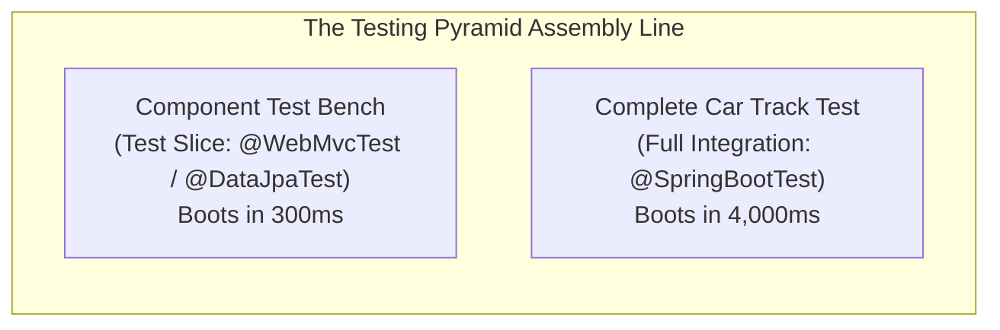
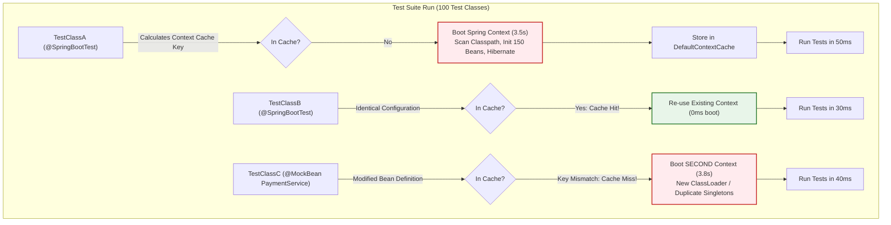
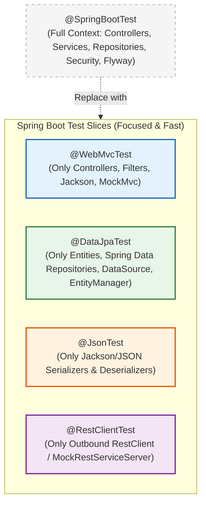
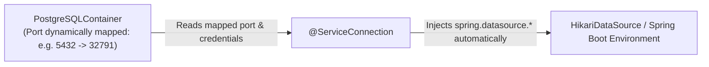

## 1. The Car Assembly Line Analogy (Why Test in Slices?)

Imagine you run an automobile factory building luxury cars.

If an engineer designs a new **brake pedal**, how do you verify that the brake pedal works?
- **The Slow, Dangerous Way**: You install the brake pedal into a fully built car, start the V8 engine, drive onto the highway at 90 mph, and slam on the pedal to see if you crash. That is expensive, slow, and dangerous.
- **The Fast, Intelligent Way**: You place the brake pedal onto a **test bench** in the workshop. You connect a robotic foot and verify that the hydraulic pressure sensor triggers properly in **2 seconds**.



In Spring Boot:
- **`@SpringBootTest` is the fully built car**. It boots the entire application: connects to PostgreSQL, runs Flyway migrations, scans 200 beans, and starts embedded Tomcat. Running 100 of these tests can take **25 minutes**.
- **Test Slices (`@WebMvcTest`, `@DataJpaTest`) are the test benches**. They tell Spring: *"Don't boot the whole factory! Just boot the web layer (or just the database layer), and run my test in 200 milliseconds!"*

---

## 2. Physical Mechanics: The Spring TestContext Framework & Caching

To write fast tests, you must understand what happens inside the JVM when you annotate a test class with `@SpringBootTest`.



### How the Context Cache Key is Calculated

When a test runs, Spring's `TestContextManager` calculates a **Context Cache Key** based on:
1. Locations of configuration classes (`@ContextConfiguration`, `@SpringBootApplication`).
2. Active profiles (`@ActiveProfiles("test")`).
3. Property source locations (`@TestPropertySource`).
4. Context customizers (e.g., dynamic properties, `@MockBean` / `@SpyBean` registrations).

If the key matches an entry in `org.springframework.test.context.cache.DefaultContextCache`, Spring reuses the running `ApplicationContext` in memory. If the key differs by even a single mocked bean, Spring is forced to **boot a completely new ApplicationContext from scratch**.

### The `@MockBean` Context Pollution Trap

<Warning>
**The Silent Build Killer**:
Indiscriminate use of `@MockBean` is the #1 cause of 30-minute CI build pipelines.
</Warning>

Consider a test suite with 50 test classes:
- If all 50 test classes share the exact same configuration, Spring boots **1** `ApplicationContext` once (taking ~3 seconds), and runs all 500 tests in 10 seconds. Total time: **13 seconds**.
- If 20 test classes introduce arbitrary `@MockBean` declarations on different services, Spring creates 21 distinct `ApplicationContext` instances. Each context boots Hibernate, Flyway, and connection pools. Total time: **21 × 4s = 84 seconds**, accompanied by massive JVM heap bloat and Metaspace memory leaks!

**The Solution**:
1. Group your mocks into shared abstract base test classes or test configurations.
2. Use **Test Slices** (`@WebMvcTest`, `@DataJpaTest`) instead of `@SpringBootTest` whenever you do not need the full application container.

---

## 3. The Spring Boot Test Slice Ecosystem

Spring Boot provides specialized slice annotations. Instead of loading all 200 beans, each slice boots a minimal, specialized `ApplicationContext` targeting only the components required for that architectural layer.



---

## 4. Web Layer Testing with `@WebMvcTest` & `MockMvc`

`@WebMvcTest` boots only the web infrastructure: `DispatcherServlet`, Jackson converters, validation, filters, and the specified controller. It does **not** boot your services, JPA entities, or database connections.

Requests are tested using `MockMvc`, which executes requests directly through the servlet pipeline without binding to a physical network socket.

```java
package com.backend.mastery.order;

import com.fasterxml.jackson.databind.ObjectMapper;
import org.junit.jupiter.api.DisplayName;
import org.junit.jupiter.api.Test;
import org.springframework.beans.factory.annotation.Autowired;
import org.springframework.boot.test.autoconfigure.web.servlet.WebMvcTest;
import org.springframework.boot.test.mock.mockito.MockBean;
import org.springframework.http.MediaType;
import org.springframework.test.web.servlet.MockMvc;

import java.math.BigDecimal;
import java.util.UUID;

import static org.mockito.ArgumentMatchers.any;
import static org.mockito.BDDMockito.given;
import static org.springframework.test.web.servlet.request.MockMvcRequestBuilders.post;
import static org.springframework.test.web.servlet.result.MockMvcResultMatchers.*;

@WebMvcTest(controllers = OrderController.class)
class OrderControllerTest {

    @Autowired
    private MockMvc mockMvc;

    @Autowired
    private ObjectMapper objectMapper;

    @MockBean
    private OrderProcessingService orderProcessingService;

    @Test
    @DisplayName("POST /api/orders with valid payload returns 201 Created")
    void createOrder_validPayload_returnsCreated() throws Exception {
        // Given
        CreateOrderRequest request = new CreateOrderRequest("SKU-994", 2, new BigDecimal("49.99"));
        OrderResponse response = new OrderResponse(UUID.randomUUID(), "SKU-994", 2, new BigDecimal("99.98"), "CONFIRMED");

        given(orderProcessingService.processOrder(any(CreateOrderRequest.class)))
                .willReturn(response);

        // When & Then
        mockMvc.perform(post("/api/orders")
                .contentType(MediaType.APPLICATION_JSON)
                .content(objectMapper.writeValueAsString(request)))
                .andExpect(status().isCreated())
                .andExpect(header().exists("Location"))
                .andExpect(jsonPath("$.orderId").value(response.orderId().toString()))
                .andExpect(jsonPath("$.status").value("CONFIRMED"))
                .andExpect(jsonPath("$.totalAmount").value(99.98));
    }

    @Test
    @DisplayName("POST /api/orders with negative quantity returns 400 Bad Request with ProblemDetail")
    void createOrder_invalidQuantity_returnsProblemDetail() throws Exception {
        // Given: Invalid payload violating Jakarta validation (@Min(1))
        CreateOrderRequest invalidRequest = new CreateOrderRequest("SKU-994", -5, new BigDecimal("49.99"));

        // When & Then
        mockMvc.perform(post("/api/orders")
                .contentType(MediaType.APPLICATION_JSON)
                .content(objectMapper.writeValueAsString(invalidRequest)))
                .andExpect(status().isBadRequest())
                .andExpect(jsonPath("$.title").value("Bad Request"))
                .andExpect(jsonPath("$.status").value(400))
                .andExpect(jsonPath("$.invalidParams[0].field").value("quantity"));
    }
}
```

### Why `@WebMvcTest` Is Superior to `@SpringBootTest(webEnvironment = RANDOM_PORT)`
- **Speed**: Boots in ~400ms vs. ~4,000ms.
- **Precision**: Validates routing, HTTP verbs, status codes, JSON serialization, and `@Valid` constraints without needing a database or real downstream dependencies.

---

## 5. Data Layer Testing with `@DataJpaTest`

`@DataJpaTest` configures only the JPA infrastructure: entities, Spring Data repositories, `TestEntityManager`, and a DataSource. By default, it wraps each test method in a transaction and rolls it back at the end.

### The Problem With In-Memory H2 in Production Repositories

Many tutorials use H2 for repository tests because it requires no Docker setup. **In production, this is dangerous**:
1. H2 does not support PostgreSQL-specific features like `JSONB`, `gen_random_uuid()`, `ILIKE`, or advisory locks.
2. H2 handles concurrency differently: it does not simulate PostgreSQL Multi-Version Concurrency Control (MVCC) or real row-level lock conflicts (`SELECT FOR UPDATE`).
3. You risk shipping queries that pass in test suites but fail in production with syntax errors.

To test real repository behavior, configure `@DataJpaTest` to run against **real PostgreSQL using Testcontainers**!

```java
package com.backend.mastery.order;

import org.junit.jupiter.api.DisplayName;
import org.junit.jupiter.api.Test;
import org.springframework.beans.factory.annotation.Autowired;
import org.springframework.boot.test.autoconfigure.jdbc.AutoConfigureTestDatabase;
import org.springframework.boot.test.autoconfigure.orm.jpa.DataJpaTest;
import org.springframework.boot.test.autoconfigure.orm.jpa.TestEntityManager;
import org.springframework.boot.testcontainers.service.connection.ServiceConnection;
import org.testcontainers.containers.PostgreSQLContainer;
import org.testcontainers.junit.jupiter.Container;
import org.testcontainers.junit.jupiter.Testcontainers;

import java.math.BigDecimal;
import java.util.Optional;

import static org.assertj.core.api.Assertions.assertThat;

@DataJpaTest
@AutoConfigureTestDatabase(replace = AutoConfigureTestDatabase.Replace.NONE) // Do NOT replace with H2!
@Testcontainers
class OrderRepositoryTest {

    // Spring Boot 3.1+ @ServiceConnection automatically injects datasource properties!
    @Container
    @ServiceConnection
    static PostgreSQLContainer<?> postgres = new PostgreSQLContainer<>("postgres:16-alpine");

    @Autowired
    private OrderRepository orderRepository;

    @Autowired
    private TestEntityManager entityManager;

    @Test
    @DisplayName("findByOrderNumber returns order when exists and flushes SQL correctly")
    void findByOrderNumber_existingOrder_returnsOrder() {
        // Given
        OrderEntity order = new OrderEntity("ORD-2026-001", new BigDecimal("150.00"), OrderStatus.PENDING);
        entityManager.persistAndFlush(order);
        entityManager.clear(); // Clear 1st-level cache to force real SQL SELECT from Postgres!

        // When
        Optional<OrderEntity> found = orderRepository.findByOrderNumber("ORD-2026-001");

        // Then
        assertThat(found).isPresent();
        assertThat(found.get().getOrderNumber()).isEqualTo("ORD-2026-001");
        assertThat(found.get().getTotalAmount()).isEqualByComparingTo("150.00");
    }
}
```

<Tip>
**The `entityManager.clear()` Golden Rule**:
Notice line 40: `entityManager.clear()`. 

If you persist an entity and immediately query it without clearing the persistence context, Hibernate returns the object straight from its **First-Level Cache (L1)** without ever generating a SQL `SELECT`! You aren't actually testing your database query! Always clear the cache before executing the repository method under test.
</Tip>

---

## 6. Modern Integration Testing: Spring Boot 3.1+ `@ServiceConnection`

Prior to Spring Boot 3.1, connecting Testcontainers required tedious, error-prone boilerplate with `@DynamicPropertySource`:

```java
// LEGACY BOILERPLATE (Spring Boot 2.x - 3.0):
@DynamicPropertySource
static void registerPgProperties(DynamicPropertyRegistry registry) {
    registry.add("spring.datasource.url", postgres::getJdbcUrl);
    registry.add("spring.datasource.username", postgres::getUsername);
    registry.add("spring.datasource.password", postgres::getPassword);
}
```

If you tested 4 containers (Postgres, Redis, Kafka, RabbitMQ), you had to write 15 lines of string-based property bindings for every test.

### The Modern Way: `@ServiceConnection`

In Spring Boot 3.1+, Spring automatically discovers container types and configures connection properties without writing a single line of property mapping:



### Full End-to-End Integration Test Example

Here is a full integration test executing real HTTP requests against a running Spring container backed by a real PostgreSQL container:

```java
package com.backend.mastery.integration;

import com.backend.mastery.order.CreateOrderRequest;
import com.backend.mastery.order.OrderEntity;
import com.backend.mastery.order.OrderRepository;
import org.junit.jupiter.api.BeforeEach;
import org.junit.jupiter.api.DisplayName;
import org.junit.jupiter.api.Test;
import org.springframework.beans.factory.annotation.Autowired;
import org.springframework.boot.test.context.SpringBootTest;
import org.springframework.boot.test.web.client.TestRestTemplate;
import org.springframework.boot.testcontainers.service.connection.ServiceConnection;
import org.springframework.http.HttpStatus;
import org.springframework.http.ResponseEntity;
import org.testcontainers.containers.PostgreSQLContainer;
import org.testcontainers.junit.jupiter.Container;
import org.testcontainers.junit.jupiter.Testcontainers;

import java.math.BigDecimal;

import static org.assertj.core.api.Assertions.assertThat;

@SpringBootTest(webEnvironment = SpringBootTest.WebEnvironment.RANDOM_PORT)
@Testcontainers
class OrderFullIntegrationTest {

    @Container
    @ServiceConnection
    static PostgreSQLContainer<?> postgres = new PostgreSQLContainer<>("postgres:16-alpine");

    @Autowired
    private TestRestTemplate restTemplate;

    @Autowired
    private OrderRepository orderRepository;

    @BeforeEach
    void setUp() {
        orderRepository.deleteAll();
    }

    @Test
    @DisplayName("Complete checkout flow: HTTP POST -> Service -> Postgres -> 201 Created")
    void fullOrderLifecycle_persistsToRealPostgres() {
        // Given
        CreateOrderRequest request = new CreateOrderRequest("LAPTOP-PRO-16", 1, new BigDecimal("2499.00"));

        // When: Execute real HTTP request over loopback interface
        ResponseEntity<Void> response = restTemplate.postForEntity("/api/orders", request, Void.class);

        // Then: Verify HTTP status
        assertThat(response.getStatusCode()).isEqualTo(HttpStatus.CREATED);

        // And: Verify data was physically written to PostgreSQL container
        var savedOrders = orderRepository.findAll();
        assertThat(savedOrders).hasSize(1);
        OrderEntity order = savedOrders.get(0);
        assertThat(order.getProductSku()).isEqualTo("LAPTOP-PRO-16");
        assertThat(order.getTotalAmount()).isEqualByComparingTo("2499.00");
    }
}
```

---

## 7. The Shared Container Pattern (Lightning-Fast CI)

Starting a Docker container takes ~1–3 seconds. If you have 50 integration test classes, starting and stopping containers per test class takes **50 × 2s = 100 seconds**.

To run your entire integration suite in seconds, use the **Singleton Container Pattern**:

```java
package com.backend.mastery.support;

import org.springframework.boot.test.context.SpringBootTest;
import org.springframework.boot.testcontainers.service.connection.ServiceConnection;
import org.testcontainers.containers.PostgreSQLContainer;

/**
 * Shared base class for all integration tests.
 * The static container starts ONCE before the test suite begins and terminates
 * automatically when the JVM shuts down via Ryuk.
 */
@SpringBootTest(webEnvironment = SpringBootTest.WebEnvironment.RANDOM_PORT)
public abstract class AbstractIntegrationTest {

    @ServiceConnection
    protected static final PostgreSQLContainer<?> POSTGRES_CONTAINER;

    static {
        POSTGRES_CONTAINER = new PostgreSQLContainer<>("postgres:16-alpine")
                .withReuse(true); // Optional: Reuses container across local IDE test runs!
        POSTGRES_CONTAINER.start();
    }
}
```

Now, every test class that extends `AbstractIntegrationTest` shares the exact same running container instance. Spring boots the context once, connects to the existing container, and runs all integration tests at full speed!

---

## 8. Testing Outbound APIs with `@RestClientTest`

Microservices constantly call other microservices. You should never make real HTTP calls to third-party endpoints in your unit/slice tests.

`@RestClientTest` configures only the outbound HTTP client (such as `RestClient` or `RestTemplate`) and attaches `MockRestServiceServer` to simulate remote responses and test network failure handling:

```java
package com.backend.mastery.client;

import org.junit.jupiter.api.DisplayName;
import org.junit.jupiter.api.Test;
import org.springframework.beans.factory.annotation.Autowired;
import org.springframework.boot.test.autoconfigure.web.client.RestClientTest;
import org.springframework.http.HttpMethod;
import org.springframework.http.MediaType;
import org.springframework.test.web.client.MockRestServiceServer;

import static org.assertj.core.api.Assertions.assertThat;
import static org.assertj.core.api.Assertions.assertThatThrownBy;
import static org.springframework.test.web.client.match.MockRestRequestMatchers.method;
import static org.springframework.test.web.client.match.MockRestRequestMatchers.requestTo;
import static org.springframework.test.web.client.response.MockRestResponseCreators.*;

@RestClientTest(PaymentGatewayClient.class)
class PaymentGatewayClientTest {

    @Autowired
    private PaymentGatewayClient paymentClient;

    @Autowired
    private MockRestServiceServer server;

    @Test
    @DisplayName("chargePayment succeeds when external provider returns 200 OK")
    void chargePayment_success_returnsTransactionId() {
        // Given
        server.expect(requestTo("https://api.payments.com/v1/charge"))
                .andExpect(method(HttpMethod.POST))
                .andRespond(withSuccess("""
                        {"transactionId": "txn_884920", "status": "APPROVED"}
                        """, MediaType.APPLICATION_JSON));

        // When
        PaymentResult result = paymentClient.charge("card_token_123", 5000);

        // Then
        assertThat(result.transactionId()).isEqualTo("txn_884920");
        assertThat(result.isApproved()).isTrue();
        server.verify(); // Verifies that all expected HTTP requests were made exactly as configured!
    }

    @Test
    @DisplayName("chargePayment handles 500 Internal Server Error by throwing custom exception")
    void chargePayment_serverError_throwsPaymentException() {
        // Given
        server.expect(requestTo("https://api.payments.com/v1/charge"))
                .andExpect(method(HttpMethod.POST))
                .andRespond(withServerError());

        // When & Then
        assertThatThrownBy(() -> paymentClient.charge("card_token_123", 5000))
                .isInstanceOf(PaymentGatewayUnavailableException.class);

        server.verify();
    }
}
```

---

## 9. Active Recall & Interview Drills

<CardGroup cols={2}>
  <Card title="1. Context Caching Mechanics" icon="question">
    How does the Spring TestContext Framework decide whether to reuse an existing `ApplicationContext` or boot a new one?
  </Card>
  <Card title="2. The @MockBean Danger" icon="question">
    Why does adding `@MockBean` inside a specific test class prevent Spring from reusing the cached `ApplicationContext` from other tests?
  </Card>
  <Card title="3. @WebMvcTest vs @SpringBootTest" icon="question">
    What components are loaded by `@WebMvcTest`, and why does it not require an open TCP port on the operating system?
  </Card>
  <Card title="4. TestEntityManager & L1 Cache" icon="question">
    Why must you invoke `entityManager.clear()` after `persistAndFlush()` when testing custom Spring Data repository query methods?
  </Card>
  <Card title="5. Modern @ServiceConnection" icon="question">
    What boilerplate does Spring Boot 3.1+ `@ServiceConnection` eliminate compared to the legacy `@DynamicPropertySource` approach?
  </Card>
  <Card title="6. Shared Testcontainer Pattern" icon="question">
    How do you prevent Testcontainers from starting and stopping a separate Docker container for every single integration test class?
  </Card>
  <Card title="7. Outbound Testing" icon="question">
    Which test slice annotation and mock server are used to test outbound `RestClient` and `RestTemplate` calls?
  </Card>
  <Card title="8. In-Memory Database Flaws" icon="question">
    Why is using H2 for repository tests considered an anti-pattern in production PostgreSQL backend engineering?
  </Card>
</CardGroup>

---

## 10. Done Checklist

<Check>
- [ ] Understand how the Spring TestContext Framework computes context cache keys.
- [ ] Eliminated redundant `@MockBean` definitions across test classes to prevent context pollution and slow CI runs.
- [ ] Implemented fast web layer testing using `@WebMvcTest` and `MockMvc` for route and validation assertions.
- [ ] Validated RFC 9457 `ProblemDetail` error responses with MockMvc for bad input payloads.
- [ ] Tested Spring Data repositories using `@DataJpaTest` with `replace = AutoConfigureTestDatabase.Replace.NONE`.
- [ ] Cleared the JPA First-Level Cache (`entityManager.clear()`) to guarantee SQL generation against real databases.
- [ ] Configured Testcontainers with PostgreSQL instead of H2 to catch real dialect and concurrency bugs.
- [ ] Upgraded test configuration to Spring Boot 3.1+ `@ServiceConnection` to eliminate manual `@DynamicPropertySource` code.
- [ ] Implemented the Singleton Container pattern (`AbstractIntegrationTest`) to share container instances across the suite.
- [ ] Verified complete end-to-end user workflows using `@SpringBootTest(webEnvironment = RANDOM_PORT)` and `TestRestTemplate`.
- [ ] Isolated outbound external HTTP calls with `@RestClientTest` and `MockRestServiceServer`.
- [ ] Verified error status handling (e.g. 500 Internal Server Error) from downstream services using mock servers.
- [ ] Replaced brittle `Instant.now()` time dependencies with an injectable `java.time.Clock` bean for deterministic tests.
- [ ] Verified that tests execute independently and can run cleanly in any order.
- [ ] Confirmed that all integration tests pass cleanly in local development and CI container environments.
</Check>
