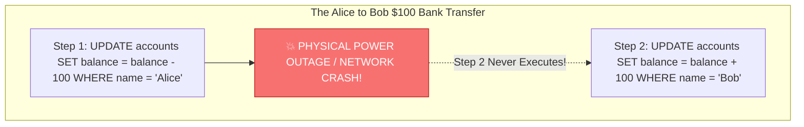
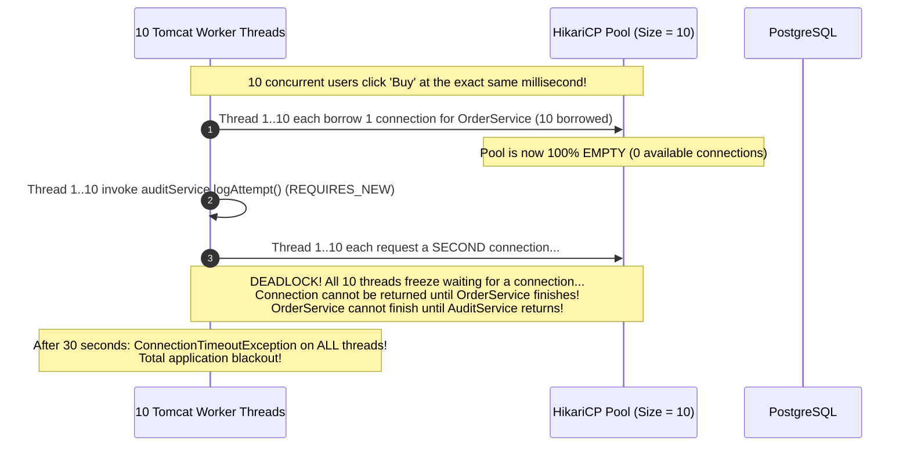
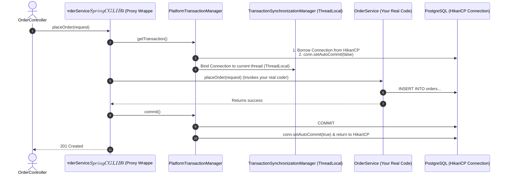
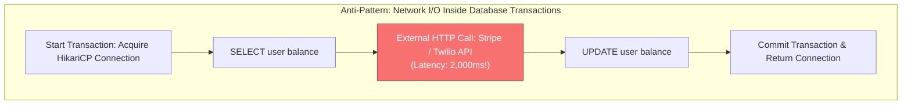
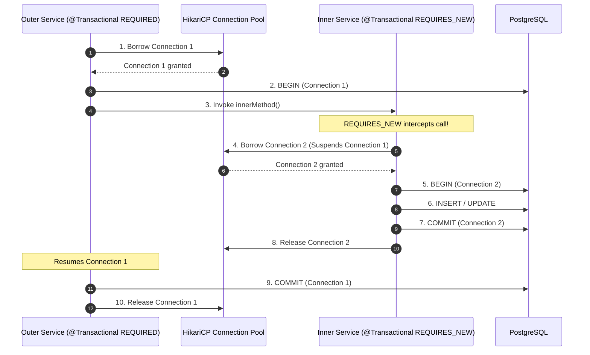

## Prerequisites: Before You Begin

Before diving into transaction boundaries, ensure you understand:
- Relational database ACID guarantees (Atomicity, Consistency, Isolation, Durability).
- Spring IoC Container and Dependency Injection basics.
- JDBC connection pools (HikariCP) and thread-to-connection binding.

---

# Phase 1: Ground Floor (Physical First Principles)

To understand why transactions exist, you must look at what physically happens inside computer hardware when data is written to a database.



### 1. The Disastrous Physical Reality
Imagine your Java application executes two SQL statements to transfer \$100 from Alice to Bob:
1. `UPDATE accounts SET balance = balance - 100 WHERE id = 1;` (Alice's balance drops from \$500 to \$400).
2. `UPDATE accounts SET balance = balance + 100 WHERE id = 2;` (Bob's balance rises from \$200 to \$300).

What happens if the operating system crashes, the server loses physical power, or the database process gets killed **after Step 1, but before Step 2**?
- \$100 was removed from Alice's account.
- \$100 was never added to Bob's account.
- **\$100 has physically vanished into thin air.**

This is data corruption. In financial, e-commerce, and enterprise systems, partial execution is completely unacceptable.

### 2. How the Database Engine Solves This (The Write-Ahead Log)
A relational database like PostgreSQL does **not** write changes directly to the permanent table data files on disk during a transaction.

Instead, it uses a mechanism called the **Write-Ahead Log (WAL)**:
- Every insert, update, and delete is written sequentially to an append-only log file on disk.
- When you execute Step 1, Postgres appends a log entry to the WAL.
- When you execute Step 2, Postgres appends another log entry to the WAL.
- When your Java application issues a `COMMIT` command, PostgreSQL writes a single physical `COMMIT` record to the WAL and flushes it to disk (`fsync`).
- **Crash Recovery**: If power fails before the `COMMIT` record is written, PostgreSQL reboots, scans the WAL, sees uncommitted changes from Step 1, and **rolls them back automatically**.

A database transaction is a contract that tells PostgreSQL: *"Do all of these operations together, or act as if none of them ever happened."*

---

# Phase 2: The Naive Code (The Production Crash)

When a new Java developer uses Spring's `@Transactional` annotation without understanding its internal mechanics, they instinctively trigger three catastrophic production failures.

### Catastrophe 1: The "Catch-and-Swallow" Silent Commit

A developer writes an order checkout method. They want to charge the customer's card and catch any payment error:

```java
// NAIVE CODE: SILENTLY COMMITS UNPAID ORDERS TO THE DATABASE!
@Service
public class CheckoutService {

    @Autowired
    private OrderRepository orderRepository;
    @Autowired
    private PaymentClient paymentClient;

    @Transactional
    public void checkout(OrderRequest request) {
        // Step 1: Save the order to PostgreSQL
        Order order = new Order(request);
        orderRepository.save(order);

        // Step 2: Charge the card
        try {
            paymentClient.charge(request.creditCardToken(), request.amount());
        } catch (Exception e) {
            // FATAL BEGINNER MISTAKE: Catching and swallowing the exception!
            log.error("Payment failed for customer!", e);
        }
    }
}
```

#### Why Production Catastrophically Fails:
Spring's transaction interceptor sits **outside** your service method. It only triggers a rollback if an unhandled exception bubbles up out of the method. 

Because the developer caught and swallowed the `Exception`, the method finishes normally. Spring assumes everything succeeded and sends a **`COMMIT` command to PostgreSQL**. The customer was never charged, but the unpaid order is permanently committed to your database!

#### Production Fix: Let Failure Escape Or Mark Rollback Explicitly

```java
@Transactional
public void checkout(OrderRequest request) {
    Order order = new Order(request);
    orderRepository.save(order);

    try {
        paymentClient.charge(request.creditCardToken(), request.amount());
    } catch (PaymentDeclinedException ex) {
        throw ex;
    } catch (Exception ex) {
        throw new PaymentProcessingException("Payment provider failed", ex);
    }
}
```

Line by line:

- `@Transactional` opens a database transaction through a Spring proxy.
- `orderRepository.save(order)` writes inside that transaction.
- `paymentClient.charge(...)` can fail for business or network reasons.
- `catch (PaymentDeclinedException ex) { throw ex; }` lets a domain runtime exception escape so Spring rolls back.
- `throw new PaymentProcessingException(...)` wraps unknown provider failures in an unchecked exception.
- Because an unchecked exception leaves the method, Spring calls rollback instead of commit.

Proof test:

```console
Mock paymentClient.charge to throw.
Call checkout.
Assert the exception escapes.
Assert no order row exists after the method returns.
```

Production caveat: charging an external card inside a database transaction can hold the DB connection while the network call waits. Real payment flows often reserve/create pending state, call the provider outside the short transaction, then finalize with idempotency and reconciliation.

---

### Catastrophe 2: The Checked Exception Trap

The developer realizes they should throw an exception instead of swallowing it:

```java
// NAIVE CODE: STILL SILENTLY COMMITS CORRUPTED STATE!
@Service
public class AccountService {

    @Autowired
    private AccountRepository accountRepository;

    @Transactional
    public void debitAccount(Long accountId, BigDecimal amount) throws InsufficientFundsException {
        Account account = accountRepository.findById(accountId).orElseThrow();
        account.withdraw(amount);
        accountRepository.save(account);

        if (account.getBalance().compareTo(BigDecimal.ZERO) < 0) {
            // InsufficientFundsException extends java.lang.Exception (Checked Exception)
            throw new InsufficientFundsException("Account overdrawn!");
        }
    }
}
```

#### Why Production Commits Corrupted State:
By default, following the 1999 EJB standard, Spring **only rolls back on unchecked exceptions** (`RuntimeException` and `Error`). 

If your method throws a checked `Exception` (like `IOException`, `SQLException`, or a custom `Exception`), Spring **ignores it and commits the transaction anyway**! The customer's balance drops into negative numbers and commits to PostgreSQL.

---

### Catastrophe 3: The `REQUIRES_NEW` Connection Pool Deadlock

A developer wants to log every checkout attempt to an `audit_logs` table, even if the main checkout transaction fails. They use `Propagation.REQUIRES_NEW`:

```java
@Service
public class OrderService {
    @Autowired private AuditService auditService;
    @Autowired private OrderRepository orderRepository;

    @Transactional
    public void processOrder(OrderRequest req) {
        orderRepository.save(new Order(req)); // Holds Connection 1 from HikariCP
        auditService.logAttempt(req);         // Requests Connection 2 from HikariCP!
    }
}

@Service
public class AuditService {
    @Transactional(propagation = Propagation.REQUIRES_NEW)
    public void logAttempt(OrderRequest req) {
        // Must borrow an independent connection from HikariCP
    }
}
```



#### The Mathematical Pool Starvation Formula:
To safely run $N$ nested levels of `REQUIRES_NEW`, your connection pool size must satisfy:

$$\text{HikariCP Maximum Pool Size} > \text{Max Concurrent Threads} \times (N + 1)$$

With 200 Tomcat worker threads, safely nesting one `REQUIRES_NEW` call requires over $200 \times 2 = \mathbf{400 \text{ database connections}}$, which will crash PostgreSQL with excessive backend worker memory consumption.

---

# Phase 3: Under the Hood (Mechanics & Bytecode)

To understand why transactions succeed or fail, you must see the bytecode Spring creates at runtime.

## 1. Demystifying the Magic: The CGLIB Dynamic Proxy

`@Transactional` is not magic built into Java. It is implemented via **Spring Aspect-Oriented Programming (AOP)** using **CGLIB dynamic class subclassing**.

When your Spring Boot application starts up, Spring inspects your beans. When it sees `@Transactional` on `OrderService`, Spring does **not** register your raw class. Instead, it generates an enhanced subclass at runtime:

```java
// What Spring generates in bytecode behind the scenes:
public class OrderService$$SpringCGLIB$$0 extends OrderService {

    private final PlatformTransactionManager transactionManager;
    private final OrderService target; // Your real code!

    @Override
    public void placeOrder(OrderRequest request) {
        // 1. Borrow a connection from HikariCP & begin transaction
        TransactionStatus status = transactionManager.getTransaction(new DefaultTransactionDefinition());
        try {
            // 2. Delegate to your REAL Java method:
            target.placeOrder(request);

            // 3. If no unhandled exception occurred, COMMIT:
            transactionManager.commit(status);
        } catch (Throwable ex) {
            // 4. Inspect rollback rules:
            if (isRollbackOn(ex)) {
                transactionManager.rollback(status);
            } else {
                transactionManager.commit(status); // Silently commits if checked exception!
            }
            throw ex;
        }
    }
}
```



---

## 2. The Fatal Self-Invocation Trap

Why does calling a `@Transactional` method from within the same class fail?

```java
@Service
public class OrderService {

    public void processOrder(OrderRequest request) {
        // FATAL BUG: Calling annotated method internally via 'this'!
        this.saveOrderInTransaction(request);
    }

    @Transactional
    public void saveOrderInTransaction(OrderRequest request) {
        orderRepository.save(new Order(request));
    }
}
```

### Physical Memory Explanation:
- When an external controller injects `OrderService`, Spring gives it a memory pointer to the **CGLIB Proxy** (`0xProxyAddress`).
- When the controller calls `orderService.processOrder()`, the call hits `0xProxyAddress`.
- Inside `processOrder()`, calling `saveOrderInTransaction()` compiles to **`this.saveOrderInTransaction()`**.
- In JVM memory, the `this` pointer resolves to the **real target object (`0xTargetAddress`)**, completely bypassing the CGLIB proxy wrapper!
- Because the proxy is bypassed, `transactionManager.getTransaction()` is **never called**. No transaction starts, and no rollback occurs on errors.

### The Three Production Solutions:

<Tabs>
  <Tab title="Solution 1: Separate Collaborator Bean (Recommended)">
    Extract the transaction into a dedicated service so calls pass through Spring's proxy:
    ```java
    @Service
    public class OrderWorkflowService {
        private final OrderTransactionService txService;

        public OrderWorkflowService(OrderTransactionService txService) {
            this.txService = txService;
        }

        public void processOrder(OrderRequest request) {
            // Passes through the CGLIB proxy! Transaction starts properly.
            txService.saveOrderInTransaction(request);
        }
    }

    @Service
    public class OrderTransactionService {
        private final OrderRepository orderRepository;

        public OrderTransactionService(OrderRepository orderRepository) {
            this.orderRepository = orderRepository;
        }

        @Transactional
        public void saveOrderInTransaction(OrderRequest request) {
            orderRepository.save(new Order(request));
        }
    }
    ```
  </Tab>

  <Tab title="Solution 2: Programmatic TransactionTemplate">
    Bypasses proxies entirely using Spring's programmatic `TransactionTemplate`:
    ```java
    @Service
    public class OrderService {
        private final TransactionTemplate transactionTemplate;
        private final OrderRepository orderRepository;

        public OrderService(TransactionTemplate transactionTemplate, OrderRepository orderRepository) {
            this.transactionTemplate = transactionTemplate;
            this.orderRepository = orderRepository;
        }

        public void processOrder(OrderRequest request) {
            transactionTemplate.execute(status -> {
                orderRepository.save(new Order(request));
                return null;
            });
        }
    }
    ```
  </Tab>

  <Tab title="Solution 3: Self-Injection with @Lazy">
    Inject the proxy into itself (clean workaround if refactoring is not immediately possible):
    ```java
    @Service
    public class OrderService {
        @Autowired
        @Lazy
        private OrderService self;

        public void processOrder(OrderRequest request) {
            // Invokes method through the proxy wrapper!
            self.saveOrderInTransaction(request);
        }

        @Transactional
        public void saveOrderInTransaction(OrderRequest request) {
            orderRepository.save(new Order(request));
        }
    }
    ```
  </Tab>
</Tabs>

---

## 3. The Golden Rule: Never Hold Connections During HTTP Calls

Database connections are scarce. HikariCP pools typically hold only 10 to 30 connections for an entire service.



If Stripe takes 2,000ms to process a payment, your database connection sits completely idle on the network for 2 seconds. **Just 15 concurrent checkouts will exhaust your entire connection pool!**

### Production Refactoring: Isolating Network I/O
```java
@Service
public class CheckoutService {

    private final TransactionTemplate transactionTemplate;
    private final OrderRepository orderRepository;
    private final PaymentClient paymentClient;

    public CheckoutService(TransactionTemplate transactionTemplate, 
                           OrderRepository orderRepository, 
                           PaymentClient paymentClient) {
        this.transactionTemplate = transactionTemplate;
        this.orderRepository = orderRepository;
        this.paymentClient = paymentClient;
    }

    public OrderResponse checkout(CheckoutRequest request) {
        // Step 1: Short DB Transaction (2ms) - Borrow connection, create PENDING order, release connection!
        Order order = transactionTemplate.execute(status -> 
            orderRepository.save(new Order(request, OrderStatus.PENDING))
        );

        // Step 2: Remote HTTP Call (2,000ms) - ZERO database connections held!
        PaymentResult result = paymentClient.charge(request.paymentToken());

        // Step 3: Short DB Transaction (2ms) - Borrow connection, update status, release connection!
        return transactionTemplate.execute(status -> {
            Order managedOrder = orderRepository.findById(order.getId()).orElseThrow();
            if (result.isSuccess()) {
                managedOrder.markPaid(result.transactionId());
            } else {
                managedOrder.markFailed(result.error());
            }
            return OrderResponse.from(managedOrder);
        });
    }
}
```

---

## 4. Transaction Propagation Behaviors Deep Dive

When Transactional Method A calls Transactional Method B, Spring determines whether to join the existing transaction, suspend it, or abort using **Propagation Behaviors**:

| Propagation | Existing Transaction Behavior | No Transaction Behavior | Physical Database Connection Impact |
| :--- | :--- | :--- | :--- |
| **`REQUIRED`** (Default) | Joins existing transaction. | Creates a new transaction. | Shares the same physical JDBC connection. |
| **`REQUIRES_NEW`** | **Suspends** existing transaction; creates a brand new transaction. | Creates a new transaction. | **Borrows a second physical connection** from HikariCP! |
| **`NESTED`** | Creates a JDBC **Savepoint** within the existing transaction. | Creates a new transaction. | Shares the same physical connection (Savepoint rollback). |
| **`MANDATORY`** | Joins existing transaction. | **Throws exception** (`IllegalTransactionStateException`). | Requires caller to provide active connection. |
| **`SUPPORTS`** | Joins existing transaction. | Runs non-transactionally without a transaction. | May or may not use a transaction. |
| **`NOT_SUPPORTED`** | **Suspends** existing transaction; runs non-transactionally. | Runs non-transactionally. | Suspends connection binding during execution. |
| **`NEVER`** | **Throws exception** if an active transaction exists. | Runs non-transactionally. | Prohibits active transactions. |



<Warning>
**The Connection Pool Starvation Hazard**:
If 20 concurrent HTTP requests execute `REQUIRED` and borrow 20 connections from a 20-connection pool, every thread then hits `REQUIRES_NEW`. Each thread requests a second connection. Because the pool is empty, all 20 threads block forever waiting for each other to finish. The service **deadlocks completely** until HikariCP throws a connection timeout exception!
</Warning>

---

## 5. Under the Hood: `@Transactional(readOnly = true)`

Beginners assume `readOnly = true` is just documentation. In production, it provides critical runtime optimizations:

```java
@Transactional(readOnly = true)
public List<OrderSummary> fetchRecentOrders(Long customerId) {
    return orderRepository.findAllByCustomerId(customerId);
}
```

### Physical Runtime Optimizations

1. **Hibernate `FlushMode.MANUAL`**: Hibernate knows the transaction cannot mutate data. It completely **skips generating dirty-checking snapshots** in heap memory when loading entities, saving up to 50% CPU and memory allocations on large query results!
2. **Database Engine Hints**: Sets `connection.setReadOnly(true)` on the physical JDBC connection. In PostgreSQL, this allows the query engine to bypass transaction ID ($XID$) assignment, saving $XID$ consumption.
3. **Read-Replica Dynamic Routing**: In cloud environments (AWS Aurora, Google Cloud SQL), a Spring `AbstractRoutingDataSource` inspects `TransactionSynchronizationManager.isCurrentTransactionReadOnly()`. If `true`, it routes the JDBC connection to a **Read Replica**, completely offloading read traffic from the Primary master database!

---

# Phase 4: Senior Interview Ace & Verification

## The Senior Engineer vs Junior Engineer Mindset

| Scenario | Junior Engineer Answer | Staff / Senior Engineer Answer |
| :--- | :--- | :--- |
| **How does `@Transactional` work, and why does calling it internally fail?** | "Spring has a bug where `@Transactional` doesn't work if called inside the same class." | "Spring implements `@Transactional` using CGLIB dynamic proxies. The proxy intercepts external calls, starts a transaction via `PlatformTransactionManager`, and binds the JDBC connection to the thread. Internal calls (`this.method()`) execute directly via Java's `this` pointer in memory, completely bypassing the proxy wrapper. We resolve this by moving the method to a collaborator bean or using `TransactionTemplate`." |
| **What exceptions trigger a rollback by default in Spring?** | "Any exception thrown will roll back the transaction." | "By default, Spring rolls back strictly for unchecked exceptions (`RuntimeException` and `Error`). If a checked `Exception` (like `IOException`) is thrown, Spring considers it expected and commits! In production, we always enforce `@Transactional(rollbackFor = Exception.class)` to ensure checked exceptions trigger a full rollback." |
| **What is `REQUIRES_NEW`, and why is it dangerous in high-traffic APIs?** | "It just starts a new transaction." | "`REQUIRES_NEW` suspends the active transaction and borrows an independent, second physical JDBC connection from HikariCP. Under high traffic, if all connections are borrowed by outer methods, every worker thread deadlocks waiting for a second connection from an empty pool. We avoid `REQUIRES_NEW` in web threads, decoupling secondary writes using asynchronous events or Kafka." |

---

## Active Recall & Interview Mastery

<AccordionGroup>
  <Accordion title="1. Explain the exact mechanism by which Spring binds database transactions to the current thread.">
    Spring uses `TransactionSynchronizationManager`, which internally maintains `ThreadLocal<Map<Object, Object>>` resources. When a transaction begins, `PlatformTransactionManager` obtains a physical JDBC `Connection` from the `DataSource` / HikariCP pool and binds it to the current thread's `ThreadLocal` storage. Any Spring Data repository or `JdbcTemplate` executing on that thread retrieves that exact connection instance. When the method completes, the interceptor unbinds the connection and returns it to the pool in a `finally` block.
  </Accordion>

  <Accordion title="2. Why does holding a database connection during an external HTTP call cause thread and pool starvation?">
    HikariCP connection pools typically contain only 10 to 30 connections. If a method annotated with `@Transactional` calls an external payment gateway (like Stripe) that experiences a 2-second network latency spike, that physical database connection sits completely idle on the socket for 2,000ms. Just 15 concurrent users will exhaust the entire database connection pool, causing all other unrelated database operations across the entire application to stall and time out.
  </Accordion>

  <Accordion title="3. What is the difference between REQUIRED and NESTED propagation?">
    `REQUIRED` joins the existing transaction; if the inner method fails, the entire transaction is marked `rollbackOnly`, meaning the outer method cannot catch the exception and commit its own work. `NESTED` uses JDBC Savepoints (`connection.setSavepoint()`) on the same physical connection. If the inner method fails, only the inner savepoint is rolled back, allowing the outer transaction to catch the error and continue to commit other work.
  </Accordion>

  <Accordion title="4. How does TransactionTemplate provide superior safety over @Transactional?">
    `TransactionTemplate` is programmatic and does not rely on dynamic AOP proxies, making it completely immune to the self-invocation trap. Furthermore, it allows developers to keep transaction boundaries as small as possible: acquiring a connection for 2ms to query or write data, releasing the connection before executing slow network I/O, and acquiring a connection again for final state persistence.
  </Accordion>

  <Accordion title="5. What happens when an exception is caught and swallowed inside a @Transactional method?">
    If an exception is caught inside a `@Transactional` method and not re-thrown, Spring's transaction interceptor never detects the failure. Because the method returns normally, Spring assumes everything succeeded and issues an SQL `COMMIT` to PostgreSQL, permanently persisting partial or corrupt data. If you catch an exception, you must either re-throw it or explicitly call `TransactionAspectSupport.currentTransactionStatus().setRollbackOnly()`.
  </Accordion>

  <Accordion title="6. What is the 'UnexpectedRollbackException: Transaction silently rolled back because it has been marked as rollback-only' error?">
    This occurs when an inner method with `Propagation.REQUIRED` throws an exception, marking the shared transaction as `rollbackOnly`. If the outer caller catches the exception with `try-catch` and attempts to proceed with a `COMMIT`, Spring detects the conflict (`rollbackOnly` is set, but caller requested commit) and aborts, throwing `UnexpectedRollbackException` to protect data consistency.
  </Accordion>

  <Accordion title="7. How does @Transactional(readOnly = true) optimize performance under Hibernate?">
    When `readOnly = true` is configured, Hibernate switches its flush mode to `FlushMode.MANUAL`. During entity loading, Hibernate skips allocating snapshot copies of entity state in heap memory. During commit, it bypasses the dirty-checking loop that compares loaded snapshots against current entity fields, saving substantial CPU cycles and reducing garbage collection pressure on large read workloads.
  </Accordion>

  <Accordion title="8. How does Spring Boot coordinate transactions across multiple data sources?">
    Spring Boot cannot coordinate transactions across two independent databases using standard JDBC because each `DataSource` has its own `PlatformTransactionManager`. To coordinate atomicity across multiple databases or between a database and JMS/Kafka, you must either use Two-Phase Commit (2PC) via JTA (Java Transaction API) with an XA transaction manager like Narayana or Atomikos, or employ the Saga Pattern / Transactional Outbox pattern.
  </Accordion>
</AccordionGroup>

---

## Done Checklist

<Check>
- [ ] Understand the role of database Write-Ahead Logs (WAL) in providing crash recovery and atomicity.
- [ ] Diagram how Spring CGLIB dynamic proxies wrap service methods with `PlatformTransactionManager`.
- [ ] Explain why internal self-invocation (`this.method()`) completely bypasses Spring's transaction interceptor.
- [ ] Refactor self-invocation bugs using collaborator beans or programmatic `TransactionTemplate`.
- [ ] Enforce `@Transactional(rollbackFor = Exception.class)` to prevent silent commits on checked exceptions.
- [ ] Prevent HikariCP pool starvation deadlocks caused by nested `REQUIRES_NEW` propagation.
- [ ] Understand the 7 transaction propagation levels (`REQUIRED`, `REQUIRES_NEW`, `NESTED`, etc.).
- [ ] Keep slow external HTTP network calls strictly outside database transaction boundaries.
- [ ] Optimize read-heavy queries with `@Transactional(readOnly = true)` to bypass Hibernate dirty checking.
- [ ] Leverage `readOnly = true` to route read queries dynamically to database Read Replicas.
- [ ] Explain why catching exceptions without re-throwing causes silent commits or `UnexpectedRollbackException`.
- [ ] Differentiate JDBC Savepoints (`NESTED`) from independent connections (`REQUIRES_NEW`).
- [ ] Trace `TransactionSynchronizationManager` thread-bound `ThreadLocal` connection binding.
- [ ] Write integration tests verifying that transactional rollbacks restore clean database state.
- [ ] Monitor HikariCP connection checkout duration and active connection counts in Prometheus/Grafana.
</Check>
