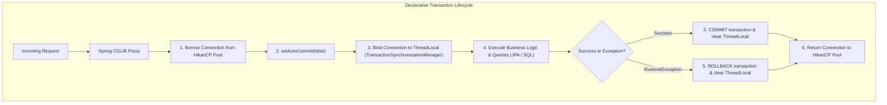
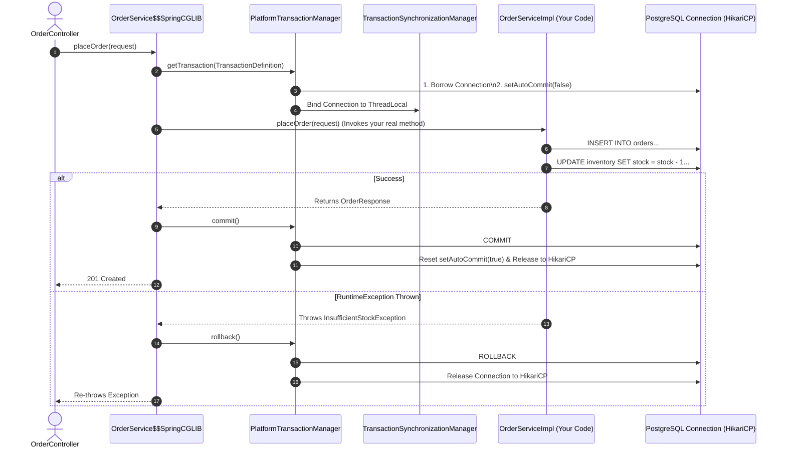
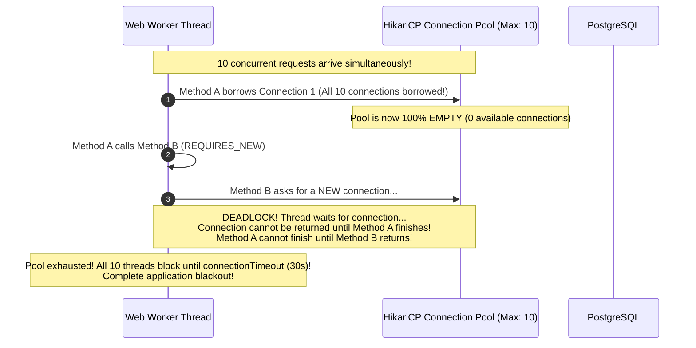
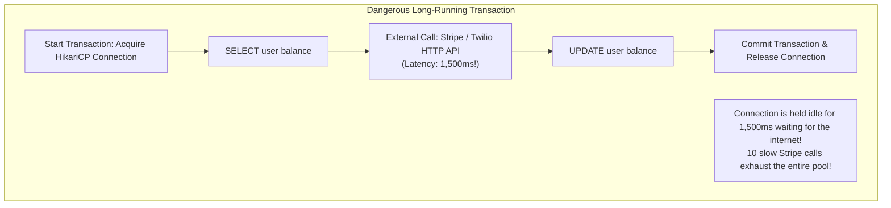

## 1. Mental Model: The Distributed Atomicity Illusion

In backend engineering, data integrity is non-negotiable. If an e-commerce checkout charges a customer's credit card or decrements inventory, but crashes before saving the order record, your system has corrupted financial and business state.

In relational databases, transactions provide **ACID** guarantees:
- **Atomicity**: All operations succeed, or all are rolled back.
- **Consistency**: Invariants and constraints (`NOT NULL`, `CHECK`, foreign keys) are never violated.
- **Isolation**: Concurrent transactions do not interfere destructively with each other.
- **Durability**: Committed data survives system crashes via the Write-Ahead Log (WAL).

In Spring Boot, `@Transactional` manages database transactions declaratively. However, developers routinely misuse it—causing silent rollback failures, connection pool deadlocks, and severe database connection starvation.



---

## 2. Spring AOP Proxy Mechanics: What Actually Happens

`@Transactional` is not built into the Java language. It is implemented via **Spring Aspect-Oriented Programming (AOP)** using **CGLIB dynamic class proxies**.

When you inject a service annotated with `@Transactional`, Spring injects an **enhanced subclass**:



---

## 3. The Fatal Self-Invocation Trap

The single most common transaction bug in Spring applications is calling a transactional method from within the same class:

```java
@Service
public class OrderService {

    private final OrderRepository orderRepository;
    private final InventoryClient inventoryClient;

    public OrderService(OrderRepository orderRepository, InventoryClient inventoryClient) {
        this.orderRepository = orderRepository;
        this.inventoryClient = inventoryClient;
    }

    public void processOrder(OrderRequest request) {
        // FATAL BUG: Calling this.createOrder() bypasses the Spring AOP Proxy!
        createOrder(request);
    }

    @Transactional
    public void createOrder(OrderRequest request) {
        orderRepository.save(new Order(request));
        inventoryClient.reserveInventory(request.items());
    }
}
```

### Why It Fails
When `processOrder()` calls `createOrder(request)`, it executes a standard Java `this.createOrder()` method call. 

Because the call occurs inside the target object, it **completely bypasses the outer CGLIB proxy**! No transaction begins, `setAutoCommit(false)` is never called, and any thrown exception will **not roll back** database modifications.

### The Three Production Solutions:

<Tabs>
  <Tab title="Solution 1: Separate Collaborator Bean (Recommended)">
    Extract the transactional boundary into a separate Spring-managed service:
    ```java
    @Service
    public class OrderWorkflowService {

        private final OrderTransactionService orderTransactionService;

        public OrderWorkflowService(OrderTransactionService orderTransactionService) {
            this.orderTransactionService = orderTransactionService;
        }

        public void processOrder(OrderRequest request) {
            // Invokes through the Spring CGLIB proxy! Transaction starts correctly.
            orderTransactionService.createOrderInTransaction(request);
        }
    }

    @Service
    public class OrderTransactionService {

        private final OrderRepository orderRepository;

        public OrderTransactionService(OrderRepository orderRepository) {
            this.orderRepository = orderRepository;
        }

        @Transactional
        public void createOrderInTransaction(OrderRequest request) {
            orderRepository.save(new Order(request));
        }
    }
    ```
  </Tab>

  <Tab title="Solution 2: Programmatic TransactionTemplate">
    Eliminate proxy dependency completely by wrapping the boundary with `TransactionTemplate`:
    ```java
    @Service
    public class OrderService {

        private final TransactionTemplate transactionTemplate;
        private final OrderRepository orderRepository;

        public OrderService(TransactionTemplate transactionTemplate, OrderRepository orderRepository) {
            this.transactionTemplate = transactionTemplate;
            this.orderRepository = orderRepository;
        }

        public void processOrder(OrderRequest request) {
            transactionTemplate.execute(status -> {
                orderRepository.save(new Order(request));
                return null;
            });
        }
    }
    ```
  </Tab>

  <Tab title="Solution 3: Self-Injection via @Lazy">
    Inject the proxy into itself (functional, but less clean than Solution 1):
    ```java
    @Service
    public class OrderService {

        @Autowired
        @Lazy
        private OrderService self;

        public void processOrder(OrderRequest request) {
            // Invokes through the self-injected proxy
            self.createOrder(request);
        }

        @Transactional
        public void createOrder(OrderRequest request) {
            orderRepository.save(new Order(request));
        }
    }
    ```
  </Tab>
</Tabs>

---

## 4. Propagation Levels: The HikariCP Starvation Deadlock

Spring offers 7 transaction propagation behaviors:

| Propagation | Description | Existing Transaction Behavior |
| :--- | :--- | :--- |
| **`REQUIRED` (Default)** | Needs a transaction | Joins existing transaction; creates one if none exists |
| **`REQUIRES_NEW`** | Always needs its own transaction | **Suspends existing transaction**; opens a completely new, independent transaction |
| **`MANDATORY`** | Strict requirement | Must be called within an existing transaction; throws `IllegalTransactionStateException` if none exists |
| **`SUPPORTS`** | Passive execution | Executes in transaction if present; executes non-transactionally if none exists |
| **`NOT_SUPPORTED`** | Anti-transactional | Suspends existing transaction; executes non-transactionally |
| **`NEVER`** | Forbids transactions | Throws exception if an active transaction is detected |
| **`NESTED`** | JDBC Savepoints | Creates a database savepoint within existing transaction; partial rollback supported |

---

### The `REQUIRES_NEW` Connection Pool Deadlock Trap

When an outer method running with `@Transactional` calls an inner method running with `@Transactional(propagation = Propagation.REQUIRES_NEW)`:
1. Method A borrows **Connection 1** from HikariCP and begins a transaction.
2. Method A calls Method B.
3. Method B suspends Method A's transaction and asks HikariCP for **Connection 2**.
4. Method B executes, commits, and returns Connection 2 to the pool.
5. Method A resumes and commits Connection 1.



### The Mathematical Formula to Prevent Starvation:
To prevent deadlocks when nesting $N$ levels of `REQUIRES_NEW`:

$$\text{HikariCP Maximum Pool Size} > \text{Max Web Worker Threads} \times (N + 1)$$

If your Tomcat server has 200 worker threads, nesting a single `REQUIRES_NEW` call safely requires a connection pool of over $200 \times 2 = \mathbf{400 \text{ connections}}$, which will exhaust PostgreSQL server resources!

<Tip>
**Golden Rule**: Avoid `REQUIRES_NEW` inside web request threads. If you need independent logging (e.g., audit logging an attempt), dispatch the log event asynchronously to Apache Kafka or run it via an `@Async` worker thread.
</Tip>

---

## 5. The Golden Rule: Keep Transactions Short

Database connections are scarce, expensive resources. When a transaction is open, HikariCP holds an OS socket and PostgreSQL holds row locks:



### Anti-Pattern: Network I/O Inside Database Transactions
```java
// DANGEROUS: SITS IDLE ON HIKARICN CONNECTION WAITING FOR EXTERNAL NETWORK
@Transactional
public OrderResponse checkout(CheckoutRequest request) {
    Order order = orderRepository.save(new Order(request));

    // DISASTER: Third-party HTTP call holds DB connection for 2 seconds!
    PaymentResult result = paymentGatewayClient.chargeCreditCard(request.paymentToken());

    order.markPaid(result.transactionId());
    return OrderResponse.from(order);
}
```

### Production Refactoring: Isolating Network I/O with TransactionTemplate
```java
@Service
public class CheckoutService {

    private final TransactionTemplate transactionTemplate;
    private final OrderRepository orderRepository;
    private final PaymentGatewayClient paymentGatewayClient;

    public CheckoutService(
            TransactionTemplate transactionTemplate,
            OrderRepository orderRepository,
            PaymentGatewayClient paymentGatewayClient) {
        this.transactionTemplate = transactionTemplate;
        this.orderRepository = orderRepository;
        this.paymentGatewayClient = paymentGatewayClient;
    }

    public OrderResponse checkout(CheckoutRequest request) {
        // Step 1: Short DB Transaction (Create PENDING order) - Holds connection for 2ms
        Order order = transactionTemplate.execute(status -> {
            return orderRepository.save(new Order(request, OrderStatus.PENDING));
        });

        // Step 2: External Network Call - ZERO DB connections held!
        PaymentResult result = paymentGatewayClient.chargeCreditCard(request.paymentToken());

        // Step 3: Short DB Transaction (Update status) - Holds connection for 2ms
        return transactionTemplate.execute(status -> {
            Order managedOrder = orderRepository.findById(order.getId()).orElseThrow();
            if (result.isSuccess()) {
                managedOrder.markPaid(result.transactionId());
            } else {
                managedOrder.markFailed(result.failureReason());
            }
            return OrderResponse.from(managedOrder);
        });
    }
}
```

---

## 6. Rollback Rules & The Checked Exception Trap

A major trap in Spring transactions is assuming that **any** exception will automatically trigger a database rollback.

```java
// BUG: CHECKED EXCEPTIONS DO NOT TRIGGER ROLLBACK BY DEFAULT!
@Transactional
public void processPayment(Long orderId) throws IOException {
    orderRepository.markProcessing(orderId);
    // If an IOException occurs, Spring COMMITS the transaction!
    throw new IOException("Failed to connect to receipt printer");
}
```

### Why Spring Ignores Checked Exceptions:
Following EJB specification conventions, Spring's transaction interceptor rolls back **only** on:
1. Unchecked exceptions (`RuntimeException` and its subclasses).
2. JVM errors (`java.lang.Error`).

Checked exceptions (`Exception`, `IOException`, `SQLException`) are treated as expected business outcomes and cause Spring to **commit** the transaction!

### The Production Fix:
Always specify `rollbackFor = Exception.class`:
```java
@Transactional(rollbackFor = Exception.class)
public void processPayment(Long orderId) throws CustomCheckedException {
    // Both RuntimeExceptions AND checked Exceptions will now safely rollback!
}
```

---

## 7. Performance Optimization: `@Transactional(readOnly = true)`

When executing read queries, always annotate with `@Transactional(readOnly = true)`:

```java
@Transactional(readOnly = true)
public UserProfile getUserProfile(Long userId) {
    return userRepository.findById(userId)
            .map(UserProfile::from)
            .orElseThrow();
}
```

### What `readOnly = true` Optimizes Behind the Scenes:
1. **Hibernate Snapshot Bypass**: In a standard read-write transaction, Hibernate creates an in-memory snapshot copy of every loaded entity to detect mutations during dirty checking. Setting `readOnly = true` tells Hibernate to **skip snapshot creation**, reducing heap memory allocation by 50%.
2. **PostgreSQL Read-Only Mode**: Sets the underlying JDBC transaction to read-only (`SET TRANSACTION READ ONLY`), allowing PostgreSQL to optimize internal lock queues and avoid reserving transaction IDs (XIDs).
3. **Read-Replica Routing**: If you configure an `AbstractRoutingDataSource`, Spring automatically routes read-only transactions to PostgreSQL read replicas, offloading traffic from the primary writer node.

---

## 8. Failure Modes & Edge Case Matrix

| Failure Mode | Root Cause | Impact | Production Defense |
| :--- | :--- | :--- | :--- |
| **Silent Non-Rollback** | Internal self-invocation (`this.method()`) | Bypasses AOP proxy; no transaction starts | Separate into dedicated collaborator bean or use `TransactionTemplate`. |
| **Checked Exception Commit** | Method throws checked `Exception` without `rollbackFor` | Corrupted DB data committed despite exception | Always annotate `@Transactional(rollbackFor = Exception.class)`. |
| **HikariCP Starvation** | Nested `REQUIRES_NEW` exhausts pool under concurrent load | All threads block; 30s timeout causes blackout | Eliminate `REQUIRES_NEW` in web threads; decouple via `@Async` or Kafka. |
| **Connection Leak** | External HTTP API call inside `@Transactional` | Slow remote API holds connection; pool depletes | Restrict transactions strictly to SQL queries via `TransactionTemplate`. |
| **Dirty Checking Memory Spike** | Loading 10,000 entities in read-write transaction | Hibernate snapshots double heap memory | Annotate queries with `@Transactional(readOnly = true)`. |

---

## 9. Senior Interview Questions & Active Recall

<AccordionGroup>
  <Accordion title="1. How does Spring AOP implement @Transactional under the hood?">
    Spring generates a dynamic CGLIB proxy subclass that wraps the target bean. When an annotated method is invoked, the proxy intercepts the call, delegates to `PlatformTransactionManager` to acquire a database connection from HikariCP, calls `setAutoCommit(false)`, and binds the connection to the current thread via `TransactionSynchronizationManager`. If the method completes normally, the proxy calls `commit()`; if an unhandled `RuntimeException` is thrown, it calls `rollback()`, before restoring `setAutoCommit(true)` and returning the connection to the pool.
  </Accordion>

  <Accordion title="2. Why does calling a @Transactional method from another method in the same class fail to start a transaction?">
    Because Spring uses AOP proxies, transaction boundaries are only enforced when invocations enter through the outer proxy object. When an internal method calls another method within the same class, it executes as a standard Java `this.method()` call, completely bypassing the proxy layer. As a result, no transaction interceptor executes, `setAutoCommit(false)` is never called, and exceptions fail to trigger rollbacks.
  </Accordion>

  <Accordion title="3. How can using Propagation.REQUIRES_NEW cause a complete application deadlock in HikariCP?">
    `REQUIRES_NEW` suspends the outer transaction and borrows a second database connection from HikariCP for the inner transaction. If the connection pool has a maximum size of 10, and 10 concurrent requests execute the outer method simultaneously, all 10 connections are acquired. When all 10 threads attempt to enter the inner method, they request a second connection from the now-empty pool. Since no connections are available and the outer transactions cannot complete without the inner methods finishing, the application deadlocks until connection timeouts occur.
  </Accordion>

  <Accordion title="4. What internal optimizations occur when you specify @Transactional(readOnly = true)?">
    In Hibernate, `readOnly = true` disables the creation of entity state snapshots in the Persistence Context. Because Hibernate knows the entities cannot be modified, it bypasses the CPU and memory cost of dirty checking during flush time. At the database level, it issues `SET TRANSACTION READ ONLY`, which avoids allocating transaction IDs (preventing XID wraparound) and allows database drivers to route queries directly to read-only replicas.
  </Accordion>
</AccordionGroup>

---

## 10. Done Checklist

<Check>
- [ ] Diagram the 6-step lifecycle of a Spring CGLIB transaction proxy.
- [ ] Articulate the Self-Invocation trap and implement 3 production solutions.
- [ ] Understand the 7 transaction propagation behaviors and explain why `REQUIRES_NEW` causes HikariCP deadlocks.
- [ ] Keep external HTTP calls strictly outside database transaction boundaries using `TransactionTemplate`.
- [ ] Prevent silent commit bugs by annotating `@Transactional(rollbackFor = Exception.class)`.
- [ ] Optimize read-heavy queries by applying `@Transactional(readOnly = true)` to bypass Hibernate dirty checking.
</Check>
