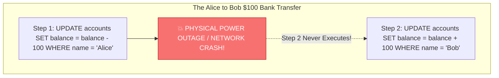
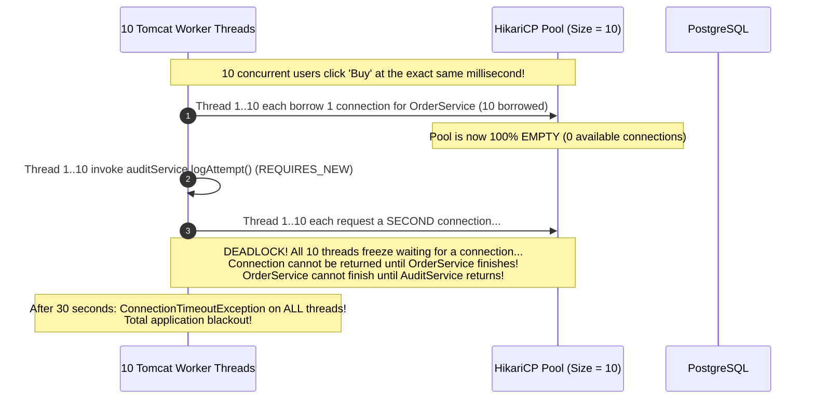
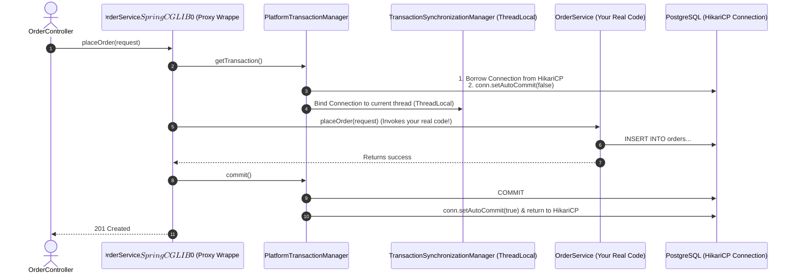
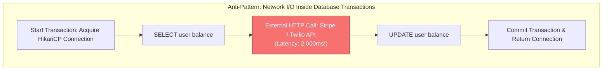

## Prerequisites: Before You Begin

Before diving into transaction boundaries, ensure you understand:
- Relational database ACID guarantees (Atomicity, Consistency, Isolation, Durability).
- Spring IoC Container and Dependency Injection basics.
- JDBC connection pools (HikariCP) and thread-to-connection binding.

---

# Phase 1: Ground Floor (Physical First Principles)

To understand why transactions exist, you must look at what physically happens inside computer hardware when data is written to a database.



### 1. The Disastrous Physical Reality
Imagine your Java application executes two SQL statements to transfer \$100 from Alice to Bob:
1. `UPDATE accounts SET balance = balance - 100 WHERE id = 1;` (Alice's balance drops from \$500 to \$400).
2. `UPDATE accounts SET balance = balance + 100 WHERE id = 2;` (Bob's balance rises from \$200 to \$300).

What happens if the operating system crashes, the server loses physical power, or the database process gets killed **after Step 1, but before Step 2**?
- \$100 was removed from Alice's account.
- \$100 was never added to Bob's account.
- **\$100 has physically vanished into thin air.**

This is data corruption. In financial, e-commerce, and enterprise systems, partial execution is completely unacceptable.

### 2. How the Database Engine Solves This (The Write-Ahead Log)
A relational database like PostgreSQL does **not** write changes directly to the permanent table data files on disk during a transaction.

Instead, it uses a mechanism called the **Write-Ahead Log (WAL)**:
- Every insert, update, and delete is written sequentially to an append-only log file on disk.
- When you execute Step 1, Postgres appends a log entry to the WAL.
- When you execute Step 2, Postgres appends another log entry to the WAL.
- When your Java application issues a `COMMIT` command, PostgreSQL writes a single physical `COMMIT` record to the WAL and flushes it to disk (`fsync`).
- **Crash Recovery**: If power fails before the `COMMIT` record is written, PostgreSQL reboots, scans the WAL, sees uncommitted changes from Step 1, and **rolls them back automatically**.

A database transaction is a contract that tells PostgreSQL: *"Do all of these operations together, or act as if none of them ever happened."*

---

# Phase 2: The Naive Code (The Production Crash)

When a new Java developer uses Spring's `@Transactional` annotation without understanding its internal mechanics, they instinctively trigger three catastrophic production failures.

### Catastrophe 1: The "Catch-and-Swallow" Silent Commit

A developer writes an order checkout method. They want to charge the customer's card and catch any payment error:

```java
// NAIVE CODE: SILENTLY COMMITS UNPAID ORDERS TO THE DATABASE!
@Service
public class CheckoutService {

    @Autowired
    private OrderRepository orderRepository;
    @Autowired
    private PaymentClient paymentClient;

    @Transactional
    public void checkout(OrderRequest request) {
        // Step 1: Save the order to PostgreSQL
        Order order = new Order(request);
        orderRepository.save(order);

        // Step 2: Charge the card
        try {
            paymentClient.charge(request.creditCardToken(), request.amount());
        } catch (Exception e) {
            // FATAL BEGINNER MISTAKE: Catching and swallowing the exception!
            log.error("Payment failed for customer!", e);
        }
    }
}
```

#### Why Production Catastrophically Fails:
Spring's transaction interceptor sits **outside** your service method. It only triggers a rollback if an unhandled exception bubbles up out of the method. 

Because the developer caught and swallowed the `Exception`, the method finishes normally. Spring assumes everything succeeded and sends a **`COMMIT` command to PostgreSQL**. The customer was never charged, but the unpaid order is permanently committed to your database!

---

### Catastrophe 2: The Checked Exception Trap

The developer realizes they should throw an exception instead of swallowing it:

```java
// NAIVE CODE: STILL SILENTLY COMMITS CORRUPTED STATE!
@Service
public class AccountService {

    @Autowired
    private AccountRepository accountRepository;

    @Transactional
    public void debitAccount(Long accountId, BigDecimal amount) throws InsufficientFundsException {
        Account account = accountRepository.findById(accountId).orElseThrow();
        account.withdraw(amount);
        accountRepository.save(account);

        if (account.getBalance().compareTo(BigDecimal.ZERO) < 0) {
            // InsufficientFundsException extends java.lang.Exception (Checked Exception)
            throw new InsufficientFundsException("Account overdrawn!");
        }
    }
}
```

#### Why Production Commits Corrupted State:
By default, following the 1999 EJB standard, Spring **only rolls back on unchecked exceptions** (`RuntimeException` and `Error`). 

If your method throws a checked `Exception` (like `IOException`, `SQLException`, or a custom `Exception`), Spring **ignores it and commits the transaction anyway**! The customer's balance drops into negative numbers and commits to PostgreSQL.

---

### Catastrophe 3: The `REQUIRES_NEW` Connection Pool Deadlock

A developer wants to log every checkout attempt to an `audit_logs` table, even if the main checkout transaction fails. They use `Propagation.REQUIRES_NEW`:

```java
@Service
public class OrderService {
    @Autowired private AuditService auditService;
    @Autowired private OrderRepository orderRepository;

    @Transactional
    public void processOrder(OrderRequest req) {
        orderRepository.save(new Order(req)); // Holds Connection 1 from HikariCP
        auditService.logAttempt(req);         // Requests Connection 2 from HikariCP!
    }
}

@Service
public class AuditService {
    @Transactional(propagation = Propagation.REQUIRES_NEW)
    public void logAttempt(OrderRequest req) {
        // Must borrow an independent connection from HikariCP
    }
}
```



#### The Mathematical Pool Starvation Formula:
To safely run $N$ nested levels of `REQUIRES_NEW`, your connection pool size must satisfy:

$$\text{HikariCP Maximum Pool Size} > \text{Max Concurrent Threads} \times (N + 1)$$

With 200 Tomcat worker threads, safely nesting one `REQUIRES_NEW` call requires over $200 \times 2 = \mathbf{400 \text{ database connections}}$, which will crash PostgreSQL with excessive backend worker memory consumption.

---

# Phase 3: Under the Hood (Mechanics & Bytecode)

To understand why transactions succeed or fail, you must see the bytecode Spring creates at runtime.

## 1. Demystifying the Magic: The CGLIB Dynamic Proxy

`@Transactional` is not magic built into Java. It is implemented via **Spring Aspect-Oriented Programming (AOP)** using **CGLIB dynamic class subclassing**.

When your Spring Boot application starts up, Spring inspects your beans. When it sees `@Transactional` on `OrderService`, Spring does **not** register your raw class. Instead, it generates an enhanced subclass at runtime:

```java
// What Spring generates in bytecode behind the scenes:
public class OrderService$$SpringCGLIB$$0 extends OrderService {

    private final PlatformTransactionManager transactionManager;
    private final OrderService target; // Your real code!

    @Override
    public void placeOrder(OrderRequest request) {
        // 1. Borrow a connection from HikariCP & begin transaction
        TransactionStatus status = transactionManager.getTransaction(new DefaultTransactionDefinition());
        try {
            // 2. Delegate to your REAL Java method:
            target.placeOrder(request);

            // 3. If no unhandled exception occurred, COMMIT:
            transactionManager.commit(status);
        } catch (Throwable ex) {
            // 4. Inspect rollback rules:
            if (isRollbackOn(ex)) {
                transactionManager.rollback(status);
            } else {
                transactionManager.commit(status); // Silently commits if checked exception!
            }
            throw ex;
        }
    }
}
```



---

## 2. The Fatal Self-Invocation Trap

Why does calling a `@Transactional` method from within the same class fail?

```java
@Service
public class OrderService {

    public void processOrder(OrderRequest request) {
        // FATAL BUG: Calling annotated method internally via 'this'!
        this.saveOrderInTransaction(request);
    }

    @Transactional
    public void saveOrderInTransaction(OrderRequest request) {
        orderRepository.save(new Order(request));
    }
}
```

### Physical Memory Explanation:
- When an external controller injects `OrderService`, Spring gives it a memory pointer to the **CGLIB Proxy** (`0xProxyAddress`).
- When the controller calls `orderService.processOrder()`, the call hits `0xProxyAddress`.
- Inside `processOrder()`, calling `saveOrderInTransaction()` compiles to **`this.saveOrderInTransaction()`**.
- In JVM memory, the `this` pointer resolves to the **real target object (`0xTargetAddress`)**, completely bypassing the CGLIB proxy wrapper!
- Because the proxy is bypassed, `transactionManager.getTransaction()` is **never called**. No transaction starts, and no rollback occurs on errors.

### The Three Production Solutions:

<Tabs>
  <Tab title="Solution 1: Separate Collaborator Bean (Recommended)">
    Extract the transaction into a dedicated service so calls pass through Spring's proxy:
    ```java
    @Service
    public class OrderWorkflowService {
        private final OrderTransactionService txService;

        public OrderWorkflowService(OrderTransactionService txService) {
            this.txService = txService;
        }

        public void processOrder(OrderRequest request) {
            // Passes through the CGLIB proxy! Transaction starts properly.
            txService.saveOrderInTransaction(request);
        }
    }

    @Service
    public class OrderTransactionService {
        private final OrderRepository orderRepository;

        public OrderTransactionService(OrderRepository orderRepository) {
            this.orderRepository = orderRepository;
        }

        @Transactional
        public void saveOrderInTransaction(OrderRequest request) {
            orderRepository.save(new Order(request));
        }
    }
    ```
  </Tab>

  <Tab title="Solution 2: Programmatic TransactionTemplate">
    Bypasses proxies entirely using Spring's programmatic `TransactionTemplate`:
    ```java
    @Service
    public class OrderService {
        private final TransactionTemplate transactionTemplate;
        private final OrderRepository orderRepository;

        public OrderService(TransactionTemplate transactionTemplate, OrderRepository orderRepository) {
            this.transactionTemplate = transactionTemplate;
            this.orderRepository = orderRepository;
        }

        public void processOrder(OrderRequest request) {
            transactionTemplate.execute(status -> {
                orderRepository.save(new Order(request));
                return null;
            });
        }
    }
    ```
  </Tab>

  <Tab title="Solution 3: Self-Injection with @Lazy">
    Inject the proxy into itself (clean workaround if refactoring is not immediately possible):
    ```java
    @Service
    public class OrderService {
        @Autowired
        @Lazy
        private OrderService self;

        public void processOrder(OrderRequest request) {
            // Invokes method through the proxy wrapper!
            self.saveOrderInTransaction(request);
        }

        @Transactional
        public void saveOrderInTransaction(OrderRequest request) {
            orderRepository.save(new Order(request));
        }
    }
    ```
  </Tab>
</Tabs>

---

## 3. The Golden Rule: Never Hold Connections During HTTP Calls

Database connections are scarce. HikariCP pools typically hold only 10 to 30 connections for an entire service.



If Stripe takes 2,000ms to process a payment, your database connection sits completely idle on the network for 2 seconds. **Just 15 concurrent checkouts will exhaust your entire connection pool!**

### Production Refactoring: Isolating Network I/O
```java
@Service
public class CheckoutService {

    private final TransactionTemplate transactionTemplate;
    private final OrderRepository orderRepository;
    private final PaymentClient paymentClient;

    public CheckoutService(TransactionTemplate transactionTemplate, 
                           OrderRepository orderRepository, 
                           PaymentClient paymentClient) {
        this.transactionTemplate = transactionTemplate;
        this.orderRepository = orderRepository;
        this.paymentClient = paymentClient;
    }

    public OrderResponse checkout(CheckoutRequest request) {
        // Step 1: Short DB Transaction (2ms) - Borrow connection, create PENDING order, release connection!
        Order order = transactionTemplate.execute(status -> 
            orderRepository.save(new Order(request, OrderStatus.PENDING))
        );

        // Step 2: Remote HTTP Call (2,000ms) - ZERO database connections held!
        PaymentResult result = paymentClient.charge(request.paymentToken());

        // Step 3: Short DB Transaction (2ms) - Borrow connection, update status, release connection!
        return transactionTemplate.execute(status -> {
            Order managedOrder = orderRepository.findById(order.getId()).orElseThrow();
            if (result.isSuccess()) {
                managedOrder.markPaid(result.transactionId());
            } else {
                managedOrder.markFailed(result.error());
            }
            return OrderResponse.from(managedOrder);
        });
    }
}
```

---

# Phase 4: Senior Interview Ace (Junior vs. Staff Phrasing)

Senior interviewers look for engineers who understand how transactions behave under concurrent load and high availability.

### Q1: "How does `@Transactional` work, and why does calling an annotated method internally fail?"

```diff
- JUNIOR ANSWER:
  "@Transactional is an annotation that opens a database transaction. If you call it inside 
   the same class, Spring gets confused because it's in the same file."
```

```diff
+ SENIOR / STAFF ANSWER:
  "Spring implements @Transactional using AOP with dynamic CGLIB proxies. At startup, Spring 
   generates an enhanced proxy subclass (e.g. OrderService$$SpringCGLIB) that intercepts invocations, 
   acquires a JDBC connection from HikariCP via PlatformTransactionManager, sets autoCommit to false, 
   and binds the connection to the current thread using TransactionSynchronizationManager via ThreadLocal.
   
   When a method calls another annotated method in the same class, the invocation executes via Java's 
   'this' pointer. Because 'this' resolves to the target instance rather than the proxy wrapper, 
   the transaction interceptor is completely bypassed. No connection is acquired and no transaction begins. 
   We resolve this by separating concerns into a collaborator bean or using programmatic TransactionTemplate."
```

---

### Q2: "What exceptions trigger a rollback by default in Spring, and what is the production standard?"

```diff
- JUNIOR ANSWER:
  "Any exception thrown from the method causes Spring to rollback the transaction."
```

```diff
+ SENIOR / STAFF ANSWER:
  "By default, Spring only triggers a rollback on unchecked exceptions (subclasses of RuntimeException) 
   and JVM Errors. If a checked Exception (such as IOException or custom business Exception) is thrown, 
   Spring catches it, considers it an expected outcome, and proceeds to COMMIT the transaction.
   
   In production, we explicitly enforce '@Transactional(rollbackFor = Exception.class)' to guarantee 
   that any unexpected checked exception triggers a full rollback, preventing silent data corruption."
```

---

### Q3: "What is `Propagation.REQUIRES_NEW`, and what hidden production hazard does it introduce?"

```diff
- JUNIOR ANSWER:
  "REQUIRES_NEW tells Spring to always start a new transaction even if one is already running."
```

```diff
+ SENIOR / STAFF ANSWER:
  "REQUIRES_NEW suspends the caller's active transaction and acquires a brand-new, independent database 
   connection from the pool for the inner transaction.
   
   The critical hazard is Connection Pool Starvation Deadlock:
   If an outer method running on Thread 1 borrows Connection A, and then calls a REQUIRES_NEW method that 
   requests Connection B, Thread 1 now requires 2 concurrent connections. Under peak traffic where all 
   connections in HikariCP are borrowed by concurrent outer threads, every thread blocks waiting for a 
   second connection from an empty pool. Because no outer transaction can complete without its inner 
   method returning, the entire pool deadlocks until connection timeouts occur.
   
   We avoid REQUIRES_NEW in web worker threads and instead decouple audit or secondary actions 
   asynchronously via @Async or Apache Kafka."
```

---

## Hands-on Practice Challenge & Integration Tests

### The Lab: Reproducing and Defending the Self-Invocation Trap

**Objective**: Write a test verifying that calling a `@Transactional` method internally bypasses proxy rollback, then refactor it using `TransactionTemplate` to guarantee atomic rollbacks.

#### 1. The Broken Test (Proves Proxy Bypass)
```java
@Service
public class OrderService {
    @Autowired
    private OrderRepository orderRepository;

    public void processOrder(Order order) {
        // Internal call via 'this'
        saveWithAudit(order);
    }

    @Transactional
    public void saveWithAudit(Order order) {
        orderRepository.save(order);
        throw new RuntimeException("Simulated payment failure!");
    }
}

@SpringBootTest
class OrderServiceTransactionTest {

    @Autowired private OrderService orderService;
    @Autowired private OrderRepository orderRepository;

    @Test
    void internalCall_failsToRollback_corruptingDatabaseState() {
        Order order = new Order("ORD-100", 5000);
        
        assertThrows(RuntimeException.class, () -> orderService.processOrder(order));

        // FATAL: Due to proxy bypass, the order was committed despite the exception!
        assertEquals(1, orderRepository.count());
    }
}
```

#### 2. The Refactored Solution (Defended via Programmatic `TransactionTemplate`)
```java
@Service
public class OrderService {
    private final OrderRepository orderRepository;
    private final TransactionTemplate transactionTemplate;

    public OrderService(OrderRepository orderRepository, TransactionTemplate transactionTemplate) {
        this.orderRepository = orderRepository;
        this.transactionTemplate = transactionTemplate;
    }

    public void processOrder(Order order) {
        transactionTemplate.execute(status -> {
            orderRepository.save(order);
            if (someFailureCondition()) {
                status.setRollbackOnly();
                throw new RuntimeException("Simulated failure!");
            }
            return null;
        });
    }
}
```

---

## Failure Modes & Edge Case Matrix

| Failure Mode | Root Cause | Impact | Production Defense |
| :--- | :--- | :--- | :--- |
| **Silent Non-Rollback** | Internal self-invocation (`this.method()`) | Bypasses AOP proxy; no transaction starts | Separate into dedicated collaborator bean or use `TransactionTemplate`. |
| **Checked Exception Commit** | Method throws checked `Exception` without `rollbackFor` | Corrupted DB data committed despite exception | Always annotate `@Transactional(rollbackFor = Exception.class)`. |
| **HikariCP Starvation** | Nested `REQUIRES_NEW` exhausts pool under concurrent load | All threads block; 30s timeout causes blackout | Eliminate `REQUIRES_NEW` in web threads; decouple via `@Async` or Kafka. |
| **Connection Leak** | External HTTP API call inside `@Transactional` | Slow remote API holds connection; pool depletes | Restrict transactions strictly to SQL queries via `TransactionTemplate`. |
| **Dirty Checking Memory Spike** | Loading 10,000 entities in read-write transaction | Hibernate snapshots double heap memory | Annotate queries with `@Transactional(readOnly = true)`. |

---

## Done Checklist

<Check>
- [ ] Understand the physical role of the database Write-Ahead Log (WAL) in providing crash recovery and atomicity.
- [ ] Diagram how Spring CGLIB dynamic proxies wrap service methods with `PlatformTransactionManager`.
- [ ] Explain why internal self-invocation (`this.method()`) completely bypasses Spring's transaction interceptor.
- [ ] Enforce `@Transactional(rollbackFor = Exception.class)` to prevent silent commits on checked exceptions.
- [ ] Prevent HikariCP pool starvation deadlocks caused by nested `REQUIRES_NEW` propagation.
- [ ] Keep slow external HTTP network calls strictly outside database transaction boundaries using `TransactionTemplate`.
- [ ] Optimize read-heavy queries with `@Transactional(readOnly = true)` to bypass Hibernate entity snapshot allocations.
</Check>
