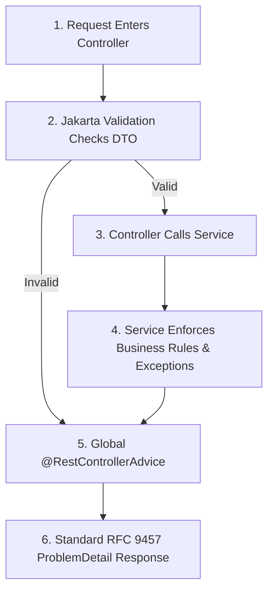

# Validation And Errors

Validation checks if request data is correct.

Errors tell the client what went wrong.

Good APIs reject bad input early and return clean responses.

## Mental Model



## Starter Dependency

Spring Boot requires the validation starter. It is not included by default in `spring-boot-starter-web`:

<Tabs>
  <Tab title="Maven (pom.xml)">
    ```xml
    <dependency>
        <groupId>org.springframework.boot</groupId>
        <artifactId>spring-boot-starter-validation</artifactId>
    </dependency>
    ```
  </Tab>
  <Tab title="Gradle (build.gradle)">
    ```groovy
    implementation 'org.springframework.boot:spring-boot-starter-validation'
    ```
  </Tab>
</Tabs>

## Request DTO Validation

Use validation annotations on request DTOs from `jakarta.validation.constraints.*`:

```java
package com.example.dto;

import jakarta.validation.constraints.Email;
import jakarta.validation.constraints.NotBlank;
import jakarta.validation.constraints.Size;

public record CreateUserRequest(
    @NotBlank(message = "Name is required")
    @Size(max = 100, message = "Name cannot be longer than 100 characters")
    String name,

    @NotBlank(message = "Email is required")
    @Email(message = "Email must be valid")
    @Size(max = 150, message = "Email cannot be longer than 150 characters")
    String email,

    @NotBlank(message = "Password is required")
    @Size(min = 8, max = 100, message = "Password must be between 8 and 100 characters")
    String password
) {}
```

Common annotations:

| Annotation | Validation Rule |
| :--- | :--- |
| `@NotNull` | Value must not be `null` (accepts empty strings) |
| `@NotBlank` | CharSequence must not be null and must contain at least one non-whitespace character |
| `@Size` | Size of string, collection, or array must be within boundaries |
| `@Email` | String must conform to standard email address format |
| `@Min` / `@Max` | Numeric value must satisfy minimum/maximum limit |
| `@Positive` | Numeric value must be strictly greater than zero |
| `@Past` / `@Future` | Date/time must be in the past/future |

## Controller

Use `@Valid`.

```java
@PostMapping
@ResponseStatus(HttpStatus.CREATED)
public UserResponse createUser(@Valid @RequestBody CreateUserRequest request) {
    return userService.createUser(request);
}
```

If validation fails, controller method does not run.

Spring throws `MethodArgumentNotValidException`.

## Nested Validation

Use `@Valid` inside DTO when validating nested objects.

```java
public record CreateOrderRequest(
    @NotEmpty(message = "Order must have at least one item")
    List<@Valid OrderItemRequest> items
) {}
```

```java
public record OrderItemRequest(
    @NotNull Long productId,
    @Positive int quantity
) {}
```

## Business Validation

Some rules cannot be checked by annotations.

Example:

- **Email uniqueness**: checked against the database (`userRepository.existsByEmail()`).
- **Inventory availability**: checked against current stock (`product.getStock() >= requestedQty`).
- **Resource ownership**: verified against authentication context (`note.getOwnerId().equals(userId)`).
- **Payment balance**: checked against order grand total (`payment.getAmount().equals(order.getTotal())`).

Put business validation in service layer.

```java
if (userRepository.existsByEmail(request.email())) {
    throw new EmailAlreadyUsedException();
}
```

## Error Response Shape

Use one consistent shape.

```java
public record ErrorResponse(
    String message,
    Map<String, String> errors
) {
    public static ErrorResponse of(String message) {
        return new ErrorResponse(message, Map.of());
    }
}
```

Validation response:

```json
{
  "message": "Validation failed",
  "errors": {
    "email": "Email must be valid",
    "password": "Password must be between 8 and 100 characters"
  }
}
```

Business error response:

```json
{
  "message": "Email already used",
  "errors": {}
}
```

## Global Exception Handler

```java
@RestControllerAdvice
public class GlobalExceptionHandler {
    @ExceptionHandler(MethodArgumentNotValidException.class)
    @ResponseStatus(HttpStatus.BAD_REQUEST)
    public ErrorResponse handleValidation(MethodArgumentNotValidException exception) {
        Map<String, String> errors = new LinkedHashMap<>();

        for (FieldError fieldError : exception.getBindingResult().getFieldErrors()) {
            errors.put(fieldError.getField(), fieldError.getDefaultMessage());
        }

        return new ErrorResponse("Validation failed", errors);
    }

    @ExceptionHandler(EmailAlreadyUsedException.class)
    @ResponseStatus(HttpStatus.CONFLICT)
    public ErrorResponse handleEmailAlreadyUsed(EmailAlreadyUsedException exception) {
        return ErrorResponse.of(exception.getMessage());
    }

    @ExceptionHandler(ResourceNotFoundException.class)
    @ResponseStatus(HttpStatus.NOT_FOUND)
    public ErrorResponse handleNotFound(ResourceNotFoundException exception) {
        return ErrorResponse.of(exception.getMessage());
    }
}
```

## Modern RFC 7807 (ProblemDetail)

In Spring Boot 3 / Spring 6, Java natively supports the **RFC 7807 Specification for HTTP API Problem Details** via `org.springframework.http.ProblemDetail`.

Instead of writing custom DTO classes, you can return standard problem details:

```java
package com.example.common;

import org.springframework.http.HttpStatus;
import org.springframework.http.ProblemDetail;
import org.springframework.web.bind.annotation.ExceptionHandler;
import org.springframework.web.bind.annotation.RestControllerAdvice;

import java.net.URI;
import java.time.Instant;

@RestControllerAdvice
public class StandardErrorAdvice {

    @ExceptionHandler(ResourceNotFoundException.class)
    public ProblemDetail handleNotFound(ResourceNotFoundException ex) {
        ProblemDetail problem = ProblemDetail.forStatusAndDetail(
            HttpStatus.NOT_FOUND,
            ex.getMessage()
        );
        problem.setTitle("Resource Not Found");
        problem.setType(URI.create("https://api.example.com/errors/not-found"));
        problem.setProperty("timestamp", Instant.now());
        return problem;
    }
}
```

RFC 7807 JSON output:

```json
{
  "type": "https://api.example.com/errors/not-found",
  "title": "Resource Not Found",
  "status": 404,
  "detail": "Note with id 55 does not exist",
  "instance": "/api/notes/55",
  "timestamp": "2026-09-10T19:30:00Z"
}
```

<Tip>
Use custom `ErrorResponse` records if your frontend team has an existing contract. Use `ProblemDetail` if you are building a new greenfield API following modern IETF standards.
</Tip>

## Status Codes

Use status codes honestly.

| Status Code | Meaning | Backend Use Case |
| :--- | :--- | :--- |
| **`400 Bad Request`** | Request shape or validation failed | Missing required DTO fields, blank title |
| **`401 Unauthorized`** | Authentication missing or invalid | Missing or expired JWT bearer token |
| **`403 Forbidden`** | Authenticated, but lacks permission | User attempting to edit another user's note |
| **`404 Not Found`** | Resource does not exist | ID does not match any existing database row |
| **`409 Conflict`** | State conflict or duplicate data | Attempting to register an already taken email |
| **`422 Unprocessable`** | Valid JSON syntax, but invariant violated | Domain semantic failure |
| **`500 Server Error`** | Unexpected backend bug | Uncaught runtime exception or database crash |

Many Spring APIs use `400` for validation and `409` for duplicate data.

Be consistent.

## Field Error Names

Return field names the client understands.

Good:

```json
{
  "errors": {
    "email": "Email must be valid"
  }
}
```

Bad:

```json
{
  "errors": {
    "createUserRequest.email": "Email must be valid"
  }
}
```

## Logging Errors

Do not log every validation error as server failure.

Validation errors are usually client mistakes.

Log unexpected errors with request ID.

```java
log.error("Unexpected API error requestId={}", requestId, exception);
```

Do not log passwords, tokens, or secrets.

## API Test

```java
@WebMvcTest(UserController.class)
class UserControllerTest {
    @Autowired
    MockMvc mockMvc;

    @MockBean
    UserService userService;

    @Test
    void shouldReturnValidationErrors() throws Exception {
        mockMvc.perform(post("/api/users")
                .contentType(MediaType.APPLICATION_JSON)
                .content("""
                    {
                      "name": "",
                      "email": "bad-email",
                      "password": "123"
                    }
                    """))
            .andExpect(status().isBadRequest())
            .andExpect(jsonPath("$.message").value("Validation failed"))
            .andExpect(jsonPath("$.errors.email").exists())
            .andExpect(jsonPath("$.errors.password").exists());
    }
}
```

Test the error shape.

Frontend depends on it.

## Common Mistakes

- Forgetting `@Valid`
- Validating entity instead of request DTO
- Returning stack trace
- Returning different error shapes from different controllers
- Sending `200 OK` for failed requests
- Logging passwords in error logs
- Treating business rule errors as unexpected `500`
- Only testing happy path

## Debug Checklist

When validation does not work:

- Is `spring-boot-starter-validation` installed?
- Is `@Valid` on controller parameter?
- Are annotations on request DTO?
- Is request body JSON correct?
- Is global exception handler catching the right exception?
- Is security blocking request before validation?

## Practice Task

Add validation and clean errors for Todo API:

- blank title returns `400`
- title longer than 200 returns `400`
- missing todo returns `404`
- duplicate title for same user returns `409`

Write API tests for each case.

## Done Checklist

- Request DTOs have validation annotations
- Controllers use `@Valid`
- Business rules throw custom exceptions
- Global handler returns one error shape
- Validation tests check JSON response
- No stack trace reaches user
- Logs do not contain secrets

## Interview Questions

1. What is validation?
2. What is the difference between DTO validation and business validation?
3. Why use global exception handler?
4. Why should APIs not return stack traces?
5. When should you return `409 Conflict`?
