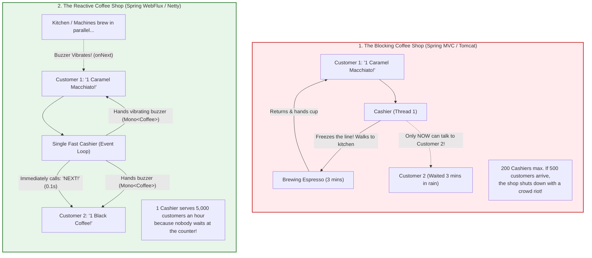
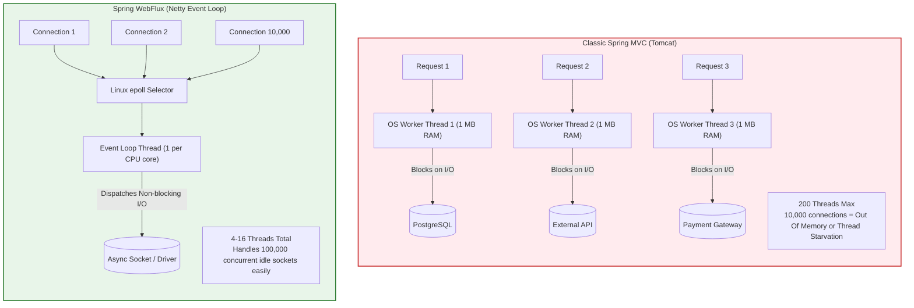
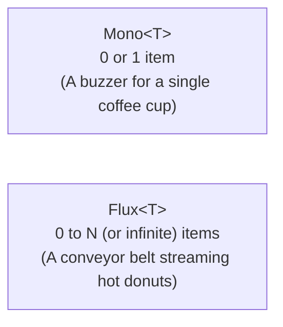
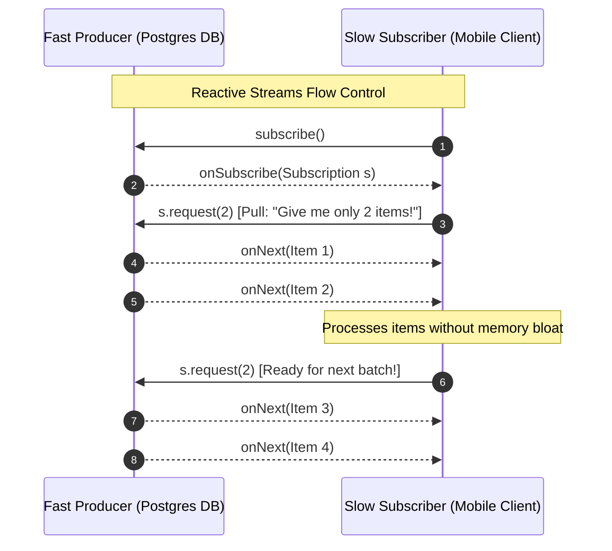

## Prerequisites: Before You Begin

Before exploring Spring WebFlux and reactive systems, ensure you understand:
- **HTTP Client-Server Basics**: A client sends an HTTP request, and the server computes and sends back an HTTP response.
- **Java Threads**: A thread is an independent worker inside the computer executing your code line by line.
- **Blocking vs Non-Blocking**: "Blocking" means waiting idle until an operation finishes; "non-blocking" means continuing other work while waiting.

---

# Phase 1: Ground Floor (Everyday Mental Model)

## 1. The Coffee Shop Analogy: Blocking Cashier vs. The Order Buzzer

To understand reactive programming without confusion, think of a busy morning at a coffee shop:



### The Blocking Way (Classic Spring MVC)
- You walk up to the counter and order a coffee.
- The cashier **freezes the entire line**, walks back into the kitchen, steams the milk for 3 minutes, brews the espresso, pours it into a cup, hands it to you, and *only then* turns to the next customer in line.
- If 200 customers arrive at once, the coffee shop needs **200 cashiers** running around the kitchen bumping into each other. If customer 201 arrives, they are blocked outside on the sidewalk!

### The Reactive Way (Spring WebFlux)
- You walk up to the counter and order a coffee.
- The cashier takes your money, hands you a **little vibrating plastic buzzer (`Mono<Coffee>`)**, and immediately yells: *"Next customer please!"*
- You go sit down at a table and check your phone. The cashier handles 20 customers a minute.
- Meanwhile, the coffee machine works in the kitchen. When your coffee is ready, **your buzzer vibrates**, you walk to the pick-up counter, and grab your cup.
- **Result**: One single cashier can effortlessly serve thousands of people because the cashier **never sits idle waiting for boiling water**.

---

## 2. Naive Raw Java: Why Asynchronous Code Is Hard

How would a Java developer write non-blocking asynchronous code without Spring WebFlux? They would use `CompletableFuture` and thread pools:

```java
// How Java developers try to do async without a reactive framework:
public class NaiveAsyncOrderService {

    private final ExecutorService threadPool = Executors.newFixedThreadPool(100);

    public CompletableFuture<OrderDto> getOrderAsync(String orderId) {
        return CompletableFuture.supplyAsync(() -> {
            // Step 1: Query database (blocks background thread)
            OrderEntity entity = database.findById(orderId);
            return entity;
        }, threadPool).thenApply(entity -> {
            // Step 2: Transform to DTO
            return new OrderDto(entity.id(), entity.total());
        });
    }

    public void handleRequest(String orderId) {
        CompletableFuture<OrderDto> future = getOrderAsync(orderId);

        // FATAL BEGINNER MISTAKE: Calling .get() or .join()!
        // This physically BLOCKS the current thread waiting for the future to finish,
        // completely destroying any async performance benefit!
        try {
            OrderDto dto = future.get(); // BLOCKS!
            System.out.println("Got order: " + dto);
        } catch (Exception e) {
            e.printStackTrace();
        }
    }
}
```

### Why Naive Async Breaks Down:
1. **The `.get()` Trap**: The moment a developer calls `future.get()`, the calling thread is forced to freeze until the computation completes.
2. **Callback Hell**: If you need to fetch an Order, then fetch the Customer, then call the Payment API, then send an Email, chaining `CompletableFuture.thenCompose()` creates nested spaghetti code that is nearly impossible to read or debug.
3. **No Backpressure**: If a database emits 1,000,000 records asynchronously, `CompletableFuture` has no way to tell the database: *"Slow down! I only have enough memory to process 10 records at a time!"*. The JVM crashes with `OutOfMemoryError`.

This is why **Project Reactor** and **Spring WebFlux** were invented.

---

# Phase 2: Physical Mental Model: Tomcat Workers vs. Netty Event Loops

To understand why reactive systems exist, look at the physical memory and CPU costs of operating system threads:



### The Cost of OS Platform Threads
- **Memory Footprint**: Each OS thread allocates a stack of approximately **1 MB** in virtual memory. 1,000 concurrent threads consume ~1 GB of RAM purely for stack frames, before allocating a single Java object on the heap!
- **Context Switching**: When 1,000 threads compete for 8 CPU cores, the Linux kernel scheduler spends more time swapping register state, flushing CPU L1/L2 caches, and context switching than executing your code.

### The Event Loop Alternative
Instead of allocating a thread per user, Netty uses the **Reactor Pattern**:
- It starts a tiny number of threads (typically matching the number of available CPU cores, e.g., 8 or 16).
- It registers thousands of open sockets with the Linux kernel using **`epoll`** (or `kqueue` on macOS).
- When data arrives on any socket, the kernel notifies the event loop, which immediately processes the chunk of bytes and delegates the next step. No thread ever sits idle waiting for I/O.

---

## 2. Project Reactor: `Mono<T>` and `Flux<T>` in Plain English

In standard Java, a method returns a value directly: `User getUser()`.
In Spring WebFlux, methods **never** return raw values directly. They return **Publishers** (containers that promise to deliver data in the future):



### 1. What is a `Mono<T>`?
- Think of `Mono<T>` as a **buzzer for a single item**.
- It can emit:
  1. **One item** and complete successfully (e.g., `findById("123")` finds the User).
  2. **Zero items** and complete empty (e.g., `findById("999")` finds nothing).
  3. **An error** if something went wrong (e.g., database connection timed out).

### 2. What is a `Flux<T>`?
- Think of `Flux<T>` as a **conveyor belt or live ticker** emitting multiple items over time.
- It can emit:
  1. **0 to N items**, followed by a completion signal (e.g., streaming all 50 active products).
  2. **An infinite stream of items** that never ends (e.g., a live Bitcoin price ticker emitting every 500ms, or chat messages).
  3. **An error** if the stream breaks.

---

### The Golden Rule: The Recipe vs. The Cake

<Warning>
**The Subscription Invariant**:
**A recipe is not a cake. Nothing happens until you subscribe!**
</Warning>

In standard Java (Spring MVC), writing code is like **eating the cake**:
```java
// Imperative (Spring MVC): Executes immediately!
// The database query is physically executed right now on line 2.
User user = userRepository.findById("123");
System.out.println(user.name());
```

In reactive programming, writing code is like **writing down a recipe in a notebook**:
```java
// Reactive (Spring WebFlux): DOES NOT EXECUTE!
// This simply builds a plan/recipe. Not a single byte is sent to PostgreSQL!
Mono<User> userMono = userRepository.findById("123")
    .map(user -> {
        System.out.println("Processing user: " + user.name());
        return user;
    });

// If you forget to subscribe, this recipe sits on the shelf forever.
// The database query is NEVER sent to the network socket!
```

### Who Actually Subscribes?
- When you return a `Mono<T>` or `Flux<T>` from a `@GetMapping` or `@PostMapping` controller method, **Spring Framework is the subscriber**!
- Spring grabs the recipe, attaches the Netty network socket, calls `.subscribe()`, and as soon as PostgreSQL returns the data, Netty writes the JSON bytes directly to the client's HTTP connection.

---

## 3. Real-World WebFlux Controller & Reactive Pipeline

Let us build a production reactive controller demonstrating validation, reactive chaining with `flatMap`, error handling, and JSON streaming.

```java
package com.backend.mastery.reactive;

import jakarta.validation.Valid;
import org.springframework.http.HttpStatus;
import org.springframework.http.MediaType;
import org.springframework.web.bind.annotation.*;
import reactor.core.publisher.Flux;
import reactor.core.publisher.Mono;

import java.time.Duration;

@RestController
@RequestMapping("/api/reactive/orders")
public class ReactiveOrderController {

    private final ReactiveOrderService orderService;

    public ReactiveOrderController(ReactiveOrderService orderService) {
        this.orderService = orderService;
    }

    /**
     * Mono: Asynchronously fetches a single order by ID
     */
    @GetMapping("/{id}")
    public Mono<OrderDto> getOrderById(@PathVariable String id) {
        return orderService.findById(id)
                .switchIfEmpty(Mono.error(new ResourceNotFoundException("Order not found with id: " + id)));
    }

    /**
     * Mono: Asynchronously validates and creates a new order
     */
    @PostMapping
    @ResponseStatus(HttpStatus.CREATED)
    public Mono<OrderDto> createOrder(@Valid @RequestBody Mono<CreateOrderCommand> commandMono) {
        return commandMono
                .flatMap(orderService::processAndSaveOrder);
    }

    /**
     * Flux: Streams real-time price updates using Server-Sent Events (SSE)
     */
    @GetMapping(value = "/stream/prices", produces = MediaType.TEXT_EVENT_STREAM_VALUE)
    public Flux<PriceTick> streamPriceTicks() {
        return orderService.streamLivePrices()
                // Emit an event every 500ms
                .delayElements(Duration.ofMillis(500))
                // Drop events if client network cannot keep up (Backpressure)
                .onBackpressureDrop(dropped -> System.out.println("Client slow, dropped tick: " + dropped.price()));
    }
}
```

### Essential Operators You Must Know

| Operator | Behavior | Real Backend Use Case |
| :--- | :--- | :--- |
| `map(T -> R)` | Synchronous 1-to-1 transformation. | Converting an Entity to a DTO. |
| `flatMap(T -> Mono<R>)` | Asynchronous 1-to-1 or 1-to-N transformation; flattens the inner publisher. | Taking an `Order`, and calling an async `PaymentClient.charge()` returning another `Mono`. |
| `filter(T -> boolean)` | Evaluates a predicate; discards items returning `false`. | Discarding cancelled orders. |
| `zip(Mono<A>, Mono<B>)` | Combines multiple publishers concurrently and emits when **all** complete. | Fetching user profile and credit rating in parallel and combining the results. |
| `switchIfEmpty(Mono<T>)` | Fallback publisher executed if the original sequence emits empty. | Throwing a 404 exception when a database lookup finds no rows. |
| `onErrorResume(...)` | Catches exceptions and switches to a fallback stream. | Returning cached data when a remote microservice fails. |

---

## 4. Backpressure: The Defense Against Memory Floods

In traditional push-based streaming, if a fast producer emits 100,000 items per second and a slow consumer can only process 500 items per second, where do the remaining 99,500 items go?

They accumulate in the consumer's RAM buffer until the JVM crashes with `OutOfMemoryError`.



In the Reactive Streams specification, backpressure is **demand-driven**:
- The consumer requests $N$ elements (`subscription.request(n)`).
- The producer is legally forbidden from sending more than $N$ items until the consumer asks for more.
- This prevents memory overflow at the hardware level.

---

## 5. The Fatal Event Loop Trap: Blocking Calls

<Warning>
**The Cardinal Rule of Reactive Programming**:
**NEVER BLOCK THE EVENT LOOP!**
</Warning>

Look at what happens if a developer writes this inside a WebFlux service:

```java
// CATASTROPHIC ANTI-PATTERN:
public Mono<OrderDto> getOrder(String id) {
    return Mono.fromCallable(() -> {
        // 1. Calling standard blocking JDBC repository
        OrderEntity entity = standardJpaRepository.findById(id).orElseThrow(); 
        
        // 2. Or calling Thread.sleep()
        Thread.sleep(2000); 
        
        return toDto(entity);
    });
}
```

### Why This Paralyzes the Entire Application
- Remember: Netty only has 4 to 16 threads for the **entire application**.
- If thread `reactor-http-epoll-1` blocks on a 2-second JDBC query, that thread cannot process any events for the **thousands of other users** assigned to that event loop!
- If 16 requests arrive simultaneously, all 16 event loop threads freeze. The entire server stops accepting new connections. It is completely dead!

### The Defense: Offloading to `Schedulers.boundedElastic()`

If you **must** call a legacy blocking library (e.g., a third-party SDK with no reactive driver), you must explicitly offload it onto a dedicated, bounded thread pool:

```java
public Mono<LegacyInvoice> generateInvoice(OrderDto order) {
    return Mono.fromCallable(() -> legacyPdfGenerator.createPdf(order)) // Blocking CPU/disk task
            // Offload execution to a separate pool of worker threads!
            .subscribeOn(Schedulers.boundedElastic())
            // The event loop thread is freed immediately!
            .publishOn(Schedulers.parallel());
}
```

`Schedulers.boundedElastic()` creates a pool of up to 10× CPU core worker threads specifically designed to absorb blocking I/O without paralyzing the Netty event loops.

---

## 6. Reactive Relational Databases: R2DBC vs. JDBC

For years, developers wondered: *"Can I use Spring Data JPA / Hibernate with WebFlux?"*

**The Answer is NO.**
- Hibernate and JPA are fundamentally synchronous, blocking specifications. They rely heavily on `ThreadLocal` storage for the `EntityManager` and first-level caches.
- If you use JPA inside WebFlux, you are blocking the event loop on every single SQL query.

### The Solution: R2DBC (Reactive Relational Database Connectivity)

R2DBC provides fully non-blocking database drivers for PostgreSQL, MySQL, SQL Server, and Oracle.

```java
package com.backend.mastery.reactive;

import org.springframework.data.annotation.Id;
import org.springframework.data.relational.core.mapping.Table;
import org.springframework.data.repository.reactive.ReactiveCrudRepository;
import org.springframework.stereotype.Repository;
import reactor.core.publisher.Flux;
import reactor.core.publisher.Mono;

import java.math.BigDecimal;

@Table("customer_orders")
public record OrderRecord(
        @Id Long id,
        String customerId,
        BigDecimal totalAmount,
        String status
) {}

@Repository
public interface ReactiveOrderRepository extends ReactiveCrudRepository<OrderRecord, Long> {

    // Returns non-blocking stream of matching orders directly over async socket
    Flux<OrderRecord> findByCustomerId(String customerId);

    Mono<OrderRecord> findByCustomerIdAndStatus(String customerId, String status);
}
```

With R2DBC, when a query runs, the calling event loop thread sends the wire protocol packets over the socket to PostgreSQL and registers a callback. The thread is immediately recycled. When PostgreSQL responds with rows, Netty emits `onNext()` signals downstream.

---

## 7. The Architectural Verdict: WebFlux vs. Java 21 Virtual Threads

In September 2023, Java 21 released **Virtual Threads (Project Loom)**. This revolutionized JVM concurrency and altered the trade-offs of reactive programming.

```mermaid
flowchart TD
    subgraph SpringMVCVirtual["Spring MVC + Virtual Threads (Java 21)"]
        direction TB
        V1["Sequential, Simple Code<br/>(Order o = repo.findById(id))"]
        V2["Standard Debugging & Stack Traces"]
        V3["Full JPA, Hibernate & JDBC Compatibility"]
        V4["Carrier thread unmounts on blocking I/O"]
    end

    subgraph SpringWebFlux["Spring WebFlux (Reactive Streams)"]
        direction TB
        W1["Complex Reactive Operators<br/>(flatMap, zip, Mono, Flux)"]
        W2["Inverted Stack Traces & Difficult Debugging"]
        W3["Requires full reactive stack (R2DBC, WebClient)"]
        W4["Native backpressure & real-time streaming (SSE, WebSockets)"]
    end

    style SpringMVCVirtual fill:#e8f5e9,stroke:#2e7d32,stroke-width:2px;
    style SpringWebFlux fill:#e3f2fd,stroke:#1565c0,stroke-width:2px;
```



### Comprehensive Comparison

| Architectural Dimension | Spring MVC (Platform Threads) | Spring WebFlux (Netty) | Spring MVC (Java 21 Virtual Threads) |
| :--- | :--- | :--- | :--- |
| **Concurrency Model** | 1 OS thread per request (limit ~200-500). | Event loops (1 thread per CPU core). | 1 Virtual thread per request (millions possible). |
| **Code Style** | Imperative, sequential, easy to read. | Functional, declarative reactive streams. | Imperative, sequential, easy to read. |
| **Debugging & Stack Traces** | Clear, linear, easy to trace. | Complex; stack traces don't show original call sites. | Clear, linear, easy to trace. |
| **Ecosystem Compatibility** | Full (JDBC, JPA, Spring Security, etc.). | Limited (Requires R2DBC, Reactive Redis, etc.). | Full (JDBC, JPA, Spring Security, etc.). |
| **Streaming & Backpressure** | Limited / custom polling. | **Exceptional (Native Reactive Streams backpressure).** | Limited (no native reactive backpressure). |
| **CPU-bound Work** | Good. | Poor (CPU work starves the event loop). | Good. |

### The Production Decision Matrix: When to Use What

<Tabs>
  <Tab title="Choose Spring MVC + Virtual Threads (Recommended for 90% of apps)">
    **Use this architecture if:**
    - You are building standard CRUD, REST APIs, or enterprise microservices.
    - You use relational databases with **Spring Data JPA / Hibernate**.
    - You want clean, readable, sequential code that any Java engineer can debug immediately.
    - You want to handle 10,000+ concurrent requests without rewriting your entire codebase into reactive streams.

    **How to enable in Spring Boot 3.2+**:
    ```yaml
    spring:
      threads:
        virtual:
          enabled: true
    ```
  </Tab>
  <Tab title="Choose Spring WebFlux">
    **Use this architecture if:**
    - You are building high-throughput **API Gateways** (e.g., Spring Cloud Gateway) that route millions of requests with minimal payload transformation.
    - You need **real-time streaming** to clients (Server-Sent Events, WebSockets, live telemetry) where backpressure is mandatory to prevent memory floods.
    - Your entire stack is non-blocking (R2DBC, reactive Kafka, WebClient).
    - You have a team experienced in reactive stream debugging and functional pipelines.
  </Tab>
</Tabs>

---

## 8. Active Recall & Interview Drills

<CardGroup cols={2}>
  <Card title="1. The Subscription Invariant" icon="question">
    What happens if you define a reactive pipeline with `Mono.fromCallable(...)` or `.map(...)` but never subscribe to it?
  </Card>
  <Card title="2. The Event Loop Freezing Trap" icon="question">
    Why does calling `Thread.sleep()` or a blocking JPA repository call inside a WebFlux controller method degrade performance for other unrelated users?
  </Card>
  <Card title="3. Map vs FlatMap" icon="question">
    When should you use `.map()` versus `.flatMap()` in a Project Reactor pipeline? Give an example of each.
  </Card>
  <Card title="4. Backpressure Mechanics" icon="question">
    How does the Reactive Streams specification prevent a fast database publisher from causing an OutOfMemoryError in a slow client?
  </Card>
  <Card title="5. Hibernate in WebFlux" icon="question">
    Why can you not simply drop Spring Data JPA / Hibernate into a Spring WebFlux application without blocking issues?
  </Card>
  <Card title="6. Schedulers.boundedElastic" icon="question">
    If you must call a legacy blocking SDK inside a WebFlux service, how do you offload it to prevent freezing the Netty event loops?
  </Card>
  <Card title="7. Virtual Threads vs WebFlux" icon="question">
    With Java 21 Virtual Threads available via `spring.threads.virtual.enabled=true`, what unique capability does WebFlux still provide that Virtual Threads do not?
  </Card>
  <Card title="8. Netty Memory vs Tomcat Memory" icon="question">
    Why can a Netty-based application easily maintain 100,000 concurrent idle TCP connections with ~50 MB RAM, whereas classic Tomcat would crash?
  </Card>
</CardGroup>

---

## 9. Done Checklist

<Check>
- [ ] Understand the physical hardware difference between the thread-per-request model and the Netty event loop pattern.
- [ ] Mastered Project Reactor fundamentals: `Mono<T>` (0..1) vs. `Flux<T>` (0..N).
- [ ] Verified that reactive pipelines are lazy and do not execute until subscribed to.
- [ ] Built non-blocking REST endpoints returning `Mono<T>` with proper validation and status codes.
- [ ] Implemented real-time event streaming using `Flux<T>` with `MediaType.TEXT_EVENT_STREAM_VALUE` (SSE).
- [ ] Understood demand-driven backpressure (`subscription.request(n)`) and flow control operators (`onBackpressureDrop`).
- [ ] Strictly audited code to ensure no blocking calls (`Thread.sleep`, JDBC, `RestTemplate`) run on event loop threads.
- [ ] Safely isolated legacy blocking dependencies onto `Schedulers.boundedElastic()`.
- [ ] Configured reactive database persistence using R2DBC and `ReactiveCrudRepository`.
- [ ] Understood why JPA/Hibernate is incompatible with native non-blocking architectures.
- [ ] Evaluated Java 21 Virtual Threads (`spring.threads.virtual.enabled=true`) against Spring WebFlux.
- [ ] Articulated clear trade-offs between reactive complexity and virtual thread simplicity in technical reviews.
- [ ] Handled errors gracefully in reactive pipelines using `switchIfEmpty`, `onErrorResume`, and custom exceptions.
- [ ] Verified non-blocking execution using BlockHound or automated event loop assertion tooling.
- [ ] Tested reactive endpoints using `WebTestClient` to verify streaming and asynchronous assertions.
</Check>
