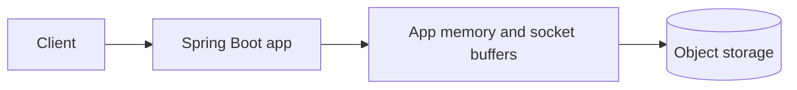
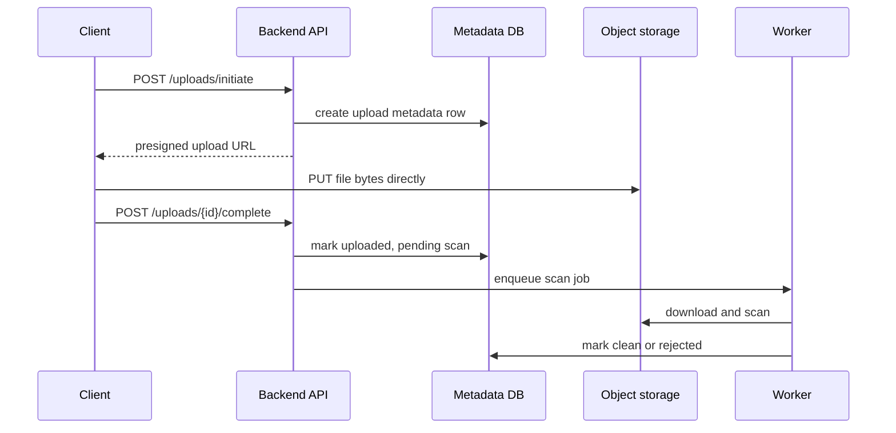
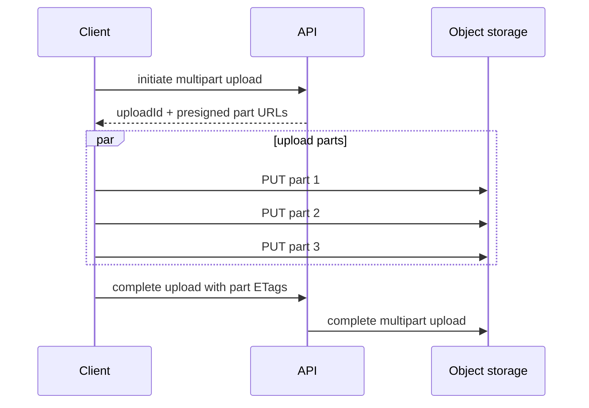

## Prerequisites: Before You Begin

You should already know:

- HTTP request bodies and status codes.
- Authentication and authorization basics.
- Database metadata modeling.
- Background jobs and message queues.
- CDN and cache fundamentals.

---

# Phase 1: Ground Floor (Why Files Are Different)

A JSON request is usually small. A file can be megabytes or gigabytes. If every upload flows through your Spring Boot application, your app threads, memory, disk, and network bandwidth become the bottleneck.



Better design:



The backend controls permission and metadata. The object store handles large bytes.

---

# Phase 2: The Naive Upload (The App Meltdown)

```java
@PostMapping("/avatar")
public AvatarResponse upload(@RequestParam MultipartFile file) throws IOException {
    byte[] bytes = file.getBytes();
    imageService.resize(bytes);
    storageClient.putObject("avatars/" + file.getOriginalFilename(), bytes);
    return new AvatarResponse("ok");
}
```

Production failures:

| Failure | Why it happens |
| --- | --- |
| OutOfMemoryError | `file.getBytes()` loads entire file into heap. |
| Thread starvation | slow clients hold servlet threads during upload. |
| Filename collision | two users upload `avatar.png`. |
| Security issue | file extension is trusted instead of content validation. |
| Malware delivery | file is public before scanning. |
| Broken retry | client retry creates duplicate metadata or overwrites object. |

---

# Phase 3: Data Model

```sql
CREATE TABLE upload_object (
    id uuid PRIMARY KEY,
    owner_id uuid NOT NULL,
    bucket text NOT NULL,
    object_key text NOT NULL UNIQUE,
    original_filename text NOT NULL,
    content_type text NOT NULL,
    size_bytes bigint NOT NULL,
    checksum_sha256 text,
    status text NOT NULL CHECK (status IN (
        'INITIATED',
        'UPLOADED',
        'SCAN_PENDING',
        'CLEAN',
        'REJECTED',
        'DELETED'
    )),
    created_at timestamptz NOT NULL DEFAULT now(),
    updated_at timestamptz NOT NULL DEFAULT now()
);

CREATE INDEX idx_upload_object_owner_created
    ON upload_object (owner_id, created_at DESC);
```

Object key strategy:

```java
public final class ObjectKeys {

    public static String userUpload(UUID ownerId, UUID uploadId, String extension) {
        return "users/%s/uploads/%s/original.%s"
                .formatted(ownerId, uploadId, extension.toLowerCase(Locale.ROOT));
    }
}
```

Never use raw user filenames as object keys.

---

# Phase 4: Presigned Upload Flow

```java
@Service
public class UploadService {

    private final UploadRepository uploads;
    private final ObjectStorageSigner signer;

    public UploadService(UploadRepository uploads, ObjectStorageSigner signer) {
        this.uploads = uploads;
        this.signer = signer;
    }

    @Transactional
    public InitiateUploadResponse initiate(UserId owner, InitiateUploadRequest request) {
        UploadObject upload = UploadObject.initiated(
                owner,
                request.originalFilename(),
                request.contentType(),
                request.sizeBytes()
        );

        uploads.save(upload);

        URI uploadUrl = signer.presignPut(
                upload.bucket(),
                upload.objectKey(),
                upload.contentType(),
                Duration.ofMinutes(10)
        );

        return new InitiateUploadResponse(upload.id(), uploadUrl);
    }
}
```

The presigned URL should be:

- Short-lived.
- Bound to an object key.
- Bound to method `PUT` or multipart part upload.
- Limited by the permissions of the signer identity.
- Paired with expected content type, size, and checksum when possible.

---

# Phase 5: Multipart Upload

Large files should use multipart upload.



Why this matters:

| Benefit | Explanation |
| --- | --- |
| Retry one part | Failed part does not restart whole upload. |
| Parallelism | Multiple parts upload at once. |
| Large objects | Object store handles assembly. |
| Checksums | Corruption can be detected per part and for whole object. |

---

# Phase 6: Security And Delivery

## Upload Security Checklist

| Risk | Defense |
| --- | --- |
| User uploads executable content | validate type, scan content, restrict delivery headers |
| Malware goes public | keep status private until scan passes |
| User overwrites another file | unique object keys and owner authorization |
| Huge upload drains resources | enforce size limits before signing |
| Presigned URL leaks | short expiry and narrow permissions |
| Private file is cached publicly | correct CDN cache and authorization strategy |

## Line-by-Line Presigned Upload Reading

```json
{
  "method": "PUT",
  "url": "https://storage.example/uploads/user-42/avatar.png?signature=abc",
  "headers": {
    "Content-Type": "image/png",
    "x-amz-server-side-encryption": "AES256"
  },
  "expiresInSeconds": 300,
  "maxBytes": 5242880
}
```

- `method: PUT` means the client uploads the object bytes directly to storage. Your application server does not proxy the file body.
- `url` contains a short-lived signature. Anyone with this URL can upload until it expires, so never log it carelessly.
- `Content-Type` must be part of the signed policy if you depend on it. Otherwise a client can upload a different type than the UI promised.
- `x-amz-server-side-encryption` asks storage to encrypt the object at rest.
- `expiresInSeconds: 300` limits the theft window to 5 minutes.
- `maxBytes` prevents a user from uploading a 20 GB object through a URL intended for an avatar.

Proof drill: try uploading after expiry, with the wrong content type, and with a body larger than `maxBytes`. All three attempts should fail before the object becomes visible to readers.

## Download Patterns

| Pattern | Use when |
| --- | --- |
| Public CDN URL | public images, assets, product photos |
| Presigned GET URL | private downloads with time-limited access |
| Backend streaming | strict audit or transformation required |
| CDN signed URL/cookie | private large media at scale |

---

# Phase 7: Senior Interview Ace

| Junior answer | Senior answer |
| --- | --- |
| "Upload file to backend then save it." | "For large files, I keep bytes off the app server using presigned direct upload and store metadata in the database." |
| "Store the URL in DB." | "Store object key, owner, size, checksum, status, scan state, and lifecycle metadata. URLs can be generated." |
| "Use S3." | "Object storage solves durable blob storage, but I still need auth, malware scanning, multipart upload, metadata consistency, CDN delivery, and deletion policy." |
| "Make the file public." | "Files should remain private until validation and scan pass. Delivery strategy depends on privacy and cache behavior." |

## Debug Checklist

- Are users uploading through app heap or direct to object storage?
- Are object keys generated safely?
- Is metadata created before upload and finalized after upload?
- Are size, content type, and checksum validated?
- Is malware scanning asynchronous but enforced before public access?
- Are failed multipart uploads aborted?
- Are deleted objects handled in storage and metadata?
- Does CDN caching respect privacy?

## Practice Tasks

1. Design avatar upload with presigned PUT URLs.
2. Add upload metadata states from `INITIATED` to `CLEAN`.
3. Add a fake virus scanner worker.
4. Add multipart upload for files larger than 100 MB.
5. Add private download through presigned GET URLs.

## Done Checklist

- [ ] You can explain why large uploads should bypass app servers.
- [ ] You can design metadata tables for objects.
- [ ] You can secure presigned upload and download URLs.
- [ ] You can explain multipart upload.
- [ ] You can design scan, CDN, deletion, and lifecycle flows.
