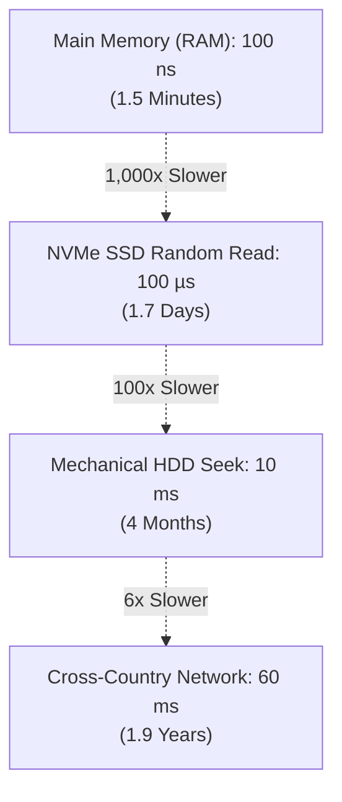
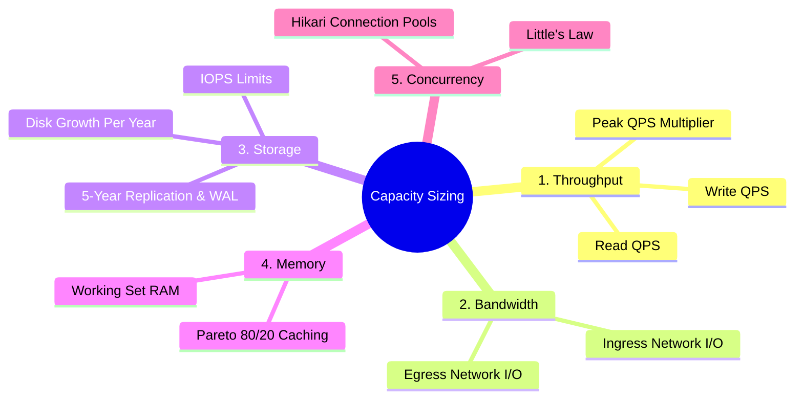

# Back-of-the-Envelope Capacity Estimation

In software architecture, designing without numbers is merely guessing.

Engineers who do not calculate capacity either **over-engineer** (deploying a 20-broker Kafka cluster and multi-region sharded Cassandra for an internal tool handling 5 requests per second) or **under-engineer** (building an analytics dashboard that exhausts database connection pools and runs out of disk storage in two months).

Back-of-the-envelope calculations provide orders-of-magnitude estimates ($O(10^x)$) that dictate core architectural choices:
- Single PostgreSQL instance vs Distributed NoSQL cluster.
- In-memory cache layer vs direct database reads.
- Synchronous HTTP vs Asynchronous message streaming.
- Cloud object store (S3) vs block storage (EBS).

---

## Latency Numbers Every Engineer Must Know

In 2012, Jeff Dean (Google Fellow) published a canonical set of hardware latencies. Updated for modern NVMe and DDR5 hardware, these numbers illustrate why caching and network topology dictate system performance:

| Operation | Latency (ns) | Human-Scale Equivalent (1 ns = 1 sec) |
| :--- | :--- | :--- |
| **L1 CPU Cache Reference** | 0.5 - 1.0 ns | 1 second (a single heartbeat) |
| **Branch Mispredict** | 3 - 5 ns | 3 - 5 seconds |
| **L2 CPU Cache Reference** | 4 - 7 ns | 7 seconds |
| **Mutex Lock / Unlock** | 15 - 25 ns | 25 seconds |
| **Main Memory (DDR5 RAM) Read** | 80 - 100 ns | 1.5 minutes |
| **Compress 1 KB with Snappy** | 2,000 ns (2 µs) | 33 minutes |
| **Send 1 KB over 10 Gbps LAN** | 10,000 ns (10 µs) | 2.7 hours |
| **Read 1 MB sequentially from RAM** | 250,000 ns (250 µs) | 2.9 days |
| **Random NVMe SSD Read** | 50,000 - 150,000 ns (50 - 150 µs) | 1.7 days |
| **Read 1 MB sequentially from NVMe** | 1,000,000 ns (1 ms) | 11.5 days |
| **Hard Disk Drive (HDD) Seek** | 10,000,000 ns (10 ms) | 4 months |
| **Read 1 MB sequentially from HDD** | 20,000,000 ns (20 ms) | 8 months |
| **Intra-Datacenter Network Round-Trip** | 500,000 ns (0.5 ms) | 5.8 days |
| **Cross-Country Round-Trip (US East to West)** | 60,000,000 ns (60 ms) | 1.9 years |
| **Transatlantic Packet Round-Trip (NYC to London)** | 150,000,000 ns (150 ms) | 4.75 years |

<Tip>
**Architectural Takeaways**:
1. **RAM is 1,000x faster than NVMe SSD**. Reading from Redis in memory takes under 1ms, whereas fetching unindexed random rows from disk costs orders of magnitude more.
2. **Network cross-datacenter round-trips are millions of times slower than memory**. Avoid sequential remote network calls inside database transactions.
</Tip>

---

## Mathematical Cheat Sheet & Powers of Two

### Binary vs Decimal Prefixes

| Power | Binary (IEC) | Decimal (SI) | Order of Magnitude |
| :--- | :--- | :--- | :--- |
| **$2^{10}$** | 1 KiB (1,024 B) | 1 KB ($10^3$ B) | Thousand (Kilo) |
| **$2^{20}$** | 1 MiB (1,048,576 B) | 1 MB ($10^6$ B) | Million (Mega) |
| **$2^{30}$** | 1 GiB (1,073,741,824 B) | 1 GB ($10^9$ B) | Billion (Giga) |
| **$2^{40}$** | 1 TiB | 1 TB ($10^{12}$ B) | Trillion (Tera) |
| **$2^{50}$** | 1 PiB | 1 PB ($10^{15}$ B) | Quadrillion (Peta) |

### Time Conversions
- 1 day = $24 \times 60 \times 60 = 86,400\text{ seconds}$.
- **Rounding Shortcut for Interviews**: Round $86,400 \approx 100,000$ ($10^5$) seconds. This creates an error margin of only 13%, which is well within standard architectural tolerance.
- 1 million requests per day:
  $$\text{Average QPS} = \frac{1,000,000}{86,400} \approx 11.6 \text{ requests/sec}$$
  $$\text{Quick Estimate} = \frac{10^6}{10^5} = 10 \text{ requests/sec}$$
- 1 billion requests per month:
  $$\text{Requests per day} = \frac{1,000,000,000}{30} \approx 33.3\text{ million/day}$$
  $$\text{Average QPS} = \frac{33,333,333}{86,400} \approx 385 \text{ requests/sec}$$

---

## The 5-Dimensional Sizing Framework

To fully size any backend system, calculate the following 5 dimensions:

### 1. Throughput & QPS (Queries Per Second)

$$QPS_{\text{avg}} = \frac{\text{Daily Requests}}{86,400}$$

#### Peak Traffic Multiplier ($k$)
Traffic is never uniform across 24 hours. A lunchtime rush, evening entertainment peak, or promotional email flash sale causes sudden spikes:
- **Consumer Global Services (Google, Netflix)**: $k = 2\text{x}$ to $3\text{x}$ average QPS.
- **Regional Enterprise / Workday Apps (Slack, Jira)**: $k = 4\text{x}$ to $6\text{x}$ average QPS (idle at night, intense 9 AM - 5 PM).
- **Flash Sales & Ticketing (Black Friday, Ticketmaster)**: $k = 10\text{x}$ to $50\text{x}$ average QPS.

$$QPS_{\text{peak}} = QPS_{\text{avg}} \times k$$

---

### 2. Bandwidth (Network I/O)

Bandwidth represents the physical network pipe required to service incoming payloads (Ingress) and outgoing responses (Egress).

$$\text{Ingress Bandwidth} = \text{Write QPS}_{\text{peak}} \times \text{Average Request Payload Size}$$
$$\text{Egress Bandwidth} = \text{Read QPS}_{\text{peak}} \times \text{Average Response Payload Size}$$

<Warning>
**The Bits vs Bytes Trap**:
Network engineers and cloud providers (AWS, GCP, Cloudflare) quote bandwidth in **Gigabits per second (Gbps)**. Software engineers size data in **Gigabytes (GB)**.
$$\text{Gigabits per second (Gbps)} = \text{Gigabytes per second (GB/s)} \times 8$$
A 10 Gbps network interface can sustain a theoretical maximum of $1.25\text{ GB/s}$ throughput.
</Warning>

---

### 3. Storage & IOPS Sizing

$$\text{Raw Daily Storage} = \text{Daily Writes} \times \text{Average Record Size}$$
$$\text{5-Year Storage} = \text{Raw Daily Storage} \times 365 \times 5$$

#### Real-World Storage Multipliers
Raw data is only a fraction of total disk utilization:
1. **Replication Factor**: Standard cloud databases replicate to 3 availability zones ($3\text{x}$).
2. **Index Overhead**: B-Tree and GIN indexes typically consume an additional $30\% - 50\%$ of raw table storage ($1.3\text{x}$ to $1.5\text{x}$).
3. **PostgreSQL WAL & Compaction Buffer**: Databases require at least $20\% - 30\%$ unallocated disk space to perform VACUUM, schema migrations, and write-ahead logging without freezing ($1.25\text{x}$).

$$\text{Total Production Disk} = \text{5-Year Storage} \times 3 \times 1.4 \times 1.25 \approx \text{5-Year Storage} \times 5.25$$

#### IOPS (Input/Output Operations Per Second)
Disk throughput depends on both byte volume and random access frequency:
- **Mechanical SATA HDD**: 75 - 150 IOPS.
- **AWS EBS gp3 SSD**: 3,000 IOPS base (configurable up to 16,000 IOPS).
- **AWS EBS io2 Block Express**: Up to 256,000 IOPS.
- **NVMe Direct-Attached SSD**: 500,000 - 1,000,000 IOPS.

If your database write workload generates 12,000 random unbuffered writes/sec, a standard AWS EBS gp3 volume will queue requests, driving p99 write latencies from 2ms to 2,000ms.

---

### 4. Memory & Caching (The Pareto Principle)

In nearly all read-heavy systems, access frequency follows a power-law distribution: the **Pareto Principle (80/20 Rule)**.
Approximately **20% of content generates 80% of read traffic**.

> [!TIP]
> **Example Working Set Calculation**:
> - Daily Active Reads: $100{,}000{,}000\text{ requests}$
> - Average Object Size: $2\text{ KB}$
> - Total Daily Read Volume: $100\text{M} \times 2\text{ KB} = 200\text{ GB}$
> - **Working Set (80/20 Rule)**: $200\text{ GB} \times 0.20 = 40\text{ GB RAM}$
> - **With Redis Jitter & Object Overhead ($1.3\times$)**: $40\text{ GB} \times 1.3 \approx 52\text{ GB RAM}$

---

### 5. Concurrency & Little's Law

**Little's Law** is a foundational theorem in queuing theory that determines how many requests a server or thread pool must process concurrently at any given instant:

$$L = \lambda \times W$$

Where:
- $L$ = Average number of concurrent requests in the system.
- $\lambda$ = Arrival rate (Requests Per Second).
- $W$ = Average response time / latency (seconds).

> [!NOTE]
> **Little's Law Example**:
> - Peak Arrival Rate ($\lambda$): $5{,}000\text{ requests/sec}$
> - Average Service Latency ($W$): $40\text{ ms} = 0.040\text{ seconds}$
> - Concurrent In-Flight Load:
>   $$L = 5{,}000 \times 0.040 = 200\text{ concurrent requests}$$

#### Application Sizing with Little's Law
- If each Spring Boot application instance has **200 Tomcat worker threads**, a single instance running at 40ms latency could theoretically handle the entire load ($L=200$).
- If downstream database latency degrades from 40ms to 400ms ($10\text{x}$ increase):
  $$L = 5,000 \times 0.400 = 2,000 \text{ concurrent threads}$$
  The application thread pools will instantly saturate, causing connection refusal and HTTP 504 Gateway Timeouts.

#### HikariCP Connection Pool Math
A cluster of 15 API containers, each configured with HikariCP `maximum-pool-size: 20`, will maintain:
$$15 \times 20 = 300 \text{ concurrent database connections}$$

If the primary PostgreSQL server is configured with `max_connections = 200`, new containers or spikes will be rejected with:
`FATAL: sorry, too many clients already`.
You must introduce **PgBouncer** connection pooling or reduce HikariCP pool sizes.

---

## Production Sizing Walkthrough: Global Photo Sharing Service

Let's work through a full architectural sizing interview for a global Instagram-like photo sharing service:

### Input Requirements
- **Daily Active Users (DAU)**: 100 million.
- **Photos Posted**: Each active user posts an average of 0.1 photos/day (10 million photos/day).
- **Feed Browsing**: Each active user views 50 photos/day ($100\text{M} \times 50 = 5\text{ billion}$ photo views/day).
- **Read/Write Ratio**: $5,000,000,000 : 10,000,000 = 500 : 1$ (Extremely read-heavy).
- **Average Photo Size**: 500 KB (JPEG compressed).
- **Metadata per Photo**: 1 KB (User ID, caption, geolocation, timestamps).

---

### Step 1: Throughput Calculations

$$\text{Write QPS}_{\text{avg}} = \frac{10,000,000 \text{ photos}}{86,400\text{ s}} \approx 116 \text{ writes/sec}$$
$$\text{Write QPS}_{\text{peak}} = 116 \times 3 \approx 350 \text{ writes/sec}$$

$$\text{Read QPS}_{\text{avg}} = \frac{5,000,000,000 \text{ views}}{86,400\text{ s}} \approx 57,870 \text{ reads/sec}$$
$$\text{Read QPS}_{\text{peak}} = 57,870 \times 2 \approx 115,740 \text{ reads/sec}$$

---

### Step 2: Bandwidth Calculations

$$\text{Ingress Bandwidth (Writes)} = 350 \text{ writes/sec} \times 500 \text{ KB} = 175,000 \text{ KB/s} \approx 175 \text{ MB/s}$$
$$\text{In Gigabits} = 175 \times 8 \approx 1.4 \text{ Gbps Ingress}$$

$$\text{Egress Bandwidth (Reads)} = 115,740 \text{ reads/sec} \times 500 \text{ KB} = 57,870,000 \text{ KB/s} \approx 57.8 \text{ GB/s}$$
$$\text{In Gigabits} = 57.8 \times 8 \approx 462.4 \text{ Gbps Egress}$$

<Info>
**Architecture Decision**:
A backend server cluster cannot and should not handle 462 Gbps of egress image traffic. Photos **must** be stored on object storage (AWS S3) and fronted by a global Content Delivery Network (Cloudflare, AWS CloudFront) with edge caching to absorb 95% of egress traffic.
</Info>

---

### Step 3: Storage Calculations (5 Years)

#### 1. Binary Media Storage (S3)
$$\text{Daily Media} = 10,000,000 \times 500 \text{ KB} = 5,000,000 \text{ MB} = 5 \text{ TB/day}$$
$$\text{5-Year Media Storage} = 5 \text{ TB/day} \times 365 \times 5 = 9,125 \text{ TB} \approx 9.1 \text{ PB}$$

#### 2. Metadata Database Storage (PostgreSQL / Cassandra)
$$\text{Daily Metadata} = 10,000,000 \times 1 \text{ KB} = 10 \text{ GB/day}$$
$$\text{5-Year Raw Metadata} = 10 \text{ GB/day} \times 365 \times 5 = 18.25 \text{ TB}$$
$$\text{With Replication (3x) and Indexes (1.4x)} = 18.25 \times 3 \times 1.4 \approx 76.6 \text{ TB}$$

---

### Step 4: Cache Calculations (RAM)
Applying the Pareto 80/20 rule to daily photo views:
$$\text{Daily Read Traffic} = 5 \text{ billion views/day}$$
$$\text{Unique Photos Viewed (assuming 20% cached)} = 1,000,000,000 \text{ requests}$$
If we cache the metadata of the top 20% of daily photos in Redis:
$$\text{Top 20% Metadata} = 2,000,000 \text{ photos} \times 1 \text{ KB} = 2 \text{ GB RAM}$$

If we also cache the top 20% of actual image binaries on regional CDN edge nodes:
$$\text{CDN Edge Cache} = 2,000,000 \text{ photos} \times 500 \text{ KB} = 1,000,000 \text{ MB} = 1 \text{ TB RAM across global edge}$$

---

## Production Sizing Summary Cheat Sheet

| Metric | Calculation Shortcut | Example (10M DAU) |
| :--- | :--- | :--- |
| **Average QPS** | $\text{Daily Requests} / 100,000$ | $10\text{M} / 100\text{k} = 100 \text{ QPS}$ |
| **Peak QPS** | $\text{Average QPS} \times 2$ to $5$ | $100 \times 3 = 300 \text{ Peak QPS}$ |
| **Daily Storage** | $\text{Daily Writes} \times \text{Payload Size}$ | $1\text{M writes} \times 1\text{ KB} = 1\text{ GB/day}$ |
| **1-Year Raw Storage** | $\text{Daily Storage} \times 365$ | $1\text{ GB} \times 365 \approx 365\text{ GB/yr}$ |
| **5-Year Production Storage** | $\text{1-Yr} \times 5 \times 3 \text{ (repl)} \times 1.4 \text{ (idx)}$ | $365 \times 21 \approx 7.6\text{ TB}$ |
| **80/20 Cache RAM** | $\text{Daily Reads} \times 0.20 \times \text{Size} \times 1.3$ | $10\text{M} \times 0.2 \times 1\text{KB} \times 1.3 \approx 2.6\text{ GB}$ |
| **Active Concurrent Requests** | $L = \text{Peak QPS} \times \text{Latency (sec)}$ | $3,000 \times 0.050\text{s} = 150 \text{ threads}$ |
| **Ingress/Egress Bandwidth** | $\text{QPS} \times \text{Payload Size} \times 8 \text{ bits}$ | $1,000 \text{ QPS} \times 100\text{KB} \times 8 = 800\text{ Mbps}$ |

---

## Active Recall & Interview Mastery

<AccordionGroup>
  <Accordion title="1. Why should you round 86,400 seconds to 100,000 seconds during system design interviews?">
    System design capacity estimation is an exercise in finding orders of magnitude ($O(10^x)$), not calculating accounting precision. Rounding $86,400 \approx 100,000$ ($10^5$) introduces an error of only 13.6%, which is completely negligible compared to the uncertainty of real-world user adoption (which can vary by 200% - 500%). Calculating with $10^5$ allows instant mental arithmetic without wasting critical interview time on long division.
  </Accordion>

  <Accordion title="2. What is Little's Law, and how does it determine thread pool exhaustion?">
    Little's Law states that the average number of concurrent requests in a system ($L$) equals the arrival rate ($\lambda$) multiplied by the average latency ($W$): $L = \lambda \times W$. If a service handles 2,000 QPS with a healthy 20ms database latency, it requires $2,000 \times 0.020 = 40$ concurrent worker threads. However, if a downstream database locks up and latency spikes to 2,000ms, the required concurrency explodes to $2,000 \times 2.0 = 4,000$ threads. Because standard web servers have thread pools capped at 200-500 threads, the pool completely exhausts within milliseconds, causing the service to crash.
  </Accordion>

  <Accordion title="3. Why must binary storage (videos/images) and metadata storage be separated in high-scale systems?">
    Binary media files are large (500 KB to 500 MB), immutable, and sequential streams that do not require transactional ACID guarantees or B-tree indexing. Placing large BLOBs inside relational databases bloats table pages, pollutes the buffer pool cache, degrades index scans, and makes database backups astronomically slow. Relational or NoSQL databases should store only lightweight structured metadata (IDs, URLs, timestamps), while media binaries reside on cheap, durable, distributed object storage (AWS S3) fronted by CDNs.
  </Accordion>

  <Accordion title="4. How do you convert storage throughput (MB/s) to network bandwidth (Gbps)?">
    Multiply the Megabytes per second by 8 to get Megabits per second (since there are 8 bits in a byte), and then divide by 1,000 to convert to Gigabits per second. For example, $125 \text{ MB/s} \times 8 = 1,000 \text{ Mbps} = 1 \text{ Gbps}$. Confusing bits and bytes is a major interview error that causes engineers to undersize network links by an order of magnitude.
  </Accordion>

  <Accordion title="5. How does the 80/20 Pareto rule affect Redis memory sizing?">
    In almost all internet applications, 20% of items generate 80% of read traffic (e.g., trending tweets, viral videos, popular e-commerce products). Instead of provisioning expensive RAM to hold 100% of all data, engineers cache only the top 20% working set. When sized properly with an LRU (Least Recently Used) eviction policy, this 20% cache achieves an 80% hit rate, shielding the underlying database from 80% of read load at a fraction of hardware cost.
  </Accordion>
</AccordionGroup>
