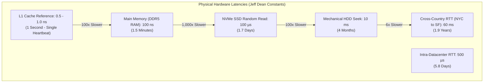
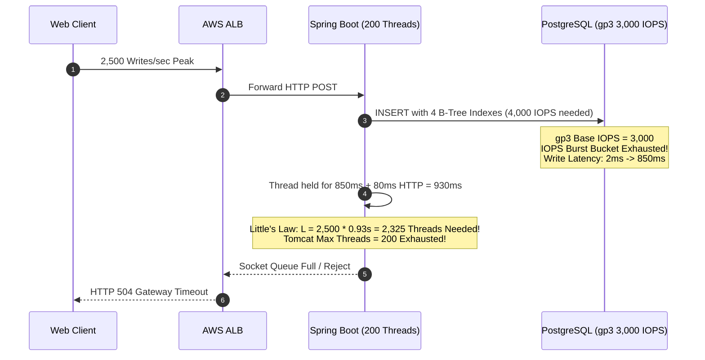
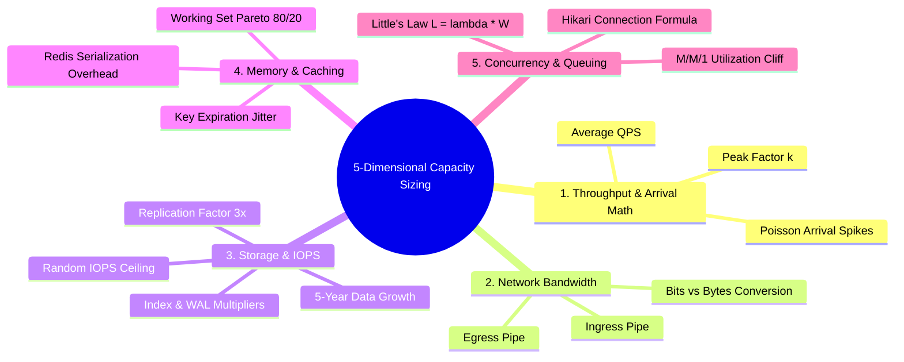
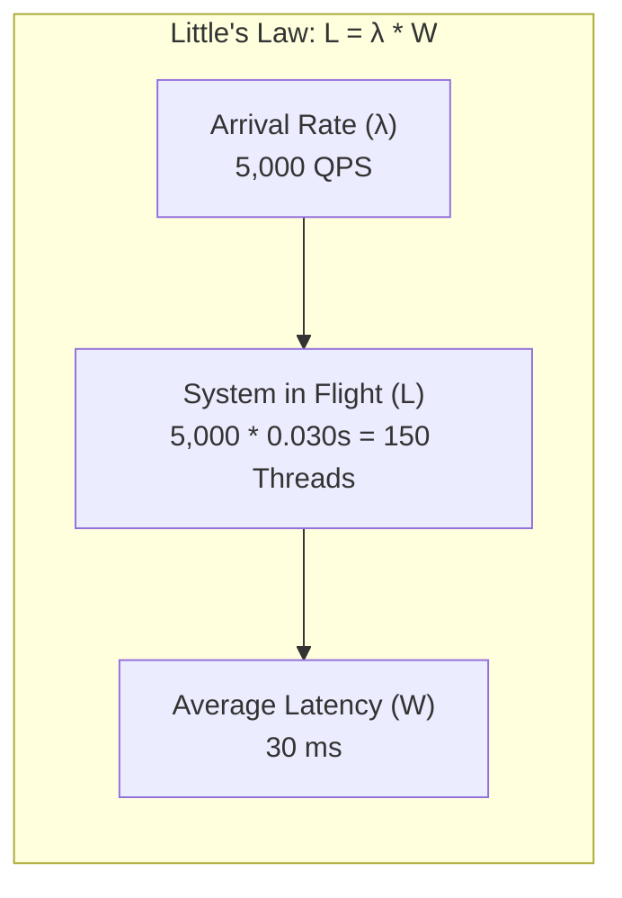
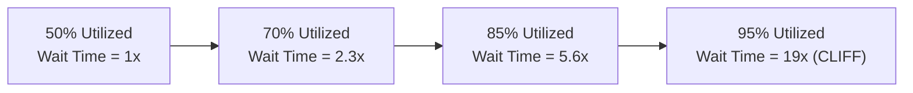
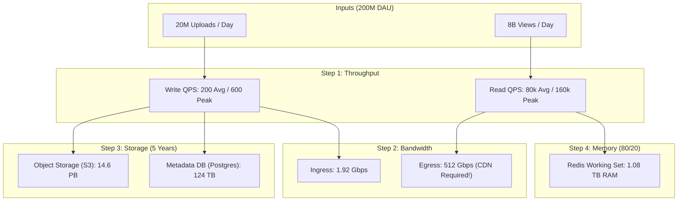
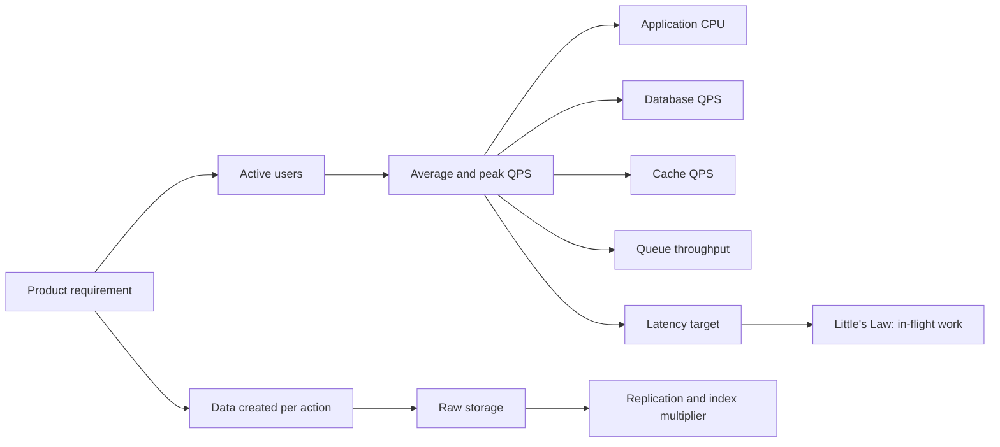

# Back-of-the-Envelope Capacity Estimation

In software architecture, designing without numbers is merely guessing.

Engineers who do not calculate capacity either **over-engineer** (deploying a 20-broker Kafka cluster and multi-region sharded Cassandra for an internal tool handling 5 requests per second) or **under-engineer** (building an analytics dashboard that exhausts database connection pools, burns through disk IOPS, and runs out of storage within three weeks).

Back-of-the-envelope calculations provide orders-of-magnitude estimates ($O(10^x)$) that dictate foundational architectural choices:
- Single PostgreSQL instance vs Distributed NoSQL cluster.
- In-memory cache layer vs direct database reads.
- Synchronous HTTP vs Asynchronous message streaming.
- Cloud object store (S3) vs block storage (EBS).

---

## Phase 1: Ground Floor (Physical First Principles)

Before calculating queries per second or gigabytes, an architect must understand the physical constraints of bare-metal silicon, magnetic media, optical fiber, and kernel memory buffers. 

Every remote API call, database query, and cached key-value lookup translates into physical signals propagating through silicon gates and fiber cables.



### The Hardware Latency Hierarchy (Normalized to Human Scale)

In 2012, Google Fellow Jeff Dean published a canonical set of hardware latencies. Updated for modern NVMe, DDR5, and 100GbE hardware, these numbers illustrate why caching and network topology dictate system survival. 

To visualize the immense gap between memory, disk, and network, scale **1 nanosecond (0.000000001s) up to 1 second (one human heartbeat)**:

| Operation | Physical Latency (ns) | Human-Scale Equivalent (1 ns = 1 sec) | Architectural Implication |
| :--- | :--- | :--- | :--- |
| **L1 CPU Cache Reference** | 0.5 - 1.0 ns | 1 second | CPU register and cache alignment is nearly instantaneous. |
| **Branch Mispredict** | 3 - 5 ns | 3 - 5 seconds | Pipeline flushes cost cycles; branchless code wins in tight loops. |
| **L2 CPU Cache Reference** | 4 - 7 ns | 7 seconds | Cache lines are 64 bytes; spatial locality avoids bus transfers. |
| **Mutex Lock / Unlock** | 15 - 25 ns | 25 seconds | Uncontended locks are fast; contented locks cause kernel transitions. |
| **Main Memory (DDR5 RAM) Read** | 80 - 100 ns | 1.5 minutes | Fetching a random pointer from RAM is 100x slower than L1 cache. |
| **Compress 1 KB with Snappy** | 2,000 ns (2 µs) | 33 minutes | In-memory compression trades CPU cycles to save network bandwidth. |
| **Send 1 KB over 10 Gbps LAN** | 10,000 ns (10 µs) | 2.7 hours | Intra-rack network communication is cheap but not free. |
| **Read 1 MB sequentially from RAM** | 250,000 ns (250 µs) | 2.9 days | Sequential memory streaming leverages hardware prefetchers. |
| **Random NVMe SSD Read** | 50,000 - 150,000 ns (50 - 150 µs) | 1.7 days | **Disk is 1,000x slower than RAM**. Unindexed random reads kill databases. |
| **Read 1 MB sequentially from NVMe** | 1,000,000 ns (1 ms) | 11.5 days | Sequential SSD scans are 100x faster than random reads. |
| **Hard Disk Drive (HDD) Seek** | 10,000,000 ns (10 ms) | 4 months | Mechanical arm movement is astronomically slow. |
| **Intra-Datacenter Network Round-Trip** | 500,000 ns (0.5 ms) | 5.8 days | Microservices chatting across availability zones accumulate milliseconds. |
| **Cross-Country Round-Trip (US East to West)** | 60,000,000 ns (60 ms) | 1.9 years | Speed of light in fiber ($\approx 200,000\text{ km/s}$) sets a hard physical lower bound. |
| **Transatlantic Packet Round-Trip (NYC to London)** | 150,000,000 ns (150 ms) | 4.75 years | WAN network round-trips destroy synchronous request-response chains. |

---

## Phase 2: The Naive Code (The Production Crash)

A startup building a clickstream event tracking API ran a synthetic load test. A single 8-core Spring Boot server processed 2,000 requests/sec with an average latency of 2ms. Satisfied with these micro-benchmark numbers, the team deployed the system to production on a single AWS `t4g.xlarge` instance connected to an AWS RDS PostgreSQL instance with an unprovisioned `gp3` 100 GB SSD.

Three weeks later, during a marketing product launch, the service collapsed. Latencies spiked from 2ms to 30,000ms, CPU climbed to 100%, and the load balancer returned HTTP 504 Gateway Timeouts for 90% of requests.

### The Naive Implementation

```java
@RestController
@RequestMapping("/api/v1/events")
public class NaiveEventController {

    private final EventRepository eventRepository;
    private final RestTemplate restTemplate;

    public NaiveEventController(EventRepository eventRepository, RestTemplate restTemplate) {
        this.eventRepository = eventRepository;
        this.restTemplate = restTemplate;
    }

    // NAIVE: Holds open an expensive database connection while performing synchronous HTTP calls!
    @PostMapping
    @Transactional
    public ResponseEntity<Void> recordEvent(@RequestBody EventPayload payload) {
        // 1. Save raw uncompressed 4 KB JSON payload directly into PostgreSQL
        EventEntity entity = new EventEntity();
        entity.setUserId(payload.userId());
        entity.setEventType(payload.eventType());
        entity.setPayloadJson(payload.rawJson()); // 4 KB text
        entity.setCreatedAt(Instant.now());
        
        eventRepository.save(entity);

        // 2. Synchronous outbound verification call to third-party fraud service
        // Downstream latency: 80ms
        FraudResponse response = restTemplate.postForObject(
            "https://fraud-api.partner.internal/verify", payload, FraudResponse.class
        );

        return ResponseEntity.accepted().build();
    }
}
```

### Why the System Crashed: The Math They Didn't Do



1. **The IOPS Meltdown**:
   - Each `INSERT` updated 4 B-Tree indexes (User ID, Event Type, Created At, Composite).
   - Each index update requires modifying an 8 KB leaf page in the database engine.
   - At 1,000 writes/sec, the database required $1,000 \times 4 = 4,000\text{ random write IOPS}$.
   - The default AWS `gp3` storage volume provides only **3,000 base IOPS**.
   - Once the burst credit balance depleted, disk write latency exploded from 1.5ms to 850ms.

2. **The Little's Law Thread Exhaustion**:
   - The team calculated: *"Tomcat has 200 worker threads. Each request takes 2ms, so one server handles $200 / 0.002 = 100,000\text{ QPS}$."*
   - But when disk latency surged to 850ms, plus the 80ms synchronous fraud HTTP call, total request latency ($W$) reached $930\text{ ms} = 0.93\text{ seconds}$.
   - By Little's Law ($L = \lambda \times W$), at an arrival rate of 2,500 QPS:
     $$L = 2,500 \times 0.93 = 2,325 \text{ concurrent threads required}$$
   - Tomcat's 200 worker threads saturated in under 100 milliseconds. All subsequent requests queued in the TCP socket backlog and timed out.

3. **The Unplanned Storage Eviction**:
   - Payload: 4 KB JSON.
   - Traffic: 1,000 writes/sec $\times 86,400\text{ sec/day} = 86.4\text{ million writes/day}$.
   - Daily Raw Storage: $86.4\text{M} \times 4\text{ KB} = 345.6\text{ GB/day}$.
   - The 100 GB SSD filled up completely in **less than 8 hours**, triggering a hard PostgreSQL kernel crash.

---

## Phase 3: Under the Hood (The Complete Sizing Mathematical Blueprint)

To design resilient architectures, you must master the **5-Dimensional Sizing Framework**:



---

### Dimension 1: Throughput, Traffic Profiles & Peak Factors

$$\text{Average QPS} = \frac{\text{Daily Requests}}{86,400}$$

#### The 100,000 Interview Shortcut
In an interview or back-of-the-napkin planning session, **round 86,400 seconds to 100,000 ($10^5$) seconds**.
- Calculating $\frac{10,000,000}{86,400} = 115.74\text{ QPS}$ wastes 3 minutes of mental arithmetic.
- Calculating $\frac{10^7}{10^5} = 100\text{ QPS}$ takes 2 seconds.
- The error margin is only **13.6%**, which is negligible given that user adoption estimates are rarely accurate within 50%.

#### Peak Factor Multipliers ($k$)
Traffic is never evenly distributed across a 24-hour cycle:

| Workload Type | Peak Multiplier ($k$) | Real-World Example |
| :--- | :--- | :--- |
| **Global Consumer App (24/7 Follow-the-Sun)** | $2\times - 3\times$ | YouTube, Spotify, WhatsApp |
| **Regional Consumer App (Evening Spike)** | $4\times - 6\times$ | DoorDash, Netflix, Uber |
| **Enterprise / B2B SaaS (Business Hours)** | $5\times - 8\times$ | Slack, Jira, Workday |
| **Flash Sale / Event-Driven / Ticketing** | $10\times - 50\times$ | Ticketmaster, Black Friday, Sneaker Drops |

$$\text{Peak QPS} = \text{Average QPS} \times k$$

---

### Dimension 2: Network Bandwidth (The Bits vs Bytes Trap)

Cloud infrastructure, transit providers, and Network Interface Cards (NICs) are provisioned in **Gigabits per second (Gbps)**. Storage and application payloads are calculated in **Gigabytes (GB)**.

$$\text{Bandwidth (Gbps)} = \frac{\text{Throughput (GB/s)} \times 8\text{ bits}}{1\text{ Byte}}$$

$$\text{Ingress Bandwidth} = \text{Write QPS}_{\text{peak}} \times \text{Average Request Size} \times 8$$
$$\text{Egress Bandwidth} = \text{Read QPS}_{\text{peak}} \times \text{Average Response Size} \times 8$$

<Warning>
**The Network Interface Saturation Rule**:
A standard cloud virtual machine (e.g., AWS EC2 `m5.large`) has a baseline network bandwidth limit of **0.75 Gbps to 1.25 Gbps**. If your read API serves 5,000 QPS with 50 KB JSON responses:
$$\text{Bandwidth} = 5,000 \times 50\text{ KB} \times 8 = 2,000,000\text{ Kbps} = 2\text{ Gbps}$$
The virtual machine's network card will silently drop packets, introducing massive TCP retransmissions and artificial latency spikes.
</Warning>

---

### Dimension 3: Storage & IOPS Multipliers

Calculating raw record size multiplied by writes yields only a fraction of real production disk usage. You must apply the **Four Storage Multipliers**:

$$\text{Total Storage} = \text{Raw Data} \times M_{\text{rep}} \times M_{\text{idx}} \times M_{\text{wal}} \times M_{\text{headroom}}$$

1. **Replication Multiplier ($M_{\text{rep}} = 3.0$)**: High availability requires 1 Primary + 2 Read Replicas across distinct Availability Zones.
2. **Index Overhead Multiplier ($M_{\text{idx}} = 1.4$)**: B-Trees, foreign keys, and timestamps typically consume 30% to 50% of the raw table size.
3. **Write-Ahead Log & Compaction ($M_{\text{wal}} = 1.25$)**: PostgreSQL WAL segments, Cassandra SSTable compactions, and RocksDB write buffers require temporary unallocated disk space.
4. **Safety Headroom Multiplier ($M_{\text{headroom}} = 1.3$)**: Storage volumes must never exceed 70% capacity to prevent file system fragmentation and performance collapse.

$$\text{Combined Storage Multiplier} \approx 3.0 \times 1.4 \times 1.25 \times 1.3 \approx \mathbf{6.8\times}$$

#### IOPS Sizing (The Random vs Sequential Rule)
- **Mechanical HDD**: 75 - 150 random IOPS.
- **AWS EBS gp3 SSD**: 3,000 base IOPS (scalable to 16,000 IOPS).
- **AWS EBS io2 Block Express**: Up to 256,000 IOPS.
- **Direct-Attached NVMe SSD**: 500,000 - 1,000,000 IOPS.

If your database write workload requires 10,000 random page updates per second, provisioning standard EBS gp3 without paying for provisioned IOPS will instantly destroy application throughput.

---

### Dimension 4: Memory & Caching (Pareto 80/20 & Redis Overhead)

In consumer applications, data access follows a power-law distribution: the **Pareto Principle (80/20 Rule)**.
**20% of items generate 80% of read traffic.**

To shield the database from read overload, size your in-memory cache (Redis, Memcached) to hold this active working set:

$$\text{Active Daily Working Set} = \text{Daily Unique Reads} \times 0.20 \times \text{Average Object Size}$$

#### The Redis Serialization Tax ($1.35\times$)
In-memory key-value stores do not store raw data without overhead. Every entry in Redis incurs:
- `robj` (Redis Object) metadata header: 16 bytes.
- Dict entry pointer overhead: 24 - 32 bytes.
- `jemalloc` memory allocation page rounding.
- Key name storage.

**Rule of Thumb**: Always multiply your raw cache payload size by **$1.35\times$** to account for memory fragmentation and metadata overhead.

---

### Dimension 5: Concurrency, Little's Law & Queuing Saturation

**Little's Law** governs every bounded concurrent system in engineering:

$$L = \lambda \times W$$

- $L$ = Average number of concurrent requests being processed in the system.
- $\lambda$ = Arrival rate (Requests Per Second).
- $W$ = Average time a request spends in the system (Latency in seconds).



#### The Queuing Utilization Cliff (Kingman's Formula)
Why does a system feel healthy at 70% CPU utilization, but completely collapse at 90% CPU?

In queuing theory (M/M/1 queue), average wait time $T_q$ is given by:

$$T_q \propto \frac{\rho}{1 - \rho}$$

Where $\rho$ is the system utilization ($0.0 \le \rho < 1.0$).



When utilization passes 85%, wait times diverge toward infinity. Never size server capacity for 100% steady-state utilization; always target **60% to 70% maximum utilization** at peak.

#### HikariCP Connection Pool Math
A classic question: *"How many database connections does my Spring Boot service need?"*

The HikariCP engineering team proved that large connection pools degrade throughput due to CPU context switching and disk spindle thrashing:

$$\text{Pool Size} = (\text{CPU Cores} \times 2) + \text{Effective Spindle Count}$$

For a database server with 16 vCPU cores and an NVMe array (spindles = 1):
$$\text{Optimal Pool Size} = (16 \times 2) + 1 = 33 \text{ connections}$$

If you have 20 application pods, each configured with `maximum-pool-size: 50`, they will attempt to open $20 \times 50 = 1,000$ connections against a database that can physically only process 33 queries concurrently. The database will spend 90% of its CPU cycles context switching between client sockets.

---

## Production Sizing Blueprint: Global Photo & Video Service

Let's apply the complete 5-dimensional framework to an Instagram/TikTok scale backend system design interview.

### 1. Requirements & Assumptions
- **Daily Active Users (DAU)**: 200 million.
- **Photos Posted**: 10% of users post 1 photo per day ($200\text{M} \times 0.1 = 20\text{ million photos/day}$).
- **Feed Views**: Each user browses 40 photos/videos per day ($200\text{M} \times 40 = 8\text{ billion views/day}$).
- **Read/Write Ratio**: $8,000,000,000 : 20,000,000 = 400 : 1$ (Massively read-heavy).
- **Average Photo Size**: 400 KB (JPEG compressed).
- **Metadata Record**: 500 bytes (Photo ID, User ID, S3 URL, dimensions, timestamp).
- **Retention Period**: 5 years.

---

### 2. Sizing Calculations



#### Step 1: Throughput Calculations (Using the 100k Shortcut)
- **Write QPS**:
  $$\text{Write QPS}_{\text{avg}} = \frac{20,000,000}{100,000} = 200 \text{ writes/sec}$$
  $$\text{Write QPS}_{\text{peak}} = 200 \times 3 = 600 \text{ writes/sec}$$
- **Read QPS**:
  $$\text{Read QPS}_{\text{avg}} = \frac{8,000,000,000}{100,000} = 80,000 \text{ reads/sec}$$
  $$\text{Read QPS}_{\text{peak}} = 80,000 \times 2 = 160,000 \text{ reads/sec}$$

#### Step 2: Bandwidth Calculations
- **Ingress (Writes)**:
  $$\text{Ingress} = 600 \text{ writes/sec} \times 400 \text{ KB} = 240,000 \text{ KB/s} = 240 \text{ MB/s}$$
  $$\text{In Gbps} = 240 \text{ MB/s} \times 8 = \mathbf{1.92\text{ Gbps}}$$
- **Egress (Reads)**:
  $$\text{Egress} = 160,000 \text{ reads/sec} \times 400 \text{ KB} = 64,000,000 \text{ KB/s} = 64 \text{ GB/s}$$
  $$\text{In Gbps} = 64 \text{ GB/s} \times 8 = \mathbf{512\text{ Gbps}}$$

<Tip>
**Architectural Consequence**:
No origin backend cluster should ever attempt to serve 512 Gbps of static media. You must direct all binary image traffic to Amazon S3 fronted by a global CDN (Cloudflare / CloudFront) with a 95%+ cache hit ratio. The origin backend services only metadata API calls ($160,000 \times 500\text{ bytes} \times 8 = 640\text{ Mbps}$).
</Tip>

#### Step 3: Storage Calculations (5 Years)
- **Binary Media Storage (Object Store / S3)**:
  $$\text{Daily Media} = 20,000,000 \times 400 \text{ KB} = 8,000,000 \text{ MB} = 8 \text{ TB/day}$$
  $$\text{5-Year Media} = 8 \text{ TB/day} \times 365 \times 5 = 14,600 \text{ TB} \approx \mathbf{14.6\text{ PB}}$$
- **Metadata Database Storage (PostgreSQL / ScyllaDB)**:
  $$\text{Daily Metadata} = 20,000,000 \times 500 \text{ bytes} = 10 \text{ GB/day}$$
  $$\text{5-Year Raw Metadata} = 10 \text{ GB/day} \times 365 \times 5 = 18.25 \text{ TB}$$
  $$\text{With Production Multipliers (6.8x)} = 18.25 \text{ TB} \times 6.8 \approx \mathbf{124.1\text{ TB Disk}}$$

#### Step 4: Memory & Caching (Pareto 80/20 Working Set)
- Daily read requests: 8 billion views.
- Applying 80/20 rule: 20% of photos generate 80% of reads.
- Unique photos viewed per day: Assume $20\% \times 8\text{B} = 1.6\text{ billion}$ cache lookups.
- Daily active photo metadata working set to cache in Redis:
  $$\text{Cached Objects} = 1.6\text{ billion} \times 500 \text{ bytes} = 800 \text{ GB RAM}$$
  $$\text{With Redis Memory Overhead (1.35x)} = 800 \text{ GB} \times 1.35 \approx \mathbf{1.08\text{ TB RAM}}$$
- Sizing the cluster: Deploy an AWS ElastiCache Redis cluster of **16 nodes with 68 GB RAM each** (`cache.r6g.2xlarge`).

### Line-by-Line Capacity Reading: One Feature Estimate

Capacity math becomes easier when every line has a unit:

```python
daily_likes = 50_000_000              # likes/day
average_qps = daily_likes / 86_400    # 579 writes/sec
peak_qps = average_qps * 5            # 2,895 writes/sec
payload_bytes = 120                   # bytes/request
peak_bandwidth_bits = peak_qps * payload_bytes * 8
concurrent_requests = peak_qps * 0.080 # p95 latency = 80 ms, result = 232
```

- `daily_likes` is a product assumption, not an infrastructure fact. Say who gave you the number.
- Dividing by `86,400` converts day traffic into average seconds. This hides peaks, so it is only the baseline.
- `* 5` is the peak multiplier. Social apps, flash sales, and notification bursts may need much higher factors.
- `payload_bytes` must include headers, JSON overhead, and metadata if you are sizing network links seriously.
- `* 8` converts bytes to bits. Forgetting this creates an 8x bandwidth error.
- `concurrent_requests = arrival_rate * latency` is Little's Law. This number tells you how many in-flight requests your workers, connection pools, and queues must tolerate.

Proof drill: after launch, compare this estimate with real p95 latency, QPS, payload size, HikariCP active connections, and queue depth. The point of estimation is to create falsifiable starting numbers.

---

## Capacity Estimation Fundamentals Drill

Capacity estimation is not a memorization game. It is the discipline of turning vague product traffic into physical pressure on CPU, memory, disk, network, queues, caches, and database connections.



### The 8 Questions You Must Always Ask

| Question | Why it matters | Backend pressure created |
| --- | --- | --- |
| How many users? | Establishes the traffic base. | Request volume |
| What percentage are active daily? | Monthly users do not all arrive at once. | Daily active load |
| How many actions per active user? | Converts humans into operations. | QPS |
| What is the peak multiplier? | Production dies during peaks, not averages. | Peak QPS |
| What is the read/write ratio? | Reads and writes scale differently. | Cache and DB design |
| How much data per write? | Storage grows from bytes, not feature names. | Disk, WAL, backup size |
| What latency is promised? | Lower latency means less queueing room. | Threads, connections, replicas |
| What must survive failure? | Redundancy multiplies resources. | Replication, regions, cost |

### Worked Mini Example: Photo Likes

Assume:

- 20 million monthly active users.
- 25% daily active users.
- Each daily user performs 40 read actions and 4 write actions.
- Peak traffic is 5x average.
- Each write creates 200 bytes of logical data before indexes and replication.

Step by step:

```markdown
DAU = 20,000,000 * 0.25 = 5,000,000 users/day
Read actions/day = 5,000,000 * 40 = 200,000,000 reads/day
Write actions/day = 5,000,000 * 4 = 20,000,000 writes/day

Average read QPS = 200,000,000 / 86,400 = 2,315 reads/sec
Average write QPS = 20,000,000 / 86,400 = 231 writes/sec

Peak read QPS = 2,315 * 5 = 11,575 reads/sec
Peak write QPS = 231 * 5 = 1,155 writes/sec
```

Storage:

```markdown
Logical write data/day = 20,000,000 * 200 bytes = 4 GB/day
With 3x replication = 12 GB/day
With 2x index overhead = 24 GB/day
One year = 24 GB * 365 = 8.76 TB/year
```

Concurrency with Little's Law:

```markdown
If peak read QPS = 11,575
and p95 service time = 80 ms = 0.08 seconds
in-flight read work = 11,575 * 0.08 = 926 concurrent requests
```

That number is why thread pools, connection pools, queue depth, and backpressure matter. If each request holds a database connection for the full 80 ms, the database is now expected to support nearly 1,000 concurrent connections, which is usually wrong. A senior answer immediately asks how much of that work can be served from cache, precomputed views, CDN edges, or asynchronous queues.

### What A Shallow Answer Misses

| Shallow answer | Deeper answer |
| --- | --- |
| "We need 10 servers." | "We need to compute peak QPS, CPU per request, memory working set, database QPS, and failure headroom before choosing server count." |
| "Use cache." | "Cache helps read QPS only if the access pattern has locality and invalidation is acceptable." |
| "Use Kafka for writes." | "A queue smooths bursts, but it adds lag. The user-facing write path must decide whether async durability is acceptable." |
| "Use more database replicas." | "Replicas scale reads, not single-primary write throughput. Replica lag also changes consistency behavior." |

### Interview Answer Template

Use this shape when you are asked to estimate any backend system:

1. Clarify product scale and traffic assumptions.
2. Convert users into average QPS.
3. Apply peak multiplier.
4. Split reads, writes, and background jobs.
5. Estimate storage with replication, indexes, backups, and retention.
6. Use Little's Law to estimate concurrency.
7. Identify the first bottleneck.
8. Propose architecture changes only after the numbers justify them.

### Build-Break-Fix Drill

Build:

```markdown
Create a spreadsheet or small script for one feature:
users -> DAU -> actions/day -> QPS -> peak QPS -> storage/day -> 1 year storage
```

Break:

```markdown
Change peak multiplier from 3x to 20x.
Change read p95 latency from 50 ms to 500 ms.
Change retention from 30 days to 7 years.
```

Fix:

```markdown
Explain which part fails first:
application thread pool, database connections, WAL volume, disk capacity, network egress, or queue lag.
```

## Phase 4: Senior Interview Ace (Junior vs Staff Phrasing)

When capacity estimation questions arise in system design interviews, interviewers listen for specific engineering maturity signals:

| Evaluation Aspect | Junior Developer Answer | Senior / Staff Engineer Answer |
| :--- | :--- | :--- |
| **Arithmetic Precision** | Spends 5 minutes doing manual long division: *"8,000,000,000 divided by 86,400 is exactly 92,592.59 QPS."* | Uses orders of magnitude: *"I'll use the standard 100,000-second shortcut: 8B / 100k gives 80,000 average QPS, with a 2x peak factor of 160,000 QPS. This keeps our math fast while remaining well within real-world estimation variance."* |
| **Storage Sizing** | Multiplies raw record size by 5 years and stops: *"10 GB a day times 365 times 5 is 18.25 TB of database storage."* | Accounts for production reality: *"Raw storage is 18.25 TB, but in production we must apply the 6.8x multiplier: 3x replication factor across AZs, 40% B-Tree index overhead, WAL logs, and a 30% disk headroom buffer, bringing physical provisioned disk to ~124 TB."* |
| **Network Sizing** | Confuses bits and bytes: *"Our egress is 64 GB/s, so we need a 64 Gbps internet connection."* | Correctly converts network units: *"64 Gigabytes per second translates to $64 \times 8 = 512\text{ Gbps}$ of egress bandwidth. Because an origin cluster cannot cost-effectively handle half a terabit of egress, we must offload media binaries to Amazon S3 fronted by a CDN with a 95%+ cache hit ratio."* |
| **Concurrency & Latency** | Assumes server thread pools scale infinitely: *"We have 10 servers with 200 threads each, so we can handle 2,000 requests at any moment."* | Applies Little's Law and queuing theory: *"With $L = \lambda \times W$, thread consumption is bounded by downstream latency. If database latency degrades from 20ms to 200ms, our concurrency demand jumps 10x from 200 to 2,000 threads, instantly saturating worker pools. We must enforce tight timeouts and circuit breakers."* |
| **Database Connection Sizing** | Sets `maximum-pool-size: 100` on 20 pods: *"More database connections mean higher concurrency and better performance."* | Applies physical hardware constraints: *"PostgreSQL performs best when active connections approximate $(2 \times \text{cores}) + \text{disks}$. Setting 2,000 client connections causes kernel CPU thrashing. We should cap HikariCP pools at 10-15 per pod and deploy PgBouncer for transaction-level connection multiplexing."* |

---

## Active Recall & Interview Mastery

<AccordionGroup>
  <Accordion title="1. Why is the 100,000-second shortcut universally accepted by senior interviewers?">
    A day has 86,400 seconds. Dividing by 86,400 introduces mental friction and arithmetic errors during a fast-paced 45-minute architectural interview. Rounding $86,400 \approx 100,000$ ($10^5$) introduces an error of only 13.6%. Because real-world business assumptions (DAU growth, user activity, read/write ratios) have error margins of 50% to 200%, the 13.6% computational variance is completely inconsequential. Interviewers value architectural velocity and trade-off depth over accounting precision.
  </Accordion>

  <Accordion title="2. How do you mathematically prove that a service will crash using Little's Law?">
    Little's Law states $L = \lambda \times W$. If a service handles an arrival rate of $\lambda = 5,000\text{ QPS}$ with normal service latency of $W = 0.040\text{ seconds}$ (40ms), the system holds $L = 5,000 \times 0.040 = 200\text{ concurrent requests}$. If a downstream dependency stalls and latency increases to $W = 0.800\text{ seconds}$ (800ms), concurrency explodes to $L = 5,000 \times 0.800 = 4,000\text{ concurrent requests}$. If the application server's worker thread pool is bounded at 400 threads, the pool will completely saturate within 80 milliseconds, causing subsequent incoming connections to queue and fail with 504 Gateway Timeouts.
  </Accordion>

  <Accordion title="3. Why can an origin server cluster not serve video/image binaries directly at scale?">
    Network bandwidth and socket buffers. Serving 100,000 reads/sec of 500 KB images requires $100,000 \times 500\text{ KB} \times 8 = 400\text{ Gbps}$ of continuous network egress. A top-tier AWS EC2 instance supports 25 to 100 Gbps, requiring massive fleet over-provisioning purely for socket I/O. Furthermore, holding HTTP connections open to stream large payloads across slow mobile cellular links ties up server thread pools and socket memory. Directing clients to download directly from S3 via pre-signed URLs or global CDNs completely decouples media bandwidth from compute resources.
  </Accordion>

  <Accordion title="4. What are the four storage multipliers that convert raw data size to physical disk provisioning?">
    1. **Replication Multiplier ($3.0\times$)**: Primary plus two cross-AZ replicas for durability and automatic failover.
    2. **Index Multiplier ($1.3\times - 1.5\times$)**: B-Tree and GIN indexes required to maintain $O(\log N)$ query performance.
    3. **WAL / Compaction Multiplier ($1.25\times$)**: Write-ahead logging buffers, temporary sort files, and storage compaction headroom.
    4. **Safety Headroom Multiplier ($1.3\times$)**: File systems and database storage engines degrade exponentially when disk usage exceeds 70-80%.
    Combined, these factors mean raw data size must be multiplied by **approximately $6.5\times - 7\times$** when budgeting physical cloud block storage.
  </Accordion>

  <Accordion title="5. Why does system latency spike exponentially past 85% utilization?">
    According to Kingman's formula in queuing theory, the average waiting time in a queue is proportional to $\frac{\rho}{1 - \rho}$, where $\rho$ is the utilization factor. As utilization approaches $1.0$ (100%), the denominator $(1 - \rho)$ approaches zero, driving queue wait times toward infinity. Even minor arrival bursts cannot be absorbed when servers operate at near-capacity, resulting in cascading request backlogs and eventual timeouts.
  </Accordion>
</AccordionGroup>
