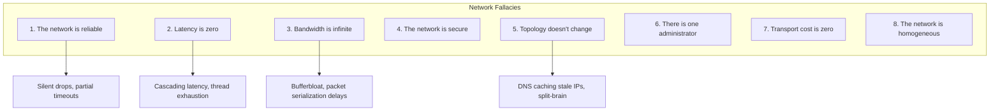
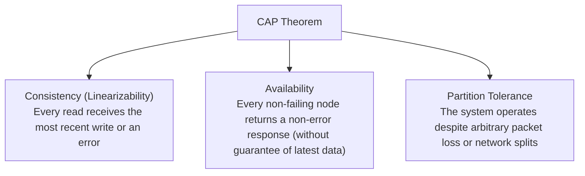
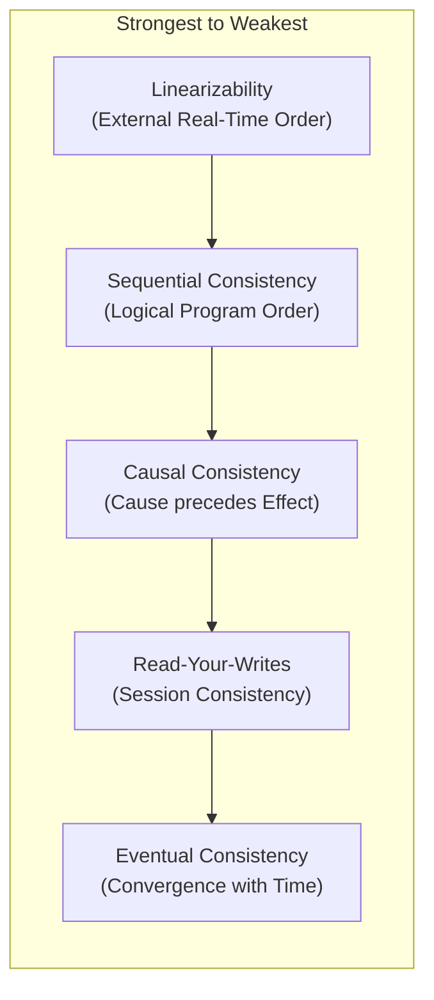
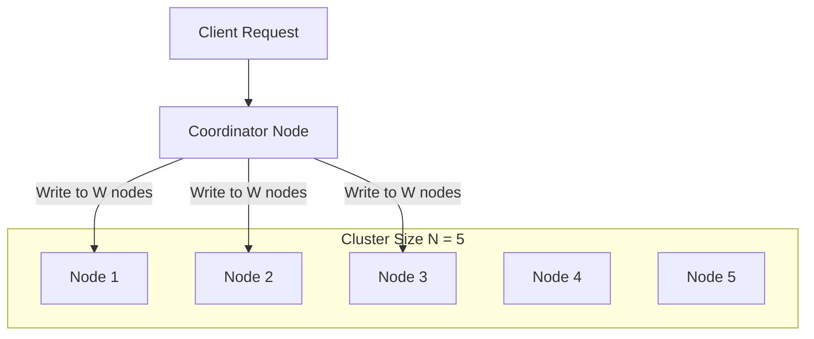
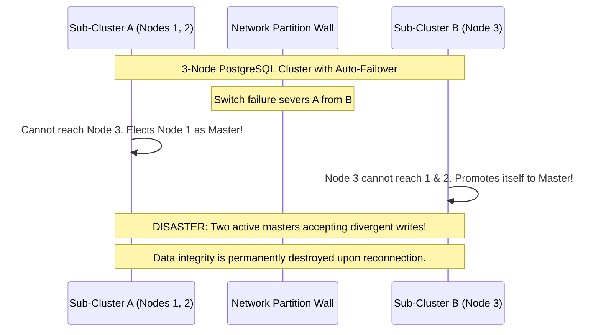
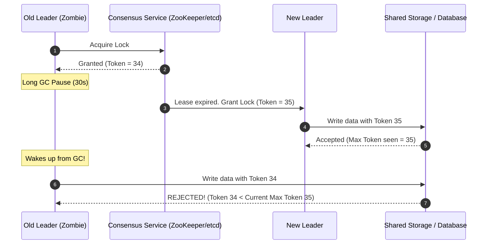
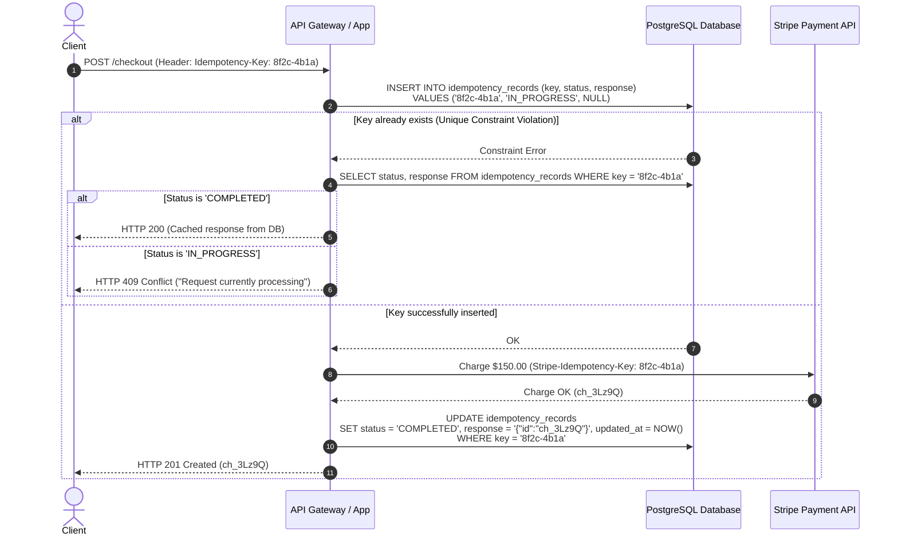
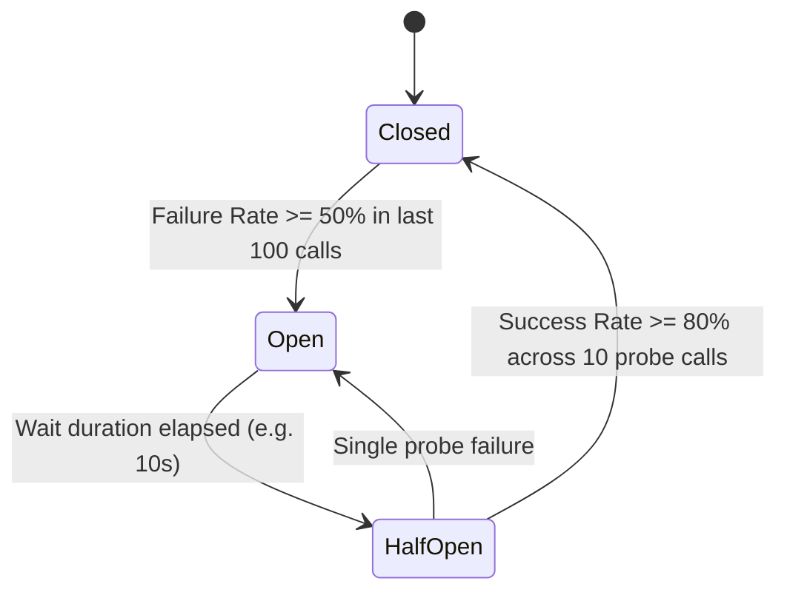

# Consistency Models, Failure Modes & Distributed Resilience

In a single-process application on a single machine, memory access is instantaneous, CPU instructions execute in predictable order, and failure is binary: either the process is running, or it crashed.

In a distributed backend, **partial failure is the default state**.
Networks drop packets, switches reset, garbage collection pauses freeze threads for seconds, disks stall, and cloud instances vanish without warning. A system of 50 microservices across 200 nodes will experience component degradation every single hour.

This guide provides an exhaustive, production-grade manual for designing distributed systems that preserve data integrity and remain available when underlying networks and machines fail.

---

## The 8 Fallacies of Distributed Computing

In 1994, Peter Deutsch and James Gosling articulated the 8 fundamental false assumptions that backend engineers make when transitioning from monoliths to networked services. Every distributed bug stems from violating one of these:



<Warning>
**The Golden Rule of Distributed Backends**:
Never assume an HTTP, gRPC, or database call failed just because you received a timeout. The request may have succeeded on the remote node, but the response packet was dropped on the return path. Every remote operation must be designed for partial execution and retried safely.
</Warning>

---

## CAP vs PACELC Theorem

### The True Meaning of CAP

Formulated by Eric Brewer and formally proven by Seth Gilbert and Nancy Lynch, the CAP theorem establishes the boundaries of distributed data stores:



#### Why "Pick 2 Out of 3" is a Myth
You **cannot** choose "CA". Physical networks cannot guarantee zero packet loss. Fiber cables get severed, cloud VPC routers fail, and hardware switches drop frames. Therefore, **Partition Tolerance (P) is non-negotiable**.

When a network partition ($P$) occurs, you face an inescapable architectural choice:
1. **Consistency (CP)**: Cancel or refuse the operation to ensure stale or conflicting data is never read or written. Latency spikes or users receive HTTP 503 errors, sacrificing Availability.
2. **Availability (AP)**: Accept the write or return stale data from whichever isolated partition the user reaches. The data will diverge, sacrificing Strong Consistency.

### The PACELC Extension

In 2012, Daniel Abadi recognized that CAP only describes system behavior **during an active network partition**, which occurs less than 0.1% of the time. What trade-offs govern the remaining 99.9% of normal operations?

PACELC states:
$$\text{If } \mathbf{P} \text{ (Partition): Choose } \mathbf{A} \text{ or } \mathbf{C}; \quad \mathbf{E} \text{ (Else / Normal): Choose } \mathbf{L} \text{ or } \mathbf{C}$$

```text
+---------------------+-----------------------+-------------------------+
| System              | Partition Behavior    | Normal Behavior         |
|                     | (P/A or P/C)          | (E/L or E/C)            |
+---------------------+-----------------------+-------------------------+
| PostgreSQL / MySQL  | PC                    | EC                      |
| (Sync Replication)  | Block writes if sync  | Waits for replica ACK   |
|                     | replica is isolated   | before returning        |
+---------------------+-----------------------+-------------------------+
| Apache Cassandra /  | PA                    | EL                      |
| AWS DynamoDB        | Accept writes locally | Returns local replica   |
| (Default Config)    | to preserve uptime    | data immediately        |
+---------------------+-----------------------+-------------------------+
| MongoDB (Primary +  | PC                    | EC                      |
| Majority WriteConcern)| Rejects writes if   | Replicates to majority  |
|                     | primary isolated      | before returning ACK    |
+---------------------+-----------------------+-------------------------+
| Yahoo PNUTS /       | PC                    | EL                      |
| Couchbase           | Blocks writes on      | Serves reads locally    |
|                     | partition split       | with minimal latency    |
+---------------------+-----------------------+-------------------------+
```

---

## The Spectrum of Consistency Models

Consistency is not a binary choice between "instant" and "eventual". It spans a spectrum of formal guarantees:



### 1. Linearizability (Strict Consistency)
The strongest consistency model. It creates the illusion that there is only a single copy of the data in the entire universe, and all operations execute atomically at a discrete point in time between their invocation and response.
- **Clock Dependency**: Requires synchronized physical time (e.g., Google Spanner's TrueTime using atomic clocks and GPS receivers) or consensus rounds (Raft/Paxos).
- **Backend Use Cases**: Bank account balances, crypto transfers, inventory reservations, leader election leases.

### 2. Sequential Consistency
Operations do not need to be ordered by global wall-clock time, but all nodes in the cluster must see operations in the exact same sequential order, and each client's operations must appear in the order specified by its program.

### 3. Causal Consistency
Operations that are causally related must be seen by every node in the same order. Operations that are concurrent (not causally related) may be observed in different orders by different nodes.
- **Mechanisms**: Tracked using **Vector Clocks** or **Lamport Timestamps**.
- **Backend Use Cases**: Collaborative document editing (Google Docs), chat message threads where replies must never appear before the message being replied to.

### 4. Read-Your-Writes (Monotonic Read Consistency)
A pragmatic model for consumer web applications: a specific user is guaranteed to always see their own updates immediately, while other users may experience a few seconds of replication lag.
- **Implementation**: Route all reads for User $X$ to the database primary for 10 seconds following any write by User $X$, or track client write tokens in cookies.

### 5. Eventual Consistency
If no new updates are made to an object, all replicas will eventually converge to identical values.
- **Conflict Resolution Strategies**:
  1. **Last-Write-Wins (LWW)**: Uses wall-clock timestamps. Dangerous because NTP clock skew causes nodes with fast clocks to overwrite fresher data.
  2. **CRDTs (Conflict-free Replicated Data Types)**: Mathematically proven data structures (G-Counter, PN-Counter, ORSet) that merge deterministically regardless of message arrival order.

---

## Quorum Replication Math & Tunable Consistency

Distributed storage systems like Apache Cassandra, DynamoDB, and CockroachDB replicate data across $N$ physical nodes.



### The Quorum Inequality

To guarantee that a read operation always encounters the latest committed write, the read set and write set must overlap by at least one node:

$$R + W > N$$

Where:
- $N$ = Replication factor (total number of nodes storing this partition).
- $W$ = Write quorum (number of nodes that must acknowledge a write before success is returned to the client).
- $R$ = Read quorum (number of nodes that must respond to a read before returning data to the client).

```text
Example: N = 5 nodes, W = 3, R = 3
R + W = 3 + 3 = 6
Since 6 > 5, by the Pigeonhole Principle:
Any set of 3 read nodes MUST contain at least one node from the 3 write nodes!
The reader compares version timestamps and returns the freshest record.
```

### Tunable Consistency Topologies

<Tabs>
  <Tab title="Balanced Strong Quorum (W=Quorum, R=Quorum)">
    ```text
    Formula: N = 3, W = 2, R = 2  (R + W = 4 > 3)
    ```
    - **Pros**: Tolerates the failure of 1 node without losing availability or strong consistency.
    - **Performance**: Balanced read and write latencies.
    - **Use Case**: Default configuration for mission-critical e-commerce and banking datastores.
  </Tab>
  <Tab title="Fast Writes, Heavy Reads (W=1, R=N)">
    ```text
    Formula: N = 3, W = 1, R = 3  (R + W = 4 > 3)
    ```
    - **Pros**: Writes return with ultra-low latency as soon as a single node responds.
    - **Cons**: Reads are slow because every replica must respond; if even 1 node is down, reads fail.
    - **Use Case**: High-throughput telemetry ingestion where writes dominate and reads are infrequent audits.
  </Tab>
  <Tab title="Fast Reads, Heavy Writes (W=N, R=1)">
    ```text
    Formula: N = 3, W = 3, R = 1  (R + W = 4 > 3)
    ```
    - **Pros**: Reads return instantaneously from any single healthy node.
    - **Cons**: Writes fail if a single node is undergoing maintenance or network degradation.
    - **Use Case**: Content delivery, static metadata catalogs, feature flag systems.
  </Tab>
  <Tab title="Stale Reads / High Availability (R + W <= N)">
    ```text
    Formula: N = 3, W = 1, R = 1  (R + W = 2 <= 3)
    ```
    - **Pros**: Maximum possible availability and lowest latency. Both reads and writes survive multiple node failures.
    - **Cons**: Vulnerable to dirty reads, phantom reads, and lost updates.
    - **Use Case**: Social media feeds, video view counters, logging pipelines.
  </Tab>
</Tabs>

### Anti-Entropy & Read Repair
When replicas drift due to temporary network drops, two mechanisms restore convergence:
1. **Read Repair**: When a client performs a Quorum read ($R=3$), the coordinator inspects all 3 responses. If Node 3 has an older version timestamp, the coordinator returns the latest data to the client and asynchronously issues a background write to update Node 3.
2. **Anti-Entropy with Merkle Trees**: Replicas maintain cryptographic hash trees of their key ranges. Nodes periodically exchange root hashes. If roots match, replicas are identical ($O(1)$ verification). If roots differ, they traverse tree branches to locate and synchronize only the mismatched keys.

---

## Split-Brain Disasters & Distributed Consensus

### The Split-Brain Hazard
Split-brain occurs when a cluster of $N$ nodes gets bifurcated by a network partition into two disconnected segments:



### Mitigation 1: Odd-Numbered Quorums
To prevent split-brain, consensus clusters **must always consist of an odd number of nodes** ($2F + 1$, where $F$ is the number of tolerated failures):
- **3-node cluster**: Quorum is $\lfloor 3/2 \rfloor + 1 = 2$. Tolerates 1 failure. If split into $2 + 1$, only the partition with 2 nodes can achieve quorum. The isolated 1-node partition becomes read-only or shuts down.
- **5-node cluster**: Quorum is 3. Tolerates 2 failures. If split into $3 + 2$, only the 3-node partition proceeds.
- A 4-node cluster also requires 3 nodes for quorum ($\lfloor 4/2 \rfloor + 1 = 3$), meaning it still only tolerates 1 failure. Adding the 4th node increases network overhead without increasing fault tolerance.

### Mitigation 2: Fencing Tokens
Even with quorum, an old leader may experience a 30-second Stop-The-World GC pause. The rest of the cluster assumes it died and elects a new leader. When the old leader wakes up, it attempts to write to shared storage (e.g., S3 or a shared database) before discovering it was deposed.

Martin Kleppmann formulated the **Fencing Token** pattern to eliminate this hazard:



---

## Distributed Resiliency Primitives

### 1. The Idempotency Key Pattern
In distributed systems, the network guarantees **at-least-once** delivery at best. Therefore, any mutating endpoint (charges, orders, balance transfers) must enforce idempotency using unique request tokens.



#### Production Database Schema
```sql
CREATE TABLE idempotency_records (
    idempotency_key VARCHAR(128) PRIMARY KEY,
    user_id UUID NOT NULL,
    request_path VARCHAR(255) NOT NULL,
    request_hash VARCHAR(64) NOT NULL, -- SHA-256 of request payload
    status VARCHAR(32) NOT NULL,       -- IN_PROGRESS, COMPLETED, FAILED
    response_code INT,
    response_body JSONB,
    created_at TIMESTAMP WITH TIME ZONE DEFAULT CURRENT_TIMESTAMP,
    updated_at TIMESTAMP WITH TIME ZONE DEFAULT CURRENT_TIMESTAMP,
    expires_at TIMESTAMP WITH TIME ZONE NOT NULL
);

CREATE INDEX idx_idempotency_expiry ON idempotency_records(expires_at);
```

### 2. The Circuit Breaker Pattern (Resilience4j)
When a downstream service is failing, continuing to send requests will:
1. Exhaust thread pools on the calling service.
2. Overwhelm the already-struggling downstream service, preventing recovery.

The Circuit Breaker tracks error rates across a sliding window and trips open to fail fast.



#### Production Spring Boot Configuration
```yaml
resilience4j:
  circuitbreaker:
    instances:
      paymentService:
        sliding-window-type: COUNT_BASED
        sliding-window-size: 50
        minimum-number-of-calls: 20
        failure-rate-threshold: 50.0 # Trip open if 50% fail
        slow-call-rate-threshold: 70.0 # Trip open if 70% exceed slow-call-duration
        slow-call-duration-threshold: 2000ms
        wait-duration-in-open-state: 15000ms # Stay open for 15s before Half-Open
        permitted-number-of-calls-in-half-open-state: 10
        automatic-transition-from-open-to-half-open-enabled: true
        record-exceptions:
          - org.springframework.web.client.ResourceAccessException
          - java.util.concurrent.TimeoutException
          - java.io.IOException
        ignore-exceptions:
          - com.example.exception.InvalidCardException # 400 Bad Request is not a downstream outage!
```

---

## Production Failure Matrix

Every production system design must be accompanied by an exhaustive Failure Mode and Effects Analysis (FMEA):

| Component / Dependency | Failure Scenario | Detection Mechanism | Immediate Resiliency Behavior | Permanent Recovery Action |
| :--- | :--- | :--- | :--- | :--- |
| **Primary PostgreSQL** | Node crash or kernel panic | Health check fails for 3 consecutive 1s probes | Patroni / Cloud RDS triggers failover to Sync Replica; HikariCP recycles dead pool | App reconnects to new primary within 15s; alert on-call SRE |
| **Redis Cache** | Out of Memory (OOM) or network partition | Jedis / Lettuce `ConnectionException` | **Fail-Open**: Catch exception, bypass cache, query database directly with rate limiter | Alert triggers Redis memory autoscaling or node reboot |
| **Payment Gateway API** | 500 Server Errors or 15s timeouts | Circuit breaker trips open after 50% failure rate | Fallback executed: order marked `PAYMENT_PENDING`, worker schedules async retry with backoff | Background queue retries with idempotency key up to 24 hours |
| **Kafka Broker** | 1 of 3 brokers crashes | Controller triggers partition leader rebalance | Producer retries with `acks=all`; requests buffer in local memory accumulator | Surviving replicas take over partitions; zero message loss |
| **Notification Queue** | Consumer consumer group processing lag spikes | Prometheus alert: `kafka_consumergroup_lag > 50,000` | Backpressure applied: consumers scale horizontally via Kubernetes HPA | Poison-pill messages routed to DLQ; scaling resolves backlog |
| **Downstream Inventory** | Service returns HTTP 429 Too Many Requests | HTTP client detects 429 status + `Retry-After` header | Exponential backoff with full jitter applied; circuit breaker tracks concurrency | Thread pool concurrency throttled; cache reservations locally |

---

## Common Mistakes & Anti-Patterns

<Warning>
### 1. Treating Non-Idempotent Endpoints as Retriable
Retrying a timed-out `POST /api/v1/payments` without an `Idempotency-Key` is the #1 cause of duplicate customer credit card charges worldwide.
</Warning>

<Warning>
### 2. Catching and Swallowing Exceptions in Circuit Breakers
If your service code catches a `ResourceAccessException` inside a `try/catch` block and returns `null` or a default object without rethrowing or logging, the Circuit Breaker sliding window records the call as a **SUCCESS**. The circuit breaker will never trip open during an active outage!
</Warning>

<Warning>
### 3. Ignoring NTP Clock Skew in Last-Write-Wins (LWW)
Server clocks drift by dozens of milliseconds due to virtualization, network latency, and temperature changes. If Node A's clock is 50ms ahead of Node B, writes on Node B can be silently overwritten by older writes from Node A. Never rely on physical wall-clock timestamps for distributed linearizability without TrueTime hardware bounds.
</Warning>

<Warning>
### 4. Retrying Without Jitter (Thundering Herd)
When 1,000 clients experience a transient failure and all retry after exactly 2.000 seconds, they slam the downstream service in synchronization, knocking it down repeatedly. Always apply **Full Jitter**:
$$\text{Sleep} = \text{random}(0, \min(\text{MaxSleep}, \text{BaseSleep} \times 2^{\text{attempt}}))$$
</Warning>

---

## Practice Architecture Task

### The Scenario: Distributed Flash Sale Checkout
You are designing the checkout flow for a flash sale selling 10,000 gaming consoles. At 12:00:00 PM, 500,000 users click "Purchase".

```text
Requirements:
1. Inventory MUST NEVER oversell (exactly 10,000 units).
2. Payment provider has a hard limit of 500 requests/second and a 2% failure rate.
3. System must survive the loss of any single database node or message broker.
```

### Complete the Design Checklist:
- [ ] Choose CAP/PACELC configuration for inventory vs order confirmation email.
- [ ] Define the exact database concurrency control mechanism for inventory deduction (Optimistic locking vs Redis Decr vs PostgreSQL `FOR UPDATE`).
- [ ] Model the compensation saga if payment fails after inventory reservation.
- [ ] Write the idempotency record lifecycle including TTLs and error states.
- [ ] Construct the Circuit Breaker and Rate Limiter boundaries for the payment gateway integration.

---

## Active Recall & Interview Mastery

<AccordionGroup>
  <Accordion title="1. Why is it impossible to build a 'CA' distributed system in practice?">
    Network partitions are inevitable physical events (cut fiber cables, switch firmware bugs, hardware faults, OS GC pauses). Because a partition *will* happen, a distributed system cannot simply "choose not to have partitions". When a partition occurs, the system must choose between remaining available by serving potentially divergent or stale data (AP) or halting/rejecting operations to maintain consistency (CP). Therefore, systems can only be AP or CP.
  </Accordion>

  <Accordion title="2. What does the PACELC theorem add that the CAP theorem overlooks?">
    CAP only describes system behavior during an active network partition (which represents under 0.1% of operating time). PACELC extends CAP by describing the trade-off during the remaining 99.9% of normal operations: **Else (E)**, the system must choose between **Latency (L)** and **Consistency (C)**. For example, to provide strong consistency normally, a system must wait for round-trip network acknowledgments from replicas, increasing latency.
  </Accordion>

  <Accordion title="3. Explain Quorum replication math and why R + W > N guarantees consistency.">
    In a cluster of $N$ replicas, writes are acknowledged by $W$ nodes and reads require responses from $R$ nodes. If $R + W > N$, the Pigeonhole Principle dictates that the set of nodes read from and the set of nodes written to must share at least one node in common. By attaching version numbers or timestamps to records, the coordinator can always identify the most recent write from that overlapping node.
  </Accordion>

  <Accordion title="4. How do Fencing Tokens solve the GC pause / split-brain zombie leader problem?">
    When a leader experiences an extended GC pause, its lock lease expires in the consensus store (ZooKeeper/etcd), and a new leader is elected with an incremented epoch token (e.g., token 35). When the zombie leader resumes, it still believes it is leader and attempts to commit a write with its old token 34. The storage layer checks the incoming token against the highest token it has ever observed; since $34 < 35$, it rejects the zombie write.
  </Accordion>

  <Accordion title="5. Why must retries always be paired with idempotency keys in distributed systems?">
    Because network timeouts are ambiguous: the caller cannot determine whether the packet was lost on the outbound journey (server never received it) or the inbound return journey (server processed it, but the ACK dropped). Retrying a non-idempotent operation like `chargeCard()` can cause duplicate execution. An idempotency key allows the server to recognize duplicate invocations and safely return the previously cached result without re-executing the business logic.
  </Accordion>
</AccordionGroup>
