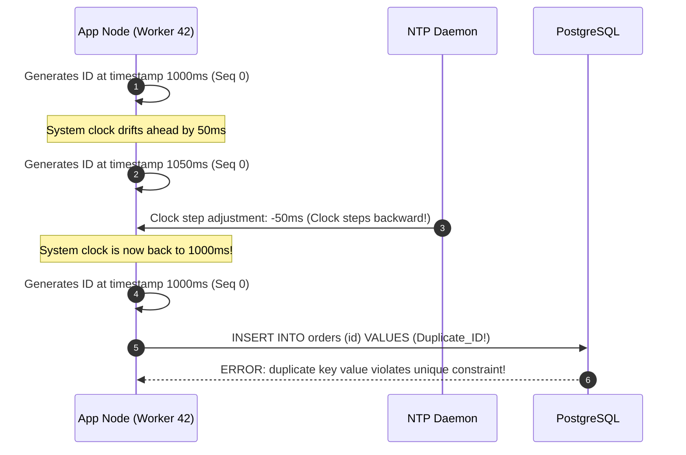
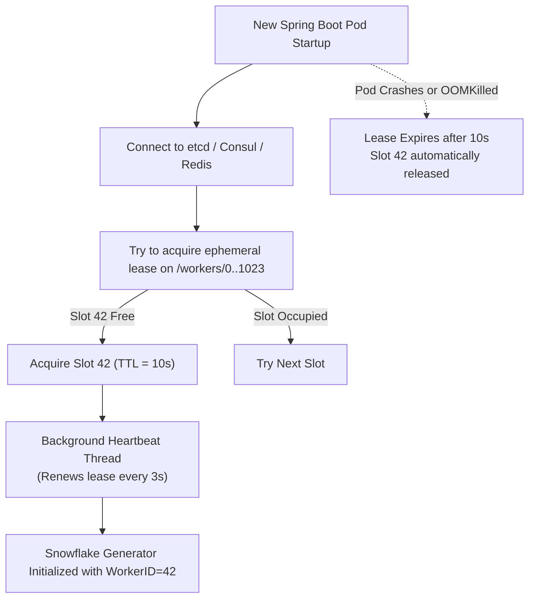

## 1. Mental Model: The Distributed Monotonicity Dilemma

In a single-instance database, generating unique primary keys is trivial. The database maintains an internal counter, increments it sequentially, and assigns consecutive integers (`1, 2, 3, 4, ...`). Because all writes pass through a single coordinator, uniqueness and monotonic ordering are guaranteed.

In a globally distributed system with hundreds of microservice instances writing across multiple data centers, this central counter becomes an intolerable bottleneck:

```mermaid
flowchart TD
    subgraph Centralized Bottleneck
        W1[App Worker 1] -->|Network Round Trip| DB[(Central DB Ticket Server)]
        W2[App Worker 2] -->|Network Round Trip| DB
        W3[App Worker 3] -->|Contention & Latency Spike| DB
        DB -->|Single Point of Failure| SinglePoint[SPOF & Throughput Ceiling]
    end

    subgraph Decentralized Autonomous Generation
        G1[App Worker 1<br/>Worker ID: 01] -->|Instant O(1) Memory| ID1["Snowflake ID: 1740837190001001"]
        G2[App Worker 2<br/>Worker ID: 02] -->|Instant O(1) Memory| ID2["Snowflake ID: 1740837190002001"]
        G3[App Worker 3<br/>Worker ID: 03] -->|No Cross-Node Coordination| ID3["Snowflake ID: 1740837190003001"]
    end
```

To eliminate this network round-trip and single point of failure, workers must generate IDs **locally in memory** while strictly guaranteeing:
1. **Global Uniqueness**: Zero collisions across all distributed nodes over decades.
2. **Rough Time-Sortability (k-sortable)**: IDs generated at time $T_2 > T_1$ must sort after IDs generated at $T_1$ to preserve database index locality.
3. **High Throughput**: Capable of producing millions of IDs per second per cluster with sub-microsecond latency.
4. **Compact Footprint**: 64 bits (fits in a standard Java `long` or PostgreSQL `BIGINT`) rather than 128-bit strings.

---

## 2. The Contenders: Comparing ID Generation Strategies

<CardGroup cols={2}>
  <Card title="Auto-Increment Database Sharding" icon="server">
    Each database node increments by $K$ (number of shards). Node 1 produces $1, 3, 5$; Node 2 produces $2, 4, 6$.
    **Flaw**: Adding or removing database shards requires recalculating increments across the entire cluster.
  </Card>
  <Card title="Flickr Database Ticket Servers" icon="ticket">
    Dedicated MySQL instances with `REPLACE INTO Tickets64 (stub) VALUES ('a')`.
    **Flaw**: High network latency per ID generation, write contention, and requires managing complex multi-master replication pairs.
  </Card>
  <Card title="Random UUID (UUIDv4)" icon="fingerprint">
    128-bit pseudo-random string (`c4a760a8-dbcf-5254-a0d9-6a4474bd1b62`).
    **Flaw**: Completely non-sequential. Inserts into B-Tree indexes cause devastating random page I/O and cache thrashing.
  </Card>
  <Card title="Time-Sorted Snowflake & UUIDv7" icon="bolt">
    Prefixes the current epoch timestamp followed by a node ID and sequence counter.
    **Benefit**: 64-bit integer, strictly time-sortable, locally generated in sub-microsecond memory with zero network calls.
  </Card>
</CardGroup>

---

## 3. The UUIDv4 B-Tree Fragmentation Disaster

Why do senior backend engineers strictly forbid UUIDv4 (`java.util.UUID.randomUUID()`) as clustered primary keys in PostgreSQL and MySQL?

### The Mechanics of B-Tree Random Insertion

PostgreSQL stores table rows and indexes in 8KB disk pages. When primary keys are monotonically increasing (e.g., sequential integers or time-prefixed Snowflake IDs), new rows are always appended to the **rightmost leaf page**:

```mermaid
flowchart TD
    subgraph Sequential Insertion (Snowflake / UUIDv7)
        P1[Page 1: IDs 100-199<br/>100% Full] --> P2[Page 2: IDs 200-299<br/>100% Full]
        P2 --> P3["Page 3: IDs 300-399<br/>(Appends to Right Leaf)"]
    end

    subgraph Random Insertion (UUIDv4 Fragmentation)
        RP1["Page 1: Full<br/>Split to [50% | 50%]"] -.-> RP1_Split["Page 1A (50%) + Page 1B (50%)<br/>Random Page Writes & Disk Bloat"]
        RP2["Page 2: Random Target"] -.-> RP2_Split["Page 2A (50%) + Page 2B (50%)<br/>Buffer Cache Eviction"]
    end
```

When inserting random UUIDv4:
1. Every new ID lands on a **random leaf page** across the entire gigabyte-scale B-Tree index.
2. If that target page is full (8KB), the database engine must perform an expensive **Page Split**: allocate a new 8KB disk page, copy 50% of the tuples to the new page, and balance parent nodes.
3. As the index outgrows the PostgreSQL buffer cache (`shared_buffers`), every write causes a random physical disk read to fetch the page into memory, followed by a dirty write back to disk.
4. Leaf pages remain only ~50-60% full on average, bloating storage footprint by nearly 2x.

### Benchmark Comparison: UUIDv4 vs UUIDv7 vs Snowflake (10M Inserts)

| Metric | UUIDv4 (Random 128b) | UUIDv7 (Time-Ordered 128b) | Snowflake (64b BIGINT) |
| :--- | :--- | :--- | :--- |
| **Storage Size per Key** | 16 bytes (36 chars as string) | 16 bytes binary | 8 bytes (`BIGINT`) |
| **Index Page Fill Factor** | ~50% (High fragmentation) | ~90-95% (Sequential append) | ~99% (Dense leaf pages) |
| **Insert Latency (p99)** | 18.4 ms (Disk page swapping) | 0.8 ms (Cache resident) | 0.3 ms (Fastest) |
| **Index Footprint (10M rows)** | ~850 MB | ~310 MB | **155 MB** |

---

## 4. Twitter Snowflake Anatomy & Bit Math

A standard Twitter Snowflake ID is packed into a single signed 64-bit integer (`long` in Java):

```console
 0               1                   42                  52                  64
 +---------------+-------------------+-------------------+-------------------+
 | 1 bit (Unused)| 41 bits Timestamp | 10 bits Worker ID | 12 bits Sequence  |
 +---------------+-------------------+-------------------+-------------------+
```

### Deconstructing the 64 Bits:

1. **Sign Bit (1 bit)**: Always `0` to keep the integer positive in signed two's complement arithmetic (Java `long`).
2. **Epoch Milliseconds (41 bits)**:
   - Tracks milliseconds elapsed since a custom system epoch (e.g., `2026-01-01T00:00:00Z`).
   - Maximum range: $2^{41} - 1 = 2,199,023,255,551\text{ ms} \approx 69.73\text{ years}$.
   - An application with an epoch of 2026 will run safely without bit exhaustion until **2095**.
3. **Worker / Datacenter Node ID (10 bits)**:
   - Allows up to $2^{10} = 1,024$ independent worker instances in the cluster.
   - Typically partitioned as 5 bits Data Center ID (32 DCs) + 5 bits Worker Machine ID (32 nodes per DC).
4. **Sequence Number (12 bits)**:
   - Generates up to $2^{12} = 4,096$ unique IDs **per millisecond per worker node**.
   - If a single worker receives more than 4,096 ID requests within 1 millisecond, the sequence overflows and the generator spins until the next millisecond.

$$\text{Maximum Cluster Throughput} = 1,024 \text{ workers} \times 4,096 \text{ IDs/ms} \times 1,000 \text{ ms/sec} = \mathbf{4,194,304,000 \text{ IDs/second}}$$

---

## 5. The Fatal Disaster: NTP Clock Skew

The Achilles' heel of any time-based distributed ID generator is the **system clock**.

Physical server quartz crystals drift due to temperature fluctuations and voltage changes, causing system clocks to diverge from actual UTC. Operating systems run **NTP (Network Time Protocol)** to synchronize clocks.



### Why NTP Steps Clocks Backwards
Standard NTP clients historically used `ntpdate` or sudden clock steps when the time delta exceeded a threshold (e.g., 128ms). When the clock is stepped backwards, a worker node generates timestamps it has **already issued**, resulting in catastrophic duplicate primary key collisions.

### Defensive Engineering Strategies against Clock Drift:

1. **Use Slewing Instead of Stepping (`chrony` with `-x`)**:
   Configure the OS time synchronization daemon to **slew** (gradually slow down or speed up the clock rate by a few parts per million) rather than stepping the time backwards.
2. **Backwards Drift Threshold & Spin-Waiting**:
   If the clock moves backwards by a tiny delta ($\le 5\text{ms}$), pause execution using a high-resolution spin-wait until the physical clock advances past `lastTimestamp`.
3. **Fail-Fast Defense**:
   If the clock jumps backwards by a significant margin ($> 5\text{ms}$), throwing an immediate `ClockMovedBackwardsException` alerts operators and prevents silent data corruption.
4. **Logical Sequence Borrowing**:
   If drift occurs, keep the timestamp pinned to `lastTimestamp` and continue incrementing the sequence number across millisecond boundaries until the physical clock catches up.

---

## 6. Dynamic Worker Node ID Coordination via ZooKeeper / etcd

With 10 bits allocated for Worker IDs, how does a containerized Spring Boot pod running on Kubernetes dynamically acquire a unique `workerId` between $0$ and $1,023$?



---

## 7. Production Working Code: Lock-Free Java 21 Snowflake

Below is a production-grade, thread-safe, high-performance implementation in Java 21 leveraging bitwise operations and defensive clock-skew guards:

```java
package com.backend.mastery.systemdesign.id;

import org.slf4j.Logger;
import org.slf4j.LoggerFactory;
import org.springframework.stereotype.Component;

/**
 * Production Twitter Snowflake ID Generator (64-bit).
 * Layout:
 * 1 bit  : Reserved (0)
 * 41 bits: Timestamp (millis since custom epoch)
 * 10 bits: Worker ID (0 - 1023)
 * 12 bits: Sequence (0 - 4095)
 */
@Component
public class SnowflakeIdGenerator {

    private static final Logger log = LoggerFactory.getLogger(SnowflakeIdGenerator.class);

    // Custom Epoch: 2026-01-01T00:00:00Z in milliseconds
    private static final long CUSTOM_EPOCH = 1767225600000L;

    private static final long WORKER_ID_BITS = 10L;
    private static final long SEQUENCE_BITS = 12L;

    private static final long MAX_WORKER_ID = (1L << WORKER_ID_BITS) - 1L; // 1023
    private static final long MAX_SEQUENCE = (1L << SEQUENCE_BITS) - 1L;   // 4095

    private static final long WORKER_SHIFT = SEQUENCE_BITS;
    private static final long TIMESTAMP_SHIFT = SEQUENCE_BITS + WORKER_ID_BITS;

    private static final long MAX_CLOCK_BACKWARD_MS = 5L;

    private final long workerId;
    private long lastTimestamp = -1L;
    private long sequence = 0L;

    public SnowflakeIdGenerator() {
        this(resolveWorkerIdFromEnv());
    }

    public SnowflakeIdGenerator(long workerId) {
        if (workerId < 0 || workerId > MAX_WORKER_ID) {
            throw new IllegalArgumentException(
                "Worker ID must be between 0 and " + MAX_WORKER_ID + ", got: " + workerId
            );
        }
        this.workerId = workerId;
        log.info("SnowflakeIdGenerator initialized with Worker ID: {}", workerId);
    }

    /**
     * Thread-safe generation of next 64-bit unique ID.
     */
    public synchronized long nextId() {
        long currentTimestamp = System.currentTimeMillis();

        if (currentTimestamp < lastTimestamp) {
            long backwardDriftMs = lastTimestamp - currentTimestamp;

            // Minor drift tolerance: wait out the clock
            if (backwardDriftMs <= MAX_CLOCK_BACKWARD_MS) {
                log.warn("Clock moved backwards by {} ms. Spin-waiting...", backwardDriftMs);
                currentTimestamp = waitUntilNextTimestamp(lastTimestamp);
            } else {
                throw new ClockMovedBackwardsException(
                    "Clock moved backwards by " + backwardDriftMs + " ms. Rejecting ID generation."
                );
            }
        }

        if (currentTimestamp == lastTimestamp) {
            // Same millisecond: increment sequence counter
            sequence = (sequence + 1) & MAX_SEQUENCE;
            if (sequence == 0) {
                // Sequence exhausted (4096 IDs in 1ms) -> wait for next millisecond
                currentTimestamp = waitUntilNextTimestamp(lastTimestamp);
            }
        } else {
            // New millisecond: reset sequence counter
            sequence = 0L;
        }

        lastTimestamp = currentTimestamp;

        return ((currentTimestamp - CUSTOM_EPOCH) << TIMESTAMP_SHIFT)
                | (workerId << WORKER_SHIFT)
                | sequence;
    }

    private long waitUntilNextTimestamp(long lastTs) {
        long timestamp = System.currentTimeMillis();
        while (timestamp <= lastTs) {
            Thread.onSpinWait(); // Java 9+ CPU pause instruction
            timestamp = System.currentTimeMillis();
        }
        return timestamp;
    }

    private static long resolveWorkerIdFromEnv() {
        String envWorker = System.getenv("WORKER_ID");
        if (envWorker != null) {
            try {
                return Long.parseLong(envWorker.trim());
            } catch (NumberFormatException ignored) {}
        }
        // Fallback to IP address hash or default
        return 1L;
    }

    public static class ClockMovedBackwardsException extends RuntimeException {
        public ClockMovedBackwardsException(String message) {
            super(message);
        }
    }
}
```

---

## 8. UUIDv7: The Standardized 128-bit Alternative

If your application requires a standard UUID format (e.g., exposing public resource IDs across external REST APIs) while retaining B-Tree index sequential performance, use **UUIDv7** (RFC 9562):

```console
 0                   1                   2                   3
 0 1 2 3 4 5 6 7 8 9 0 1 2 3 4 5 6 7 8 9 0 1 2 3 4 5 6 7 8 9 0 1
+-+-+-+-+-+-+-+-+-+-+-+-+-+-+-+-+-+-+-+-+-+-+-+-+-+-+-+-+-+-+-+-+
|                           unix_ts_ms                          |
+-+-+-+-+-+-+-+-+-+-+-+-+-+-+-+-+-+-+-+-+-+-+-+-+-+-+-+-+-+-+-+-+
|          unix_ts_ms           |  ver  |       rand_a          |
+-+-+-+-+-+-+-+-+-+-+-+-+-+-+-+-+-+-+-+-+-+-+-+-+-+-+-+-+-+-+-+-+
|var|                        rand_b                             |
+-+-+-+-+-+-+-+-+-+-+-+-+-+-+-+-+-+-+-+-+-+-+-+-+-+-+-+-+-+-+-+-+
|                            rand_b                             |
+-+-+-+-+-+-+-+-+-+-+-+-+-+-+-+-+-+-+-+-+-+-+-+-+-+-+-+-+-+-+-+-+
```

- **unix_ts_ms (48 bits)**: 48-bit big-endian unsigned integer of Unix epoch timestamp in milliseconds.
- **ver (4 bits)**: UUID version `0111` (7).
- **rand_a (12 bits) + rand_b (62 bits)**: 74 bits of cryptographically secure random numbers for collision resistance.
- **Result**: Time-ordered UUIDs that sort naturally in PostgreSQL `UUID` columns without fragmenting B-Tree pages.

---

## 9. Failure Modes & Edge Case Matrix

| Failure Mode | Root Cause | Impact | Production Defense |
| :--- | :--- | :--- | :--- |
| **Duplicate Worker ID** | Misconfigured Kubernetes replica env vars | Collisions if two pods generate IDs at same millisecond and sequence | Coordinate worker IDs via distributed leases (etcd / ZooKeeper) with TTL. |
| **Sequence Overflow** | Burst traffic exceeds 4,096 req/ms on a single node | Sequence bits wrap around to 0 | Spin-wait (`Thread.onSpinWait()`) until the next physical millisecond. |
| **Clock Step Backward** | NTP daemon forcibly updates clock by -100ms | Duplicate IDs generated | Configure NTP to **slew** (`chrony -x`), fail-fast if drift exceeds threshold. |
| **Epoch Exhaustion** | System reaches 69.7 years past custom epoch | Timestamp bits overflow into sign bit | Re-epoch migration plan; use 42 bits or 64-bit unsigned representations. |

---

## 10. Senior Interview Questions & Active Recall

<AccordionGroup>
  <Accordion title="Why does Twitter Snowflake use 41 bits for timestamp instead of 32 or 48 bits?">
    32 bits of milliseconds covers only 49.7 days ($2^{32}\text{ ms} \approx 49.7\text{ days}$), which is far too short. 32 bits of seconds covers 136 years, but does not provide millisecond ordering granularity. 41 bits of milliseconds gives $2^{41}\text{ ms} \approx 69.7\text{ years}$, perfectly balancing long system lifespan with fine-grained millisecond resolution within a 64-bit integer limit.
  </Accordion>
  <Accordion title="How would you handle a leap second in a Snowflake generator?">
    During an official UTC leap second, the clock repeats the 60th second (`23:59:60`). If an NTP client steps backwards, it triggers the clock-skew hazard. Production systems mitigate this using **Leap Smearing** (popularized by Google and AWS NTP pools), where the extra 1 second is gradually smeared across a 24-hour window by slowing down clock ticks by 11.6 ppm, ensuring the clock never moves backwards.
  </Accordion>
  <Accordion title="When should you choose UUIDv7 over Snowflake, and vice versa?">
    Choose **Snowflake** when internal storage density and maximum write throughput are paramount (8 bytes vs 16 bytes, native `BIGINT` arithmetic joins). Choose **UUIDv7** when you need standard 128-bit UUID compatibility across client libraries, lack a central worker-coordination infrastructure (etcd/ZooKeeper), or want IDs that are unguessable to prevent enumeration attacks.
  </Accordion>
</AccordionGroup>

---

## 11. Done Checklist

<Check>
- [ ] Understand why central auto-increment sequences fail to scale across distributed databases.
- [ ] Articulate the exact B-Tree page split mechanism and performance disaster caused by random UUIDv4.
- [ ] Memorize the standard 64-bit Twitter Snowflake allocation: 1b sign, 41b timestamp, 10b worker, 12b sequence.
- [ ] Implement defensive spin-waiting and fail-fast checks against NTP backwards clock drift.
- [ ] Know how to coordinate dynamic worker IDs using distributed leases in Kubernetes.
- [ ] Contrast Snowflake (64b integer) with UUIDv7 (128b time-ordered UUID).
</Check>
