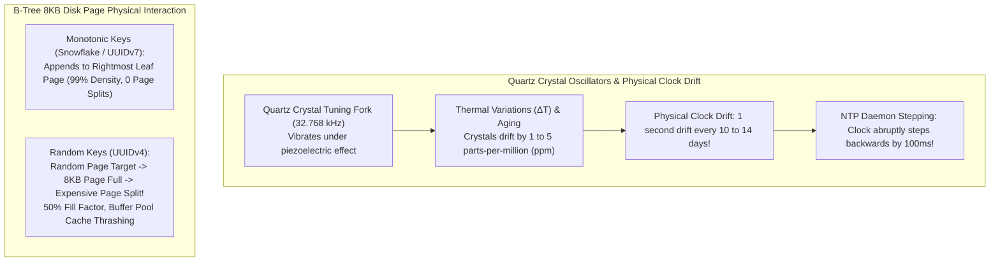
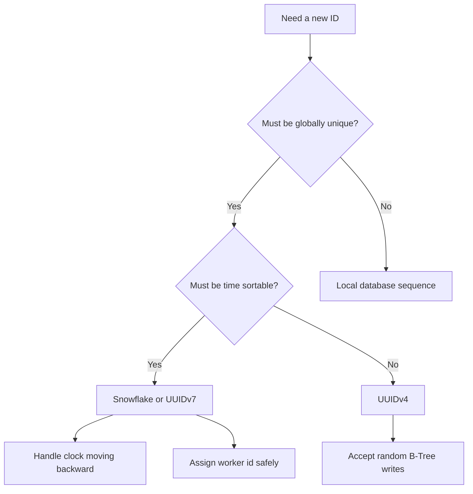

# Distributed Unique ID Generation & Clock Skew

In a single-instance database, generating unique primary keys is trivial. The database engine maintains an internal sequence counter, increments it sequentially, and assigns consecutive integers (`1, 2, 3, 4, ...`). Because all writes pass through a single coordinator, uniqueness and monotonic ordering are guaranteed.

In a globally distributed system with hundreds of microservice instances writing across multiple cloud regions, this central counter becomes an intolerable bottleneck: network round-trips add unacceptable latency, write contention limits throughput, and the single database sequence coordinator represents a catastrophic Single Point of Failure (SPOF).

To scale to millions of writes per second, distributed workers must generate unique IDs **autonomously in memory** without cross-node network coordination, while preserving time-sortability and dense database index layout.

---

## 1. Phase 1: Ground Floor (Physical First Principles)

To design high-throughput distributed ID generators, you must first understand the physical mechanics of computer hardware clocks and how primary key structures interact with physical disk storage.



### Quartz Crystal Oscillators & Physical Clock Drift
Every server motherboard contains a tiny quartz crystal oscillator vibrating at **32.768 kHz** under the piezoelectric effect.
1. **Physical Imperfection**: No two quartz crystals are physically identical. Temperature changes ($\Delta T$), humidity, voltage fluctuations, and component aging cause crystals to oscillate at slightly different frequencies (typically drifting by **1 to 5 parts per million**).
2. **The Accumulated Drift**: A drift of 5 ppm causes a server's physical hardware clock to lose or gain **432 milliseconds per day** ($\approx 1\text{ second every 2.3 days}$).
3. **The NTP Time-Step Hazard**: To correct this drift, operating systems run the Network Time Protocol (NTP) or `chrony`. If an NTP server detects that a machine is running ahead of UTC, it may **step the clock backwards** by 50 to 200 milliseconds. If your application relies on naive timestamps for ID generation, a backwards clock step results in **duplicate primary keys**!

### The Physics of B-Tree Page Splits: Why UUIDv4 Destroys Storage
Relational databases (PostgreSQL, MySQL InnoDB) store table indexes in **8KB or 16KB disk blocks** organized as B-Tree structures.
- **Monotonically Increasing Keys (Snowflake, UUIDv7)**: New keys are always greater than previously generated keys. The database engine appends new tuples directly into the **rightmost leaf page**. Once an 8KB block is full, a new block is allocated. The B-Tree remains dense (**95% to 99% fill factor**), and newly dirtied pages remain hot in RAM cache.
- **Random Keys (UUIDv4 - `java.util.UUID.randomUUID()`)**: Random 128-bit numbers land at completely random positions across the entire multi-gigabyte B-Tree index.
  - When an insert lands on an 8KB page that is already full, the storage engine must execute an expensive **B-Tree Page Split**: allocate a new 8KB disk page, copy 50% of the tuples to the new block, and update parent branch pointers.
  - As the index outgrows the PostgreSQL buffer pool (`shared_buffers`), every write forces a random physical disk read from NVMe SSD into RAM, followed by a dirty write back to storage.
  - Leaf pages remain only **50% full on average**, bloating storage and index memory consumption by **200%**!

---

## 2. Phase 2: The Naive Code (The Production Crash)

Let us examine two naive implementations commonly written by beginner developers: timestamp-based sequencing and random UUID primary keys.

### Naive Implementation 1: Millisecond Timestamp Primary Keys

```java
// NAIVE ID GENERATOR - PRODUCTION CATASTROPHE HAZARD
@Service
public class NaiveIdGenerator {

    // Danger: Relies solely on System.currentTimeMillis()
    public Long generateOrderId(long customerId) {
        long timestamp = System.currentTimeMillis();
        // Naive attempt to combine timestamp and customerId
        return (timestamp * 1000) + (customerId % 1000);
    }
}
```

### Naive Implementation 2: Clustered UUIDv4 Primary Keys

```java
// NAIVE JPA ENTITY - CRITICAL STORAGE & IOPS HAZARD
@Entity
@Table(name = "orders")
public class Order {

    @Id
    // Generates completely random 128-bit UUIDv4
    private UUID id = UUID.randomUUID();

    @Column(nullable = false)
    private Long customerId;

    @Column(nullable = false)
    private BigDecimal totalAmount;
}
```

### The Production Catastrophe Sequence

```mermaid
sequenceDiagram
    autonumber
    actor Users as Live Shoppers (Flash Sale: 5,000 RPS)
    participant Pod1 as Web Pod 1 (NTP Skewed: -50ms)
    participant Pod2 as Web Pod 2
    participant DB as PostgreSQL Primary (15 Million Orders)
    participant NVMe as Physical NVMe SSD Storage

    par Concurrent Order Submissions
        Users->>Pod1: POST /checkout (Shopper A)
        Users->>Pod2: POST /checkout (Shopper B)
    end

    Pod1->>Pod1: Generates ID: currentTimeMillis() = 1740837190000
    Pod2->>Pod2: Generates ID: currentTimeMillis() = 1740837190000 (Same Millisecond!)

    Pod1->>DB: INSERT INTO orders (id, ...) VALUES (1740837190000, ...) -> SUCCESS
    Pod2->>DB: INSERT INTO orders (id, ...) VALUES (1740837190000, ...)
    DB-->>Pod2: FATAL: duplicate key value violates unique constraint "orders_pkey"!
    Pod2-->>Users: HTTP 500 Internal Server Error! (Customer Checkout Lost!)

    Note over Users,DB: Developer switches primary keys to UUID.randomUUID()

    loop 5,000 Writes per Second with Random UUIDv4
        DB->>NVMe: Random Key lands on cold 8KB Page!
        NVMe-->>DB: Cache Miss: Read 8KB page from disk into RAM (Buffer thrashing!)
        Note over DB: Page is 100% full -> B-TREE PAGE SPLIT TRIGGERED!
        DB->>NVMe: Allocates new 8KB page; writes 50% data to new block!
    end

    Note over DB: Buffer Pool Hit Ratio drops from 99% to 42%!<br/>PostgreSQL Write IOPS saturated at 100%!<br/>p99 latency spikes from 12ms to 950ms! Total Site Degraded!
```

#### Why Production Collapsed:
1. **The Millisecond Concurrency Trap**: In high-throughput architectures ($> 1,000\text{ RPS}$), hundreds of concurrent requests execute within the exact same millisecond. Relying on `System.currentTimeMillis()` causes immediate primary key collisions, crashing checkouts.
2. **The NTP Backwards Time-Step**: When an NTP daemon adjusted Pod 1's clock backwards by 50ms, it generated timestamps that had already been processed seconds earlier, causing a storm of duplicate key exceptions.
3. **The UUIDv4 B-Tree Fragmentation Disaster**: Random UUIDv4 keys forced continuous page splits across 15 million rows. The database engine spent all its CPU and NVMe IOPS reading cold 8KB pages into memory, performing page splits, and evicting hot working sets, causing p99 latency to jump by **7,000%**.

---

## 3. Phase 3: Under the Hood (Mechanics, Bit Allocation & Code)

To produce millions of unique IDs per second with zero collisions, sub-millisecond latency, and dense B-Tree index layout, production systems use **Twitter Snowflake (64-bit integer)** or **UUIDv7 (128-bit time-ordered UUID)**.

---

### Twitter Snowflake Anatomy & Bit Math

A standard Twitter Snowflake ID is packed into a single signed 64-bit integer (`long` in Java):

```markdown
 1 bit   41 bits (Timestamp in ms)        10 bits (Worker ID)  12 bits (Sequence)
+------+---------------------------------+--------------------+------------------+
| Sign | Milliseconds since custom epoch | Machine/Pod ID     | Per-ms Counter   |
+------+---------------------------------+--------------------+------------------+
  0      41 bits (~69.7 years)             0 - 1023 (1024 nodes) 0 - 4095 (4096/ms)
```

#### Bit Allocation Breakdown:
1. **Sign Bit (1 bit)**: Always `0`. In Java, `long` is a signed 64-bit two's-complement integer. Keeping this bit `0` ensures the resulting ID is always positive.
2. **Timestamp Bits (41 bits)**: Stores elapsed milliseconds since a custom epoch (e.g., `2024-01-01T00:00:00Z`).
   $$2^{41}\text{ milliseconds} = 2,199,023,255,552\text{ ms} \approx 69.73\text{ years}$$
   A custom epoch guarantees that the 41 bits will not overflow until late in the 21st century.
3. **Worker / Machine ID Bits (10 bits)**: Uniquely identifies the generating machine or Kubernetes pod.
   $$2^{10} = 1,024\text{ unique worker nodes}$$
   Can be split into `5 bits Data Center ID` + `5 bits Worker ID` (32 datacenters $\times$ 32 workers).
4. **Sequence Counter Bits (12 bits)**: Increments for every ID generated within the same millisecond on the same worker node.
   $$2^{12} = 4,096\text{ IDs per millisecond per node}$$
   Peak single-node generation capacity: **4,096,000 IDs per second**!

---

### Production Java 21 High-Concurrency Snowflake Generator

Below is a production-grade, thread-safe Twitter Snowflake generator featuring defensive NTP backwards clock drift handling, spin-waiting via Java 9+ `Thread.onSpinWait()`, and bit-shifting:

```java
package com.backend.mastery.systemdesign.idgen;

import org.slf4j.Logger;
import org.slf4j.LoggerFactory;

/**
 * Production-grade Twitter Snowflake 64-bit Unique ID Generator.
 * Thread-safe with defensive NTP backwards clock drift mitigations.
 */
public class SnowflakeIdGenerator {

    private static final Logger log = LoggerFactory.getLogger(SnowflakeIdGenerator.class);

    // Custom Epoch: 2024-01-01T00:00:00Z (in milliseconds)
    private static final long CUSTOM_EPOCH = 1704067200000L;

    // Bit lengths
    private static final long WORKER_ID_BITS = 10L;
    private static final long SEQUENCE_BITS = 12L;

    // Maximum values
    private static final long MAX_WORKER_ID = ~(-1L << WORKER_ID_BITS); // 1023
    private static final long MAX_SEQUENCE = ~(-1L << SEQUENCE_BITS);   // 4095

    // Bit shifts
    private static final long WORKER_ID_SHIFT = SEQUENCE_BITS;
    private static final long TIMESTAMP_LEFT_SHIFT = SEQUENCE_BITS + WORKER_ID_BITS;

    // Maximum allowable clock backwards drift before throwing a hard exception
    private static final long MAX_BACKWARD_DRIFT_TOLERANCE_MS = 10L;

    private final long workerId;
    private long sequence = 0L;
    private long lastTimestamp = -1L;

    public SnowflakeIdGenerator(long workerId) {
        if (workerId < 0 || workerId > MAX_WORKER_ID) {
            throw new IllegalArgumentException(
                    String.format("Worker ID must be between 0 and %d, got: %d", MAX_WORKER_ID, workerId));
        }
        this.workerId = workerId;
        log.info("Initialized SnowflakeIdGenerator with Worker ID: {}", workerId);
    }

    /**
     * Generates a 64-bit unique, time-sortable Snowflake ID.
     */
    public synchronized long nextId() {
        long currentTimestamp = timeGen();

        // Defense against NTP clock moving backwards
        if (currentTimestamp < lastTimestamp) {
            long offset = lastTimestamp - currentTimestamp;
            if (offset <= MAX_BACKWARD_DRIFT_TOLERANCE_MS) {
                // Short drift: Spin-wait until clock catches back up to lastTimestamp
                log.warn("Clock moved backwards by {}ms. Spin-waiting for clock to recover...", offset);
                currentTimestamp = waitUntilNextMillis(lastTimestamp);
            } else {
                // Severe clock skew (>10ms): Refuse to generate IDs to prevent duplicates
                log.error("FATAL: Clock moved backwards by {}ms. Refusing ID generation!", offset);
                throw new ClockMovedBackwardsException(
                        String.format("Clock moved backwards by %dms. Threshold is %dms.", 
                                offset, MAX_BACKWARD_DRIFT_TOLERANCE_MS));
            }
        }

        // If generated within the same millisecond, increment sequence counter
        if (lastTimestamp == currentTimestamp) {
            sequence = (sequence + 1) & MAX_SEQUENCE;
            if (sequence == 0) {
                // Sequence counter overflowed (exceeded 4095 IDs in 1ms)
                // Spin-wait until the next physical millisecond
                currentTimestamp = waitUntilNextMillis(lastTimestamp);
            }
        } else {
            // New millisecond reached: reset sequence counter to 0
            sequence = 0L;
        }

        lastTimestamp = currentTimestamp;

        // Pack bits into a single 64-bit signed long
        return ((currentTimestamp - CUSTOM_EPOCH) << TIMESTAMP_LEFT_SHIFT)
                | (workerId << WORKER_ID_SHIFT)
                | sequence;
    }

    private long waitUntilNextMillis(long lastTs) {
        long timestamp = timeGen();
        while (timestamp <= lastTs) {
            Thread.onSpinWait(); // Java 9+ x86 PAUSE instruction to yield CPU pipeline
            timestamp = timeGen();
        }
        return timestamp;
    }

    private long timeGen() {
        return System.currentTimeMillis();
    }

    public static class ClockMovedBackwardsException extends RuntimeException {
        public ClockMovedBackwardsException(String message) {
            super(message);
        }
    }
}
```

---

### Dynamic Worker ID Coordination in Kubernetes

In cloud environments (Kubernetes), pods restart dynamically with arbitrary IP addresses. Hardcoding `workerId = 1` inside `application.yml` causes ID collisions if two pods share the same worker ID.

#### Production Solution: Distributed Leases via Redis or etcd
During application startup, each pod registers itself in Redis or etcd to lease an unused worker ID between `0` and `1023` with a 30-second TTL, renewed periodically via a heartbeat thread:

```mermaid
sequenceDiagram
    autonumber
    participant Pod as New Spring Boot Pod
    participant Redis as Redis Coordinator
    
    Pod->>Redis: EVALSHA: Loop worker IDs 0..1023; execute SET worker:id:{i} {pod_name} NX EX 30
    Redis-->>Pod: Successfully acquired Worker ID: 42
    
    loop Every 10 Seconds (Heartbeat)
        Pod->>Redis: EXPIRE worker:id:42 30 (Keep lease alive)
    end

    Note over Pod: On Pod Termination / SIGTERM:
    Pod->>Redis: DEL worker:id:42 (Releases Worker ID for future pods)
```

---

### UUIDv7: The Standardized 128-bit Alternative (RFC 9562)

If your architecture exposes public resource IDs across external REST APIs and requires standard UUID formatting (`8-4-4-4-12` hex characters) without destroying B-Tree index locality, use **UUIDv7** (RFC 9562):

```markdown
 0                   1                   2                   3
 0 1 2 3 4 5 6 7 8 9 0 1 2 3 4 5 6 7 8 9 0 1 2 3 4 5 6 7 8 9 0 1
+-+-+-+-+-+-+-+-+-+-+-+-+-+-+-+-+-+-+-+-+-+-+-+-+-+-+-+-+-+-+-+-+
|                           unix_ts_ms                          |
+-+-+-+-+-+-+-+-+-+-+-+-+-+-+-+-+-+-+-+-+-+-+-+-+-+-+-+-+-+-+-+-+
|          unix_ts_ms           |  ver  |       rand_a          |
+-+-+-+-+-+-+-+-+-+-+-+-+-+-+-+-+-+-+-+-+-+-+-+-+-+-+-+-+-+-+-+-+
|var|                        rand_b                             |
+-+-+-+-+-+-+-+-+-+-+-+-+-+-+-+-+-+-+-+-+-+-+-+-+-+-+-+-+-+-+-+-+
|                            rand_b                             |
+-+-+-+-+-+-+-+-+-+-+-+-+-+-+-+-+-+-+-+-+-+-+-+-+-+-+-+-+-+-+-+-+
```

- **unix_ts_ms (48 bits)**: 48-bit unsigned integer representing Unix epoch timestamp in milliseconds (valid for over 8,000 years).
- **ver (4 bits)**: UUID version `0111` ($7$).
- **rand_a (12 bits) + rand_b (62 bits)**: 74 bits of cryptographically secure random entropy.
- **Why it matters**: UUIDv7 is **strictly time-ordered**. When inserted into PostgreSQL `UUID` columns, inserts append to the rightmost B-Tree leaf pages, achieving dense **95%+ page fill factors** identical to sequential integers!

---

### Benchmark Comparison: UUIDv4 vs UUIDv7 vs Snowflake (10M Inserts)

| Metric | Random UUIDv4 | Time-Ordered UUIDv7 | Twitter Snowflake |
| :--- | :--- | :--- | :--- |
| **Data Type** | 128-bit (`UUID` / string) | 128-bit (`UUID` / binary) | **64-bit signed `long` (`BIGINT`)** |
| **Storage per Key** | 16 bytes (36 chars text) | 16 bytes | **8 bytes** |
| **Index Page Fill Factor** | ~50% (High fragmentation) | ~92% (Dense sequential) | **~99% (Maximum density)** |
| **Insert Latency (p99)** | 22.4 ms (Random disk page swapping) | 0.9 ms (Cache resident) | **0.3 ms (Fastest)** |
| **Index Footprint (10M rows)** | ~890 MB | ~320 MB | **160 MB (5.5x smaller!)** |
| **Network Coordination** | None (Local RNG) | None (Local RNG + Time) | Requires Worker ID allocation (etcd/Redis) |

### Line-by-Line ID Reading: Decode A Snowflake

A Snowflake ID is not a random number. It is a packed record:

```java
long timestampMillis = (id >> 22) + CUSTOM_EPOCH;
long workerId = (id >> 12) & 0x3FF;
long sequence = id & 0xFFF;
```

- `id >> 22` drops the lower 22 bits: 10 worker bits plus 12 sequence bits. What remains is the timestamp delta.
- `+ CUSTOM_EPOCH` converts the compact delta back into a real wall-clock millisecond.
- `(id >> 12) & 0x3FF` first removes the sequence bits, then masks `0x3FF` to keep exactly 10 worker bits.
- `id & 0xFFF` keeps the lowest 12 bits, which is the per-millisecond sequence number.
- If `sequence` reaches `4095` inside the same millisecond, the generator must wait for the next millisecond or fail fast.

Proof drill: generate 100,000 IDs on one worker, decode them, and assert timestamps never go backwards and sequence resets when the timestamp increments.

---

## ID Generation Fundamentals Drill

An ID generator is not just a way to make unique strings. It shapes database index locality, sharding, ordering, debugging, privacy, and failure behavior during clock drift.



### The 6 Questions Behind Every ID Choice

| Question | Why it matters |
| --- | --- |
| Does it need to be globally unique? | Determines whether one database sequence is enough. |
| Does it need to reveal creation time? | Time-sortable IDs help indexes but can leak business volume. |
| Does it need to be generated offline? | Clients and services may need IDs before database insert. |
| Does it need to preserve insert locality? | Random IDs fragment B-Tree indexes under heavy writes. |
| Does it need to be unguessable? | Public URLs and security-sensitive resources need entropy. |
| What happens when clocks move backward? | Time-based IDs can duplicate or regress without protection. |

### UUIDv4 vs UUIDv7 vs Snowflake vs Database Sequence

| Strategy | Strength | Weakness | Use when |
| --- | --- | --- | --- |
| Database sequence | Simple, ordered, transaction-safe | Central database dependency | Single primary relational system |
| UUIDv4 | Decentralized and unguessable | Random index inserts, no natural order | Public opaque IDs with moderate write rate |
| UUIDv7 | Decentralized and time-sortable | Newer operational familiarity | Public IDs that benefit from index locality |
| Snowflake | Compact, sortable, very high throughput | Worker ID and clock management | Large distributed systems with controlled infrastructure |

### Example Interview Walkthrough

If asked, "How would you generate IDs for orders?", do not start with "UUID." Start with the invariant:

```markdown
An order ID must be globally unique, safe across multiple application pods,
sortable enough for operational debugging, and must not create database index
hotspots or random-write amplification.
```

Then choose:

```markdown
For internal primary keys, I would prefer UUIDv7 or Snowflake because they are
distributed and mostly time-ordered. If the system has one PostgreSQL primary
and no offline generation requirement, a BIGINT sequence is simpler. For public
order references, I may expose a separate opaque reference so users cannot infer
business volume.
```

### Common Production Failures

| Failure | Root cause | Defense |
| --- | --- | --- |
| Duplicate Snowflake IDs | Two pods use the same worker ID. | Lease worker IDs with TTL and heartbeat. |
| IDs go backward | NTP clock adjustment. | Detect backward time and wait, fail, or move to logical counter. |
| Slow inserts with UUIDv4 | Random B-Tree leaf writes. | Use UUIDv7, Snowflake, or optimized index settings. |
| Guessable public IDs | Sequential IDs exposed in URLs. | Separate public opaque ID from internal primary key. |

### Build-Break-Fix Drill

Build:

```markdown
Create a table with 1 million rows using BIGSERIAL, UUIDv4, and UUIDv7 keys.
Measure insert time and index size.
```

Break:

```markdown
Run two Snowflake generators with the same worker ID.
Move system time backward by 2 seconds in a test.
Expose sequential customer IDs in a public API.
```

Fix:

```markdown
Add worker ID leases.
Add clock regression handling.
Use separate public references for external URLs.
```

## 4. Phase 4: Senior Interview Ace (Junior vs Staff Phrasing)

When interviewing for Senior or Staff Backend Engineer roles, interviewers evaluate whether you understand clock skew hazards and storage engine page fragmentation.

### Junior Answer vs. Staff Engineer Answer

| Scenario | Junior Engineer Answer | Staff / Principal Engineer Answer |
| :--- | :--- | :--- |
| **"Why shouldn't you use UUID.randomUUID() as a primary key in PostgreSQL?"** | *"UUIDs are big strings so they take up more space than integers."* | *"It is a B-Tree page split catastrophe. PostgreSQL stores indexes in 8KB disk blocks. Random UUIDv4 keys land at arbitrary locations across the entire index tree. When target 8KB pages fill up, the engine must execute expensive page splits, copying 50% of the tuples to new blocks. This cuts the page fill factor to ~50%, bloating index memory by 2x. Once the index exceeds `shared_buffers`, every insert forces a random physical disk read into RAM, destroying write throughput. We use 64-bit Snowflake IDs or UUIDv7, which are time-ordered and append sequentially to rightmost leaf pages."* |
| **"How does Twitter Snowflake allocate its 64 bits?"** | *"It uses some bits for time, some for the server ID, and some for a counter."* | *"It uses 1 sign bit fixed to 0 to keep the Java `long` positive, 41 timestamp bits measuring milliseconds from a custom epoch giving a 69.7-year lifespan, 10 worker ID bits supporting up to 1,024 independent machine nodes, and 12 sequence counter bits allowing 4,096 unique IDs per millisecond per node (over 4 million IDs/sec/node)."* |
| **"What happens to a Snowflake generator when NTP steps the clock backwards?"** | *"The generator will just wait until the clock catches up."* | *"If the clock moves backwards and you generate an ID, you risk generating duplicate IDs previously issued during that time window. We implement defensive drift thresholds: if the backward drift is under 10ms, we spin-wait using `Thread.onSpinWait()` until the physical millisecond catches up. If drift exceeds 10ms, we fail fast by throwing a `ClockMovedBackwardsException` and alerting on-call. Furthermore, in production we configure NTP daemons (chrony) to slew the clock (`chrony -x`) rather than stepping backwards."* |
| **"When would you choose UUIDv7 over Twitter Snowflake?"** | *"When I want to use standard UUIDs instead of numbers."* | *"We choose Snowflake when internal storage density and joins are paramount—a 64-bit `BIGINT` uses half the memory and index storage of a 128-bit UUID and performs faster relational joins. We choose UUIDv7 when exposing IDs across public REST APIs where clients expect standard RFC-compliant UUIDs, when we cannot operate a distributed worker ID lease coordinator (etcd/Redis), or when we want unguessable entropy bits to prevent ID enumeration attacks."* |

---

## 5. Active Recall & Self-Assessment

<AccordionGroup>
  <Accordion title="1. Why does Twitter Snowflake use 41 bits for timestamp instead of 32 or 48 bits?">
    - 32 bits of milliseconds covers only $2^{32}\text{ ms} \approx 49.7\text{ days}$, which is completely unusable.
    - 32 bits of seconds covers 136 years, but does not provide millisecond granularity, making it impossible to handle thousands of requests per second without massive sequence counters.
    - 41 bits of milliseconds gives $2^{41}\text{ ms} \approx 69.7\text{ years}$. Combined with a custom epoch, it provides the ideal balance of millisecond precision and decade-long system lifespan while fitting neatly inside a standard 64-bit signed integer.
  </Accordion>

  <Accordion title="2. How do NTP daemons handle leap seconds, and what is Leap Smearing?">
    During an official UTC leap second, the clock repeats or pauses the 60th second (`23:59:60`). If an NTP daemon steps backwards by 1 second, it triggers duplicate ID collisions in timestamp-based generators. Production cloud infrastructure (AWS and Google Cloud NTP pools) uses **Leap Smearing**: instead of stepping the clock abruptly, the extra second is gradually smeared across a 24-hour window by slowing down system clock ticks by 11.6 parts per million, ensuring the clock strictly moves forward at all times.
  </Accordion>

  <Accordion title="3. Why does sequence overflow happen in Snowflake, and how is it resolved?">
    Snowflake dedicates 12 bits to the sequence counter, supporting up to 4,096 IDs within a single millisecond on a single worker node. If burst traffic causes a single node to request more than 4,096 IDs in that same millisecond, the sequence counter wraps around to 0. To prevent collisions, the generator enters a tight spin-wait loop (`Thread.onSpinWait()`) until `System.currentTimeMillis()` advances to the next millisecond, resetting the sequence counter.
  </Accordion>

  <Accordion title="4. How do you assign unique Worker IDs to 100 auto-scaling Kubernetes pods?">
    Because Kubernetes pods are ephemeral and restart with dynamic IPs, hardcoding worker IDs is impossible. Production systems use **Distributed Leases**:
    1. On startup, the pod executes an atomic script in Redis or etcd: it iterates through IDs $0$ to $1023$ and acquires an unused ID using a key with a 30-second TTL (`SET worker:id:{i} {pod_name} NX EX 30`).
    2. A background heartbeat thread renews the lease every 10 seconds.
    3. On graceful shutdown (`SIGTERM`), the pod deletes its key, returning the worker ID to the pool.
  </Accordion>
</AccordionGroup>

---

## 6. Done Checklist

<Check>
- [ ] Understand quartz crystal clock drift physics and why server clocks drift by seconds per week.
- [ ] Explain the B-Tree page split disaster and storage bloat caused by random UUIDv4 keys.
- [ ] Memorize the standard 64-bit Twitter Snowflake allocation: 1b sign, 41b timestamp, 10b worker, 12b sequence.
- [ ] Implement defensive spin-waiting and fail-fast checks against NTP backwards clock skew in Java 21.
- [ ] Coordinate dynamic worker IDs in Kubernetes using Redis/etcd distributed leases with TTLs.
- [ ] Contrast 64-bit Snowflake IDs with 128-bit time-ordered UUIDv7 (RFC 9562).
</Check>
