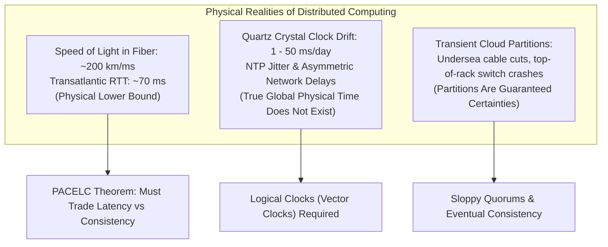
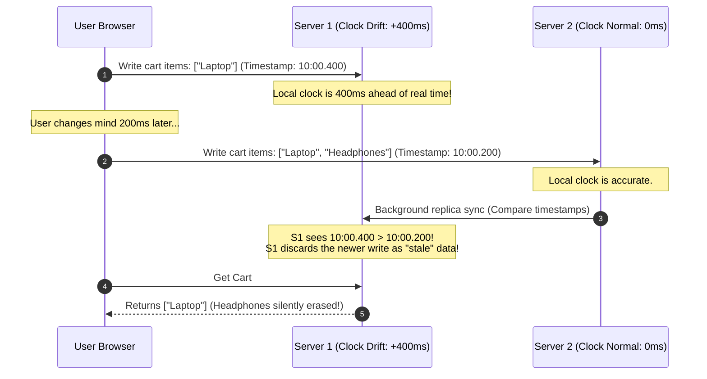
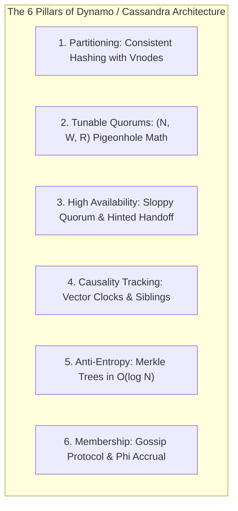
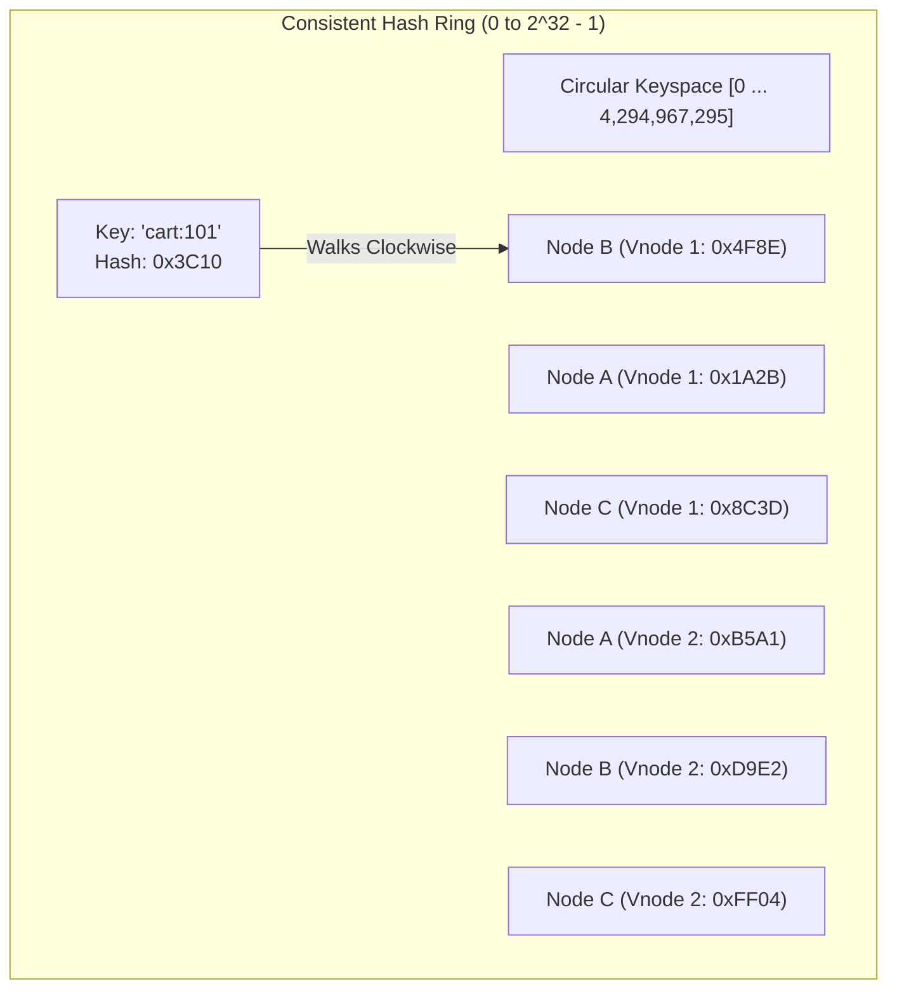
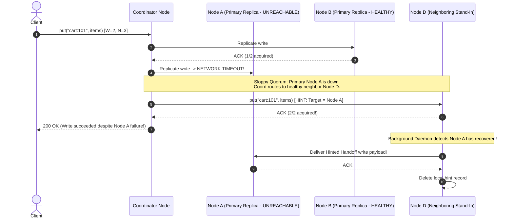
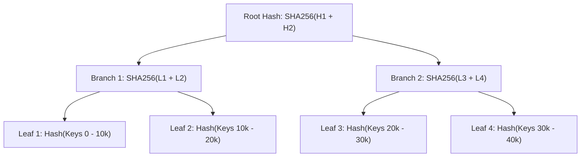

# Design a Distributed Key-Value Store: Dynamo & Cassandra Architecture

A distributed Key-Value store is the bedrock of modern internet infrastructure.

Systems like **Amazon DynamoDB**, **Apache Cassandra**, **Riak**, and **ScyllaDB** power shopping carts, session stores, user profiles, and high-frequency IoT telemetry across thousands of commodity nodes globally.

Building a single-node key-value store in memory is simple (a hash table). Building a **Distributed, Highly Available, Linearly Scalable Key-Value Store** requires solving the hardest foundational problems in distributed systems:
- How do you partition petabytes of data across 1,000 nodes without central bottlenecks?
- How do you guarantee write availability when cloud networks partition and availability zones fail?
- How do you detect and resolve concurrent write conflicts without an authoritative master clock?
- How do nodes detect peer crashes without a centralized coordinator (ZooKeeper/etcd)?

---

## Phase 1: Ground Floor (Physical First Principles & Network Partitions)

Before designing storage algorithms, consider the physical limits of hardware, network fiber, and relativistic time in distributed systems.



### 1. The Relativity of Physical Time in Distributed Systems
Computer clocks rely on vibrating quartz crystals. Under temperature fluctuations and voltage changes, physical clocks drift by **1 to 50 milliseconds per day**. 
- Protocols like NTP (Network Time Protocol) periodically sync clocks over the internet, but network latency asymmetry introduces milliseconds of uncorrectable jitter.
- **The Physical Implication**: In a distributed cluster of 500 machines, **it is physically impossible to know with certainty which event happened first** using physical timestamps (`System.currentTimeMillis()`). Assuming clock equality causes silent data overwrites.

### 2. The PACELC Theorem Matrix
The **CAP Theorem** states that during a network partition ($P$), an architecture must choose between **Consistency ($C$)** or **Availability ($A$)**.
The **PACELC Theorem** (Abadi, 2012) extends this to normal operations:
$$\text{If Partition (P) } \rightarrow \text{Trade Availability (A) vs Consistency (C)}$$
$$\text{Else (E) } \rightarrow \text{Trade Latency (L) vs Consistency (C)}$$

Dynamo and Cassandra prioritize **PA/EL (Availability over Consistency under partition; Latency over Consistency during normal operation)**:
- Writes must **never be rejected** (e.g., an Amazon customer must never receive an error when adding an item to their cart).
- The system embraces **Eventual Consistency**: replicas reconcile asynchronously in the background.

---

## Phase 2: The Naive Code (The Production Crash)

An e-commerce startup designed a custom session and shopping cart store. The team used naive modulo hashing (`node = hash(key) % N`) to distribute keys across 5 servers, and implemented Last-Write-Wins (LWW) using local wall-clock timestamps for conflict resolution.

During a Black Friday promotional event, the service experienced two catastrophic failures:

### The Naive Implementation

```java
public class NaiveDistributedKvStore {

    private final List<ServerNode> nodes;

    public NaiveDistributedKvStore(List<ServerNode> nodes) {
        this.nodes = nodes;
    }

    // NAIVE DISASTER 1: Modulo Hashing
    public ServerNode locateNode(String key) {
        int hash = Math.abs(key.hashCode());
        int index = hash % nodes.size(); // If nodes.size() changes, 80%+ of keys rehash to wrong nodes!
        return nodes.get(index);
    }

    // NAIVE DISASTER 2: Last-Write-Wins relying on System.currentTimeMillis()
    public void put(String key, String value) {
        ServerNode primary = locateNode(key);
        long wallClockTimestamp = System.currentTimeMillis(); // PHYSICAL CLOCK DRIFT DISASTER!
        
        CartRecord record = new CartRecord(value, wallClockTimestamp);
        primary.write(key, record);
    }
}
```

### Why the System Collapsed



1. **The Modulo Rehash Disaster**:
   During peak traffic, CPU utilization hit 90%. An engineer added a 6th server to the cluster. The modulo calculation changed from `hash % 5` to `hash % 6`. **83.3% of all keys in the cluster instantly mapped to the wrong server**. Users' active sessions and carts evaporated. The underlying PostgreSQL database was hit with 150,000 queries/sec of cache-miss traffic and collapsed.
2. **The NTP Clock Drift Cart Deletion**:
   Server 1's CMOS battery was degraded, causing its clock to drift **400 milliseconds ahead of UTC**. When a customer added headphones to their cart on Server 2 (which had the correct time), the replica synchronization compared timestamps:
   `Server 1 (10:00.400) > Server 2 (10:00.200)`.
   Server 1's older update won the Last-Write-Wins check. The customer's newly added items were **silently discarded**, costing the company over $400,000 in lost revenue.

---

## Phase 3: Under the Hood (Mechanics, Mathematical Framework & System Blueprints)

To achieve linear scalability and 99.999% write availability without central bottlenecks, a Dynamo-style architecture synthesizes **6 distributed building blocks**:



---

### Pillar 1: Consistent Hashing with Virtual Nodes (Vnodes)

Instead of modulo hashing, Consistent Hashing maps both **nodes** and **keys** onto a circular $2^{32} - 1$ integer ring:



#### Why Virtual Nodes (Vnodes) are Mandatory
1. **Elimination of Data Skew**: Assigning a physical server a single point on the ring creates non-uniform token partitions, causing some nodes to hold 50% of cluster data.
2. **256 Vnodes per Physical Machine**: Each server claims 128 to 256 virtual tokens uniformly distributed around the ring.
3. **Linear Rebalancing ($1/N$)**: When a new node joins a cluster of $N$ nodes, it takes a small fraction of virtual tokens from every existing machine. Only **$1/N$ of keys migrate**, distributed uniformly across all physical hosts without bottlenecking a single network link.

---

### Pillar 2: Tunable Consistency & Quorum Math ($N, W, R$)

Dynamo decouples consistency from physical topology by allowing clients to tune three parameters per request:
- **$N$ (Replication Factor)**: Number of distinct physical nodes that store copies of a key (typically $N=3$).
- **$W$ (Write Quorum)**: Number of replicas that must acknowledge a write before returning HTTP 200 OK.
- **$R$ (Read Quorum)**: Number of replicas that must respond to a read before returning data.

#### The Pigeonhole Principle Overlap
$$W + R > N$$

If $N = 3$, and we configure **$W = 2$ and $R = 2$**:
$$W + R = 4 > 3$$
By the **Pigeonhole Principle**, the set of nodes written to ($W$) and the set of nodes read from ($R$) **must overlap by at least one node**. The overlapping node is guaranteed to return the latest version.

| Configuration | Quorum Math | Read Latency | Write Latency | Guarantee | Best Use Case |
| :--- | :--- | :--- | :--- | :--- | :--- |
| **High Availability (AP)** | $W=1, R=1, N=3$ | $\le 2\text{ms}$ | $\le 2\text{ms}$ | Eventual Consistency | Telemetry, clickstreams, social likes |
| **Strong Consistency (Overlapping)** | $W=2, R=2, N=3$ | $\le 8\text{ms}$ | $\le 8\text{ms}$ | Strong Read/Write Overlap | User profiles, cart states, payments |
| **Write-Heavy Logging** | $W=1, R=3, N=3$ | Slower ($\sim 20\text{ms}$) | Instant ($\le 2\text{ms}$) | Fast writes, consistent reads | High-frequency IoT event ingest |

---

### Pillar 3: Sloppy Quorums & Hinted Handoff

In a strict quorum, if 2 out of 3 replicas for a key are offline due to a network partition, writes fail.
To guarantee 100% write availability, Dynamo uses **Sloppy Quorums with Hinted Handoff**:



---

### Pillar 4: Vector Clocks & Sibling Reconciliation

Because physical timestamps drift, Dynamo uses **Vector Clocks** to capture causal relationships between concurrent writes.

A Vector Clock is a set of `(NodeID, Counter)` tuples:
$$VC = \{(S_1, v_1), (S_2, v_2), \dots, (S_n, v_n)\}$$

```java
package com.backend.mastery.systemdesign.kvstore;

import java.util.*;

public class VectorClock {

    private final Map<String, Long> clockMap;

    public VectorClock() {
        this.clockMap = new HashMap<>();
    }

    public VectorClock(Map<String, Long> clockMap) {
        this.clockMap = new HashMap<>(clockMap);
    }

    /**
     * Increments the logical counter for the node executing the write.
     */
    public synchronized VectorClock increment(String nodeId) {
        Map<String, Long> newMap = new HashMap<>(this.clockMap);
        newMap.put(nodeId, newMap.getOrDefault(nodeId, 0L) + 1L);
        return new VectorClock(newMap);
    }

    public enum Causality {
        EQUAL,
        BEFORE,     // This clock is an ancestor of the other (no conflict)
        AFTER,      // This clock is a descendant of the other (no conflict)
        CONCURRENT  // Conflict! Sibling branches must be merged
    }

    /**
     * Compares causality against another vector clock.
     */
    public Causality compareTo(VectorClock other) {
        boolean hasGreater = false;
        boolean hasLesser = false;

        Set<String> allNodes = new HashSet<>(this.clockMap.keySet());
        allNodes.addAll(other.clockMap.keySet());

        for (String node : allNodes) {
            long v1 = this.clockMap.getOrDefault(node, 0L);
            long v2 = other.clockMap.getOrDefault(node, 0L);

            if (v1 > v2) hasGreater = true;
            if (v1 < v2) hasLesser = true;
        }

        if (hasGreater && hasLesser) return Causality.CONCURRENT;
        if (hasGreater) return Causality.AFTER;
        if (hasLesser) return Causality.BEFORE;
        return Causality.EQUAL;
    }

    /**
     * Merges two vector clocks by computing pairwise maximums.
     */
    public static VectorClock merge(VectorClock c1, VectorClock c2) {
        Map<String, Long> merged = new HashMap<>(c1.clockMap);
        for (var entry : c2.clockMap.entrySet()) {
            merged.merge(entry.getKey(), entry.getValue(), Math::max);
        }
        return new VectorClock(merged);
    }
}
```

---

### Pillar 5: Anti-Entropy with Merkle Trees

When nodes remain offline longer than the Hinted Handoff TTL (typically 3 hours), hinted writes expire. Replicas must detect which keys are out of sync without streaming gigabytes of data over WAN connections.

We use **Merkle Trees (Binary Hierarchical Hash Trees)**:



1. Each replica maintains a separate Merkle tree for each virtual token range.
2. Two replicas compare **Root Hashes**:
   - If Root Hashes match $\rightarrow$ **100% identical! Sync finishes in 1 network round-trip.**
3. If Root Hashes differ, they compare child branch hashes, descending only into branches that mismatch.
4. Only the divergent keys are transferred across the network, reducing cross-datacenter sync bandwidth by **over 99.9%**.

---

### Pillar 6: Decentralized Membership & $\Phi$ Accrual Failure Detection

A cluster of 1,000 nodes cannot rely on a single coordinator (ZooKeeper). Nodes use a **Decentralized Gossip Protocol**:
- Every second, each node picks a random peer and exchanges heartbeat counters.
- Membership state propagates across the entire cluster in $O(\log N)$ gossip rounds.

#### The $\Phi$ (Phi) Accrual Failure Detector
Binary heartbeat checks ("Node Alive / Node Dead") trigger false positives during transient Garbage Collection pauses.
The **$\Phi$ Accrual Failure Detector** tracks a sliding window of heartbeat inter-arrival times and outputs a continuous scale of suspicion:

$$\Phi = -\log_{10}(P_{\text{later}}(t - t_{\text{last}}))$$

- When $\Phi > 8$, the probability of a false alarm is $< 10^{-8}$. The coordinator safely marks the node as down, activates Hinted Handoff, and routes writes to standby replicas.

---

## Phase 4: Senior Interview Ace (Junior vs Staff Phrasing)

In distributed systems design interviews, the difference between a mid-level candidate and a staff architect is the depth of trade-off reasoning:

| Architectural Topic | Junior Developer Answer | Senior / Staff Engineer Answer |
| :--- | :--- | :--- |
| **Partitioning Strategy** | *"We hash the key using MD5 and take modulo $N$ to find the server."* | *"Modulo hashing causes catastrophic rebalancing where $O(N)$ of all data must migrate when a node joins or dies. We use Consistent Hashing with 256 Virtual Nodes per machine. This eliminates token hot spots, guarantees linear load distribution, and limits key migration to exactly $1/N$ of the dataset during cluster topology changes."* |
| **Conflict Resolution** | *"We use Last-Write-Wins (LWW) by saving `System.currentTimeMillis()` with the record."* | *"Physical clocks suffer from NTP drift, leap seconds, and network jitter. LWW causes silent data corruption when a server with a slightly fast clock overwrites newer writes. We use Vector Clocks to track causal ancestor-descendant relationships. If concurrent branching occurs, we preserve both siblings and return them to the client for domain-level reconciliation."* |
| **Quorum Consistency** | *"If $W + R > N$, the system is strictly linearizable and guarantees ACID transactions."* | *"$W + R > N$ proves mathematical set overlap under fixed membership via the Pigeonhole Principle. It does not provide linearizability or prevent phantom reads without read-repair coordination or Paxos/Raft consensus. Furthermore, Sloppy Quorums break the overlap guarantee by substituting standby nodes during partitions."* |
| **Replica Synchronization** | *"We run a daily cron job that queries all databases and syncs missing rows."* | *"Scanning billions of rows over the network exhausts database I/O. We use Merkle Trees per virtual token range. Replicas compare root hashes in $O(1)$; if identical, zero data transfers. If mismatched, they traverse down the tree in $O(\log N)$ to identify and sync only the divergent key ranges."* |
| **Failure Detection** | *"We send a ping every second; if a node misses 3 pings, we mark it dead."* | *"Hard timeouts trigger false-positive failovers during JVM GC pauses or brief network blips. We deploy the $\Phi$ Accrual Failure Detector, which models heartbeat inter-arrival history as a normal distribution and computes a continuous suspicion score. We trigger hinted handoff only when $\Phi > 8$."* |

---

## Active Recall & Interview Mastery

<AccordionGroup>
  <Accordion title="1. Why does modulo hashing fail in dynamic distributed storage systems?">
    In modulo hashing (`hash(key) % N`), adding or removing a node changes the divisor $N$. As a result, nearly $100\%$ of keys across the cluster recalculate to different server indices. This triggers massive cross-network data migration, invalidates local caches, causes cache stampedes on primary databases, and degrades application availability. Consistent Hashing confines key migration to only $1/N$ of the dataset.
  </Accordion>

  <Accordion title="2. How do Virtual Nodes (Vnodes) prevent the 'Hot Spot' problem in Consistent Hashing?">
    Without virtual nodes, a physical machine owns a single contiguous arc on the hash ring. Due to hash variance, some nodes end up responsible for massive token ranges, receiving an unfair share of read/write traffic. By assigning each physical machine 128 to 256 virtual tokens scattered uniformly across the ring, data distribution converges to a uniform distribution, spreading load evenly across all hardware.
  </Accordion>

  <Accordion title="3. What is the difference between a Strict Quorum and a Sloppy Quorum?">
    In a **Strict Quorum**, writes require acknowledgment from nodes in the key's primary preference list (the first $N$ healthy nodes on the ring). If those nodes are unreachable, the write fails. In a **Sloppy Quorum**, if primary nodes are unreachable, the coordinator writes to healthy stand-in nodes with a **Hint**. The stand-in holds the write and delivers it back to the primary node once it recovers (**Hinted Handoff**), maximizing write availability at the cost of temporary consistency divergence.
  </Accordion>

  <Accordion title="4. How does a Merkle Tree synchronize two replicas in O(log N) time?">
    A Merkle tree is a hierarchical hash tree where leaves are hashes of key-value ranges, and parent nodes store hashes of their children. Two replicas first compare their **Root Hashes**. If they match, the replicas are identical, requiring only 1 network round-trip. If they differ, the nodes traverse down the mismatched branches to isolate the specific divergent leaf buckets. Only the out-of-sync keys are transferred, saving over 99% of bandwidth.
  </Accordion>

  <Accordion title="5. Why does Last-Write-Wins (LWW) cause silent data loss?">
    LWW resolves write conflicts by comparing wall-clock timestamps generated by operating system clocks. Because physical hardware clocks drift due to temperature and voltage variances, NTP synchronization cannot guarantee sub-millisecond alignment. If Server A's clock is 50ms ahead of Server B, an update made on Server A will overwrite and erase a newer update made on Server B simply because Server A's timestamp is numerically larger.
  </Accordion>
</AccordionGroup>
