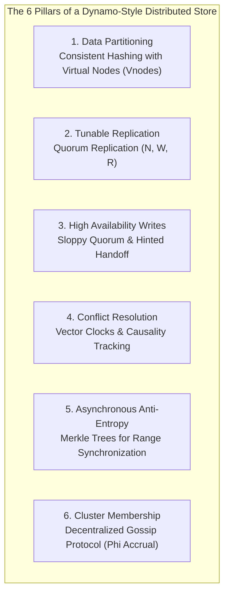
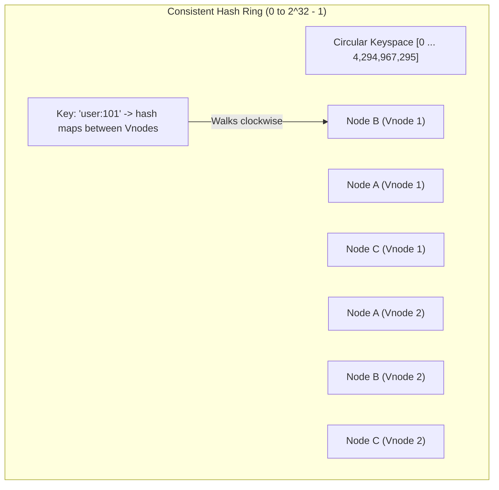
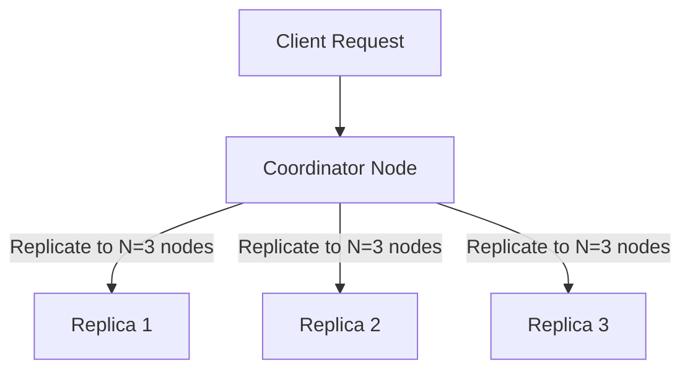
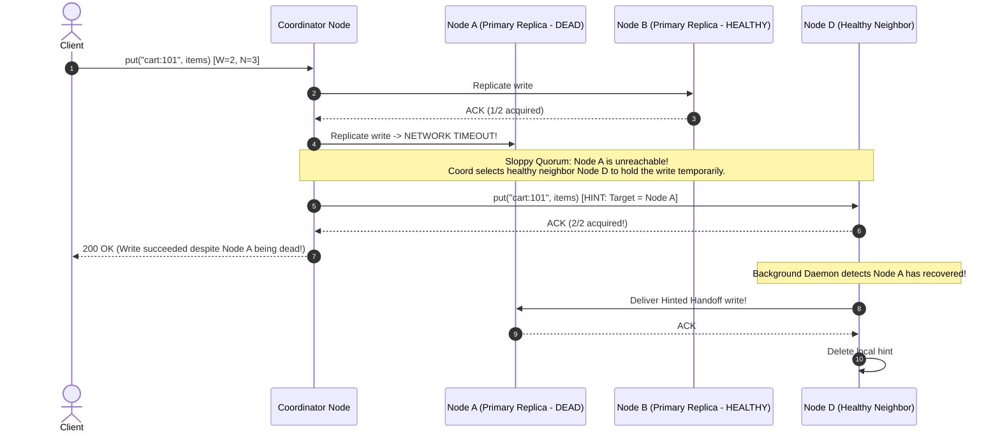
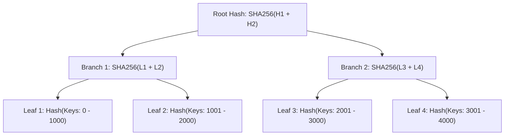
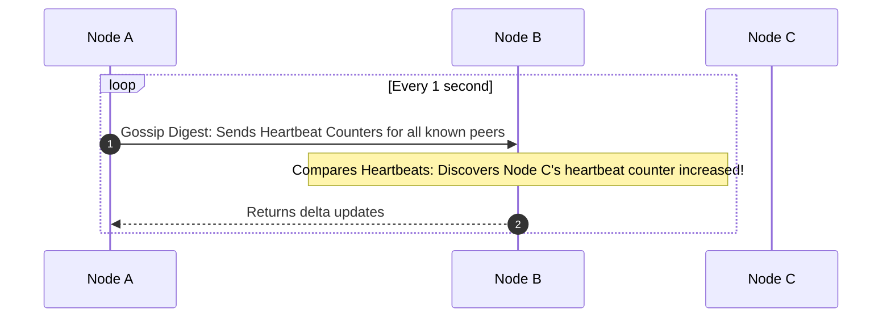

# Design a Distributed Key-Value Store: Dynamo & Cassandra Architecture

A Key-Value store is the bedrock of modern cloud computing.
Systems like **Amazon DynamoDB**, **Apache Cassandra**, **Riak**, and **ScyllaDB** power shopping carts, session stores, user profiles, and high-frequency telemetry across hundreds of nodes worldwide.

Building a single-node key-value store in memory is simple (a hash map).
Building a **Distributed, Highly Available, Linearly Scalable Key-Value Store** requires solving the hardest problems in distributed systems:
- How do you partition petabytes of data across 500 nodes without central bottlenecks?
- How do you guarantee write availability during severe cloud network partitions?
- How do you detect and resolve concurrent write conflicts without an authoritative master clock?
- How do nodes detect peer crashes without a centralized coordinator (ZooKeeper/etcd)?

This masterclass provides an exhaustive, staff-level architectural blueprint for an enterprise distributed key-value store based on the seminal **Amazon Dynamo Paper** and Apache Cassandra.

---

## 1. System Requirements & The PACELC Trade-Off Matrix

### Functional Requirements
1. `put(key, value)`: Stores a value associated with a string key.
2. `get(key)`: Retrieves the value associated with a string key.
3. **High Write Throughput**: Handles $100,000+\text{ QPS}$ with sub-5ms write latency.
4. **Petabyte-Scale Storage**: Linearly scales capacity by adding commodity hardware nodes.

---

### The PACELC Theorem Choice: High Availability (AP)

The **CAP Theorem** states that under a network partition ($P$), a distributed system must choose between **Consistency ($C$)** or **Availability ($A$)**.
The **PACELC Theorem** extends this to normal operations:
$$\text{If Partition (P) } \rightarrow \text{Choose between Availability (A) and Consistency (C)}$$
$$\text{Else (E) } \rightarrow \text{Choose between Latency (L) and Consistency (C)}$$

Dynamo-style architectures prioritize **PA/EL (Availability over Consistency under partition; Latency over Consistency during normal operation)**:
- Writes must **never be rejected** (e.g., an Amazon customer must never be prevented from adding an item to their cart).
- The system embraces **Eventual Consistency**: replicas reconcile asynchronously in the background.

---

## 2. Core Architecture: The 6 Distributed Building Blocks



---

## 3. Data Partitioning: Consistent Hashing with Virtual Nodes (Vnodes)

Naive modulo hashing ($\text{Node} = \text{hash}(\text{key}) \pmod N$) is catastrophic in distributed storage: adding or removing a single node changes the denominator, forcing **$O(N)$ of all data across the cluster to migrate**, causing massive network flooding.

We use **Consistent Hashing**:



### Why Virtual Nodes (Vnodes) are Mandatory
1. **Elimination of Hot Spots (Non-Uniform Distribution)**:
   In a ring with only 3 physical nodes, token ranges are uneven, leading to severe storage imbalances.
2. **Virtual Nodes (Vnodes)**:
   Each physical machine is assigned **$256\text{ virtual tokens}$ (Vnodes)** scattered uniformly across the ring.
3. **Linear Rebalancing**:
   When a new physical server is added, it claims a small fraction of virtual tokens from every existing machine. Only $1/N$ of keys migrate across the network, distributed evenly across all peers without bottlenecking any single host.

---

## 4. Tunable Consistency: The Quorum Math ($N, W, R$)

Dynamo decouples consistency from physical topology by allowing clients to tune three parameters per request:
- **$N$**: The Replication Factor (number of nodes that store a copy of the key). Typically set to **$N = 3$**.
- **$W$**: The Write Quorum (number of replica nodes that must acknowledge a write before returning success).
- **$R$**: The Read Quorum (number of replica nodes that must respond to a read before returning data).



### The Pigeonhole Principle proves overlap
$$W + R > N$$

If $N = 3$, and we configure **$W = 2$ and $R = 2$**:
$$W + R = 4 > 3$$
By the **Pigeonhole Principle**, the set of nodes written to ($W$) and the set of nodes read from ($R$) **must overlap by at least one node**. This proves set intersection, assuming fixed membership. It does not resolve concurrent or incomplete writes, prove real-time version ordering, or implement atomic read-modify-write. Read [the quorum assumptions](/system-design/consistency-failures#the-quorum-inequality) before using the formula as a correctness argument.

### Production Tunable Consistency Topologies

| Configuration | Quorum Math | Read Latency | Write Latency | Consistency Guarantee | Best Use Case |
| :--- | :--- | :--- | :--- | :--- | :--- |
| **High Availability (AP)** | $W=1, R=1, N=3$ | Ultra-Fast ($\le 2\text{ms}$) | Ultra-Fast ($\le 2\text{ms}$) | **Eventual Consistency** (May read stale data) | Analytics counters, telemetry, clickstreams |
| **Overlapping quorums**| $W=2, R=2, N=3$ | Fast ($\le 8\text{ms}$) | Fast ($\le 8\text{ms}$) | **Read/write overlap**; protocol assumptions still apply | User account profiles, order states |
| **Fast Writes / Heavy Reads**| $W=1, R=3, N=3$ | Slower (Wait for all 3) | Instant (Wait for 1) | **Read/write overlap**; writes do not intersect each other | High-frequency sensor logging |

---

## 5. High-Availability Writes: Sloppy Quorums & Hinted Handoff

In a strict quorum system, if 2 out of 3 replica nodes are down due to a network partition, all writes fail.
To keep accepting more writes during replica outages, Dynamo uses **sloppy quorums with hinted handoff**. No fixed availability percentage follows from this technique alone. Substitute replicas also break the fixed-membership assumption in the quorum inequality. See [the Dynamo paper](https://www.allthingsdistributed.com/files/amazon-dynamo-sosp2007.pdf).



---

## 6. Conflict Resolution: Vector Clocks vs Last-Write-Wins (LWW)

When network partitions heal or concurrent writes occur on different replicas, the system discovers conflicting versions of a key.

### Why Last-Write-Wins (LWW) Causes Silent Data Loss
Many systems use wall-clock timestamps (NTP) to pick the latest write (Last-Write-Wins).
**NTP clock drift makes LWW dangerous**:
- If Server 1's clock is 50ms behind Server 2, a customer update on Server 1 will be silently overwritten and erased by an older update on Server 2!

### Vector Clocks: Tracking Causality
A **Vector Clock** is a list of `(Node, Counter)` tuples:
$$VC = \{(S_1, v_1), (S_2, v_2), \dots, (S_n, v_n)\}$$

#### Causality Rules
1. **$V_1$ is an ancestor of $V_2$** ($V_1 \le V_2$): Every counter in $V_1$ is $\le$ the corresponding counter in $V_2$. $V_2$ supersedes $V_1$ cleanly (no conflict).
2. **Concurrent Conflict (Branching Siblings)**: $V_1$ has a higher counter for Node A, but $V_2$ has a higher counter for Node B. Neither is an ancestor of the other. The system returns **both siblings** to the client for domain-level reconciliation (e.g., merging shopping cart items).

---

## 7. Complete Runnable Java 21 Vector Clock Implementation

```java
package com.example.kvstore.vectorclock;

import java.util.*;

public class VectorClock {

    private final Map<String, Long> versions;

    public VectorClock() {
        this.versions = new HashMap<>();
    }

    public VectorClock(Map<String, Long> versions) {
        this.versions = new HashMap<>(versions);
    }

    /**
     * Increments the logical clock for the writing node.
     */
    public synchronized VectorClock increment(String nodeId) {
        Map<String, Long> newVersions = new HashMap<>(this.versions);
        newVersions.put(nodeId, newVersions.getOrDefault(nodeId, 0L) + 1L);
        return new VectorClock(newVersions);
    }

    public enum Ordering {
        EQUAL,
        BEFORE,     // This clock is an ancestor of other (this < other)
        AFTER,      // This clock is a descendant of other (this > other)
        CONCURRENT  // Conflict! Sibling branching occurred
    }

    /**
     * Compares causality between two vector clocks.
     */
    public Ordering compare(VectorClock other) {
        boolean hasGreater = false;
        boolean hasLesser = false;

        Set<String> allNodes = new HashSet<>(this.versions.keySet());
        allNodes.addAll(other.versions.keySet());

        for (String node : allNodes) {
            long v1 = this.versions.getOrDefault(node, 0L);
            long v2 = other.versions.getOrDefault(node, 0L);

            if (v1 > v2) hasGreater = true;
            if (v1 < v2) hasLesser = true;
        }

        if (hasGreater && hasLesser) return Ordering.CONCURRENT;
        if (hasGreater) return Ordering.AFTER;
        if (hasLesser) return Ordering.BEFORE;
        return Ordering.EQUAL;
    }

    /**
     * Merges two concurrent vector clocks by taking the pairwise maximum of all counters.
     */
    public static VectorClock merge(VectorClock clock1, VectorClock clock2) {
        Map<String, Long> merged = new HashMap<>(clock1.versions);
        for (var entry : clock2.versions.entrySet()) {
            merged.merge(entry.getKey(), entry.getValue(), Math::max);
        }
        return new VectorClock(merged);
    }

    @Override
    public String toString() {
        return versions.toString();
    }
}
```

---

## 8. Anti-Entropy with Merkle Trees (Hash Trees)

When nodes are offline for days, hinted handoff buffers expire. Replicas must detect differences across millions of keys without transferring gigabytes of raw data over the network.

We use **Merkle Trees (Hierarchical Hash Trees)**:



### How Merkle Tree Synchronization Works in $O(\log N)$
1. Each replica maintains a Merkle Tree for each virtual token range.
2. Two replicas compare their **Root Hashes**:
   - If Root Hashes match $\rightarrow$ **The entire token range is 100% identical!** Sync finishes in 1 network round-trip.
3. If Root Hashes differ, the nodes compare the left and right child hashes.
4. They traverse down only the branches that differ until they pinpoint the exact leaf bucket containing the mismatched keys.
5. Only the missing key-value pairs are transmitted across the network, reducing synchronization bandwidth by **$99.9\%$**.

---

## 9. Cluster Membership: The Gossip Protocol

A decentralized cluster of 500 nodes cannot rely on a centralized coordinator (like ZooKeeper) because the coordinator becomes a single point of failure and bottleneck.

Nodes use a **Decentralized Gossip Protocol**:



### The $\Phi$ (Phi) Accrual Failure Detector
Instead of a binary "Node is Alive / Node is Dead" flag (which causes false positives during transient GC pauses or network blips), Cassandra and Dynamo implement the **$\Phi$ Accrual Failure Detector**:
- Tracks a sliding window of inter-arrival heartbeat intervals.
- Calculates a continuous scale of suspicion ($\Phi$ score):
  $$\Phi = -\log_{10}(P_{\text{later}}(t - t_{\text{last}}))$$
- When $\Phi > 8$, the probability of a false alarm is $< 10^{-8}$. The coordinator marks the node as down, initiates hinted handoff, and routes requests to healthy neighbors.

---

## 10. Active Recall & Interview Mastery

<AccordionGroup>
  <Accordion title="1. What is the difference between Consistent Hashing with Vnodes and standard Modulo Hashing?">
    In standard modulo hashing (`hash(key) % N`), adding or removing a single node changes the denominator $N$, forcing nearly $100\%$ of all keys across the cluster to migrate to new servers, causing catastrophic network and disk saturation.
    
    In **Consistent Hashing**, keys and nodes are mapped to a circular hash ring ($0$ to $2^{32}-1$). A key belongs to the first node encountered moving clockwise. When a node is added or removed, only keys in its immediate adjacent range migrate ($1/N$ of the dataset).
    
    **Virtual Nodes (Vnodes)** assign each physical machine 256 tokens uniformly across the ring, preventing non-uniform hot spots and ensuring that rebalancing load is distributed evenly across all peer nodes in parallel.
  </Accordion>

  <Accordion title="2. Does an overlapping quorum guarantee linearizability?">
    No. $W + R > N$ proves overlap for a fixed replica set. A complete consistency protocol must also define concurrent-write ordering, incomplete-write recovery, read repair, and membership changes. Timestamp comparison alone does not provide real-time ordering. See [Cassandra's linearizable lightweight transactions](https://cassandra.apache.org/doc/stable/cassandra/architecture/guarantees.html) for the distinction between quorum settings and a coordination protocol.
  </Accordion>

  <Accordion title="3. What is a Sloppy Quorum and how does Hinted Handoff maintain write availability during partitions?">
    In a strict quorum, if preferred replica nodes are unreachable, writes fail. In a **Sloppy Quorum**, if preferred replica nodes are down, the coordinator node writes to healthy neighboring nodes outside the preferred list to satisfy the $W$ quorum.
    
    The neighbor node accepts the write and tags it with a **"Hint"** indicating the intended destination. A background daemon monitors peer health via the Gossip Protocol. Once the primary replica node recovers, the neighbor delivers the hinted handoff write and deletes its local copy, improving write availability while accepting temporary divergence and the need for reconciliation.
  </Accordion>

  <Accordion title="4. Why are Vector Clocks superior to Last-Write-Wins (LWW) using wall-clock timestamps?">
    Wall-clock timestamps rely on NTP synchronization across servers. Because NTP suffers from clock drift, leap seconds, and network jitter, a server's clock can be tens of milliseconds behind its peers. Under **Last-Write-Wins (LWW)**, a newer user write that happens to execute on a machine with a slow clock will be permanently overwritten and lost by an older update with a higher timestamp.
    
    **Vector Clocks** track logical causality without relying on physical clocks. They accurately determine whether an update is an ancestor, a descendant, or a concurrent conflict, preserving all concurrent writes as siblings for domain-level reconciliation (e.g., merging shopping cart items).
  </Accordion>

  <Accordion title="5. How do Merkle Trees enable high-speed anti-entropy synchronization?">
    A **Merkle Tree** is a hierarchical binary hash tree where leaf nodes represent hashes of key-value ranges, and parent nodes store hashes of their children.
    
    Two replicas synchronize by comparing their **Root Hashes**. If the roots match, the entire dataset is identical, completing the check in 1 round trip. If roots differ, the nodes traverse down the tree, comparing child hashes to isolate the exact leaf bucket containing the mismatched keys. Only the missing or updated keys are transferred, reducing cross-datacenter sync bandwidth by over $99\%$.
  </Accordion>
</AccordionGroup>
