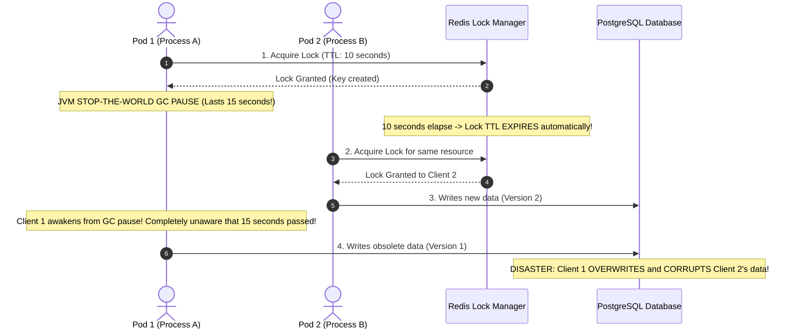
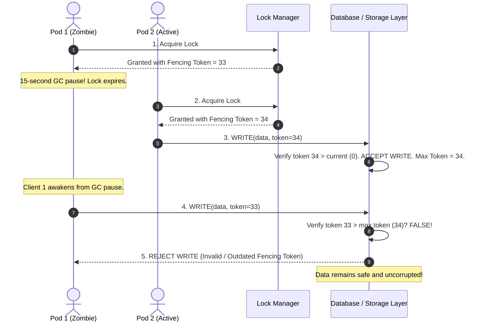
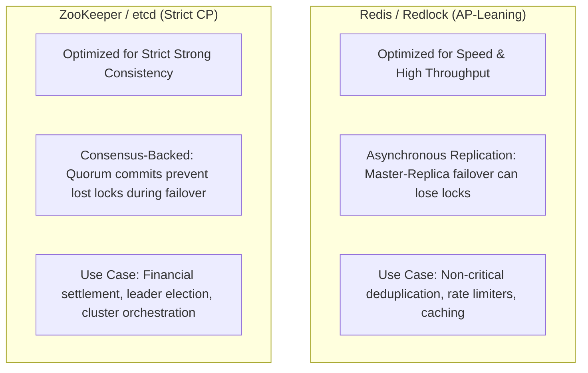
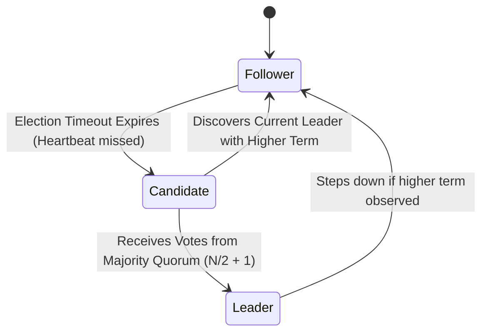
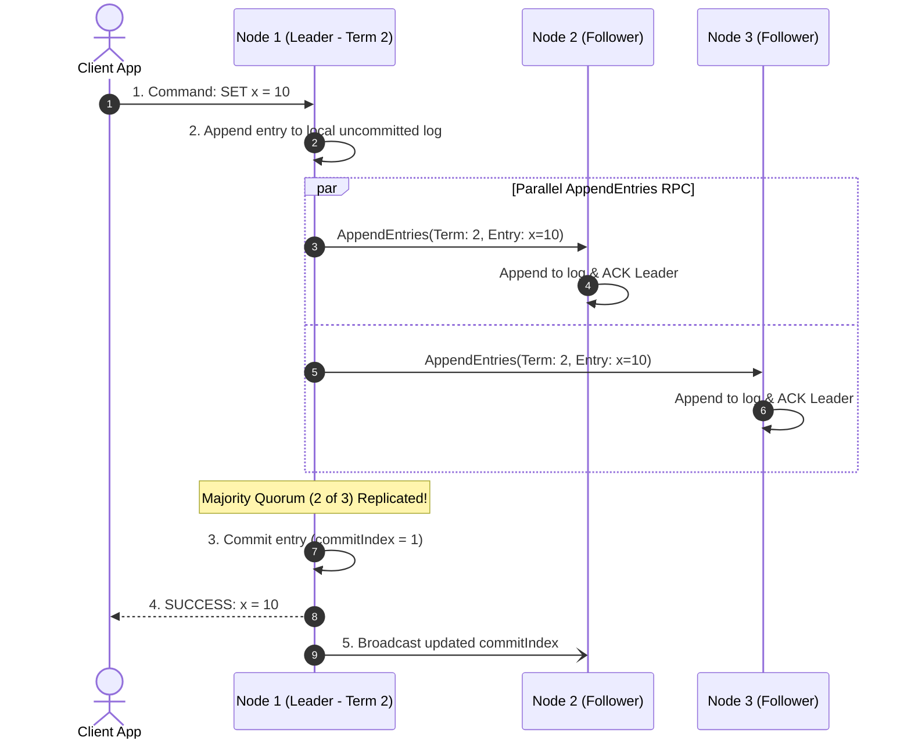

# Distributed Consensus, Locking & Fencing Tokens

In a single-process application, enforcing mutual exclusion is straightforward: Java's `ReentrantLock` or `synchronized` primitives block competing threads using CPU memory barriers and OS kernel wait queues.

In distributed microservices running across dozens of Kubernetes pods, instances cannot inspect each other's memory. Coordinating access to shared resources (e.g., executing a once-per-day payout job, processing a physical inventory reservation, or claiming a hardware device) requires **Distributed Locking and Consensus**.

However, naive distributed locks—such as relying on Redis `SETNX` with a TTL—create subtle, catastrophic concurrency race conditions that corrupt production data.

---

## 1. The Distributed Lock Fallacy: The GC Pause Hazard

A common approach to distributed locking in Spring Boot is setting a key in Redis:

```bash
# Naive lock acquisition:
SET lock:resource_42 "pod-1" NX EX 10
```

If the command returns `OK`, Pod 1 assumes it holds exclusive access for 10 seconds.

### The Catastrophic Race Condition (Process Pauses)

What happens if Pod 1 experiences an unexpected JVM Garbage Collection pause, an OS paging delay, or a network stall?



### Why Process Pauses Are Unavoidable
In real-world production environments, a process can be paused at **any line of code** due to:
1. **JVM Stop-The-World Garbage Collection**: Even with modern collectors, major heap collections or allocation stalls can pause threads for seconds.
2. **Kubernetes / Hypervisor Steal Time**: A noisy neighbor on the same physical server can steal CPU cycles, stalling execution.
3. **OS Page Faults**: If memory is swapped to disk, threads block on disk I/O.
4. **Network Partitions / TCP Sockets**: Asynchronous socket write buffers can stall.

<Warning>
A lock with a lease timeout (TTL) cannot guarantee mutual exclusion across asynchronous networks without verification at the storage layer!
</Warning>

---

## 2. Martin Kleppmann's Solution: Fencing Tokens

In his famous analysis of distributed locks, distributed systems researcher **Martin Kleppmann** proved that a distributed lock is unsafe unless the lock service issues a monotonically increasing number called a **Fencing Token**.

### How Fencing Tokens Eliminate Data Corruption

Every time a lock is acquired, the lock manager increments and returns a unique, strictly increasing counter:



### The Rule of the Storage Layer
The target database or storage service must **enforce the fencing token invariant**:
```sql
UPDATE resources 
SET data = :newData, fencing_token = :incomingToken 
WHERE id = :id AND fencing_token < :incomingToken;
```
If `incomingToken <= current_token`, the database updates 0 rows, completely neutralizing the zombie write!

---

## 3. The Redlock Debate: Redis (AP) vs ZooKeeper / etcd (CP)

Can Redis safely be used for distributed locking in critical financial or physical systems?

In 2016, Antirez (creator of Redis) proposed **Redlock**, an algorithm where a client acquires locks across 5 independent Redis master nodes. Martin Kleppmann published a counter-analysis demonstrating that Redlock relies on **unsynchronized physical clocks** (`System.currentTimeMillis()`), which suffer from clock drift, NTP jumps, and leap seconds.



### Key Takeaway for Senior Engineers:
- **Use Redis Locks (Redisson)**: When lock failure means duplicated non-destructive work (e.g. two workers process the same email report or recalculate a cached query).
- **Use etcd / ZooKeeper / Database Locks**: When lock failure causes **data loss, double spending, or data corruption** (e.g. ledger settlements, hardware actuators, database master elections).

---

## 4. Distributed Consensus: The Raft Algorithm Deep Dive

When multiple nodes must agree on a single state across an unreliable network, distributed systems rely on consensus algorithms like **Raft** or **Paxos**.

Raft organizes a cluster (typically 3 or 5 nodes) into three states:



### 4.1 Quorum Mathematics ($2F + 1$)
To tolerate $F$ node failures, a distributed consensus cluster requires at least $2F + 1$ total nodes:

$$\text{Cluster Size} = 2F + 1 \implies \text{Quorum Majority} = \lfloor \frac{N}{2} \rfloor + 1$$

| Cluster Size ($N$) | Quorum Needed | Tolerated Node Failures ($F$) |
| :--- | :--- | :--- |
| **1 node** | 1 | 0 failures |
| **3 nodes** | 2 | **1 node failure** |
| **5 nodes** | 3 | **2 node failures** |
| **7 nodes** | 4 | **3 node failures** |

<Tip>
Notice that an **even number of nodes adds zero fault tolerance**! A 4-node cluster requires a quorum of 3 nodes, meaning it can still only tolerate 1 failure ($4 - 3 = 1$). Always use an **odd number** of consensus nodes (3, 5, or 7) to avoid split-vote deadlocks.
</Tip>

### 4.2 The Raft Log Replication Sequence



---

## 5. Complete Java Fencing Token Storage Implementation

Below is a production-grade Spring Boot service implementing Martin Kleppmann's fencing token guard pattern to protect critical resources:

```java
package com.example.consensus.service;

import org.slf4j.Logger;
import org.slf4j.LoggerFactory;
import org.springframework.jdbc.core.simple.JdbcClient;
import org.springframework.stereotype.Service;
import org.springframework.transaction.annotation.Transactional;

@Service
public class FencingTokenResourceService {

    private static final Logger log = LoggerFactory.getLogger(FencingTokenResourceService.class);
    private final JdbcClient jdbcClient;

    public FencingTokenResourceService(JdbcClient jdbcClient) {
        this.jdbcClient = jdbcClient;
    }

    public record ExecutionPayload(String resourceId, long fencingToken, String stateData) {}

    @Transactional
    public boolean applyGuardedMutation(ExecutionPayload payload) {
        log.info("Attempting state update on resource {} with fencing token {}",
                payload.resourceId(), payload.fencingToken());

        // The Storage Guard: Strictly enforces that incoming token exceeds last seen token
        int rowsUpdated = jdbcClient.sql("""
            UPDATE shared_resources
            SET state_data = :data,
                last_fencing_token = :token,
                updated_at = CURRENT_TIMESTAMP
            WHERE resource_id = :id
              AND last_fencing_token < :token
        """)
        .param("data", payload.stateData())
        .param("token", payload.fencingToken())
        .param("id", payload.resourceId())
        .update();

        if (rowsUpdated == 0) {
            // Either resource does not exist or a newer fencing token has already updated it
            Long currentToken = jdbcClient.sql("SELECT last_fencing_token FROM shared_resources WHERE resource_id = :id")
                    .param("id", payload.resourceId())
                    .query(Long.class)
                    .optional()
                    .orElse(null);

            if (currentToken != null && currentToken >= payload.fencingToken()) {
                log.error("ZOMBIE PROCESS DETECTED: Incoming token {} is obsolete! Current database token is {}. Mutation rejected.",
                        payload.fencingToken(), currentToken);
                throw new StaleFencingTokenException(
                    String.format("Stale fencing token %d rejected. Database holds %d.", payload.fencingToken(), currentToken)
                );
            }

            return false;
        }

        log.info("Fencing token {} verified. Resource {} updated successfully.",
                payload.fencingToken(), payload.resourceId());
        return true;
    }
}
```

---

## 6. Active Recall Interview Mastery

<AccordionGroup>
  <Accordion title="1. Why can a distributed lock with an expiration TTL not guarantee mutual exclusion during a long JVM GC pause?">
    When a thread acquires a distributed lock with a 10-second TTL and immediately enters a 15-second Stop-The-World GC pause, the lock expires on the lock manager while the thread is asleep. 
    
    A second node safely acquires the newly available lock and mutates the shared resource. When the first thread awakens, it does not know that time has elapsed and proceeds to execute its write, corrupting the second node's changes. TTLs only guarantee that a lock will eventually be released if a node crashes, not that the holder is still valid.
  </Accordion>

  <Accordion title="2. What is a Fencing Token, and why must it be validated at the storage layer?">
    A Fencing Token is a strictly monotonically increasing sequence number issued by the lock manager every time a lock is granted (e.g. 1, 2, 3...). 
    
    It must be validated by the storage layer (e.g. database or file system) by rejecting any write with a token lower than the highest token previously committed. If a delayed zombie process attempts to write after its lock expired, the database detects that a higher token was already accepted and discards the zombie write, maintaining data safety.
  </Accordion>

  <Accordion title="3. Why do consensus clusters (Raft, ZooKeeper, etcd) always consist of an odd number of nodes (3, 5, 7)?">
    Consensus requires a strict majority quorum ($\lfloor N/2 \rfloor + 1$) to elect leaders and commit log entries:
    - A 3-node cluster requires 2 nodes for quorum, tolerating 1 failure.
    - A 4-node cluster requires 3 nodes for quorum, also tolerating only 1 failure.
    
    Adding a 4th node increases network traffic and split-vote probability without adding any additional fault tolerance. Odd numbers maximize fault tolerance while preventing ties during leader elections.
  </Accordion>

  <Accordion title="4. What is the fundamental difference between Redis locks and etcd/ZooKeeper locks?">
    - **Redis (AP-leaning)**: Uses asynchronous in-memory replication. If a master accepts a lock and crashes before replicating to its replica, the promoted replica will not possess the lock, permitting a second node to acquire the same lock simultaneously. Ideal for high-throughput, non-destructive jobs.
    - **etcd / ZooKeeper (CP-leaning)**: Built on consensus algorithms (Raft / ZAB). A lock is only granted after a quorum of nodes has durably committed the state. If the leader dies, the surviving quorum is guaranteed to retain the lock state, preventing dual acquisition. Ideal for critical financial and stateful coordination.
  </Accordion>

  <Accordion title="5. What happens during a network partition in a 5-node Raft cluster?">
    If the cluster is split into a majority partition of 3 nodes and a minority partition of 2 nodes:
    - The **majority partition (3 nodes)** can still achieve quorum ($3 \ge 3$) and continues electing leaders and accepting reads and writes.
    - The **minority partition (2 nodes)** cannot achieve quorum ($2 < 3$). Any candidate in the minority partition cannot win an election, and any existing leader in the minority partition rejects client writes, preventing split-brain state divergence.
  </Accordion>
</AccordionGroup>

---

## 7. Done Checklist

<Check>
Distributed locks with TTLs are paired with storage-enforced Fencing Tokens to neutralize GC pause race conditions.
</Check>
<Check>
Storage layer updates verify `WHERE fencing_token < :incomingToken` to reject obsolete writes.
</Check>
<Check>
Consensus clusters (Raft, ZooKeeper, etcd) utilize odd node counts (3, 5, 7) to guarantee majority quorums.
</Check>
<Check>
Critical financial operations choose CP consensus systems (etcd / PostgreSQL advisory locks) over asynchronous AP stores.
</Check>
<Check>
Database check constraints and unique constraints serve as the final backstop against distributed race conditions.
</Check>
