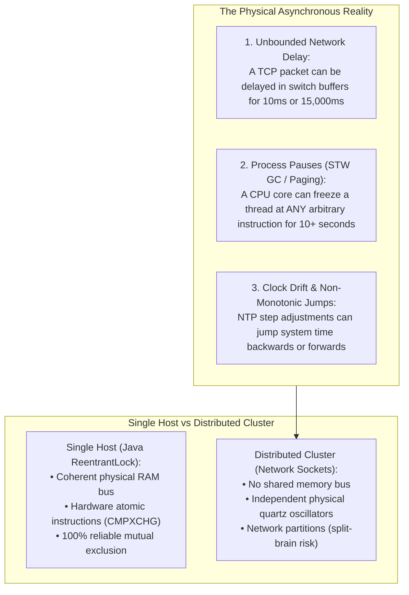
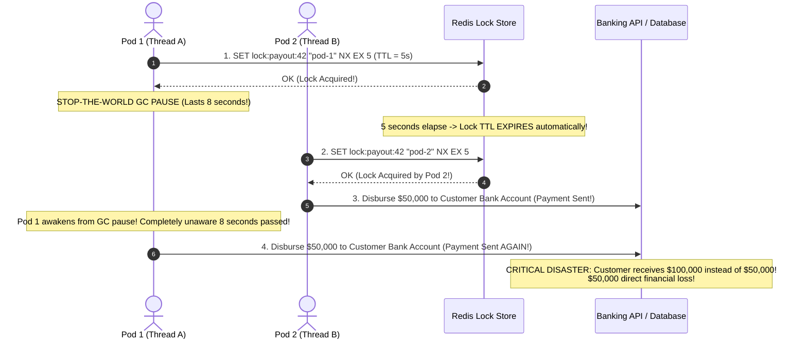
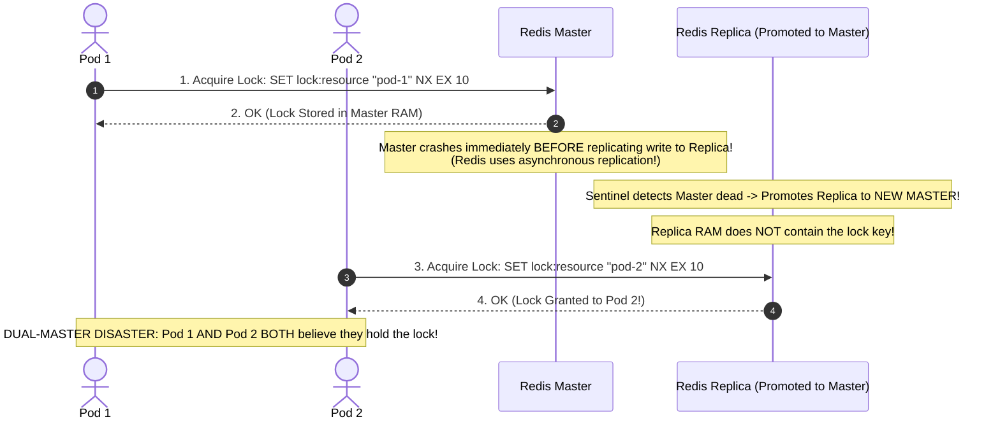
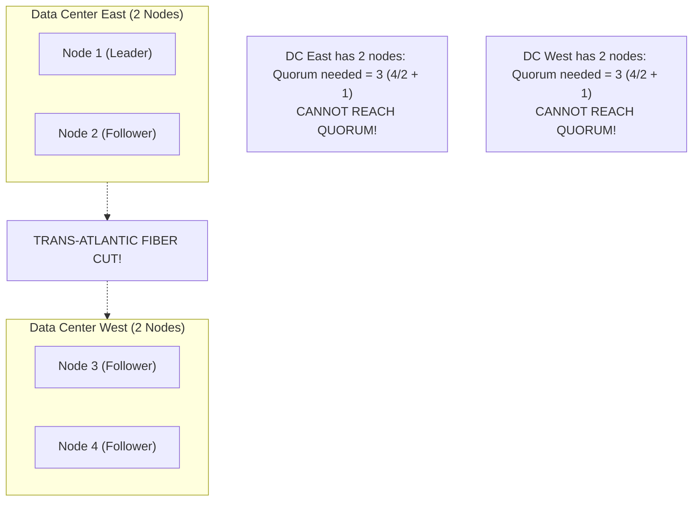
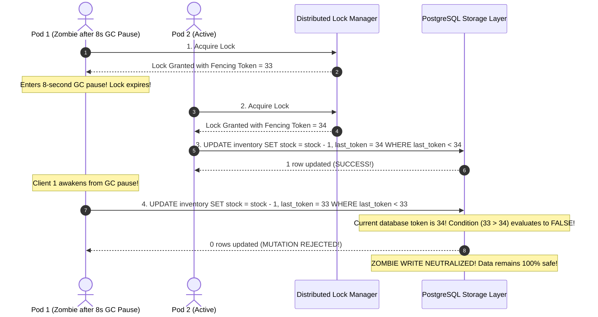
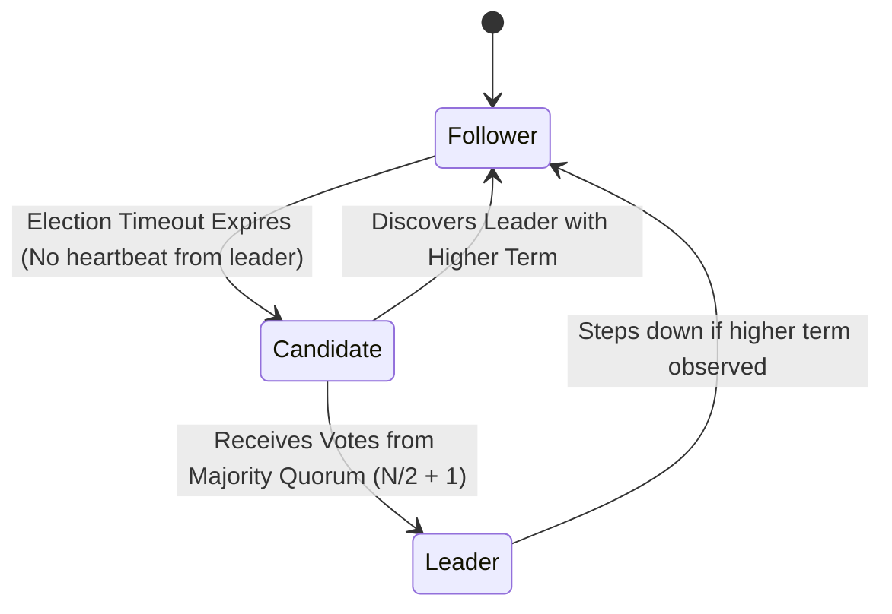
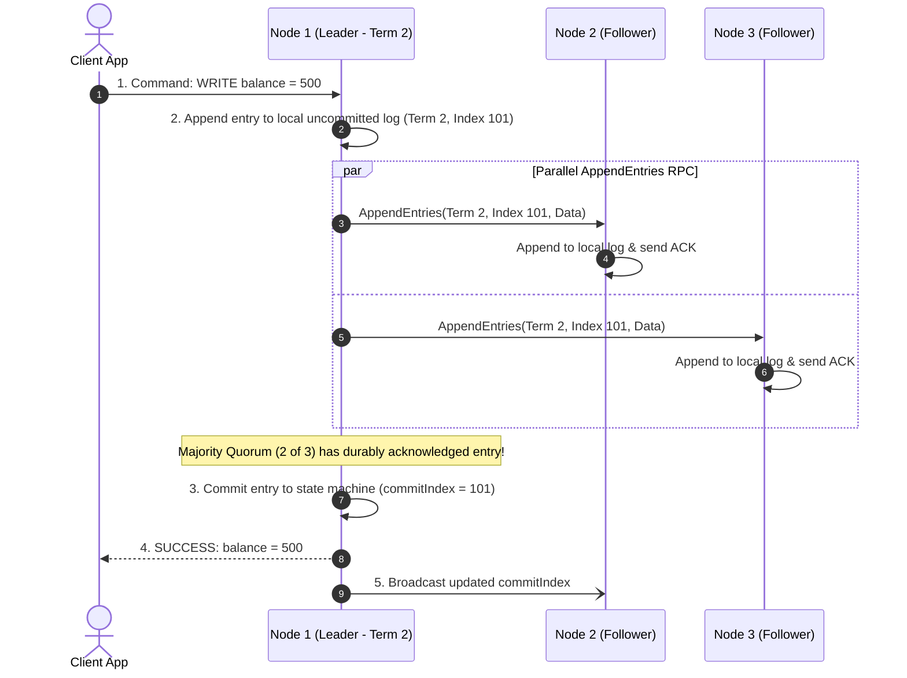
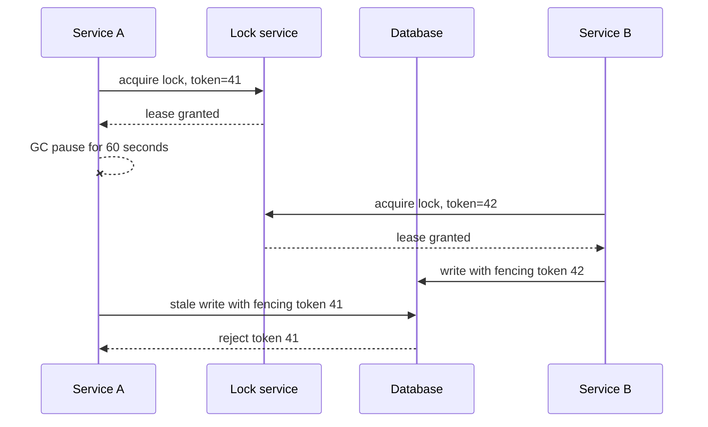

# Distributed Consensus, Locking & Fencing Tokens

In a single-process Java application, enforcing mutual exclusion is straightforward: primitives like `ReentrantLock` or `synchronized` synchronize threads using physical CPU cache coherency protocols (MESI) and OS kernel futex wait queues.

However, in modern distributed architectures running across dozens of Kubernetes pods, instances cannot inspect each other's memory. Coordinating access to shared resources (e.g., executing a once-per-day payout job, processing a physical inventory reservation, claiming a hardware device, or electing a cluster leader) requires **Distributed Locking and Consensus**.

Relying on naive distributed locks—such as Redis `SETNX` with a lease timeout (TTL)—creates insidious concurrency race conditions that corrupt production ledgers.

Senior backend engineers understand the physical limits of asynchronous networks and design distributed systems using **Martin Kleppmann Fencing Tokens, storage-level guards, and strict Quorum Consensus algorithms (Raft, etcd, ZooKeeper)**.

---

## Phase 1: Ground Floor (Physical First Principles)

To build reliable distributed coordination, you must confront the physical laws of distributed computing: **asynchronous networks, hardware execution pauses, and physical clock unreliability**.



### 1. Why Single-Process Locks Cannot Scale Over Networks
On a single computer motherboard, CPU cores communicate over a high-speed coherent memory bus. When a thread executes `AtomicInteger.compareAndSet()` or acquires a `ReentrantLock`, the CPU hardware coordinates cache line states across cores via atomic bus locking (`LOCK CMPXCHG`).

Across independent servers, there is **no shared memory, no shared clock, and no shared bus**. Nodes communicate exclusively by passing serialized byte packets across copper cables, fiber optics, and network switches.

### 2. The Fallacy of Distributed Time
A distributed lock that relies on time (e.g., "grant this lock for 5,000 milliseconds") assumes that:
1. Time moves at the exact same rate on all machines.
2. A process knows how much time has elapsed since it last checked the clock.

In reality, physical quartz crystal oscillators drift, NTP daemons occasionally jump time backwards to correct skew, and **threads can be frozen at any machine instruction** by Stop-The-World (STW) Garbage Collection, hypervisor CPU steal time, or Linux virtual memory page faults.

---

## Phase 2: The Naive Code (The Production Crashes)

### Crash Scenario 1: The Redis `SETNX` GC Pause Double-Spend Disaster

A development team implements a distributed lock to prevent duplicate payment disbursements using Redis:

```java
// DANGEROUS ANTI-PATTERN: Naive Redis distributed lock without fencing tokens
@Service
public class PayoutProcessingService {

    @Autowired
    private StringRedisTemplate redisTemplate;

    public void processPayout(Long payoutId) {
        String lockKey = "lock:payout:" + payoutId;
        String clientId = UUID.randomUUID().toString();

        // 1. Acquire lock with 5-second TTL
        Boolean acquired = redisTemplate.opsForValue()
                .setIfAbsent(lockKey, clientId, Duration.ofSeconds(5));

        if (Boolean.TRUE.equals(acquired)) {
            try {
                // FATAL DISASTER OCCURS HERE:
                // What happens if this thread enters an 8-second GC pause?
                disburseFundsToBank(payoutId);
            } finally {
                // Naive release
                redisTemplate.delete(lockKey);
            }
        }
    }
}
```



#### What Happened in Production:
- Thread A acquired the lock for 5 seconds.
- A major G1GC collection paused the JVM for 8 seconds.
- While Thread A was asleep, the lock expired in Redis.
- Thread B acquired the now-available lock and executed the payout.
- Thread A woke up, believed it still owned the lock, and executed the payout a second time.
- The company disbursed duplicate funds to thousands of vendors.

---

### Crash Scenario 2: The Asynchronous Redis Replication Failover Split-Brain

A team configures Redis Sentinel with a Primary and two Replicas to make their lock manager "high availability":



#### What Happened in Production:
- Redis uses **asynchronous replication** to maximize throughput.
- When the primary Redis node confirmed the lock acquisition to Pod 1, the change had not yet traveled across the network to the replica.
- The primary crashed (hardware power surge). Sentinel promoted the replica.
- Pod 2 requested the same lock from the new primary, which had no record of Pod 1's lock.
- **Both Pod 1 and Pod 2 operated on the protected resource concurrently**, corrupting database rows.

---

### Crash Scenario 3: The 4-Node Cluster Split-Brain Deadlock

An infrastructure engineer deploys a 4-node Raft consensus cluster across two data centers: 2 nodes in DC-East and 2 nodes in DC-West.



#### What Happened in Production:
- A network partition severed communication between the two data centers.
- In a 4-node cluster, a majority quorum requires:
  $$\lfloor \frac{4}{2} \rfloor + 1 = 3\text{ nodes}$$
- Neither data center could assemble 3 nodes.
- **The entire cluster deadlocked globally**. Neither side could elect a leader, and all read/write locks hung indefinitely until manual network restoration.
- **The Physical Rule**: Adding an even number of nodes adds **zero** additional fault tolerance while dramatically increasing split-brain deadlock risk!

---

## Phase 3: Under the Hood (Mechanics, State Machines & Algorithms)

### 1. Martin Kleppmann's Solution: Monotonic Fencing Tokens

In 2016, distributed systems researcher **Martin Kleppmann** proved that a distributed lock service cannot guarantee mutual exclusion in an asynchronous network unless the lock service issues a **strictly monotonically increasing number** called a **Fencing Token**.



#### The Non-Negotiable Storage Invariant:
A lock cannot protect a resource by itself; **the storage engine must validate the fencing token**:
```sql
UPDATE shared_resources
SET payload = :newData,
    last_fencing_token = :incomingToken,
    updated_at = CURRENT_TIMESTAMP
WHERE id = :resourceId
  AND last_fencing_token < :incomingToken;
```
If an outdated zombie process attempts to write with token `33` when the database has already seen token `34`, the database updates **0 rows**, completely neutralizing the race condition!

Line-by-line fencing guard:

- `UPDATE shared_resources` targets the real resource, not the lock record. The invariant must live beside the state being protected.
- `SET payload = :newData` is the business mutation the lock holder wants to perform.
- `last_fencing_token = :incomingToken` records the newest accepted owner.
- `WHERE id = :resourceId` scopes the guard to one resource.
- `AND last_fencing_token < :incomingToken` is the stale-owner defense. A paused process with token 33 cannot overwrite work already done by token 34.

Proof drill: simulate worker A with token 33 pausing for 60 seconds, worker B with token 34 completing the update, then worker A resuming. Worker A's update count must be zero.

---

### 2. Complete Java Fencing Token Storage Guard Implementation

Below is the production implementation of Spring Boot 3 with JDBC Client enforcing storage-level fencing token protection:

```java
package com.backend.consensus.service;

import com.backend.consensus.exception.StaleFencingTokenException;
import org.slf4j.Logger;
import org.slf4j.LoggerFactory;
import org.springframework.jdbc.core.simple.JdbcClient;
import org.springframework.stereotype.Service;
import org.springframework.transaction.annotation.Transactional;

@Service
public class FencingTokenStorageGuard {

    private static final Logger log = LoggerFactory.getLogger(FencingTokenStorageGuard.class);
    private final JdbcClient jdbcClient;

    public FencingTokenStorageGuard(JdbcClient jdbcClient) {
        this.jdbcClient = jdbcClient;
    }

    public record GuardedMutation(String resourceId, long fencingToken, String stateData) {}

    @Transactional
    public void executeGuardedWrite(GuardedMutation mutation) {
        log.info("Attempting guarded write for resource {} with fencing token {}",
                mutation.resourceId(), mutation.fencingToken());

        // Storage Guard: Atomic compare-and-swap on monotonic fencing token
        int rowsUpdated = jdbcClient.sql("""
            UPDATE protected_resources
            SET state_payload = :data,
                last_fencing_token = :token,
                last_modified_at = CURRENT_TIMESTAMP
            WHERE id = :id
              AND last_fencing_token < :token
        """)
        .param("data", mutation.stateData())
        .param("token", mutation.fencingToken())
        .param("id", mutation.resourceId())
        .update();

        if (rowsUpdated == 0) {
            // Check if resource exists or if this was an obsolete zombie write
            Long currentCommittedToken = jdbcClient.sql("SELECT last_fencing_token FROM protected_resources WHERE id = :id")
                    .param("id", mutation.resourceId())
                    .query(Long.class)
                    .optional()
                    .orElse(null);

            if (currentCommittedToken != null && currentCommittedToken >= mutation.fencingToken()) {
                log.error("ZOMBIE PROCESS DETECTED: Incoming token {} is obsolete! Current database token is {}. Write rejected.",
                        mutation.fencingToken(), currentCommittedToken);
                throw new StaleFencingTokenException(
                    "Stale fencing token %d rejected. Database holds newer token %d."
                    .formatted(mutation.fencingToken(), currentCommittedToken)
                );
            }

            throw new IllegalStateException("Protected resource not found: " + mutation.resourceId());
        }

        log.info("Fencing token {} verified. Resource {} updated successfully.",
                mutation.fencingToken(), mutation.resourceId());
    }
}
```

---

### 3. The Redlock Debate: Redis (AP) vs ZooKeeper / etcd (CP)

In 2016, Salvatore Sanfilippo (Antirez) proposed **Redlock**, an algorithm where a client contacts 5 independent Redis master nodes and considers the lock acquired if a majority (3 of 5) grant it within a timeout.

Martin Kleppmann published a famous rebuttal, proving that Redlock cannot guarantee safety because it fundamentally relies on **synchronized physical clocks** (`System.currentTimeMillis()`), which suffer from hardware clock drift, NTP step corrections, and unpredictable execution delays.

| Dimension | Redis / Redlock (AP-Leaning) | etcd / ZooKeeper (Strict CP Consensus) |
| :--- | :--- | :--- |
| **Consistency Model** | Eventual Consistency (Asynchronous replication) | **Linearizable Consistency** (Raft / Zab Consensus) |
| **Failover Safety** | **Unsafe**: Master failover can lose granted locks | **100% Safe**: Quorum commit required before lock granted |
| **Time Dependence** | Relies on physical wall-clock timestamps and TTL | Relies on logical term numbers and Raft heartbeats |
| **Throughput** | Ultra-high (100,000+ ops/sec per node) | Moderate (Disk fsync quorum bottleneck: ~5,000 ops/sec) |
| **Ideal Production Use Case**| Non-critical task deduplication, rate limiting, cache filling | **Financial ledgers, leader election, cluster orchestration** |

---

### 4. Distributed Consensus: The Raft Algorithm Internals

When a distributed cluster must agree on a single sequence of state transitions, it uses **Raft**:



#### 1. Quorum Mathematics ($2F + 1$)
To tolerate $F$ arbitrary node crashes or network disconnections, a consensus cluster requires a minimum of $2F + 1$ total nodes:

$$\text{Total Nodes } N = 2F + 1 \implies \text{Quorum Majority} = \lfloor \frac{N}{2} \rfloor + 1$$

| Total Nodes ($N$) | Quorum Required | Tolerated Failures ($F$) | Why Even Numbers Are Banned |
| :--- | :--- | :--- | :--- |
| **1 node** | 1 | 0 | Single point of failure |
| **3 nodes** | 2 | **1 node failure** | Standard minimal production cluster |
| **4 nodes** | 3 | **1 node failure** | **Terrible**: Same tolerance as 3 nodes, but higher partition risk! |
| **5 nodes** | 3 | **2 node failures** | Standard high-availability production cluster |
| **7 nodes** | 4 | **3 node failures** | Hyperscale mission-critical cluster |

#### 2. Raft Log Replication & Commit Protocol



---

## Distributed Locks & Consensus Fundamentals Drill

A distributed lock is not the same as a local `synchronized` block. A local lock protects memory inside one JVM. A distributed lock tries to coordinate multiple machines that can pause, lose network access, restart, or keep running after their lock lease has expired.



The important part is not just "who holds the lock." The important part is whether the protected resource can reject an old owner after lease expiry.

### Lock, Lease, Fencing Token, Consensus

| Concept | Meaning | Production rule |
| --- | --- | --- |
| Local lock | Coordinates threads in one process. | Does not protect multiple pods. |
| Distributed lock | Coordinates processes across machines. | Must assume pauses and partitions. |
| Lease | Lock with expiration. | Expiration prevents dead owners from blocking forever. |
| Fencing token | Monotonic number attached to each lock grant. | Downstream resource rejects stale owners. |
| Consensus | Agreement protocol among nodes. | Needed for strong leadership and metadata correctness. |

### Why "I Used Redis SET NX" Is Not A Complete Answer

`SET key value NX PX 30000` can be useful for soft coordination, but it is not the full correctness story.

You still must answer:

1. What if the holder pauses longer than the lease?
2. What if the operation continues after the lock expires?
3. Can the downstream database compare fencing tokens?
4. What if Redis fails over and loses recent writes?
5. Is this a correctness lock or just duplicate-work reduction?

If duplicate work is harmless, a Redis lock can be enough. If two writers can corrupt money, inventory, or leadership state, use a consensus-backed system or push the invariant into the database with constraints and fencing.

### Example: Scheduled Billing Job

Bad design:

```markdown
Every pod runs @Scheduled at midnight.
Each pod scans invoices and charges cards.
Redis lock prevents duplicates most of the time.
```

Deeper design:

```markdown
Use a lease to choose one coordinator.
Each batch claim writes a fencing token or uses SELECT FOR UPDATE SKIP LOCKED.
Each payment command has an idempotency key.
The ledger has a unique constraint preventing duplicate charge records.
```

The senior answer layers protection. The lock reduces duplicate work; the database constraint protects correctness.

### Build-Break-Fix Drill

Build:

```markdown
Run two instances of the same scheduled job against one database table.
```

Break:

```markdown
Pause the lock holder for longer than the lease.
Restart Redis during lock ownership.
Send the same job item twice.
```

Fix:

```markdown
Add fencing tokens.
Add unique constraints.
Add idempotent job item processing.
Move critical correctness into the database transaction.
```

## Phase 4: Senior Interview Ace (Junior vs Staff Phrasing)

| Question / Scenario | Junior Developer Answer | Senior / Staff Backend Engineer Answer |
| :--- | :--- | :--- |
| **Why can a distributed lock with an expiration TTL not guarantee mutual exclusion during a JVM GC pause?** | "Because the lock runs out of time and gets released while the code is running." | "In an asynchronous distributed system, a thread can be frozen at any machine instruction by a Stop-The-World GC pause, OS paging, or hypervisor steal time. If Thread A acquires a lock with a 5-second TTL and enters an 8-second GC pause, the lock manager expires the lease. Thread B acquires the lock and mutates the resource. When Thread A awakens, it has **no physical way of knowing that time elapsed** and proceeds to execute its write. Without storage-level verification, Thread A overwrites and corrupts Thread B's work. TTLs guarantee fault tolerance (preventing deadlocks on crash), but **cannot guarantee safety**." |
| **What is a Fencing Token and how does it prevent the zombie write problem?** | "It's a unique token generated by UUID to identify the lock holder." | "A Fencing Token is a **strictly monotonically increasing number** (1, 2, 3...) issued by the lock manager upon every lock acquisition. It is designed to be validated by the storage layer (PostgreSQL, MySQL, or S3). The database enforces an atomic check: `UPDATE table SET ... WHERE last_fencing_token < :incomingToken`. When a delayed zombie process awakens from a GC pause and attempts to write with an older token, the database detects that a higher token has already committed and **rejects the zombie write with 0 rows updated**." |
| **Why must Raft and ZooKeeper clusters always use an odd number of nodes (3, 5, 7)?** | "Odd numbers look better and prevent ties when voting." | "Consensus algorithms require a strict majority quorum: $\lfloor N/2 \rfloor + 1$. A 3-node cluster requires a quorum of 2, tolerating 1 failure. A 4-node cluster requires a quorum of 3, meaning it **still tolerates only 1 failure** ($4 - 3 = 1$). Adding a 4th node adds zero additional fault tolerance while increasing network coordination traffic and introducing split-brain risks during network splits (a 2-2 partition cannot form quorum on either side). An odd number of nodes maximizes fault tolerance per server cost and eliminates split-vote deadlocks." |
| **When would you choose a Redis distributed lock (Redisson) versus an etcd/ZooKeeper lock?** | "Redis is faster, so we always use Redis." | "The choice depends on the consequence of lock failure. Redis uses asynchronous replication; if the primary crashes before replicating to its replica, the promoted replica can grant the same lock to a second client. Therefore, **use Redis (Redisson) for high-throughput, non-critical tasks** where duplicate execution is harmless (e.g. cache pre-warming, sending duplicate marketing emails, or rate limiting). **Use etcd, ZooKeeper, or PostgreSQL advisory locks for critical financial transactions** (e.g. banking disbursements, ledger entries, or master election) where a dual-lock acquisition causes unrecoverable data corruption." |
| **What happens during a network partition in a 5-node Raft consensus cluster?** | "The cluster goes down until the network is fixed." | "The cluster splits into two partitions: a majority partition (e.g., 3 nodes) and a minority partition (2 nodes). The **majority partition** ($3 \ge 3$) maintains quorum, elects a leader if necessary, and continues processing client reads and writes with full ACID linearizability. The **minority partition** ($2 < 3$) cannot achieve quorum; any candidate in the minority fails to win elections, and any existing leader in the minority partition **rejects all client write requests**. When the network partition heals, the minority nodes catch up with the majority leader's committed log entries." |

---

## Production Debugging Checklist

<AccordionGroup>
  <Accordion title="1. Investigating Silent Data Overwrites (Zombie Writes)">
    - [ ] Verify whether the distributed lock issues a monotonically increasing Fencing Token.
    - [ ] Verify that the database schema contains a `last_fencing_token` column.
    - [ ] Inspect the update query: Ensure it includes `WHERE last_fencing_token < :incomingToken`.
    - [ ] Review JVM GC logs: Check for Stop-The-World pauses exceeding $1,000\text{ ms}$ during the incident window.
  </Accordion>

  <Accordion title="2. Diagnosing Lost Locks During Redis Failover">
    - [ ] Check Redis replication lag metrics: `redis-cli info replication`.
    - [ ] Verify whether the cluster suffered a master crash and Sentinel/Cluster failover.
    - [ ] For mission-critical state, replace Redis locks with PostgreSQL transactional advisory locks (`pg_advisory_xact_lock()`) or an etcd consensus cluster.
  </Accordion>

  <Accordion title="3. Raft Cluster Quorum Loss / Read-Only State">
    - [ ] Check health status of all consensus nodes: `etcdctl endpoint health` or ZooKeeper `ruok`.
    - [ ] Count active responsive nodes: Ensure at least $\lfloor N/2 \rfloor + 1$ nodes are reachable.
    - [ ] Inspect network switch metrics for packet drop spikes or cross-availability-zone link failures.
  </Accordion>
</AccordionGroup>

---

## Done Checklist

<Check>
Distributed locks with lease timeouts (TTLs) are paired with storage-enforced Fencing Tokens to prevent GC pause data corruption.
</Check>
<Check>
The storage layer enforces the fencing invariant: `WHERE last_fencing_token < :incomingToken`.
</Check>
<Check>
Consensus clusters (Raft, ZooKeeper, etcd) always deploy an odd number of nodes (3, 5, or 7).
</Check>
<Check>
Asynchronous AP stores (Redis) are reserved for non-destructive deduplication; CP stores (etcd, Postgres) are used for critical state.
</Check>
<Check>
Application retry logic handles `StaleFencingTokenException` gracefully by aborting zombie execution paths.
</Check>
<Check>
Database constraints (unique indexes, check constraints) serve as the final backstop against distributed concurrency anomalies.
</Check>
