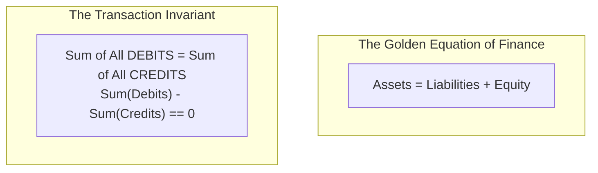
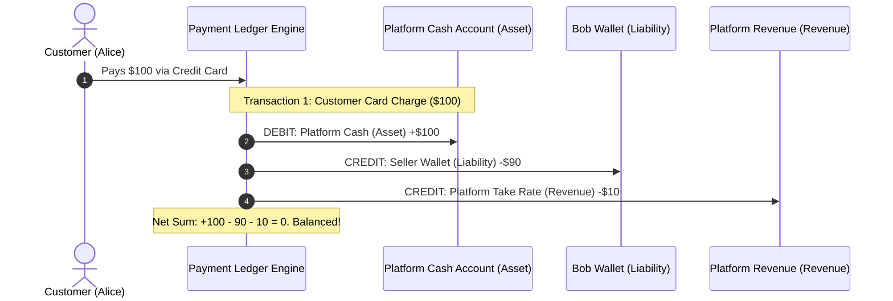
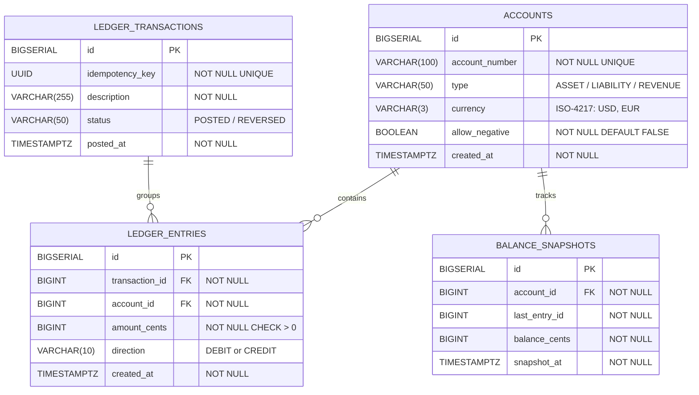
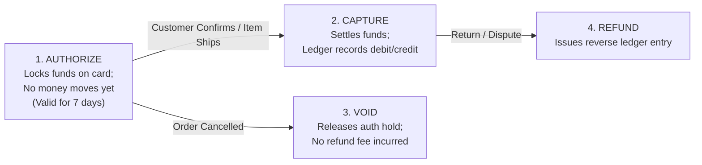
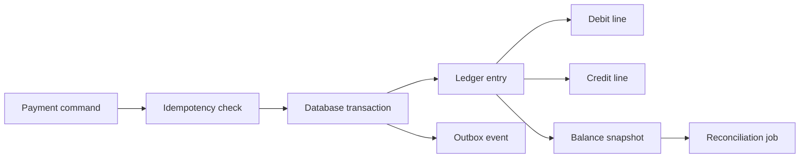

# Financial Ledger & Double-Entry Bookkeeping

In software engineering, handling money is fundamentally different from managing standard web data. If an e-commerce platform drops an unread notification or miscounts page views, the business suffers no legal penalty. 

However, if a payment system drops a $500 transfer, duplicates a payout, or loses 1 cent due to floating-point rounding, the company faces **financial loss, regulatory audits, SOC 2 compliance failure, and criminal liability**.

Senior backend engineers at tier-1 companies (Stripe, Adyen, Uber, Amazon, Airbnb) never store money as a mutable `balance` column in a `users` table. They build **Immutable Double-Entry Financial Ledgers**.

## Prerequisites: Before You Begin

Before designing financial ledgers, ensure you understand:
- Relational database ACID transactions and isolation levels (Serializable vs Read Committed).
- SQL constraints: `CHECK`, foreign keys with `ON DELETE RESTRICT`, and unique constraints.
- Java arithmetic precision (`BigDecimal` vs 64-bit integer minor units).

---

## 1. Why Mutating Balances Is an Enterprise Anti-Pattern

A junior engineer models user balances with a single column:

```sql
-- DANGEROUS JUNIOR ANTI-PATTERN:
CREATE TABLE accounts (
    id BIGSERIAL PRIMARY KEY,
    user_id BIGINT NOT NULL,
    balance NUMERIC(10, 2) NOT NULL -- MUTABLE BALANCE!
);
```

When Alice transfers $100 to Bob, the application executes:
```sql
UPDATE accounts SET balance = balance - 100 WHERE id = 1; -- Alice
UPDATE accounts SET balance = balance + 100 WHERE id = 2; -- Bob
```

### The 4 Fatal Flaws of Mutable Balances
1. **Zero Audit Trail**: If Alice claims she had $500 yesterday and now has $300, you cannot prove where the $200 went. You cannot answer: *Who moved it? Which transaction did it belong to? Did a bug execute twice?*
2. **Race Conditions & Lost Updates**: Concurrent transfers interleave. Even with transactions, high-frequency updates to the same account row cause severe lock contention and deadlocks.
3. **Floating-Point Drift**: Using floating-point data types (`FLOAT`, `DOUBLE`) introduces catastrophic binary rounding errors ($0.1 + 0.2 = 0.30000000000000004$). Over millions of transactions, pennies vanish into thin air.
4. **Audit Failure**: External financial auditors and regulators immediately reject mutable databases because records can be modified or deleted without a cryptographic or historical trail.

---

## 2. Core Principles of Double-Entry Bookkeeping

Originating in Renaissance Italy in 1494 (formalized by Luca Pacioli), **Double-Entry Bookkeeping** has governed global commerce for over 500 years.



### 2.1 The 5 Fundamental Account Types

Every account in a financial system belongs to one of five categories:

| Account Type | Definition | Normal Balance | Debit Impact ($+$ or $-$) | Credit Impact ($+$ or $-$) |
| :--- | :--- | :--- | :--- | :--- |
| **Asset** | Resources owned (Cash in bank, Accounts Receivable) | Debit | **$+$ Increases** | **$-$ Decreases** |
| **Liability** | Debts owed to others (Customer wallet balances, Payables) | Credit | **$-$ Decreases** | **$+$ Increases** |
| **Equity** | Net worth / Owner's capital | Credit | **$-$ Decreases** | **$+$ Increases** |
| **Revenue** | Income earned from sales or platform fees | Credit | **$-$ Decreases** | **$+$ Increases** |
| **Expense** | Costs incurred (Payment gateway fees, Server costs) | Debit | **$+$ Increases** | **$-$ Decreases** |

### 2.2 The Zero-Sum Invariant
- Money never appears or disappears; **it only moves from one account to another**.
- Every transaction consists of at least two ledger entries.
- The net sum of all entries inside a transaction must **strictly equal zero**:

$$\sum \text{Debits} - \sum \text{Credits} = 0$$

If a transaction does not balance to zero, the database must reject the entire operation with a constraint violation!

---

## 3. Real-World Money Movement: Checkout & Platform Fee

Consider a customer (Alice) buying a $100 jacket on a marketplace platform from a seller (Bob). The platform charges a 10% take rate ($10 platform fee).



### Ledger Entry Table Representation

| Entry ID | Transaction ID | Account | Direction | Amount (Cents) | Explanation |
| :--- | :--- | :--- | :--- | :--- | :--- |
| `1001` | `TX-8801` | `Platform Cash (Stripe)` | **DEBIT** | `10000` ($100.00) | Cash asset increased by $100 |
| `1002` | `TX-8801` | `Bob's Seller Wallet` | **CREDIT** | `9000` ($90.00) | Owe Bob $90 (Liability increased) |
| `1003` | `TX-8801` | `Platform Marketplace Fee`| **CREDIT** | `1000` ($10.00) | Platform earned $10 revenue |

Notice: $\text{Debits (10000)} - \text{Credits (9000 + 1000)} = 0$. The transaction is perfectly balanced.

---

## 4. PostgreSQL Database Schema for an Immutable Ledger



### PostgreSQL Flyway DDL (`V1__init_financial_ledger.sql`)

```sql
-- 1. Chart of Accounts
CREATE TABLE accounts (
    id BIGSERIAL PRIMARY KEY,
    account_number VARCHAR(100) NOT NULL UNIQUE,
    name VARCHAR(150) NOT NULL,
    type VARCHAR(30) NOT NULL CHECK (type IN ('ASSET', 'LIABILITY', 'EQUITY', 'REVENUE', 'EXPENSE')),
    currency VARCHAR(3) NOT NULL DEFAULT 'USD',
    allow_negative BOOLEAN NOT NULL DEFAULT FALSE,
    created_at TIMESTAMP WITH TIME ZONE NOT NULL DEFAULT CURRENT_TIMESTAMP
);

CREATE INDEX idx_accounts_type ON accounts(type);

-- 2. Ledger Transactions (Group of Balanced Entries)
CREATE TABLE ledger_transactions (
    id BIGSERIAL PRIMARY KEY,
    idempotency_key UUID NOT NULL UNIQUE,
    description VARCHAR(255) NOT NULL,
    status VARCHAR(30) NOT NULL DEFAULT 'POSTED' CHECK (status IN ('POSTED', 'REVERSED')),
    posted_at TIMESTAMP WITH TIME ZONE NOT NULL DEFAULT CURRENT_TIMESTAMP
);

CREATE INDEX idx_ledger_tx_posted ON ledger_transactions(posted_at DESC);

-- 3. Immutable Ledger Entries (Append-Only!)
CREATE TABLE ledger_entries (
    id BIGSERIAL PRIMARY KEY,
    transaction_id BIGINT NOT NULL REFERENCES ledger_transactions(id) ON DELETE RESTRICT,
    account_id BIGINT NOT NULL REFERENCES accounts(id) ON DELETE RESTRICT,
    amount_cents BIGINT NOT NULL CHECK (amount_cents > 0),
    direction VARCHAR(6) NOT NULL CHECK (direction IN ('DEBIT', 'CREDIT')),
    created_at TIMESTAMP WITH TIME ZONE NOT NULL DEFAULT CURRENT_TIMESTAMP
);

CREATE INDEX idx_entries_account ON ledger_entries(account_id, id);
CREATE INDEX idx_entries_transaction ON ledger_entries(transaction_id);

-- 4. Materialized Balance Snapshots for O(1) Reads
CREATE TABLE balance_snapshots (
    id BIGSERIAL PRIMARY KEY,
    account_id BIGINT NOT NULL REFERENCES accounts(id) ON DELETE RESTRICT,
    last_entry_id BIGINT NOT NULL,
    balance_cents BIGINT NOT NULL,
    snapshot_at TIMESTAMP WITH TIME ZONE NOT NULL DEFAULT CURRENT_TIMESTAMP,
    CONSTRAINT uq_account_snapshot UNIQUE (account_id, last_entry_id)
);

CREATE INDEX idx_snapshots_account ON balance_snapshots(account_id, snapshot_at DESC);
```

<Alert type="important">
Notice the `ON DELETE RESTRICT` foreign keys! In a financial ledger, you **never cascade delete** accounts or transactions. Once an entry is written, it is physically illegal to delete it.
</Alert>

---

## 5. Currency Math: Why Floating-Point Is Forbidden

Never use `float`, `double`, or unconstrained decimals for money:

```java
// FATAL FLOATING POINT DISASTER:
double price = 0.10;
double total = price * 3;
System.out.println(total); // Outputs: 0.30000000000000004 !
```

### The Two Approved Approaches:
1. **64-bit Integer Minor Units (Cents/Micros)**: Store all amounts as integers representing the smallest unit of currency (e.g. $10.50 is stored as `1050` cents). For cryptocurrencies or fractional micro-transactions, store amounts in micros ($10^{-6}$) or satoshis.
2. **Java `BigDecimal` with Explicit Scale**: When performing division or interest calculations, always specify the scale and `RoundingMode.HALF_EVEN` (Banker's Rounding):

```java
BigDecimal principal = new BigDecimal("100.00");
BigDecimal rate = new BigDecimal("0.05");
BigDecimal interest = principal.multiply(rate).setScale(2, RoundingMode.HALF_EVEN);
```

---

## 6. Complete Java Spring Boot Ledger Engine

Below is the production-grade transaction service that atomically validates zero-sum balance invariants before committing:

```java
package com.example.ledger.service;

import com.example.ledger.domain.Account;
import com.example.ledger.domain.EntryDirection;
import com.example.ledger.repository.AccountRepository;
import org.springframework.jdbc.core.simple.JdbcClient;
import org.springframework.stereotype.Service;
import org.springframework.transaction.annotation.Isolation;
import org.springframework.transaction.annotation.Transactional;

import java.util.List;
import java.util.UUID;

@Service
public class FinancialLedgerService {

    private final JdbcClient jdbcClient;
    private final AccountRepository accountRepository;

    public FinancialLedgerService(JdbcClient jdbcClient, AccountRepository accountRepository) {
        this.jdbcClient = jdbcClient;
        this.accountRepository = accountRepository;
    }

    public record EntryCommand(Long accountId, long amountCents, EntryDirection direction) {}
    public record TransactionCommand(UUID idempotencyKey, String description, List<EntryCommand> entries) {}

    @Transactional(isolation = Isolation.READ_COMMITTED)
    public Long recordTransaction(TransactionCommand command) {
        // Step 1: Validate Non-Empty Entries
        if (command.entries() == null || command.entries().size() < 2) {
            throw new IllegalArgumentException("A transaction must contain at least 2 entries.");
        }

        // Step 2: Validate Zero-Sum Balance Invariant: Sum(Debits) == Sum(Credits)
        long totalDebits = 0;
        long totalCredits = 0;

        for (EntryCommand entry : command.entries()) {
            if (entry.amountCents() <= 0) {
                throw new IllegalArgumentException("Entry amount must be strictly positive: " + entry.amountCents());
            }
            if (entry.direction() == EntryDirection.DEBIT) {
                totalDebits += entry.amountCents();
            } else {
                totalCredits += entry.amountCents();
            }
        }

        if (totalDebits != totalCredits) {
            throw new UnbalancedTransactionException(
                String.format("Unbalanced transaction! Total Debits (%d) != Total Credits (%d)", totalDebits, totalCredits)
            );
        }

        // Step 3: Insert Transaction Header with Idempotency Key
        Long transactionId = jdbcClient.sql("""
            INSERT INTO ledger_transactions (idempotency_key, description)
            VALUES (:key, :desc)
            RETURNING id
        """)
        .param("key", command.idempotencyKey())
        .param("desc", command.description())
        .query(Long.class)
        .single();

        // Step 4: Insert Individual Ledger Entries
        for (EntryCommand entry : command.entries()) {
            // Check account balance constraint if account does not allow overdraft
            validateAccountBalance(entry.accountId(), entry.amountCents(), entry.direction());

            jdbcClient.sql("""
                INSERT INTO ledger_entries (transaction_id, account_id, amount_cents, direction)
                VALUES (:txId, :accId, :amount, :direction)
            """)
            .param("txId", transactionId)
            .param("accId", entry.accountId())
            .param("amount", entry.amountCents())
            .param("direction", entry.direction().name())
            .update();
        }

        return transactionId;
    }

    private void validateAccountBalance(Long accountId, long amountCents, EntryDirection direction) {
        Account account = accountRepository.findById(accountId)
                .orElseThrow(() -> new IllegalArgumentException("Account not found: " + accountId));

        if (!account.isAllowNegative() && account.getType().isDecreasedBy(direction)) {
            long currentBalance = calculateAccountBalance(accountId);
            if (currentBalance < amountCents) {
                throw new InsufficientFundsException(
                    String.format("Insufficient funds in account %s. Current: %d, Required: %d",
                            account.getAccountNumber(), currentBalance, amountCents)
                );
            }
        }
    }

    public long calculateAccountBalance(Long accountId) {
        // Fast calculation: Snapshot balance + un-snapshotted entries
        return jdbcClient.sql("""
            SELECT COALESCE(
                SUM(CASE 
                    WHEN e.direction = 'DEBIT' AND a.type IN ('ASSET', 'EXPENSE') THEN e.amount_cents
                    WHEN e.direction = 'CREDIT' AND a.type IN ('LIABILITY', 'EQUITY', 'REVENUE') THEN e.amount_cents
                    ELSE -e.amount_cents 
                END), 0)
            FROM ledger_entries e
            JOIN accounts a ON a.id = e.account_id
            WHERE e.account_id = :accId
        """)
        .param("accId", accountId)
        .query(Long.class)
        .single();
    }
}
```

---

## 7. High-Performance Balance Queries: Materialized Snapshots

Calculating account balances by running `SUM(amount_cents)` across millions of rows takes seconds and saturates disk I/O.

### The Snapshot Solution: $O(1)$ Balance Reads
1. A nightly batch worker takes a point-in-time balance snapshot:
   ```sql
   INSERT INTO balance_snapshots (account_id, last_entry_id, balance_cents)
   VALUES (42, 100500, 245000);
   ```
2. Real-time balance queries only sum entries created **after** the snapshot:

$$\text{Current Balance} = \text{Snapshot Balance} + \sum \text{Entries where } \text{id} > \text{last\_entry\_id}$$

```sql
SELECT 
    s.balance_cents + COALESCE(SUM(
        CASE 
            WHEN e.direction = 'DEBIT' THEN e.amount_cents 
            ELSE -e.amount_cents 
        END
    ), 0) AS live_balance
FROM balance_snapshots s
LEFT JOIN ledger_entries e 
       ON e.account_id = s.account_id 
      AND e.id > s.last_entry_id
WHERE s.account_id = :accountId
ORDER BY s.snapshot_at DESC
LIMIT 1;
```

This reduces query time from 800ms down to **under 1 millisecond** ($O(1)$ indexed scan)!

---

## 8. Two-Phase Payment Orchestration: Auth & Capture

In enterprise payment flows, charging money is split into two distinct lifecycle phases:



### Why Auth & Capture Is Standard
If an e-commerce platform immediately captured credit cards upon clicking "Checkout", and the warehouse later discovered the product was out of stock, the platform must issue a **Refund**. 

Payment gateways charge non-refundable processing fees (e.g. 2.9% + 30¢) on captures. By using **Authorize**, the platform places a temporary hold on the customer's funds for zero fees. The hold is only **Captured** once the warehouse scans and packs the physical item!

---

## 9. End-of-Day Balance Reconciliation & Drift Detection

Even with strict database constraints, production systems run scheduled reconciliation jobs to verify data integrity:

```sql
-- Nightly Drift Detection Query:
-- Checks if any transaction in the system violates the Zero-Sum Invariant
SELECT 
    transaction_id,
    SUM(CASE WHEN direction = 'DEBIT' THEN amount_cents ELSE 0 END) AS total_debits,
    SUM(CASE WHEN direction = 'CREDIT' THEN amount_cents ELSE 0 END) AS total_credits,
    SUM(CASE WHEN direction = 'DEBIT' THEN amount_cents ELSE -amount_cents END) AS imbalance
FROM ledger_entries
GROUP BY transaction_id
HAVING SUM(CASE WHEN direction = 'DEBIT' THEN amount_cents ELSE -amount_cents END) != 0;
```

If this query returns **even a single row**, Prometheus triggers an immediate **SEV-1 Critical Alert**!

---

## 10. Failure Modes & Edge Case Matrix

| Failure Mode | Root Cause | Impact | Production Defense |
| :--- | :--- | :--- | :--- |
| **Floating-Point Rounding Leak** | Using `FLOAT`/`DOUBLE` for monetary sums | Cumulative penny rounding drift across transactions | Store 64-bit integer minor units (cents) or `BigDecimal(18, 4)`. |
| **Imbalanced Transaction** | Application writes debit without corresponding credit | Ledger balance invariant violated | PostgreSQL deferred constraint trigger aborts transaction on mismatch. |
| **Duplicate Webhook Processing** | Network retry re-delivers payment capture webhook | Double payment credited to user account | Enforce unique constraint on `(idempotency_key)` or `external_ref_id`. |
| **Negative Balance Overdraft** | Concurrent debits race against remaining balance | Account balance drops below legal zero limit | Atomic check constraint `balance_cents >= 0` on account snapshot. |
| **Full Table Scan on Balances** | Querying `SUM(amount)` over millions of historical rows | High CPU and slow API latency ($>5\text{ seconds}$) | Materialized balance snapshots updated periodically. |

---

## 11. Hands-on Practice Challenge & Integration Tests

### The Lab: Enforcing the Double-Entry Zero-Sum Invariant

**Objective**: Write a PostgreSQL constraint trigger that prevents any transaction from committing if the sum of its debits does not equal the sum of its credits, and verify it with automated tests.

#### 1. The PostgreSQL Deferred Constraint Trigger

```sql
CREATE OR REPLACE FUNCTION verify_transaction_balance()
RETURNS TRIGGER AS $$
DECLARE
    imbalance BIGINT;
BEGIN
    -- Sum debits (+) and credits (-) across the transaction
    SELECT SUM(CASE WHEN direction = 'DEBIT' THEN amount_cents ELSE -amount_cents END)
    INTO imbalance
    FROM ledger_entries
    WHERE transaction_id = NEW.transaction_id;

    IF imbalance != 0 THEN
        RAISE EXCEPTION 'Financial invariant violated: Transaction % has imbalance of % cents', 
            NEW.transaction_id, imbalance;
    END IF;

    RETURN NEW;
END;
$$ LANGUAGE plpgsql;

-- Deferred constraint trigger checks balance at COMMIT time
CREATE CONSTRAINT TRIGGER trg_verify_ledger_balance
AFTER INSERT ON ledger_entries
DEFERRABLE INITIALLY DEFERRED
FOR EACH ROW
EXECUTE FUNCTION verify_transaction_balance();
```

#### 2. The Verification Test (Proving Rejection of Unbalanced Writes)

```java
@SpringBootTest
class LedgerZeroSumTest {

    @Autowired
    private JdbcTemplate jdbcTemplate;

    @Test
    void imbalancedTransaction_throwsException_andRollsBack() {
        String txId = "TX-INVALID-100";

        // Inserting an imbalanced entry: $50 DEBIT with no matching CREDIT
        assertThrows(DataAccessException.class, () -> {
            jdbcTemplate.update("""
                INSERT INTO ledger_entries (transaction_id, account_id, direction, amount_cents)
                VALUES (?, ?, 'DEBIT', 5000)
            """, txId, 101L);
        });

        // Verify zero entries were committed for this transaction
        Integer count = jdbcTemplate.queryForObject(
            "SELECT COUNT(*) FROM ledger_entries WHERE transaction_id = ?", 
            Integer.class, txId
        );
        assertEquals(0, count);
    }
}
```

---

## Ledger Fundamentals Drill

A financial ledger is not a table that stores the latest balance. It is an immutable history of money movement where every business event is recorded as balanced debits and credits.



### The Ledger Invariants

| Invariant | Meaning | How to enforce |
| --- | --- | --- |
| Debits equal credits | Money is moved, not created by accident. | Transaction check before insert commit |
| Entries are append-only | History is never silently rewritten. | No update/delete path for posted entries |
| Idempotent commands | Retries do not duplicate money movement. | Unique command key |
| Currency-safe math | No floating-point rounding drift. | integer minor units or exact decimal |
| Reconciliation exists | External systems are compared regularly. | settlement and drift reports |

### Balance Table vs Ledger Table

Naive balance table:

```sql
UPDATE accounts
SET balance = balance - 1000
WHERE id = 'buyer';

UPDATE accounts
SET balance = balance + 1000
WHERE id = 'seller';
```

This can leave the system in a half-moved state if one update succeeds and the other fails. It also destroys the audit trail unless every mutation is separately logged.

Ledger approach:

```markdown
Entry: checkout-payment-123
Line 1: buyer_cash        CREDIT 1000 cents
Line 2: platform_payable  DEBIT  1000 cents
```

The current balance becomes a derived view from posted lines. Snapshots are allowed for performance, but the immutable ledger remains the source of truth.

### Interview Answer Shape

When asked to design payments or wallet balances:

1. State that balances are derived from immutable ledger entries.
2. Use double-entry accounting for every money movement.
3. Use idempotency keys for all external commands.
4. Use database transactions for entry and line insertion.
5. Use outbox events for downstream notification.
6. Add reconciliation against payment processor settlement files.
7. Forbid floating-point currency math.

### Failure Questions You Must Be Ready For

| Question | Strong answer |
| --- | --- |
| What if the client retries payment? | Same idempotency key returns same result. |
| What if the processor captures but your server crashes? | Reconciliation and webhook idempotency repair local state. |
| What if an entry is wrong? | Post a reversal entry, never edit history silently. |
| How do you query balances fast? | Maintain transactionally updated snapshots or materialized aggregates. |
| How do you prove no money was created? | Sum debits and credits by currency and account type. |

### Build-Break-Fix Drill

Build:

```markdown
Create tables: ledger_entry, ledger_line, account, idempotency_key.
Post a payment with two balanced lines.
```

Break:

```markdown
Retry the same payment request.
Crash after one account balance update in a naive balance-table design.
Send a processor webhook twice.
```

Fix:

```markdown
Enforce a unique command key.
Insert all ledger lines in one transaction.
Reject unbalanced entries.
Handle duplicate webhooks as normal behavior.
```

## 12. Active Recall Interview Mastery

<AccordionGroup>
  <Accordion title="1. Why should you never store money as a mutable balance column in a relational database?">
    Storing money as a mutable `balance` column destroys the financial audit trail. If a balance changes from $500 to $300, it is impossible to verify who moved the funds, what transaction authorized it, or whether a software glitch executed twice. 
    
    Additionally, high-frequency concurrent writes to the same row cause severe database lock contention and lost updates. A production system uses an immutable append-only ledger where every movement is permanently recorded, and current balance is a mathematically derived sum.
  </Accordion>

  <Accordion title="2. What is the fundamental invariant of double-entry bookkeeping?">
    The fundamental invariant is that every financial transaction must be zero-sum: 
    $$\sum \text{Debits} - \sum \text{Credits} = 0$$
    
    Money cannot be created out of nothing or vanish into nowhere; it can only move from one account to another. If a transaction attempts to insert entries where debits do not equal credits, the entire database transaction must be aborted.
  </Accordion>

  <Accordion title="3. Why is floating-point arithmetic forbidden in financial software? What should you use instead?">
    Floating-point representations (IEEE 754 `float` and `double`) cannot precisely represent base-10 fractional numbers in binary. Operations like $0.1 + 0.2$ result in $0.30000000000000004$, causing cumulative rounding errors that leak fractions of pennies over millions of transactions.
    
    Instead, use **64-bit integer minor units** (storing cents, micros, or satoshis) or Java `BigDecimal` configured with an explicit scale and `RoundingMode.HALF_EVEN` (Banker's Rounding).
  </Accordion>

  <Accordion title="4. How do you query the balance of an account with 10 million ledger entries in sub-millisecond time?">
    Running `SUM(amount)` over 10 million rows causes full index scans taking hundreds of milliseconds. 
    
    The solution is **Materialized Balance Snapshots**: A background worker creates periodic balance snapshots (e.g. nightly or every 1,000 entries) storing `(account_id, last_entry_id, balance_cents)`. Real-time balance queries read the latest snapshot and sum only the few entries created after `last_entry_id`, achieving $O(1)$ sub-millisecond lookups.
  </Accordion>

  <Accordion title="5. What is the difference between Authorize and Capture in payment processing?">
    - **Authorize**: Places a temporary hold on the customer's credit card line without actually moving money. Valid for up to 7 days. If the order is cancelled before fulfillment, it is **Voided** at zero cost.
    - **Capture**: The merchant finalizes the transaction and actually pulls funds from the cardholder's bank into merchant escrow. Gateways charge non-refundable processing fees on captures. Separating Auth from Capture prevents merchants from paying fees on cancelled or out-of-stock orders.
  </Accordion>
</AccordionGroup>

---

## 13. Done Checklist

<Check>
- [ ] All monetary balances are modeled as immutable append-only ledger entries; rows are never updated or deleted.
- [ ] Every financial transaction enforces the zero-sum invariant ($\sum \text{Debits} = \sum \text{Credits}$) via deferred database triggers.
- [ ] All monetary values are stored as 64-bit integer minor units (cents) or typesafe `BigDecimal` instances.
- [ ] Foreign keys on ledger entries specify `ON DELETE RESTRICT` to prevent accidental deletion.
- [ ] Account balance reads utilize materialized snapshots for $O(1)$ sub-millisecond query performance.
- [ ] Nightly automated reconciliation queries monitor for ledger imbalance drift and trigger SEV-1 alerts upon variance.
</Check>
