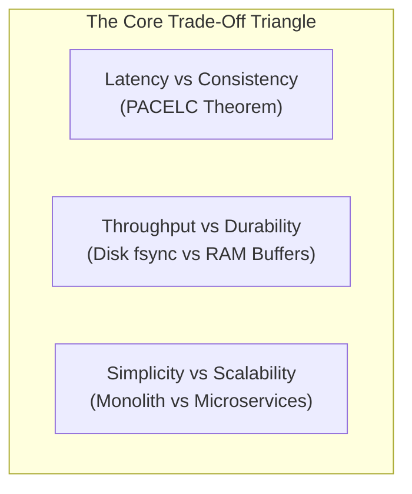
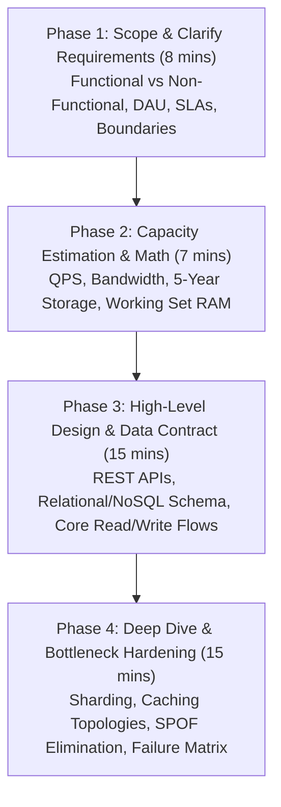
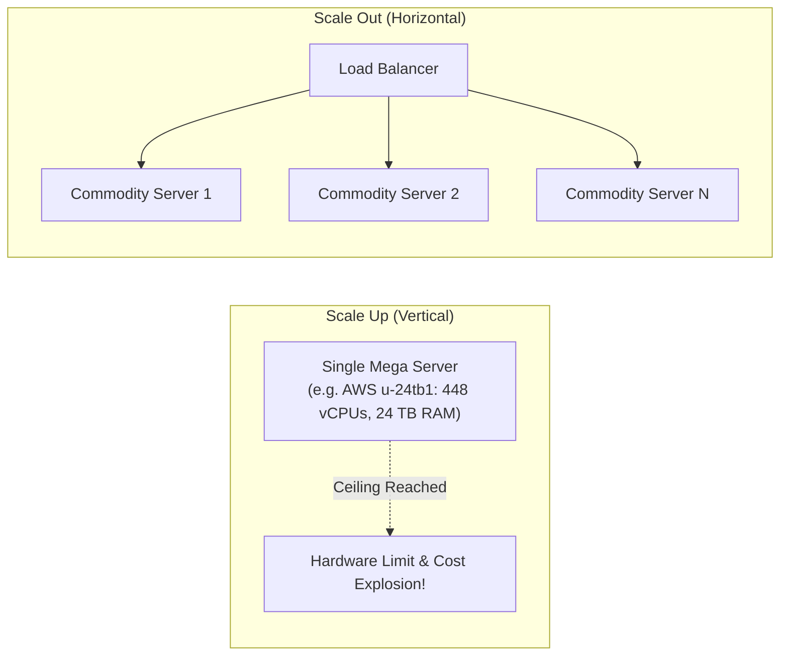
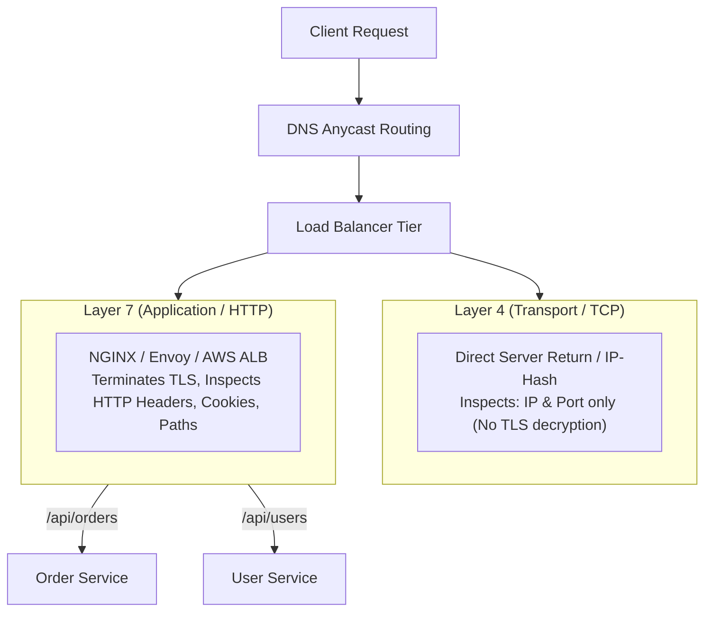
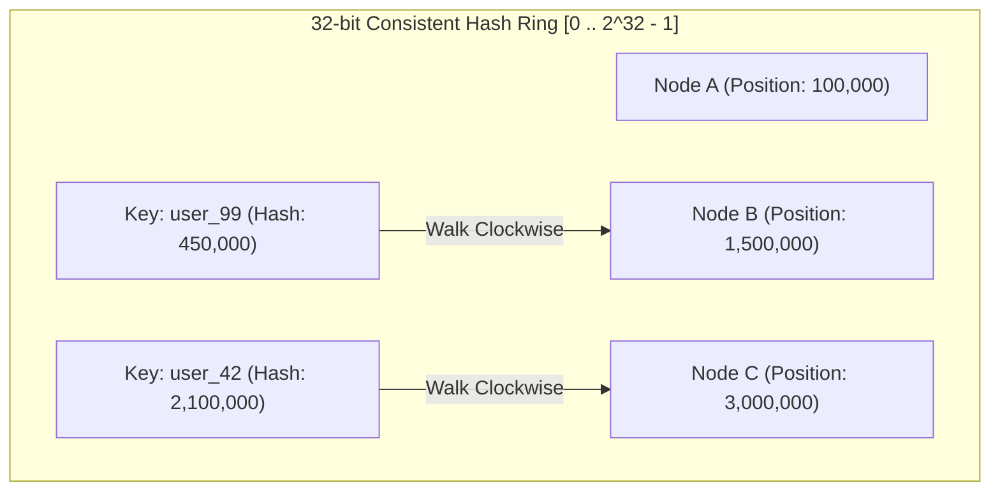
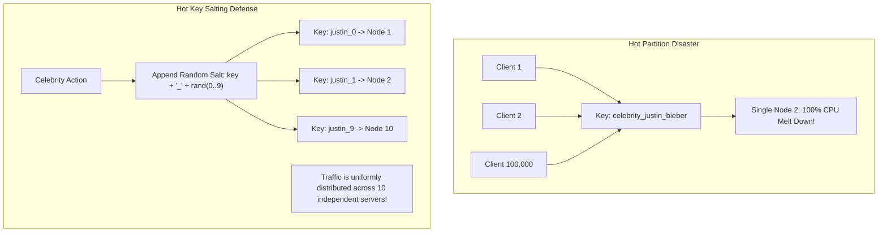

## 1. Mental Model: Managing Complexity Under Physical Limits

System design is not about drawing boxes and arrows with trendy buzzwords like Kafka, Redis, and Kubernetes.

System design is the engineering discipline of **managing complexity, trade-offs, and failure modes under physical hardware and network constraints**:
- A junior engineer chooses tools based on popularity.
- A senior backend architect selects architectures based on quantitative throughput, latency SLAs, storage growth, consistency models, and operational maintenance overhead.



---

## 2. The 4-Phase System Design Interview Playbook

In a 45-minute FAANG/tier-1 system design interview or an enterprise architecture review, time management dictates success. Follow this standard 4-phase blueprint:



### Phase 1: Requirements Clarification (8 Minutes)
Never jump into drawing boxes. Clarify functional requirements and quantify non-functional constraints:
- **Functional Requirements**: Exactly 2 to 3 core user flows (e.g., "1. User submits long URL and gets 7-character short URL. 2. User visiting short URL is redirected within 50ms").
- **Non-Functional Requirements**:
  - **Latency SLA**: p99 under 50ms.
  - **Availability Target**: 99.99% ("Four Nines" = under 52.6 minutes of downtime per year).
  - **Consistency Model**: Eventual consistency for analytics; Strong consistency for user account balances.
- **Explicit Out-of-Scope Boundaries**: Explicitly state what you will *not* design (e.g., "We will assume user authentication is handled by an upstream Identity Provider").

---

## 3. Vertical vs Horizontal Scaling & Amdahl's Law



| Dimension | Vertical Scaling (Scale Up) | Horizontal Scaling (Scale Out) |
| :--- | :--- | :--- |
| **Complexity** | Zero architectural changes; run existing monolith | High: Requires stateless servers, distributed caching, service discovery |
| **Hardware Limits** | Hard physical limit (e.g., 448 cores, 24TB RAM) | Theoretically infinite linear scaling |
| **Cost Curve** | Exponential (Supercomputers cost 10x more per gigabyte) | Linear (Cheap, interchangeable commodity nodes) |
| **Single Point of Failure (SPOF)** | Catastrophic: Hardware fault kills the entire system | Resilient: Survives node crashes via load balancing |

### The Limits of Parallel Scaling: Amdahl's Law
Why can't you just add 1,000 CPU cores to make a slow program 1,000x faster? **Amdahl's Law** states that the theoretical speedup of a system is strictly limited by its **serial (non-parallelizable) portion** ($B$):

$$\text{Speedup}(S) = \frac{1}{(1 - P) + \frac{P}{N}}$$

- $P$ : Proportion of the program that can be made parallel.
- $(1 - P) = B$ : Serial portion that must execute sequentially (e.g., database row locks, TCP handshakes).
- $N$ : Number of parallel processor cores or worker nodes.

> [!IMPORTANT]
> **Amdahl's Law Speedup Ceiling**:
> If 5% of your checkout request is strictly serial (e.g., acquiring an exclusive PostgreSQL row lock):
> Even with infinite parallel worker nodes ($N \to \infty$):
> $$\text{Max Theoretical Speedup} = \frac{1}{0.05 + 0} = 20\times \text{ speedup}$$
> Adding more compute instances beyond 20 nodes yields zero additional throughput because the serial lock becomes the bottleneck!

---

## 4. Load Balancing: Layer 4 vs Layer 7 Architectures

Load balancers distribute traffic across a pool of backend servers:



### Layer 4 (Transport Layer - e.g., AWS NLB, Linux IPVS, HAProxy L4)
- Operates at the TCP/UDP level without decrypting application data.
- Routing decision is made based solely on source/destination IP and port.
- **Throughput**: Extremely fast (millions of packets/sec with Direct Server Return).
- **Cons**: Cannot inspect cookies, HTTP headers, or request URI paths.

### Layer 7 (Application Layer - e.g., AWS ALB, NGINX, Envoy)
- Operates at the HTTP/HTTPS/WebSocket level.
- Terminates TLS/SSL, parses headers, evaluates JWT cookies, and performs path-based routing (`/api/v1/orders` to Order Pods, `/api/v1/search` to Search Pods).
- **Throughput**: Lower than L4 due to the computational cost of TLS cryptographic handshakes and HTTP parsing.

---

## 5. Consistent Hashing & Virtual Nodes

When sharding data across $N$ cache or database nodes, the naive approach hashes the key modulo $N$:

$$\text{Node Index} = \text{hash}(\text{key}) \pmod N$$

### The Modulo Hashing Disaster:
If you have 4 nodes ($N = 4$) and Node 3 crashes (leaving $N = 3$), the denominator changes from 4 to 3:
- Almost **100% of all keys rehash to different nodes**!
- Every single cached entry misses simultaneously, causing a catastrophic **Cache Avalanche** that knocks down your database.

### The Consistent Hashing Ring
Consistent Hashing maps both **nodes** and **keys** to a circular 360-degree integer ring ($0$ to $2^{32} - 1$):



1. Hash the servers to positions on the ring using a uniform hash function (e.g., Murmur3).
2. To locate the server for a key, hash the key and walk **clockwise** around the ring until you encounter the first server.
3. **The Guarantee**: When a server is added or removed, only $1/N$ of the keys are redistributed on average!

### The Hot Spot Problem & Virtual Nodes (Vnodes)
If you only place 3 physical servers on the ring, the segments between them will be unequal, creating massive data skew.

To solve this, each physical server is mapped to **100 to 256 Virtual Nodes (Vnodes)** scattered uniformly across the ring (e.g., `NodeA#1`, `NodeA#2`, ..., `NodeA#200`). This ensures an even, statistically balanced distribution of traffic across all physical hardware.

---

## 6. Production Java 21 Consistent Hash Ring Implementation

Below is a production-grade, thread-safe implementation of a Consistent Hash Ring with Virtual Nodes leveraging Java 21 `ConcurrentSkipListMap` (red-black tree) and Murmur3-128 hashing:

```java
package com.backend.mastery.systemdesign.fundamentals;

import com.google.common.hash.HashFunction;
import com.google.common.hash.Hashing;

import java.nio.charset.StandardCharsets;
import java.util.Collection;
import java.util.Map;
import java.util.concurrent.ConcurrentSkipListMap;

/**
 * Production Consistent Hash Ring with Virtual Nodes.
 * Thread-safe using ConcurrentSkipListMap for logarithmic O(log V) ceiling lookups.
 *
 * @param <T> Node type (e.g., String server address)
 */
public class ConsistentHashRing<T> {

    private final HashFunction hashFunction;
    private final int numberOfReplicas; // Number of Virtual Nodes per physical node
    private final ConcurrentSkipListMap<Long, T> ring = new ConcurrentSkipListMap<>();

    public ConsistentHashRing(int numberOfReplicas, Collection<T> nodes) {
        this.hashFunction = Hashing.murmur3_128();
        this.numberOfReplicas = numberOfReplicas;

        for (T node : nodes) {
            addNode(node);
        }
    }

    /**
     * Adds a physical node to the ring by mapping its virtual nodes.
     */
    public void addNode(T node) {
        for (int i = 0; i < numberOfReplicas; i++) {
            String vnodeName = node.toString() + "#VN#" + i;
            long hash = hash(vnodeName);
            ring.put(hash, node);
        }
    }

    /**
     * Removes a physical node and unregisters its virtual nodes.
     */
    public void removeNode(T node) {
        for (int i = 0; i < numberOfReplicas; i++) {
            String vnodeName = node.toString() + "#VN#" + i;
            long hash = hash(vnodeName);
            ring.remove(hash);
        }
    }

    /**
     * Locates the physical node responsible for a given key in O(log V) time.
     */
    public T getNode(String key) {
        if (ring.isEmpty()) {
            return null;
        }

        long hash = hash(key);

        // Find the first virtual node with a hash >= key hash (walk clockwise)
        Map.Entry<Long, T> entry = ring.ceilingEntry(hash);

        if (entry != null) {
            return entry.getValue();
        }

        // If key hash is greater than all nodes on ring, wrap around to first node
        return ring.firstEntry().getValue();
    }

    private long hash(String value) {
        return hashFunction.hashString(value, StandardCharsets.UTF_8).asLong();
    }
}
```

---

## 7. Celebrity & Hot Key Salting

In social networks or e-commerce platforms, a celebrity user (e.g., an influencer with 80 million followers) or a flash-sale item generates millions of reads and writes concentrated on a **single database partition or Redis key**.

Even with consistent hashing, that single node will hit 100% CPU while other nodes sit idle.



### The Salting Pattern:
1. **On Write**: When storing data for a known hot key, append a random integer salt from $0$ to $M - 1$:
   $$\text{Sharded Key} = \text{original\_key} + "\_" + \text{random}(0, M - 1)$$
2. **On Read**: To compute the global aggregate (e.g., total likes or view count), query all $M$ salted keys in parallel using an `ExecutorService` and sum the results:

```java
public long getCelebrityLikeCount(String celebrityId, int saltBuckets) {
    List<String> saltedKeys = IntStream.range(0, saltBuckets)
            .mapToObj(i -> "likes:" + celebrityId + "_" + i)
            .toList();

    List<String> counts = redisTemplate.opsForValue().multiGet(saltedKeys);
    if (counts == null) return 0L;

    return counts.stream()
            .filter(Objects::nonNull)
            .mapToLong(Long::parseLong)
            .sum();
}
```

---

## 8. Failure Modes & Edge Case Matrix

| Failure Mode | Architecture | Root Cause | Impact | Production Defense |
| :--- | :--- | :--- | :--- | :--- |
| **Cache Avalanche on Reshard** | Naive Modulo Hashing (`hash % N`) | Adding/removing a node invalidates 100% of keys | All requests hit DB simultaneously; DB crashes | Implement **Consistent Hashing** with virtual nodes. |
| **Hot Partition Meltdown** | Key-Value Store / Sharded DB | Celebrity user concentrates 50,000 QPS on one key | Single node CPU reaches 100%; cluster degrades | Apply **Hot Key Salting** across $M$ sub-keys. |
| **L7 Load Balancer Saturation** | Layer 7 Reverse Proxy | TLS decryption and header inspection exhaust CPU | Increased latency and packet drops | Place a high-throughput **Layer 4 Load Balancer** in front of L7 proxies. |
| **Amdahl's Law Bottleneck** | Distributed Compute Cluster | 2% of transaction requires global exclusive database lock | Adding 500 worker nodes yields zero throughput gain | Redesign data model to eliminate serial distributed locks. |

---

## 9. Senior Interview Questions & Active Recall

<AccordionGroup>
  <Accordion title="1. What is the mathematical difference between naive modulo hashing and consistent hashing?">
    In naive modulo hashing ($\text{hash}(key) \pmod N$), changing the node count from $N$ to $N+1$ causes nearly $100\%$ of all keys to rehash to different nodes, resulting in massive cache evictions and database overload. Consistent Hashing maps both keys and servers to a circular 360-degree integer ring ($0$ to $2^{32}-1$). When a node is added or removed, only $1/N$ of the keys are redistributed on average, minimizing cache misses and avoiding thundering herd disasters.
  </Accordion>

  <Accordion title="2. Why are Virtual Nodes (Vnodes) necessary in a Consistent Hash Ring?">
    Without virtual nodes, physical servers are randomly positioned on the ring, resulting in unevenly sized segments where one server might be assigned 70% of the ring while others receive 15%. Virtual nodes solve this by mapping each physical server to 100 to 256 virtual positions across the ring. By the Law of Large Numbers, this achieves a statistically uniform key distribution across all physical hardware.
  </Accordion>

  <Accordion title="3. Contrast Layer 4 and Layer 7 Load Balancing across latency, throughput, and functionality.">
    **Layer 4 (L4)** operates at the TCP/UDP transport level without decrypting application data. It routes packets based on IP and port, achieving massive throughput (millions of packets/sec) with sub-millisecond latency, but cannot inspect HTTP headers, cookies, or URI paths. **Layer 7 (L7)** terminates TLS, parses HTTP headers, and performs intelligent routing (e.g., path-based routing, JWT cookie stickiness), but has lower throughput and higher CPU utilization due to cryptographic decryption and protocol parsing.
  </Accordion>

  <Accordion title="4. How does Hot Key Salting resolve the Celebrity problem in distributed databases?">
    When a single key receives disproportionate write traffic (e.g., a viral post with 50,000 likes/sec), consistent hashing maps all writes for that key to a single partition, exhausting that server. Hot Key Salting appends a random suffix ($0$ to $M-1$) to the key, spreading writes across $M$ different physical partitions. Reads query all $M$ keys concurrently and aggregate the counts, distributing load evenly across the cluster.
  </Accordion>
</AccordionGroup>

---

## 10. Done Checklist

<Check>
- [ ] Master the 4-phase 45-minute system design interview playbook: Scope, Math, High-Level, Deep Dive.
- [ ] Calculate the theoretical scaling ceiling of a parallel architecture using Amdahl's Law.
- [ ] Contrast Layer 4 (TCP/UDP) with Layer 7 (HTTP) load balancing architectures.
- [ ] Explain why naive modulo hashing causes a Cache Avalanche and how Consistent Hashing limits reassignment to $1/N$.
- [ ] Implement a thread-safe Consistent Hash Ring with Virtual Nodes using Java 21 `ConcurrentSkipListMap`.
- [ ] Mitigate the Celebrity / Hot Partition problem using random Hot Key Salting and parallel fan-out read aggregation.
</Check>
