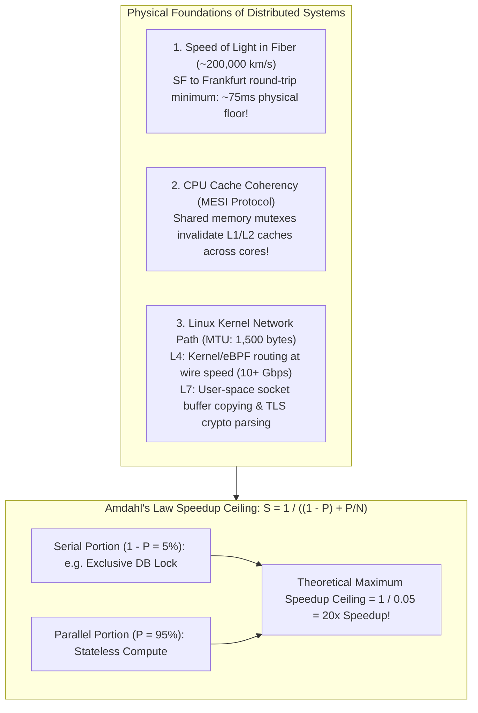
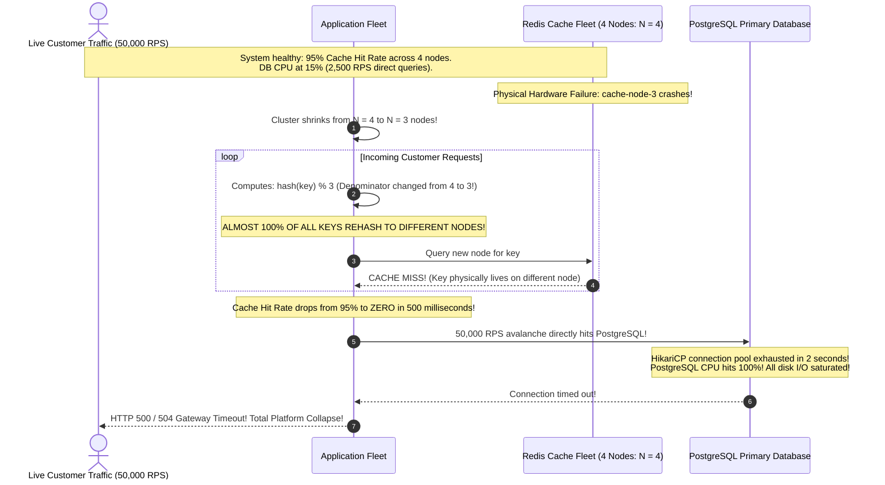
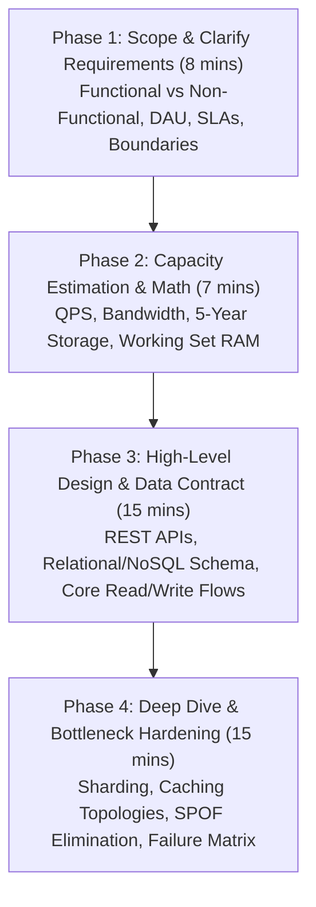
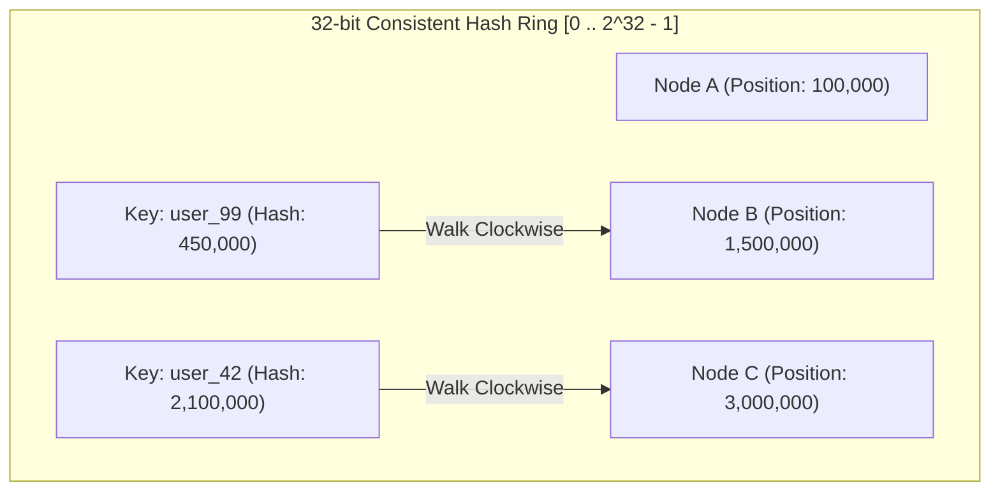
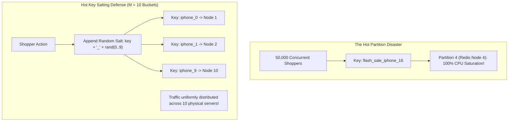

# System Design Fundamentals: Architecture Patterns & Trade-Offs

System design is not about drawing boxes and arrows with trendy buzzwords like Kafka, Redis, and Kubernetes.

System design is the engineering discipline of **managing complexity, trade-offs, and failure modes under physical hardware, storage, and network constraints**:
- A junior developer chooses tools based on popularity or resume-driven development.
- A senior/staff backend architect designs architectures based on quantitative throughput, p99 latency SLAs, storage durability, network packet physics, and failure blast radius reduction.

---

## 1. Phase 1: Ground Floor (Physical First Principles)

Every distributed system is fundamentally constrained by the laws of physics: the speed of light in fiber optics, CPU memory cache coherency, and Linux kernel network packet traversal.



### The Speed of Light & The Network Latency Floor
Data in fiber optic glass cables travels at roughly $200,000\text{ km/s}$ ($\approx 5\mu\text{s}$ per kilometer).
- The great-circle distance between San Francisco and Frankfurt is roughly $9,100\text{ km}$.
- A single light packet round-trip requires at least:
  $$\text{RTT}_{\text{min}} = \frac{2 \times 9,100\text{ km}}{200,000\text{ km/s}} = 91\text{ ms}$$
- No database optimization, cloud provider, or algorithm can ever reduce cross-continental latency below this physical barrier. This reality mandates edge caching (CDNs), read replicas close to users, and asynchronous eventual consistency over synchronous cross-region RPC.

### Amdahl's Law: The Mathematical Ceiling of Horizontal Scaling
Why can't you simply add 1,000 CPU cores or 1,000 microservice pods to make a slow request 1,000x faster? **Amdahl's Law** dictates the maximum theoretical speedup of an architecture based on its **serial (non-parallelizable) portion** ($1 - P$):

$$\text{Speedup}(S) = \frac{1}{(1 - P) + \frac{P}{N}}$$

- $P$ : Proportion of the program that can execute concurrently in parallel.
- $(1 - P)$ : Strictly sequential portion (e.g., acquiring an exclusive database row lock, SSL handshake, or sequential disk write).
- $N$ : Number of parallel processor cores or worker nodes.

> [!IMPORTANT]
> **The Amdahl Ceiling**:
> If just **5% of your checkout operation is strictly serial** (e.g., updating an inventory row with `FOR UPDATE`):
> Even with infinite parallel compute nodes ($N \to \infty$):
> $$\text{Max Speedup} = \frac{1}{0.05 + 0} = 20\times \text{ speedup}$$
> Adding 500 more Kubernetes pods beyond 20 nodes yields **zero additional throughput** because all threads queue behind the single serial lock!

### Layer 4 vs Layer 7 Network Physics
Understanding how load balancers process packets at the physical and kernel layers explains their drastic throughput differences:
- **Layer 4 (Transport / TCP/UDP - e.g., AWS NLB, Linux IPVS, eBPF)**: Operates directly inside the Linux kernel network stack. It inspects only the IP header and TCP port without decrypting payload data. Using **Direct Server Return (DSR)**, the load balancer rewrites packet MAC addresses and sends them to backend nodes. Backends reply directly to clients, bypassing the load balancer on response. Throughput reaches millions of packets per second with microsecond latency.
- **Layer 7 (Application / HTTP - e.g., AWS ALB, Nginx, Envoy)**: Operates in user space. The load balancer must terminate the client's TCP connection, perform the expensive cryptographic TLS handshake, decrypt the payload, parse HTTP/1.1 or HTTP/2 frames, inspect URI paths and cookies, and establish a *second* internal TCP connection to the backend. It offers rich routing logic at the cost of higher CPU utilization and latency.

---

## 2. Phase 2: The Naive Code (The Production Crash)

Let us examine the catastrophic failure caused by naive modulo hashing when distributing cached sessions or database records across a cluster.

### The Naive Modulo Sharding Code

```java
// NAIVE SHARDING IMPLEMENTATION - PRODUCTION CATASTROPHE HAZARD
@Service
public class DistributedCacheRouter {

    private final List<String> cacheNodes = List.of(
            "cache-node-0.internal:6379",
            "cache-node-1.internal:6379",
            "cache-node-2.internal:6379",
            "cache-node-3.internal:6379"
    );

    public String routeKeyToNode(String cacheKey) {
        // CATASTROPHIC HAZARD: Naive Modulo Hashing
        int hash = Math.abs(cacheKey.hashCode());
        int nodeIndex = hash % cacheNodes.size(); // key % N
        return cacheNodes.get(nodeIndex);
    }
}
```

### The Production Catastrophe Sequence: The Cache Avalanche



#### Why Production Collapsed:
1. **The Modulo Invalidation Shockwave**: In naive modulo hashing ($\text{hash} \pmod N$), changing $N$ from 4 to 3 changes the remainder for almost every number. Statistically:
   $$\text{Keys Reassigned} = 1 - \frac{1}{\text{LCM}(N, N-1)} \approx 75\% - 90\%+$$
2. **The Cache Avalanche**: In under one second, millions of cached entries become unreachable at their old positions.
3. **Primary Database Decapitation**: 50,000 requests per second that were previously absorbed by memory hit the relational database simultaneously, blowing past HikariCP connection pool limits and crashing the database engine.

---

## 3. Phase 3: Under the Hood (Mechanics, Algorithms & Solutions)

To eliminate single points of failure, avoid cache avalanches, and scale to millions of requests per second, senior architects implement:
1. **The 4-Phase System Design Interview Blueprint**.
2. **Consistent Hashing with Virtual Nodes (Vnodes)**.
3. **Production Java 21 Consistent Hash Ring Implementation**.
4. **Celebrity & Hot Key Salting**.

---

### The 4-Phase System Design Interview Blueprint

In a 45-minute FAANG/tier-1 system design interview or an enterprise architecture review, time management dictates success. Follow this standard 4-phase blueprint:



#### Phase 1: Requirements Clarification (8 Minutes)
- **Functional Requirements**: Exactly 2 to 3 core user flows (e.g., "1. User submits long URL and receives 7-character short URL. 2. User visiting short URL is redirected within 50ms").
- **Non-Functional Requirements**:
  - **Latency SLA**: p99 under 50ms.
  - **Availability Target**: 99.99% ("Four Nines" = under 52.6 minutes of downtime per year).
  - **Consistency Model**: Eventual consistency for reads; Strong consistency for payments.
- **Explicit Out-of-Scope Boundaries**: Explicitly state what you will *not* design (e.g., "We will assume user authentication is handled by an upstream Identity Provider").

---

### Consistent Hashing & Virtual Nodes (Vnodes)

Consistent Hashing maps both **nodes** and **keys** to a circular 360-degree integer ring ($0$ to $2^{32} - 1$):



#### The Consistent Hashing Algorithm:
1. Hash the servers to positions on the ring using a uniform hash function (e.g., Murmur3-128).
2. To locate the server for a key, hash the key and walk **clockwise** around the ring until you encounter the first server whose hash is greater than or equal to the key hash.
3. **The Mathematical Guarantee**: When a server is added or removed, **only $1/N$ of the keys are redistributed on average**! The remaining $(N-1)/N$ keys remain mapped to their original servers, completely eliminating the Cache Avalanche.

#### The Hot Spot Problem & Virtual Nodes (Vnodes):
If you place only 3 physical servers on the ring, the hash values may land close together, creating massive data skew where one server handles 75% of the data.

To guarantee uniform data distribution, each physical server is mapped to **100 to 256 Virtual Nodes (Vnodes)** scattered across the ring (e.g., `NodeA#0`, `NodeA#1`, ..., `NodeA#199`). By the Law of Large Numbers, the ring segments become statistically uniform, ensuring balanced load across physical hardware.

---

### Production Java 21 Consistent Hash Ring Implementation

Below is a production-grade, thread-safe implementation of a Consistent Hash Ring with Virtual Nodes using Java 21 `ConcurrentSkipListMap` (red-black tree) and Murmur3-128 hashing:

```java
package com.backend.mastery.systemdesign.fundamentals;

import com.google.common.hash.HashFunction;
import com.google.common.hash.Hashing;

import java.nio.charset.StandardCharsets;
import java.util.Collection;
import java.util.Map;
import java.util.concurrent.ConcurrentSkipListMap;

/**
 * Production Consistent Hash Ring with Virtual Nodes.
 * Thread-safe using ConcurrentSkipListMap for logarithmic O(log V) ceiling lookups.
 *
 * @param <T> Node identifier type (e.g., String server address)
 */
public class ConsistentHashRing<T> {

    private final HashFunction hashFunction;
    private final int numberOfReplicas; // Number of Virtual Nodes per physical node
    private final ConcurrentSkipListMap<Long, T> ring = new ConcurrentSkipListMap<>();

    public ConsistentHashRing(int numberOfReplicas, Collection<T> nodes) {
        this.hashFunction = Hashing.murmur3_128();
        this.numberOfReplicas = numberOfReplicas;

        for (T node : nodes) {
            addNode(node);
        }
    }

    /**
     * Adds a physical node to the ring by registering its virtual node replicas.
     */
    public void addNode(T node) {
        for (int i = 0; i < numberOfReplicas; i++) {
            String vnodeName = node.toString() + "#VN#" + i;
            long hash = hash(vnodeName);
            ring.put(hash, node);
        }
    }

    /**
     * Removes a physical node and unregisters its virtual nodes.
     */
    public void removeNode(T node) {
        for (int i = 0; i < numberOfReplicas; i++) {
            String vnodeName = node.toString() + "#VN#" + i;
            long hash = hash(vnodeName);
            ring.remove(hash);
        }
    }

    /**
     * Locates the physical node responsible for a given key in O(log V) time.
     */
    public T getNode(String key) {
        if (ring.isEmpty()) {
            return null;
        }

        long hash = hash(key);

        // Find the first virtual node with a hash >= key hash (walk clockwise)
        Map.Entry<Long, T> entry = ring.ceilingEntry(hash);

        if (entry != null) {
            return entry.getValue();
        }

        // Wrap around to the first node on the ring
        return ring.firstEntry().getValue();
    }

    private long hash(String value) {
        return hashFunction.hashString(value, StandardCharsets.UTF_8).asLong();
    }
}
```

---

### Celebrity & Hot Key Salting

In distributed databases and caching tiers, a celebrity user (e.g., an account with 80 million followers) or a flash-sale item concentrates millions of operations on a **single partition or Redis key**.

Even with consistent hashing, that single partition will hit 100% CPU while other nodes sit idle.



#### The Salting Pattern:
1. **On Write**: Append a random integer salt from $0$ to $M - 1$ to the key:
   $$\text{Salted Key} = \text{original\_key} + "\_" + \text{random}(0, M - 1)$$
2. **On Read (Scatter-Gather Aggregation)**: To compute the global aggregate (e.g., total likes or view count), query all $M$ salted keys in parallel using Java 21 Virtual Threads and sum the results:

```java
public long getCelebrityLikeCount(String celebrityId, int saltBuckets) {
    List<String> saltedKeys = IntStream.range(0, saltBuckets)
            .mapToObj(i -> "likes:" + celebrityId + "_" + i)
            .toList();

    // Query Redis using pipelining or multiGet across all salted keys
    List<String> counts = redisTemplate.opsForValue().multiGet(saltedKeys);
    if (counts == null) return 0L;

    return counts.stream()
            .filter(Objects::nonNull)
            .mapToLong(Long::parseLong)
            .sum();
}
```

---

## 4. Phase 4: Senior Interview Ace (Junior vs Staff Phrasing)

When interviewing for Senior or Staff System Architect roles, interviewers evaluate whether you grasp physical hardware constraints and can defend your architectural choices with quantitative math.

### Junior Answer vs. Staff Engineer Answer

| Scenario | Junior Engineer Answer | Staff / Principal Engineer Answer |
| :--- | :--- | :--- |
| **"How do you distribute keys across a cache cluster?"** | *"I take the hash code of the key and use modulo `N` to pick the server index."* | *"Naive modulo hashing ($\text{hash} \pmod N$) is a severe production anti-pattern. If a single node crashes or scales out, the denominator changes, causing nearly $100\%$ of all keys to rehash to different nodes. This triggers a total Cache Avalanche and knocks down the database. We implement Consistent Hashing with 128 to 256 Virtual Nodes per physical server on a $2^{32}-1$ integer ring. Adding or removing a node reassigns only $1/N$ of keys, preserving cache hit rates."* |
| **"When would you choose Layer 4 vs Layer 7 load balancing?"** | *"I always use an ALB or Nginx because it can read HTTP headers."* | *"L7 proxies terminate TLS, parse HTTP frames, and inspect headers, but incur significant CPU and latency overhead. L4 balancers (like AWS NLB or Linux IPVS with Direct Server Return) operate entirely in kernel space without decrypting payloads, routing millions of packets per second at wire speed. In enterprise architectures, we place an L4 load balancer at the perimeter for raw TCP throughput and DDoS mitigation, which fans out to an internal fleet of auto-scaling L7 proxies for path-based routing and JWT validation."* |
| **"Why can't you scale a slow system indefinitely by adding more CPU cores?"** | *"You can, modern cloud providers let you scale horizontally to hundreds of servers."* | *"It is bounded mathematically by Amdahl's Law: $\text{Speedup} = 1 / ((1 - P) + P/N)$. If even 5% of a transaction is strictly serial—such as acquiring an exclusive database row lock or writing to a shared log—the maximum theoretical speedup is capped at $1 / 0.05 = 20\times$, regardless of whether you have 100 or 10,000 worker nodes. To scale further, you must redesign the data model to eliminate the serial lock."* |
| **"How do you handle a viral celebrity account causing a hot partition?"** | *"I increase the Redis instance size or add a bigger database."* | *"Scaling vertically hits immediate hardware limits. We use Hot Key Salting. For high-write celebrity keys, we append a random integer suffix (`celebrity_id_` + `random(0..9)`), scattering writes across 10 independent partitions. For global read aggregation, we perform a parallel scatter-gather query across all 10 salted sub-keys using Virtual Threads and sum the result."* |

---

## 5. Active Recall & Self-Assessment

<AccordionGroup>
  <Accordion title="1. How does Amdahl's Law govern the limits of parallel backend scaling?">
    Amdahl's Law proves that the speedup of a system is limited by its non-parallelizable (serial) portion:
    $$\text{Speedup} = \frac{1}{(1 - P) + \frac{P}{N}}$$
    If a system's database locks, file I/O, or connection coordination constitute $5\%$ of total request processing time, the maximum theoretical speedup is $1 / 0.05 = 20\times$. Adding more servers beyond that point causes thread contention and yields zero throughput gains.
  </Accordion>

  <Accordion title="2. Why does naive modulo hashing cause a Cache Avalanche upon node failure?">
    In naive modulo hashing, a key is mapped via $\text{hash}(\text{key}) \pmod N$. If one server out of $N$ fails, the modulus becomes $N - 1$. Because remainder arithmetic changes completely when the divisor changes, almost every key in the keyspace hashes to a different index. The cache hit rate immediately drops to near zero, flooding the primary database with an avalanche of simultaneous read requests.
  </Accordion>

  <Accordion title="3. How do Virtual Nodes (Vnodes) prevent data skew in Consistent Hashing?">
    If physical servers are placed directly on a hash ring, random hashing may cluster nodes close to one another, leaving massive gaps where one node handles 70% of the ring while others handle 15%. Virtual nodes assign each physical server 100 to 256 virtual tokens scattered uniformly around the ring. By the Law of Large Numbers, this evens out the partition sizes and ensures uniform load distribution across all physical hardware.
  </Accordion>

  <Accordion title="4. How does Direct Server Return (DSR) work in Layer 4 load balancers?">
    In standard reverse proxying, both incoming requests and outgoing responses pass through the load balancer. In Direct Server Return (DSR), the Layer 4 load balancer rewrites only the destination MAC address of incoming TCP packets and forwards them to backend servers without touching the IP payload. When backend servers respond, they send packets directly back to the client over the Internet gateway, bypassing the load balancer. Because response traffic is typically $10\times$ larger than request traffic, DSR allows a single L4 balancer to handle massive network throughput.
  </Accordion>
</AccordionGroup>

---

## 6. Done Checklist

<Check>
- [ ] Understand the speed-of-light physical latency floor and its impact on multi-region architecture.
- [ ] Calculate the theoretical scaling ceiling of a parallel architecture using Amdahl's Law.
- [ ] Contrast Layer 4 (eBPF / IPVS) wire-speed routing with Layer 7 (Envoy / ALB) application-layer inspection.
- [ ] Articulate why naive modulo hashing causes a Cache Avalanche and how Consistent Hashing limits reassignment to $1/N$.
- [ ] Implement a thread-safe Consistent Hash Ring with Virtual Nodes in Java 21 using `ConcurrentSkipListMap`.
- [ ] Mitigate the Celebrity / Hot Partition problem using random Hot Key Salting and scatter-gather parallel aggregation.
</Check>
