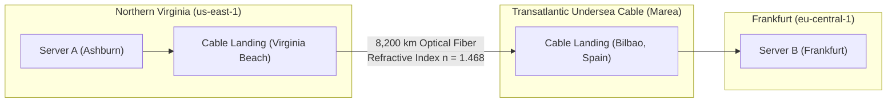
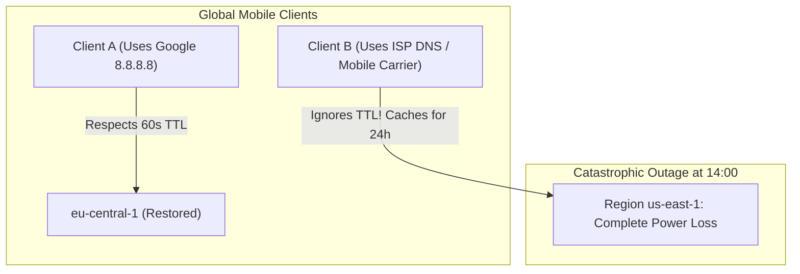
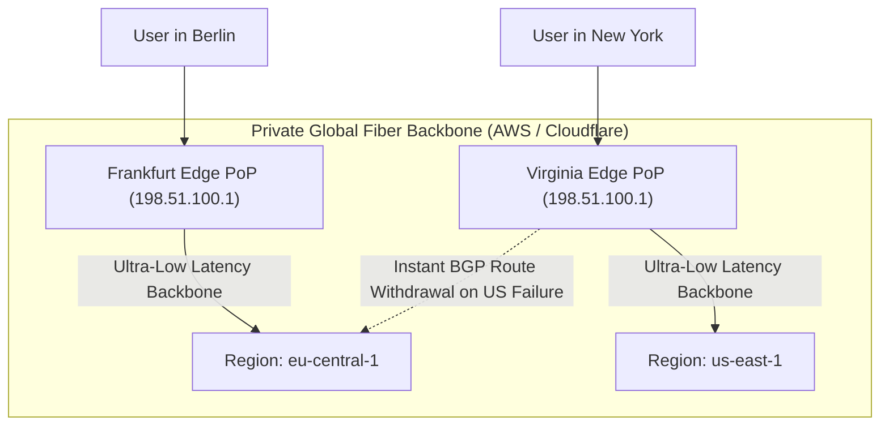
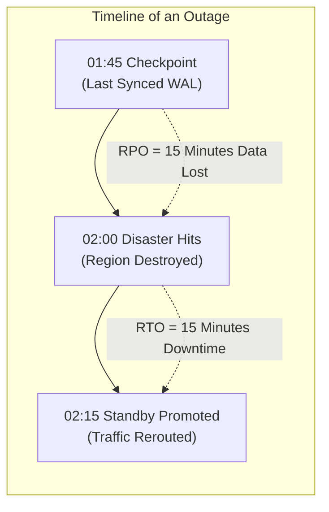
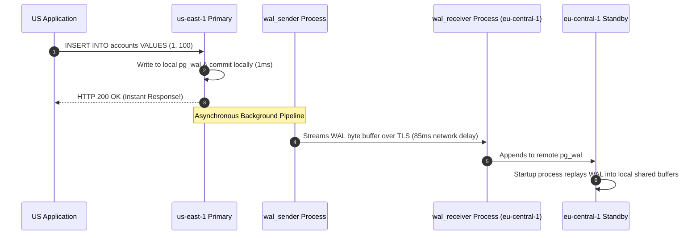
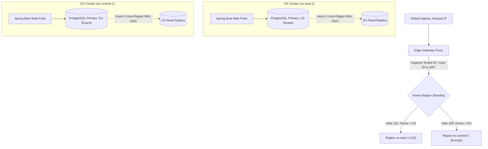

# Multi-Region Active-Active Architectures & CRDTs

In modern enterprise systems, high availability within a single metropolitan datacenter is no longer enough. Cloud providers routinely suffer regional outages: power grid failures, fiber-optic backbone cuts, catastrophic weather, or control-plane configuration corruption (such as global IAM/STS outages).

When an entire AWS or Google Cloud region goes dark, single-region applications suffer 100% downtime.

However, moving to a **Multi-Region Active-Active Architecture** is one of the most complex engineering challenges in computer science:
- **The Speed-of-Light Barrier**: Physics dictates that network packets take 70ms - 100ms to cross oceans. Synchronous database locking across regions destroys throughput and deadlocks connection pools.
- **The Split-Brain Disaster**: If two regions lose network connectivity (a cross-region network partition) and both continue accepting writes to the same database records, data diverges and silent data loss occurs.
- **The DNS TTL Blackhole**: Teams relying on DNS failover discover that 30% to 40% of global clients cache IP addresses for days, blackholing customer traffic into dead datacenters.
- **Last-Write-Wins (LWW) Data Corruption**: Wall-clock NTP clock drift causes older updates to silently overwrite newer updates in distributed multi-master databases.

This masterclass deconstructs multi-region system design from the physical properties of light in glass up to Staff-level conflict resolution algorithms and runnable CRDT implementations.

---

## Phase 1: Ground Floor (Physical First Principles)

To design global systems, you cannot treat the network as an abstract cloud diagram. You must understand the physical constraints of planet Earth and fiber-optic telecommunications.

### 1.1 The Physical Speed-of-Light Constraint in Silica Glass
In a vacuum, light travels at approximately $c = 300,000\text{ km/s}$. However, internet traffic travels through physical **single-mode fiber-optic glass cables** laid across continental landmasses and across the ocean floor (such as the *Marea* and *Dunant* transatlantic cables).

Silica glass has an optical refractive index of approximately $n \approx 1.468$. When light enters glass, it slows down:

$$v_{\text{fiber}} = \frac{c}{n} = \frac{299,792\text{ km/s}}{1.468} \approx \mathbf{204,218\text{ km/s}}$$

Light in fiber travels at roughly **$204\text{ km}$ per millisecond**.

Now, consider the physical path between a server in Northern Virginia (`us-east-1`) and a server in Frankfurt, Germany (`eu-central-1`):
1. The great-circle distance is roughly $6,600\text{ km}$.
2. However, physical fiber-optic cables do not travel in a straight line. They route through roadbeds, subway lines, coastal landing stations, undersea trenches, and optical amplifiers, covering a real-world path of approximately **$8,200\text{ km}$**.



### The Inescapable Latency Math:
$$\text{One-Way Optical Transit Time} = \frac{8,200\text{ km}}{204,218\text{ km/s}} \approx \mathbf{40.15\text{ ms}}$$
$$\text{Theoretical Minimum Round-Trip Time (RTT)} \approx \mathbf{80.3\text{ ms}}$$

When you account for router queueing delays, optical-to-electrical conversions at repeaters, and datacenter leaf-spine switches, the observable real-world RTT between Virginia and Frankfurt is **$85\text{ ms} - 110\text{ ms}$**.

### 1.2 The Anatomy of a Cross-Region Network Handshake
Consider what happens when a client in Europe establishes a raw TCP connection with a database or API in the United States without edge acceleration:

```console
1. Client -> Server: TCP SYN               (+45 ms)
2. Server -> Client: TCP SYN-ACK           (+45 ms -> 90 ms total)
3. Client -> Server: TCP ACK + TLS ClientHello (+45 ms -> 135 ms total)
4. Server -> Client: TLS ServerHello       (+45 ms -> 180 ms total)
5. Client -> Server: HTTP GET /orders      (+45 ms -> 225 ms total)
6. Server -> Client: HTTP 200 OK           (+45 ms -> 270 ms total)
```

The user waits **$270\text{ ms}$** before a single byte of application response is rendered, simply paying the physical tax of light traveling across the planet.

---

## Phase 2: The Naive Architecture (The Production Crash)

Let's inspect how beginner engineering teams attempt multi-region deployment and the severe disasters that take their businesses offline.

### Disaster 1: Synchronous Multi-Region Database Replication (The 2PC Deadlock Storm)

#### The Naive Setup:
A team wants "Zero Data Loss" (RPO = 0) and high availability across two regions. They deploy PostgreSQL in `us-east-1` and configure a synchronous replication standby in `eu-central-1`. 

Every `INSERT` and `UPDATE` in the US primary must wait for confirmation from the European standby before committing to disk:

```mermaid
sequenceDiagram
    autonumber
    actor User as US Web Client
    participant App as Spring Boot Pod (us-east-1)
    participant DB1 as Primary DB (us-east-1)
    participant DB2 as Standby DB (eu-central-1)

    User->>App: POST /api/v1/orders (Place Order)
    App->>DB1: BEGIN; UPDATE inventory SET stock = stock - 1;
    Note over DB1: Acquires EXCLUSIVE ROW LOCK on inventory row
    DB1->>DB2: Replicate WAL record across Atlantic Ocean (85ms RTT)
    Note over DB1,App: DB1 worker thread BLOCKS waiting for EU ACK!
    Note over App: HikariCP connection held for 95ms instead of 2ms!
    DB2-->>DB1: Flush WAL to disk & Send ACK (+85ms)
    DB1-->>App: COMMIT complete (Total DB time: 92ms)
    App-->>User: HTTP 201 Created
```

#### The Production Crash:
1. Under normal single-region operations, a database transaction takes **2 milliseconds**. A HikariCP pool of 30 connections can easily handle:
   $$\text{Max Throughput} = \frac{30\text{ connections}}{0.002\text{ s}} = \mathbf{15,000\text{ operations/second}}$$
2. Under synchronous cross-region replication, the physical network RTT forces every transaction to hold database locks for **90 milliseconds**.
3. Now, recalculate the maximum capacity of the exact same 30-connection pool:
   $$\text{Max Throughput} = \frac{30\text{ connections}}{0.090\text{ s}} \approx \mathbf{333\text{ operations/second}}$$
4. **The Crash Sequence**:
   - Write throughput plummets by **97.8%**.
   - A moderate traffic wave of 500 requests/second hits the US application.
   - Within **60 milliseconds**, all 30 HikariCP connections are locked waiting for trans-Atlantic network ACKs.
   - Spring Boot threads block in `HikariPool.getConnection()` until connection timeout (30 seconds).
   - All 200 Tomcat worker threads freeze.
   - The US application crashes with `ConnectionTimeoutException` and HTTP 500 errors.
   - **The Irony**: In attempting to make the system resilient to regional disaster, the team crippled the database so severely that normal day-to-day traffic destroyed it.

---

### Disaster 2: The DNS TTL Blackhole during Regional Evacuation

#### The Naive Setup:
A team uses DNS-based routing (e.g. AWS Route 53 Latency Routing) with a short 60-second Time-To-Live (TTL). When `us-east-1` goes down, the team plans to update DNS to point `api.company.com` to `eu-central-1`.



#### The Production Disaster:
1. At 14:00, Northern Virginia suffers a regional power failure.
2. The SRE team triggers DNS failover at 14:02. The authoritative Route 53 nameserver updates `api.company.com` to Europe's IP.
3. **The Trap**: Over 30% of global internet access goes through corporate proxy resolvers, residential ISP recursive resolvers (Comcast, Charter, Vodafone), and mobile OS runtimes (iOS/Android network daemons) that **deliberately violate DNS TTL standards** to minimize bandwidth. They clamp minimum TTLs to 300, 3600, or even 86,400 seconds (24 hours)!
4. For the next 6 to 12 hours, **35% of all paying customers** continue sending TCP SYN packets into the dead US datacenter IP addresses.
5. Users see `ERR_CONNECTION_TIMED_OUT`. Customer support is overwhelmed while the secondary European region sits idle with excess capacity.

---

## Phase 3: Under the Hood (Mechanics, Protocols & Code)

Let's examine how tier-1 engineering companies solve these physical limitations using Anycast BGP routing, database streaming replication, and mathematical CRDTs.

### 3.1 Global Ingress & Traffic Steering: Anycast BGP vs DNS

To eliminate the DNS TTL caching trap, production multi-region systems route traffic using **Anycast BGP** (Border Gateway Protocol):



#### How Anycast BGP Works:
1. **A Single Global IP Address**: A single public IP (e.g. `198.51.100.1`) is advertised simultaneously from over 300 global edge Points of Presence (PoPs) using BGP.
2. **Internet Routing**: When a client in Paris initiates a connection, internet Autonomous System (AS) routers naturally steer packets along the fewest AS hops to the physically nearest edge PoP (Frankfurt).
3. **TCP & TLS Edge Termination**: The edge proxy terminates the TCP and TLS handshakes locally in **$2\text{ ms}$**, then multiplexes application requests over a pre-warmed, encrypted private fiber-optic backbone back to the application region.
4. **Sub-Second Regional Evacuation**: If `us-east-1` experiences a catastrophic failure, automated health monitors withdraw the BGP route advertisement for the US edge PoP. Internet routers converge in **3 to 10 seconds**, automatically steering traffic to the surviving European PoP. **Zero client-side DNS caching is involved.**

---

### 3.2 Disaster Recovery Metrics: The RTO vs RPO Trade-off

Every multi-region strategy represents an explicit engineering negotiation between two variables:



- **RTO (Recovery Time Objective)**: The maximum acceptable duration of system downtime. "How long does it take us to come back online?"
- **RPO (Recovery Point Objective)**: The maximum acceptable amount of data loss measured in time. "How many seconds or minutes of committed data can we afford to lose?"

| Strategy | Architecture Pattern | Typical RTO | Typical RPO | Infrastructure Cost |
| :--- | :--- | :--- | :--- | :--- |
| **Backup & Restore** | Daily S3 snapshots shipped across regions | 12 - 24 hours | 24 hours | Lowest ($) |
| **Pilot Light** | DB replicating asynchronously; compute pods scaled to 0 | 15 - 30 minutes | Sub-minute | Low ($$) |
| **Warm Standby (Active-Passive)** | Scaled-down pods running; read-replica ready for instant promotion | 1 - 2 minutes | Sub-second | Moderate ($$$) |
| **Active-Active (Home-Region)** | Both regions serve live traffic; localized writes + async cross-sync | **$\le 5$ seconds** | **$\le 1$ second** | High ($$$$$) |

---

### 3.3 PostgreSQL Multi-Region Replication Mechanics

How do relational databases physically replicate data across continents without synchronous deadlocks?

PostgreSQL uses **Asynchronous Physical Streaming Replication** via Write-Ahead Log (WAL) shipping:



#### Monitoring Cross-Region Replication Lag:
In asynchronous replication, if the primary datacenter explodes, any WAL bytes that have not yet reached the standby are permanently lost. This delta is your **actual RPO**.

You monitor this in PostgreSQL using `pg_stat_replication`:

```sql
SELECT 
    client_addr AS standby_ip,
    state,
    sync_state,
    -- Difference between bytes written locally vs received by remote standby:
    pg_wal_lsn_diff(pg_current_wal_lsn(), sent_lsn) AS send_lag_bytes,
    -- Difference between bytes written locally vs fully flushed to disk in remote standby:
    pg_wal_lsn_diff(pg_current_wal_lsn(), replay_lsn) AS replay_lag_bytes,
    ROUND(pg_wal_lsn_diff(pg_current_wal_lsn(), replay_lsn) / 1024 / 1024, 2) AS lag_megabytes
FROM pg_stat_replication;
```

---

### 3.4 Conflict-Free Replicated Data Types (CRDTs)

When two active regions accept writes concurrently, they cannot use traditional relational locking. If US writes `balance = 100` and Europe writes `balance = 150` to the same customer row, an asynchronous replication conflict occurs.

Relying on **Last-Write-Wins (LWW)** using system clocks is fatal: NTP clock drift causes older writes to overwrite newer writes, or causes shopping cart items to vanish.

Distributed systems achieve mathematical convergence using **Conflict-free Replicated Data Types (CRDTs)**.

#### The Mathematical Foundation: A Join-Semilattice
A state-based CRDT is a join-semilattice $(S, \sqcup)$ equipped with a partial order $\le$ and a merge operator $\sqcup$ satisfying three mathematical laws:
1. **Commutativity**: $A \sqcup B = B \sqcup A$ (The order in which cross-region replication packets arrive does not change the result).
2. **Associativity**: $(A \sqcup B) \sqcup C = A \sqcup (B \sqcup C)$ (Grouping of network packets does not change the result).
3. **Idempotence**: $A \sqcup A = A$ (Duplicate network packets or retransmissions have zero effect).

---

#### Production Implementation 1: The PN-Counter (Positive-Negative Counter)

A **PN-Counter** allows distributed increments (e.g. video views, inventory reservations, social likes) across multiple active regions without centralized coordination.

It tracks two internal integer vectors: $P$ for increments and $N$ for decrements, indexed by region node ID.

$$\text{Global Value} = \sum_{i} P[i] - \sum_{i} N[i]$$
$$\text{Merge}(A, B) = \left( [\max(A.P[i], B.P[i])], [\max(A.N[i], B.N[i])] \right)$$

```java
package com.backend.mastery.crdt;

import java.io.Serializable;
import java.util.Collections;
import java.util.HashMap;
import java.util.Map;

/**
 * Production State-Based PN-Counter CRDT.
 * Guarantees convergence across multi-region active-active clusters.
 */
public final class PNCounter implements Serializable {

    private final String nodeId;
    private final Map<String, Long> pVector;
    private final Map<String, Long> nVector;

    public PNCounter(String nodeId) {
        this.nodeId = nodeId;
        this.pVector = new HashMap<>();
        this.nVector = new HashMap<>();
    }

    private PNCounter(String nodeId, Map<String, Long> p, Map<String, Long> n) {
        this.nodeId = nodeId;
        this.pVector = new HashMap<>(p);
        this.nVector = new HashMap<>(n);
    }

    /**
     * Local Increment: Only mutates this node's slot in the P-Vector.
     */
    public synchronized void increment(long amount) {
        if (amount < 0) throw new IllegalArgumentException("Amount must be positive");
        pVector.put(nodeId, pVector.getOrDefault(nodeId, 0L) + amount);
    }

    /**
     * Local Decrement: Only mutates this node's slot in the N-Vector.
     */
    public synchronized void decrement(long amount) {
        if (amount < 0) throw new IllegalArgumentException("Amount must be positive");
        nVector.put(nodeId, nVector.getOrDefault(nodeId, 0L) + amount);
    }

    /**
     * Read Operation: Computes net sum across all known cluster nodes.
     */
    public synchronized long value() {
        long totalPositive = pVector.values().stream().mapToLong(Long::longValue).sum();
        long totalNegative = nVector.values().stream().mapToLong(Long::longValue).sum();
        return totalPositive - totalNegative;
    }

    /**
     * Merge Operator (Join-Semilattice):
     * Commutative, Associative, and Idempotent.
     */
    public synchronized PNCounter merge(PNCounter remote) {
        Map<String, Long> mergedP = new HashMap<>(this.pVector);
        Map<String, Long> mergedN = new HashMap<>(this.nVector);

        // Take the point-wise maximum for each known node slot:
        remote.pVector.forEach((key, val) -> 
            mergedP.put(key, Math.max(mergedP.getOrDefault(key, 0L), val))
        );

        remote.nVector.forEach((key, val) -> 
            mergedN.put(key, Math.max(mergedN.getOrDefault(key, 0L), val))
        );

        return new PNCounter(this.nodeId, mergedP, mergedN);
    }

    public Map<String, Long> getPVector() { return Collections.unmodifiableMap(pVector); }
    public Map<String, Long> getNVector() { return Collections.unmodifiableMap(nVector); }
}
```

---

#### Production Implementation 2: The OR-Set (Observed-Removed Set for Shopping Carts)

If a user opens an e-commerce shopping cart in New York and adds an item, while simultaneously their partner in London removes an item, a naive database will drop updates.

The **Observed-Removed Set (OR-Set)** solves this:
- Every addition creates an entry tagged with a cryptographically unique UUID: `(element, uuid)`.
- When an element is deleted, all currently *observed* UUID tags for that element are moved to a `tombstone` set.
- An element is present in the set if and only if $\text{AddSet} \setminus \text{TombstoneSet} \neq \emptyset$.
- If an addition and a deletion occur concurrently across oceans, the **addition wins** because the newly generated UUID was not yet observed by the remote node performing the deletion!

```java
package com.backend.mastery.crdt;

import java.io.Serializable;
import java.util.*;
import java.util.stream.Collectors;

/**
 * Observed-Removed Set (OR-Set) CRDT.
 * Guarantees that concurrent additions and deletions across regions merge deterministically.
 */
public final class ORSet<T> implements Serializable {

    public record TaggedElement<E>(E element, UUID tag) implements Serializable {}

    private final Set<TaggedElement<T>> addSet = new HashSet<>();
    private final Set<TaggedElement<T>> tombstoneSet = new HashSet<>();

    /**
     * Add element: tags the element with a fresh unique UUID.
     */
    public synchronized void add(T element) {
        addSet.add(new TaggedElement<>(element, UUID.randomUUID()));
    }

    /**
     * Remove element: moves all currently OBSERVED tags for this element to the tombstone set.
     */
    public synchronized void remove(T element) {
        for (TaggedElement<T> tagged : addSet) {
            if (tagged.element().equals(element)) {
                tombstoneSet.add(tagged);
            }
        }
    }

    /**
     * Read State: The set difference (AddSet - TombstoneSet).
     */
    public synchronized Set<T> read() {
        return addSet.stream()
                .filter(entry -> !tombstoneSet.contains(entry))
                .map(TaggedElement::element)
                .collect(Collectors.toUnmodifiableSet());
    }

    /**
     * Merge Operator: Union of AddSets and Union of TombstoneSets.
     */
    public synchronized ORSet<T> merge(ORSet<T> remote) {
        ORSet<T> merged = new ORSet<>();
        merged.addSet.addAll(this.addSet);
        merged.addSet.addAll(remote.addSet);
        merged.tombstoneSet.addAll(this.tombstoneSet);
        merged.tombstoneSet.addAll(remote.tombstoneSet);
        return merged;
    }
}
```

---

### 3.5 The Pragmatic Enterprise Standard: Partitioned Active-Active (Home Region Routing)

While CRDTs are ideal for collaborative documents, counters, and shopping carts, they **cannot** enforce complex relational foreign keys or financial invariants (e.g. "account balance cannot drop below zero").

Therefore, tier-1 companies (Uber, Stripe, Netflix) implement **Partitioned Active-Active with Home Region Routing**:



#### How Home-Region Routing Works:
1. **Deterministic Tenant Ownership**: Every user, customer, or merchant is pinned to a specific "Home Region" based on geographical proximity or compliance requirements (e.g. European GDPR data residency).
2. **Zero Cross-Region Locks**: 99.9% of all write operations for a user are executed against the local PostgreSQL primary in their Home Region, completing in **$2\text{ ms}$ with standard ACID transactions**.
3. **Cross-Region Asynchronous Read Replicas**: If an American user travels to Germany, their read requests are served locally by the European read replica. If they place an order, the write request is proxied over the internal private backbone to `us-east-1`.
4. **Emergency Regional Evacuation**: If `us-east-1` experiences a catastrophic datacenter failure, an automated orchestrator:
   - Promotes the US standby replica in `eu-central-1` to primary (`pg_ctl promote`).
   - Updates the edge routing table in Redis/Cloudflare Workers to point US tenant writes to Europe.
   - Restores service in under **15 seconds**.

---

## Phase 4: Senior Interview Ace (Junior vs Staff Phrasing)

When senior interviewers ask how you design a multi-region system, they want to see if you respect the laws of physics, understand networking protocols, and evaluate operational trade-offs, or if you simply assume cloud databases handle everything automatically.

| Dimension | Junior Developer Answer | Senior / Staff Engineer Answer |
| :--- | :--- | :--- |
| **Multi-Region Latency & 2PC** | *"I would configure active-active database replication between US and Europe with distributed transactions so that data is always consistent."* | *"Synchronous multi-region replication is physically impossible at high throughput due to the speed of light in optical fiber. The $\sim 8,200\text{ km}$ physical path between Virginia and Frankfurt imposes an irreducible network round-trip of $85\text{ ms} - 110\text{ ms}$. If you execute synchronous 2PC or synchronous replication across regions, every write transaction holds database row locks for at least 90ms. This starves the HikariCP connection pool, drops throughput by 98%, and deadlocks web workers. Production multi-region architectures must decouple regions via asynchronous replication or localized partition ownership."* |
| **Global Ingress & Regional Failover** | *"I would use AWS Route 53 DNS routing with a 60-second TTL to redirect traffic when a region goes down."* | *"Relying strictly on DNS failover causes a massive blackhole. Mobile carrier networks, corporate caching proxies, and recursive DNS resolvers routinely ignore low TTLs, caching old IP addresses for hours or days. During a disaster, 30% to 40% of clients continue sending traffic to the dead datacenter. I terminate traffic at the edge using Anycast BGP routing (e.g. AWS Global Accelerator or Cloudflare). When a region fails, BGP withdraws the route advertisement, and internet Autonomous Systems converge traffic to the surviving region in under 10 seconds with zero client DNS dependency."* |
| **Active-Active Conflict Resolution** | *"I use Cassandra or DynamoDB Global Tables with Last-Write-Wins so whatever write has the latest timestamp wins."* | *"Last-Write-Wins (LWW) is dangerous in financial and relational systems because it causes silent data loss. NTP wall-clock drift across physical servers means an older transaction can easily overwrite a newer transaction. For collaborative, unstructured state (shopping carts, counters), I implement Conflict-Free Replicated Data Types (CRDTs) like PN-Counters and OR-Sets which guarantee convergence via mathematical semilattice merge properties. For relational data with strict business invariants (e.g. banking balances), I implement Partitioned Active-Active with Home-Region routing, guaranteeing single-primary ACID execution per tenant without cross-region locks."* |
| **RTO vs RPO Negotiation** | *"Our goal is zero downtime and zero data loss for everything."* | *"`RTO=0` and `RPO=0` across continents is an engineering fantasy that requires synchronous cross-region consensus protocols (like Google Spanner with TrueTime atomic GPS clocks) costing millions of dollars and incurring heavy write latency penalties. In real enterprise architecture, we tier workloads: critical financial ledgers use Home-Region partitioning with synchronous standby replication within regional Availability Zones ($\le 1\text{ms}$ latency) and sub-second asynchronous cross-region WAL shipping ($\text{RPO} < 1\text{s}, \text{RTO} < 30\text{s}$). Non-critical analytic and catalog workloads use Warm Standby with asynchronous snapshots."* |

---

## Active Recall & Mastery Verification

<AccordionGroup>
  <Accordion title="1. Why does the speed of light in silica glass prevent synchronous multi-region database locking?">
    The speed of light in silica glass is approximately $204,000\text{ km/s}$ due to the optical refractive index ($n \approx 1.468$). Given typical physical fiber routing distances ($\approx 8,200\text{ km}$ between the US East Coast and Central Europe), the physical minimum network round-trip time (RTT) is roughly $85\text{ ms} - 110\text{ ms}$. 
    
    If database transactions require synchronous remote acknowledgments, every `INSERT` or `UPDATE` holds physical row locks for the duration of this round-trip. This exhausts connection pools (such as HikariCP) in milliseconds, capping system write throughput to a fraction of normal capacity and freezing application worker threads.
  </Accordion>

  <Accordion title="2. What is the fundamental difference between Anycast BGP routing and DNS Latency Routing?">
    - **DNS Latency Routing**: Relies on recursive nameservers to resolve a domain name to an IP address. Because recursive DNS resolvers and client operating systems frequently ignore TTLs and cache records for hours or days, regional failovers leave 30-40% of clients trapped sending traffic to dead datacenter IP addresses.
    - **Anycast BGP Routing**: Multiple geographically dispersed edge Points of Presence (PoPs) advertise the exact same IP address to internet routers via BGP. Traffic terminates at the nearest edge PoP, and health monitors can withdraw BGP route advertisements in seconds, immediately steering global internet traffic to healthy regions without any client-side caching delays.
  </Accordion>

  <Accordion title="3. What three mathematical properties must a CRDT merge operator satisfy, and why?">
    A state-based CRDT merge operator $\sqcup$ must form a join-semilattice satisfying:
    1. **Commutativity ($A \sqcup B = B \sqcup A$)**: Replicated state updates can arrive out of order across the network without affecting the final result.
    2. **Associativity ($(A \sqcup B) \sqcup C = A \sqcup (B \sqcup C)$)**: Network packet batching and chunking do not alter the outcome.
    3. **Idempotence ($A \sqcup A = A$)**: Duplicate network deliveries or retried replication streams do not corrupt state.
  </Accordion>

  <Accordion title="4. How does Partitioned Active-Active (Home Region Routing) solve the write-conflict problem for relational databases?">
    Instead of allowing any region to write to any database row simultaneously (which leads to write skew and split-brain conflicts), Partitioned Active-Active assigns every user or tenant a deterministic "Home Region". 
    
    All write transactions for that tenant are routed exclusively to the local database primary in their Home Region, executing standard single-node ACID transactions in 2ms. Changes are replicated asynchronously to other regions as read-only copies. If a region fails, an automated orchestrator promotes the remote replica to primary and updates edge routing rules.
  </Accordion>
</AccordionGroup>

---

## Done Checklist

<Check>
- [ ] Calculate the physical minimum latency for transatlantic fiber optics using the refractive index of silica glass ($n \approx 1.468$).
- [ ] Explain why synchronous two-phase commit (2PC) across oceans leads to connection pool exhaustion and application crashes.
- [ ] Diagram Anycast BGP edge routing and explain how route withdrawals eliminate the DNS TTL caching blackhole.
- [ ] Differentiate between RTO (Recovery Time Objective) and RPO (Recovery Point Objective) across disaster recovery tiers.
- [ ] Implement a thread-safe, convergent PN-Counter and Observed-Removed Set (OR-Set) in Java.
- [ ] Architect a Partitioned Active-Active system utilizing Home-Region routing with PostgreSQL asynchronous streaming replication.
</Check>
