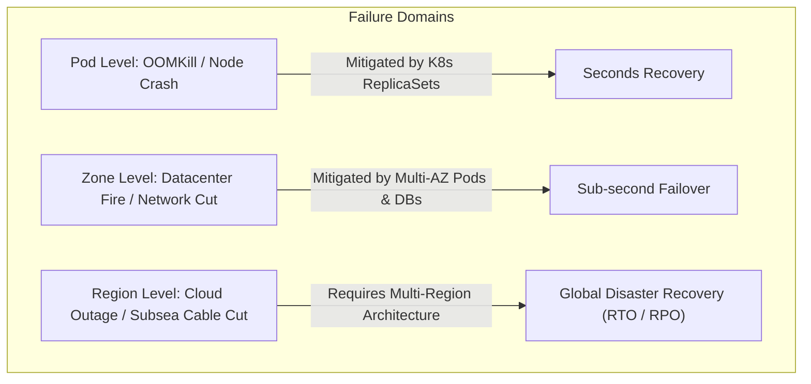
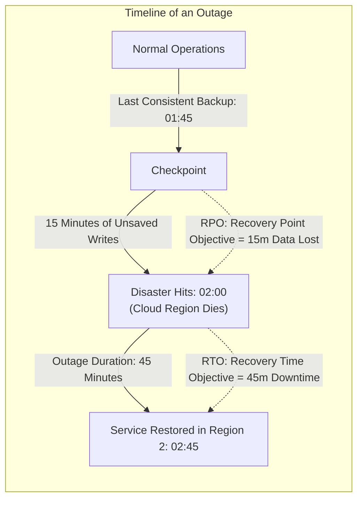
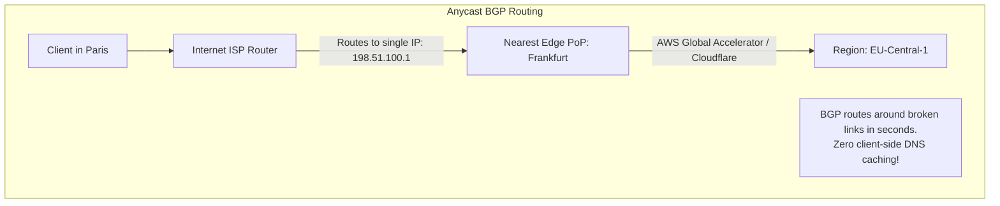
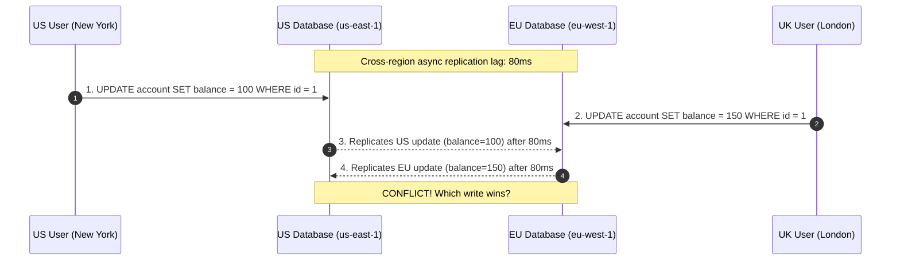
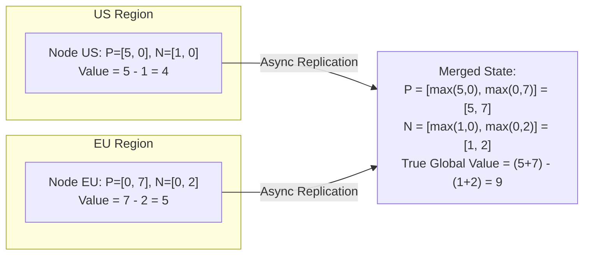
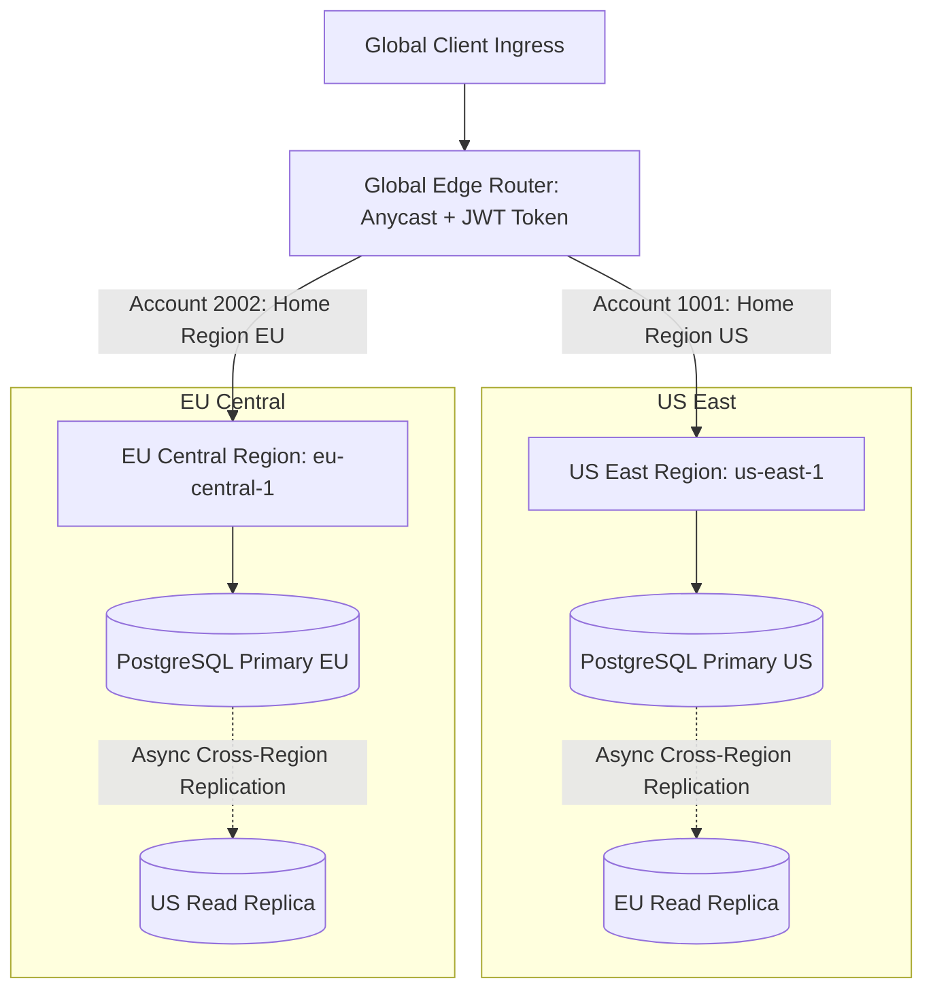

## 1. Mental Model: Failure Domains & The Speed of Light

In single-region cloud architectures, high availability (HA) is achieved by spreading pods and database replicas across 3 **Availability Zones (AZs)** within a single geographic metropolitan area (e.g., `us-east-1a`, `us-east-1b`, `us-east-1c`). AZs are connected via dedicated, ultra-low-latency fiber networks ($\le 1\text{ms}$ round-trip time).

However, entire cloud regions can and do fail due to power grid collapse, catastrophic hurricane damage, DNS control-plane corruption, or fiber-optic backbone cuts:

### The Speed-of-Light Physical Constraint
Light in a vacuum travels at $\sim 300,000\text{ km/s}$, but in fiber-optic glass it slows to $\sim 200,000\text{ km/s}$ due to the refractive index ($n \approx 1.5$). A packet traveling between Virginia (`us-east-1`) and Frankfurt (`eu-central-1`) covers roughly $6,500\text{ km}$:

$$\text{Theoretical One-Way Latency} = \frac{6,500\text{ km}}{200,000\text{ km/s}} = 32.5\text{ ms}$$
$$\text{Practical Round-Trip Time (RTT)} \approx \mathbf{70\text{ ms} - 90\text{ ms}}$$

<Warning>
You cannot cheat physics. If you attempt synchronous two-phase commits (2PC) or synchronous database replication across oceans, every single write operation will suffer a minimum **70ms - 150ms latency penalty**, destroying throughput.
</Warning>

---

## 2. Disaster Recovery Metrics: RTO vs RPO

Before designing a multi-region system, business leaders and architects must negotiate two non-negotiable metrics:

1. **RTO (Recovery Time Objective)**: The maximum acceptable duration of service downtime before business operations are restored.
2. **RPO (Recovery Point Objective)**: The maximum acceptable amount of data loss (measured in time) when disaster strikes.

### Disaster Recovery Tiers:

| Topology | Description | Typical RTO | Typical RPO | Infrastructure Cost |
| :--- | :--- | :--- | :--- | :--- |
| **Backup & Restore** | Daily snapshots shipped to secondary region S3 bucket | 12 - 24 hours | 24 hours | Minimal ($) |
| **Pilot Light** | Minimal core database replicating asynchronously; compute spun up on demand | 1 - 2 hours | 5 - 15 minutes | Low ($$) |
| **Warm Standby (Active-Passive)** | Secondary region runs scaled-down pods; instant DB failover | 1 - 5 minutes | Sub-minute | Moderate ($$$) |
| **Active-Active (Multi-Region)** | Both regions serve reads and writes concurrently | **Zero (sub-second)** | **Zero (or near-zero)** | **Highest ($$$$$)** |

---

## 3. Global Ingress & Traffic Steering: Anycast vs DNS

How do incoming client requests get routed to the healthiest, lowest-latency cloud region?

<Tabs>
  <Tab title="Anycast BGP Routing (Recommended)">
    - A single public IP address is advertised simultaneously from hundreds of global edge points-of-presence (PoPs) using Border Gateway Protocol (BGP).
    - Client TCP connections automatically terminate at the physically closest edge proxy (e.g., AWS Global Accelerator, Cloudflare).
    - If an entire region goes dark, BGP withdraws the route advertisement, and internet routers steer traffic to the next nearest region in **seconds**.
  </Tab>
  <Tab title="DNS Latency Routing (The TTL Caching Trap)">
    - DNS nameservers (AWS Route 53) resolve `api.example.com` to different regional IP addresses based on client geographic IP.
    - **The TTL Caching Trap**: Even if you configure a 60-second DNS TTL, recursive ISP resolvers, corporate firewalls, and mobile OS networks aggressively cache DNS records for hours or days.
    - When Region 1 dies, up to **30-40% of clients** continue sending traffic to the dead region until their local DNS cache expires!
  </Tab>
</Tabs>

---

## 4. The Active-Active Dilemma: Concurrency Across Continents

In a true **Active-Active** deployment, users in New York write to `us-east-1` while users in London write to `eu-west-1`. Both regions maintain local database instances that asynchronously replicate writes across the Atlantic:

### Why Last-Write-Wins (LWW) Silently Destroys Data
Many distributed databases (e.g., Apache Cassandra, DynamoDB Global Tables) resolve write conflicts using **Last-Write-Wins (LWW)** based on wall-clock timestamps:
1. If the US node's NTP clock was drifting 20ms slow, the UK update's timestamp appears "newer", arbitrarily overwriting the US update.
2. Even worse: if two users add different items to the same shopping cart simultaneously, LWW completely **erases** one user's item rather than merging them!

---

## 5. Mathematical Conflict Resolution: CRDTs

To achieve true Active-Active convergence without data loss, distributed systems rely on **Conflict-free Replicated Data Types (CRDTs)**.

A CRDT is an abstract data type whose replication operations satisfy three mathematical properties:
1. **Commutativity**: $A \cdot B = B \cdot A$ (Order of arrival does not matter).
2. **Associativity**: $(A \cdot B) \cdot C = A \cdot (B \cdot C)$ (Grouping of packets does not matter).
3. **Idempotence**: $A \cdot A = A$ (Duplicate network messages have no effect).

### 1. PN-Counter (Positive-Negative Counter)
Used for distributed likes, upvotes, or inventory counts without centralized locking. It maintains two internal vectors per region node: $P$ (increments) and $N$ (decrements).

$$\text{Value} = \sum P_i - \sum N_i$$
$$\text{Merge}(A, B) = \left( \max(P_{A, i}, P_{B, i}), \max(N_{A, i}, N_{B, i}) \right)$$

### 2. OR-Set (Observed-Removed Set) for Shopping Carts
To prevent items from vanishing when users edit their cart from multiple devices across regions:
- Every `add(item)` generates a unique UUID tag: `(item, uuid)`.
- When an item is removed, the observed UUID tags are moved to a tombstone set.
- The set difference $\text{AddSet} \setminus \text{RemoveSet}$ guarantees that concurrent additions and deletions merge deterministically without data loss.

---

## 6. The Pragmatic Enterprise Solution: Partitioned Active-Active

Because CRDTs cannot model complex relational foreign keys or financial balance checks (e.g., "balance cannot drop below zero"), tier-1 enterprises (Uber, Netflix, Stripe) implement **Partitioned Active-Active** (Home Region Routing):

### How Partitioned Active-Active Works:
1. **Deterministic Home Region**: Every user or tenant is permanently assigned a "Home Region" based on their country of residence (`us-east-1` or `eu-central-1`).
2. **Local Writes**: 99.9% of a user's transactions are routed directly to their Home Region, executing against a local PostgreSQL primary with **zero cross-region locking**.
3. **Global Replicas for Reads**: User data is asynchronously replicated to the other region as read-only replicas. If an American user travels to Berlin, their reads are served locally in Europe, while writes are proxied back to `us-east-1`.
4. **Regional Evacuation (Disaster Failover)**: If `us-east-1` suffers a total outage, an automated control-plane promotes the European read-replica of US accounts to primary, updating home-region routing metadata in seconds.

---

## 7. Failure Modes & Edge Case Matrix

| Disaster Scenario | Architecture | Impact | Production Defense |
| :--- | :--- | :--- | :--- |
| **DNS TTL Blackhole** | DNS Latency Routing | 30% of clients send traffic to dead region for hours | Terminate traffic using Anycast BGP (AWS Global Accelerator / Cloudflare). |
| **Split-Brain Writes** | Active-Active Multi-Master | Both regions accept conflicting writes to same row | Enforce Home Region routing; use CRDTs for collaborative data. |
| **Replication Lag Data Loss** | Asynchronous DB Replication | Unreplicated in-flight transactions lost during sudden failover | Monitor RPO continuously via replication lag metrics; alert if lag exceeds 5 seconds. |
| **Trans-Atlantic DB Deadlock** | Synchronous Multi-Region 2PC | Throughput plummets; queries hang waiting for 80ms RTT | Never execute distributed synchronous locks across continents. |

---

## 8. Senior Interview Questions & Active Recall

<AccordionGroup>
  <Accordion title="Why is synchronous multi-region database replication practically impossible for high-throughput backends?">
    Synchronous replication requires every transaction to wait for acknowledgment from the remote region before returning success to the client. Because the speed of light in fiber optics enforces a physical floor of roughly 70ms - 90ms for trans-Atlantic round trips, transactions hold database row locks for orders of magnitude longer than normal. This causes extreme lock contention, connection pool exhaustion in HikariCP, and caps write throughput to a fraction of single-region capacity.
  </Accordion>
  <Accordion title="What is the difference between RTO and RPO, and why does RPO=0 cost exponentially more?">
    **RTO** is the maximum acceptable downtime (how fast you recover). **RPO** is the maximum acceptable data loss (how much data you lose). Achieving an RPO of zero across geographic regions requires synchronous replication, meaning every committed byte must exist in two distant physical data centers before acknowledging the client. This introduces massive network latency and complex multi-region consensus protocols (Multi-Raft / Spanner), drastically increasing operational and infrastructure costs.
  </Accordion>
  <Accordion title="How does Anycast BGP routing outperform Geo-DNS during a catastrophic regional outage?">
    Geo-DNS relies on clients querying recursive DNS resolvers, which frequently ignore low TTLs and cache IP addresses for hours. When a region crashes, clients with cached IPs continue sending requests to dead servers. Anycast routes traffic at the network IP layer via BGP. When a region fails, BGP withdraws the IP route advertisement, causing internet routers worldwide to steer packets to the nearest surviving region in seconds with zero client-side caching.
  </Accordion>
</AccordionGroup>

---

## 9. Done Checklist

<Check>
- [ ] Calculate theoretical and practical cross-region latency limits based on the speed of light in fiber optics.
- [ ] Define RTO and RPO and compare Backup/Restore, Pilot Light, Warm Standby, and Active-Active.
- [ ] Contrast Anycast BGP routing with DNS Latency-Based Routing and avoid the DNS TTL caching trap.
- [ ] Understand why Last-Write-Wins (LWW) leads to silent data loss during concurrent multi-region updates.
- [ ] Explain the mathematical properties of CRDTs (Commutative, Associative, Idempotent) and deconstruct PN-Counters and OR-Sets.
- [ ] Architect a Partitioned Active-Active system using deterministic Home Region routing.
</Check>
