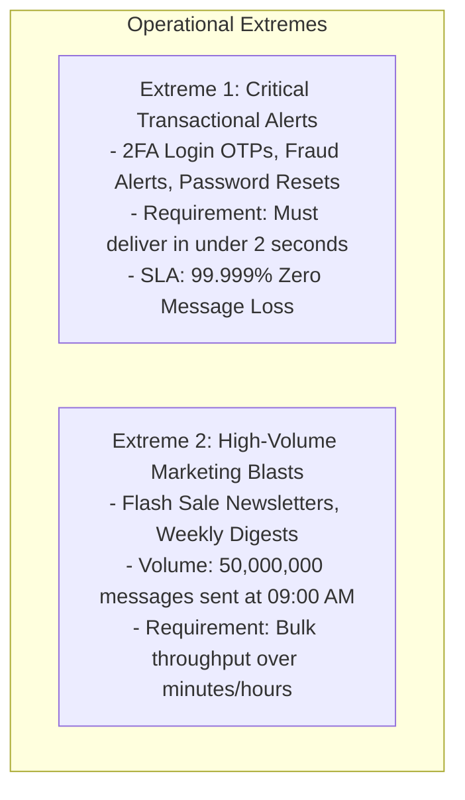
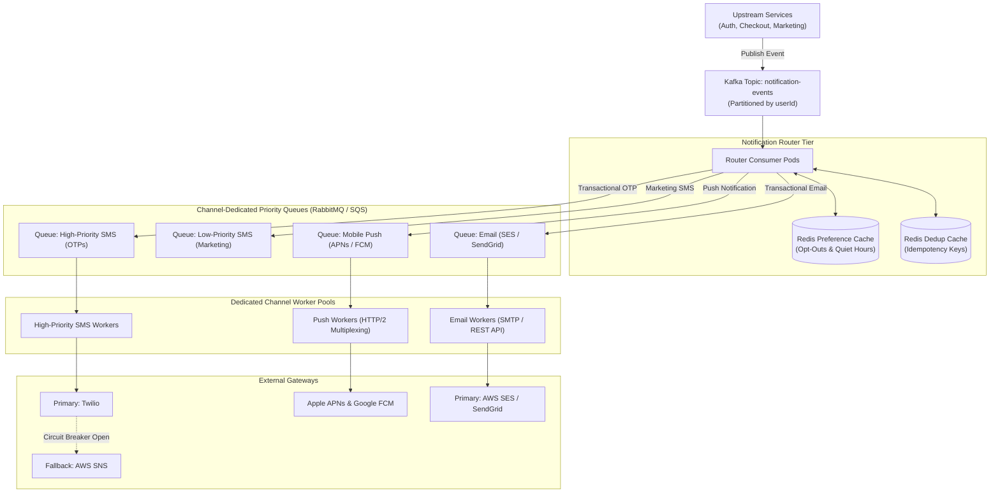

## 1. Mental Model: The Two Extremes of Notification Delivery

A high-scale notification platform delivers hundreds of millions of messages daily across multiple channels: Mobile Push (Apple APNs, Google FCM), SMS (Twilio, AWS SNS), Email (SendGrid, AWS SES), and In-App WebSockets.

In production architectures, notifications span two vastly different operational extremes:



<Warning>
**The Head-of-Line Blocking Disaster**:
If you publish marketing newsletters and 2FA authentication codes into the same shared message queue, the 50-million marketing blast will fill the queue. A user attempting to log in will wait 4 hours for their two-factor OTP SMS to reach the front of the queue, completely paralyzing customer logins!
</Warning>

---

## 2. End-to-End Distributed Architecture



### Channel Rate Mismatches:
- **Mobile Push (APNs / FCM)**: Can ingest up to **10,000+ requests/sec** over long-lived HTTP/2 multiplexed sockets.
- **SMS Gateways (Twilio / AWS SNS)**: Enforce strict carrier limits (e.g., standard US 10-Digit Long Code numbers are throttled to **1 SMS/sec** per number; dedicated Short Codes allow 100 SMS/sec).
- **Email Providers (SES / SendGrid)**: Require warming up IP addresses to prevent spam filters from rejecting bulk email blasts.

---

## 3. Distributed Deduplication & Idempotency

In distributed systems, network timeouts and producer retries mean upstream microservices will inevitably publish duplicate events (e.g., the checkout service retrying an order confirmation):

```mermaid
sequenceDiagram
    autonumber
    participant App as Checkout Service
    participant Kafka as Notification Kafka Topic
    participant Router as Notification Router Worker
    participant Redis as Redis Deduplication Cache

    App->>Kafka: Publish OrderConfirmed (Idempotency Key: ord_101)
    Kafka->>Router: Deliver Event (Attempt 1)
    Router->>Redis: SET dedup:ord_101:SMS "PROCESSING" NX EX 86400
    Note over Redis: Returns OK (Lock Acquired!)
    Router->>Router: Renders template & dispatches SMS
    Router->>Redis: SET dedup:ord_101:SMS "SENT" EX 86400
    
    Note over Kafka,Router: Network glitch causes Kafka to re-deliver same event!
    Kafka->>Router: Re-deliver Event (Attempt 2)
    Router->>Redis: SET dedup:ord_101:SMS "PROCESSING" NX EX 86400
    Note over Redis: Returns NULL! (Key already exists!)
    Router->>Router: Log duplicate detected; safely ack message and discard!
    Note over Router: Customer is never spammed twice!
```

---

## 4. User Preferences & Quiet Hours Timezone Engine

Never send promotional marketing alerts at 3:00 AM in the user's local timezone.

### The Algorithm:
1. If the message priority is **TRANSACTIONAL (HIGH)** (e.g., OTP or fraud alert): **Bypass quiet hours** and send immediately.
2. If the message priority is **MARKETING (LOW)**:
   - Fetch the user's registered timezone (e.g., `America/New_York`).
   - Convert current UTC time to user local time using `java.time.ZonedDateTime`.
   - Check if the local time falls between the quiet hours window (e.g., 22:00 to 08:00).
   - If within quiet hours: Reschedule the notification message for 08:00 AM local time the next morning.

```java
package com.backend.mastery.systemdesign.notification;

import java.time.LocalTime;
import java.time.ZoneId;
import java.time.ZonedDateTime;

public final class QuietHoursEvaluator {

    private static final LocalTime QUIET_HOURS_START = LocalTime.of(22, 0); // 10:00 PM
    private static final LocalTime QUIET_HOURS_END = LocalTime.of(8, 0);   // 08:00 AM

    private QuietHoursEvaluator() {}

    /**
     * Evaluates if a notification should be muted based on user local time.
     */
    public static boolean isInQuietHours(ZoneId userZoneId) {
        ZonedDateTime userLocalTime = ZonedDateTime.now(userZoneId);
        LocalTime time = userLocalTime.toLocalTime();

        // Quiet hours cross midnight: 22:00 to 08:00
        if (QUIET_HOURS_START.isAfter(QUIET_HOURS_END)) {
            return time.isAfter(QUIET_HOURS_START) || time.isBefore(QUIET_HOURS_END);
        } else {
            return time.isAfter(QUIET_HOURS_START) && time.isBefore(QUIET_HOURS_END);
        }
    }
}
```

---

## 5. Complete Working Code: Spring Boot 3.3 Notification Consumer

Below is the complete production Kafka consumer implementing manual offset acknowledgment (`AckMode.MANUAL_IMMEDIATE`), atomic Redis deduplication, quiet hours evaluation, dynamic parameter template substitution, and multi-channel routing:

```java
package com.backend.mastery.systemdesign.notification;

import org.slf4j.Logger;
import org.slf4j.LoggerFactory;
import org.springframework.data.redis.core.StringRedisTemplate;
import org.springframework.kafka.annotation.KafkaListener;
import org.springframework.kafka.support.Acknowledgment;
import org.springframework.stereotype.Service;

import java.time.Duration;
import java.time.ZoneId;
import java.util.Map;

@Service
public class NotificationConsumerWorker {

    private static final Logger log = LoggerFactory.getLogger(NotificationConsumerWorker.class);

    private final StringRedisTemplate redisTemplate;
    private final NotificationChannelDispatcher channelDispatcher;

    public NotificationConsumerWorker(
            StringRedisTemplate redisTemplate,
            NotificationChannelDispatcher channelDispatcher) {
        this.redisTemplate = redisTemplate;
        this.channelDispatcher = channelDispatcher;
    }

    @KafkaListener(
            topics = "notification-events",
            groupId = "notification-router-group",
            concurrency = "6"
    )
    public void consumeNotificationEvent(NotificationEvent event, Acknowledgment ack) {
        try {
            String dedupKey = "dedup:" + event.eventId() + ":" + event.channel();

            // 1. Atomic Redis Deduplication Guard (24-hour TTL)
            Boolean isNewEvent = redisTemplate.opsForValue()
                    .setIfAbsent(dedupKey, "PROCESSING", Duration.ofHours(24));

            if (Boolean.FALSE.equals(isNewEvent)) {
                log.info("Duplicate notification detected for key {}. Safely dropping.", dedupKey);
                ack.acknowledge();
                return;
            }

            // 2. Quiet Hours Evaluation for Non-Transactional Messages
            if (event.priority() == NotificationPriority.MARKETING) {
                ZoneId userZone = ZoneId.of(event.userTimezone());
                if (QuietHoursEvaluator.isInQuietHours(userZone)) {
                    log.info("User {} is currently in quiet hours. Rescheduling message.", event.userId());
                    rescheduleForMorning(event);
                    ack.acknowledge();
                    return;
                }
            }

            // 3. Render Dynamic Template
            String renderedBody = renderTemplate(event.templateBody(), event.parameters());

            // 4. Dispatch to Dedicated Channel Queue / External Provider
            channelDispatcher.dispatch(event.channel(), event.recipient(), renderedBody);

            // 5. Mark Deduplication as SENT
            redisTemplate.opsForValue().set(dedupKey, "SENT", Duration.ofHours(24));

            // 6. Manually Acknowledge Kafka Offset
            ack.acknowledge();
            log.info("Successfully processed notification {}", event.eventId());

        } catch (Exception ex) {
            log.error("Failed to process notification {}: {}", event.eventId(), ex.getMessage());
            // Do not acknowledge offset; Kafka will redeliver or route to Dead-Letter Topic (.DLT)
            throw new RuntimeException("Notification processing failed", ex);
        }
    }

    private String renderTemplate(String template, Map<String, String> params) {
        String result = template;
        for (Map.Entry<String, String> entry : params.entrySet()) {
            result = result.replace("{" + entry.getKey() + "}", entry.getValue());
        }
        return result;
    }

    private void rescheduleForMorning(NotificationEvent event) {
        // Enqueue into a delay worker or scheduled Redis ZSET for 08:00 AM local time dispatch
        log.info("Notification {} placed in morning delay queue", event.eventId());
    }

    public record NotificationEvent(
            String eventId,
            Long userId,
            String channel, // SMS, EMAIL, PUSH
            NotificationPriority priority,
            String recipient,
            String templateBody,
            Map<String, String> parameters,
            String userTimezone
    ) {}

    public enum NotificationPriority {
        TRANSACTIONAL, // Bypasses quiet hours
        MARKETING      // Subject to quiet hours
    }
}
```

---

## 6. Provider Resilience & Automated Failover

What happens when an external provider (e.g., Twilio) suffers a cloud outage?

```mermaid
flowchart LR
    Worker[SMS Worker] --> CB{Resilience4j Circuit Breaker}
    CB -->|State: Closed| Twilio["Primary: Twilio API"]
    Twilio -->|Success (200 OK)| Done[Message Sent]
    
    Twilio -.->|Rate Limit 429 or 5xx Outage| Trip["Trip Circuit Breaker to OPEN"]
    CB -->|State: Open| Fallback["Fallback: AWS SNS Gateway"]
    Fallback --> Done
```

### Multi-Provider Circuit Breaker Configuration (`application.yml`)
```yaml
resilience4j.circuitbreaker:
  instances:
    smsProvider:
      slidingWindowSize: 20
      failureRateThreshold: 50.0
      waitDurationInOpenState: 60s
      permittedNumberOfCallsInHalfOpenState: 5
```

---

## 7. Failure Modes & Edge Case Matrix

| Failure Mode | Root Cause | Impact | Production Defense |
| :--- | :--- | :--- | :--- |
| **Head-of-Line Blocking** | Shared queue for transactional and marketing messages | 2FA OTP codes delayed by 4 hours behind newsletters | Isolate queues and worker pools by channel and priority. |
| **Duplicate Delivery Storm** | Upstream checkout service network timeout retry | Customer receives 5 identical credit card charge SMSs | Atomic Redis `SETNX` deduplication check with 24-hour TTL. |
| **Middle-of-the-Night Push** | Server sends flash sale promotional blast using UTC time | User receives loud marketing push at 3:00 AM | Evaluate user local timezone via `QuietHoursEvaluator` before dispatch. |
| **Provider Cloud Outage** | Primary SMS gateway (Twilio) suffers API outage | 100% of OTP SMS deliveries fail platform-wide | Wrap provider client with Resilience4j circuit breaker with AWS SNS fallback. |
| **Unregistered Push Tokens** | User uninstalled mobile app | Apple APNs returns `410 BadDeviceToken` | Ingest APNs delivery feedback webhooks and deactivate invalid device tokens in DB. |

---

## 8. Senior Interview Questions & Active Recall

<AccordionGroup>
  <Accordion title="1. Why is queue and worker isolation mandatory between transactional and marketing notifications?">
    Marketing campaigns generate sudden bursts of tens of millions of non-urgent messages (e.g., weekly flash sales). Transactional messages (2FA login codes, password resets, fraud alerts) require sub-2-second delivery. If both types share the same queue, the massive marketing burst fills the buffer, causing Head-of-Line blocking where time-sensitive OTPs are stuck behind millions of marketing messages, breaking user authentication platform-wide.
  </Accordion>

  <Accordion title="2. How do you prevent duplicate notifications from being delivered when an upstream service retries an event?">
    Upstream producers must include an immutable `idempotency_key` (or `event_id`) with every notification payload. When a notification worker dequeues the message, it executes an atomic Redis `SET dedup:{key}:{channel} "PROCESSING" NX EX 86400` command. If the key already exists (returns null), the worker immediately acknowledges and discards the message as a duplicate, preventing the user from receiving duplicate SMS or email alerts.
  </Accordion>

  <Accordion title="3. How do you handle quiet hours when marketing notifications cross multiple international timezones?">
    Do not schedule batch marketing blasts using server UTC time. Instead, store the user's IANA timezone (`ZoneId`, e.g., `Europe/London`, `Asia/Tokyo`) in their profile. Before dispatching a non-transactional marketing message, compute the user's current local time via `ZonedDateTime.now(userZone)`. If the local time falls within the quiet hours window (e.g., 22:00 to 08:00), divert the notification to a delayed queue scheduled for dispatch at 08:00 AM local time the following morning.
  </Accordion>

  <Accordion title="4. How do you handle third-party gateway rate limits and sudden provider outages?">
    Rate-limit outbound worker pools to match downstream provider quotas (e.g., 1 SMS/sec per US 10DLC number). Wrap external provider API calls in a **Resilience4j Circuit Breaker**. If the primary provider (e.g., Twilio) returns consecutive 5xx errors or network timeouts, the circuit breaker trips to `OPEN`, immediately diverting outbound traffic to a secondary fallback provider (e.g., AWS SNS) without dropping in-flight messages.
  </Accordion>
</AccordionGroup>

---

## 9. Done Checklist

<Check>
- [ ] Diagram an end-to-end notification architecture separating transactional OTPs from marketing blasts.
- [ ] Explain why channel-dedicated priority queues eliminate Head-of-Line blocking.
- [ ] Implement atomic message deduplication in Redis using `SETNX` with a 24-hour TTL.
- [ ] Calculate user quiet hours using `java.time.ZoneId` and `ZonedDateTime` to mute non-urgent marketing alerts.
- [ ] Build a Spring Boot 3.3 Kafka notification consumer with manual offset acknowledgment (`AckMode.MANUAL_IMMEDIATE`).
- [ ] Architect multi-provider failover with Resilience4j circuit breakers (Twilio $\rightarrow$ AWS SNS).
</Check>
