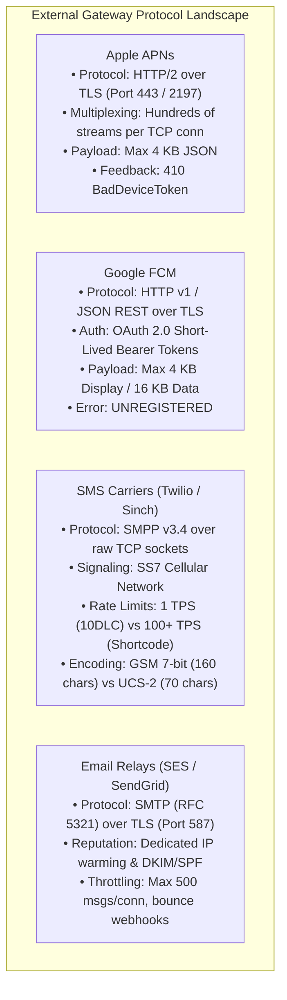
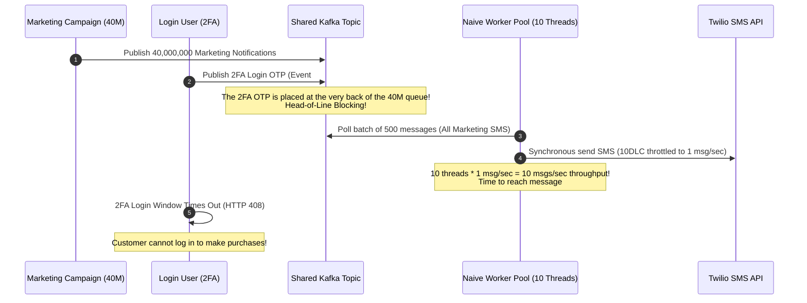
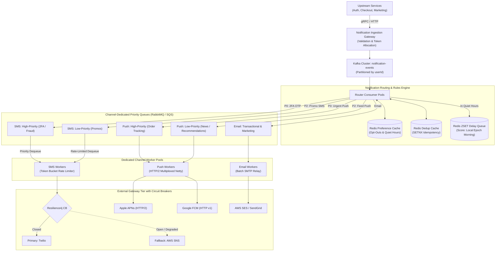
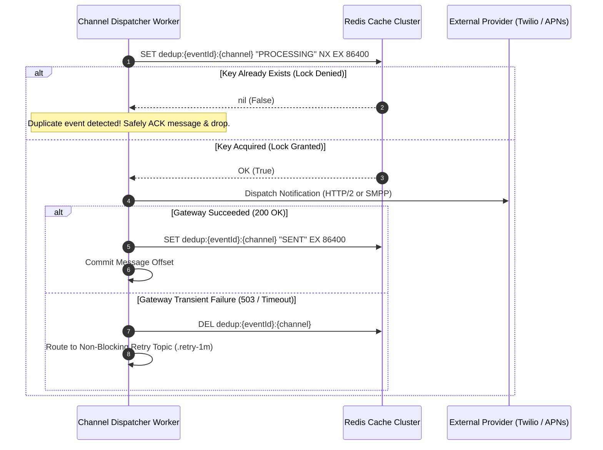
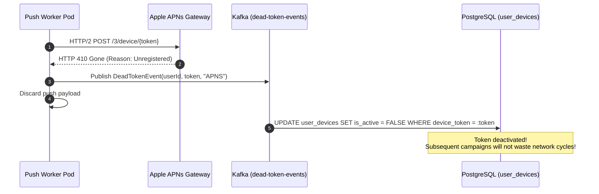
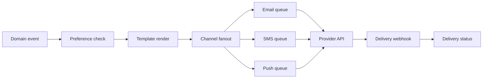

# Design a High-Scale Multi-Channel Notification System

A global notification platform is one of the most deceptive distributed systems in software engineering.

On the surface, sending a notification seems trivial: make an HTTP call to Apple APNs, Google FCM, Twilio, or SendGrid. In production at scale (handling 500 million messages daily), the system must reconcile two fundamentally opposing forces:
1. **Ultra-Low Latency Transactional Traffic**: Two-Factor Authentication (2FA) OTP codes and real-time fraud alerts where delivery delay beyond 3 seconds breaks user authentication.
2. **Massive Throughput Marketing Blasts**: Promotional campaigns pushing 50 million messages simultaneously, capable of saturating queues, triggering downstream rate limits, and starving critical alerts for hours.

---

## Phase 1: Ground Floor (Physical First Principles & Network Protocols)

To architect a notification engine, you must understand the underlying networking protocols and mechanical constraints of external gateway providers.



### 1. Apple Push Notification service (APNs) Internals
- **Protocol**: HTTP/2 binary framing over persistent TLS connections.
- **Multiplexing**: APNs requires long-lived connections. Establishing a TLS handshake for every notification destroys throughput. A single HTTP/2 connection can multiplex hundreds of concurrent notification streams over one TCP socket.
- **Device Token Lifecycle**: When a user uninstalls your app or wipes their iPhone, APNs rejects the push with an HTTP status `410 Unregistered` (`BadDeviceToken`). Continuing to send pushes to dead tokens triggers Apple's spam detection and throttles the entire developer account.

### 2. Cellular SMS Carrier Protocols (SMPP & SS7)
- **Protocol**: Short Message Peer-to-Peer (SMPP) over raw TCP sockets, connecting your aggregator (e.g., Twilio, AWS SNS) to Mobile Network Operators (Verizon, AT&T, Vodafone).
- **Physical Bandwidth & Throughput Limits**:
  - **10-Digit Long Code (10DLC)**: Standard virtual phone numbers are restricted by US carrier consortiums (The Campaign Registry) to **1 message per second (1 TPS)** to prevent spam.
  - **Toll-Free Numbers**: 3 to 25 TPS.
  - **Short Codes (5-6 digits)**: 100 to 500+ TPS (costs $1,000+/month).
- **Character Encoding Traps**: Standard text uses **GSM 03.38 7-bit encoding** (up to 160 characters per SMS segment). The moment a user pastes a single emoji (e.g., 👋 or 🚀), the carrier switches the entire message to **UCS-2 16-bit encoding**, slashing the segment limit from 160 to **70 characters** and doubling carrier billing costs.

### 3. Email Infrastructure (SMTP, SPF, DKIM & DMARC)
- **Protocol**: Simple Mail Transfer Protocol (SMTP) over TCP port 587/465.
- **Deliverability Physics**: Outbound IP addresses have a "reputation score." Blasting 1,000,000 emails from a brand-new IP address will cause Gmail and Microsoft Outlook to immediately drop 98% of your emails into the Spam quarantine. New IP addresses must follow an automated **IP Warmup Ramp** (sending 500 emails on Day 1, 1,000 on Day 2, doubling daily over 30 days).

---

## Phase 2: The Naive Code (The Production Crash)

An e-commerce company built a unified notification service. The engineering team created a single Spring Boot service that subscribed to an `orders-and-notifications` Kafka topic and dispatched alerts through a common worker pool.

During a Black Friday promotional event, the marketing team scheduled a 40-million flash sale push blast for 10:00 AM. Simultaneously, real-time checkout volume surged to 2,000 orders/sec.

Within 4 minutes of the marketing blast launch:
1. Customers attempting to log in never received their Two-Factor Authentication (2FA) SMS codes. The login window timed out after 60 seconds.
2. Checkout customers received between 15 and 40 identical credit card charge confirmation SMS messages.
3. Apple APNs returned `429 Too Many Requests`, and Twilio throttled the long code phone numbers.
4. The service suffered a catastrophic thread pool lockup and crashed with `OutOfMemoryError: Java heap space`.

### The Naive Implementation

```java
@Service
public class NaiveNotificationDispatcher {

    private final TwilioClient twilioClient;
    private final ApnsClient apnsClient;
    private final EmailClient emailClient;

    public NaiveNotificationDispatcher(TwilioClient twilioClient, ApnsClient apnsClient, EmailClient emailClient) {
        this.twilioClient = twilioClient;
        this.apnsClient = apnsClient;
        this.emailClient = emailClient;
    }

    // NAIVE: Consumes from a single shared topic with no priority separation, no dedup, and synchronous blocking I/O!
    @KafkaListener(topics = "notifications-all", groupId = "notification-workers", concurrency = "10")
    public void onNotificationReceived(NotificationMessage msg) {
        // DISASTER 1: Synchronous network call blocks the Kafka consumer thread for up to 3-5 seconds!
        if ("SMS".equals(msg.getChannel())) {
            // Naive retry loop: On network glitch, retries without idempotency!
            twilioClient.sendSms(msg.getPhoneNumber(), msg.getBody());
        } else if ("PUSH".equals(msg.getChannel())) {
            apnsClient.sendPush(msg.getDeviceToken(), msg.getTitle(), msg.getBody());
        } else if ("EMAIL".equals(msg.getChannel())) {
            emailClient.sendEmail(msg.getEmail(), msg.getSubject(), msg.getBody());
        }
    }
}
```

### Why the System Collapsed



1. **Head-of-Line (HoL) Blocking**:
   Both low-priority marketing blasts and high-priority 2FA OTPs were published to the same shared Kafka topic. The 40-million promotional batch sat in front of the login OTPs. Processing at carrier throughput rates meant a user's 2FA code would not dequeue for hours.
2. **The Duplicate SMS Bombardment**:
   When Twilio took 4 seconds to respond under heavy load, the naive consumer thread timed out and threw an exception. Kafka considered the message unprocessed and redelivered the same partition batch. Because there was **no distributed deduplication key**, the worker re-dispatched the SMS. One angry customer received 37 duplicate SMS alerts within 15 minutes!
3. **The 3:00 AM Timezone Scandal**:
   The marketing batch was triggered at 10:00 AM UTC. Customers living in Los Angeles and Seattle were woken up at 2:00 AM local time by loud push notifications promoting winter coats. The mobile app suffered an immediate 14% uninstallation rate.

---

## Phase 3: Under the Hood (Mechanics, Mathematical Framework & System Blueprints)

To handle hundreds of millions of notifications reliably, a production engine must decouple ingestion, priority routing, deduplication, user preferences, and gateway dispatching.



---

### 1. The Distributed Deduplication Engine (Two-Phase Redis Guard)

Network interruptions between the worker and external providers mean upstream services will retry. To guarantee that a recipient is never messaged twice for the same event, we implement an atomic **Two-Phase Idempotency Protocol** in Redis:



---

### 2. Quiet Hours Timezone Scheduling with Redis Sorted Sets (ZSET)

Marketing messages must never disturb users during nighttime hours (default: 22:00 to 08:00 user local time).

When a low-priority notification is evaluated:
1. Read the recipient's IANA timezone (`ZoneId`, e.g., `America/Chicago`).
2. Convert UTC to `ZonedDateTime.now(userZone)`.
3. If current time is between 22:00 and 08:00:
   - Compute the upcoming 08:00 AM timestamp in that local timezone.
   - Convert that local 08:00 AM into UTC epoch milliseconds.
   - Enqueue the message into a Redis Sorted Set (`ZSET`) where **score = target UTC epoch millisecond**:
     ```bash
     ZADD delayed:notifications:marketing <target_epoch_ms> <serialized_event_json>
     ```
4. A dedicated background poller evaluates `ZRANGEBYSCORE delayed:notifications:marketing 0 <current_utc_epoch_ms>` every 5 seconds, popping and routing matured messages to the active queues.

```java
package com.backend.mastery.systemdesign.notification;

import java.time.LocalTime;
import java.time.ZoneId;
import java.time.ZonedDateTime;

public final class QuietHoursScheduler {

    private static final LocalTime QUIET_START = LocalTime.of(22, 0); // 10:00 PM
    private static final LocalTime QUIET_END = LocalTime.of(8, 0);    // 08:00 AM

    private QuietHoursScheduler() {}

    /**
     * Determines if the current instant falls inside user quiet hours.
     */
    public static boolean isQuietHours(ZoneId userZone) {
        ZonedDateTime now = ZonedDateTime.now(userZone);
        LocalTime time = now.toLocalTime();

        // 22:00 to 08:00 spans across midnight
        if (QUIET_START.isAfter(QUIET_END)) {
            return time.isAfter(QUIET_START) || time.isBefore(QUIET_END);
        }
        return time.isAfter(QUIET_START) && time.isBefore(QUIET_END);
    }

    /**
     * Calculates the exact UTC epoch millisecond for the upcoming 08:00 AM local morning.
     */
    public static long calculateMorningEpochMillis(ZoneId userZone) {
        ZonedDateTime now = ZonedDateTime.now(userZone);
        ZonedDateTime targetMorning = now.toLocalDate().atTime(QUIET_END).atZone(userZone);

        // If it's already past 22:00, the upcoming 08:00 AM is tomorrow morning
        if (now.toLocalTime().isAfter(QUIET_START) || now.isEqual(targetMorning) || now.isAfter(targetMorning)) {
            targetMorning = targetMorning.plusDays(1);
        }

        return targetMorning.toInstant().toEpochMilli();
    }
}
```

Line-by-line quiet-hours reading:

- `QUIET_START = 22:00` and `QUIET_END = 08:00` define a window that crosses midnight. That is why simple `start < time < end` logic is wrong.
- `ZoneId userZone` must be an IANA zone like `Asia/Kolkata`, not a fixed offset like `+05:30`, because daylight saving rules can change local morning time.
- `ZonedDateTime.now(userZone)` converts the current instant into the user's local calendar and clock.
- `time = now.toLocalTime()` discards the date only after timezone conversion.
- `QUIET_START.isAfter(QUIET_END)` detects midnight-spanning ranges.
- `time.isAfter(QUIET_START) || time.isBefore(QUIET_END)` means 23:00 and 07:00 are quiet, while 14:00 is not.
- `targetMorning = now.toLocalDate().atTime(QUIET_END).atZone(userZone)` builds the next allowed local send time.
- `targetMorning.plusDays(1)` handles the case where today's 08:00 has already passed.
- `toInstant().toEpochMilli()` converts the local morning back to a UTC score for Redis ZSET scheduling.

Proof drill: test `America/New_York` on a daylight-saving transition, `Asia/Kolkata` with no daylight saving, and `Pacific/Kiritimati` near the date boundary. The message must mature at the user's real 08:00 local time.

---

### 3. Complete Production Worker Implementation (Spring Boot 3.3)

Below is the production-grade Kafka consumer implementing priority routing, atomic Redis deduplication, quiet hours deferral, template interpolation, and circuit-breaker protected gateway dispatching:

```java
package com.backend.mastery.systemdesign.notification;

import org.slf4j.Logger;
import org.slf4j.LoggerFactory;
import org.springframework.data.redis.core.StringRedisTemplate;
import org.springframework.kafka.annotation.KafkaListener;
import org.springframework.kafka.support.Acknowledgment;
import org.springframework.stereotype.Service;

import java.time.Duration;
import java.time.ZoneId;
import java.util.Map;

@Service
public class ProductionNotificationRouter {

    private static final Logger log = LoggerFactory.getLogger(ProductionNotificationRouter.class);

    private final StringRedisTemplate redisTemplate;
    private final NotificationPriorityDispatcher priorityDispatcher;

    public ProductionNotificationRouter(
            StringRedisTemplate redisTemplate,
            NotificationPriorityDispatcher priorityDispatcher) {
        this.redisTemplate = redisTemplate;
        this.priorityDispatcher = priorityDispatcher;
    }

    @KafkaListener(
            topics = "notification-events",
            groupId = "notification-router-tier",
            concurrency = "8"
    )
    public void routeNotification(NotificationEvent event, Acknowledgment ack) {
        String dedupKey = "dedup:" + event.eventId() + ":" + event.channel();

        try {
            // Step 1: Atomic Deduplication Guard (24-hour retention)
            Boolean isNew = redisTemplate.opsForValue()
                    .setIfAbsent(dedupKey, "PROCESSING", Duration.ofHours(24));

            if (Boolean.FALSE.equals(isNew)) {
                log.warn("Duplicate detected for event {}. Dropping silently.", event.eventId());
                ack.acknowledge();
                return;
            }

            // Step 2: Check User Opt-Out Preferences in Cache
            String optOutKey = "user:optout:" + event.userId() + ":" + event.channel();
            if (Boolean.TRUE.equals(redisTemplate.hasKey(optOutKey))) {
                log.info("User {} has opted out of channel {}. Suppressing.", event.userId(), event.channel());
                redisTemplate.opsForValue().set(dedupKey, "SUPPRESSED", Duration.ofHours(24));
                ack.acknowledge();
                return;
            }

            // Step 3: Quiet Hours Evaluation for Non-Urgent Marketing
            if (event.priority() == Priority.MARKETING) {
                ZoneId userZone = ZoneId.of(event.userTimezone());
                if (QuietHoursScheduler.isQuietHours(userZone)) {
                    long morningEpoch = QuietHoursScheduler.calculateMorningEpochMillis(userZone);
                    log.info("Deferring marketing message {} for user {} until local morning (epoch: {})",
                            event.eventId(), event.userId(), morningEpoch);

                    // Add to Redis Delayed ZSET for next morning release
                    redisTemplate.opsForZSet().add("delayed:notifications:marketing", event.toJson(), morningEpoch);
                    redisTemplate.opsForValue().set(dedupKey, "DEFERRED", Duration.ofHours(24));
                    ack.acknowledge();
                    return;
                }
            }

            // Step 4: Template Hydration
            String renderedMessage = renderTemplate(event.templateBody(), event.placeholders());

            // Step 5: Route to Priority-Isolated Queue
            priorityDispatcher.dispatchToChannelQueue(
                    event.channel(),
                    event.priority(),
                    event.recipient(),
                    renderedMessage
            );

            // Step 6: Mark Deduplication as SENT
            redisTemplate.opsForValue().set(dedupKey, "SENT", Duration.ofHours(24));
            ack.acknowledge();

        } catch (Exception ex) {
            log.error("Fatal error routing notification {}: {}", event.eventId(), ex.getMessage(), ex);
            // Delete processing key so retry topics can process if transient
            redisTemplate.delete(dedupKey);
            throw new RuntimeException("Routing failed, triggering Kafka redelivery/DLT", ex);
        }
    }

    private String renderTemplate(String template, Map<String, String> variables) {
        String result = template;
        for (Map.Entry<String, String> entry : variables.entrySet()) {
            result = result.replace("{" + entry.getKey() + "}", entry.getValue());
        }
        return result;
    }

    public record NotificationEvent(
            String eventId,
            Long userId,
            String channel,       // SMS, PUSH, EMAIL
            Priority priority,    // TRANSACTIONAL, MARKETING
            String recipient,     // Phone number, Device Token, or Email
            String templateBody,
            Map<String, String> placeholders,
            String userTimezone,
            String toJson
    ) {}

    public enum Priority {
        TRANSACTIONAL, // Bypasses quiet hours, routed to P0 queue
        MARKETING      // Respects quiet hours, routed to P2 queue
    }
}
```

---

### 4. Apple APNs & Google FCM Device Token Lifecycle Loop

One of the largest hidden operational costs in push notification architectures is transmitting payloads to unregistered device tokens. 



---

## Notification System Fundamentals Drill

A notification system is a delivery pipeline, not just `sendEmail()`. It has preferences, templates, fanout, provider limits, retries, deduplication, unsubscribe rules, delivery receipts, and abuse controls.



### The Questions Behind Notification Design

| Question | Why it matters |
| --- | --- |
| Is it transactional or marketing? | Legal requirements and unsubscribe behavior differ. |
| Is delivery user-visible? | Password reset needs stronger guarantees than weekly digest. |
| Can duplicates happen? | Providers and retries can deliver twice. |
| Does ordering matter? | "Your order shipped" should not arrive before "order confirmed." |
| What is the provider rate limit? | Bursts must be queued and throttled. |
| How do users opt out? | Preferences must be checked near send time, not only event time. |

### Transactional vs Promotional Notifications

| Type | Example | Delivery expectation |
| --- | --- | --- |
| Transactional | password reset, payment receipt, OTP | high priority, low latency, carefully audited |
| Operational | order shipped, ride arriving | timely, retryable, status tracked |
| Promotional | campaign email, discount | batchable, opt-out required, provider throttled |

### Example: Order Shipped Notification

Naive flow:

```markdown
Order service calls email provider inside the database transaction.
Provider is slow.
The transaction stays open.
Database connections exhaust.
Checkout starts failing.
```

Production flow:

```markdown
Order service commits order state and outbox event.
Outbox publisher sends event to notification topic.
Notification service checks preferences and renders template.
Channel workers send through providers with rate limits.
Provider webhooks update delivery status idempotently.
```

### Idempotency Keys

Each send attempt should have a stable identity:

```markdown
notification:{eventId}:{userId}:{channel}:{templateVersion}
```

This prevents duplicate sends when:

- The queue redelivers a message.
- The provider times out after accepting the request.
- The worker crashes after sending but before storing status.

### Build-Break-Fix Drill

Build:

```markdown
Create an order-shipped event and send email asynchronously through a queue.
```

Break:

```markdown
Make the provider return 429 rate limit errors.
Deliver the same queue message twice.
Send an unsubscribe update while messages are already queued.
```

Fix:

```markdown
Add provider-specific rate limiters.
Add deduplication keys.
Check preferences immediately before send.
Add retry topics and a dead-letter queue.
```

## Phase 4: Senior Interview Ace (Junior vs Staff Phrasing)

When designing a notification platform in senior/staff system design interviews, the interviewer evaluates whether you understand real-world downstream constraints:

| Architectural Dilemma | Junior Developer Answer | Senior / Staff Engineer Answer |
| :--- | :--- | :--- |
| **Queue Design & Throttling** | *"We'll put all notifications into a single Kafka topic or SQS queue, and scale up consumer pods to process them quickly."* | *"A single shared queue creates fatal Head-of-Line blocking. A 50M marketing burst will starve 2FA login codes. We must maintain channel-isolated priority queues (P0 Transactional vs P2 Marketing) with dedicated worker pools and token-bucket rate limiters configured to match carrier TPS quotas."* |
| **Deduplication Strategy** | *"We will write every sent message to a PostgreSQL database table with a unique constraint on `(user_id, message_id)`."* | *"Writing every send event to relational disk at 100,000 QPS causes severe write IOPS exhaustion. We use a two-phase Redis key pattern: `SET dedup:{eventId}:{channel} PROCESSING NX EX 86400`. If acquired, we dispatch and update to `SENT`. If it fails transiently, we delete the key to allow retries."* |
| **Quiet Hours & Scheduling** | *"We will run a cron job at 8:00 AM server time that selects all marketing notifications and sends them."* | *"Server-time cron jobs ignore international timezones, causing late-night push alerts in other regions. We resolve the user's IANA `ZoneId`, compute the exact UTC epoch millisecond of their local 8:00 AM morning, and enqueue into a Redis `ZSET` where the score is the target epoch. A lightweight poller extracts matured messages via `ZRANGEBYSCORE`."* |
| **Provider Cloud Outages** | *"If Twilio or APNs is down, we retry with exponential backoff until they come back online."* | *"Blind retries cause retry storms and thread exhaustion during upstream outages. We front external providers with Resilience4j circuit breakers. When the failure rate passes 50%, the breaker trips to `OPEN`, immediately redirecting traffic to a secondary provider (e.g., Twilio $\rightarrow$ AWS SNS) while emitting alert metrics."* |
| **Dead Mobile Push Tokens** | *"If the mobile app is deleted, the push will just fail and we ignore the error."* | *"Continuing to ping deleted apps wastes egress bandwidth and triggers carrier/Apple spam throttling. We listen to APNs `410 Unregistered` and FCM `UNREGISTERED` status codes, publishing dead token events to a clean-up pipeline that deactivates device records in PostgreSQL."* |

---

## Active Recall & Interview Mastery

<AccordionGroup>
  <Accordion title="1. Why does combining marketing campaigns and 2FA OTPs in the same queue cause system failure?">
    Marketing campaigns generate sudden, massive volume spikes (tens of millions of messages) with relaxed SLAs (hours), while 2FA authentication alerts require sub-3-second delivery. If both enter a single FIFO queue, the marketing batch causes severe **Head-of-Line (HoL) Blocking**. The 2FA messages sit at the tail of a 50-million-message queue, causing login timeouts and breaking user authentication platform-wide.
  </Accordion>

  <Accordion title="2. How does the two-phase Redis deduplication pattern prevent duplicate notifications?">
    The consumer executes an atomic Redis command: `SET dedup:{eventId}:{channel} "PROCESSING" NX EX 86400`. If the key already exists, Redis returns `nil`, proving another worker is already processing or has completed the notification, allowing the consumer to immediately ACK and drop the duplicate. Once the external gateway returns HTTP 200 OK, the status is updated to `"SENT"`. If the gateway encounters a transient network glitch, the key is deleted to permit downstream retry topic execution.
  </Accordion>

  <Accordion title="3. How do you implement quiet hours scheduling without database cron scans?">
    Relational cron scans (`SELECT * FROM notifications WHERE send_at <= NOW()`) lock database tables and scale poorly. Instead, calculate the UTC epoch millisecond of the user's local 8:00 AM morning using `java.time.ZonedDateTime` with the user's registered IANA `ZoneId`. Store the message in a Redis Sorted Set (`ZSET`) using the target epoch millisecond as the score. A poller executes `ZRANGEBYSCORE delayed:marketing 0 <now_epoch>` every few seconds to dequeue matured items in $O(\log N + M)$ time.
  </Accordion>

  <Accordion title="4. What happens when an external SMS provider enforces a 1 TPS limit on long-code phone numbers?">
    Standard US 10-Digit Long Code (10DLC) numbers are strictly limited by cellular carriers to 1 message per second. If a worker blindly fires 500 requests/sec, the provider will return HTTP 429 Too Many Requests, and carriers may flag the number for spam. High-throughput SMS requires provisioning a pool of long codes or purchasing a high-volume Short Code (100-500 TPS), coordinated by a distributed Token Bucket rate limiter (e.g., Redis Bucket4j).
  </Accordion>

  <Accordion title="5. How do you handle dead device tokens from Apple APNs and Google FCM?">
    When a user uninstalls a mobile application, Apple APNs returns HTTP `410 BadDeviceToken` / `Unregistered`, and Google FCM returns an `UNREGISTERED` error payload. The push worker catches these responses and publishes a `DeadTokenEvent` to an asynchronous cleanup topic. An internal consumer updates the database to mark `user_devices.is_active = false`, preventing future campaigns from wasting compute and risking Apple developer throttling.
  </Accordion>
</AccordionGroup>
