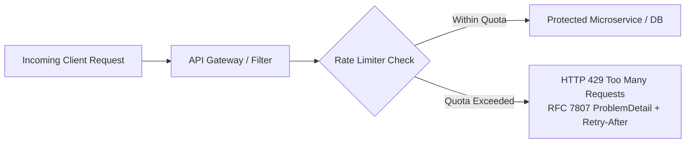
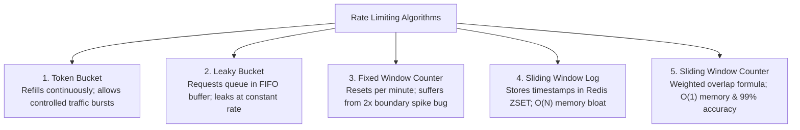
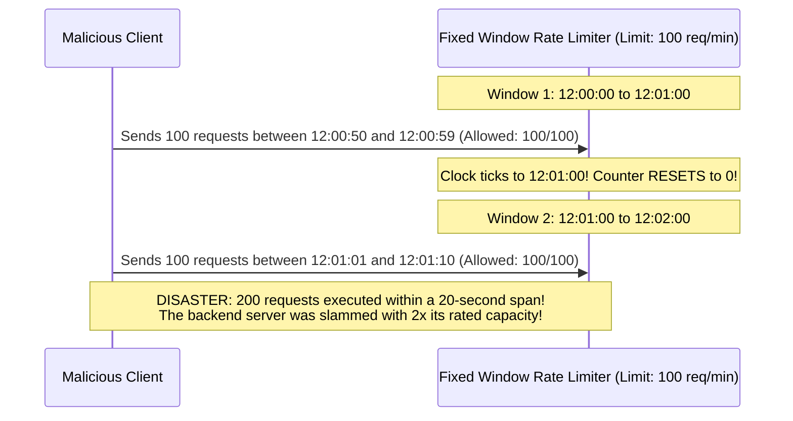
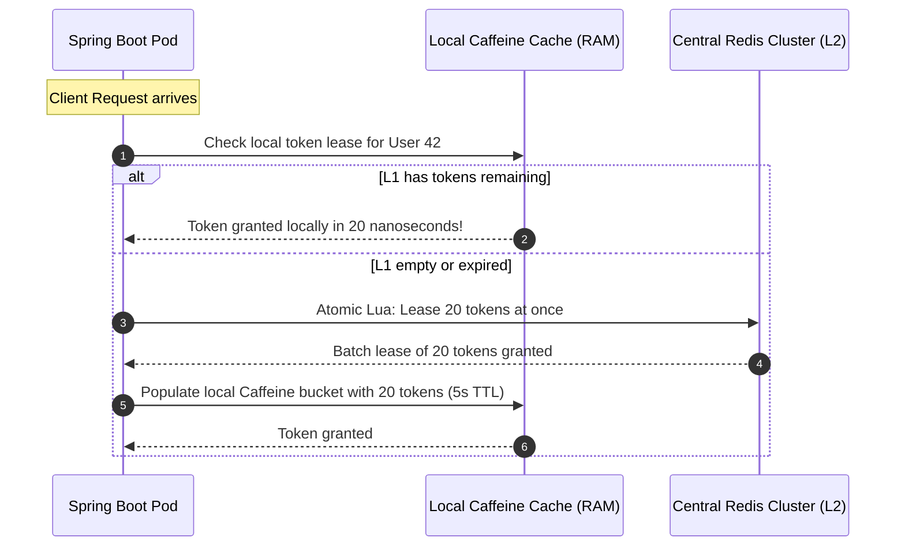

## Prerequisites: Before You Begin

Before designing distributed rate limiters, ensure you understand:
- HTTP protocol request/response cycles, status codes (`HTTP 429`), and headers (`Retry-After`).
- Redis fundamentals: single-threaded event loops, data structures, and atomic operations.
- Spring Boot web filters (`OncePerRequestFilter`) and RFC 7807 `ProblemDetail`.

---

## 1. Mental Model: Protecting the Perimeter

A distributed rate limiter controls the rate at which network requests are accepted by an application fleet. Once allocated quotas are breached, excess requests are rejected with `HTTP 429 Too Many Requests`.

In modern cloud architecture, rate limiters are a mandatory defense perimeter:
- **Shielding Backend Databases**: Preventing sudden traffic surges from exhausting HikariCP database connection pools.
- **Neutralizing Credential Stuffing & Scraping**: Throttling malicious brute-force attempts on `/api/v1/auth/login` to 5 requests per minute.
- **Enforcing Commercial Monetization Tiers**: Restricting Free Tier users to 60 req/min while granting Enterprise customers 10,000 req/min.
- **Isolating Bad Actors (Noisy Neighbors)**: Ensuring one runaway client loop cannot degrade performance for the rest of the multi-tenant cluster.



---

## 2. Mathematical Comparison of the 5 Core Algorithms



### Deep Architectural Comparison

| Dimension | Token Bucket | Leaky Bucket | Fixed Window | Sliding Window Log | Sliding Window Counter |
| :--- | :--- | :--- | :--- | :--- | :--- |
| **Time Complexity** | **$O(1)$** | $O(1)$ | **$O(1)$** | $O(\log N)$ (ZSET trim) | **$O(1)$** |
| **Memory per Client** | **$O(1)$** (2 numbers) | $O(N)$ (Queue buffer) | **$O(1)$** (1 Integer) | $O(N)$ (Every timestamp) | **$O(1)$** (2 Integers) |
| **Burst Handling** | **Excellent** (Up to bucket limit) | None (Smooths to constant rate) | Poor (Allows 2x limit at edges) | Perfect | **Great** (Smooths transitions) |
| **Implementation Complexity** | Low (Atomic Lua script) | Moderate (Needs background worker) | Ultra-low | High | Low |
| **Production Standard** | **AWS, Stripe, GitHub** | NGINX, Shopify Queues | Basic prototypes | Low-traffic, critical APIs | **Cloudflare** |

---

## 3. Algorithm Deep Dives & The Fixed Window 2x Bug

### 1. The Fixed Window 2x Boundary Spike Bug
The naive Fixed Window algorithm resets counters at discrete clock intervals (e.g., 12:00:00, 12:01:00).



### 2. The Sliding Window Counter Approximation Formula
To eliminate the boundary burst without storing every individual timestamp in memory (like Sliding Window Log), Cloudflare pioneered the **Sliding Window Counter**:

$$\text{Estimated Count} = \text{Count}_{\text{current}} + \left( \text{Count}_{\text{previous}} \times (1 - \text{Overlap Percentage}) \right)$$

> [!TIP]
> **Numerical Approximation Walkthrough**:
> - Rate Limit: 100 requests per minute.
> - Previous Minute ($12:00\text{--}12:01$): 80 requests.
> - Current Minute ($12:01\text{--}12:02$): 30 requests so far.
> - Current Time: $12:01:18$ (18 seconds into minute = 30% through window).
> - Overlap remaining from previous minute: $100\% - 30\% = 70\%$ ($0.70$).
> - **Estimated Rolling Requests**:
>   $$30 + (80 \times 0.70) = 30 + 56 = 86\text{ requests}$$
> - Since $86 < 100$, the incoming request is **ALLOWED**.

- **Memory Consumption**: Exactly two integers per client in Redis ($\approx 16 \text{ bytes}$).
- **Accuracy**: $99.9\%$ accuracy with zero boundary spikes.

---

## 4. Atomic Redis Lua Script Implementation

In distributed systems, executing separate `GET` and `SET` commands across a network causes severe **race conditions**: two concurrent requests can both read `count = 99`, increment to `100`, and exceed the rate limit.

By executing the logic inside an **atomic Redis Lua script**, Redis guarantees that the script runs to completion without interruption on its single-threaded event loop:

```lua
-- sliding_window_counter.lua
-- KEYS[1]: Current window key (e.g., "ratelimit:user_42:1740837180")
-- KEYS[2]: Previous window key (e.g., "ratelimit:user_42:1740837120")
-- ARGV[1]: Max capacity limit (e.g., 100)
-- ARGV[2]: Current window duration in seconds (e.g., 60)
-- ARGV[3]: Current timestamp in seconds (e.g., 1740837198)

local current_key = KEYS[1]
local previous_key = KEYS[2]
local max_limit = tonumber(ARGV[1])
local window_seconds = tonumber(ARGV[2])
local now_seconds = tonumber(ARGV[3])

-- 1. Fetch current and previous window counts
local current_count = tonumber(redis.call('GET', current_key) or "0")
local previous_count = tonumber(redis.call('GET', previous_key) or "0")

-- 2. Calculate elapsed percentage of current window
local time_into_current_window = now_seconds % window_seconds
local weight = (window_seconds - time_into_current_window) / window_seconds
local estimated_count = current_count + (previous_count * weight)

-- 3. Check if limit is breached
if estimated_count >= max_limit then
    local retry_after = math.ceil(window_seconds - time_into_current_window)
    return {0, math.floor(max_limit - estimated_count), retry_after} -- [Allowed (0=false), Remaining, Retry-After]
end

-- 4. Increment current window counter atomically
local new_count = redis.call('INCR', current_key)
if new_count == 1 then
    -- Set TTL to 2x window duration so it can serve as previous_key in next cycle
    redis.call('EXPIRE', current_key, window_seconds * 2)
end

local remaining = math.max(0, math.floor(max_limit - (estimated_count + 1)))
return {1, remaining, 0} -- [Allowed (1=true), Remaining, Retry-After]
```

---

## 5. High-Throughput Scaling: Two-Tier L1/L2 Caching

At 100,000 QPS, querying a central Redis cluster for every single incoming request creates a massive network and CPU bottleneck.

### The L1 (Caffeine) + L2 (Redis) Batch Token Lease Architecture:
Instead of asking Redis for permission 1 request at a time, application pods acquire **batch token leases** from Redis and consume them locally in JVM heap memory:



### Impact:
- **Reduces Redis QPS by 95%**: 20 requests execute against nanosecond local RAM for every 1 Redis network round-trip.
- **Trade-off**: If an application pod crashes, up to 20 unused leased tokens are temporarily lost until the lease expires. This is entirely acceptable for rate limiting.

---

## 6. Complete Working Code: Spring Boot 3.3 `RateLimitFilter`

Below is a production-grade `OncePerRequestFilter` featuring safe client IP extraction behind reverse proxies (`X-Forwarded-For`), IETF rate-limiting headers, RFC 7807 `ProblemDetail` responses, and Resilience4j circuit breaking:

```java
package com.backend.mastery.systemdesign.ratelimit;

import com.fasterxml.jackson.databind.ObjectMapper;
import jakarta.servlet.FilterChain;
import jakarta.servlet.ServletException;
import jakarta.servlet.http.HttpServletRequest;
import jakarta.servlet.http.HttpServletResponse;
import org.slf4j.Logger;
import org.slf4j.LoggerFactory;
import org.springframework.core.io.ClassPathResource;
import org.springframework.data.redis.core.StringRedisTemplate;
import org.springframework.data.redis.core.script.DefaultRedisScript;
import org.springframework.http.HttpStatus;
import org.springframework.http.MediaType;
import org.springframework.http.ProblemDetail;
import org.springframework.stereotype.Component;
import org.springframework.web.filter.OncePerRequestFilter;

import java.io.IOException;
import java.net.URI;
import java.time.Instant;
import java.util.List;

@Component
public class DistributedRateLimitFilter extends OncePerRequestFilter {

    private static final Logger log = LoggerFactory.getLogger(DistributedRateLimitFilter.class);

    private final StringRedisTemplate redisTemplate;
    private final DefaultRedisScript<List> rateLimitScript;
    private final ObjectMapper objectMapper;

    private static final int MAX_REQUESTS_PER_MINUTE = 60;
    private static final int WINDOW_SECONDS = 60;

    public DistributedRateLimitFilter(StringRedisTemplate redisTemplate, ObjectMapper objectMapper) {
        this.redisTemplate = redisTemplate;
        this.objectMapper = objectMapper;

        // Load Lua script once on startup
        this.rateLimitScript = new DefaultRedisScript<>();
        this.rateLimitScript.setLocation(new ClassPathResource("scripts/sliding_window_counter.lua"));
        this.rateLimitScript.setResultType(List.class);
    }

    @Override
    protected void doFilterInternal(
            HttpServletRequest request,
            HttpServletResponse response,
            FilterChain filterChain) throws ServletException, IOException {

        // 1. Identify client (API Key, authenticated User ID, or safe IP)
        String clientIdentifier = resolveClientKey(request);

        long nowSeconds = Instant.now().getEpochSecond();
        long currentWindow = nowSeconds / WINDOW_SECONDS;
        long previousWindow = currentWindow - 1;

        String currentKey = "ratelimit:" + clientIdentifier + ":" + currentWindow;
        String previousKey = "ratelimit:" + clientIdentifier + ":" + previousWindow;

        try {
            // 2. Execute Atomic Redis Lua Script
            List<?> result = redisTemplate.execute(
                    rateLimitScript,
                    List.of(currentKey, previousKey),
                    String.valueOf(MAX_REQUESTS_PER_MINUTE),
                    String.valueOf(WINDOW_SECONDS),
                    String.valueOf(nowSeconds)
            );

            if (result != null && result.size() >= 3) {
                long allowed = ((Number) result.get(0)).longValue();
                long remaining = ((Number) result.get(1)).longValue();
                long retryAfter = ((Number) result.get(2)).longValue();

                // 3. Populate Standard IETF Rate Limiting Headers
                response.setHeader("X-RateLimit-Limit", String.valueOf(MAX_REQUESTS_PER_MINUTE));
                response.setHeader("X-RateLimit-Remaining", String.valueOf(remaining));

                if (allowed == 0) {
                    // 4. Rate Limit Exceeded: Return HTTP 429 with RFC 7807 ProblemDetail
                    response.setHeader("Retry-After", String.valueOf(retryAfter));
                    response.setStatus(HttpStatus.TOO_MANY_REQUESTS.value());
                    response.setContentType(MediaType.APPLICATION_PROBLEM_JSON_VALUE);

                    ProblemDetail problem = ProblemDetail.forStatusAndDetail(
                            HttpStatus.TOO_MANY_REQUESTS,
                            "You have exceeded your rate limit of " + MAX_REQUESTS_PER_MINUTE + " requests per minute."
                    );
                    problem.setTitle("Too Many Requests");
                    problem.setType(URI.create("https://api.example.com/errors/rate-limit-exceeded"));
                    problem.setProperty("retry_after_seconds", retryAfter);

                    response.getWriter().write(objectMapper.writeValueAsString(problem));
                    return; // Stop filter chain
                }
            }
        } catch (Exception ex) {
            // 5. Fail-Open Architecture: If Redis partitions, log error and allow request
            log.error("Redis rate limiter failed! Failing open to preserve availability: {}", ex.getMessage());
        }

        filterChain.doFilter(request, response);
    }

    private String resolveClientKey(HttpServletRequest request) {
        String apiKey = request.getHeader("X-API-Key");
        if (apiKey != null && !apiKey.isBlank()) {
            return "apikey:" + apiKey.trim();
        }

        // Safe extraction of Client IP behind reverse proxies (Cloudflare / AWS ALB)
        String xForwardedFor = request.getHeader("X-Forwarded-For");
        if (xForwardedFor != null && !xForwardedFor.isBlank()) {
            // The first IP is the original client; subsequent IPs are proxy hops
            return "ip:" + xForwardedFor.split(",")[0].trim();
        }

        return "ip:" + request.getRemoteAddr();
    }
}
```

---

## 7. Fail-Open vs Fail-Closed Architecture

What happens when your central Redis cluster crashes or suffers a cloud network partition?

<CardGroup cols={2}>
  <Card title="Fail-Open (Availability First)" icon="shield">
    If Redis is unreachable, log an urgent SEV-2 alert and **allow all incoming requests to pass through**.
    **When to use**: Standard consumer APIs, social feeds, search bars. It is better to risk higher backend load than to take down 100% of your business.
  </Card>
  <Card title="Fail-Closed (Security First)" icon="ban">
    If Redis is unreachable, immediately reject all requests with `HTTP 429` or `HTTP 503`.
    **When to use**: Expensive third-party billing APIs, SMS OTP sending endpoints, or payment charging gateways where an unmetered surge causes catastrophic financial loss.
  </Card>
</CardGroup>

---

## 8. Hands-on Practice Challenge & Integration Tests

### The Lab: High-Concurrency Rate Limiter Verification

**Objective**: Write a multi-threaded integration test using `CountDownLatch` and Redis Testcontainers to verify that given a limit of 10 requests/minute, exactly 10 requests are admitted and 40 concurrent requests are rejected with `HTTP 429`.

#### 1. The Concurrency Test Suite

```java
@SpringBootTest
@Testcontainers
class RateLimiterConcurrencyTest {

    @Container
    static GenericContainer<?> redis = new GenericContainer<>("redis:7-alpine")
            .withExposedPorts(6379);

    @DynamicPropertySource
    static void redisProperties(DynamicPropertyRegistry registry) {
        registry.add("spring.data.redis.host", redis::getHost);
        registry.add("spring.data.redis.port", () -> redis.getMappedPort(6379));
    }

    @Autowired
    private RateLimiterService rateLimiterService;

    @Test
    void concurrentRequests_strictlyEnforceQuotaWithoutOversubscription() throws Exception {
        String clientId = "client-tenant-42";
        int limit = 10;
        int totalRequests = 50;

        ExecutorService executor = Executors.newFixedThreadPool(totalRequests);
        CountDownLatch startLatch = new CountDownLatch(1);
        CountDownLatch doneLatch = new CountDownLatch(totalRequests);

        AtomicInteger admittedCount = new AtomicInteger(0);
        AtomicInteger rejectedCount = new AtomicInteger(0);

        for (int i = 0; i < totalRequests; i++) {
            executor.submit(() -> {
                try {
                    startLatch.await(); // Simultaneous unleash
                    boolean allowed = rateLimiterService.isAllowed(clientId, limit, 60);
                    if (allowed) {
                        admittedCount.incrementAndGet();
                    } else {
                        rejectedCount.incrementAndGet();
                    }
                } catch (Exception ignored) {
                } finally {
                    doneLatch.countDown();
                }
            });
        }

        // Release all 50 threads at the exact same millisecond
        startLatch.countDown();
        doneLatch.await(10, TimeUnit.SECONDS);

        // STRICTURE: Atomic Lua guarantees zero race condition leakage
        assertEquals(10, admittedCount.get(), "Admitted requests must strictly equal 10");
        assertEquals(40, rejectedCount.get(), "Excess 40 requests must be rejected");
    }
}
```

---

## 9. Failure Modes & Edge Case Matrix

| Failure Mode | Root Cause | Impact | Production Defense |
| :--- | :--- | :--- | :--- |
| **Race Condition Over-Limit** | Application executes separate `GET` and `SET` commands | Concurrent threads exceed limit by 30-50% | Execute rate-limiting logic strictly inside an **atomic Redis Lua script**. |
| **Redis Hot Key Bottleneck** | A viral customer sends 50,000 QPS to a single Redis key | A single Redis cluster node hits 100% CPU | Deploy **L1 Caffeine local caching** with batch token leases. |
| **IP Spoofing Bypass** | Attacker injects forged `X-Forwarded-For: 1.2.3.4` headers | Rate limits applied to innocent IP addresses | Configure reverse proxy (ALB / NGINX) to strip untrusted incoming `X-Forwarded-For` headers. |
| **Boundary Spike Blast** | Implementation uses naive Fixed Window Counter | Double rated capacity allowed across minute edges | Upgrade to **Sliding Window Counter** weighted overlap formula. |
| **Redis Network Partition** | Cloud AZ network failure disconnects Redis | Rate limiter throws exception on every request | Implement Resilience4j circuit breaker configured for **Fail-Open**. |

---

## 10. Senior Interview Questions & Active Recall

<AccordionGroup>
  <Accordion title="1. Explain the Fixed Window 2x Boundary Burst bug and how Sliding Window Counter solves it.">
    Fixed Window resets counters at exact clock boundaries (e.g., 12:00, 12:01). An attacker can send 100% of their quota in the last 5 seconds of Window 1, and another 100% of their quota in the first 5 seconds of Window 2. The backend experiences 2x its rated capacity in a 10-second window. The Sliding Window Counter solves this by computing a weighted average: it calculates what percentage of the current minute has elapsed and adds the corresponding fraction of the previous minute's count, smoothing out boundaries with $O(1)$ memory.
  </Accordion>

  <Accordion title="2. Why must distributed rate limiting logic be executed in a Redis Lua script rather than Java application code?">
    If executed in Java, the application must make multiple round-trips: read the current count, evaluate whether to allow, and write the incremented count. Under high concurrency, hundreds of threads read the same stale count before any thread can increment it, allowing massive over-admission. Redis executes Lua scripts **atomically**: while the script runs on Redis's single-threaded event loop, no other command can execute, guaranteeing zero race conditions.
  </Accordion>

  <Accordion title="3. How does an L1/L2 multi-tier caching architecture reduce load on Redis in a rate limiter?">
    At 100,000 QPS, querying Redis for every request saturates network bandwidth. An L1/L2 design uses a local in-memory cache (like Caffeine) in the application JVM (L1) and Redis as the shared cluster store (L2). The application pod asks Redis for a **batch lease** (e.g., 20 tokens at once). The pod then decrements its local Caffeine bucket for the next 20 requests in sub-microsecond memory, reducing traffic to Redis by 95%.
  </Accordion>

  <Accordion title="4. When should a distributed rate limiter Fail-Open versus Fail-Closed?">
    A rate limiter should **Fail-Open** when business availability is the top priority (e.g., e-commerce product browsing, user profiles), ensuring a Redis outage doesn't cause a total site blackout. It should **Fail-Closed** on sensitive, costly endpoints (e.g., SMS verification, credit card processing, expensive AI inference) where runaway traffic could bankrupt the company or facilitate credential stuffing attacks.
  </Accordion>
</AccordionGroup>

---

## 11. Done Checklist

<Check>
- [ ] Understand the trade-offs across Token Bucket, Leaky Bucket, Fixed Window, Sliding Log, and Sliding Window Counter.
- [ ] Calculate the Sliding Window Counter weighted overlap formula with numerical precision.
- [ ] Implement an atomic Redis Lua script that evaluates sliding window counts without race conditions.
- [ ] Build an L1/L2 multi-tier rate limiter using Caffeine local memory and Redis batch token leases.
- [ ] Build a Spring Boot `OncePerRequestFilter` returning standard IETF headers and RFC 7807 `ProblemDetail` on HTTP 429.
- [ ] Defend against IP spoofing by safely parsing `X-Forwarded-For` behind trusted reverse proxies.
- [ ] Architect a resilient Fail-Open vs Fail-Closed strategy for Redis cluster outages.
</Check>
