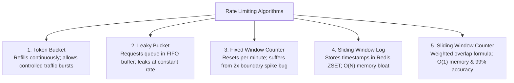
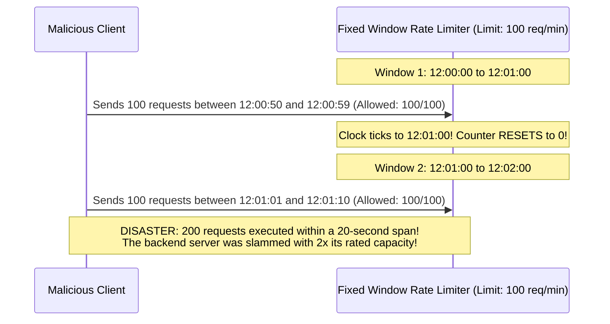
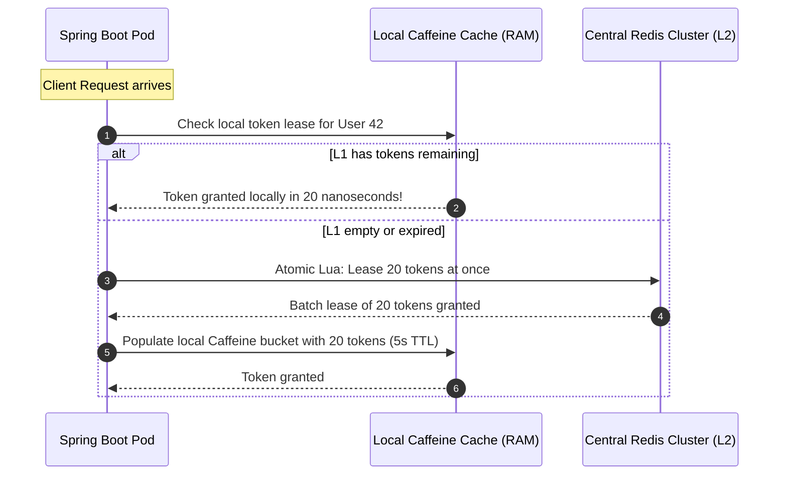
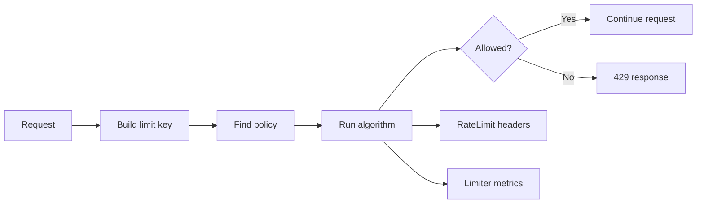

# Design a Distributed Rate Limiter (Token Bucket & Redis Lua)

A distributed rate limiter controls the rate at which network requests are admitted into an application fleet. Once allocated quotas are breached, excess requests are rejected with `HTTP 429 Too Many Requests`.

In modern cloud architecture, rate limiters are a mandatory defense perimeter:
- **Shielding Backend Databases**: Preventing traffic surges from exhausting HikariCP database connection pools.
- **Neutralizing Credential Stuffing & Scraping**: Throttling brute-force login attempts on `/api/v1/auth/login` to 5 requests per minute per IP.
- **Enforcing Commercial Monetization Tiers**: Restricting Free Tier users to 60 req/min while granting Enterprise customers 10,000 req/min.
- **Isolating Noisy Neighbors**: Ensuring a runaway script in Tenant A does not degrade performance for Tenant B on shared infrastructure.

---

## Phase 1: Ground Floor (Physical First Principles)

To design a distributed rate limiter, we must first understand what happens at the physical hardware layer when a server is inundated with requests.

### 1.1 What Happens When Hardware Is Flooded?
When millions of packets slam into a server's physical Network Interface Card (NIC):
1. **NIC Ring Buffer**: The NIC receives Ethernet frames and places them into an unmanaged circular buffer in physical RAM (the RX ring buffer).
2. **Interrupt Storm (softirqd)**: When the ring buffer fills, the NIC raises a hardware interrupt (`IRQ`). The Linux kernel dispatches software interrupts (`ksoftirqd`) to pull packets into kernel memory (`sk_buff`).
3. **Queue Drop & RST**: If the incoming packet rate exceeds the CPU's ability to process interrupts, the RX ring buffer overflows. The NIC physically drops packets (`rx_dropped`), forcing clients to trigger TCP exponential backoff retransmissions, creating a positive feedback loop of traffic congestion.
4. **TCP Listen Backlog Overflow**: For surviving packets, the OS places new TCP connections into the socket accept backlog (`net.core.somaxconn`). If web worker threads cannot accept connections fast enough, the OS drops `SYN` packets or sends TCP `RST` (connection reset).

```mermaid
flowchart TD
    subgraph Hardware["1. Physical Hardware & Kernel"]
        NIC["Physical NIC (10Gbps Ethernet)"] -->|RX Ring Buffer Overflow| Drop["Hardware Packet Drops (rx_dropped)"]
        NIC -->|DMA Copy| Kernel["Linux Kernel (ksoftirqd)"]
        Kernel -->|Backlog Queue: somaxconn| SockQueue["TCP Socket Listen Queue"]
    end

    subgraph ApplicationBoundary["2. Application Gateway Boundary"]
        SockQueue --> Tomcat["Tomcat Worker Thread"]
        Tomcat --> Limiter{"Distributed Rate Limiter (Redis)"}
        Limiter -->|Admitted| Controller["Spring @RestController & DB Pool"]
        Limiter -->|Exceeded (HTTP 429)| EarlyExit["Drop with RFC 7807 (Zero DB / Heap Allocation)"]
    end
```

### 1.2 Why Network Firewalls Cannot Replace Application Rate Limiters
A common beginner question is: *"Why not let AWS CloudFront, Cloudflare, or an iptables network firewall handle all rate limiting?"*

Network firewalls operate at **Layer 3 (IP)** and **Layer 4 (TCP/UDP)**:
- They see an IP address and a port number.
- They **cannot** inspect encrypted TLS payloads to determine *who* the caller is.
- In modern enterprise architectures, thousands of different corporate employees or mobile devices sit behind the exact same Network Address Translation (NAT) gateway IP. If you block that IP at Layer 3, you ban thousands of innocent users!
- Layer 4 firewalls have zero concept of **API endpoints or business cost**: an innocuous `GET /health` request costs 0.01ms of CPU, whereas a `POST /reports/analytics/generate` query costs 4 seconds of database CPU and 50MB of RAM.

**Application-Level Rate Limiting (Layer 7)** is required because only the application understands:
- The authenticated User ID (`userId = 49201`) or API Key (`Bearer sk_live_...`).
- The customer's commercial billing tier (Free vs Pro vs Enterprise).
- The computational cost of the specific endpoint being invoked.

---

## Phase 2: The Naive Code (The Production Crash)

Let's inspect what happens when a developer attempts to implement an in-memory rate limiter using standard Java collections.

### The Naive In-Memory Implementation
```java
@Component
public class NaiveRateLimiterFilter extends OncePerRequestFilter {

    // DEADLY: In-memory state shared across Tomcat threads
    private final Map<String, AtomicInteger> requestCounts = new ConcurrentHashMap<>();

    @Override
    protected void doFilterInternal(HttpServletRequest request, HttpServletResponse response, FilterChain filterChain)
            throws ServletException, IOException {
        
        String clientIp = request.getRemoteAddr();
        AtomicInteger counter = requestCounts.computeIfAbsent(clientIp, k -> new AtomicInteger(0));

        // CRASH SCENARIO 1: Unbounded memory leak
        // CRASH SCENARIO 2: Boundary burst bug
        if (counter.incrementAndGet() > 100) {
            response.setStatus(429);
            response.getWriter().write("Too Many Requests");
            return;
        }

        filterChain.doFilter(request, response);
    }
}
```

### Production Crash 1: Horizontal Scaling Destroys the Quota (The 10x Leak)
- **What happens**: The company's traffic increases, and Kubernetes Horizontal Pod Autoscaler (HPA) scales the backend fleet from 1 pod to **10 pods**.
- **The Disaster**:
  - Each pod has its own isolated `ConcurrentHashMap` in its private JVM heap.
  - An attacker sends 1,000 requests per minute distributed across the round-robin load balancer.
  - Each of the 10 pods receives 100 requests.
  - Every single pod evaluates `counter.get() <= 100` and admits all 100 requests.
  - **The Result**: The attacker successfully executes **1,000 requests per minute** against a 100 req/min limit! The database connection pool is overwhelmed and crashes.
  - **The Principle**: *In-memory rate limiters are fundamentally broken in any horizontally scaled distributed cloud environment.*

### Production Crash 2: Heap OutOfMemoryError via Key Explosion
- **The Code**: `requestCounts.computeIfAbsent(clientIp, ...)`
- **The Crash**:
  - An attacker launches a distributed scraping bot rotating through 5,000,000 residential proxy IP addresses.
  - The `ConcurrentHashMap` creates 5,000,000 `String` keys and `AtomicInteger` objects.
  - Because there is no eviction policy or Time-To-Live (TTL), the map permanently retains all 5 million entries.
  - JVM heap memory consumption swells past `-Xmx2g`.
  - Garbage collector CPU utilization jumps to 100% trying to compact the heap.
  - The pod crashes with `java.lang.OutOfMemoryError: Java heap space`.

### Production Crash 3: The Check-Then-Act Race Condition in Redis
A developer realizes the in-memory flaw and moves the counter to Redis:

```java
// DEADLY DISTRIBUTED RACE CONDITION
public boolean isAllowed(String userId) {
    String key = "rate:" + userId;
    Integer current = (Integer) redisTemplate.opsForValue().get(key); // Step 1: GET
    
    if (current != null && current >= 100) {
        return false;
    }
    
    redisTemplate.opsForValue().increment(key); // Step 2: INCR
    return true;
}
```

- **The Disaster**:
  - Suppose `current = 99` (limit is 100).
  - 50 concurrent requests hit 10 different pods at the exact same millisecond.
  - All 50 pods execute Step 1: `redisTemplate.opsForValue().get(key)`. Every single pod receives `99`.
  - Every single pod evaluates `99 < 100` and returns `true` (Allowed).
  - All 50 pods execute Step 2: `increment(key)`.
  - The counter shoots from 99 to 149! **49 illegal requests slipped past the rate limiter.**
  - **The Principle**: *Distributed rate limiting operations MUST be strictly atomic. Separate GET and SET/INCR commands are fatal.*

---

## Phase 3: Under the Hood (Mechanics, Lua & Algorithms)

To achieve true distributed, horizontally scalable rate limiting with sub-millisecond overhead, we must compare mathematical algorithms and execute logic atomically inside Redis.

---

## 2. Mathematical Comparison of the 5 Core Algorithms



### Deep Architectural Comparison

| Dimension | Token Bucket | Leaky Bucket | Fixed Window | Sliding Window Log | Sliding Window Counter |
| :--- | :--- | :--- | :--- | :--- | :--- |
| **Time Complexity** | **$O(1)$** | $O(1)$ | **$O(1)$** | $O(\log N)$ (ZSET trim) | **$O(1)$** |
| **Memory per Client** | **$O(1)$** (2 numbers) | $O(N)$ (Queue buffer) | **$O(1)$** (1 Integer) | $O(N)$ (Every timestamp) | **$O(1)$** (2 Integers) |
| **Burst Handling** | **Excellent** (Up to bucket limit) | None (Smooths to constant rate) | Poor (Allows 2x limit at edges) | Perfect | **Great** (Smooths transitions) |
| **Implementation Complexity** | Low (Atomic Lua script) | Moderate (Needs background worker) | Ultra-low | High | Low |
| **Production Standard** | **AWS, Stripe, GitHub** | NGINX, Shopify Queues | Basic prototypes | Low-traffic, critical APIs | **Cloudflare** |

---

## 3. Algorithm Deep Dives & The Fixed Window 2x Bug

### 1. The Fixed Window 2x Boundary Spike Bug
The naive Fixed Window algorithm resets counters at discrete clock intervals (e.g., 12:00:00, 12:01:00).



### 2. The Sliding Window Counter Approximation Formula
To eliminate the boundary burst without storing every individual timestamp in memory (like Sliding Window Log), Cloudflare pioneered the **Sliding Window Counter**:

$$\text{Estimated Count} = \text{Count}_{\text{current}} + \left( \text{Count}_{\text{previous}} \times (1 - \text{Overlap Percentage}) \right)$$

> [!TIP]
> **Numerical Approximation Walkthrough**:
> - Rate Limit: 100 requests per minute.
> - Previous Minute ($12:00\text{--}12:01$): 80 requests.
> - Current Minute ($12:01\text{--}12:02$): 30 requests so far.
> - Current Time: $12:01:18$ (18 seconds into minute = 30% through window).
> - Overlap remaining from previous minute: $100\% - 30\% = 70\%$ ($0.70$).
> - **Estimated Rolling Requests**:
>   $$30 + (80 \times 0.70) = 30 + 56 = 86\text{ requests}$$
> - Since $86 < 100$, the incoming request is **ALLOWED**.

- **Memory Consumption**: Exactly two integers per client in Redis ($\approx 16 \text{ bytes}$).
- **Accuracy**: $99.9\%$ accuracy with zero boundary spikes.

---

## 4. Atomic Redis Lua Script Implementation

In distributed systems, executing separate `GET` and `SET` commands across a network causes severe **race conditions**: two concurrent requests can both read `count = 99`, increment to `100`, and exceed the rate limit.

By executing the logic inside an **atomic Redis Lua script**, Redis guarantees that the script runs to completion without interruption on its single-threaded event loop:

```lua
-- sliding_window_counter.lua
-- KEYS[1]: Current window key (e.g., "ratelimit:user_42:1740837180")
-- KEYS[2]: Previous window key (e.g., "ratelimit:user_42:1740837120")
-- ARGV[1]: Max capacity limit (e.g., 100)
-- ARGV[2]: Current window duration in seconds (e.g., 60)
-- ARGV[3]: Current timestamp in seconds (e.g., 1740837198)

local current_key = KEYS[1]
local previous_key = KEYS[2]
local max_limit = tonumber(ARGV[1])
local window_seconds = tonumber(ARGV[2])
local now_seconds = tonumber(ARGV[3])

-- 1. Fetch current and previous window counts
local current_count = tonumber(redis.call('GET', current_key) or "0")
local previous_count = tonumber(redis.call('GET', previous_key) or "0")

-- 2. Calculate elapsed percentage of current window
local time_into_current_window = now_seconds % window_seconds
local weight = (window_seconds - time_into_current_window) / window_seconds
local estimated_count = current_count + (previous_count * weight)

-- 3. Check if limit is breached
if estimated_count >= max_limit then
    local retry_after = math.ceil(window_seconds - time_into_current_window)
    return {0, math.floor(max_limit - estimated_count), retry_after} -- [Allowed (0=false), Remaining, Retry-After]
end

-- 4. Increment current window counter atomically
local new_count = redis.call('INCR', current_key)
if new_count == 1 then
    -- Set TTL to 2x window duration so it can serve as previous_key in next cycle
    redis.call('EXPIRE', current_key, window_seconds * 2)
end

local remaining = math.max(0, math.floor(max_limit - (estimated_count + 1)))
return {1, remaining, 0} -- [Allowed (1=true), Remaining, Retry-After]
```

Line-by-line Lua reading:

- `KEYS[1]` and `KEYS[2]` separate current and previous windows. Keeping two windows lets the limiter smooth the fixed-window boundary spike.
- `tonumber(ARGV[1])` converts Redis strings into numbers. Lua arithmetic on strings is a bug waiting to happen.
- `current_count` and `previous_count` are read inside the same script, so no other request can change them halfway through the decision.
- `time_into_current_window = now_seconds % window_seconds` tells how far the current window has progressed.
- `weight = (window_seconds - time_into_current_window) / window_seconds` fades out the previous window as time moves forward.
- `estimated_count = current_count + (previous_count * weight)` is the sliding-window approximation.
- `if estimated_count >= max_limit then` rejects before incrementing. The script returns `retry_after` so the API can set a useful `Retry-After` header.
- `INCR current_key` records the accepted request atomically.
- `EXPIRE current_key, window_seconds * 2` keeps the key long enough to serve as the previous window, then removes it to control memory.

Proof drill: run 1,000 concurrent requests against a 100-request limit. The accepted count must be 100, not 101 or 130. If the result varies, the limiter is not atomic.

---

## 5. High-Throughput Scaling: Two-Tier L1/L2 Caching

At 100,000 QPS, querying a central Redis cluster for every single incoming request creates a massive network and CPU bottleneck.

### The L1 (Caffeine) + L2 (Redis) Batch Token Lease Architecture:
Instead of asking Redis for permission 1 request at a time, application pods acquire **batch token leases** from Redis and consume them locally in JVM heap memory:



### Impact:
- **Reduces Redis QPS by 95%**: 20 requests execute against nanosecond local RAM for every 1 Redis network round-trip.
- **Trade-off**: If an application pod crashes, up to 20 unused leased tokens are temporarily lost until the lease expires. This is entirely acceptable for rate limiting.

---

## 6. Complete Working Code: Spring Boot 3.3 `RateLimitFilter`

Below is a production-grade `OncePerRequestFilter` featuring safe client IP extraction behind reverse proxies (`X-Forwarded-For`), IETF rate-limiting headers, RFC 7807 `ProblemDetail` responses, and Resilience4j circuit breaking:

```java
package com.backend.mastery.systemdesign.ratelimit;

import com.fasterxml.jackson.databind.ObjectMapper;
import jakarta.servlet.FilterChain;
import jakarta.servlet.ServletException;
import jakarta.servlet.http.HttpServletRequest;
import jakarta.servlet.http.HttpServletResponse;
import org.slf4j.Logger;
import org.slf4j.LoggerFactory;
import org.springframework.core.io.ClassPathResource;
import org.springframework.data.redis.core.StringRedisTemplate;
import org.springframework.data.redis.core.script.DefaultRedisScript;
import org.springframework.http.HttpStatus;
import org.springframework.http.MediaType;
import org.springframework.http.ProblemDetail;
import org.springframework.stereotype.Component;
import org.springframework.web.filter.OncePerRequestFilter;

import java.io.IOException;
import java.net.URI;
import java.time.Instant;
import java.util.List;

@Component
public class DistributedRateLimitFilter extends OncePerRequestFilter {

    private static final Logger log = LoggerFactory.getLogger(DistributedRateLimitFilter.class);

    private final StringRedisTemplate redisTemplate;
    private final DefaultRedisScript<List> rateLimitScript;
    private final ObjectMapper objectMapper;

    private static final int MAX_REQUESTS_PER_MINUTE = 60;
    private static final int WINDOW_SECONDS = 60;

    public DistributedRateLimitFilter(StringRedisTemplate redisTemplate, ObjectMapper objectMapper) {
        this.redisTemplate = redisTemplate;
        this.objectMapper = objectMapper;

        // Load Lua script once on startup
        this.rateLimitScript = new DefaultRedisScript<>();
        this.rateLimitScript.setLocation(new ClassPathResource("scripts/sliding_window_counter.lua"));
        this.rateLimitScript.setResultType(List.class);
    }

    @Override
    protected void doFilterInternal(
            HttpServletRequest request,
            HttpServletResponse response,
            FilterChain filterChain) throws ServletException, IOException {

        // 1. Identify client (API Key, authenticated User ID, or safe IP)
        String clientIdentifier = resolveClientKey(request);

        long nowSeconds = Instant.now().getEpochSecond();
        long currentWindow = nowSeconds / WINDOW_SECONDS;
        long previousWindow = currentWindow - 1;

        String currentKey = "ratelimit:" + clientIdentifier + ":" + currentWindow;
        String previousKey = "ratelimit:" + clientIdentifier + ":" + previousWindow;

        try {
            // 2. Execute Atomic Redis Lua Script
            List<?> result = redisTemplate.execute(
                    rateLimitScript,
                    List.of(currentKey, previousKey),
                    String.valueOf(MAX_REQUESTS_PER_MINUTE),
                    String.valueOf(WINDOW_SECONDS),
                    String.valueOf(nowSeconds)
            );

            if (result != null && result.size() >= 3) {
                long allowed = ((Number) result.get(0)).longValue();
                long remaining = ((Number) result.get(1)).longValue();
                long retryAfter = ((Number) result.get(2)).longValue();

                // 3. Populate Standard IETF Rate Limiting Headers
                response.setHeader("X-RateLimit-Limit", String.valueOf(MAX_REQUESTS_PER_MINUTE));
                response.setHeader("X-RateLimit-Remaining", String.valueOf(remaining));

                if (allowed == 0) {
                    // 4. Rate Limit Exceeded: Return HTTP 429 with RFC 7807 ProblemDetail
                    response.setHeader("Retry-After", String.valueOf(retryAfter));
                    response.setStatus(HttpStatus.TOO_MANY_REQUESTS.value());
                    response.setContentType(MediaType.APPLICATION_PROBLEM_JSON_VALUE);

                    ProblemDetail problem = ProblemDetail.forStatusAndDetail(
                            HttpStatus.TOO_MANY_REQUESTS,
                            "You have exceeded your rate limit of " + MAX_REQUESTS_PER_MINUTE + " requests per minute."
                    );
                    problem.setTitle("Too Many Requests");
                    problem.setType(URI.create("https://api.example.com/errors/rate-limit-exceeded"));
                    problem.setProperty("retry_after_seconds", retryAfter);

                    response.getWriter().write(objectMapper.writeValueAsString(problem));
                    return; // Stop filter chain
                }
            }
        } catch (Exception ex) {
            // 5. Fail-Open Architecture: If Redis partitions, log error and allow request
            log.error("Redis rate limiter failed! Failing open to preserve availability: {}", ex.getMessage());
        }

        filterChain.doFilter(request, response);
    }

    private String resolveClientKey(HttpServletRequest request) {
        String apiKey = request.getHeader("X-API-Key");
        if (apiKey != null && !apiKey.isBlank()) {
            return "apikey:" + apiKey.trim();
        }

        // Safe extraction of Client IP behind reverse proxies (Cloudflare / AWS ALB)
        String xForwardedFor = request.getHeader("X-Forwarded-For");
        if (xForwardedFor != null && !xForwardedFor.isBlank()) {
            // The first IP is the original client; subsequent IPs are proxy hops
            return "ip:" + xForwardedFor.split(",")[0].trim();
        }

        return "ip:" + request.getRemoteAddr();
    }
}
```

---

## 7. Fail-Open vs Fail-Closed Architecture

What happens when your central Redis cluster crashes or suffers a cloud network partition?

<CardGroup cols={2}>
  <Card title="Fail-Open (Availability First)" icon="shield">
    If Redis is unreachable, log an urgent SEV-2 alert and **allow all incoming requests to pass through**.
    **When to use**: Standard consumer APIs, social feeds, search bars. It is better to risk higher backend load than to take down 100% of your business.
  </Card>
  <Card title="Fail-Closed (Security First)" icon="ban">
    If Redis is unreachable, immediately reject all requests with `HTTP 429` or `HTTP 503`.
    **When to use**: Expensive third-party billing APIs, SMS OTP sending endpoints, or payment charging gateways where an unmetered surge causes catastrophic financial loss.
  </Card>
</CardGroup>

---

## 8. Hands-on Practice Challenge & Integration Tests

### The Lab: High-Concurrency Rate Limiter Verification

**Objective**: Write a multi-threaded integration test using `CountDownLatch` and Redis Testcontainers to verify that given a limit of 10 requests/minute, exactly 10 requests are admitted and 40 concurrent requests are rejected with `HTTP 429`.

#### 1. The Concurrency Test Suite

```java
@SpringBootTest
@Testcontainers
class RateLimiterConcurrencyTest {

    @Container
    static GenericContainer<?> redis = new GenericContainer<>("redis:7-alpine")
            .withExposedPorts(6379);

    @DynamicPropertySource
    static void redisProperties(DynamicPropertyRegistry registry) {
        registry.add("spring.data.redis.host", redis::getHost);
        registry.add("spring.data.redis.port", () -> redis.getMappedPort(6379));
    }

    @Autowired
    private RateLimiterService rateLimiterService;

    @Test
    void concurrentRequests_strictlyEnforceQuotaWithoutOversubscription() throws Exception {
        String clientId = "client-tenant-42";
        int limit = 10;
        int totalRequests = 50;

        ExecutorService executor = Executors.newFixedThreadPool(totalRequests);
        CountDownLatch startLatch = new CountDownLatch(1);
        CountDownLatch doneLatch = new CountDownLatch(totalRequests);

        AtomicInteger admittedCount = new AtomicInteger(0);
        AtomicInteger rejectedCount = new AtomicInteger(0);

        for (int i = 0; i < totalRequests; i++) {
            executor.submit(() -> {
                try {
                    startLatch.await(); // Simultaneous unleash
                    boolean allowed = rateLimiterService.isAllowed(clientId, limit, 60);
                    if (allowed) {
                        admittedCount.incrementAndGet();
                    } else {
                        rejectedCount.incrementAndGet();
                    }
                } catch (Exception ignored) {
                } finally {
                    doneLatch.countDown();
                }
            });
        }

        // Release all 50 threads at the exact same millisecond
        startLatch.countDown();
        doneLatch.await(10, TimeUnit.SECONDS);

        // STRICTURE: Atomic Lua guarantees zero race condition leakage
        assertEquals(10, admittedCount.get(), "Admitted requests must strictly equal 10");
        assertEquals(40, rejectedCount.get(), "Excess 40 requests must be rejected");
    }
}
```

---

## 9. Failure Modes & Edge Case Matrix

| Failure Mode | Root Cause | Impact | Production Defense |
| :--- | :--- | :--- | :--- |
| **Race Condition Over-Limit** | Application executes separate `GET` and `SET` commands | Concurrent threads exceed limit by 30-50% | Execute rate-limiting logic strictly inside an **atomic Redis Lua script**. |
| **Redis Hot Key Bottleneck** | A viral customer sends 50,000 QPS to a single Redis key | A single Redis cluster node hits 100% CPU | Deploy **L1 Caffeine local caching** with batch token leases. |
| **IP Spoofing Bypass** | Attacker injects forged `X-Forwarded-For: 1.2.3.4` headers | Rate limits applied to innocent IP addresses | Configure reverse proxy (ALB / NGINX) to strip untrusted incoming `X-Forwarded-For` headers. |
| **Boundary Spike Blast** | Implementation uses naive Fixed Window Counter | Double rated capacity allowed across minute edges | Upgrade to **Sliding Window Counter** weighted overlap formula. |
| **Redis Network Partition** | Cloud AZ network failure disconnects Redis | Rate limiter throws exception on every request | Implement Resilience4j circuit breaker configured for **Fail-Open**. |

---

## Phase 4: Senior Interview Ace (Junior vs Staff Phrasing)

When interviewers ask you to design a distributed rate limiter, they are looking for production edge cases: race conditions under high concurrency, Redis hot keys, network partitions, and Fail-Open vs Fail-Closed trade-offs.

| Dimension | Junior Developer Answer | Senior / Staff Engineer Answer |
| :--- | :--- | :--- |
| **In-Memory vs Distributed** | *"I would store request counts in a `ConcurrentHashMap` inside the Spring Boot filter using the client IP as key."* | *"In-memory rate limiters fail catastrophically in cloud environments. First, when Kubernetes autoscales from 1 to 10 pods, the client's effective quota multiplies tenfold (allowing 1,000 req/min instead of 100). Second, bot attacks rotating residential IPs will fill the JVM heap with millions of keys, triggering an OOMKill. A production rate limiter must externalize state to a centralized low-latency data store like Redis, identifying clients by authenticated API key or verified User ID, with Layer 3 IP rate limiting reserved strictly for unauthenticated endpoints."* |
| **Algorithm Selection** | *"I use Fixed Window because it is simple: store a key with a 60-second TTL and increment it."* | *"Fixed Window suffers from the 2x boundary burst bug: a client sending 100% of their quota in the last 5 seconds of minute 1 and 100% in the first 5 seconds of minute 2 slams the backend with 200% rated capacity in 10 seconds. For APIs permitting controlled traffic bursts (e.g. Stripe, AWS), I implement Token Bucket, which decouples consumption from steady background refilling. For smooth rolling enforcement with strictly bounded memory, I use Cloudflare's Sliding Window Counter approximation formula, which provides 99.9% accuracy using only two integers in Redis ($O(1)$ memory)."* |
| **Concurrency & Race Conditions** | *"I read the value from Redis in Java. If it's less than 100, I increment it."* | *"Check-then-act across network hops is a fatal race condition. If 50 concurrent requests arrive when the count is 99, all 50 threads read 99 and pass through, allowing 149 requests. Using Redis `MULTI/EXEC` transactions is inefficient because read values cannot be evaluated inside the transaction block. I execute the entire check-decrement-refill lifecycle inside a single atomic Redis Lua script. Because Redis executes Lua scripts as a single atomic unit on its event loop, no interleaving commands can occur, guaranteeing zero race condition leaks."* |
| **Scaling & Failure Modes** | *"If Redis goes down, the application should return an error to prevent server overload."* | *"At 100,000 QPS, querying Redis on every request saturates cluster network bandwidth. I implement an L1/L2 multi-tier architecture: the application pod requests a batch lease of 20 tokens from Redis (L2) and decrements them in local JVM Caffeine cache (L1), reducing Redis load by 95%. If Redis suffers a network partition, the rate limiter uses a Resilience4j circuit breaker with an explicit strategy: Fail-Open for revenue-generating read traffic (e-commerce browsing) to preserve business availability, and Fail-Closed for expensive/irreversible mutations (credit card payments, SMS verification) to prevent fraud."* |

---

## Rate Limiter Fundamentals Drill

A rate limiter is not just a counter. It is a policy engine that decides who is allowed to consume a shared resource, at what speed, under which identity, and what happens when the limiter storage is slow or unavailable.



### The 7 Questions Behind A Strong Design

| Question | Why it matters |
| --- | --- |
| What identity is limited? | IP, user, API key, tenant, route, or device all behave differently. |
| What resource is protected? | Login, payments, search, and public APIs need different policies. |
| Which algorithm is used? | Fixed window, sliding window, token bucket, and leaky bucket have different burst behavior. |
| Is the limiter local or distributed? | Multiple pods need shared state or coordinated local budgets. |
| What is the failure policy? | Fail-open preserves availability; fail-closed protects expensive systems. |
| How does the client recover? | `Retry-After` and rate limit headers make the API usable. |
| How is abuse detected? | Metrics and logs must expose hot keys and rejected traffic. |

### Algorithm Choice In Plain English

| Algorithm | Behavior | Best for | Weakness |
| --- | --- | --- | --- |
| Fixed window | Count requests per time bucket. | simple low-risk limits | boundary burst can double traffic |
| Sliding log | Store each request timestamp. | exact small-volume limits | memory heavy |
| Sliding window counter | Weighted count across current and previous window. | practical API limits | approximate |
| Token bucket | Tokens refill over time; bursts spend saved tokens. | public APIs and user actions | needs atomic refill logic |
| Leaky bucket | Queue drains at steady rate. | smoothing downstream load | adds queueing delay |

### Example: Login Protection

A login limiter should not only limit by IP:

```markdown
login:ip:{ip}
login:account:{emailNormalized}
login:device:{deviceFingerprint}
login:tenant:{tenantId}
```

Why? Attackers can rotate IPs. Legitimate offices can share one IP. Account-level limits protect the target account. IP-level limits protect infrastructure. Tenant-level limits prevent one customer from consuming the shared pool.

### Redis Lua Or Database Row?

Use Redis Lua when:

```markdown
The limit is high-QPS, short-window, and approximate enough to store in memory.
```

Use database constraints when:

```markdown
The operation is correctness-critical, low-volume, and must survive Redis loss.
```

Example: public search API rate limits can live in Redis. A "one coupon redemption per user" invariant belongs in the database.

### Build-Break-Fix Drill

Build:

```markdown
Add a token bucket limit for POST /login and GET /search.
Return 429 with Retry-After and RateLimit-Remaining headers.
```

Break:

```markdown
Run 4 application pods with local-only counters.
Send a burst exactly across a fixed-window boundary.
Make Redis timeout for 3 seconds.
```

Fix:

```markdown
Move counters to Redis Lua.
Use token bucket for burst tolerance.
Choose fail-closed for login and fail-open for low-risk reads.
Emit metrics for allowed, rejected, and Redis-error decisions.
```

## 10. Senior Interview Questions & Active Recall

<AccordionGroup>
  <Accordion title="1. Explain the Fixed Window 2x Boundary Burst bug and how Sliding Window Counter solves it.">
    Fixed Window resets counters at exact clock boundaries (e.g., 12:00, 12:01). An attacker can send 100% of their quota in the last 5 seconds of Window 1, and another 100% of their quota in the first 5 seconds of Window 2. The backend experiences 2x its rated capacity in a 10-second window. The Sliding Window Counter solves this by computing a weighted average: it calculates what percentage of the current minute has elapsed and adds the corresponding fraction of the previous minute's count, smoothing out boundaries with $O(1)$ memory.
  </Accordion>

  <Accordion title="2. Why must distributed rate limiting logic be executed in a Redis Lua script rather than Java application code?">
    If executed in Java, the application must make multiple round-trips: read the current count, evaluate whether to allow, and write the incremented count. Under high concurrency, hundreds of threads read the same stale count before any thread can increment it, allowing massive over-admission. Redis executes Lua scripts **atomically**: while the script runs on Redis's single-threaded event loop, no other command can execute, guaranteeing zero race conditions.
  </Accordion>

  <Accordion title="3. How does an L1/L2 multi-tier caching architecture reduce load on Redis in a rate limiter?">
    At 100,000 QPS, querying Redis for every request saturates network bandwidth. An L1/L2 design uses a local in-memory cache (like Caffeine) in the application JVM (L1) and Redis as the shared cluster store (L2). The application pod asks Redis for a **batch lease** (e.g., 20 tokens at once). The pod then decrements its local Caffeine bucket for the next 20 requests in sub-microsecond memory, reducing traffic to Redis by 95%.
  </Accordion>

  <Accordion title="4. When should a distributed rate limiter Fail-Open versus Fail-Closed?">
    A rate limiter should **Fail-Open** when business availability is the top priority (e.g., e-commerce product browsing, user profiles), ensuring a Redis outage doesn't cause a total site blackout. It should **Fail-Closed** on sensitive, costly endpoints (e.g., SMS verification, credit card processing, expensive AI inference) where runaway traffic could bankrupt the company or facilitate credential stuffing attacks.
  </Accordion>
</AccordionGroup>

---

## 11. Done Checklist

<Check>
- [ ] Understand the trade-offs across Token Bucket, Leaky Bucket, Fixed Window, Sliding Log, and Sliding Window Counter.
- [ ] Calculate the Sliding Window Counter weighted overlap formula with numerical precision.
- [ ] Implement an atomic Redis Lua script that evaluates sliding window counts without race conditions.
- [ ] Build an L1/L2 multi-tier rate limiter using Caffeine local memory and Redis batch token leases.
- [ ] Build a Spring Boot `OncePerRequestFilter` returning standard IETF headers and RFC 7807 `ProblemDetail` on HTTP 429.
- [ ] Defend against IP spoofing by safely parsing `X-Forwarded-For` behind trusted reverse proxies.
- [ ] Architect a resilient Fail-Open vs Fail-Closed strategy for Redis cluster outages.
</Check>
