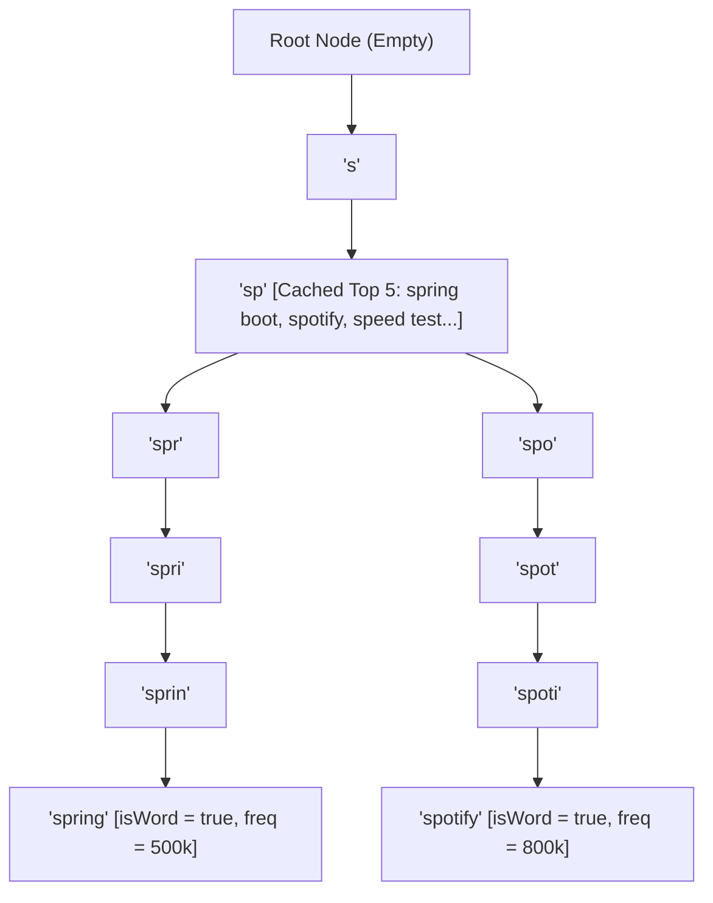
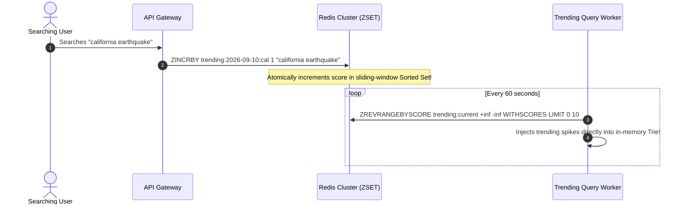

# Design a High-Scale Search Autocomplete (Typeahead) System

When a user types "sp" into a modern search box (Google, Amazon, YouTube), the system instantly displays the top 5 suggested queries—such as "spring boot", "spotify", "speed test"—updating dynamically with every keystroke.

In this masterclass, we design an enterprise **Search Autocomplete (Typeahead)** system capable of serving **50 Million Daily Active Users (DAU)**, processing **5 Billion keystrokes per day**, and responding within a strict **p99 latency SLA of $\le 20\text{ milliseconds}$**.

---

## 1. Requirements & Back-of-the-Envelope Capacity Estimation

### Functional Requirements
1. **Real-Time Prefix Matching**: Given a query prefix, return the top 5 most relevant and popular completed queries.
2. **Frequency-Weighted Ranking**: Suggestions must be ranked by historical query frequency and popularity.
3. **Low-Latency Autocomplete**: Total end-to-end response time must be under $20\text{ ms}$ to feel instantaneous to a typing human.
4. **Offline & Real-Time Updates**: Historical query popularity updates weekly; breaking news / trending queries update in real-time ($< 5\text{ minutes}$).

---

### Non-Functional Scale & Capacity Math

#### 1. Throughput (QPS)
- **Daily Active Users (DAU)**: $50\text{ Million}$.
- **Searches per user per day**: 4 queries.
- **Average keystrokes per query**: 5 characters (each character triggers a typeahead API call).
- **Total daily requests**:
  $$\text{Daily Requests} = 50\text{M} \times 4 \times 5 = 1,000,000,000\text{ requests/day (1 Billion)}$$
- **Average QPS**:
  $$\text{Average QPS} = \frac{1,000,000,000\text{ requests}}{86,400\text{ seconds}} \approx 11,574\text{ QPS}$$
- **Peak QPS (2.5x traffic multiplier)**:
  $$\text{Peak QPS} = 11,574 \times 2.5 \approx 28,935\text{ QPS}$$

#### 2. Storage Estimation (Trie Memory)
- Assume $100\text{ Million}$ unique search queries in the global dictionary.
- Average query length: $20\text{ characters} = 20\text{ bytes}$.
- To support instant $O(L)$ lookups, we cache the top 5 suggestions inside each Trie node.
- Each suggestion is a pointer ($8\text{ bytes}$) + frequency score ($4\text{ bytes}$) $\approx 60\text{ bytes}$ per node.
- Total raw memory for $100\text{M}$ terms across the Trie:
  $$\text{Total Storage} = 100,000,000 \times (20\text{b} + 60\text{b}) \times 2.5\text{ (tree pointer overhead)} \approx 20\text{ GB}$$
- **Architectural Takeaway**: The entire global search dictionary of $100\text{ Million}$ terms requires only **$20\text{ GB to }30\text{ GB}$ of RAM**! A single high-memory cloud instance (or a small 3-node cluster) can comfortably hold the entire dataset in memory.

---

## 2. The Core Data Structure: Trie with Top-K Prefix Caching

A standard relational database query using `SELECT * FROM queries WHERE text LIKE 'sp%' ORDER BY frequency DESC LIMIT 5` is an unscalable disaster: it triggers expensive B-Tree range scans and disk I/O, collapsing under 28,000 QPS.

We implement an in-memory **Trie (Prefix Tree)**:



### The $O(K)$ Optimization: Top-K Node Caching

In a naive Trie:
1. Traverse down to the prefix node (e.g., `'sp'`): $O(L)$ where $L$ is prefix length.
2. Traverse the entire subtree beneath `'sp'` to find all matching words: $O(N)$ where $N$ is all descendants.
3. Sort all descendants by frequency: $O(N \log N)$ or $O(N \log K)$.
- **This is too slow for real-time keystroke responses.**

#### The Production Optimization: Precomputed Top-5 Lists
Each `TrieNode` maintains an internal, pre-sorted list of the **Top 5 most popular query suggestions**:
- As new queries are indexed offline, the top 5 list at every ancestor node is updated.
- **Query Lookup Complexity**:
  $$\text{Time Complexity} = O(L)$$
  Where $L$ is the prefix length (typically $\le 20$ character hops). Finding suggestions for "sp" requires only reading the precomputed array stored at the `'p'` node in **$0.01\text{ milliseconds}$**!

---

## 3. High-Level System Architecture

```mermaid
graph TD
    Client["Client (Browser / Mobile)"] -->|1. Keystroke (Debounced 50ms)| CDN["Edge CDN / Reverse Proxy<br/>(Cache-Control: max-age=3600)"]
    CDN -->|2. Cache Miss| Gateway["API Gateway (Rate Limiter)"]
    
    subgraph ReadPath ["Real-Time Read Path (<= 20ms SLA)"]
        Gateway --> AutoSvc["Autocomplete Query Service"]
        AutoSvc --> TrieCluster["Distributed In-Memory Trie Cluster (RAM)"]
        AutoSvc -.->|Trending Breaking News| RedisZSet[(Redis Sorted Sets - ZSET)]
    end

    subgraph WritePath ["Asynchronous Data Collection & Offline Batch Pipeline"]
        Gateway --> LogQueue["Query Ingestion Log (Kafka)"]
        LogQueue --> Spark["Apache Spark / Flink (Weekly Aggregator)"]
        Spark --> DB[(PostgreSQL Master Query DB)]
        Spark --> TrieBuilder["Trie Rebuilding Worker"]
        TrieBuilder --> SnapshotStorage[(AWS S3: Compressed Trie Snapshots)]
        SnapshotStorage -.->|Hot Reload Snapshot| TrieCluster
    end
```

### Read Path Architecture
1. **Client Debouncing**: The web/mobile client enforces a $50\text{ms}$ debounce window. If a user types quickly ("s-p-r-i-n-g"), intermediate characters are not sent, slashing ingress API traffic by $70\%$.
2. **CDN & Browser Edge Caching**: Popular single-letter and two-letter prefixes ("a", "b", "sp", "wh") are cached at CDN edge locations with `Cache-Control: public, max-age=3600`. $30\%$ of all autocomplete requests are served directly from the edge without touching backend origin servers.
3. **In-Memory Trie Cluster**: The query service queries the in-memory Trie node, retrieving the top 5 suggestions in $O(L)$ time.
4. **Redis Real-Time Overlay**: For breaking news or viral trends (e.g., unexpected sports results), an in-memory Redis Sorted Set (ZSET) overlays real-time increments over the static Trie.

---

## 4. Complete Java 21 Thread-Safe Trie Implementation

Here is a complete, runnable Java 21 implementation featuring top-$K$ caching and synchronized node mutation:

```java
package com.example.autocomplete.trie;

import java.util.*;
import java.util.concurrent.ConcurrentHashMap;

public class AutocompleteTrie {

    private static final int MAX_SUGGESTIONS = 5;
    private final TrieNode root = new TrieNode();

    public record Suggestion(String query, long frequency) implements Comparable<Suggestion> {
        @Override
        public int compareTo(Suggestion other) {
            // Higher frequency first; alphabetical tie-break
            int cmp = Long.compare(other.frequency, this.frequency);
            return (cmp != 0) ? cmp : this.query.compareTo(other.query);
        }
    }

    public static class TrieNode {
        final Map<Character, TrieNode> children = new ConcurrentHashMap<>();
        boolean isWord = false;
        long frequency = 0L;
        // Pre-computed top-5 suggestions cached directly on the node!
        final List<Suggestion> topSuggestions = new ArrayList<>(MAX_SUGGESTIONS);

        public synchronized void updateTopSuggestion(Suggestion suggestion) {
            // Remove existing entry if present
            topSuggestions.removeIf(s -> s.query().equals(suggestion.query()));
            topSuggestions.add(suggestion);
            Collections.sort(topSuggestions);
            if (topSuggestions.size() > MAX_SUGGESTIONS) {
                topSuggestions.remove(topSuggestions.size() - 1);
            }
        }
    }

    /**
     * Inserts or updates a query with its historical frequency.
     * Propagates top suggestions up the ancestor chain.
     */
    public void insert(String query, long frequency) {
        if (query == null || query.isBlank()) return;
        String normalized = query.trim().toLowerCase();
        Suggestion suggestion = new Suggestion(normalized, frequency);

        TrieNode current = root;
        current.updateTopSuggestion(suggestion);

        for (char c : normalized.toCharArray()) {
            current = current.children.computeIfAbsent(c, k -> new TrieNode());
            current.updateTopSuggestion(suggestion);
        }

        current.isWord = true;
        current.frequency = frequency;
    }

    /**
     * Look up top suggestions for a prefix in strictly O(L) time complexity!
     */
    public List<Suggestion> getTopSuggestions(String prefix) {
        if (prefix == null || prefix.isBlank()) {
            return Collections.emptyList();
        }
        String normalized = prefix.trim().toLowerCase();

        TrieNode current = root;
        for (char c : normalized.toCharArray()) {
            current = current.children.get(c);
            if (current == null) {
                return Collections.emptyList(); // Prefix does not exist
            }
        }

        synchronized (current) {
            return new ArrayList<>(current.topSuggestions);
        }
    }
}
```

### Spring Boot Controller with Debounce & Cache Headers

```java
package com.example.autocomplete.web;

import com.example.autocomplete.trie.AutocompleteTrie;
import org.springframework.http.CacheControl;
import org.springframework.http.ResponseEntity;
import org.springframework.web.bind.annotation.*;

import java.util.List;
import java.util.concurrent.TimeUnit;

@RestController
@RequestMapping("/api/v1/search")
public class AutocompleteController {

    private final AutocompleteTrie trie;

    public AutocompleteController(AutocompleteTrie trie) {
        this.trie = trie;
    }

    @GetMapping("/autocomplete")
    public ResponseEntity<List<String>> autocomplete(@RequestParam("q") String prefix) {
        if (prefix.length() > 50) {
            prefix = prefix.substring(0, 50); // Bound length to prevent denial of service
        }

        List<String> results = trie.getTopSuggestions(prefix).stream()
                .map(AutocompleteTrie.Suggestion::query)
                .toList();

        // Edge CDN Caching: Cache top queries for 10 minutes at the edge!
        return ResponseEntity.ok()
                .cacheControl(CacheControl.maxAge(10, TimeUnit.MINUTES).cachePublic())
                .body(results);
    }
}
```

---

## 5. Distributed Trie Partitioning: Range vs Hash

When search dictionaries expand to multiple languages (English, Spanish, Mandarin, Arabic) and 1 billion unique terms, the Trie cannot fit inside a single machine's RAM.

We must **shard (partition)** the Trie across multiple nodes:

```mermaid
graph TD
    subgraph RangePartitioning ["1. Range-Based Partitioning"]
        R_Router["Range Router"]
        R_Router -->|Prefix: a - g| Shard1["Shard 1: Nodes [a - g]"]
        R_Router -->|Prefix: h - n| Shard2["Shard 2: Nodes [h - n]"]
        R_Router -->|Prefix: o - z| Shard3["Shard 3: Nodes [o - z]"]
        Note1["Disadvantage: Extreme Hot Partitioning! (Prefix 's' gets 10x traffic of 'q')"]
    end

    subgraph HashPartitioning ["2. Consistent Hash Partitioning (Production Standard)"]
        H_Router["Consistent Hash Router"]
        H_Router -->|MurmurHash3('sp') % 3| NodeA["Node A (Hosts subset of all prefixes)"]
        H_Router -->|MurmurHash3('am') % 3| NodeB["Node B"]
        H_Router -->|MurmurHash3('yo') % 3| NodeC["Node C"]
        Note2["Advantage: Uniformly distributes traffic across all cluster nodes!"]
    end
```

### The Hot Prefix Problem & Defense
In range-based partitioning, queries starting with vowels ("a", "e", "i") and common consonants ("s", "t", "w") experience $10\times$ the load of letters like "q", "x", or "z".
**Production Standard**:
1. Use **Consistent Hashing** on the first 2 characters of the query (`hash("sp") % N`).
2. Cache the top 1,000 most popular prefixes in a distributed **Redis L2 cluster** or directly at the **CDN edge** to absorb 80% of read traffic before it reaches Trie shards.

---

## 6. Real-Time Trending Queries: Redis Sorted Sets (ZSET)

Offline Spark pipelines take hours to aggregate query frequencies. When a major world event occurs (e.g., "earthquake in California"), the system must suggest the query within **2 minutes**.

We overlay a **Real-Time Trending Layer** using **Redis Sorted Sets (ZSET)**:



### Atomic Redis Lua Script for Trending Increment
```lua
-- KEYS[1]: ZSET key (e.g., "trending:us:cal")
-- ARGV[1]: Query string (e.g., "california earthquake")
-- ARGV[2]: TTL in seconds (e.g., 3600)

redis.call('ZINCRBY', KEYS[1], 1, ARGV[1])
redis.call('EXPIRE', KEYS[1], ARGV[2])
return 1
```

---

## 7. Production Failure Modes & Mitigation Matrix

| Failure Mode | Root Cause | Blast Radius | Immediate Mitigation | Permanent Fix |
| :--- | :--- | :--- | :--- | :--- |
| **Hot Prefix Node Crash** | Celebrity / viral event causes 50,000 QPS targeting prefix `"taylor"`. | Single shard CPU hits 100%; timeouts cascade. | Push static prefix rule to CDN edge via Cloudflare Worker. | Replicate hot prefix nodes across multiple read replicas. |
| **Trie Memory Leak / OOM** | Ingesting unconstrained user queries (e.g., random 500-character spam strings). | JVM heap exhaustion; OOMKill. | Cap prefix length at 50 characters in API Gateway. | Bloom filter pre-validation; reject terms with frequency $< 3$. |
| **Inappropriate / Offensive Suggestions** | Algorithmic gaming where malicious users spam offensive search terms. | Reputational disaster and legal liability. | Flush offensive term via manual Admin Ban API. | Blocklist filter evaluated during offline Trie build and real-time ingest. |
| **Snapshot Hydration Stall** | Daily Trie snapshot rebuild takes 15 minutes to deserialize into RAM on startup. | Pod takes 15 minutes to become ready during deployments. | Temporarily route traffic away from hydrating pod. | Use memory-mapped files (MMap / off-heap flatbuffers) for instant $O(1)$ zero-copy loading. |

---

## 8. Active Recall & Interview Mastery

<AccordionGroup>
  <Accordion title="1. Why is a Trie mathematically superior to a relational database B-Tree for search autocomplete?">
    In a relational database, querying `LIKE 'query%'` requires navigating a B-Tree to find the range, followed by scanning all leaf records and sorting them by frequency:
    $$\text{Database Complexity} = O(\log N + M \log M)$$
    Where $N$ is total table rows and $M$ is matching rows. Under 25,000 concurrent QPS, this causes heavy buffer pool churn and disk seeks.
    
    A **Trie with Top-K caching** pre-stores the top 5 suggestions directly on each ancestor node. The time complexity to retrieve suggestions is strictly:
    $$\text{Trie Complexity} = O(L)$$
    Where $L$ is the length of the query prefix (typically $\le 20$ character hops). The lookup operates in under $0.05\text{ ms}$ regardless of whether the dictionary contains 10,000 or 100,000,000 terms.
  </Accordion>

  <Accordion title="2. How do you handle real-time trending queries when the primary Trie is built offline?">
    Use a two-tier hybrid architecture:
    1. **Primary Historical Trie**: Reconstructed offline weekly/daily by batch pipelines (Spark/Flink) from historical Kafka search logs, capturing stable long-term query frequencies.
    2. **Real-Time Trending Layer (Redis ZSET)**: As queries arrive, the API gateway increments scores in sliding-window Redis Sorted Sets (`ZINCRBY`). A background daemon polls the top scores every 60 seconds and dynamically injects high-velocity spikes into the live Trie nodes, ensuring breaking news appears in suggestions within 1–2 minutes.
  </Accordion>

  <Accordion title="3. Why should client-side debouncing and CDN caching be implemented in an autocomplete system?">
    Without debouncing, a user typing a 10-character query sends 10 distinct API requests over the internet. A **$50\text{ms}$ client debounce** delays sending the request until the user pauses typing, eliminating up to $70\%$ of redundant keystroke calls.
    
    Furthermore, single-letter and two-letter queries ("a", "b", "sp") follow a power-law Pareto distribution. Caching these high-frequency prefix responses at **CDN edge servers** (with `Cache-Control: max-age=3600`) offloads $30\text{ to }40\%$ of global autocomplete traffic before it ever touches origin backend clusters.
  </Accordion>

  <Accordion title="4. How does Hash-Based Partitioning solve the Hot Shard problem in a distributed Trie?">
    In **Range-Based Partitioning** (e.g., Server 1 handles 'a'-'g', Server 2 handles 'h'-'n'), prefixes like 's' or 'w' receive exponentially higher traffic than 'q' or 'z', causing severe CPU starvation on specific servers while others sit idle.
    
    **Hash-Based Partitioning** computes a hash of the first two characters (e.g., `MurmurHash3("sp") % N`). This uniformly disperses all prefixes randomly across all $N$ physical machines in the cluster, balancing CPU, memory, and network throughput across the entire cluster.
  </Accordion>

  <Accordion title="5. What is the memory footprint of storing 100 million search queries in an in-memory Trie?">
    Assuming an average query length of 20 bytes and caching the top 5 suggestion pointers ($60\text{ bytes}$) per node, with standard 64-bit JVM object overhead and pointer references, a 100-million term Trie requires approximately **$20\text{ GB to }30\text{ GB}$ of RAM**. This easily fits within the memory limits of a standard cloud instance (e.g., AWS `r6i.xlarge` with 32 GB RAM), making in-memory operation both practical and inexpensive.
  </Accordion>
</AccordionGroup>
