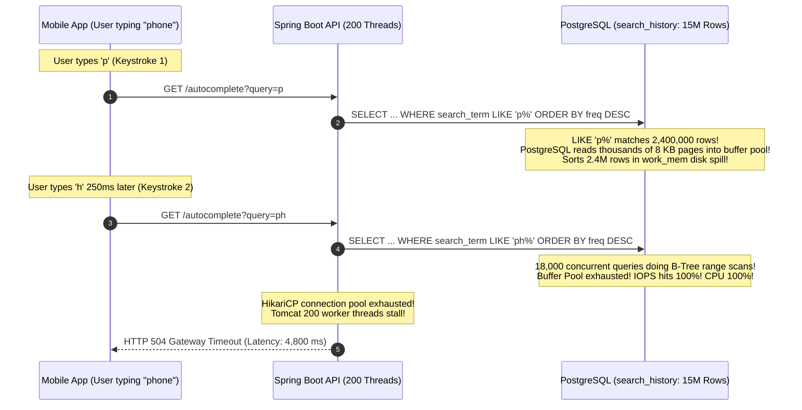
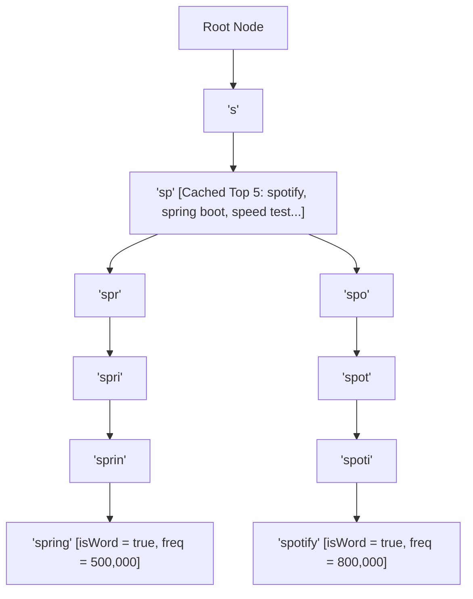
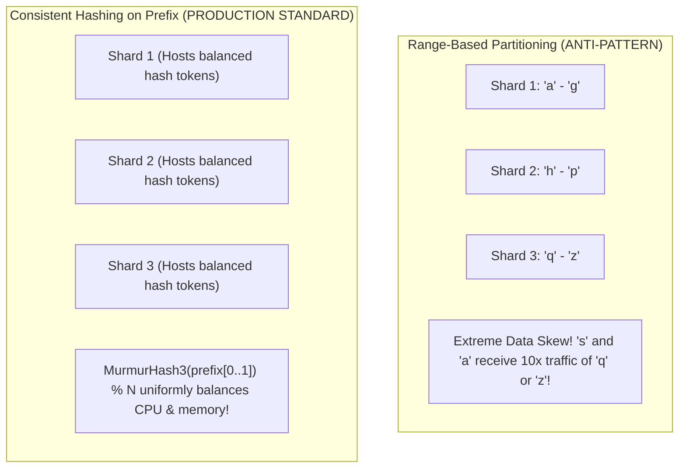
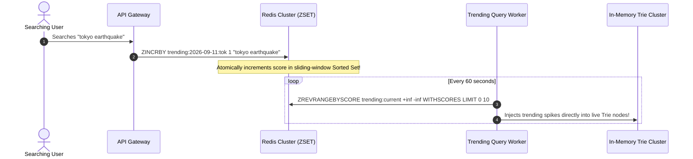
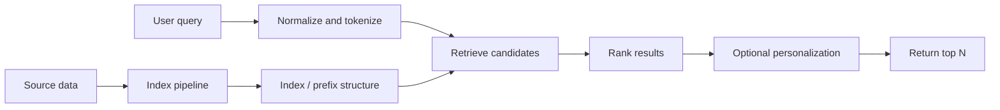

# Design a High-Scale Search Autocomplete (Typeahead) System

When a user types "sp" into a modern search box (Google, Amazon, YouTube), the system instantly displays the top 5 suggested queries—such as "spring boot", "spotify", "speed test"—updating dynamically with every single keystroke.

Designing an enterprise **Search Autocomplete (Typeahead)** system capable of serving **50 Million Daily Active Users (DAU)**, processing **5 Billion keystrokes per day**, and responding within a strict **p99 latency SLA of $\le 20\text{ milliseconds}$** requires understanding the boundary between human physiology, in-memory data structures, and distributed caching.

---

## Phase 1: Ground Floor (Physical First Principles & Human Physiology)

To architect a typeahead service, you must start with the physical ergonomics of human interaction and the network latency budget.

```mermaid
graph LR
    subgraph HumanPhysiology ["Human Typing Timeline"]
        KEY1["Keystroke 1: 's'"] -->|200 - 300 ms<br/>(Average Human Typing Interval)| KEY2["Keystroke 2: 'p'"]
    end

    subgraph LatencyBudget ["200 ms Network & Processing Budget"]
        LTE["Mobile 4G/5G Radio Round-Trip: 60 - 80 ms"]
        CDN["CDN Edge & TLS Termination: 20 ms"]
        BACKEND["Server Budget: <= 10 - 20 ms!"]
    end
```

### 1. The Human Interaction Latency Budget
- **Human Typing Speed**: An average human types at 40 to 60 words per minute (WPM), translating to **200 to 300 milliseconds between keystrokes**.
- **Perception of Instantaneity**: According to Card, Moran, and Newell's human-computer interaction (HCI) research, an interactive UI response must arrive in **under 100 milliseconds** to feel instantaneous.
- **The Hardware & Network Breakdown**:
  - Client-side mobile radio RTT (4G/5G): 50 to 80 ms.
  - TLS termination and edge routing: 15 to 20 ms.
  - Client rendering: 10 ms.
  - **Remaining Server Latency Budget**: **$\le 10\text{ to }20\text{ milliseconds}$**.

If a backend server takes 150ms to compute autocomplete suggestions, the response arrives *after* the user has already pressed the next key, causing the suggestions to flicker, lag, and frustrate the user.

### 2. Memory Bus Lookups vs Disk Page Fetches
- Fetching from DDR5 RAM: **80 to 100 nanoseconds**.
- NVMe SSD random read: **100 microseconds (100,000 ns)**—1,000x slower.
- Mechanical disk seek: **10 milliseconds (10,000,000 ns)**—100,000x slower.

To guarantee sub-10ms response times at 30,000 QPS, **all autocomplete lookups must execute 100% in RAM**. Disk I/O cannot be permitted on the read path.

---

## Phase 2: The Naive Code (The Production Crash)

A retail e-commerce company added search autocomplete to their web and mobile applications. The team implemented the endpoint using a SQL `LIKE 'prefix%'` query against their primary PostgreSQL database.

During a Black Friday promotional event, traffic surged to 18,000 keystrokes/sec. Within 90 seconds, the database collapsed, CPU pegged at 100%, and the mobile app froze.

### The Naive Implementation

```java
@RestController
@RequestMapping("/api/v1/search")
public class NaiveAutocompleteController {

    private final JdbcTemplate jdbcTemplate;

    public NaiveAutocompleteController(JdbcTemplate jdbcTemplate) {
        this.jdbcTemplate = jdbcTemplate;
    }

    // NAIVE DISASTER: Executes an expensive B-Tree range scan on every keystroke!
    @GetMapping("/autocomplete")
    public List<String> autocomplete(@RequestParam("query") String query) {
        // Querying a 15,000,000 row search_history table
        String sql = """
            SELECT search_term 
            FROM search_history 
            WHERE search_term LIKE ? 
            ORDER BY frequency DESC 
            LIMIT 5
            """;
        return jdbcTemplate.queryForList(sql, String.class, query.toLowerCase() + "%");
    }
}
```

### Why the System Collapsed



1. **B-Tree Range Scan and Disk Spill**:
   A single character prefix like `'p%'` matched **2,400,000 rows** in the database. PostgreSQL had to read millions of index entries, fetch corresponding heap pages, sort the rows by `frequency DESC` using temporary disk files, and take the top 5. Under 18,000 QPS, disk I/O saturated immediately.
2. **Missing Client Debounce**:
   The mobile client fired an HTTP request on every single character. A user typing `"smartphone"` triggered 10 rapid API requests in 2 seconds, amplifying backend load by 10x.
3. **The Unbounded Memory Leak Trap**:
   In an attempt to fix the database issue, an engineer wrote an in-memory Trie that ingested all queries on the fly without length bounds. A malicious bot flooded the endpoint with 2,000-character random string queries, causing JVM heap exhaustion and an immediate `OutOfMemoryError: Java heap space`.

---

## Phase 3: Under the Hood (Mechanics, Mathematical Framework & System Blueprints)

To deliver suggestions in under 10ms across 5 billion daily requests, we combine an in-memory **Trie with Top-K Node Caching**, **Client-Side Debouncing**, and an **Offline Batch Aggregation Pipeline**:

```mermaid
graph TD
    Client["Client (Browser / Mobile)"] -->|1. Debounced Keystroke (50ms)| CDN["Edge CDN / Cloudflare<br/>(Cache-Control: max-age=3600)"]
    CDN -->|2. Edge Cache Miss| Gateway["API Gateway (Rate Limiting)"]
    
    subgraph ReadPath ["Real-Time Read Path (<= 15ms SLA)"]
        Gateway --> AutoSvc["Autocomplete Query Service"]
        AutoSvc --> TrieCluster["Distributed In-Memory Trie Cluster (RAM)"]
        AutoSvc -.->|Trending Breaking News| RedisZSet[(Redis Sorted Sets - ZSET)]
    end

    subgraph WritePath ["Asynchronous Ingestion & Batch Rebuild Pipeline"]
        Gateway --> LogQueue["Query Ingestion Log (Kafka)"]
        LogQueue --> Spark["Apache Spark / Flink (Weekly Aggregator)"]
        Spark --> DB[(Master Term Database)]
        Spark --> TrieBuilder["Trie Rebuilding Engine"]
        TrieBuilder --> S3[(AWS S3: Serialized Trie Snapshots)]
        S3 -.->|Zero-Downtime Hot Reload| TrieCluster
    end
```

---

### 1. The Core Data Structure: Trie with Top-K Prefix Caching

In a naive Trie:
1. Traverse down the prefix path (e.g., `'s'` $\rightarrow$ `'p'`): $O(L)$ where $L$ is the prefix length.
2. Traverse the entire subtree under `'sp'` to discover all matching words: $O(N)$ where $N$ is all descendants.
3. Sort all descendants by popularity frequency: $O(N \log N)$ or $O(N \log K)$.
- **This naive traversal is far too slow for real-time keystroke responses.**

#### The $O(L)$ Production Optimization: Precomputed Top-5 Lists
Each `TrieNode` maintains an internal, pre-sorted list of the **Top 5 most popular query suggestions**:



- When querying `"sp"`, the engine traverses 2 character hops (`'s'` $\rightarrow$ `'p'`), and immediately reads the precomputed array stored at that node in **$0.01\text{ milliseconds}$**!
- **Time Complexity**: **$O(L)$**, completely independent of the total number of words in the dictionary ($N$).

---

### 2. Complete Java 21 Thread-Safe Trie Implementation

Below is a production-grade Java 21 implementation featuring top-5 precomputed caching and bounded string validation:

```java
package com.backend.mastery.systemdesign.autocomplete;

import java.util.*;
import java.util.concurrent.ConcurrentHashMap;

public class AutocompleteTrie {

    private static final int MAX_SUGGESTIONS = 5;
    private final TrieNode root = new TrieNode();

    public record Suggestion(String query, long frequency) implements Comparable<Suggestion> {
        @Override
        public int compareTo(Suggestion other) {
            // Highest frequency first; alphabetical tie-break
            int cmp = Long.compare(other.frequency, this.frequency);
            return (cmp != 0) ? cmp : this.query.compareTo(other.query);
        }
    }

    public static class TrieNode {
        final Map<Character, TrieNode> children = new ConcurrentHashMap<>();
        boolean isWord = false;
        long frequency = 0L;
        // Pre-computed top-5 suggestions cached directly on the node!
        final List<Suggestion> topSuggestions = new ArrayList<>(MAX_SUGGESTIONS);

        public synchronized void updateTopSuggestion(Suggestion suggestion) {
            topSuggestions.removeIf(s -> s.query().equals(suggestion.query()));
            topSuggestions.add(suggestion);
            Collections.sort(topSuggestions);
            if (topSuggestions.size() > MAX_SUGGESTIONS) {
                topSuggestions.remove(topSuggestions.size() - 1);
            }
        }
    }

    /**
     * Inserts or updates a query and propagates suggestions up the ancestor chain.
     */
    public void insert(String query, long frequency) {
        if (query == null || query.isBlank()) return;
        String normalized = query.trim().toLowerCase();
        if (normalized.length() > 50) {
            normalized = normalized.substring(0, 50); // Bounded length prevents memory attacks
        }

        Suggestion suggestion = new Suggestion(normalized, frequency);
        TrieNode current = root;
        current.updateTopSuggestion(suggestion);

        for (char c : normalized.toCharArray()) {
            current = current.children.computeIfAbsent(c, k -> new TrieNode());
            current.updateTopSuggestion(suggestion);
        }

        current.isWord = true;
        current.frequency = frequency;
    }

    /**
     * Look up top suggestions for a prefix in strictly O(L) time!
     */
    public List<Suggestion> getTopSuggestions(String prefix) {
        if (prefix == null || prefix.isBlank()) {
            return Collections.emptyList();
        }
        String normalized = prefix.trim().toLowerCase();

        TrieNode current = root;
        for (char c : normalized.toCharArray()) {
            current = current.children.get(c);
            if (current == null) {
                return Collections.emptyList(); // Prefix not in dictionary
            }
        }

        synchronized (current) {
            return new ArrayList<>(current.topSuggestions);
        }
    }
}
```

---

### 3. Distributed Sharding: Consistent Hashing on Prefixes

When the search dictionary contains 100 million unique terms across multiple languages, storing the entire dataset with top-K pointers requires approximately **25 GB to 35 GB of RAM**. While this fits on a single large cloud server, scaling for high availability and 30,000+ QPS requires **cluster sharding**:



#### Why Consistent Hashing on Prefixes Wins
- **Avoids Hot Range Starvation**: In range-based partitioning, shards holding `"s"` or `"t"` receive 15x more load than shards holding `"q"` or `"x"`.
- **Consistent Hashing**: Hash the first 2 characters (`MurmurHash3("sp") % N`). This distributes prefixes uniformly across all nodes in the cluster.
- **Top Prefix L2 Caching**: Cache the top 1,000 most popular prefixes in a distributed Redis cluster or directly at the CDN edge to absorb 80% of all read traffic.

---

### 4. Real-Time Trending Updates with Redis Sorted Sets (ZSET)

Batch rebuilds via Apache Spark run offline every 24 hours. When a breaking news event occurs (e.g., "earthquake in Tokyo"), the system must suggest the query within **2 minutes**.

We overlay a **Real-Time Trending Layer** using **Redis Sorted Sets (ZSET)**:



---

## Search & Autocomplete Fundamentals Drill

Search is not a database `LIKE '%word%'` query at scale. It is a retrieval and ranking system: parse user intent, find candidate documents fast, rank them well, and keep the index fresh enough for the product.



### Lookup vs Search vs Autocomplete

| Problem | Example | Best mental model |
| --- | --- | --- |
| Lookup | Find user by exact email. | B-Tree or hash lookup |
| Search | Find products matching "running shoes waterproof." | inverted index and ranking |
| Autocomplete | Suggest after typing "runn". | prefix index, trie, edge n-grams, popularity ranking |
| Recommendation | "You may also like." | behavior signals and ranking model |

### Why SQL `LIKE` Fails

Naive query:

```sql
SELECT *
FROM products
WHERE name ILIKE '%phone%'
ORDER BY created_at DESC
LIMIT 20;
```

Problems:

- Leading wildcard prevents normal B-Tree index usage.
- Ranking by recency ignores textual relevance.
- Spelling mistakes return nothing.
- Hot queries repeatedly scan too much data.
- Multi-language tokenization becomes messy.

Production systems use inverted indexes, n-grams, prefix indexes, or specialized search engines depending on scale and feature needs.

### Autocomplete Design Checklist

| Concern | Question |
| --- | --- |
| Latency | Can suggestions return under 50 ms? |
| Prefix length | Do you query after 1 character or wait until 2-3? |
| Ranking | Is ordering by popularity, personalization, business priority, or freshness? |
| Freshness | Must a newly created item appear immediately? |
| Hot prefixes | What happens when everyone types "a" or "i"? |
| Abuse | Can attackers enumerate private data with prefixes? |

### Example: Product Autocomplete

Index-time work:

```markdown
Product: "Apple iPhone 16 Pro"
Tokens: apple, iphone, 16, pro
Prefixes: ap, app, appl, apple, ip, iph, ipho, iphone
Signals: popularity, availability, click-through rate, region
```

Query-time work:

```markdown
Input: "iph"
Normalize: iph
Retrieve: prefix matches for iph
Rank: popularity + availability + region + personalization
Return: top 10 suggestions
```

### Build-Break-Fix Drill

Build:

```markdown
Create a small autocomplete index from product names using prefixes.
Return top 10 by popularity.
```

Break:

```markdown
Add 1 million products starting with the same prefix.
Type a one-character query.
Update product popularity while serving reads.
Search for misspelled words.
```

Fix:

```markdown
Require minimum prefix length.
Cache hot prefixes.
Separate retrieval from ranking.
Add typo-tolerant matching only after measuring need.
Use an async indexing pipeline with freshness monitoring.
```

## Phase 4: Senior Interview Ace (Junior vs Staff Phrasing)

Search autocomplete is a classic system design interview question where candidates are evaluated on scale math and data structure choices:

| Architectural Dilemma | Junior Developer Answer | Senior / Staff Engineer Answer |
| :--- | :--- | :--- |
| **Data Storage** | *"We can use PostgreSQL with a B-Tree index and run `SELECT ... LIKE 'prefix%' ORDER BY frequency DESC`."* | *"A database range scan on single characters matches millions of rows, requiring disk seeks and expensive sorting that collapses under 25,000 QPS. We use an in-memory Trie with pre-computed Top-K suggestions cached on each ancestor node, reducing query latency to strictly $O(L)$ memory lookups ($< 0.05\text{ ms}$)."* |
| **Trie Traversal** | *"We traverse to the prefix node, then run a depth-first search (DFS) to find all matching words and sort them."* | *"Subtree DFS traversal visits thousands of nodes on short prefixes ('s', 'a'), making p99 latency unacceptable. We cache the top 5 suggestions directly inside each `TrieNode`. As queries are indexed offline, top suggestions propagate up the ancestor chain, allowing the read path to return suggestions in a single pointer dereference."* |
| **Handling Traffic Volume** | *"We'll scale our API servers horizontally behind a load balancer to handle 30,000 QPS."* | *"We reduce origin traffic at the source: first, the client enforces a 50ms typing debounce, eliminating 70% of intermediate requests. Second, we cache top 1-letter and 2-letter queries at CDN edge nodes with `Cache-Control: public, max-age=3600`, offloading 35% of all traffic before it reaches backend clusters."* |
| **Cluster Sharding** | *"We'll shard the Trie alphabetically: Server 1 gets A-G, Server 2 gets H-P."* | *"Range-based sharding causes severe hot-spot imbalances because English letters follow an uneven distribution (prefixes starting with 's' or 't' get 10x traffic). We use Consistent Hashing on the first 2 characters of the prefix to uniformly balance load across shards, and replicate hot prefix nodes."* |
| **Breaking News / Trending** | *"We can re-index the entire database and rebuild the Trie every 5 minutes."* | *"Rebuilding a 100-million-word Trie takes hours of compute and causes GC pressure. We decouple long-term frequencies from real-time trends: historical frequencies update weekly via batch pipelines (Spark/Flink), while real-time trending queries are tracked via sliding-window Redis Sorted Sets (`ZINCRBY`) and merged into the Trie in memory."* |

---

## Active Recall & Interview Mastery

<AccordionGroup>
  <Accordion title="1. Why is a Trie with Top-K node caching mathematically superior to relational B-Tree queries?">
    In a relational database, querying `WHERE term LIKE 'sp%' ORDER BY freq DESC LIMIT 5` executes a B-Tree range scan followed by a sort of all matching rows:
    $$\text{Database Complexity} = O(\log N + M \log M)$$
    Where $N$ is total rows and $M$ is matching rows. A common prefix like `'s'` can match millions of records, requiring disk page fetches and memory sorting that takes hundreds of milliseconds.
    
    A **Trie with Top-K node caching** pre-stores the top 5 suggestions directly on each node. The query complexity is strictly:
    $$\text{Trie Complexity} = O(L)$$
    Where $L$ is the prefix length (typically $\le 20$ character hops). The lookup executes in under $0.05\text{ ms}$ regardless of dictionary size.
  </Accordion>

  <Accordion title="2. How does client-side debouncing protect the autocomplete backend from overload?">
    Without debouncing, typing an 8-letter word fires 8 distinct HTTP requests across the network. A **50ms client debounce** delays sending the request until the user pauses typing for 50 milliseconds. Because human typing speed is 200–300ms per character, fast bursts do not fire intermediate calls, eliminating **60% to 70% of ingress network traffic**.
  </Accordion>

  <Accordion title="3. How do you handle real-time trending events without rebuilding the entire Trie?">
    We implement a **two-tier hybrid architecture**:
    1. **Historical Base Trie**: Rebuilt daily or weekly via offline Spark/Flink pipelines from raw search logs, capturing stable long-term user behavior.
    2. **Real-Time Trending Layer (Redis ZSET)**: Incoming search clicks atomically increment scores in a sliding-window Redis Sorted Set (`ZINCRBY`). A background worker reads the top trending terms every 60 seconds and injects them directly into the live in-memory Trie nodes, allowing breaking news to appear in autocomplete within 1–2 minutes.
  </Accordion>

  <Accordion title="4. Why is Consistent Hashing preferred over Range-Based Partitioning for Trie shards?">
    Range-based partitioning (e.g., Node 1 handles 'a'-'g', Node 2 handles 'h'-'n') suffers from severe load skew. In the English language, common prefixes like 's', 'c', or 't' generate orders of magnitude more traffic than 'q', 'x', or 'z', causing specific nodes to experience CPU and memory exhaustion while others remain idle. Consistent Hashing on the first two prefix characters (`MurmurHash3(prefix[0..1]) % N`) uniformly distributes prefixes across all machines in the cluster.
  </Accordion>

  <Accordion title="5. What is the memory footprint of an in-memory Trie storing 100 million unique search queries?">
    Assuming an average query length of 20 bytes and caching the top 5 suggestions ($60\text{ bytes}$) per node, with 64-bit JVM object headers and pointer references, a 100-million term Trie requires approximately **$20\text{ GB to }35\text{ GB}$ of RAM**. This easily fits within a standard memory-optimized cloud instance (e.g., AWS `r6i.xlarge` with 32 GB RAM), making in-memory operation fast, reliable, and cost-effective.
  </Accordion>
</AccordionGroup>
