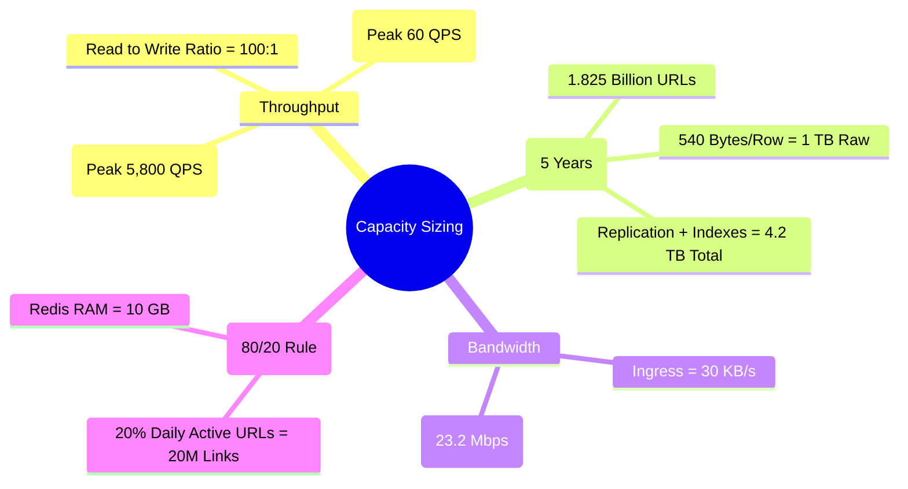
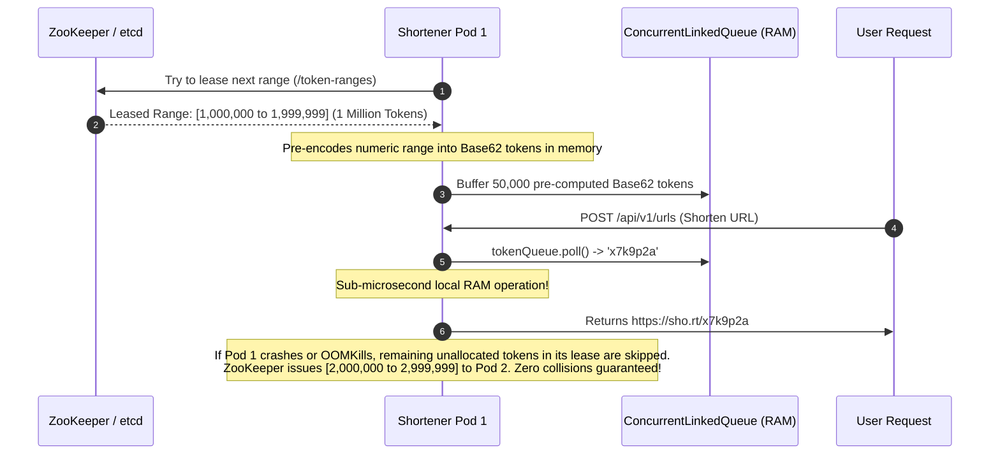
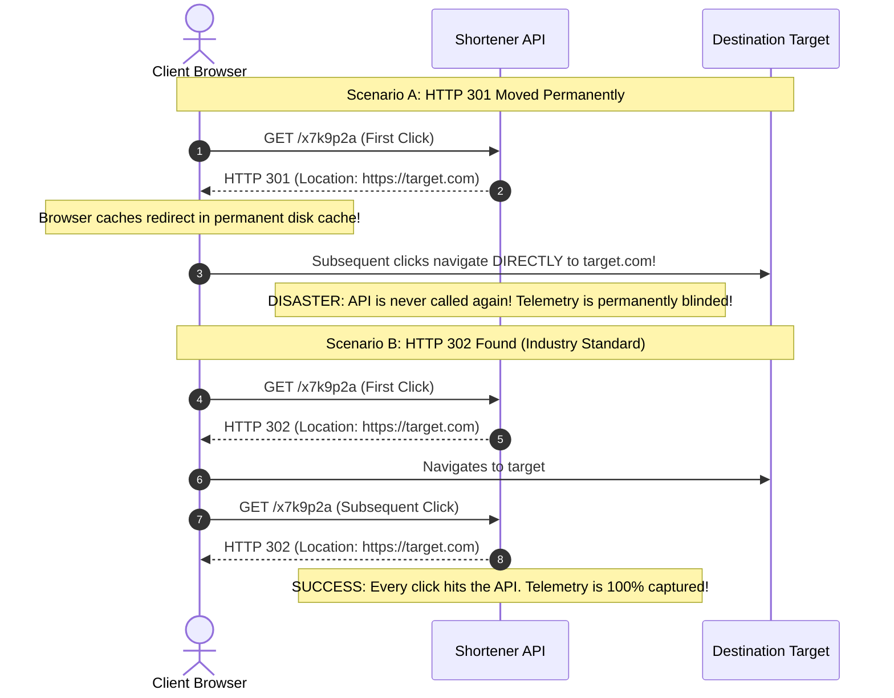

## 1. Mental Model: The Distributed Compression Paradox

A URL shortener (like TinyURL, Bitly, or Dub.co) appears deceptively simple on the surface: it accepts a long web address (e.g., `https://example.com/products/electronics/audio/noise-cancelling-headphones-v2?utm_source=spring-docs&ref=promo_42`) and returns a compact 7-character alias (`https://sho.rt/x7k9p2a`).

Beneath this simple exterior lies one of the premier benchmarks of backend engineering:
- **Extreme Read-to-Write Asymmetry ($100:1$)**: Over 99% of requests are read redirects demanding sub-15ms global latency, while writes must guarantee zero duplicate short codes.
- **The Combinatorial Compression Dilemma**: Mapping an infinite space of arbitrary URL strings into a tiny, bounded 7-character alphanumeric string without hash collisions or sequential guessing.
- **The Cache Penetration Threat**: Defending the underlying relational database from malicious scrapers querying non-existent short codes.
- **Data Lifecycle Purging**: Deleting hundreds of millions of expired links annually without taking table locks or causing replication lag.

```mermaid
flowchart LR
    subgraph Write Flow (Creation: 12 QPS)
        LongURL["Long URL Payload"] --> API_W[Shortener Write API]
        API_W --> KGS[KGS Token Lease / Base62]
        KGS --> DB[(PostgreSQL Primary)]
        DB --> Bloom["Redis Bloom Filter (Add Token)"]
        Bloom --> Cache["Redis Cache (Write-Through)"]
    end

    subgraph Read Flow (Redirect: 1,160 QPS)
        User[Client Browser] --> API_R[Shortener Read API]
        API_R --> BloomCheck{"Bloom Filter Check"}
        BloomCheck -->|Definitively Not Found| 404[Instant 404 Not Found]
        BloomCheck -->|Might Exist| CacheCheck{"Redis Cache Check"}
        CacheCheck -->|Cache Hit (80%)| Redir[HTTP 302 Found Redirect]
        CacheCheck -->|Cache Miss (20%)| Replica[(PostgreSQL Read Replica)]
        Replica --> Populate[Populate Redis with Jitter TTL]
        Populate --> Redir
        Redir -.-|Async Click Event| Kafka[Apache Kafka Telemetry]
    end
```

---

## 2. Mathematical Capacity Estimation & Sizing

Always establish quantitative requirements before choosing databases, caches, or algorithms:



### 1. Throughput & QPS Math
- **New Links Created**: $1,000,000 \text{ links/day}$ ($1\text{M/day}$).
- **Redirects Served**: $100,000,000 \text{ redirects/day}$ ($100\text{M/day}$).
- **Read-to-Write Ratio**: $100 : 1$.

$$\text{Write QPS}_{\text{avg}} = \frac{1,000,000}{86,400\text{ seconds}} \approx \mathbf{11.6 \text{ writes/sec}} \quad (\text{Peak } 5\text{x}: \mathbf{58 \text{ writes/sec}})$$
$$\text{Read QPS}_{\text{avg}} = \frac{100,000,000}{86,400\text{ seconds}} \approx \mathbf{1,157 \text{ reads/sec}} \quad (\text{Peak } 5\text{x}: \mathbf{5,785 \text{ reads/sec}})$$

### 2. 5-Year Storage Capacity Math
- Total records over 5 years: $1\text{M/day} \times 365 \times 5 = \mathbf{1.825 \text{ billion URLs}}$.
- Payload sizing breakdown:
  - `id`: 8 bytes (`BIGINT`).
  - `short_code`: 7 bytes (`VARCHAR(16)`).
  - `long_url`: 500 bytes (`TEXT`, average web URL length).
  - `user_id`: 8 bytes (`BIGINT`).
  - `created_at` + `expires_at`: 16 bytes (`TIMESTAMPTZ`).
  - Database row header overhead: ~23 bytes.
  - **Total row footprint**: $\approx 560 \text{ bytes}$.

$$\text{5-Year Raw Data Storage} = 1.825 \times 10^9 \times 560 \text{ bytes} \approx \mathbf{1.02 \text{ TB}}$$
$$\text{Total Production Disk (3x Replication + 40% B-Tree Indexes)} = 1.02 \text{ TB} \times 3 \times 1.4 \approx \mathbf{4.28 \text{ TB}}$$

### 3. RAM Caching Estimation (Pareto 80/20 Rule)
According to the Pareto distribution, **20% of popular URLs generate 80% of redirect traffic**:
$$\text{Daily Unique Active URLs to Cache} = 100,000,000 \times 0.20 = \mathbf{20,000,000 \text{ URLs}}$$
$$\text{Required Redis Cache RAM} = 20,000,000 \times 560 \text{ bytes} \approx \mathbf{11.2 \text{ GB RAM}}$$

A standard 3-node Redis cluster with 16GB RAM nodes easily accommodates the entire hot working set in memory.

---

## 3. Short Code Generation: Base62 vs The Hash Collision Trap

### The Combinatorics of Base62
Base62 uses 62 alphanumeric characters: `0-9` (10), `a-z` (26), and `A-Z` (26).

$$\text{Total Combinations for Length } L = 62^L$$

| Length ($L$) | Total Combinations | Headroom for 1.825B URLs | Evaluation |
| :--- | :--- | :--- | :--- |
| **5 characters** | $62^5 = 916,132,832$ ($916\text{M}$) | Insufficient ($< 1.825\text{B}$) | **Fails capacity requirement** |
| **6 characters** | $62^6 = 56,800,235,584$ ($56.8\text{B}$) | $31\text{x}$ requirement | Vulnerable to high-growth surge |
| **7 characters** | $62^7 = 3,521,614,606,208$ ($3.52\text{ Trillion}$) | **$1,929\text{x}$ requirement** | **Industry Gold Standard** |
| **8 characters** | $62^8 = 218,340,105,584,896$ ($218\text{ Trillion}$) | $119,000\text{x}$ requirement | Unnecessarily long on screens |

### The Hash-and-Truncate Fallacy (Birthday Paradox Collision Trap)
A common beginner mistake is hashing the long URL with MD5 or SHA-256 and taking the first 7 characters:

```java
// DANGEROUS ANTI-PATTERN: DO NOT USE IN PRODUCTION
String hash = DigestUtils.md5Hex(longUrl);
String shortCode = hash.substring(0, 7); // Truncates 128-bit hash to 7 hex chars!
```

#### Why This Fails:
A 7-character hexadecimal string contains only $16^7 \approx 268.4\text{ million}$ states. According to the **Birthday Paradox**, the probability of a collision reaches 50% after hashing only:

$$N \approx \sqrt{\frac{\pi}{2} \times 16^7} \approx \sqrt{1.256 \times 2.68 \times 10^8} \approx \mathbf{20,500 \text{ URLs!}}$$

Even if Base62 is used on the truncated hash ($62^7 \approx 3.52\text{ trillion}$ states), collisions begin occurring after generating only:

$$N \approx \sqrt{\frac{\pi}{2} \times 3.52 \times 10^{12}} \approx \mathbf{2,350,000 \text{ URLs}}$$

At 1 million writes per day, your database will experience **hundreds of collisions every single day**, requiring slow database retry loops that spike write latency.

---

## 4. Production Java 21 Base62 Bijection Engine

The mathematically sound solution is a **bijective mapping** between a 64-bit auto-incrementing integer sequence and a Base62 alphanumeric string. Every integer maps to one, and only one, unique 7-character string:

```java
package com.backend.mastery.systemdesign.shortener;

/**
 * Production-grade, zero-allocation Base62 Bijective Encoder/Decoder.
 * Maps unique 64-bit integer sequences to 7-character compact strings.
 */
public final class Base62Encoder {

    // Shuffled alphabet to defeat sequential enumeration and scraping attacks
    private static final String ALPHABET = "mn6WkE1sY7bQxN2cZ8dJ3fK9gL4hM0pP5qRtUvSwTxAyBzCDeFgHiGj";
    private static final char[] CHAR_TABLE = ALPHABET.toCharArray();
    private static final int BASE = CHAR_TABLE.length; // 62
    private static final int SHORT_CODE_LENGTH = 7;

    // Fast lookup array for decoding (ASCII 0 to 127)
    private static final int[] INDEX_TABLE = new int[128];

    static {
        for (int i = 0; i < INDEX_TABLE.length; i++) {
            INDEX_TABLE[i] = -1;
        }
        for (int i = 0; i < CHAR_TABLE.length; i++) {
            INDEX_TABLE[CHAR_TABLE[i]] = i;
        }
    }

    private Base62Encoder() {}

    /**
     * Encodes a 64-bit numeric ID into a 7-character Base62 string.
     * Pads with leading alphabet characters if ID is small.
     */
    public static String encode(long id) {
        if (id < 0) {
            throw new IllegalArgumentException("ID cannot be negative: " + id);
        }

        char[] buffer = new char[SHORT_CODE_LENGTH];
        int charPos = SHORT_CODE_LENGTH - 1;

        // Perform successive modulo-62 division
        while (id > 0 && charPos >= 0) {
            buffer[charPos--] = CHAR_TABLE[(int) (id % BASE)];
            id /= BASE;
        }

        // Left-pad remaining characters with the zero-index character for uniform 7-char length
        while (charPos >= 0) {
            buffer[charPos--] = CHAR_TABLE[0];
        }

        return new String(buffer);
    }

    /**
     * Decodes a 7-character Base62 string back into its original 64-bit numeric ID.
     */
    public static long decode(String shortCode) {
        if (shortCode == null || shortCode.length() != SHORT_CODE_LENGTH) {
            throw new IllegalArgumentException("Short code must be exactly 7 characters: " + shortCode);
        }

        long id = 0;
        for (int i = 0; i < shortCode.length(); i++) {
            char c = shortCode.charAt(i);
            if (c >= INDEX_TABLE.length || INDEX_TABLE[c] == -1) {
                throw new IllegalArgumentException("Invalid Base62 character: " + c);
            }
            id = (id * BASE) + INDEX_TABLE[c];
        }

        return id;
    }
}
```

---

## 5. Key Generation Service (KGS) Token Leases

To eliminate database contention for sequences across 50 application pods, deploy a **Key Generation Service (KGS)** coordinated by **Apache ZooKeeper** or **etcd**:



---

## 6. HTTP 301 vs HTTP 302 / 307 Redirect Semantics

Choosing the correct HTTP redirect status code dictates whether your platform can capture real-time click telemetry:



- **`301 Moved Permanently`**: Browser caches the mapping forever. Origin servers save bandwidth, but **click analytics are completely broken**.
- **`302 Found` (or `307 Temporary Redirect`)**: Browser must re-request the short code on every visit. The API resolves the redirect in 1ms via Redis, fires an async Kafka event, and redirects the user.

---

## 7. Cache Penetration Defense: Redisson Bloom Filter

If a bot attacks your service by requesting millions of non-existent random short codes (`GET /a9z8y7x`), Redis will miss on every request, slamming PostgreSQL with 100,000 read queries/sec and crashing the database.

### The Redisson Bloom Filter Defense
A **Bloom Filter** is a space-efficient probabilistic data structure that tests set membership with **zero false negatives**:
- If the Bloom Filter returns `false`: The key **definitively does not exist**. Return `HTTP 404 Not Found` immediately without touching Redis or PostgreSQL.
- If the Bloom Filter returns `true`: The key **probably exists** (1% false positive probability). Proceed to check Redis.

```java
package com.backend.mastery.systemdesign.shortener;

import org.redisson.api.RBloomFilter;
import org.redisson.api.RedissonClient;
import org.springframework.context.annotation.Bean;
import org.springframework.context.annotation.Configuration;

@Configuration
public class BloomFilterConfig {

    @Bean
    public RBloomFilter<String> urlBloomFilter(RedissonClient redissonClient) {
        RBloomFilter<String> bloomFilter = redissonClient.getBloomFilter("bloom:short_codes");
        // Capacity: 50 Million unique URLs, False Probability: 1% (0.01)
        // Requires only ~60MB of Redis RAM!
        bloomFilter.tryInit(50_000_000L, 0.01);
        return bloomFilter;
    }
}
```

---

## 8. Complete Working Code: Spring Boot 3.3 Redirect Engine

Below is the complete, production-grade Spring Boot 3.3 controller and service implementing cache-aside reads, TTL jitter to eliminate cache avalanches, Bloom filter pre-checks, and asynchronous Kafka click tracking:

```java
package com.backend.mastery.systemdesign.shortener;

import jakarta.servlet.http.HttpServletRequest;
import org.redisson.api.RBloomFilter;
import org.slf4j.Logger;
import org.slf4j.LoggerFactory;
import org.springframework.data.redis.core.StringRedisTemplate;
import org.springframework.http.HttpHeaders;
import org.springframework.http.HttpStatus;
import org.springframework.http.ResponseEntity;
import org.springframework.kafka.core.KafkaTemplate;
import org.springframework.web.bind.annotation.*;

import java.net.URI;
import java.time.Duration;
import java.util.concurrent.ThreadLocalRandom;

@RestController
@RequestMapping
public class UrlRedirectController {

    private static final Logger log = LoggerFactory.getLogger(UrlRedirectController.class);

    private final StringRedisTemplate redisTemplate;
    private final UrlRepository urlRepository;
    private final RBloomFilter<String> bloomFilter;
    private final KafkaTemplate<String, ClickTelemetryEvent> kafkaTemplate;

    public UrlRedirectController(
            StringRedisTemplate redisTemplate,
            UrlRepository urlRepository,
            RBloomFilter<String> bloomFilter,
            KafkaTemplate<String, ClickTelemetryEvent> kafkaTemplate) {
        this.redisTemplate = redisTemplate;
        this.urlRepository = urlRepository;
        this.bloomFilter = bloomFilter;
        this.kafkaTemplate = kafkaTemplate;
    }

    @GetMapping("/{shortCode:[a-zA-Z0-9]{7}}")
    public ResponseEntity<Void> redirect(
            @PathVariable String shortCode,
            HttpServletRequest request) {

        // 1. Bloom Filter Pre-Check: Block Cache Penetration attacks in sub-millisecond
        if (!bloomFilter.contains(shortCode)) {
            return ResponseEntity.status(HttpStatus.NOT_FOUND).build();
        }

        String cacheKey = "url:" + shortCode;

        // 2. Cache-Aside Read: Check Redis RAM first
        String targetUrl = redisTemplate.opsForValue().get(cacheKey);

        if (targetUrl == null) {
            // 3. Cache Miss: Fall back to PostgreSQL read-replica
            targetUrl = urlRepository.findActiveLongUrl(shortCode)
                    .orElse(null);

            if (targetUrl == null) {
                // Short code either expired or false positive from Bloom filter
                return ResponseEntity.status(HttpStatus.NOT_FOUND).build();
            }

            // 4. Populate Redis Cache with Jittered TTL (prevents Cache Avalanche)
            // Base TTL: 24 Hours + Random Jitter (0 to 60 minutes)
            long jitterSeconds = ThreadLocalRandom.current().nextLong(3600);
            Duration ttl = Duration.ofHours(24).plusSeconds(jitterSeconds);
            redisTemplate.opsForValue().set(cacheKey, targetUrl, ttl);
        }

        // 5. Asynchronous Fire-and-Forget Click Telemetry Dispatch to Kafka
        publishClickEvent(shortCode, request);

        // 6. Return HTTP 302 Found Redirect with Location Header
        return ResponseEntity.status(HttpStatus.FOUND)
                .location(URI.create(targetUrl))
                .header(HttpHeaders.CACHE_CONTROL, "no-cache, no-store, max-age=0, must-revalidate")
                .build();
    }

    private void publishClickEvent(String shortCode, HttpServletRequest request) {
        try {
            String ipAddress = resolveClientIp(request);
            String userAgent = request.getHeader(HttpHeaders.USER_AGENT);
            String referrer = request.getHeader(HttpHeaders.REFERER);

            ClickTelemetryEvent event = new ClickTelemetryEvent(
                    shortCode,
                    System.currentTimeMillis(),
                    ipAddress,
                    userAgent,
                    referrer
            );

            // Publish to partitioned Kafka topic using shortCode as partition key
            kafkaTemplate.send("url-clicks", shortCode, event);
        } catch (Exception ex) {
            // Never fail the primary redirect path if telemetry pipeline degrades
            log.warn("Failed to publish telemetry event for shortCode {}: {}", shortCode, ex.getMessage());
        }
    }

    private String resolveClientIp(HttpServletRequest request) {
        String xForwardedFor = request.getHeader("X-Forwarded-For");
        if (xForwardedFor != null && !xForwardedFor.isBlank()) {
            return xForwardedFor.split(",")[0].trim();
        }
        return request.getRemoteAddr();
    }

    public record ClickTelemetryEvent(
            String shortCode,
            long timestamp,
            String ipAddress,
            String userAgent,
            String referrer
    ) {}
}
```

---

## 9. Zero-Downtime TTL Purging: PostgreSQL Table Partitioning

How do you delete 50 million expired URLs every month without locking the database?

Running `DELETE FROM urls WHERE expires_at < NOW();` will:
1. Acquire row-level locks that block concurrent reads and writes.
2. Generate gigabytes of Write-Ahead Logs (WAL), causing replication lag spikes on read replicas.
3. Leave millions of dead tuples, causing severe table bloat until `VACUUM FULL` runs.

### The Production Solution: Range Partitioning by Month

```sql
-- 1. Create root partitioned table
CREATE TABLE urls (
    id BIGINT NOT NULL,
    short_code VARCHAR(16) NOT NULL,
    long_url TEXT NOT NULL,
    user_id BIGINT NOT NULL,
    created_at TIMESTAMP WITH TIME ZONE NOT NULL,
    expires_at TIMESTAMP WITH TIME ZONE NOT NULL,
    PRIMARY KEY (short_code, expires_at)
) PARTITION BY RANGE (expires_at);

-- 2. Monthly partitions
CREATE TABLE urls_2026_09 PARTITION OF urls
    FOR VALUES FROM ('2026-09-01 00:00:00+00') TO ('2026-10-01 00:00:00+00');

CREATE TABLE urls_2026_10 PARTITION OF urls
    FOR VALUES FROM ('2026-10-01 00:00:00+00') TO ('2026-11-01 00:00:00+00');

-- 3. Instant O(1) monthly purging (Scheduled cron job)
-- Drops 50M expired records in 4 milliseconds without table locks!
DROP TABLE urls_2026_09;
```

---

## 10. Failure Modes & Edge Case Matrix

| Failure Mode | Root Cause | Impact | Production Defense |
| :--- | :--- | :--- | :--- |
| **Cache Penetration** | Malicious bot requests millions of random short codes | Redis misses fall through to DB; DB CPU hits 100% | Redis Bloom Filter returns 404 in $O(1)$ RAM without hitting DB. |
| **Cache Avalanche** | Redis restarts or 10M keys expire at midnight simultaneously | Massive thundering herd crushes PostgreSQL | Add random TTL jitter (`24h + rand(0, 3600s)`) to stagger expirations. |
| **Cache Stampede** | A celebrity link expires while receiving 10,000 QPS | 10,000 concurrent threads query DB for the same key | Implement Redisson distributed mutex lock for single-flight DB fetch. |
| **Sequential Link Scraping** | Short codes generated via sequential auto-increment | Scrapers enumerate private company links (`aaa`, `aab`, `aac`) | Shuffle Base62 alphabet array or use KGS randomized range leases. |
| **Telemetry Failure Delay** | Kafka cluster is temporarily unreachable | Slow Kafka write delays user redirect response | Wrap Kafka send in try-catch fire-and-forget; never block redirect path. |

---

## URL Shortener Fundamentals Drill

A URL shortener looks tiny, but it tests nearly every backend fundamental: ID generation, redirects, caching, abuse prevention, analytics, expiration, and read-heavy scaling.

```mermaid
flowchart LR
    Create[POST /links] --> Code[Generate short code]
    Code --> Store[(URL mapping table)]
    Store --> Cache[(Cache)]
    User[Browser] --> Redirect[GET /{code}]
    Redirect --> Cache
    Cache --> Store
    Redirect --> Analytics[Async click event]
    Redirect --> Target[301 or 302 redirect]
```

### The Real Requirements

| Requirement | Why it matters |
| --- | --- |
| Short code uniqueness | Collisions must be handled safely. |
| Low redirect latency | Redirect path is read-heavy and user-facing. |
| Abuse protection | Short links hide dangerous destinations. |
| Expiration | Old links need cleanup without table-wide locks. |
| Analytics | Click tracking must not slow redirects. |
| Custom aliases | User-chosen codes need uniqueness and moderation. |
| Redirect semantics | 301 can be cached by browsers; 302/307 remain flexible. |

### Create Path vs Redirect Path

Create path:

```markdown
Validate target URL.
Check user quota.
Generate or reserve short code.
Insert mapping with unique constraint.
Return short URL.
```

Redirect path:

```markdown
Read code from request path.
Check cache.
Fallback to database.
Reject expired or unsafe link.
Emit async analytics event.
Return redirect response.
```

The redirect path must stay extremely fast. Analytics, fraud scoring, and enrichment should not block the browser unless the product explicitly requires synchronous protection.

### Collision Handling

A shallow answer says, "hash the URL." A deeper answer says:

```markdown
If two long URLs hash to the same short code, the database unique constraint
detects the collision. The system retries with more entropy or allocates from
a key generation service. Correctness must not depend on probability alone.
```

### Public API Edge Cases

| Edge case | Defense |
| --- | --- |
| Same URL submitted twice | Decide whether to return same code per user or create separate trackable links. |
| Malicious URL | Safe browsing checks, domain blocklist, reporting, takedown workflow. |
| Hot celebrity link | CDN/cache redirect metadata and async analytics. |
| Expired link | Return 404 or custom expired page, do not redirect. |
| Browser caches old 301 | Use 302 until the target is permanent. |

### Build-Break-Fix Drill

Build:

```markdown
POST /links creates a short code.
GET /{code} redirects and emits an analytics event.
```

Break:

```markdown
Force a code collision.
Send 10,000 requests/second to one hot code.
Change the target after returning 301.
Submit a dangerous destination URL.
```

Fix:

```markdown
Use a unique constraint and retry.
Cache redirect mappings.
Emit analytics asynchronously.
Choose redirect status intentionally.
Add abuse scanning and takedown state.
```

## 11. Senior Interview Questions & Active Recall

<AccordionGroup>
  <Accordion title="1. Walk through the mathematical proof for choosing a 7-character Base62 short code.">
    Base62 encoding consists of 62 alphanumeric characters (`[0-9, a-z, A-Z]`). A code of length $L$ yields $62^L$ total combinations.
    - $62^6 \approx 56.8 \text{ billion}$, which provides insufficient safety margin for multi-year retention or surge growth.
    - $62^7 = 3,521,614,606,208$ ($3.52\text{ trillion}$) combinations. Since our 5-year requirement is $1.825\text{ billion}$ links, 7 characters provides an over-provisioning factor of more than **1,900x**, guaranteeing virtually infinite collision-free headroom while remaining compact on user screens.
  </Accordion>

  <Accordion title="2. Why is HTTP 302 Found strictly preferred over HTTP 301 Moved Permanently for URL shorteners?">
    When a browser receives `301 Moved Permanently`, it caches the destination URL in its local browser cache indefinitely. Subsequent user clicks bypass the shortener API entirely and navigate straight to the destination website. As a result, the backend cannot capture click analytics (referrers, devices, geolocations). Returning `302 Found` forces the browser to query the shortener API on every single click, enabling real-time telemetry while keeping redirect latency under 15ms via Redis.
  </Accordion>

  <Accordion title="3. How does a Key Generation Service (KGS) using ZooKeeper token ranges eliminate hash collisions?">
    Traditional hash-and-truncate approaches require computing a hash, taking the first 7 characters, and querying the database to detect collisions, requiring slow retry loops. A KGS avoids this by generating unique Base62 tokens offline. KGS worker pods coordinate with ZooKeeper or etcd to lease non-overlapping numeric ranges (e.g., Pod 1 gets `1,000,000 - 1,999,999`). When a user creates a link, the pod pops an unassigned token directly from in-memory memory in $O(1)$ time with a mathematical guarantee of zero collisions.
  </Accordion>

  <Accordion title="4. How does a Bloom Filter protect the database against Cache Penetration attacks?">
    Cache Penetration occurs when malicious requests query non-existent short codes. Because the keys do not exist in Redis, every request falls through to the database, exhausting connection pools. A Bloom Filter is a space-efficient probabilistic bit array containing all valid short codes (~1.2 bytes per key). Before querying Redis or PostgreSQL, the API checks the Bloom Filter: if it returns false, the key definitively does not exist, and the API returns HTTP 404 immediately, shielding the database.
  </Accordion>

  <Accordion title="5. Why is table partitioning superior to running DELETE FROM urls WHERE expires_at < NOW()?">
    Running a massive `DELETE` statement acquires exclusive table locks, creates huge Write-Ahead Log (WAL) spikes that increase replication lag, and leaves millions of dead tuple pages that cause severe table bloat until `VACUUM` runs. By partitioning the table by expiration date (e.g., monthly partitions), purging an entire month of expired links is executed via `DROP TABLE urls_2026_09`, which completes in sub-millisecond time as an $O(1)$ metadata unlink operation without locking active tables.
  </Accordion>
</AccordionGroup>

---

## 12. Done Checklist

<Check>
- [ ] Calculate throughput QPS, 5-year storage, and 80/20 RAM working set for URL shorteners.
- [ ] Articulate the mathematical failure of MDX/SHA truncation due to the Birthday Paradox.
- [ ] Implement a production-grade, zero-allocation Base62 bijective encoder and decoder in Java 21.
- [ ] Contrast HTTP 301 Moved Permanently with HTTP 302 Found regarding browser caching and telemetry.
- [ ] Protect databases from Cache Penetration attacks using a Redisson Distributed Bloom Filter.
- [ ] Build a Spring Boot 3.3 redirect controller featuring Cache-Aside reads, TTL jitter, and async Kafka telemetry.
- [ ] Design PostgreSQL range partitions by month to achieve $O(1)$ sub-millisecond TTL data purging.
</Check>
