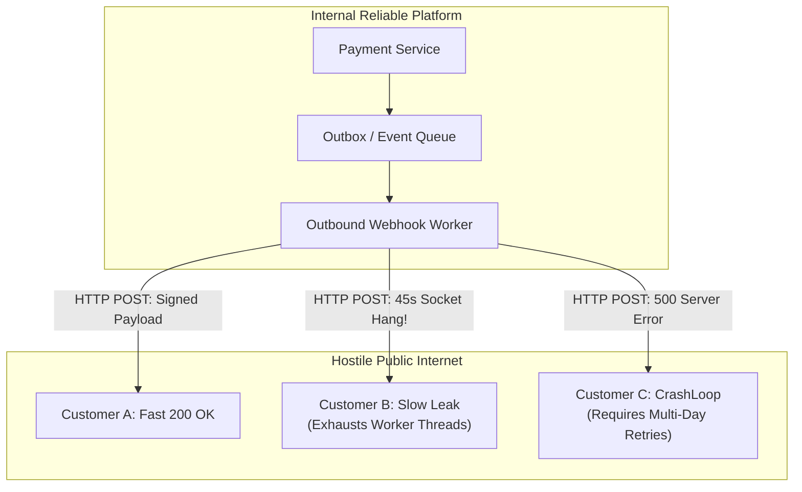
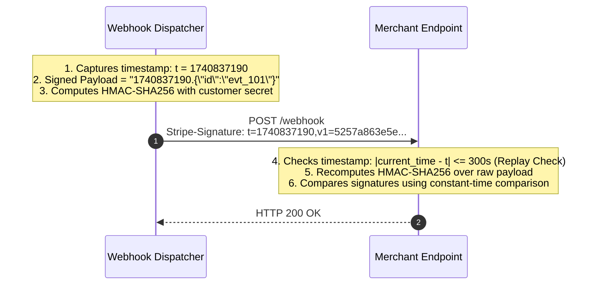
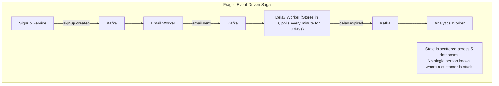
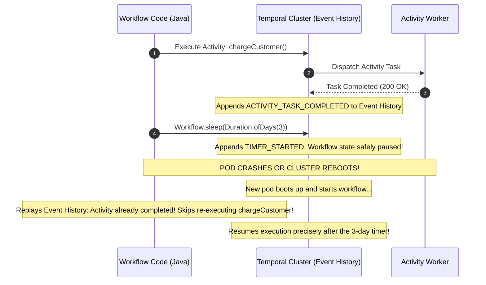

## 1. Mental Model: The Hostile World of Outbound Webhooks

When your platform fires a webhook (e.g., Stripe notifying a merchant of a payment `charge.succeeded`), your backend must call an external HTTP endpoint operated by a third party.

Unlike internal microservices, external customer endpoints are fundamentally **hostile, unpredictable, and unreliable**:
- Customer endpoints crash, suffer DNS failures, or deploy breaking changes.
- Customer servers take 45 seconds to respond, threatening to exhaust your outbound thread pool.
- Malicious or misconfigured customers fail to process webhooks and accuse your platform of dropping events.



To deliver webhooks with 99.999% reliability, you must engineer:
1. **Cryptographic Tamper-Proof Signatures**: Ensuring only your platform could have authored the payload.
2. **Strict Worker Isolation & Timeouts**: Preventing slow customer endpoints from starving outbound worker capacity.
3. **Multi-Day Exponential Backoff with Jitter**: Giving customers up to 72 hours to recover from outages.
4. **Durable Workflow Orchestration**: Guaranteeing multi-step, long-running processes execute to completion even across pod restarts.

---

## 2. Cryptographic Security: HMAC-SHA256 & Replay Defense

Customers must be able to verify that an incoming webhook genuinely originated from your servers and was not intercepted, modified, or forged by an attacker.

### The Stripe Webhook Signature Standard (`Stripe-Signature` Header)
Every outbound HTTP POST includes a cryptographic signature header containing:
- `t` : A Unix epoch timestamp (in seconds).
- `v1` : An HMAC-SHA256 hexadecimal digest of the timestamp combined with the raw JSON payload, signed with the customer's webhook signing secret (`whsec_...`).

$$\text{Signature} = \text{HMAC-SHA256}\left( \text{secret}, \text{timestamp} + "." + \text{raw\_json\_payload} \right)$$



### Replay Attack Prevention
An attacker listening on public Wi-Fi could capture a valid webhook payload and replay it 100 times to grant a customer 100 subscriptions. 
By binding the timestamp into the HMAC digest, customer servers reject any webhook where $| \text{System Time} - t | > 300\text{ seconds}$ (5 minutes), completely neutralizing replay attacks.

---

## 3. Worker Architecture: Timeouts, Concurrency & Circuit Breaking

### The 5-Second Rule
Never allow an outbound HTTP connection to block indefinitely. Every outbound webhook call must be governed by strict socket boundaries:
- **Connection Timeout**: 2 seconds.
- **Read Timeout**: 5 seconds.
- Total allowable execution window: **maximum 7 seconds**. If the customer has not returned an HTTP 2xx within 7 seconds, terminate the socket and schedule a retry.

```mermaid
flowchart TD
    subgraph Outbound Webhook Worker Pool
        Q[(Redis / PostgreSQL Queue)] --> Worker1[Worker Pod 1]
        Q --> Worker2[Worker Pod 2]
        
        Worker1 --> RateLimiter{Per-Customer<br/>Concurrency Limiter}
        RateLimiter -->|Slot Available (Max 5 concurrent)| Dispatch[HTTP POST to Customer]
        RateLimiter -->|Limit Exceeded| Requeue[Requeue with Backoff]
        
        Dispatch --> Breaker{Customer Circuit Breaker}
        Breaker -->|Closed (Healthy)| Send[Send Request]
        Breaker -->|Open (Failing 100% of calls)| Skip[Skip attempt & sleep 1 hour]
    end
```

### Per-Customer Concurrency Limits
If Customer X's servers are struggling and processing requests at only 1 request/second, flooding them with 500 concurrent webhook workers will crash their servers completely.
- Enforce a **per-destination concurrency limit** (e.g., maximum 5 concurrent outbound sockets per merchant endpoint).
- If Customer X already has 5 in-flight webhooks, remaining events stay queued, protecting both your thread pool and the customer's infrastructure.

---

## 4. Multi-Day Exponential Backoff with Full Jitter

When a customer's server goes down over the weekend, a naive retry schedule (e.g., retrying every 5 minutes) creates two disasters:
1. It hammers the customer's recovering servers with a thundering herd.
2. It burns through the retry limit in 30 minutes, permanently abandoning the event.

Production webhook engines retry across a **72-hour window** using exponential backoff with full jitter:

$$T_{\text{sleep}} = \text{random}\left(0, \min\left(M, B \cdot 2^{\text{attempt}}\right)\right)$$

```mermaid
flowchart LR
    E[Event Triggered] --> A1[Attempt 1: Immediate]
    A1 -->|Fails| A2["Attempt 2: ~5 mins (Jittered)"]
    A2 -->|Fails| A3["Attempt 3: ~30 mins"]
    A3 -->|Fails| A4["Attempt 4: ~2 hours"]
    A4 -->|Fails| A5["Attempt 5: ~8 hours"]
    A5 -->|Fails| A6["Attempt 6: ~24 hours"]
    A6 -->|Fails| A7["Attempt 7: ~72 hours"]
    A7 -->|Fails| DLT[Dead-Letter Table & Merchant Alert]
```



---

## 5. Moving Beyond Saga State Spaghetti: Durable Workflows

In microservice architectures, developers often attempt to coordinate multi-step, long-running processes (e.g., User Onboarding: Send Email $\rightarrow$ Wait 3 days $\rightarrow$ Check Activity $\rightarrow$ Grant Discount) by publishing events across Apache Kafka.



### The Limitations of Raw Event Choreography:
1. **Lack of Central Observability**: Tracking where a transaction stalled requires querying logs across 6 microservices.
2. **Complex Compensations**: If Step 4 fails, triggering reverse compensating transactions across Steps 3, 2, and 1 requires nested, error-prone event topologies.
3. **Timer Fragility**: Sleeping a business process for 30 days requires bespoke database polling workers.

---

## 6. Durable Code Execution: Temporal / Cadence Internals

**Temporal** solves this by providing **Durable Execution**: you write ordinary, sequential Java code with standard loops and `Thread.sleep()`, and Temporal guarantees that the code will execute to completion even if workers crash or servers are rebooted.



### Determinism: The Golden Rule of Workflows
Temporal accomplishes durability through **Event Sourcing Replay**:
- When a worker pod crashes, a new worker reconstructs the exact workflow state by replaying past events from the history log.
- **Workflow code must be strictly deterministic**: no random numbers (`Math.random()`), no current wall-clock time (`System.currentTimeMillis()`), and no direct network I/O inside the workflow function! All non-deterministic operations must run inside **Activities**.

---

## 7. Production Working Code: Stripe-Grade Webhook Dispatcher

```java
package com.backend.mastery.webhooks;

import org.slf4j.Logger;
import org.slf4j.LoggerFactory;
import org.springframework.stereotype.Service;

import javax.crypto.Mac;
import javax.crypto.spec.SecretKeySpec;
import java.net.URI;
import java.net.http.HttpClient;
import java.net.http.HttpRequest;
import java.net.http.HttpResponse;
import java.nio.charset.StandardCharsets;
import java.security.MessageDigest;
import java.time.Duration;
import java.time.Instant;
import java.util.HexFormat;

@Service
public class WebhookDispatcherService {

    private static final Logger log = LoggerFactory.getLogger(WebhookDispatcherService.class);
    private static final String HMAC_ALGORITHM = "HmacSHA256";

    private final HttpClient httpClient;

    public WebhookDispatcherService() {
        this.httpClient = HttpClient.newBuilder()
                .connectTimeout(Duration.ofSeconds(2))
                .build();
    }

    /**
     * Dispatches signed webhook with strict timeouts.
     */
    public boolean deliverWebhook(String destinationUrl, String rawPayload, String secretKey) {
        long timestamp = Instant.now().getEpochSecond();
        String signature = computeSignature(timestamp, rawPayload, secretKey);
        String headerValue = "t=" + timestamp + ",v1=" + signature;

        HttpRequest request = HttpRequest.newBuilder()
                .uri(URI.create(destinationUrl))
                .timeout(Duration.ofSeconds(5)) // Hard 5-second read timeout
                .header("Content-Type", "application/json")
                .header("Stripe-Signature", headerValue)
                .POST(HttpRequest.BodyPublishers.ofString(rawPayload, StandardCharsets.UTF_8))
                .build();

        try {
            HttpResponse<String> response = httpClient.send(request, HttpResponse.BodyHandlers.ofString());
            int statusCode = response.statusCode();

            if (statusCode >= 200 && statusCode < 300) {
                log.info("Webhook successfully delivered to {}: HTTP {}", destinationUrl, statusCode);
                return true;
            } else {
                log.warn("Webhook delivery failed to {}: HTTP {}", destinationUrl, statusCode);
                return false;
            }
        } catch (Exception ex) {
            log.error("Network exception delivering webhook to {}: {}", destinationUrl, ex.getMessage());
            return false;
        }
    }

    /**
     * Signs timestamp + "." + payload using HMAC-SHA256.
     */
    public static String computeSignature(long timestamp, String payload, String secret) {
        try {
            String signedContent = timestamp + "." + payload;
            Mac mac = Mac.getInstance(HMAC_ALGORITHM);
            SecretKeySpec keySpec = new SecretKeySpec(secret.getBytes(StandardCharsets.UTF_8), HMAC_ALGORITHM);
            mac.init(keySpec);
            byte[] hash = mac.doFinal(signedContent.getBytes(StandardCharsets.UTF_8));
            return HexFormat.of().formatHex(hash);
        } catch (Exception e) {
            throw new RuntimeException("Failed to compute HMAC-SHA256 signature", e);
        }
    }

    /**
     * Constant-time signature verification for customer receivers.
     */
    public static boolean verifySignature(long timestamp, String payload, String secret, String expectedSig) {
        String actualSig = computeSignature(timestamp, payload, secret);
        // MessageDigest.isEqual executes in constant time to defeat timing attacks
        return MessageDigest.isEqual(
                actualSig.getBytes(StandardCharsets.UTF_8),
                expectedSig.getBytes(StandardCharsets.UTF_8)
        );
    }
}
```

---

## 8. Failure Modes & Edge Case Matrix

| Failure Mode | Root Cause | Impact | Production Defense |
| :--- | :--- | :--- | :--- |
| **Outbound Socket Starvation** | Slow customer server takes 45s to respond | Worker threads exhaust; all other webhooks queue up | Impose strict 2s connect and 5s read timeouts per outbound call. |
| **Replay Attack** | Attacker sniffs webhook and re-sends to customer endpoint | Merchant processes payment twice | Embed signed epoch timestamp in header; reject timestamps older than 5m. |
| **Timing Attack on Signature** | Receiver uses `String.equals()` to verify HMAC | Attacker determines valid signature byte-by-byte | Enforce constant-time comparison via `MessageDigest.isEqual()`. |
| **Workflow Non-Determinism** | Developer calls `UUID.randomUUID()` inside Temporal workflow | Replay history diverges; workflow execution permanently corrupts | Keep workflows pure; execute all random/time/network logic inside Activities. |

---

## 9. Senior Interview Questions & Active Recall

<AccordionGroup>
  <Accordion title="Why is constant-time comparison (MessageDigest.isEqual) mandatory when validating webhook signatures?">
    Standard string equality (`String.equals()`) terminates and returns `false` at the very first byte that differs. An attacker sending thousands of forged signatures can measure tiny variations in network response latency (sub-microsecond CPU timing variations) to determine how many leading bytes were correct. Using `MessageDigest.isEqual()` compares all bytes regardless of mismatches, executing in strictly constant time and defeating timing side-channel attacks.
  </Accordion>
  <Accordion title="How do you protect your platform from a customer endpoint that goes down and causes millions of webhook failures?">
    First, isolate outbound traffic using per-customer concurrency limits so no single merchant can consume more than 5 worker threads. Second, implement an outbound **Circuit Breaker** per destination URL. If an endpoint fails 10 consecutive delivery attempts, open the circuit and pause deliveries to that merchant for 1 hour, immediately logging failures to an administrative dead-letter queue without wasting worker CPU.
  </Accordion>
  <Accordion title="What makes Temporal's Durable Execution fundamentally different from an event-driven Kafka Saga?">
    A Kafka Saga scatters transaction state across distributed consumer topics and bespoke state tables, requiring complex compensation event routing. Temporal uses **Event Sourcing Replay**: your entire multi-day, multi-step business process is written as standard imperative code. Temporal automatically records each activity's completion in an append-only event history. If a worker pod crashes mid-execution, a new pod replays the event history to resume precisely where execution halted, without custom polling tables or lost state.
  </Accordion>
</AccordionGroup>

---

## 10. Done Checklist

<Check>
- [ ] Understand why external customer webhooks are hostile and require strict timeout boundaries.
- [ ] Implement the Stripe webhook signature standard: `HMAC-SHA256(secret, timestamp + "." + payload)`.
- [ ] Prevent replay attacks by validating timestamp drift ($| t - \text{now} | \le 300\text{s}$).
- [ ] Use constant-time byte comparison (`MessageDigest.isEqual`) to defeat timing attacks.
- [ ] Design a multi-day exponential backoff retry schedule with full random jitter.
- [ ] Protect worker thread pools using per-destination concurrency limits and circuit breakers.
- [ ] Articulate the limitations of event-driven Sagas and contrast with Temporal's deterministic event replay architecture.
</Check>
