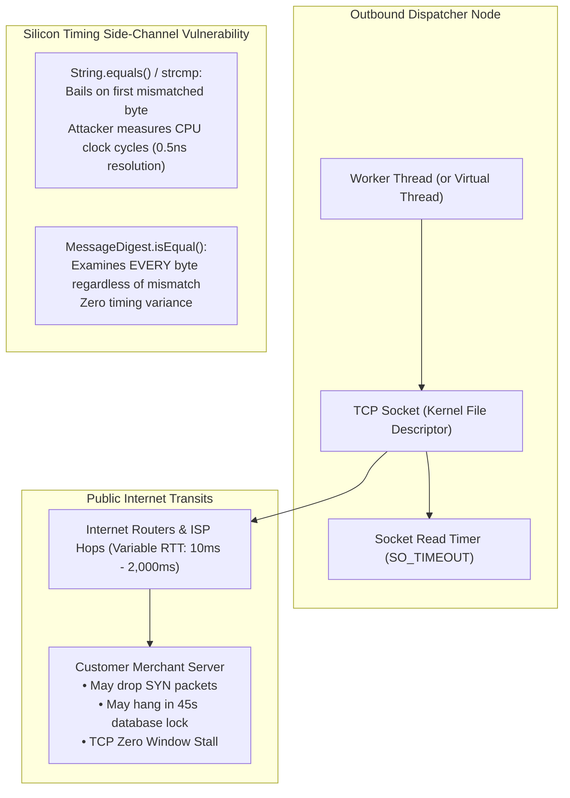
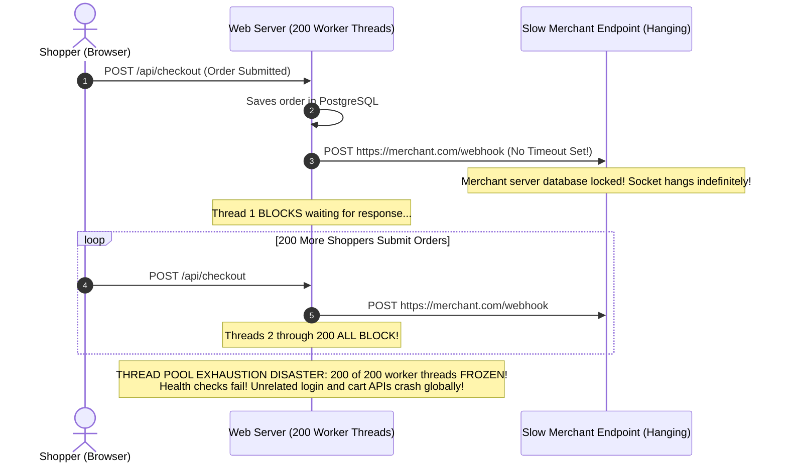
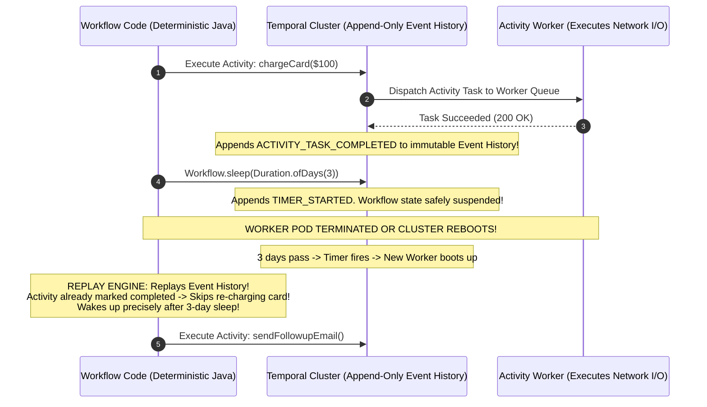
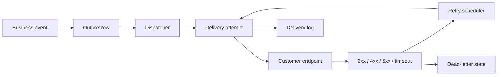

# Stripe-Grade Webhook Delivery & Durable Workflows

When an enterprise platform delivers an outbound webhook (e.g., Stripe notifying an e-commerce merchant of a `payment_intent.succeeded` event), the backend must issue an HTTP POST request across the public internet to an external server operated by a third party.

Unlike internal microservices running inside a monitored private cloud, external customer endpoints are fundamentally **unreliable, unpredictable, and hostile**:
- Merchant servers crash, experience DNS misconfigurations, or suffer routing blackouts.
- A merchant's unoptimized endpoint takes 45 seconds to process a webhook, threatening to **exhaust all outbound worker threads** and stall the entire platform.
- Attackers intercept and replay captured webhook payloads to duplicate order credits and extract unauthorized funds.
- Monolithic distributed transactions attempting to coordinate multi-step workflows across asynchronous services degenerate into brittle, unobservable "event spaghetti".

Senior backend engineers design bulletproof webhook platforms using **cryptographic HMAC-SHA256 timestamped signatures, constant-time verification, per-destination concurrency limits, multi-day jittered backoff schedules, and Temporal-style durable code execution**.

---

## Phase 1: Ground Floor (Physical First Principles)

To build a carrier-grade webhook and workflow platform, you must understand the physical networking characteristics of outbound HTTP calls and side-channel timing attacks.



### 1. The Physical Hazard of Unbounded TCP Sockets
When an application executes an outbound HTTP POST without explicit socket boundaries:
- **Connection Timeout**: If the customer's firewall drops TCP `SYN` packets silently, the operating system kernel retransmits `SYN` packets exponentially (`tcp_syn_retries`), leaving the socket hanging for up to **127 seconds**!
- **Read Timeout (`SO_TIMEOUT`)**: If the customer's server accepts the connection but hangs waiting on an internal database lock, the calling socket waits indefinitely in `SocketInputStream.socketRead0()`.
- Holding 500 threads in I/O wait queues exhausts the worker thread pool, causing internal queues to overflow and bringing down unrelated platform features.

### 2. The Mechanics of Timing Attacks on Signatures
When a customer server verifies an incoming cryptographic signature, a naive implementation uses standard string equality:
```java
// VULNERABLE: Breaks early on first mismatched character
if (calculatedSignature.equals(incomingSignature)) { ... }
```
- If the first character mismatches, `String.equals()` returns in $1\text{ CPU cycle}$.
- If the first 10 characters match, it returns in $10\text{ CPU cycles}$.
- Over thousands of requests across a local or low-jitter network, an attacker measuring sub-microsecond latency variations can deduce the correct HMAC signature byte-by-byte without knowing the signing secret!
- Defeating this requires **Constant-Time Byte Comparison** (`MessageDigest.isEqual`), which forces the CPU to evaluate every byte regardless of mismatch.

---

## Phase 2: The Naive Code (The Production Crashes)

### Crash Scenario 1: The Outbound Thread Pool Starvation Meltdown

A developer writes an event listener to dispatch webhooks whenever an order is completed:

```java
// DANGEROUS ANTI-PATTERN: Synchronous outbound dispatch with default timeouts
@Component
public class NaiveOrderEventListener {

    @Autowired
    private RestTemplate restTemplate; // Default RestTemplate: NO TIMEOUTS CONFIGURED!

    @EventListener
    public void onOrderCompleted(OrderCompletedEvent event) {
        String merchantWebhookUrl = event.getMerchantWebhookUrl();
        
        // FATAL MISTAKE: Synchronous outbound call over the public internet!
        // If merchant's server hangs for 60 seconds, this Tomcat thread is locked!
        restTemplate.postForObject(merchantWebhookUrl, event.getPayload(), String.class);
    }
}
```



#### What Happened in Production:
1. A major merchant deployed an unindexed database query in their webhook handler, causing their server to stall for 90 seconds on every incoming request.
2. Within 30 seconds of high Black Friday checkout volume, all 200 worker threads in the payment service were locked waiting on the merchant's hung sockets.
3. The platform's incoming connection backlog filled, and Kubernetes liveness probes timed out (`504 Gateway Timeout`).
4. The entire checkout platform crashed globally, losing hundreds of thousands of dollars in transactions.

---

### Crash Scenario 2: The Webhook Replay & Duplicate Credit Heist

A cryptocurrency exchange platform sends webhooks to notify merchants of successful deposits:

```java
// DANGEROUS ANTI-PATTERN: Signature without timestamp binding
public String generateVulnerableSignature(String payload, String secret) {
    // Only hashes payload: No timestamp, no replay defense!
    return hmacSha256(secret, payload);
}
```

#### What Happened in Production:
1. Customer deposited $10,000 into the exchange.
2. The platform dispatched a valid webhook: `POST https://merchant.com/webhook` with signature `v1=abcd1234...`.
3. An attacker intercepting network traffic on a public Wi-Fi access point captured the raw HTTP packet.
4. The attacker used a simple curl script to **replay the exact same HTTP POST request 500 times** against the merchant's endpoint.
5. Because the payload and signature matched perfectly, the merchant's receiver verified the HMAC and credited the attacker's account 500 times.
6. The attacker withdrew **$5,000,000 in unearned merchandise** before the accounting reconciliation caught the fraud.

---

### Crash Scenario 3: The Workflow Non-Determinism Corruption Crash

A developer implements an order fulfillment workflow using Temporal, but inserts non-deterministic calls inside the workflow definition:

```java
// DANGEROUS ANTI-PATTERN: Non-deterministic logic inside workflow definition
public class OrderFulfillmentWorkflowImpl implements OrderFulfillmentWorkflow {

    @Override
    public void processOrder(Order order) {
        // FATAL: System.currentTimeMillis() returns a DIFFERENT time on replay!
        long timestamp = System.currentTimeMillis();

        // FATAL: UUID.randomUUID() generates a DIFFERENT identifier on replay!
        String trackingId = UUID.randomUUID().toString();

        if (timestamp > 1740000000L) {
            Workflow.newActivityStub(ShippingActivity.class).shipFast(trackingId);
        } else {
            Workflow.newActivityStub(ShippingActivity.class).shipStandard(trackingId);
        }
    }
}
```

#### What Happened in Production:
- During a Kubernetes rolling upgrade, the worker pod executing the workflow was restarted.
- Temporal spun up a new pod and attempted to reconstruct the workflow state by **replaying the past Event History**.
- On replay, `System.currentTimeMillis()` returned a newer timestamp, and `UUID.randomUUID()` generated a different UUID.
- The replayed code attempted to branch differently than the recorded event history!
- Temporal halted the process with a fatal `NonDeterministicWorkflowException`, permanently corrupting 14,000 active customer workflows.

---

## Phase 3: Under the Hood (Mechanics, Stripe-Grade Engine & Temporal Architecture)

### 1. The Stripe Webhook Signature Standard (`Stripe-Signature`)

To prevent tampering, payload forging, and replay attacks, every outbound webhook must include a composite signature header:

```http
POST /webhook/receiver HTTP/1.1
Host: merchant.com
Content-Type: application/json
Stripe-Signature: t=1740837190,v1=5257a863e5e...
```

#### The Cryptographic Specification:
1. Capture the current Unix epoch timestamp in seconds: $t$.
2. Construct the signed string by concatenating the timestamp, a literal period, and the exact raw JSON byte payload:
   $$\text{Signed Payload} = t + "." + \text{raw\_json\_body}$$
3. Compute the HMAC-SHA256 signature using the merchant's unique signing secret:
   $$\text{v1} = \text{HexEncode}\left( \text{HMAC-SHA256}(\text{webhook\_secret}, \text{Signed Payload}) \right)$$
4. **Replay Validation**: The merchant verifies:
   $$| \text{Current Time} - t | \le 300\text{ seconds}$$
   If the timestamp is older than 5 minutes, the webhook is immediately discarded!

Line-by-line signature verification:

```java
String signedPayload = timestamp + "." + rawBody;
byte[] expected = hmacSha256(endpointSecret, signedPayload);
boolean valid = MessageDigest.isEqual(expected, providedSignature);
```

- `timestamp + "." + rawBody` recreates the exact bytes the provider signed. Use the raw request body, not a parsed-and-reformatted JSON object.
- `endpointSecret` must be the secret for this webhook endpoint, not a global application secret shared across tenants.
- `hmacSha256(...)` proves the sender knows the shared secret and that the body was not changed in transit.
- `MessageDigest.isEqual(...)` performs constant-time comparison. A normal string comparison can leak timing differences byte by byte.
- The timestamp tolerance rejects replayed webhooks that were valid in the past.

Proof drill: send the same payload with a changed body, a changed timestamp, a wrong secret, and an old timestamp. All four should fail before business code runs.

---

### 2. Outbound Worker Architecture: Concurrency Limits & Circuit Breakers

To guarantee that a slow merchant cannot degrade the platform:

```mermaid
flowchart TD
    subgraph EventQueue["Redis / PostgreSQL Event Outbox"]
        Events["Outbox Events (Pending Delivery)"]
    end

    subgraph DispatcherPool["Isolated Webhook Dispatcher Workers"]
        Worker["Worker Thread"]
        Limiter{"Per-Merchant Concurrency Limiter\n(Max 5 in-flight requests per merchant)"}
        Breaker{"Merchant Circuit Breaker\nState: Closed / Open / Half-Open"}
        HTTP["HTTP Client\nConnect Timeout: 2s\nRead Timeout: 5s"]

        Events --> Worker --> Limiter
        Limiter -->|Slot Available| Breaker
        Limiter -->|Slot Full (>= 5)| DelayQueue["Requeue to Backlog with Delay"]
        Breaker -->|Closed (Healthy)| HTTP
        Breaker -->|Open (Failing 100%)| Skip["Skip attempt; back off 1 hour"]
    end
```

#### Strict Socket Limits (The 7-Second Ceiling):
- **Connect Timeout**: 2 seconds.
- **Read Timeout**: 5 seconds.
- Total maximum execution window: **7 seconds**. If the customer has not returned an HTTP 2xx within 7 seconds, terminate the socket immediately.

---

### 3. Multi-Day Exponential Backoff with Full Jitter

When a merchant server suffers an extended outage, naive retries (e.g. retrying every 5 minutes) will exhaust attempts in 30 minutes.

Production webhook engines retry across a **72-hour window** using randomized exponential backoff with full jitter:

$$T_{\text{sleep}} = \text{random}\left(0, \min\left(M, B \cdot 2^{\text{attempt}}\right)\right)$$

```mermaid
flowchart LR
    E[Event Triggered] --> A1["Attempt 1: Immediate"]
    A1 -->|Fails| A2["Attempt 2: ~5 mins (Jittered)"]
    A2 -->|Fails| A3["Attempt 3: ~30 mins"]
    A3 -->|Fails| A4["Attempt 4: ~2 hours"]
    A4 -->|Fails| A5["Attempt 5: ~8 hours"]
    A5 -->|Fails| A6["Attempt 6: ~24 hours"]
    A6 -->|Fails| A7["Attempt 7: ~72 hours"]
    A7 -->|Fails| DLT["Dead-Letter Queue & Customer Email Alert"]
```



---

### 4. Production Stripe-Grade Webhook Dispatcher Implementation

Below is the production-grade implementation featuring HMAC-SHA256 signing, strict socket timeouts, and constant-time verification:

```java
package com.backend.webhooks.service;

import org.slf4j.Logger;
import org.slf4j.LoggerFactory;
import org.springframework.stereotype.Service;

import javax.crypto.Mac;
import javax.crypto.spec.SecretKeySpec;
import java.net.URI;
import java.net.http.HttpClient;
import java.net.http.HttpRequest;
import java.net.http.HttpResponse;
import java.nio.charset.StandardCharsets;
import java.security.MessageDigest;
import java.time.Duration;
import java.time.Instant;
import java.util.HexFormat;

@Service
public class StripeGradeWebhookDispatcher {

    private static final Logger log = LoggerFactory.getLogger(StripeGradeWebhookDispatcher.class);
    private static final String HMAC_SHA256 = "HmacSHA256";

    private final HttpClient httpClient;

    public StripeGradeWebhookDispatcher() {
        // Enforce strict 2-second connection timeout at the socket level
        this.httpClient = HttpClient.newBuilder()
                .connectTimeout(Duration.ofSeconds(2))
                .followRedirects(HttpClient.Redirect.NEVER) // Prevent SSRF redirect attacks
                .build();
    }

    /**
     * Dispatches signed webhook payload with hard socket boundaries.
     */
    public boolean deliverWebhook(String targetUrl, String jsonPayload, String signingSecret) {
        long epochTimestamp = Instant.now().getEpochSecond();
        String signature = calculateHmac(epochTimestamp, jsonPayload, signingSecret);
        String signatureHeader = "t=" + epochTimestamp + ",v1=" + signature;

        HttpRequest request = HttpRequest.newBuilder()
                .uri(URI.create(targetUrl))
                .timeout(Duration.ofSeconds(5)) // Hard 5-second socket read timeout
                .header("Content-Type", "application/json")
                .header("User-Agent", "Platform-Webhook-Engine/2.0")
                .header("Stripe-Signature", signatureHeader)
                .POST(HttpRequest.BodyPublishers.ofString(jsonPayload, StandardCharsets.UTF_8))
                .build();

        try {
            HttpResponse<String> response = httpClient.send(request, HttpResponse.BodyHandlers.ofString());
            int statusCode = response.statusCode();

            if (statusCode >= 200 && statusCode < 300) {
                log.info("Webhook successfully delivered to {}: HTTP {}", targetUrl, statusCode);
                return true;
            }

            log.warn("Webhook delivery rejected by {}: HTTP {}", targetUrl, statusCode);
            return false;
        } catch (Exception ex) {
            log.error("Outbound socket exception calling {}: {}", targetUrl, ex.getMessage());
            return false;
        }
    }

    /**
     * Signs timestamp + "." + payload using HMAC-SHA256.
     */
    public static String calculateHmac(long timestamp, String rawPayload, String secret) {
        try {
            String signedContent = timestamp + "." + rawPayload;
            Mac mac = Mac.getInstance(HMAC_SHA256);
            SecretKeySpec secretKey = new SecretKeySpec(secret.getBytes(StandardCharsets.UTF_8), HMAC_SHA256);
            mac.init(secretKey);
            byte[] rawHmac = mac.doFinal(signedContent.getBytes(StandardCharsets.UTF_8));
            return HexFormat.of().formatHex(rawHmac);
        } catch (Exception ex) {
            throw new IllegalStateException("Failed to calculate HMAC-SHA256 signature", ex);
        }
    }

    /**
     * Receiver Verification: Enforces replay defense and constant-time comparison.
     */
    public static boolean verifyIncomingWebhook(
            long timestamp,
            String rawPayload,
            String secret,
            String incomingV1Signature,
            long toleranceSeconds) {

        long currentTimestamp = Instant.now().getEpochSecond();
        
        // 1. Replay Attack Prevention
        if (Math.abs(currentTimestamp - timestamp) > toleranceSeconds) {
            return false; // Signature expired or generated in future!
        }

        // 2. Compute Expected Signature
        String expectedSignature = calculateHmac(timestamp, rawPayload, secret);

        // 3. Constant-Time Comparison (Neutralizes timing side-channel attacks)
        return MessageDigest.isEqual(
                expectedSignature.getBytes(StandardCharsets.UTF_8),
                incomingV1Signature.getBytes(StandardCharsets.UTF_8)
        );
    }
}
```

---

### 5. Durable Code Execution: Temporal / Cadence Internals

When a business process takes days or weeks to execute (e.g., User Onboarding: Send Welcome Email $\rightarrow$ Sleep 3 days $\rightarrow$ Check Activity $\rightarrow$ Grant Credit), traditional event-driven Kafka architectures collapse under fragmented state tables.

**Temporal** provides **Durable Execution**: write ordinary, sequential Java code, and Temporal guarantees that execution resumes seamlessly even across server crashes and cluster reboots.



#### Determinism: The Golden Rule of Workflows
Because Temporal state is reconstructed via **Event Sourcing Replay**:
- All non-deterministic logic (database queries, network HTTP calls, `UUID.randomUUID()`, `Instant.now()`) **must run inside Activities**.
- The workflow code itself must remain strictly deterministic.

---

## Webhook & Workflow Fundamentals Drill

Webhook systems are reliability systems wearing an HTTP costume. The hard parts are signature verification, idempotency, retries, ordering, backoff, dead-letter handling, and giving customers enough observability to debug their own endpoints.



### Outbound Webhook Design Questions

| Question | Strong design answer |
| --- | --- |
| How do you prove authenticity? | Sign payloads with timestamped HMAC and rotate secrets. |
| What if the customer endpoint is down? | Retry with exponential backoff and cap total retry window. |
| What if the same event is delivered twice? | Include stable event ID and require idempotent consumers. |
| Does ordering matter? | Use per-aggregate ordering keys or document that ordering is not guaranteed. |
| How can customers debug failures? | Provide attempt logs, response codes, timestamps, and replay controls. |
| What if delivery never succeeds? | Move to dead-letter state and alert or expose manual replay. |

### Inbound Webhook Design Questions

Inbound webhooks are equally dangerous because external providers retry aggressively.

```markdown
Verify signature before parsing trust-sensitive fields.
Store event ID before performing side effects.
Return 2xx only after durable acceptance.
Process slow work asynchronously.
Treat duplicate delivery as normal.
```

### Workflow Engine Mental Model

A workflow engine is a durable state machine:

```markdown
State + event -> decision + next state
```

Example payment workflow:

```markdown
CREATED -> AUTHORIZED -> CAPTURED -> SETTLED
CREATED -> AUTH_FAILED
AUTHORIZED -> CAPTURE_FAILED -> REFUND_PENDING
```

The database must remember the current state and enough history to resume after crashes. A workflow that only lives in memory is not a production workflow.

### Common Failure Modes

| Failure | Result | Defense |
| --- | --- | --- |
| Timeout after customer processed webhook | Sender retries and customer may duplicate work. | Stable event ID and idempotent receiver. |
| Secret leaked | Attackers forge events. | Secret rotation and timestamp tolerance. |
| Retry storm | Customer outage becomes traffic flood. | Exponential backoff, jitter, per-destination throttles. |
| Out-of-order delivery | Customer sees impossible transitions. | Sequence numbers or per-resource ordering. |
| Missing delivery logs | Support cannot debug. | Persist every attempt and response summary. |

### Build-Break-Fix Drill

Build:

```markdown
Create an outbound webhook dispatcher with event ID, HMAC signature, retry count, and delivery log.
```

Break:

```markdown
Make the customer endpoint timeout after processing.
Return 500 for 30 minutes.
Rotate the webhook secret while events are in flight.
Deliver event version 2 before version 1.
```

Fix:

```markdown
Add idempotency guidance and stable IDs.
Add exponential backoff with jitter.
Support overlapping old and new secrets during rotation.
Add per-aggregate sequence numbers when ordering is required.
```

## Phase 4: Senior Interview Ace (Junior vs Staff Phrasing)

| Question / Scenario | Junior Developer Answer | Senior / Staff Backend Engineer Answer |
| :--- | :--- | :--- |
| **Why is constant-time byte comparison mandatory when verifying webhook signatures?** | "It makes the verification faster and more secure." | "Standard string equality (`String.equals()`) terminates and returns `false` at the very first mismatched byte. An attacker sending thousands of forged signatures across a network can measure sub-microsecond variations in response times (a **Timing Side-Channel Attack**) to deduce the valid signature byte-by-byte. Using `MessageDigest.isEqual()` ensures that the CPU checks **every single byte regardless of mismatch**, guaranteeing constant execution time and neutralizing timing analysis." |
| **How do you protect a webhook dispatching system from a merchant whose server hangs for 60 seconds?** | "We put the webhook calls in a background `@Async` thread pool." | "Background threads still consume physical OS thread stacks and kernel socket descriptors. If 500 tasks hang for 60 seconds, the thread pool is exhausted, and the task queue overflows. We enforce three strict defenses: (1) **Hard Socket Timeouts**: 2-second connect timeout and 5-second read timeout ($7\text{s}$ ceiling). (2) **Per-Destination Concurrency Limiting**: Limit in-flight requests to a maximum of 5 per merchant URL. (3) **Outbound Circuit Breaking**: If an endpoint fails 10 consecutive calls, open the circuit and pause deliveries to that merchant for 1 hour." |
| **How does timestamp binding in HMAC-SHA256 prevent replay attacks?** | "It tells the receiver when the message was sent." | "If a signature is computed purely over the payload (`HMAC(secret, payload)`), an attacker who sniffs the packet can replay the exact same HTTP request days later, causing the merchant to duplicate fulfillment. By constructing the signature over `timestamp + "." + payload` and validating that `abs(current_time - t) <= 300` seconds, customer servers **reject any replayed packet older than 5 minutes**, rendering captured packets useless to attackers." |
| **Why is multi-day exponential backoff with full jitter superior to fixed retry intervals?** | "It gives the customer more time to fix their server." | "A fixed retry schedule (e.g. retry every 5 minutes) burns through a retry limit in 30 minutes, permanently abandoning events when a merchant suffers a weekend outage. Furthermore, when the merchant recovers, synchronized retries trigger a **Reconnection Thundering Herd**. A 72-hour backoff schedule with Full Jitter spreads retry attempts over 3 days while randomizing delivery intervals across workers, smoothing load and maximizing delivery success." |
| **What makes Temporal's Durable Execution fundamentally different from an event-driven Kafka Saga?** | "Temporal uses a workflow engine instead of message queues." | "In a choreographed Kafka Saga, state is fragmented across multiple service databases and message topics. Adding timers, retry policies, and compensation logic requires bespoke state tables and complex dead-letter routing. Temporal implements **Durable Execution via Event Sourcing Replay**: multi-step processes are written as standard, imperative code with loops and sleeps. State transitions are durably recorded in an append-only event history. If a pod crashes mid-execution, a new pod replays the history to reconstruct state and **resumes execution seamlessly from the exact failed step**." |

---

## Production Debugging Checklist

<AccordionGroup>
  <Accordion title="1. High Outbound Connection Timeouts & Thread Saturation">
    - [ ] Check active worker thread count and thread dump: `jcmd <PID> Thread.print`. Look for threads in `SocketInputStream.socketRead0()`.
    - [ ] Verify that the `HttpClient` enforces both `connectTimeout(Duration.ofSeconds(2))` and request `timeout(Duration.ofSeconds(5))`.
    - [ ] Check per-customer concurrency metrics: Ensure slow merchant endpoints are throttled to a maximum of 5 concurrent in-flight sockets.
  </Accordion>

  <Accordion title="2. Webhook Signature Verification Failures on Customer Side">
    - [ ] Verify that the customer is signing the raw, unparsed JSON payload bytes (not pretty-printed or re-serialized JSON).
    - [ ] Verify that the customer server clock is synchronized via NTP ($| t_{\text{header}} - t_{\text{local}} | \le 300\text{s}$).
    - [ ] Ensure customer uses constant-time comparison: `MessageDigest.isEqual()`.
  </Accordion>

  <Accordion title="3. Temporal NonDeterministicWorkflowException on Pod Restart">
    - [ ] Inspect workflow code for direct calls to `Instant.now()`, `System.currentTimeMillis()`, or `UUID.randomUUID()`.
    - [ ] Ensure all non-deterministic functions use `Workflow.currentTimeMillis()` or run inside `@ActivityMethod` stubs.
    - [ ] Verify that workflow code does not perform direct network I/O or database queries.
  </Accordion>
</AccordionGroup>

---

## Done Checklist

<Check>
Outbound HTTP webhook calls enforce strict socket boundaries (2s connect timeout, 5s read timeout).
</Check>
<Check>
Webhooks are signed using HMAC-SHA256 bound to a Unix epoch timestamp (`t=<timestamp>,v1=<signature>`).
</Check>
<Check>
Replay attacks are defeated by validating timestamp drift within a 300-second tolerance window.
</Check>
<Check>
Signature verification strictly utilizes constant-time comparison (`MessageDigest.isEqual`) to prevent timing side-channel attacks.
</Check>
<Check>
Outbound traffic enforces per-destination concurrency limits and circuit breakers to protect worker pools.
</Check>
<Check>
Multi-day exponential backoff with full random jitter provides a 72-hour delivery recovery window.
</Check>
<Check>
Long-running workflows use deterministic event sourcing replay (Temporal) to guarantee completion across pod restarts.
</Check>
